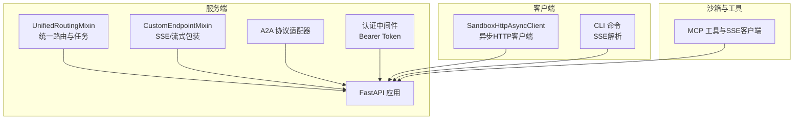
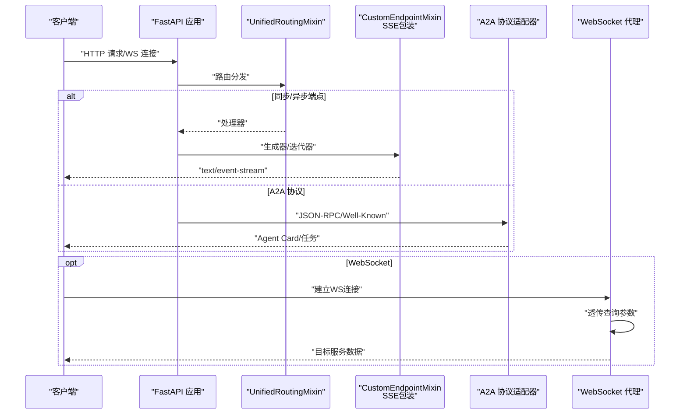
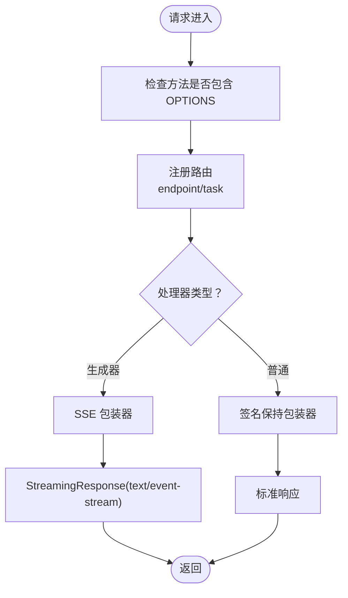
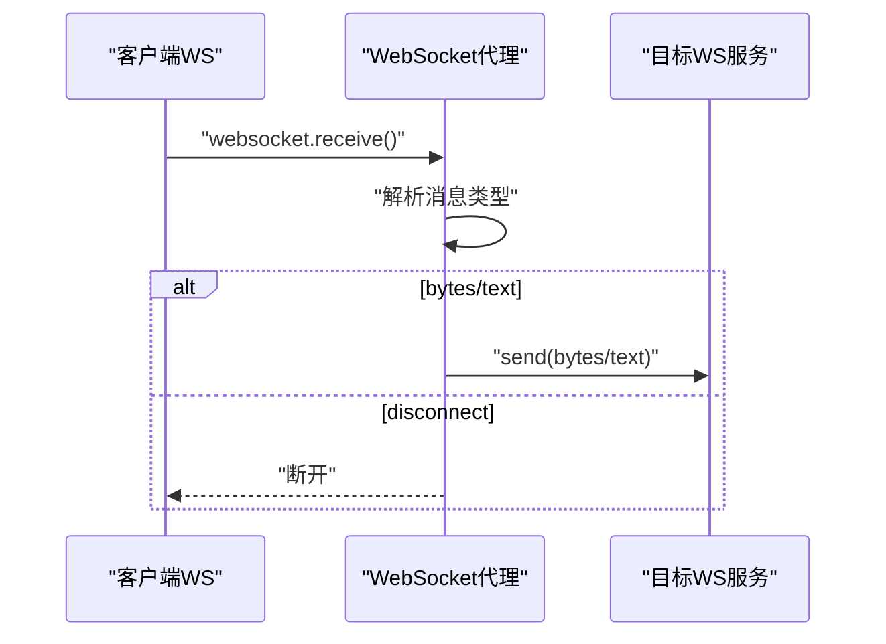
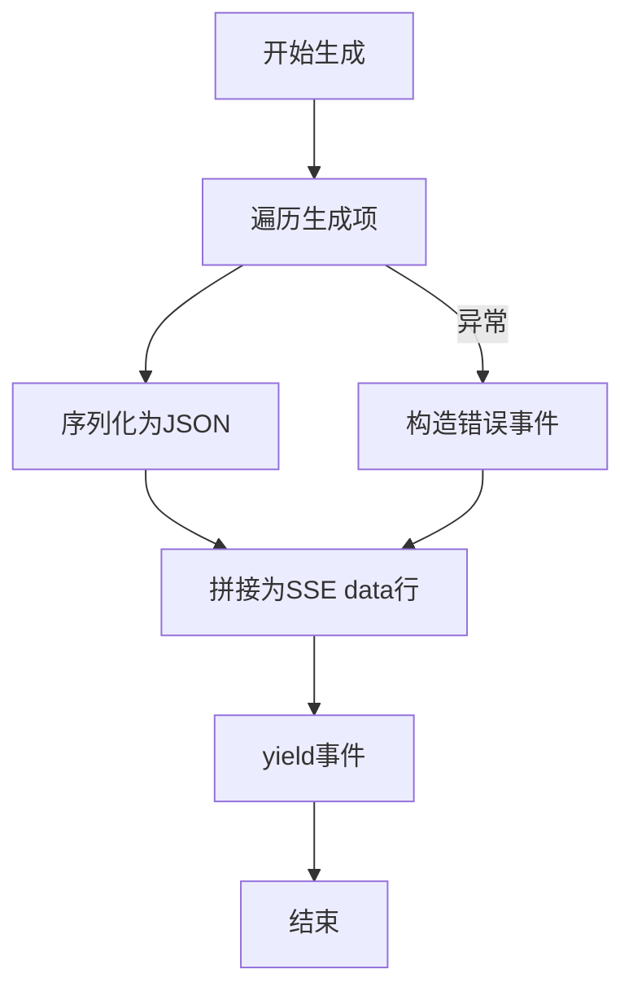
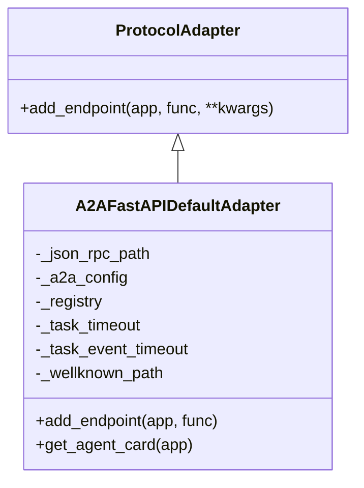
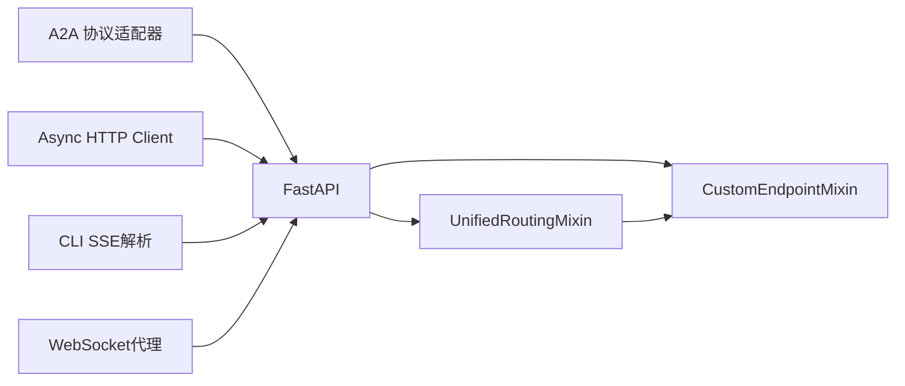

# API参考

<cite>
**本文引用的文件**
- [unified_routing_mixin.py](file://src/agentscope_runtime/engine/deployers/utils/service_utils/routing/unified_routing_mixin.py)
- [custom_endpoint_mixin.py](file://src/agentscope_runtime/engine/deployers/utils/service_utils/routing/custom_endpoint_mixin.py)
- [protocol_adapter.py](file://src/agentscope_runtime/engine/deployers/adapter/protocol_adapter.py)
- [a2a_protocol_adapter.py](file://src/agentscope_runtime/engine/deployers/adapter/a2a/a2a_protocol_adapter.py)
- [stream.py（适配器）](file://src/agentscope_runtime/adapters/agentscope/stream.py)
- [async_http_client.py](file://src/agentscope_runtime/sandbox/client/async_http_client.py)
- [app.py（沙箱管理器服务）](file://src/agentscope_runtime/sandbox/manager/server/app.py)
- [mcp_utils.py](file://src/agentscope_runtime/sandbox/box/shared/routers/mcp_utils.py)
- [chat.py（CLI SSE解析）](file://src/agentscope_runtime/cli/commands/chat.py)
- [exception.py（异常模型）](file://src/agentscope_runtime/engine/schemas/exception.py)
- [constant.py（框架类型常量）](file://src/agentscope_runtime/engine/constant.py)
- [version.py（版本号）](file://src/agentscope_runtime/version.py)
</cite>

## 目录
1. [简介](#简介)
2. [项目结构与API概览](#项目结构与api概览)
3. [核心组件](#核心组件)
4. [架构总览](#架构总览)
5. [详细组件分析](#详细组件分析)
6. [依赖关系分析](#依赖关系分析)
7. [性能与可扩展性](#性能与可扩展性)
8. [故障排查与错误处理](#故障排查与错误处理)
9. [结论](#结论)
10. [附录：常见用例与最佳实践](#附录常见用例与最佳实践)

## 简介
本文件为 AgentScope Runtime 的全面 API 参考，覆盖以下协议与能力：
- HTTP REST API：同步与流式（SSE）端点注册、任务提交与轮询、统一路由与装饰器机制
- WebSocket：代理转发、查询参数透传、目标服务连接
- SSE 流式传输：SSE 事件序列化、错误事件封装、读取超时控制
- 协议适配：A2A 协议适配器（Agent Card、Well-Known、任务管理）
- 客户端与工具：异步 HTTP 客户端、CLI 中的 SSE 解析
- 安全与认证：Bearer Token 校验、未配置时的降级行为
- 版本与兼容：运行时版本、框架类型白名单

## 项目结构与API概览
AgentScope Runtime 在服务端通过 FastAPI 提供统一的路由与流式能力，并通过适配器支持多协议（如 A2A）。沙箱侧提供 HTTP 客户端与 CLI 工具用于访问与调试。

图表来源
- [unified_routing_mixin.py:16-101](file://src/agentscope_runtime/engine/deployers/utils/service_utils/routing/unified_routing_mixin.py#L16-L101)
- [custom_endpoint_mixin.py:15-91](file://src/agentscope_runtime/engine/deployers/utils/service_utils/routing/custom_endpoint_mixin.py#L15-L91)
- [a2a_protocol_adapter.py:136-258](file://src/agentscope_runtime/engine/deployers/adapter/a2a/a2a_protocol_adapter.py#L136-L258)
- [async_http_client.py:18-216](file://src/agentscope_runtime/sandbox/client/async_http_client.py#L18-L216)
- [chat.py（CLI SSE解析）:517-521](file://src/agentscope_runtime/cli/commands/chat.py#L517-L521)

章节来源
- [unified_routing_mixin.py:16-101](file://src/agentscope_runtime/engine/deployers/utils/service_utils/routing/unified_routing_mixin.py#L16-L101)
- [custom_endpoint_mixin.py:15-91](file://src/agentscope_runtime/engine/deployers/utils/service_utils/routing/custom_endpoint_mixin.py#L15-L91)
- [a2a_protocol_adapter.py:136-258](file://src/agentscope_runtime/engine/deployers/adapter/a2a/a2a_protocol_adapter.py#L136-L258)
- [async_http_client.py:18-216](file://src/agentscope_runtime/sandbox/client/async_http_client.py#L18-L216)
- [chat.py（CLI SSE解析）:517-521](file://src/agentscope_runtime/cli/commands/chat.py#L517-L521)

## 核心组件
- 统一路由与任务系统：支持装饰器注册自定义端点、异步/同步生成器处理、任务提交与状态轮询
- SSE/流式传输：自动将生成器输出转为 text/event-stream，统一错误事件封装
- 协议适配：A2A 协议适配器负责 Agent Card、Well-Known、任务存储与注册
- 认证中间件：基于 Bearer Token 的鉴权，未配置时记录警告并跳过校验
- 异步 HTTP 客户端：健康检查、工具调用、变更提交等常用操作
- CLI 工具：SSE 行解析、流式打印、中断处理

章节来源
- [unified_routing_mixin.py:103-120](file://src/agentscope_runtime/engine/deployers/utils/service_utils/routing/unified_routing_mixin.py#L103-L120)
- [custom_endpoint_mixin.py:126-235](file://src/agentscope_runtime/engine/deployers/utils/service_utils/routing/custom_endpoint_mixin.py#L126-L235)
- [a2a_protocol_adapter.py:222-258](file://src/agentscope_runtime/engine/deployers/adapter/a2a/a2a_protocol_adapter.py#L222-L258)
- [app.py（沙箱管理器服务）:116-135](file://src/agentscope_runtime/sandbox/manager/server/app.py#L116-L135)
- [async_http_client.py:54-114](file://src/agentscope_runtime/sandbox/client/async_http_client.py#L54-L114)

## 架构总览
下图展示从客户端到服务端的关键交互路径，包括 HTTP/SSE/WebSocket 以及 A2A 协议适配。

图表来源
- [unified_routing_mixin.py:103-120](file://src/agentscope_runtime/engine/deployers/utils/service_utils/routing/unified_routing_mixin.py#L103-L120)
- [custom_endpoint_mixin.py:126-235](file://src/agentscope_runtime/engine/deployers/utils/service_utils/routing/custom_endpoint_mixin.py#L126-L235)
- [a2a_protocol_adapter.py:222-258](file://src/agentscope_runtime/engine/deployers/adapter/a2a/a2a_protocol_adapter.py#L222-L258)
- [app.py（沙箱管理器服务）:297-333](file://src/agentscope_runtime/sandbox/manager/server/app.py#L297-L333)

## 详细组件分析

### HTTP REST API 规范
- 统一路由与端点注册
  - 自定义端点装饰器：支持指定 HTTP 方法列表，默认 POST
  - 任务端点装饰器：提交任务至 Celery 或本地队列，返回任务ID与队列信息；GET 路径用于轮询状态
  - 内部路由标记：避免系统内部路由被发现或暴露
- 参数解析与签名保持：同步/异步处理器均保留原函数签名，确保 FastAPI 自动参数注入
- SSE 流式响应：将生成器输出序列化为 SSE 事件，异常时发送统一错误事件

图表来源
- [unified_routing_mixin.py:103-120](file://src/agentscope_runtime/engine/deployers/utils/service_utils/routing/unified_routing_mixin.py#L103-L120)
- [custom_endpoint_mixin.py:15-91](file://src/agentscope_runtime/engine/deployers/utils/service_utils/routing/custom_endpoint_mixin.py#L15-L91)
- [custom_endpoint_mixin.py:126-235](file://src/agentscope_runtime/engine/deployers/utils/service_utils/routing/custom_endpoint_mixin.py#L126-L235)

章节来源
- [unified_routing_mixin.py:103-120](file://src/agentscope_runtime/engine/deployers/utils/service_utils/routing/unified_routing_mixin.py#L103-L120)
- [custom_endpoint_mixin.py:15-91](file://src/agentscope_runtime/engine/deployers/utils/service_utils/routing/custom_endpoint_mixin.py#L15-L91)
- [custom_endpoint_mixin.py:126-235](file://src/agentscope_runtime/engine/deployers/utils/service_utils/routing/custom_endpoint_mixin.py#L126-L235)

### WebSocket 接口规范
- 连接处理：从客户端接收消息，按类型转发（text/bytes），断开时清理
- 查询参数透传：将客户端查询参数附加到目标 URL
- 目标服务连接：使用 websockets 库连接目标 WebSocket 服务器
- 断线与异常：捕获断开异常并记录日志

图表来源
- [app.py（沙箱管理器服务）:297-333](file://src/agentscope_runtime/sandbox/manager/server/app.py#L297-L333)

章节来源
- [app.py（沙箱管理器服务）:297-333](file://src/agentscope_runtime/sandbox/manager/server/app.py#L297-L333)

### SSE 流式传输规范
- 事件序列化：将任意可序列化对象递归序列化为 JSON，SSE data 行输出
- 错误事件：捕获异常并发送包含错误类型与消息的统一错误事件
- 读取超时：SSE 客户端支持读取超时配置，便于长连接场景下的资源回收
- CLI 解析：逐行解析 data: 前缀，支持增量打印

图表来源
- [custom_endpoint_mixin.py:94-124](file://src/agentscope_runtime/engine/deployers/utils/service_utils/routing/custom_endpoint_mixin.py#L94-L124)
- [mcp_utils.py:73-102](file://src/agentscope_runtime/sandbox/box/shared/routers/mcp_utils.py#L73-L102)
- [chat.py（CLI SSE解析）:517-521](file://src/agentscope_runtime/cli/commands/chat.py#L517-L521)

章节来源
- [custom_endpoint_mixin.py:94-124](file://src/agentscope_runtime/engine/deployers/utils/service_utils/routing/custom_endpoint_mixin.py#L94-L124)
- [mcp_utils.py:73-102](file://src/agentscope_runtime/sandbox/box/shared/routers/mcp_utils.py#L73-L102)
- [chat.py（CLI SSE解析）:517-521](file://src/agentscope_runtime/cli/commands/chat.py#L517-L521)

### 协议适配：A2A 协议
- Agent Card 构建：从配置填充名称、描述、URL、版本、技能、能力等字段
- Well-Known 端点：暴露 Agent Card 的标准位置
- 任务管理：默认内存任务存储、任务超时与事件超时配置
- 注册中心集成：可选注册到多个 A2A 注册中心，失败不阻塞启动

图表来源
- [protocol_adapter.py:6-25](file://src/agentscope_runtime/engine/deployers/adapter/protocol_adapter.py#L6-L25)
- [a2a_protocol_adapter.py:136-258](file://src/agentscope_runtime/engine/deployers/adapter/a2a/a2a_protocol_adapter.py#L136-L258)

章节来源
- [protocol_adapter.py:6-25](file://src/agentscope_runtime/engine/deployers/adapter/protocol_adapter.py#L6-L25)
- [a2a_protocol_adapter.py:136-258](file://src/agentscope_runtime/engine/deployers/adapter/a2a/a2a_protocol_adapter.py#L136-L258)

### 客户端与工具
- 异步 HTTP 客户端：健康检查、等待就绪、统一请求封装、工具调用、变更提交等
- CLI 工具：SSE 行解析、增量打印、中断与 EOF 处理、错误回退

章节来源
- [async_http_client.py:54-114](file://src/agentscope_runtime/sandbox/client/async_http_client.py#L54-L114)
- [chat.py（CLI SSE解析）:517-521](file://src/agentscope_runtime/cli/commands/chat.py#L517-L521)

## 依赖关系分析
- 路由层依赖 FastAPI 路由系统，通过 mixin 扩展任务与自定义端点能力
- SSE 包装器依赖 StreamingResponse 与 JSON 序列化，保证事件格式一致性
- A2A 适配器依赖 a2a 类库与注册中心，支持可选注册
- 客户端依赖 httpx 与 websockets，分别用于 HTTP 与 WebSocket

图表来源
- [unified_routing_mixin.py:16-101](file://src/agentscope_runtime/engine/deployers/utils/service_utils/routing/unified_routing_mixin.py#L16-L101)
- [custom_endpoint_mixin.py:15-91](file://src/agentscope_runtime/engine/deployers/utils/service_utils/routing/custom_endpoint_mixin.py#L15-L91)
- [a2a_protocol_adapter.py:136-258](file://src/agentscope_runtime/engine/deployers/adapter/a2a/a2a_protocol_adapter.py#L136-L258)
- [async_http_client.py:18-216](file://src/agentscope_runtime/sandbox/client/async_http_client.py#L18-L216)
- [chat.py（CLI SSE解析）:517-521](file://src/agentscope_runtime/cli/commands/chat.py#L517-L521)

## 性能与可扩展性
- 流式传输：SSE 事件按块输出，降低内存峰值；建议在生成器中及时 yield
- 任务队列：支持 Celery 队列与本地队列，根据负载选择；注意任务超时与事件超时配置
- 超时控制：SSE 读取超时与连接超时可配置，避免长时间空闲连接占用资源
- 并发与签名保持：包装器保留函数签名，确保参数解析与依赖注入高效执行

[本节为通用指导，无需列出具体文件来源]

## 故障排查与错误处理
- 认证失败：当配置 BEARER_TOKEN 且请求未携带或令牌无效时，返回 401 并提示需要 Bearer 认证
- 网关超时：业务异常中包含网关超时异常类型，可用于区分上游超时
- SSE 错误事件：生成器抛出异常时，会发送包含错误类型与消息的统一错误事件
- CLI 增量打印：逐行解析 data: 前缀，遇到异常或中断时优雅退出并打印错误

章节来源
- [app.py（沙箱管理器服务）:116-135](file://src/agentscope_runtime/sandbox/manager/server/app.py#L116-L135)
- [exception.py（异常模型）:198-251](file://src/agentscope_runtime/engine/schemas/exception.py#L198-L251)
- [custom_endpoint_mixin.py:166-176](file://src/agentscope_runtime/engine/deployers/utils/service_utils/routing/custom_endpoint_mixin.py#L166-L176)
- [chat.py（CLI SSE解析）:517-521](file://src/agentscope_runtime/cli/commands/chat.py#L517-L521)

## 结论
AgentScope Runtime 提供了统一的 FastAPI 路由与流式能力，支持任务型端点、SSE 流式输出与 A2A 协议适配。通过 Bearer Token 认证与可配置的超时策略，兼顾安全性与稳定性。结合异步 HTTP 客户端与 CLI 工具，开发者可以快速构建与调试实时交互应用。

[本节为总结，无需列出具体文件来源]

## 附录：常见用例与最佳实践
- 使用装饰器注册自定义端点：endpoint 装饰器支持指定方法列表，默认 POST；task 装饰器用于提交后台任务并轮询状态
- SSE 流式输出：在生成器中按需 yield，异常时自动发送统一错误事件；CLI 中逐行解析 data: 前缀以实现增量打印
- A2A 协议：通过 A2A 协议适配器暴露 Agent Card 与 JSON-RPC 端点，支持可选注册中心
- 客户端调用：使用异步 HTTP 客户端进行健康检查、工具调用与变更提交；WebSocket 代理用于 GUI 沙箱等场景
- 版本与兼容：遵循运行时版本与框架类型白名单，确保部署与适配的一致性

章节来源
- [unified_routing_mixin.py:103-120](file://src/agentscope_runtime/engine/deployers/utils/service_utils/routing/unified_routing_mixin.py#L103-L120)
- [custom_endpoint_mixin.py:126-235](file://src/agentscope_runtime/engine/deployers/utils/service_utils/routing/custom_endpoint_mixin.py#L126-L235)
- [a2a_protocol_adapter.py:222-258](file://src/agentscope_runtime/engine/deployers/adapter/a2a/a2a_protocol_adapter.py#L222-L258)
- [async_http_client.py:54-114](file://src/agentscope_runtime/sandbox/client/async_http_client.py#L54-L114)
- [version.py（版本号）:1-3](file://src/agentscope_runtime/version.py#L1-L3)
- [constant.py（框架类型常量）:1-10](file://src/agentscope_runtime/engine/constant.py#L1-L10)