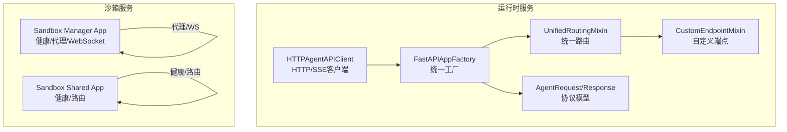
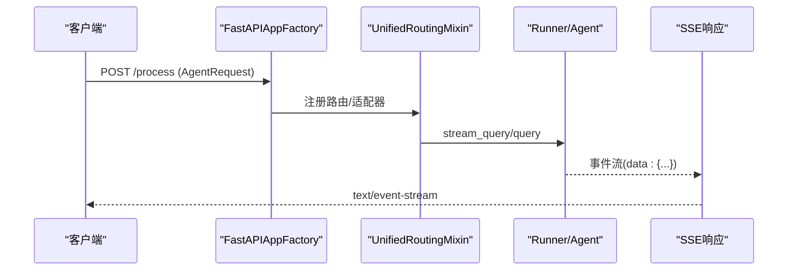
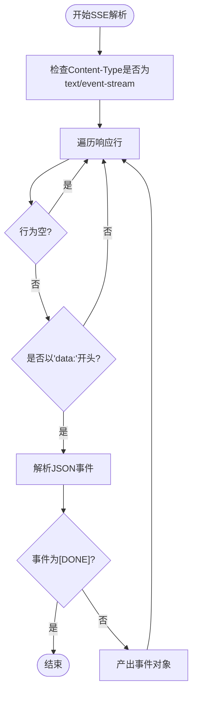
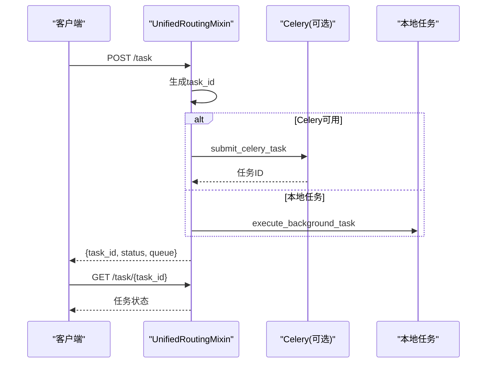
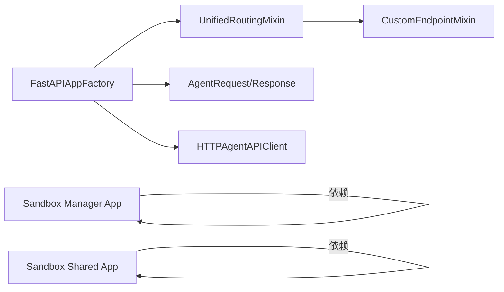

# HTTP API

<cite>
**本文引用的文件**
- [fastapi_factory.py](file://src/agentscope_runtime/engine/deployers/utils/service_utils/fastapi_factory.py)
- [agent_schemas.py](file://src/agentscope_runtime/engine/schemas/agent_schemas.py)
- [response_api.py](file://src/agentscope_runtime/engine/schemas/response_api.py)
- [agent_api_client.py](file://src/agentscope_runtime/engine/helpers/agent_api_client.py)
- [unified_routing_mixin.py](file://src/agentscope_runtime/engine/deployers/utils/service_utils/routing/unified_routing_mixin.py)
- [custom_endpoint_mixin.py](file://src/agentscope_runtime/engine/deployers/utils/service_utils/routing/custom_endpoint_mixin.py)
- [app.py](file://src/agentscope_runtime/sandbox/manager/server/app.py)
- [app.py](file://src/agentscope_runtime/sandbox/box/shared/app.py)
- [call.md](file://cookbook/en/call.md)
- [protocol.md](file://cookbook/zh/protocol.md)
- [test_agent_app_custom_endpoint.py](file://tests/unit/test_agent_app_custom_endpoint.py)
</cite>

## 目录
1. [简介](#简介)
2. [项目结构](#项目结构)
3. [核心组件](#核心组件)
4. [架构总览](#架构总览)
5. [详细组件分析](#详细组件分析)
6. [依赖分析](#依赖分析)
7. [性能考虑](#性能考虑)
8. [故障排查指南](#故障排查指南)
9. [结论](#结论)
10. [附录](#附录)

## 简介
本文件面向AgentScope Runtime的HTTP API，系统性梳理RESTful端点、请求/响应格式、流式SSE处理、会话管理、工具调用、认证与速率限制策略，并提供curl示例与SDK使用建议。文档严格基于仓库源码与官方示例文档，确保技术细节准确可追溯。

## 项目结构
- 运行时HTTP服务主要由FastAPI应用提供，核心路由集中在统一工厂与路由混入模块中；同时提供协议适配器以支持A2A、Response API与AG-UI等协议。
- 沙箱管理服务提供独立的FastAPI应用，包含健康检查、代理与WebSocket桌面通道等端点。
- 示例与测试覆盖了SSE解析、多轮对话、任务提交与状态轮询等典型场景。

图表来源
- [fastapi_factory.py:114-235](file://src/agentscope_runtime/engine/deployers/utils/service_utils/fastapi_factory.py#L114-L235)
- [unified_routing_mixin.py:16-113](file://src/agentscope_runtime/engine/deployers/utils/service_utils/routing/unified_routing_mixin.py#L16-L113)
- [custom_endpoint_mixin.py:15-57](file://src/agentscope_runtime/engine/deployers/utils/service_utils/routing/custom_endpoint_mixin.py#L15-L57)
- [agent_schemas.py:751-800](file://src/agentscope_runtime/engine/schemas/agent_schemas.py#L751-L800)
- [agent_api_client.py:155-309](file://src/agentscope_runtime/engine/helpers/agent_api_client.py#L155-L309)
- [app.py:30-246](file://src/agentscope_runtime/sandbox/manager/server/app.py#L30-L246)
- [app.py:16-40](file://src/agentscope_runtime/sandbox/box/shared/app.py#L16-L40)

章节来源
- [fastapi_factory.py:420-547](file://src/agentscope_runtime/engine/deployers/utils/service_utils/fastapi_factory.py#L420-L547)
- [unified_routing_mixin.py:16-113](file://src/agentscope_runtime/engine/deployers/utils/service_utils/routing/unified_routing_mixin.py#L16-L113)
- [custom_endpoint_mixin.py:15-57](file://src/agentscope_runtime/engine/deployers/utils/service_utils/routing/custom_endpoint_mixin.py#L15-L57)
- [app.py:30-246](file://src/agentscope_runtime/sandbox/manager/server/app.py#L30-L246)
- [app.py:16-40](file://src/agentscope_runtime/sandbox/box/shared/app.py#L16-L40)

## 核心组件
- 统一工厂与路由
  - FastAPIAppFactory：创建FastAPI应用、注入中间件、注册健康检查、根路径、进程控制端点，以及根据部署模式与协议适配器动态挂载端点。
  - UnifiedRoutingMixin：提供装饰器注册自定义端点与异步任务端点，支持Celery队列或本地后台任务执行。
  - CustomEndpointMixin：封装自定义端点的同步/异步/生成器处理，自动包装为SSE流式响应。
- 协议模型
  - AgentRequest/AgentResponse：定义Agent API协议的请求与响应结构，支持多模态内容、工具调用、状态流转与会话ID。
  - ResponseAPI：OpenAI兼容的Responses API模型，便于适配第三方SDK。
- 客户端库
  - HTTPAgentAPIClient：提供同步与异步HTTP/SSE客户端，支持SSE行解析、事件反序列化与文本提取。
- 沙箱服务
  - Sandbox Manager App：提供健康检查、代理到运行时、WebSocket桌面通道等端点。
  - Sandbox Shared App：提供健康检查与通用路由，配合令牌校验。

章节来源
- [fastapi_factory.py:114-235](file://src/agentscope_runtime/engine/deployers/utils/service_utils/fastapi_factory.py#L114-L235)
- [unified_routing_mixin.py:16-113](file://src/agentscope_runtime/engine/deployers/utils/service_utils/routing/unified_routing_mixin.py#L16-L113)
- [custom_endpoint_mixin.py:15-57](file://src/agentscope_runtime/engine/deployers/utils/service_utils/routing/custom_endpoint_mixin.py#L15-L57)
- [agent_schemas.py:751-800](file://src/agentscope_runtime/engine/schemas/agent_schemas.py#L751-L800)
- [response_api.py:35-66](file://src/agentscope_runtime/engine/schemas/response_api.py#L35-L66)
- [agent_api_client.py:155-309](file://src/agentscope_runtime/engine/helpers/agent_api_client.py#L155-L309)
- [app.py:30-246](file://src/agentscope_runtime/sandbox/manager/server/app.py#L30-L246)
- [app.py:16-40](file://src/agentscope_runtime/sandbox/box/shared/app.py#L16-L40)

## 架构总览
AgentScope Runtime的HTTP API采用“工厂+混入”的架构，统一注册核心端点与自定义端点，支持SSE流式响应与任务异步执行。协议适配器在启动阶段注入，扩展对A2A、Response API与AG-UI的支持。

图表来源
- [fastapi_factory.py:434-469](file://src/agentscope_runtime/engine/deployers/utils/service_utils/fastapi_factory.py#L434-L469)
- [unified_routing_mixin.py:16-113](file://src/agentscope_runtime/engine/deployers/utils/service_utils/routing/unified_routing_mixin.py#L16-L113)

章节来源
- [fastapi_factory.py:434-469](file://src/agentscope_runtime/engine/deployers/utils/service_utils/fastapi_factory.py#L434-L469)
- [unified_routing_mixin.py:16-113](file://src/agentscope_runtime/engine/deployers/utils/service_utils/routing/unified_routing_mixin.py#L16-L113)

## 详细组件分析

### 1) 核心REST端点

- 健康检查
  - 方法与路径：GET /health
  - 认证：无需
  - 响应：包含服务状态与部署模式，若存在Runner则标记就绪
  - 示例：curl -s http://host:port/health

- 根路径
  - 方法与路径：GET /
  - 认证：无需
  - 响应：服务元信息与可用端点清单（process/stream/health）

- 主处理端点（Agent API）
  - 方法与路径：POST /process
  - 认证：可选（取决于部署与适配器）
  - 请求体：AgentRequest（见下节Schema）
  - 响应：text/event-stream（SSE），逐条发送事件对象（message/content/response等）
  - 示例：参见cookbook中的请求体与SSE解析示例

- 进程控制端点
  - POST /shutdown：简单优雅关闭
  - POST /admin/shutdown：带延时的优雅关闭
  - GET /admin/status：返回进程状态、内存/CPU、运行时间等

- OpenAI兼容端点（适配器注入）
  - POST /compatible-mode/v1/responses
  - 请求体：ResponseAPI
  - 响应：兼容OpenAI Responses API的JSON

- AG-UI协议端点（适配器注入）
  - POST /ag-ui
  - 请求体：RunAgentInput（由适配器转换为内部协议）
  - 响应：SSE事件流（run_started、text_message_*、tool_call_*、run_finished等）

- 自定义端点与任务
  - 通过装饰器注册：endpoint(path, methods)与task(path, queue)
  - 自定义端点支持同步/异步/生成器，自动转为SSE流式响应
  - 任务端点返回任务ID，支持GET /task/{task_id}轮询状态

章节来源
- [fastapi_factory.py:420-547](file://src/agentscope_runtime/engine/deployers/utils/service_utils/fastapi_factory.py#L420-L547)
- [unified_routing_mixin.py:25-99](file://src/agentscope_runtime/engine/deployers/utils/service_utils/routing/unified_routing_mixin.py#L25-L99)
- [custom_endpoint_mixin.py:15-57](file://src/agentscope_runtime/engine/deployers/utils/service_utils/routing/custom_endpoint_mixin.py#L15-L57)
- [response_api.py:35-66](file://src/agentscope_runtime/engine/schemas/response_api.py#L35-L66)
- [call.md:138-151](file://cookbook/en/call.md#L138-L151)

### 2) 请求与响应Schema

- AgentRequest
  - 字段要点：input（消息数组）、stream（布尔）、model、top_p、temperature、tools、session_id等
  - 示例：见cookbook中的请求体与多轮对话示例
- AgentResponse
  - 字段要点：id、status、output（消息数组）、usage、error等
- Content/Message/Event
  - 支持text、image、data、audio、file、refusal等类型
  - 支持delta增量与completed标记
- ResponseAPI
  - 兼容OpenAI Responses API字段（如input、model、stream、temperature、tool_choice等）

章节来源
- [agent_schemas.py:751-800](file://src/agentscope_runtime/engine/schemas/agent_schemas.py#L751-L800)
- [agent_schemas.py:263-320](file://src/agentscope_runtime/engine/schemas/agent_schemas.py#L263-L320)
- [agent_schemas.py:480-510](file://src/agentscope_runtime/engine/schemas/agent_schemas.py#L480-L510)
- [response_api.py:35-66](file://src/agentscope_runtime/engine/schemas/response_api.py#L35-L66)
- [call.md:13-28](file://cookbook/en/call.md#L13-L28)

### 3) 流式响应与SSE处理

- SSE格式
  - 每条事件以"data:"开头，末尾以"[DONE]"结束
  - 客户端需逐行解析，忽略心跳空行
- 事件类型
  - response/message/content等对象，携带status/delta/index/msg_id等字段
- 客户端SDK
  - HTTPAgentAPIClient提供同步与异步SSE解析，支持事件反序列化与文本提取

图表来源
- [agent_api_client.py:76-111](file://src/agentscope_runtime/engine/helpers/agent_api_client.py#L76-L111)
- [agent_api_client.py:208-254](file://src/agentscope_runtime/engine/helpers/agent_api_client.py#L208-L254)

章节来源
- [agent_api_client.py:76-111](file://src/agentscope_runtime/engine/helpers/agent_api_client.py#L76-L111)
- [agent_api_client.py:208-254](file://src/agentscope_runtime/engine/helpers/agent_api_client.py#L208-L254)
- [call.md:34-53](file://cookbook/en/call.md#L34-L53)

### 4) 会话管理与多轮对话

- session_id
  - 在AgentRequest中传入，用于跨请求保留上下文与历史
  - 多轮示例：首次请求设置session_id，后续复用以实现“记住用户名”等效果
- 状态服务
  - 通过Runner与状态服务协作，支持会话历史与状态持久化

章节来源
- [agent_schemas.py:791-800](file://src/agentscope_runtime/engine/schemas/agent_schemas.py#L791-L800)
- [call.md:55-62](file://cookbook/en/call.md#L55-L62)

### 5) 工具调用与多模态内容

- 工具调用
  - 支持function_call/function_call_output与data类型内容
  - 工具参数与返回通过DataContent承载
- 多模态内容
  - text、image、audio、file、refusal等类型
  - content支持delta增量拼接与completed标记

章节来源
- [agent_schemas.py:480-510](file://src/agentscope_runtime/engine/schemas/agent_schemas.py#L480-L510)
- [agent_schemas.py:320-430](file://src/agentscope_runtime/engine/schemas/agent_schemas.py#L320-L430)

### 6) 认证与安全

- 运行时服务
  - 默认启用CORS；具体认证策略取决于部署模式与适配器
- 沙箱管理服务
  - 使用HTTP Bearer Token校验，未配置或校验失败返回401
  - 通过依赖注入强制校验，保护受控路由

章节来源
- [fastapi_factory.py:380-409](file://src/agentscope_runtime/engine/deployers/utils/service_utils/fastapi_factory.py#L380-L409)
- [app.py:116-143](file://src/agentscope_runtime/sandbox/manager/server/app.py#L116-L143)

### 7) 任务与异步执行

- 任务端点
  - 通过task装饰器注册，返回任务ID与队列信息
  - 支持Celery队列或本地后台任务
- 状态轮询
  - GET /task/{task_id} 返回任务状态

图表来源
- [unified_routing_mixin.py:25-99](file://src/agentscope_runtime/engine/deployers/utils/service_utils/routing/unified_routing_mixin.py#L25-L99)

章节来源
- [unified_routing_mixin.py:25-99](file://src/agentscope_runtime/engine/deployers/utils/service_utils/routing/unified_routing_mixin.py#L25-L99)

### 8) 沙箱服务端点

- 健康检查
  - GET /health（沙箱管理服务）
  - GET /healthz（沙箱共享服务）
- 代理与桌面
  - GET /desktop/{sandbox_id}/{path:path}：代理静态资源
  - WebSocket /desktop/{sandbox_id}：桌面WS转发
  - POST /proxy/{identity}/{path:path}：代理到运行时

章节来源
- [app.py:236-374](file://src/agentscope_runtime/sandbox/manager/server/app.py#L236-L374)
- [app.py:23-40](file://src/agentscope_runtime/sandbox/box/shared/app.py#L23-L40)

## 依赖分析

图表来源
- [fastapi_factory.py:114-235](file://src/agentscope_runtime/engine/deployers/utils/service_utils/fastapi_factory.py#L114-L235)
- [unified_routing_mixin.py:16-113](file://src/agentscope_runtime/engine/deployers/utils/service_utils/routing/unified_routing_mixin.py#L16-L113)
- [custom_endpoint_mixin.py:15-57](file://src/agentscope_runtime/engine/deployers/utils/service_utils/routing/custom_endpoint_mixin.py#L15-L57)
- [agent_schemas.py:751-800](file://src/agentscope_runtime/engine/schemas/agent_schemas.py#L751-L800)
- [agent_api_client.py:155-309](file://src/agentscope_runtime/engine/helpers/agent_api_client.py#L155-L309)
- [app.py:30-246](file://src/agentscope_runtime/sandbox/manager/server/app.py#L30-L246)
- [app.py:16-40](file://src/agentscope_runtime/sandbox/box/shared/app.py#L16-L40)

章节来源
- [fastapi_factory.py:114-235](file://src/agentscope_runtime/engine/deployers/utils/service_utils/fastapi_factory.py#L114-L235)
- [unified_routing_mixin.py:16-113](file://src/agentscope_runtime/engine/deployers/utils/service_utils/routing/unified_routing_mixin.py#L16-L113)
- [custom_endpoint_mixin.py:15-57](file://src/agentscope_runtime/engine/deployers/utils/service_utils/routing/custom_endpoint_mixin.py#L15-L57)
- [agent_schemas.py:751-800](file://src/agentscope_runtime/engine/schemas/agent_schemas.py#L751-L800)
- [agent_api_client.py:155-309](file://src/agentscope_runtime/engine/helpers/agent_api_client.py#L155-L309)
- [app.py:30-246](file://src/agentscope_runtime/sandbox/manager/server/app.py#L30-L246)
- [app.py:16-40](file://src/agentscope_runtime/sandbox/box/shared/app.py#L16-L40)

## 性能考虑
- 流式SSE：避免一次性聚合大响应，降低内存峰值与延迟。
- 异步任务：长耗时操作通过task端点异步执行，避免阻塞主线程。
- 生成器包装：自定义端点的生成器自动转SSE，减少额外封装成本。
- 中间件：CORS默认开启，注意生产环境的跨域白名单与缓存策略。

## 故障排查指南
- 无法连接
  - 确认服务运行、端口开放、容器/远程部署下的主机映射正确。
- SSE解析错误
  - 确保逐行解析，容忍心跳空行与部分JSON块；遇到[DONE]即停止。
- 上下文未保留
  - 确保每次请求携带相同session_id，且状态/会话服务已在初始化函数中启动。
- 认证失败
  - 沙箱管理服务需要Bearer Token，未配置或不匹配将返回401。
- 任务未执行
  - 检查task端点返回的任务ID与状态轮询端点；确认Celery可用或本地任务线程正常。

章节来源
- [call.md:287-292](file://cookbook/en/call.md#L287-L292)
- [app.py:116-143](file://src/agentscope_runtime/sandbox/manager/server/app.py#L116-L143)

## 结论
AgentScope Runtime的HTTP API以统一工厂与路由混入为核心，结合协议适配器与SSE流式响应，实现了从Agent请求处理、会话管理到工具调用与多模态内容的完整能力。通过任务异步执行与沙箱服务的代理/WS通道，满足生产环境的高可用与可观测性需求。

## 附录

### A. 端点一览与示例

- /health（GET）
  - curl -s http://host:port/health
- /（GET）
  - curl http://host:port/
- /process（POST）
  - curl -N -H "Content-Type: application/json" -H "Accept: text/event-stream" --data-binary @- http://host:port/process <<EOF
    {"input":[{"role":"user","content":[{"type":"text","text":"你好"}]}],"session_id":"123"}
    EOF
- /shutdown（POST）
  - curl -s -X POST http://host:port/shutdown
- /admin/shutdown（POST）
  - curl -s -X POST http://host:port/admin/shutdown
- /admin/status（GET）
  - curl http://host:port/admin/status
- /compatible-mode/v1/responses（POST）
  - curl -s -X POST http://host:port/compatible-mode/v1/responses -H "Content-Type: application/json" -d '{"input":"你好","model":"gpt-4"}'
- /ag-ui（POST）
  - curl -N -H "Content-Type: application/json" -H "Accept: text/event-stream" --data-binary @- http://host:port/ag-ui <<EOF
    {"threadId":"thread_123","runId":"run_456","messages":[{"id":"msg_1","role":"user","content":"你好"}]}
    EOF
- 自定义端点（示例）
  - 通过endpoint装饰器注册，支持同步/异步/生成器，SSE自动包装
- 任务端点
  - POST /task -> 返回task_id
  - GET /task/{task_id} -> 轮询任务状态

章节来源
- [fastapi_factory.py:420-547](file://src/agentscope_runtime/engine/deployers/utils/service_utils/fastapi_factory.py#L420-L547)
- [unified_routing_mixin.py:25-99](file://src/agentscope_runtime/engine/deployers/utils/service_utils/routing/unified_routing_mixin.py#L25-L99)
- [custom_endpoint_mixin.py:15-57](file://src/agentscope_runtime/engine/deployers/utils/service_utils/routing/custom_endpoint_mixin.py#L15-L57)
- [call.md:13-28](file://cookbook/en/call.md#L13-L28)
- [call.md:138-151](file://cookbook/en/call.md#L138-L151)
- [call.md:215-250](file://cookbook/en/call.md#L215-L250)

### B. SDK使用指南

- Python（同步/异步）
  - 使用HTTPAgentAPIClient.stream/astream发送AgentRequest，逐行解析SSE事件
  - 提供extract_text_from_event便捷提取文本
- JavaScript（建议）
  - 使用fetch或axios订阅text/event-stream，逐行解析
  - 参考cookbook中的Python示例，转换为JS即可

章节来源
- [agent_api_client.py:155-309](file://src/agentscope_runtime/engine/helpers/agent_api_client.py#L155-L309)
- [call.md:34-53](file://cookbook/en/call.md#L34-L53)

### C. 错误码与状态码说明
- 通用
  - 200：成功（SSE流或JSON）
  - 401：认证失败（沙箱管理服务）
  - 404：资源不存在
  - 500：服务器内部错误
  - 503：服务未就绪（Runner未初始化）
- SSE事件
  - error字段：错误信息与类型
  - status字段：created/in_progress/completed/failed/rejected/canceled

章节来源
- [fastapi_factory.py:550-594](file://src/agentscope_runtime/engine/deployers/utils/service_utils/fastapi_factory.py#L550-L594)
- [agent_api_client.py:255-308](file://src/agentscope_runtime/engine/helpers/agent_api_client.py#L255-L308)
- [protocol.md:365-375](file://cookbook/zh/protocol.md#L365-L375)