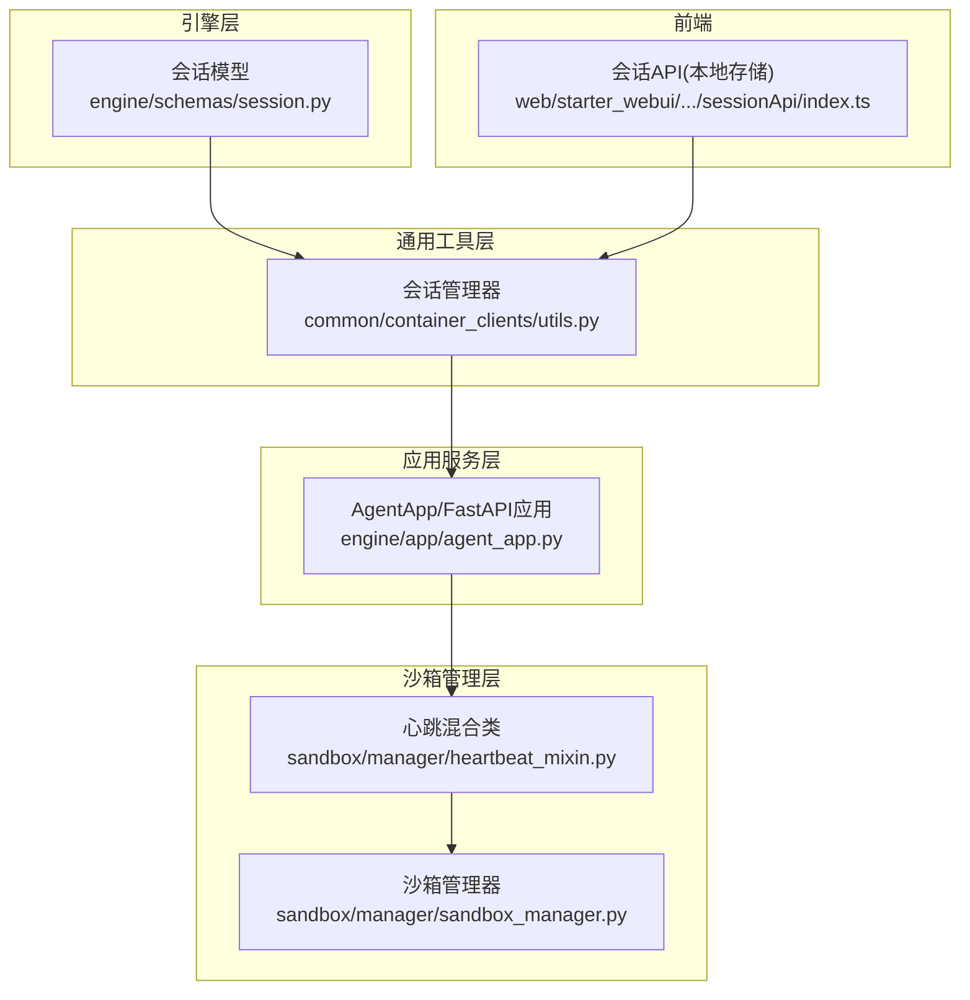
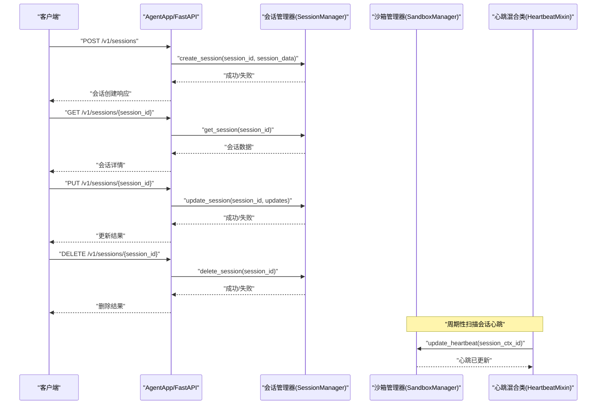
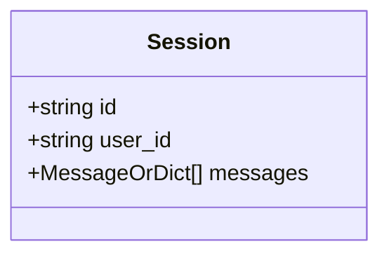
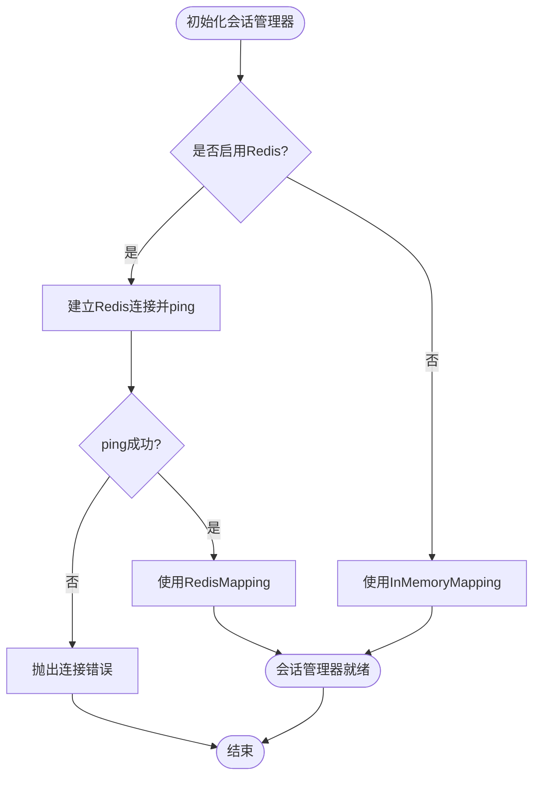
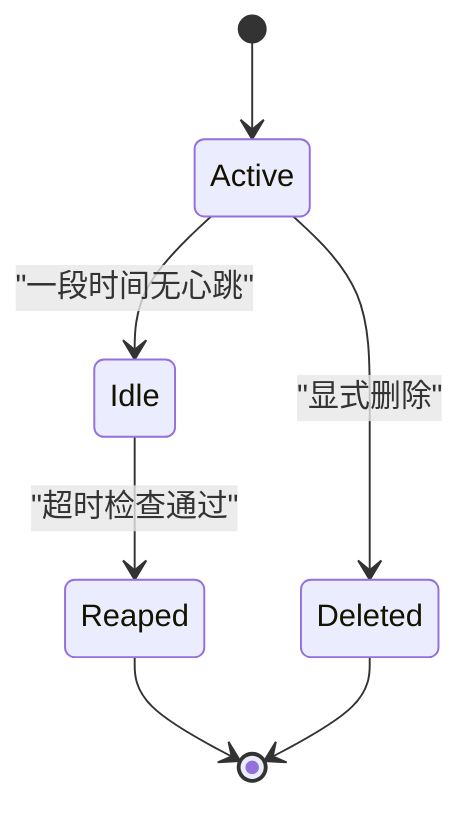
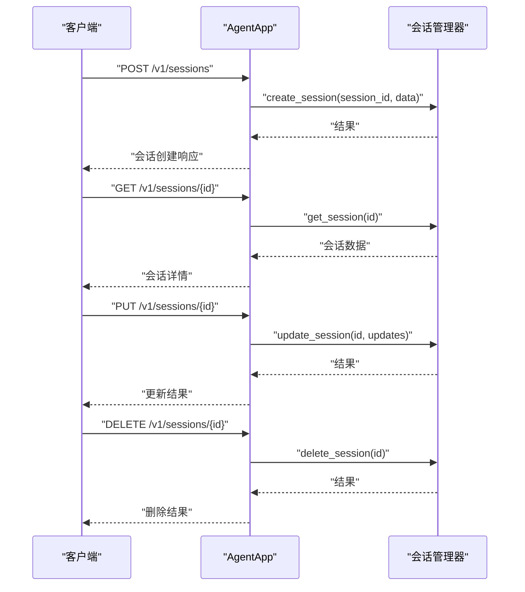
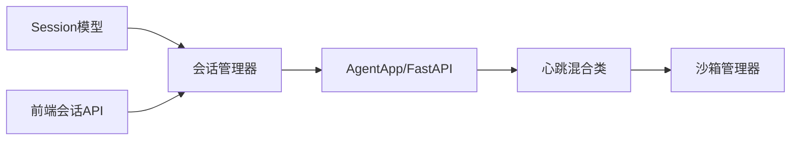

# 会话管理API

<cite>
**本文档引用的文件**
- [session.py](file://src/agentscope_runtime/engine/schemas/session.py)
- [utils.py](file://src/agentscope_runtime/common/container_clients/utils.py)
- [agent_app.py](file://src/agentscope_runtime/engine/app/agent_app.py)
- [heartbeat_mixin.py](file://src/agentscope_runtime/sandbox/manager/heartbeat_mixin.py)
- [sandbox_manager.py](file://src/agentscope_runtime/sandbox/manager/sandbox_manager.py)
- [index.ts](file://web/starter_webui/src/components/Chat/sessionApi/index.ts)
</cite>

## 目录
1. [简介](#简介)
2. [项目结构](#项目结构)
3. [核心组件](#核心组件)
4. [架构总览](#架构总览)
5. [详细组件分析](#详细组件分析)
6. [依赖关系分析](#依赖关系分析)
7. [性能考虑](#性能考虑)
8. [故障排查指南](#故障排查指南)
9. [结论](#结论)

## 简介
本文件为会话管理API的详细技术文档，覆盖以下目标：
- 记录会话创建、获取、更新、删除的RESTful接口规范
- 说明会话ID生成规则、会话状态管理与会话数据持久化机制
- 解释会话与智能体实例的关系及生命周期管理
- 提供GET /v1/sessions/{session_id}、POST /v1/sessions、PUT /v1/sessions/{session_id}等端点的实现要点与约束
- 给出会话元数据管理、超时处理与清理策略的技术细节

注意：当前仓库未直接暴露/v1/sessions路径的HTTP端点。本文档基于现有会话模型、会话管理器与心跳/清理机制进行推导与说明，并给出可落地的实现建议与最佳实践。

## 项目结构
围绕会话管理的关键代码分布在以下模块：
- 引擎层会话模型定义：用于描述会话的数据结构与字段
- 通用容器客户端工具：提供会话的创建、查询、更新、删除与列表能力
- 应用服务入口：FastAPI应用集成，承载推理与任务相关端点
- 心跳与清理：会话级心跳维护与超时回收
- Web前端会话API：本地存储会话列表与单条会话操作

**图表来源**
- [session.py:1-25](file://src/agentscope_runtime/engine/schemas/session.py#L1-L25)
- [utils.py:10-70](file://src/agentscope_runtime/common/container_clients/utils.py#L10-L70)
- [agent_app.py:60-120](file://src/agentscope_runtime/engine/app/agent_app.py#L60-L120)
- [heartbeat_mixin.py:180-220](file://src/agentscope_runtime/sandbox/manager/heartbeat_mixin.py#L180-L220)
- [sandbox_manager.py:1567-1672](file://src/agentscope_runtime/sandbox/manager/sandbox_manager.py#L1567-L1672)
- [index.ts:1-53](file://web/starter_webui/src/components/Chat/sessionApi/index.ts#L1-L53)

**章节来源**
- [session.py:1-25](file://src/agentscope_runtime/engine/schemas/session.py#L1-L25)
- [utils.py:10-70](file://src/agentscope_runtime/common/container_clients/utils.py#L10-L70)
- [agent_app.py:60-120](file://src/agentscope_runtime/engine/app/agent_app.py#L60-L120)
- [heartbeat_mixin.py:180-220](file://src/agentscope_runtime/sandbox/manager/heartbeat_mixin.py#L180-L220)
- [sandbox_manager.py:1567-1672](file://src/agentscope_runtime/sandbox/manager/sandbox_manager.py#L1567-L1672)
- [index.ts:1-53](file://web/starter_webui/src/components/Chat/sessionApi/index.ts#L1-L53)

## 核心组件
- 会话模型：定义会话标识、用户标识与消息历史等字段
- 会话管理器：提供会话的增删改查与扫描能力，支持内存或Redis后端
- 应用服务：FastAPI应用，承载推理与任务相关端点；可扩展会话相关端点
- 心跳与清理：按会话维度维护心跳时间戳，超时后回收相关容器资源
- 前端会话API：以本地存储方式维护会话列表与单条会话

**章节来源**
- [session.py:9-25](file://src/agentscope_runtime/engine/schemas/session.py#L9-L25)
- [utils.py:10-70](file://src/agentscope_runtime/common/container_clients/utils.py#L10-L70)
- [agent_app.py:60-120](file://src/agentscope_runtime/engine/app/agent_app.py#L60-L120)
- [heartbeat_mixin.py:180-220](file://src/agentscope_runtime/sandbox/manager/heartbeat_mixin.py#L180-L220)
- [sandbox_manager.py:1567-1672](file://src/agentscope_runtime/sandbox/manager/sandbox_manager.py#L1567-L1672)
- [index.ts:1-53](file://web/starter_webui/src/components/Chat/sessionApi/index.ts#L1-L53)

## 架构总览
会话管理贯穿“模型定义—管理器—应用服务—沙箱管理—前端”的链路。会话数据由会话管理器负责持久化，应用服务通过会话ID与沙箱管理器交互，心跳机制保障会话活跃度，超时后触发清理流程。

**图表来源**
- [utils.py:46-69](file://src/agentscope_runtime/common/container_clients/utils.py#L46-L69)
- [agent_app.py:60-120](file://src/agentscope_runtime/engine/app/agent_app.py#L60-L120)
- [heartbeat_mixin.py:180-220](file://src/agentscope_runtime/sandbox/manager/heartbeat_mixin.py#L180-L220)
- [sandbox_manager.py:1567-1672](file://src/agentscope_runtime/sandbox/manager/sandbox_manager.py#L1567-L1672)

## 详细组件分析

### 会话模型与数据结构
- 字段说明
  - id：会话唯一标识
  - user_id：会话所属用户标识
  - messages：消息历史列表，支持结构化消息对象或字典
- 设计要点
  - 作为会话数据的载体，既可用于前端展示，也可作为推理上下文的一部分
  - 与沙箱管理中的session_ctx_id存在语义关联（见下节）

**图表来源**
- [session.py:9-25](file://src/agentscope_runtime/engine/schemas/session.py#L9-L25)

**章节来源**
- [session.py:9-25](file://src/agentscope_runtime/engine/schemas/session.py#L9-L25)

### 会话管理器与持久化
- 功能
  - create_session：创建会话
  - get_session：按ID获取会话
  - update_session：更新会话
  - delete_session：删除会话
  - list_sessions：枚举所有会话ID
- 存储后端
  - 内存映射：默认实现
  - Redis映射：当启用redis配置时，使用Redis作为后端
- 连接校验
  - 初始化阶段对Redis进行ping测试，连接失败则抛出运行时错误

**图表来源**
- [utils.py:15-44](file://src/agentscope_runtime/common/container_clients/utils.py#L15-L44)

**章节来源**
- [utils.py:10-70](file://src/agentscope_runtime/common/container_clients/utils.py#L10-L70)

### 会话ID生成规则
- 当前仓库未发现统一的会话ID生成器实现
- 建议策略
  - 使用全局唯一ID（如UUID）确保跨节点一致性
  - 若需具备可读性，可在UUID基础上加前缀或分段编码
  - 保持长度与字符集限制，避免URL/数据库兼容问题
- 与沙箱管理的关联
  - 沙箱容器模型中存在session_ctx_id字段，用于将容器与会话上下文绑定
  - 建议会话ID与session_ctx_id保持一致，便于跨模块追踪

**章节来源**
- [heartbeat_mixin.py:180-220](file://src/agentscope_runtime/sandbox/manager/heartbeat_mixin.py#L180-L220)
- [sandbox_manager.py:1567-1672](file://src/agentscope_runtime/sandbox/manager/sandbox_manager.py#L1567-L1672)

### 会话状态管理
- 心跳机制
  - 对于RUNNING状态的容器，定期更新last_active_at与updated_at
  - 通过分布式锁避免多实例并发误判
- 超时回收
  - 周期扫描会话心跳，超过阈值未活跃则执行回收
  - 回收时标记旧容器状态并迁移至新容器（如需要）
- 生命周期
  - 创建：会话管理器写入会话数据
  - 运行：心跳持续刷新
  - 结束：超时回收或显式删除

**图表来源**
- [heartbeat_mixin.py:180-220](file://src/agentscope_runtime/sandbox/manager/heartbeat_mixin.py#L180-L220)
- [sandbox_manager.py:1567-1672](file://src/agentscope_runtime/sandbox/manager/sandbox_manager.py#L1567-L1672)

**章节来源**
- [heartbeat_mixin.py:180-220](file://src/agentscope_runtime/sandbox/manager/heartbeat_mixin.py#L180-L220)
- [sandbox_manager.py:1567-1672](file://src/agentscope_runtime/sandbox/manager/sandbox_manager.py#L1567-L1672)

### 会话数据持久化机制
- 后端选择
  - 内存：适合开发与单实例部署
  - Redis：适合分布式部署，支持跨进程共享与高可用
- 数据一致性
  - Redis模式下，使用带前缀的命名空间隔离会话数据
  - 初始化阶段进行连接校验，失败即终止启动
- 扫描与遍历
  - 提供scan接口用于枚举所有会话ID，便于运维与诊断

**章节来源**
- [utils.py:15-44](file://src/agentscope_runtime/common/container_clients/utils.py#L15-L44)
- [utils.py:67-69](file://src/agentscope_runtime/common/container_clients/utils.py#L67-L69)

### 会话与智能体实例的关系与生命周期
- 关系
  - 会话作为智能体对话的上下文容器，承载messages与用户标识
  - 智能体实例（容器）通过session_ctx_id与会话绑定
- 生命周期
  - 创建：会话管理器写入会话数据
  - 运行：心跳持续刷新，容器处于RUNNING状态
  - 结束：超时回收或显式删除，容器状态更新并可能迁移

**章节来源**
- [session.py:9-25](file://src/agentscope_runtime/engine/schemas/session.py#L9-L25)
- [heartbeat_mixin.py:180-220](file://src/agentscope_runtime/sandbox/manager/heartbeat_mixin.py#L180-L220)
- [sandbox_manager.py:1567-1672](file://src/agentscope_runtime/sandbox/manager/sandbox_manager.py#L1567-L1672)

### RESTful接口规范（基于现有能力的实现建议）
说明：当前仓库未直接暴露/v1/sessions路径的HTTP端点。以下为基于现有会话管理器能力的接口设计建议，便于在AgentApp上扩展。

- 基础路径
  - 建议：/v1/sessions
- 端点设计
  - GET /v1/sessions/{session_id}
    - 功能：获取指定会话详情
    - 实现：调用会话管理器的get_session
    - 返回：会话对象或404
  - POST /v1/sessions
    - 功能：创建会话
    - 请求体：包含user_id与初始messages等
    - 实现：生成session_id并调用create_session
    - 返回：创建成功的会话对象
  - PUT /v1/sessions/{session_id}
    - 功能：更新会话状态（如追加消息、修改元数据）
    - 实现：调用update_session
    - 返回：更新后的会话对象或错误
  - DELETE /v1/sessions/{session_id}
    - 功能：删除会话
    - 实现：调用delete_session
    - 返回：删除成功或失败
- 会话ID生成
  - 建议采用UUID，保证全局唯一
- 元数据管理
  - 可在会话对象中扩展字段（如创建时间、最后更新时间、标签等）
- 超时与清理
  - 建议结合心跳扫描与会话管理器的list_sessions进行周期性清理
- 前端对接
  - 前端会话API使用localStorage维护会话列表，可与后端会话ID形成映射

**图表来源**
- [utils.py:46-69](file://src/agentscope_runtime/common/container_clients/utils.py#L46-L69)
- [agent_app.py:60-120](file://src/agentscope_runtime/engine/app/agent_app.py#L60-L120)

**章节来源**
- [utils.py:46-69](file://src/agentscope_runtime/common/container_clients/utils.py#L46-L69)
- [agent_app.py:60-120](file://src/agentscope_runtime/engine/app/agent_app.py#L60-L120)
- [index.ts:1-53](file://web/starter_webui/src/components/Chat/sessionApi/index.ts#L1-L53)

## 依赖关系分析
- 会话模型被会话管理器依赖，用于数据结构约束
- 会话管理器被应用服务间接使用（通过扩展端点），同时被心跳/清理流程依赖
- 心跳混合类与沙箱管理器共同维护会话活跃度与容器生命周期
- 前端会话API与后端会话ID形成松耦合映射

**图表来源**
- [session.py:9-25](file://src/agentscope_runtime/engine/schemas/session.py#L9-L25)
- [utils.py:10-70](file://src/agentscope_runtime/common/container_clients/utils.py#L10-L70)
- [agent_app.py:60-120](file://src/agentscope_runtime/engine/app/agent_app.py#L60-L120)
- [heartbeat_mixin.py:180-220](file://src/agentscope_runtime/sandbox/manager/heartbeat_mixin.py#L180-L220)
- [sandbox_manager.py:1567-1672](file://src/agentscope_runtime/sandbox/manager/sandbox_manager.py#L1567-L1672)
- [index.ts:1-53](file://web/starter_webui/src/components/Chat/sessionApi/index.ts#L1-L53)

**章节来源**
- [session.py:9-25](file://src/agentscope_runtime/engine/schemas/session.py#L9-L25)
- [utils.py:10-70](file://src/agentscope_runtime/common/container_clients/utils.py#L10-L70)
- [agent_app.py:60-120](file://src/agentscope_runtime/engine/app/agent_app.py#L60-L120)
- [heartbeat_mixin.py:180-220](file://src/agentscope_runtime/sandbox/manager/heartbeat_mixin.py#L180-L220)
- [sandbox_manager.py:1567-1672](file://src/agentscope_runtime/sandbox/manager/sandbox_manager.py#L1567-L1672)
- [index.ts:1-53](file://web/starter_webui/src/components/Chat/sessionApi/index.ts#L1-L53)

## 性能考虑
- 存储后端选择
  - 单实例或小规模：内存映射足以满足需求
  - 分布式：优先Redis，注意网络延迟与序列化开销
- 扫描与遍历
  - scan接口用于枚举会话ID，建议在后台任务中执行，避免阻塞主线程
- 心跳频率
  - 合理设置心跳间隔与超时阈值，平衡资源占用与实时性
- 并发控制
  - 清理流程使用分布式锁，避免重复回收

[本节为通用指导，无需特定文件来源]

## 故障排查指南
- Redis连接失败
  - 现象：初始化时报连接错误
  - 排查：确认Redis地址、端口、认证信息与网络连通性
- 会话不存在
  - 现象：GET/PUT/DELETE返回404或空数据
  - 排查：确认session_id正确性与会话是否已被清理
- 心跳未更新
  - 现象：会话长时间无心跳导致被回收
  - 排查：检查心跳扫描任务是否正常运行，容器状态是否为RUNNING
- 清理策略异常
  - 现象：会话未按预期回收或频繁回收
  - 排查：核对心跳超时阈值、分布式锁状态与双检逻辑

**章节来源**
- [utils.py:15-44](file://src/agentscope_runtime/common/container_clients/utils.py#L15-L44)
- [heartbeat_mixin.py:180-220](file://src/agentscope_runtime/sandbox/manager/heartbeat_mixin.py#L180-L220)
- [sandbox_manager.py:1567-1672](file://src/agentscope_runtime/sandbox/manager/sandbox_manager.py#L1567-L1672)

## 结论
- 会话管理以模型定义为基础，通过会话管理器实现数据持久化与基本CRUD能力
- 心跳与清理机制保障会话生命周期的健康运行
- 建议在AgentApp上扩展/v1/sessions相关端点，结合会话ID生成与元数据管理，完善RESTful接口
- 在分布式环境下优先使用Redis后端，并配合心跳扫描与清理策略，确保系统稳定性与可维护性