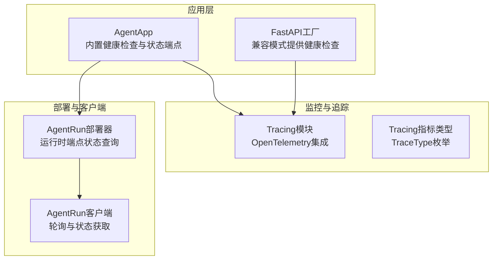
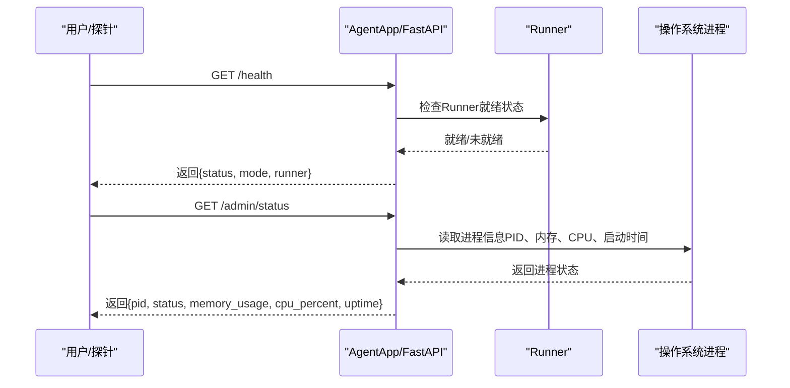
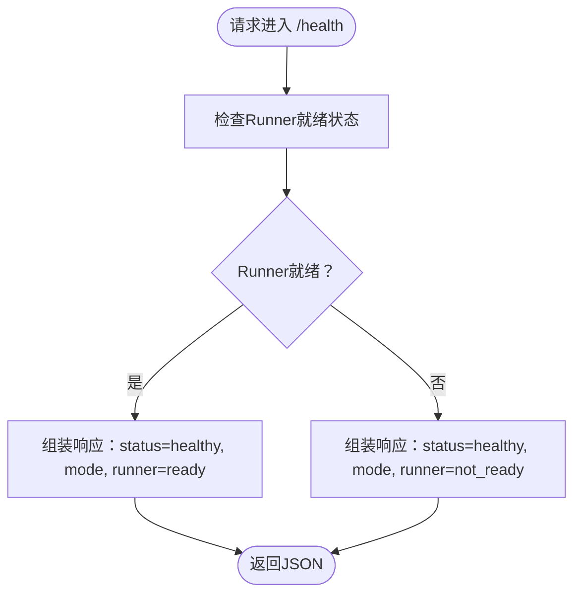
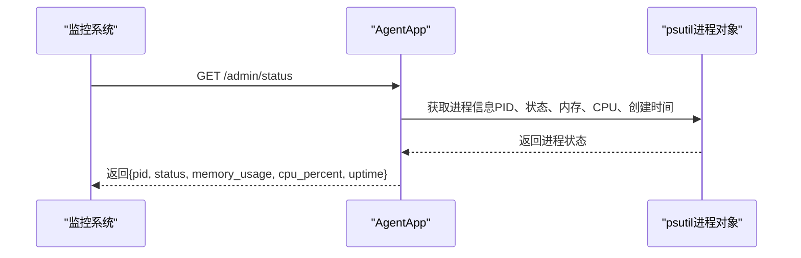
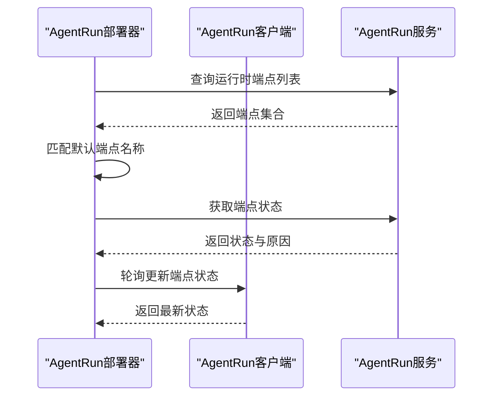
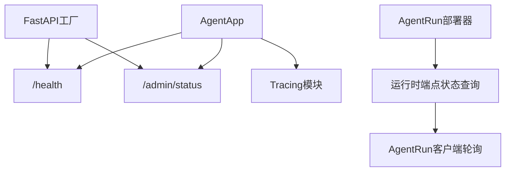

# 健康检查和监控API

<cite>
**本文档引用的文件**
- [agent_app.py](file://src/agentscope_runtime/engine/app/agent_app.py)
- [fastapi_factory.py](file://src/agentscope_runtime/engine/deployers/utils/service_utils/fastapi_factory.py)
- [agent_app.md（英文）](file://cookbook/en/agent_app.md)
- [agent_app.md（中文）](file://cookbook/zh/agent_app.md)
- [README.md（Tracing模块）](file://src/agentscope_runtime/engine/tracing/README.md)
- [wrapper.py（Tracing包装器）](file://src/agentscope_runtime/engine/tracing/wrapper.py)
- [tracing_metric.py（Tracing指标）](file://src/agentscope_runtime/engine/tracing/tracing_metric.py)
- [agentrun_client.py](file://src/agentscope_runtime/common/container_clients/agentrun_client.py)
- [agentrun_deployer.py](file://src/agentscope_runtime/engine/deployers/agentrun_deployer.py)
</cite>

## 目录
1. [简介](#简介)
2. [项目结构](#项目结构)
3. [核心组件](#核心组件)
4. [架构总览](#架构总览)
5. [详细组件分析](#详细组件分析)
6. [依赖关系分析](#依赖关系分析)
7. [性能考虑](#性能考虑)
8. [故障排查指南](#故障排查指南)
9. [结论](#结论)
10. [附录](#附录)

## 简介
本文件面向健康检查与监控API，系统性梳理AgentScope Runtime中与运行时健康状态、性能指标与运行时信息查询相关的接口规范与实现要点。重点覆盖以下端点：
- 健康检查：GET /health
- 就绪探针：GET /readiness（文档中提及）
- 存活探针：GET /liveness（文档中提及）
- 运行时状态：GET /admin/status（进程级状态）

同时，结合Tracing模块与进程状态端点，给出Prometheus指标导出、日志聚合与告警配置的集成思路，以及分布式追踪、服务发现与负载均衡的监控策略。

## 项目结构
AgentScope Runtime的健康检查与监控能力主要由以下模块提供：
- AgentApp：继承FastAPI，内置健康检查、根路径信息与进程控制端点
- FastAPI工厂：兼容旧版本的工厂模式，同样提供健康检查与进程状态端点
- Tracing模块：提供OpenTelemetry集成与事件埋点，便于指标采集与可观测性
- 部署与容器客户端：提供运行时端点状态查询与轮询能力

图表来源
- [agent_app.py:382-424](file://src/agentscope_runtime/engine/app/agent_app.py#L382-L424)
- [fastapi_factory.py:420-547](file://src/agentscope_runtime/engine/deployers/utils/service_utils/fastapi_factory.py#L420-L547)
- [wrapper.py:1-120](file://src/agentscope_runtime/engine/tracing/wrapper.py#L1-L120)
- [tracing_metric.py:1-82](file://src/agentscope_runtime/engine/tracing/tracing_metric.py#L1-L82)
- [agentrun_deployer.py:1117-1172](file://src/agentscope_runtime/engine/deployers/agentrun_deployer.py#L1117-L1172)
- [agentrun_client.py:701-735](file://src/agentscope_runtime/common/container_clients/agentrun_client.py#L701-L735)

章节来源
- [agent_app.py:382-424](file://src/agentscope_runtime/engine/app/agent_app.py#L382-L424)
- [fastapi_factory.py:420-547](file://src/agentscope_runtime/engine/deployers/utils/service_utils/fastapi_factory.py#L420-L547)

## 核心组件
- 健康检查端点（GET /health）
  - 返回服务健康状态与部署模式，以及Runner就绪状态
  - 示例响应字段：status、mode、runner
- 就绪探针端点（GET /readiness）
  - 文档中明确列出，用于容器/集群就绪探测
- 存活探针端点（GET /liveness）
  - 文档中明确列出，用于存活探测
- 运行时状态端点（GET /admin/status）
  - 返回进程PID、状态、内存占用、CPU使用率、启动时间等

章节来源
- [agent_app.md（英文）:236-256](file://cookbook/en/agent_app.md#L236-L256)
- [agent_app.md（中文）:236-256](file://cookbook/zh/agent_app.md#L236-L256)
- [agent_app.py:628-641](file://src/agentscope_runtime/engine/app/agent_app.py#L628-L641)
- [fastapi_factory.py:534-547](file://src/agentscope_runtime/engine/deployers/utils/service_utils/fastapi_factory.py#L534-L547)

## 架构总览
下图展示健康检查与状态端点在应用中的注册与调用流程：

图表来源
- [agent_app.py:382-424](file://src/agentscope_runtime/engine/app/agent_app.py#L382-L424)
- [agent_app.py:628-641](file://src/agentscope_runtime/engine/app/agent_app.py#L628-L641)
- [fastapi_factory.py:420-547](file://src/agentscope_runtime/engine/deployers/utils/service_utils/fastapi_factory.py#L420-L547)

## 详细组件分析

### 健康检查端点（GET /health）
- 注册位置：AgentApp与FastAPI工厂均内置
- 响应结构
  - status：服务健康状态（如healthy）
  - mode：部署模式（如DAEMON_THREAD、DETACHED_PROCESS、STANDALONE）
  - runner：Runner就绪状态（ready/not_ready）
- 设计意图
  - 为容器编排与集群提供健康与就绪探测基础
  - 通过runner字段反映核心推理引擎可用性

图表来源
- [agent_app.py:385-400](file://src/agentscope_runtime/engine/app/agent_app.py#L385-L400)
- [fastapi_factory.py:420-432](file://src/agentscope_runtime/engine/deployers/utils/service_utils/fastapi_factory.py#L420-L432)

章节来源
- [agent_app.py:385-400](file://src/agentscope_runtime/engine/app/agent_app.py#L385-L400)
- [fastapi_factory.py:420-432](file://src/agentscope_runtime/engine/deployers/utils/service_utils/fastapi_factory.py#L420-L432)

### 运行时状态端点（GET /admin/status）
- 注册位置：AgentApp内置
- 响应结构
  - pid：进程ID
  - status：进程状态（来自psutil）
  - memory_usage：内存使用量（RSS字节）
  - cpu_percent：CPU使用率百分比
  - uptime：进程创建时间（时间戳）
- 设计意图
  - 提供进程级运行时信息，便于运维与监控系统采集

图表来源
- [agent_app.py:628-641](file://src/agentscope_runtime/engine/app/agent_app.py#L628-L641)

章节来源
- [agent_app.py:628-641](file://src/agentscope_runtime/engine/app/agent_app.py#L628-L641)

### 就绪探针与存活探针
- 就绪探针（GET /readiness）与存活探针（GET /liveness）
  - 文档中明确列出，用于容器编排的就绪与存活探测
  - 与健康检查端点共同构成标准的Kubernetes/容器平台探针体系

章节来源
- [agent_app.md（英文）:236-256](file://cookbook/en/agent_app.md#L236-L256)
- [agent_app.md（中文）:236-256](file://cookbook/zh/agent_app.md#L236-L256)

### 运行时端点状态查询（部署侧）
- AgentRun部署器与客户端提供运行时端点状态查询与轮询
- 关键行为
  - 查找默认端点名称（DEFAULT_ENDPOINT_NAME）
  - 获取端点ID、URL与状态
  - 轮询更新端点状态并返回状态与原因
- 用途
  - 集成到部署流水线与运维系统，监控运行时端点可用性

图表来源
- [agentrun_deployer.py:1117-1172](file://src/agentscope_runtime/engine/deployers/agentrun_deployer.py#L1117-L1172)
- [agentrun_deployer.py:1581-1610](file://src/agentscope_runtime/engine/deployers/agentrun_deployer.py#L1581-L1610)
- [agentrun_client.py:701-735](file://src/agentscope_runtime/common/container_clients/agentrun_client.py#L701-L735)

章节来源
- [agentrun_deployer.py:1117-1172](file://src/agentscope_runtime/engine/deployers/agentrun_deployer.py#L1117-L1172)
- [agentrun_deployer.py:1581-1610](file://src/agentscope_runtime/engine/deployers/agentrun_deployer.py#L1581-L1610)
- [agentrun_client.py:701-735](file://src/agentscope_runtime/common/container_clients/agentrun_client.py#L701-L735)

## 依赖关系分析
- AgentApp与FastAPI工厂均提供健康检查与进程状态端点，后者为兼容旧版本的实现
- Tracing模块通过OpenTelemetry提供事件埋点，可用于指标采集与分布式追踪
- 部署器与客户端围绕运行时端点状态进行查询与轮询，形成闭环监控

图表来源
- [agent_app.py:382-424](file://src/agentscope_runtime/engine/app/agent_app.py#L382-L424)
- [fastapi_factory.py:420-547](file://src/agentscope_runtime/engine/deployers/utils/service_utils/fastapi_factory.py#L420-L547)
- [wrapper.py:1-120](file://src/agentscope_runtime/engine/tracing/wrapper.py#L1-L120)
- [agentrun_deployer.py:1117-1172](file://src/agentscope_runtime/engine/deployers/agentrun_deployer.py#L1117-L1172)
- [agentrun_client.py:701-735](file://src/agentscope_runtime/common/container_clients/agentrun_client.py#L701-L735)

章节来源
- [agent_app.py:382-424](file://src/agentscope_runtime/engine/app/agent_app.py#L382-L424)
- [fastapi_factory.py:420-547](file://src/agentscope_runtime/engine/deployers/utils/service_utils/fastapi_factory.py#L420-L547)
- [wrapper.py:1-120](file://src/agentscope_runtime/engine/tracing/wrapper.py#L1-L120)
- [agentrun_deployer.py:1117-1172](file://src/agentscope_runtime/engine/deployers/agentrun_deployer.py#L1117-L1172)
- [agentrun_client.py:701-735](file://src/agentscope_runtime/common/container_clients/agentrun_client.py#L701-L735)

## 性能考虑
- 健康检查端点为轻量级，仅检查Runner就绪状态，开销极小
- /admin/status端点依赖psutil，读取进程信息，通常为毫秒级开销
- Tracing模块在启用OpenTelemetry导出时会产生额外开销，建议按需开启
- 部署器与客户端的轮询频率应合理配置，避免过度查询导致额外负载

## 故障排查指南
- /health返回runner=not_ready
  - 检查Runner初始化是否成功
  - 确认lifespan钩子与before_start/after_finish回调执行情况
- /admin/status返回异常
  - 检查psutil安装与权限
  - 确认进程是否存在（PID是否有效）
- Tracing导出失败
  - 检查OTLP导出器配置与网络连通性
  - 确认环境变量与认证参数正确
- 运行时端点状态查询失败
  - 检查AgentRun服务可用性与端点名称匹配
  - 确认轮询间隔与最大尝试次数配置

章节来源
- [agent_app.py:248-316](file://src/agentscope_runtime/engine/app/agent_app.py#L248-L316)
- [agent_app.py:628-641](file://src/agentscope_runtime/engine/app/agent_app.py#L628-L641)
- [README.md（Tracing模块）:54-73](file://src/agentscope_runtime/engine/tracing/README.md#L54-L73)
- [agentrun_deployer.py:1581-1610](file://src/agentscope_runtime/engine/deployers/agentrun_deployer.py#L1581-L1610)
- [agentrun_client.py:701-735](file://src/agentscope_runtime/common/container_clients/agentrun_client.py#L701-L735)

## 结论
本文档梳理了AgentScope Runtime的健康检查与运行时状态监控接口，明确了端点职责与响应结构，并结合Tracing模块与部署器/客户端能力，给出了可观测性与运维集成的实践建议。实际部署中，建议将/health与/admin/status纳入探针与监控系统，配合Tracing实现端到端的可观测性。

## 附录

### API定义与响应格式

- GET /health
  - 响应字段
    - status：服务健康状态（如healthy）
    - mode：部署模式（如DAEMON_THREAD、DETACHED_PROCESS、STANDALONE）
    - runner：Runner就绪状态（ready/not_ready）
  - 用途：容器/集群健康与就绪探测

- GET /readiness
  - 用途：容器/集群就绪探测（文档中明确列出）

- GET /liveness
  - 用途：容器/集群存活探测（文档中明确列出）

- GET /admin/status
  - 响应字段
    - pid：进程ID
    - status：进程状态（来自psutil）
    - memory_usage：内存使用量（RSS字节）
    - cpu_percent：CPU使用率百分比
    - uptime：进程创建时间（时间戳）
  - 用途：进程级运行时信息查询

章节来源
- [agent_app.md（英文）:236-256](file://cookbook/en/agent_app.md#L236-L256)
- [agent_app.md（中文）:236-256](file://cookbook/zh/agent_app.md#L236-L256)
- [agent_app.py:385-400](file://src/agentscope_runtime/engine/app/agent_app.py#L385-L400)
- [agent_app.py:628-641](file://src/agentscope_runtime/engine/app/agent_app.py#L628-L641)
- [fastapi_factory.py:420-547](file://src/agentscope_runtime/engine/deployers/utils/service_utils/fastapi_factory.py#L420-L547)

### 指标定义与计算方法
- CPU使用率
  - 来源：/admin/status端点返回的cpu_percent（psutil.Process.cpu_percent）
  - 计算：由psutil周期性采样得到，单位为百分比
- 内存占用
  - 来源：/admin/status端点返回的memory_usage（psutil.Process.memory_info().rss）
  - 计算：RSS（常驻集大小）字节
- 请求延迟
  - 来源：Tracing模块埋点（首次响应延迟、包级延迟等）
  - 计算：通过OpenTelemetry属性记录，如gen_ai.response.first_delay
- 错误率
  - 来源：Tracing事件与span状态（StatusCode.ERROR）
  - 计算：错误事件数/总事件数

章节来源
- [agent_app.py:628-641](file://src/agentscope_runtime/engine/app/agent_app.py#L628-L641)
- [wrapper.py:712-735](file://src/agentscope_runtime/engine/tracing/wrapper.py#L712-L735)
- [wrapper.py:737-761](file://src/agentscope_runtime/engine/tracing/wrapper.py#L737-L761)

### Prometheus指标导出、日志聚合与告警配置
- Prometheus导出
  - 建议将/health与/admin/status纳入Prometheus抓取范围
  - 使用Grafana面板展示CPU使用率、内存占用、runner就绪状态
- 日志聚合
  - Tracing模块支持本地日志与OpenTelemetry上报
  - 建议结合日志收集系统（如ELK/Fluentd/Vector）统一采集
- 告警配置
  - 健康检查失败、runner未就绪、CPU使用率持续高于阈值、内存占用异常等
  - 建议设置多级告警（警告/严重/致命）

章节来源
- [README.md（Tracing模块）:5-73](file://src/agentscope_runtime/engine/tracing/README.md#L5-L73)
- [wrapper.py:1-120](file://src/agentscope_runtime/engine/tracing/wrapper.py#L1-L120)

### 分布式追踪、服务发现与负载均衡的监控策略
- 分布式追踪
  - 使用Tracing装饰器对关键函数进行埋点，生成span与事件
  - 通过OpenTelemetry导出器上报到遥测平台（如Jaeger/Tempo）
- 服务发现与负载均衡
  - 将/health与/admin/status作为探针端点接入Kubernetes/容器平台
  - 结合服务网格（Istio/OpenTelemetry）实现跨服务链路追踪
  - 负载均衡器可根据/health状态动态调整流量

章节来源
- [README.md（Tracing模块）:5-73](file://src/agentscope_runtime/engine/tracing/README.md#L5-L73)
- [wrapper.py:1-120](file://src/agentscope_runtime/engine/tracing/wrapper.py#L1-L120)