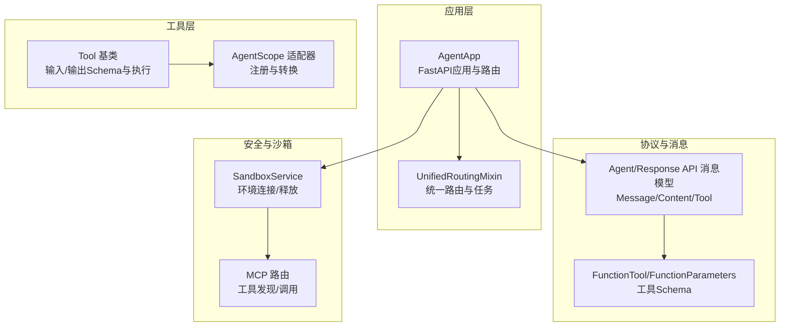
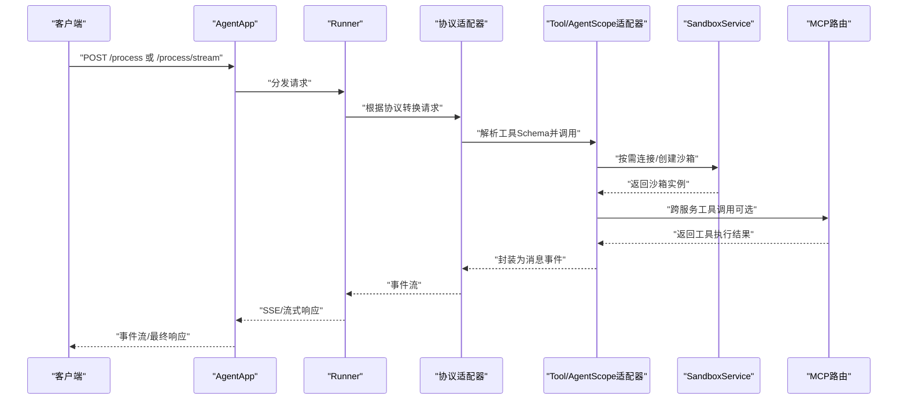
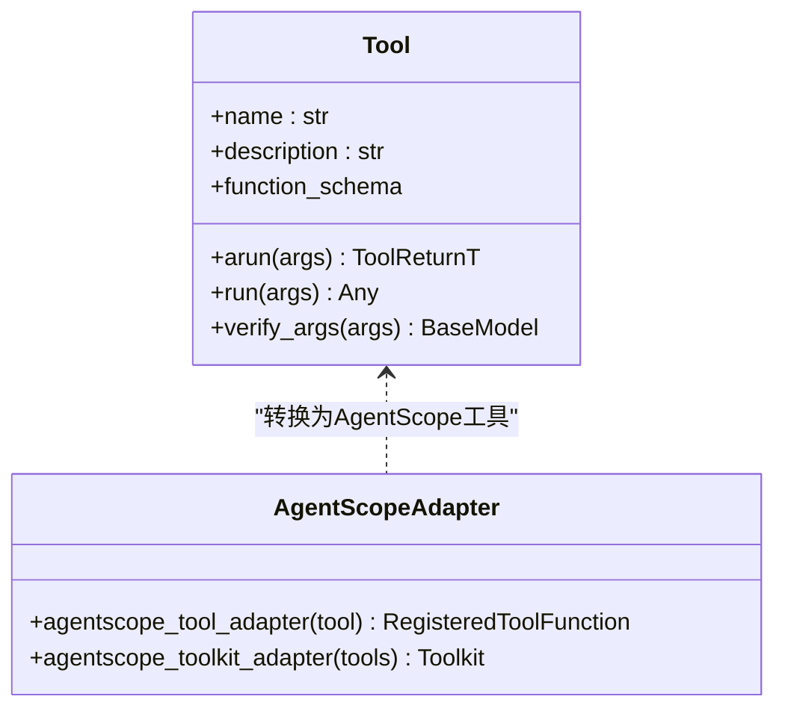
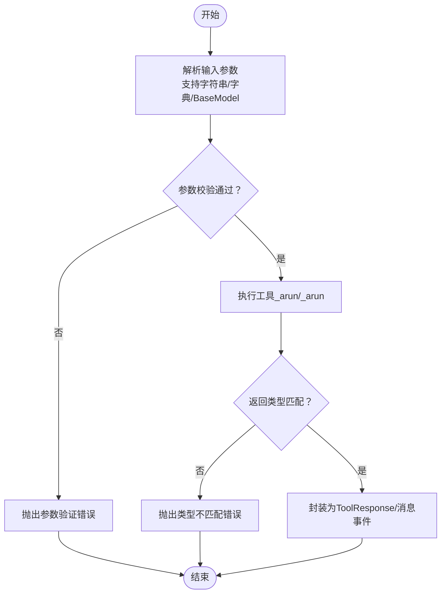
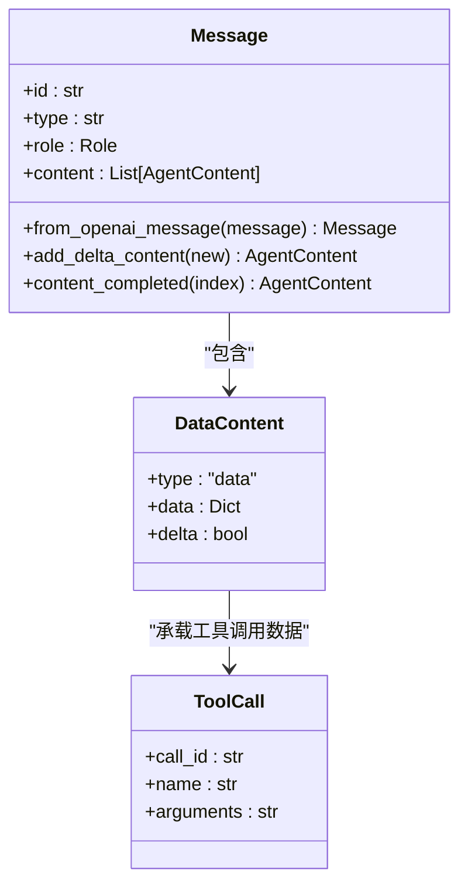
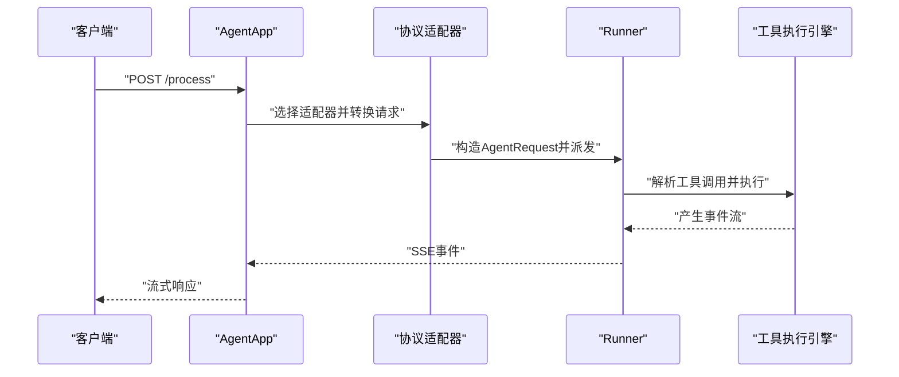
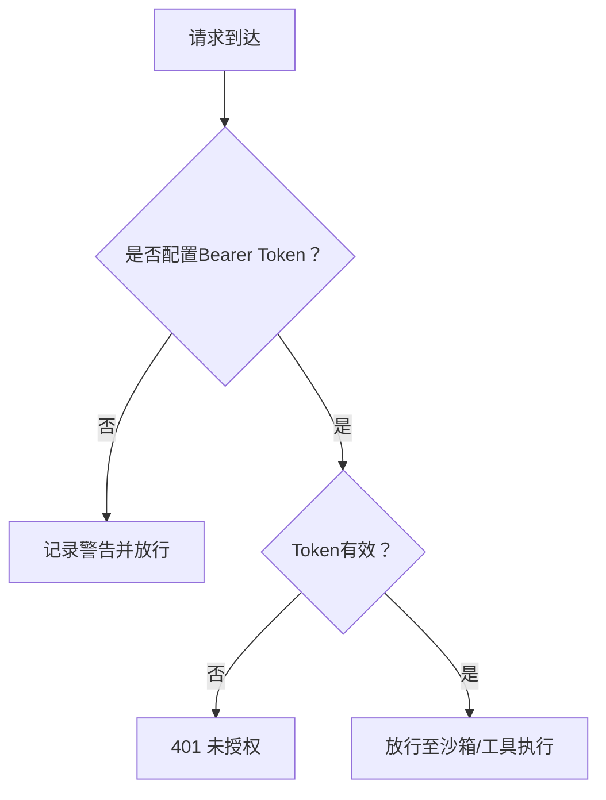
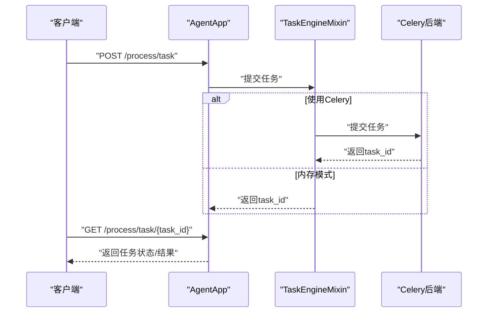
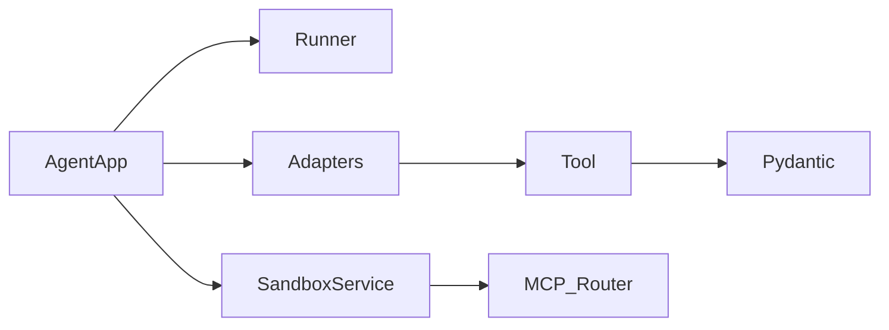

# 工具调用API

<cite>
**本文引用的文件**
- [agent_app.py](file://src/agentscope_runtime/engine/app/agent_app.py)
- [agent_schemas.py](file://src/agentscope_runtime/engine/schemas/agent_schemas.py)
- [base.py](file://src/agentscope_runtime/tools/base.py)
- [tool.py](file://src/agentscope_runtime/adapters/agentscope/tool/tool.py)
- [sandbox_service.py](file://src/agentscope_runtime/engine/services/sandbox/sandbox_service.py)
- [mcp.py](file://src/agentscope_runtime/sandbox/box/shared/routers/mcp.py)
- [app.py](file://src/agentscope_runtime/sandbox/manager/server/app.py)
- [unified_routing_mixin.py](file://src/agentscope_runtime/engine/deployers/utils/service_utils/routing/unified_routing_mixin.py)
- [task_engine_mixin.py](file://src/agentscope_runtime/engine/deployers/utils/service_utils/routing/task_engine_mixin.py)
- [response_api_adapter_utils.py](file://src/agentscope_runtime/engine/deployers/adapter/responses/response_api_adapter_utils.py)
- [exception.py](file://src/agentscope_runtime/engine/schemas/exception.py)
</cite>

## 目录
1. [简介](#简介)
2. [项目结构](#项目结构)
3. [核心组件](#核心组件)
4. [架构总览](#架构总览)
5. [详细组件分析](#详细组件分析)
6. [依赖分析](#依赖分析)
7. [性能考虑](#性能考虑)
8. [故障排查指南](#故障排查指南)
9. [结论](#结论)
10. [附录](#附录)

## 简介
本文件面向“工具调用API”的使用者与维护者，系统性梳理智能体工具调用的完整接口规范与实现细节。重点覆盖以下方面：
- 工具发现与注册：基于函数式Schema的工具注册与协议转换。
- 参数验证与结果返回：基于Pydantic模型的输入/输出Schema校验与流式返回。
- 工具调用消息格式：统一的消息类型（function_call、plugin_call、component_call）及内容载体（DataContent）。
- 执行流程：从请求到工具执行、结果聚合与事件流的全过程。
- 安全与权限：基于Bearer Token的鉴权与沙箱隔离。
- 异步与后台任务：流式任务提交、状态轮询与超时/错误恢复。

## 项目结构
围绕工具调用API的关键模块分布如下：
- 应用入口与路由：AgentApp负责FastAPI应用生命周期、内置路由与协议适配器注册。
- 协议与消息模型：Agent/Response API的消息类型、内容载体与工具Schema。
- 工具抽象与适配：Tool基类提供输入/输出Schema与执行能力；适配器将内部工具暴露为AgentScope工具。
- 沙箱与安全：SandboxService管理沙箱环境连接与释放；MCP路由提供工具发现与调用。
- 路由与任务：统一路由混入与任务引擎，支持自定义端点与后台任务。
- 异常与错误：统一异常体系，便于错误恢复与可观测性。

**图表来源**
- [agent_app.py:124-221](file://src/agentscope_runtime/engine/app/agent_app.py#L124-L221)
- [agent_schemas.py:18-56](file://src/agentscope_runtime/engine/schemas/agent_schemas.py#L18-L56)
- [base.py:34-194](file://src/agentscope_runtime/tools/base.py#L34-L194)
- [tool.py:17-169](file://src/agentscope_runtime/adapters/agentscope/tool/tool.py#L17-L169)
- [sandbox_service.py:11-102](file://src/agentscope_runtime/engine/services/sandbox/sandbox_service.py#L11-L102)
- [mcp.py:86-168](file://src/agentscope_runtime/sandbox/box/shared/routers/mcp.py#L86-L168)

**章节来源**
- [agent_app.py:124-221](file://src/agentscope_runtime/engine/app/agent_app.py#L124-L221)
- [agent_schemas.py:18-56](file://src/agentscope_runtime/engine/schemas/agent_schemas.py#L18-L56)

## 核心组件
- AgentApp：FastAPI应用集成Runner，支持多协议适配器、内置健康检查与信息发现端点，并提供流式任务端点。
- Agent/Response API消息模型：定义消息类型（function_call、plugin_call、component_call等）、内容载体（Text/Data/Image/Audio/File/Video/Refusal）与工具Schema。
- Tool基类：通过泛型参数声明输入/输出类型，自动生成FunctionTool Schema，提供异步/同步执行与参数验证。
- AgentScope适配器：将内部Tool转换为AgentScope工具，注入JSON Schema并封装执行。
- SandboxService：管理沙箱环境连接、创建与释放，支持嵌入式与远程模式。
- MCP路由：提供工具列表查询与工具调用，支持跨服务工具发现与执行。
- 统一路由与任务引擎：支持自定义端点、任务提交与状态轮询。

**章节来源**
- [agent_app.py:59-121](file://src/agentscope_runtime/engine/app/agent_app.py#L59-L121)
- [agent_schemas.py:480-580](file://src/agentscope_runtime/engine/schemas/agent_schemas.py#L480-L580)
- [base.py:34-194](file://src/agentscope_runtime/tools/base.py#L34-L194)
- [tool.py:17-169](file://src/agentscope_runtime/adapters/agentscope/tool/tool.py#L17-L169)
- [sandbox_service.py:11-102](file://src/agentscope_runtime/engine/services/sandbox/sandbox_service.py#L11-L102)
- [mcp.py:86-168](file://src/agentscope_runtime/sandbox/box/shared/routers/mcp.py#L86-L168)
- [unified_routing_mixin.py:16-101](file://src/agentscope_runtime/engine/deployers/utils/service_utils/routing/unified_routing_mixin.py#L16-L101)

## 架构总览
工具调用API的总体交互流程如下：

**图表来源**
- [agent_app.py:781-800](file://src/agentscope_runtime/engine/app/agent_app.py#L781-L800)
- [tool.py:59-144](file://src/agentscope_runtime/adapters/agentscope/tool/tool.py#L59-L144)
- [sandbox_service.py:82-142](file://src/agentscope_runtime/engine/services/sandbox/sandbox_service.py#L82-L142)
- [mcp.py:136-168](file://src/agentscope_runtime/sandbox/box/shared/routers/mcp.py#L136-L168)

## 详细组件分析

### 1) 工具发现与注册
- 工具Schema生成：Tool基类通过泛型参数推断输入/输出类型，自动生成FunctionTool Schema，用于工具注册与调用。
- AgentScope适配：适配器将内部Tool转换为AgentScope工具，注入JSON Schema并封装执行逻辑，支持同步/异步与错误处理。
- 协议适配：Response API适配器可将Responses API工具格式转换为Agent API工具格式，便于多协议兼容。

**图表来源**
- [base.py:34-194](file://src/agentscope_runtime/tools/base.py#L34-L194)
- [tool.py:17-169](file://src/agentscope_runtime/adapters/agentscope/tool/tool.py#L17-L169)

**章节来源**
- [base.py:34-194](file://src/agentscope_runtime/tools/base.py#L34-L194)
- [tool.py:17-169](file://src/agentscope_runtime/adapters/agentscope/tool/tool.py#L17-L169)
- [response_api_adapter_utils.py:463-532](file://src/agentscope_runtime/engine/deployers/adapter/responses/response_api_adapter_utils.py#L463-L532)

### 2) 参数验证与结果返回
- 输入验证：Tool基类使用Pydantic模型进行参数校验，支持字符串/字典/BaseModel三种输入形式。
- 输出约束：工具返回值通过泛型约束确保与声明的返回Schema一致，便于下游消费。
- 流式返回：Agent/Response API消息模型支持多种内容类型与增量更新，便于SSE流式传输。

**图表来源**
- [base.py:196-246](file://src/agentscope_runtime/tools/base.py#L196-L246)
- [tool.py:59-144](file://src/agentscope_runtime/adapters/agentscope/tool/tool.py#L59-L144)
- [agent_schemas.py:320-431](file://src/agentscope_runtime/engine/schemas/agent_schemas.py#L320-L431)

**章节来源**
- [base.py:196-246](file://src/agentscope_runtime/tools/base.py#L196-L246)
- [tool.py:59-144](file://src/agentscope_runtime/adapters/agentscope/tool/tool.py#L59-L144)
- [agent_schemas.py:320-431](file://src/agentscope_runtime/engine/schemas/agent_schemas.py#L320-L431)

### 3) 工具调用消息格式
- 消息类型：支持message、function_call、function_call_output、plugin_call、plugin_call_output、component_call、component_call_output、mcp_*等。
- 内容载体：TextContent、DataContent、ImageContent、AudioContent、FileContent、VideoContent、RefusalContent等。
- 工具Schema：FunctionTool与FunctionParameters描述工具名称、描述与参数Schema。

**图表来源**
- [agent_schemas.py:480-580](file://src/agentscope_runtime/engine/schemas/agent_schemas.py#L480-L580)
- [agent_schemas.py:386-457](file://src/agentscope_runtime/engine/schemas/agent_schemas.py#L386-L457)
- [agent_schemas.py:440-457](file://src/agentscope_runtime/engine/schemas/agent_schemas.py#L440-L457)

**章节来源**
- [agent_schemas.py:18-56](file://src/agentscope_runtime/engine/schemas/agent_schemas.py#L18-L56)
- [agent_schemas.py:480-580](file://src/agentscope_runtime/engine/schemas/agent_schemas.py#L480-L580)
- [agent_schemas.py:386-457](file://src/agentscope_runtime/engine/schemas/agent_schemas.py#L386-L457)

### 4) 执行流程与端点
- 主端点：AgentApp提供/process与/process/stream端点，支持SSE流式响应与可选的后台任务端点。
- 协议适配：内置A2A、Response API、AGUI等协议适配器，统一接入不同框架的工具调用。
- 自定义端点：通过UnifiedRoutingMixin注册自定义端点与任务，支持队列与Celery后端。

**图表来源**
- [agent_app.py:781-800](file://src/agentscope_runtime/engine/app/agent_app.py#L781-L800)
- [unified_routing_mixin.py:103-101](file://src/agentscope_runtime/engine/deployers/utils/service_utils/routing/unified_routing_mixin.py#L103-L101)

**章节来源**
- [agent_app.py:781-800](file://src/agentscope_runtime/engine/app/agent_app.py#L781-L800)
- [unified_routing_mixin.py:16-101](file://src/agentscope_runtime/engine/deployers/utils/service_utils/routing/unified_routing_mixin.py#L16-L101)

### 5) 安全与权限控制
- 鉴权：Sandbox管理服务端点支持Bearer Token鉴权，未配置时跳过鉴权并记录警告。
- 沙箱隔离：SandboxService负责连接/创建/释放沙箱环境，支持嵌入式与远程模式，避免资源泄漏。

**图表来源**
- [app.py:116-135](file://src/agentscope_runtime/sandbox/manager/server/app.py#L116-L135)
- [sandbox_service.py:48-78](file://src/agentscope_runtime/engine/services/sandbox/sandbox_service.py#L48-L78)

**章节来源**
- [app.py:116-135](file://src/agentscope_runtime/sandbox/manager/server/app.py#L116-L135)
- [sandbox_service.py:48-78](file://src/agentscope_runtime/engine/services/sandbox/sandbox_service.py#L48-L78)

### 6) 异步处理与错误恢复
- 异步任务：UnifiedRoutingMixin与TaskEngineMixin支持任务提交、状态轮询与超时控制。
- 错误恢复：统一异常体系（如参数验证、限流、业务逻辑异常）便于捕获与恢复。
- 流式任务：AgentApp支持流式任务端点，后台收集最终响应并存储于内存或Celery。

**图表来源**
- [unified_routing_mixin.py:25-99](file://src/agentscope_runtime/engine/deployers/utils/service_utils/routing/unified_routing_mixin.py#L25-L99)
- [task_engine_mixin.py:187-371](file://src/agentscope_runtime/engine/deployers/utils/service_utils/routing/task_engine_mixin.py#L187-L371)
- [agent_app.py:517-597](file://src/agentscope_runtime/engine/app/agent_app.py#L517-L597)

**章节来源**
- [unified_routing_mixin.py:25-99](file://src/agentscope_runtime/engine/deployers/utils/service_utils/routing/unified_routing_mixin.py#L25-L99)
- [task_engine_mixin.py:187-371](file://src/agentscope_runtime/engine/deployers/utils/service_utils/routing/task_engine_mixin.py#L187-L371)
- [agent_app.py:517-597](file://src/agentscope_runtime/engine/app/agent_app.py#L517-L597)

## 依赖分析
- 组件耦合：AgentApp依赖Runner与协议适配器；Tool与AgentScope适配器解耦；SandboxService独立于具体工具实现。
- 外部依赖：FastAPI、Celery（可选）、Pydantic、OpenAI消息格式转换。
- 循环依赖：当前模块间无明显循环依赖迹象。

**图表来源**
- [agent_app.py:193-201](file://src/agentscope_runtime/engine/app/agent_app.py#L193-L201)
- [base.py:20-25](file://src/agentscope_runtime/tools/base.py#L20-L25)
- [sandbox_service.py:4-8](file://src/agentscope_runtime/engine/services/sandbox/sandbox_service.py#L4-L8)
- [mcp.py:51-78](file://src/agentscope_runtime/sandbox/box/shared/routers/mcp.py#L51-L78)

**章节来源**
- [agent_app.py:193-201](file://src/agentscope_runtime/engine/app/agent_app.py#L193-L201)
- [base.py:20-25](file://src/agentscope_runtime/tools/base.py#L20-L25)
- [sandbox_service.py:4-8](file://src/agentscope_runtime/engine/services/sandbox/sandbox_service.py#L4-L8)
- [mcp.py:51-78](file://src/agentscope_runtime/sandbox/box/shared/routers/mcp.py#L51-L78)

## 性能考虑
- 流式传输：SSE事件流减少大响应延迟，适合长耗时工具调用。
- 任务队列：Celery后端支持分布式任务处理，提升吞吐量与稳定性。
- 沙箱复用：SandboxService按会话上下文复用环境，降低创建/销毁开销。
- 参数Schema：通过FunctionParameters减少无效调用，提高工具调用成功率。

## 故障排查指南
- 参数验证失败：检查输入JSON是否符合Tool输入Schema，查看异常码与详情。
- 限流与重试：遇到限流异常，遵循Retry-After提示等待后重试。
- 业务逻辑异常：根据业务异常码定位问题，结合日志与追踪信息。
- 任务超时：检查任务执行时间与超时阈值，必要时调整队列与资源。

**章节来源**
- [exception.py:337-382](file://src/agentscope_runtime/engine/schemas/exception.py#L337-L382)

## 结论
工具调用API以统一的消息模型与Schema驱动的工具注册为核心，结合AgentScope适配器与沙箱隔离，实现了跨协议、可扩展且安全的工具调用能力。通过流式任务与统一异常体系，系统在复杂场景下具备良好的可观测性与可恢复性。

## 附录
- 端点清单与示例请求/响应可在AgentApp的OpenAPI Schema中查看，或通过根路径“/”获取服务端点信息。
- 自定义工具开发建议：定义清晰的输入/输出Pydantic模型，继承Tool并实现异步执行逻辑，利用function_schema进行工具注册。