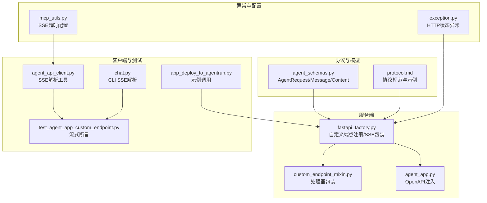
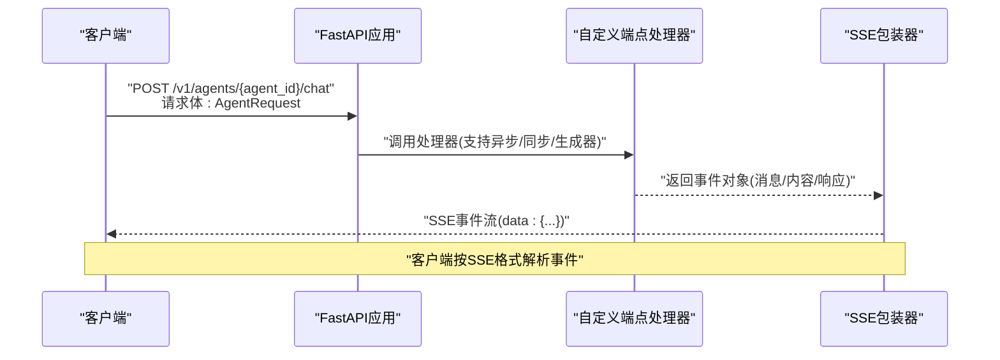
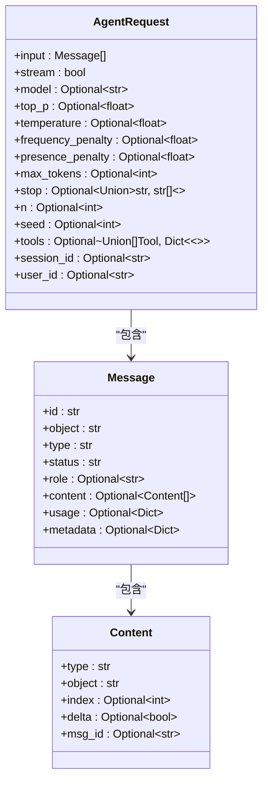
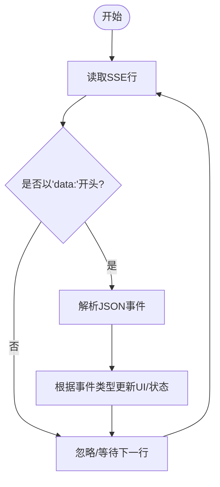
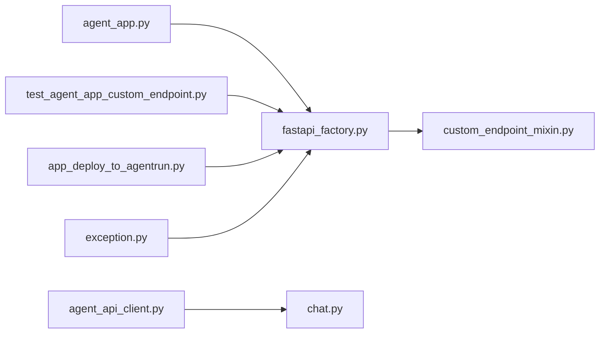

# 智能体请求API

<cite>
**本文引用的文件**
- [protocol.md](file://cookbook/en/protocol.md)
- [agent_schemas.py](file://src/agentscope_runtime/engine/schemas/agent_schemas.py)
- [fastapi_factory.py](file://src/agentscope_runtime/engine/deployers/utils/service_utils/fastapi_factory.py)
- [custom_endpoint_mixin.py](file://src/agentscope_runtime/engine/deployers/utils/service_utils/routing/custom_endpoint_mixin.py)
- [agent_app.py](file://src/agentscope_runtime/engine/app/agent_app.py)
- [exception.py](file://src/agentscope_runtime/engine/schemas/exception.py)
- [agent_api_client.py](file://src/agentscope_runtime/engine/helpers/agent_api_client.py)
- [chat.py](file://src/agentscope_runtime/cli/commands/chat.py)
- [mcp_utils.py](file://src/agentscope_runtime/sandbox/box/shared/routers/mcp_utils.py)
- [test_agent_app_custom_endpoint.py](file://tests/unit/test_agent_app_custom_endpoint.py)
- [app_deploy_to_agentrun.py](file://examples/deployments/agentrun_deploy/app_deploy_to_agentrun.py)
</cite>

## 目录
1. [简介](#简介)
2. [项目结构](#项目结构)
3. [核心组件](#核心组件)
4. [架构总览](#架构总览)
5. [详细组件分析](#详细组件分析)
6. [依赖分析](#依赖分析)
7. [性能考虑](#性能考虑)
8. [故障排查指南](#故障排查指南)
9. [结论](#结论)
10. [附录](#附录)

## 简介
本文件面向智能体请求API，聚焦于POST /v1/agents/{agent_id}/chat端点的完整规范，涵盖请求参数、响应格式与错误处理。文档基于仓库中的协议规范与实现细节，系统阐述AgentRequest模型字段、流式SSE响应格式、客户端处理方式，并提供认证与请求头建议、状态码说明及典型使用场景。

## 项目结构
围绕智能体聊天API的关键模块与职责如下：
- 协议与模型定义：位于引擎的schema目录，定义AgentRequest、Message、Content等核心数据结构与字段约束
- FastAPI应用工厂：负责注册自定义端点、自动包装异步/同步生成器为SSE流
- 异常体系：统一HTTP状态码与业务异常映射
- 客户端与CLI：提供SSE解析与命令行交互示例
- 测试与示例：验证流式行为、会话绑定与端到端调用

**图表来源**
- [agent_schemas.py](file://src/agentscope_runtime/engine/schemas/agent_schemas.py)
- [protocol.md](file://cookbook/en/protocol.md)
- [fastapi_factory.py](file://src/agentscope_runtime/engine/deployers/utils/service_utils/fastapi_factory.py)
- [custom_endpoint_mixin.py](file://src/agentscope_runtime/engine/deployers/utils/service_utils/routing/custom_endpoint_mixin.py)
- [agent_app.py](file://src/agentscope_runtime/engine/app/agent_app.py)
- [agent_api_client.py](file://src/agentscope_runtime/engine/helpers/agent_api_client.py)
- [chat.py](file://src/agentscope_runtime/cli/commands/chat.py)
- [test_agent_app_custom_endpoint.py](file://tests/unit/test_agent_app_custom_endpoint.py)
- [app_deploy_to_agentrun.py](file://examples/deployments/agentrun_deploy/app_deploy_to_agentrun.py)
- [exception.py](file://src/agentscope_runtime/engine/schemas/exception.py)
- [mcp_utils.py](file://src/agentscope_runtime/sandbox/box/shared/routers/mcp_utils.py)

**章节来源**
- [agent_schemas.py](file://src/agentscope_runtime/engine/schemas/agent_schemas.py)
- [protocol.md](file://cookbook/en/protocol.md)
- [fastapi_factory.py](file://src/agentscope_runtime/engine/deployers/utils/service_utils/fastapi_factory.py)
- [custom_endpoint_mixin.py](file://src/agentscope_runtime/engine/deployers/utils/service_utils/routing/custom_endpoint_mixin.py)
- [agent_app.py](file://src/agentscope_runtime/engine/app/agent_app.py)
- [agent_api_client.py](file://src/agentscope_runtime/engine/helpers/agent_api_client.py)
- [chat.py](file://src/agentscope_runtime/cli/commands/chat.py)
- [test_agent_app_custom_endpoint.py](file://tests/unit/test_agent_app_custom_endpoint.py)
- [app_deploy_to_agentrun.py](file://examples/deployments/agentrun_deploy/app_deploy_to_agentrun.py)
- [exception.py](file://src/agentscope_runtime/engine/schemas/exception.py)
- [mcp_utils.py](file://src/agentscope_runtime/sandbox/box/shared/routers/mcp_utils.py)

## 核心组件
- AgentRequest模型：承载输入消息、流式开关、模型参数、工具列表与会话上下文
- Message/Content：消息与内容片段，支持文本、图像、数据、音频、文件、拒绝等多模态
- SSE流式响应：基于Server-Sent Events，逐段推送增量内容与最终完成状态
- 异常与状态码：HTTP状态码与业务异常映射，便于客户端统一处理

**章节来源**
- [agent_schemas.py](file://src/agentscope_runtime/engine/schemas/agent_schemas.py)
- [protocol.md](file://cookbook/en/protocol.md)
- [exception.py](file://src/agentscope_runtime/engine/schemas/exception.py)

## 架构总览
下图展示从客户端到服务端的请求-响应路径，以及SSE事件的生成与消费：

**图表来源**
- [fastapi_factory.py](file://src/agentscope_runtime/engine/deployers/utils/service_utils/fastapi_factory.py)
- [custom_endpoint_mixin.py](file://src/agentscope_runtime/engine/deployers/utils/service_utils/routing/custom_endpoint_mixin.py)
- [agent_api_client.py](file://src/agentscope_runtime/engine/helpers/agent_api_client.py)

## 详细组件分析

### AgentRequest模型与字段定义
- 输入消息列表：由Message组成，每条Message可包含多个Content片段
- 流式开关：stream布尔值，默认开启，启用增量内容推送
- 模型选择：model字符串，指定具体推理模型
- 采样参数：top_p、temperature、frequency_penalty、presence_penalty
- 生成控制：max_tokens、stop、n、seed
- 工具定义：tools数组，支持函数式工具
- 会话上下文：session_id、user_id

**图表来源**
- [agent_schemas.py](file://src/agentscope_runtime/engine/schemas/agent_schemas.py)

**章节来源**
- [agent_schemas.py](file://src/agentscope_runtime/engine/schemas/agent_schemas.py)
- [protocol.md](file://cookbook/en/protocol.md)

### 请求与响应规范

- 端点：POST /v1/agents/{agent_id}/chat
- 认证：未在仓库中发现强制认证机制；示例中出现“X-Agentrun-Session-Id”头，用于会话绑定或实例固定，非通用鉴权
- 请求头：
  - Content-Type: application/json
  - Accept: text/event-stream（流式响应）
  - 可选：X-Agentrun-Session-Id（示例中用于绑定固定实例）
- 请求体：AgentRequest
- 成功响应：200 OK，Content-Type: text/event-stream
- 错误响应：根据异常体系映射HTTP状态码

**章节来源**
- [test_agent_app_custom_endpoint.py](file://tests/unit/test_agent_app_custom_endpoint.py)
- [app_deploy_to_agentrun.py](file://examples/deployments/agentrun_deploy/app_deploy_to_agentrun.py)

### 流式SSE格式与客户端处理
- 服务器端：自动将生成器/异步生成器包装为SSE事件，异常时输出错误载荷
- 客户端侧：逐行解析SSE，识别data字段并反序列化为事件对象
- 典型事件序列：响应创建、消息创建、内容增量、内容完成、消息完成、响应完成

**图表来源**
- [agent_api_client.py](file://src/agentscope_runtime/engine/helpers/agent_api_client.py)
- [chat.py](file://src/agentscope_runtime/cli/commands/chat.py)

**章节来源**
- [fastapi_factory.py](file://src/agentscope_runtime/engine/deployers/utils/service_utils/fastapi_factory.py)
- [agent_api_client.py](file://src/agentscope_runtime/engine/helpers/agent_api_client.py)
- [chat.py](file://src/agentscope_runtime/cli/commands/chat.py)

### 错误处理与状态码
- HTTP状态码映射：仓库提供统一异常基类与常见HTTP异常（如400、401、403、404、405、409、422、429、500、502、503、504）
- 业务异常：认证失败、令牌过期/无效、权限不足等
- 流式错误：处理器抛出异常时，SSE包装器输出错误载荷，客户端据此终止或重试

**章节来源**
- [exception.py](file://src/agentscope_runtime/engine/schemas/exception.py)
- [fastapi_factory.py](file://src/agentscope_runtime/engine/deployers/utils/service_utils/fastapi_factory.py)

### 典型使用场景

- 文本对话
  - 请求：input包含用户消息与历史消息，stream为true
  - 响应：SSE逐步推送文本增量，最终聚合为完整内容
- 工具调用
  - 请求：tools定义函数工具；input包含助手消息（function_call）与工具输出消息
  - 响应：内容类型为data，携带工具调用名称与参数，随后工具输出作为独立消息
- 多模态内容
  - 请求：input中content包含text、image等类型
  - 响应：对应内容类型增量推送，最终完成

**章节来源**
- [protocol.md](file://cookbook/en/protocol.md)
- [agent_schemas.py](file://src/agentscope_runtime/engine/schemas/agent_schemas.py)

## 依赖分析
- 组件耦合
  - FastAPI工厂依赖自定义端点混合器，统一包装处理器签名与参数解析
  - AgentApp在OpenAPI中注入AgentRequest等协议模型定义
  - 客户端工具依赖SSE解析函数，CLI提供示例解析逻辑
- 外部依赖
  - aiohttp用于测试中的SSE客户端
  - 示例中使用AgentRun会话头进行实例绑定

**图表来源**
- [agent_app.py](file://src/agentscope_runtime/engine/app/agent_app.py)
- [fastapi_factory.py](file://src/agentscope_runtime/engine/deployers/utils/service_utils/fastapi_factory.py)
- [custom_endpoint_mixin.py](file://src/agentscope_runtime/engine/deployers/utils/service_utils/routing/custom_endpoint_mixin.py)
- [agent_api_client.py](file://src/agentscope_runtime/engine/helpers/agent_api_client.py)
- [chat.py](file://src/agentscope_runtime/cli/commands/chat.py)
- [test_agent_app_custom_endpoint.py](file://tests/unit/test_agent_app_custom_endpoint.py)
- [app_deploy_to_agentrun.py](file://examples/deployments/agentrun_deploy/app_deploy_to_agentrun.py)
- [exception.py](file://src/agentscope_runtime/engine/schemas/exception.py)

**章节来源**
- [agent_app.py](file://src/agentscope_runtime/engine/app/agent_app.py)
- [fastapi_factory.py](file://src/agentscope_runtime/engine/deployers/utils/service_utils/fastapi_factory.py)
- [custom_endpoint_mixin.py](file://src/agentscope_runtime/engine/deployers/utils/service_utils/routing/custom_endpoint_mixin.py)
- [agent_api_client.py](file://src/agentscope_runtime/engine/helpers/agent_api_client.py)
- [chat.py](file://src/agentscope_runtime/cli/commands/chat.py)
- [test_agent_app_custom_endpoint.py](file://tests/unit/test_agent_app_custom_endpoint.py)
- [app_deploy_to_agentrun.py](file://examples/deployments/agentrun_deploy/app_deploy_to_agentrun.py)
- [exception.py](file://src/agentscope_runtime/engine/schemas/exception.py)

## 性能考虑
- 流式传输：SSE减少首字节延迟，适合长文本与工具调用输出
- 背压控制：客户端应按事件顺序处理，避免阻塞网络缓冲区
- 超时配置：SSE读取超时可配置，避免长时间空闲连接占用
- 并发与队列：任务端点支持队列与Celery混合执行，适用于高并发场景

[本节为通用指导，不直接分析具体文件]

## 故障排查指南
- 无法接收SSE事件
  - 检查Accept头是否为text/event-stream
  - 确认服务器端已将处理器包装为生成器
- 事件解析失败
  - 确保逐行解析并仅处理以"data:"开头的行
  - 注意事件对象的嵌套结构与状态字段
- 会话绑定问题
  - 示例中使用X-Agentrun-Session-Id头绑定实例，需确保后端支持该头部
- 异常与重试
  - 依据HTTP状态码与错误载荷决定重试策略
  - 对可恢复错误（如503/504）实施指数退避

**章节来源**
- [agent_api_client.py](file://src/agentscope_runtime/engine/helpers/agent_api_client.py)
- [chat.py](file://src/agentscope_runtime/cli/commands/chat.py)
- [mcp_utils.py](file://src/agentscope_runtime/sandbox/box/shared/routers/mcp_utils.py)
- [exception.py](file://src/agentscope_runtime/engine/schemas/exception.py)

## 结论
本文档基于仓库中的协议与实现，给出了智能体请求API的完整规范：请求参数、响应格式、SSE流式细节、错误处理与典型场景。实际部署中，建议结合AgentRun示例头进行会话绑定，并遵循SSE解析最佳实践以获得稳定体验。

[本节为总结性内容，不直接分析具体文件]

## 附录

### 请求与响应示例（路径引用）
- 文本对话请求示例：[protocol.md](file://cookbook/en/protocol.md)
- 多模态内容请求示例：[protocol.md](file://cookbook/en/protocol.md)
- 流式响应示例序列：[protocol.md](file://cookbook/en/protocol.md)
- 测试中SSE断言与流式长度：[test_agent_app_custom_endpoint.py](file://tests/unit/test_agent_app_custom_endpoint.py)
- AgentRun示例调用（含会话头）：[app_deploy_to_agentrun.py](file://examples/deployments/agentrun_deploy/app_deploy_to_agentrun.py)

**章节来源**
- [protocol.md](file://cookbook/en/protocol.md)
- [test_agent_app_custom_endpoint.py](file://tests/unit/test_agent_app_custom_endpoint.py)
- [app_deploy_to_agentrun.py](file://examples/deployments/agentrun_deploy/app_deploy_to_agentrun.py)