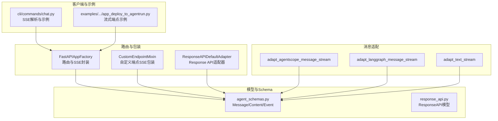
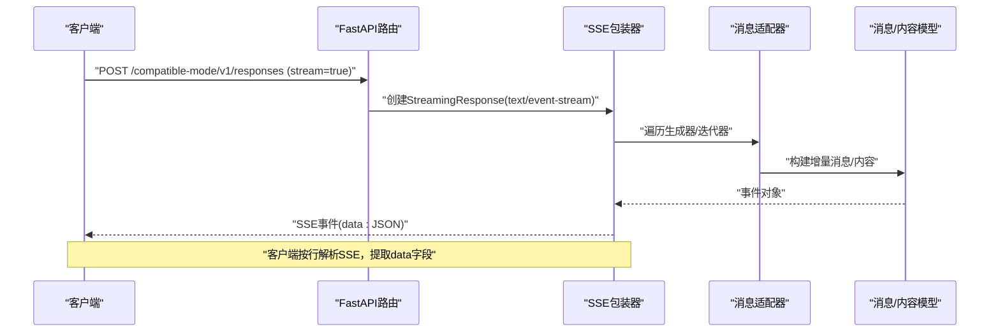
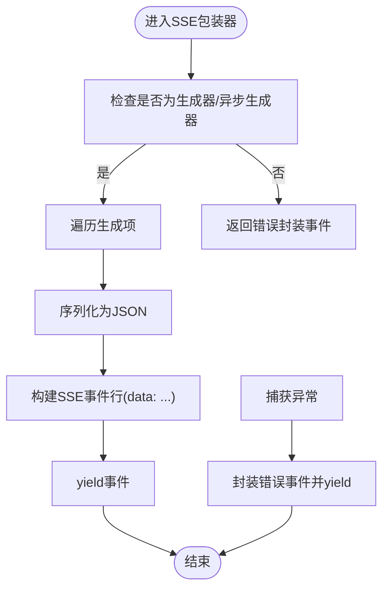
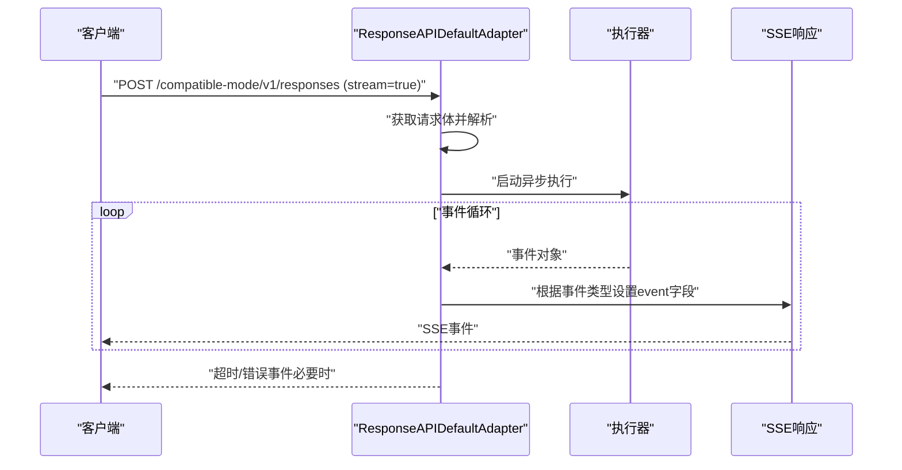
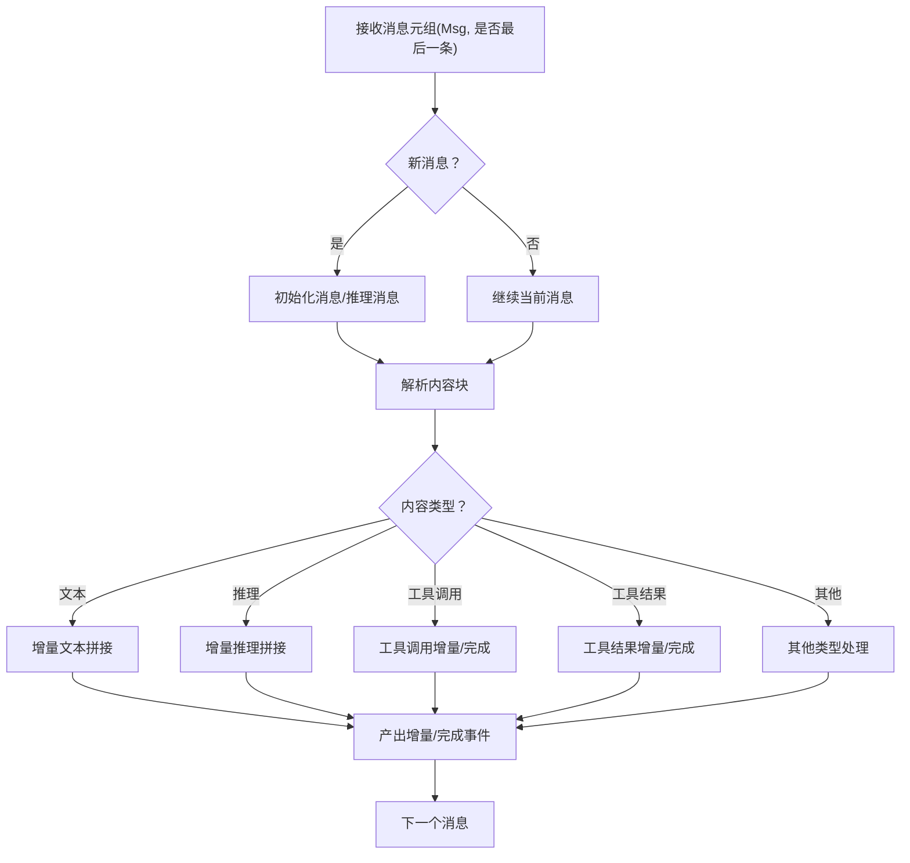
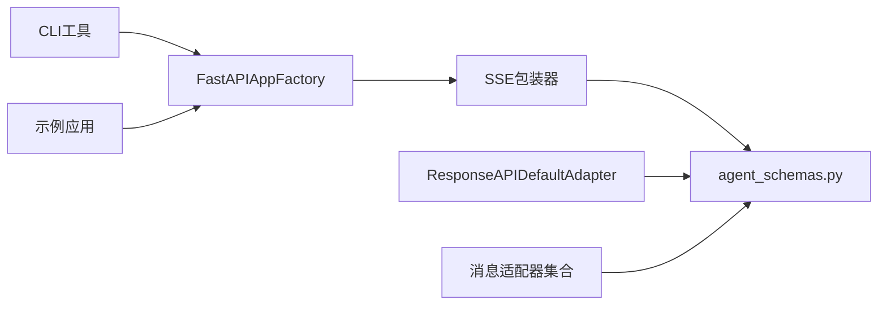

# 流式响应API

<cite>
**本文引用的文件**
- [src/agentscope_runtime/engine/deployers/utils/service_utils/fastapi_factory.py](file://src/agentscope_runtime/engine/deployers/utils/service_utils/fastapi_factory.py)
- [src/agentscope_runtime/engine/deployers/utils/service_utils/routing/custom_endpoint_mixin.py](file://src/agentscope_runtime/engine/deployers/utils/service_utils/routing/custom_endpoint_mixin.py)
- [src/agentscope_runtime/engine/deployers/adapter/responses/response_api_protocol_adapter.py](file://src/agentscope_runtime/engine/deployers/adapter/responses/response_api_protocol_adapter.py)
- [src/agentscope_runtime/adapters/agentscope/stream.py](file://src/agentscope_runtime/adapters/agentscope/stream.py)
- [src/agentscope_runtime/adapters/langgraph/stream.py](file://src/agentscope_runtime/adapters/langgraph/stream.py)
- [src/agentscope_runtime/adapters/text/stream.py](file://src/agentscope_runtime/adapters/text/stream.py)
- [src/agentscope_runtime/engine/schemas/agent_schemas.py](file://src/agentscope_runtime/engine/schemas/agent_schemas.py)
- [src/agentscope_runtime/engine/schemas/response_api.py](file://src/agentscope_runtime/engine/schemas/response_api.py)
- [src/agentscope_runtime/cli/commands/chat.py](file://src/agentscope_runtime/cli/commands/chat.py)
- [src/agentscope_runtime/sandbox/box/shared/routers/mcp_utils.py](file://src/agentscope_runtime/sandbox/box/shared/routers/mcp_utils.py)
- [tests/unit/test_agent_app_custom_endpoint.py](file://tests/unit/test_agent_app_custom_endpoint.py)
- [tests/integrated/test_langgraph_agent_app.py](file://tests/integrated/test_langgraph_agent_app.py)
- [examples/deployments/agentrun_deploy/app_deploy_to_agentrun.py](file://examples/deployments/agentrun_deploy/app_deploy_to_agentrun.py)
</cite>

## 目录
1. [简介](#简介)
2. [项目结构](#项目结构)
3. [核心组件](#核心组件)
4. [架构总览](#架构总览)
5. [详细组件分析](#详细组件分析)
6. [依赖关系分析](#依赖关系分析)
7. [性能考量](#性能考量)
8. [故障排查指南](#故障排查指南)
9. [结论](#结论)
10. [附录](#附录)

## 简介
本文件系统性地阐述本仓库中基于 Server-Sent Events（SSE）的流式响应API规范与实现，覆盖以下方面：
- 连接建立：HTTP POST + text/event-stream 媒体类型
- 数据格式：SSE data字段的JSON序列化；可选事件类型（event字段）
- 断开处理：超时控制、错误事件封装、连接头设置
- 消息模型：消息类型、内容类型、增量内容与完成态
- 客户端示例：命令行工具解析SSE、curl示例
- 心跳与重试：服务端超时与客户端重连策略
- WebSocket替代：SSE在单向推送场景的优势与最佳实践
- 性能优化与高并发：限流、缓冲、序列化策略

## 项目结构
围绕SSE流式响应的关键模块分布如下：
- 路由与包装层：FastAPI路由注册、SSE事件封装、自定义端点混合
- 协议适配层：Response API兼容适配器（OpenAI Response API风格）
- 消息适配层：将不同来源的消息流（Agentscope、LangGraph、文本）统一为增量消息
- 模型与Schema：消息、内容、事件等统一数据结构
- 客户端与示例：CLI工具解析SSE、示例应用展示流式端点
- 测试与集成：单元测试验证SSE行为、集成测试验证流式输出

图表来源
- [src/agentscope_runtime/engine/deployers/utils/service_utils/fastapi_factory.py:435-469](file://src/agentscope_runtime/engine/deployers/utils/service_utils/fastapi_factory.py#L435-L469)
- [src/agentscope_runtime/engine/deployers/utils/service_utils/routing/custom_endpoint_mixin.py:126-206](file://src/agentscope_runtime/engine/deployers/utils/service_utils/routing/custom_endpoint_mixin.py#L126-L206)
- [src/agentscope_runtime/engine/deployers/adapter/responses/response_api_protocol_adapter.py:285-315](file://src/agentscope_runtime/engine/deployers/adapter/responses/response_api_protocol_adapter.py#L285-L315)
- [src/agentscope_runtime/adapters/agentscope/stream.py:33-684](file://src/agentscope_runtime/adapters/agentscope/stream.py#L33-L684)
- [src/agentscope_runtime/adapters/langgraph/stream.py:28-257](file://src/agentscope_runtime/adapters/langgraph/stream.py#L28-L257)
- [src/agentscope_runtime/adapters/text/stream.py:12-31](file://src/agentscope_runtime/adapters/text/stream.py#L12-L31)
- [src/agentscope_runtime/engine/schemas/agent_schemas.py:18-36](file://src/agentscope_runtime/engine/schemas/agent_schemas.py#L18-L36)
- [src/agentscope_runtime/engine/schemas/response_api.py:35-66](file://src/agentscope_runtime/engine/schemas/response_api.py#L35-L66)
- [src/agentscope_runtime/cli/commands/chat.py:517-737](file://src/agentscope_runtime/cli/commands/chat.py#L517-L737)
- [examples/deployments/agentrun_deploy/app_deploy_to_agentrun.py:98-107](file://examples/deployments/agentrun_deploy/app_deploy_to_agentrun.py#L98-L107)

章节来源
- [src/agentscope_runtime/engine/deployers/utils/service_utils/fastapi_factory.py:435-469](file://src/agentscope_runtime/engine/deployers/utils/service_utils/fastapi_factory.py#L435-L469)
- [src/agentscope_runtime/engine/deployers/utils/service_utils/routing/custom_endpoint_mixin.py:126-206](file://src/agentscope_runtime/engine/deployers/utils/service_utils/routing/custom_endpoint_mixin.py#L126-L206)
- [src/agentscope_runtime/engine/deployers/adapter/responses/response_api_protocol_adapter.py:285-315](file://src/agentscope_runtime/engine/deployers/adapter/responses/response_api_protocol_adapter.py#L285-L315)

## 核心组件
- SSE路由与事件封装
  - FastAPI路由以text/event-stream媒体类型返回流式响应，并设置必要的HTTP头（如缓存控制、连接保持、Nginx旁路缓冲禁用等）。
  - 自定义端点混合类负责将任意生成器（同步/异步）自动包装为SSE事件字符串，统一序列化策略。
  - Response API适配器提供OpenAI Response API风格的兼容端点，支持流式与非流式两种模式，并内置超时控制与错误事件。

- 消息适配器
  - 将Agentscope消息流、LangGraph消息流、纯文本流统一转换为增量消息（Message/Content），支持文本、图像、音频、视频、文件、数据（函数调用等）等多类型内容的增量拼接与完成态发布。

- 数据模型
  - 统一的消息类型（message、function_call、plugin_call、mcp_call、reasoning等）、内容类型（text、image、audio、video、file、data等）以及事件状态（created、in_progress、completed、failed等）。

章节来源
- [src/agentscope_runtime/engine/deployers/utils/service_utils/fastapi_factory.py:697-725](file://src/agentscope_runtime/engine/deployers/utils/service_utils/fastapi_factory.py#L697-L725)
- [src/agentscope_runtime/engine/deployers/utils/service_utils/routing/custom_endpoint_mixin.py:94-123](file://src/agentscope_runtime/engine/deployers/utils/service_utils/routing/custom_endpoint_mixin.py#L94-L123)
- [src/agentscope_runtime/engine/deployers/adapter/responses/response_api_protocol_adapter.py:22-31](file://src/agentscope_runtime/engine/deployers/adapter/responses/response_api_protocol_adapter.py#L22-L31)
- [src/agentscope_runtime/adapters/agentscope/stream.py:33-684](file://src/agentscope_runtime/adapters/agentscope/stream.py#L33-L684)
- [src/agentscope_runtime/adapters/langgraph/stream.py:28-257](file://src/agentscope_runtime/adapters/langgraph/stream.py#L28-L257)
- [src/agentscope_runtime/adapters/text/stream.py:12-31](file://src/agentscope_runtime/adapters/text/stream.py#L12-L31)
- [src/agentscope_runtime/engine/schemas/agent_schemas.py:18-36](file://src/agentscope_runtime/engine/schemas/agent_schemas.py#L18-L36)

## 架构总览
下图展示了从请求到SSE事件输出的端到端流程，包括路由、协议适配、消息适配与客户端消费。

图表来源
- [src/agentscope_runtime/engine/deployers/adapter/responses/response_api_protocol_adapter.py:44-96](file://src/agentscope_runtime/engine/deployers/adapter/responses/response_api_protocol_adapter.py#L44-L96)
- [src/agentscope_runtime/engine/deployers/utils/service_utils/fastapi_factory.py:597-626](file://src/agentscope_runtime/engine/deployers/utils/service_utils/fastapi_factory.py#L597-L626)
- [src/agentscope_runtime/engine/deployers/utils/service_utils/routing/custom_endpoint_mixin.py:126-206](file://src/agentscope_runtime/engine/deployers/utils/service_utils/routing/custom_endpoint_mixin.py#L126-L206)
- [src/agentscope_runtime/adapters/agentscope/stream.py:33-684](file://src/agentscope_runtime/adapters/agentscope/stream.py#L33-L684)

## 详细组件分析

### SSE路由与事件封装
- 路由注册
  - 主要路由以text/event-stream媒体类型返回StreamingResponse，并设置缓存控制、连接保持、Nginx旁路缓冲禁用等头部，确保客户端正确接收SSE事件。
- 事件封装
  - 序列化策略支持多种类型（基础类型、Pydantic模型、dataclass、可映射对象），并限制递归深度，避免过深嵌套导致性能问题。
  - 错误处理：捕获生成器异常，封装为包含错误信息的SSE事件发送给客户端。

图表来源
- [src/agentscope_runtime/engine/deployers/utils/service_utils/fastapi_factory.py:697-725](file://src/agentscope_runtime/engine/deployers/utils/service_utils/fastapi_factory.py#L697-L725)
- [src/agentscope_runtime/engine/deployers/utils/service_utils/fastapi_factory.py:728-806](file://src/agentscope_runtime/engine/deployers/utils/service_utils/fastapi_factory.py#L728-L806)
- [src/agentscope_runtime/engine/deployers/utils/service_utils/routing/custom_endpoint_mixin.py:94-123](file://src/agentscope_runtime/engine/deployers/utils/service_utils/routing/custom_endpoint_mixin.py#L94-L123)
- [src/agentscope_runtime/engine/deployers/utils/service_utils/routing/custom_endpoint_mixin.py:126-206](file://src/agentscope_runtime/engine/deployers/utils/service_utils/routing/custom_endpoint_mixin.py#L126-L206)

章节来源
- [src/agentscope_runtime/engine/deployers/utils/service_utils/fastapi_factory.py:435-469](file://src/agentscope_runtime/engine/deployers/utils/service_utils/fastapi_factory.py#L435-L469)
- [src/agentscope_runtime/engine/deployers/utils/service_utils/fastapi_factory.py:697-725](file://src/agentscope_runtime/engine/deployers/utils/service_utils/fastapi_factory.py#L697-L725)
- [src/agentscope_runtime/engine/deployers/utils/service_utils/routing/custom_endpoint_mixin.py:94-123](file://src/agentscope_runtime/engine/deployers/utils/service_utils/routing/custom_endpoint_mixin.py#L94-L123)

### Response API适配器（OpenAI Response API兼容）
- 端点路径与请求体
  - 提供兼容OpenAI Response API的端点，支持stream参数控制是否返回SSE流。
- 超时与并发
  - 使用信号量限制最大并发请求数；对流式请求设置超时控制，超时后发送失败事件。
- 事件类型
  - 根据事件类型动态设置SSE事件名（event字段），便于客户端区分不同类型事件。
- 错误事件
  - 对异常进行捕获并发送标准化的失败事件，包含错误码与消息。

图表来源
- [src/agentscope_runtime/engine/deployers/adapter/responses/response_api_protocol_adapter.py:44-96](file://src/agentscope_runtime/engine/deployers/adapter/responses/response_api_protocol_adapter.py#L44-L96)
- [src/agentscope_runtime/engine/deployers/adapter/responses/response_api_protocol_adapter.py:161-217](file://src/agentscope_runtime/engine/deployers/adapter/responses/response_api_protocol_adapter.py#L161-L217)
- [src/agentscope_runtime/engine/deployers/adapter/responses/response_api_protocol_adapter.py:219-283](file://src/agentscope_runtime/engine/deployers/adapter/responses/response_api_protocol_adapter.py#L219-L283)

章节来源
- [src/agentscope_runtime/engine/deployers/adapter/responses/response_api_protocol_adapter.py:22-31](file://src/agentscope_runtime/engine/deployers/adapter/responses/response_api_protocol_adapter.py#L22-L31)
- [src/agentscope_runtime/engine/deployers/adapter/responses/response_api_protocol_adapter.py:44-96](file://src/agentscope_runtime/engine/deployers/adapter/responses/response_api_protocol_adapter.py#L44-L96)
- [src/agentscope_runtime/engine/deployers/adapter/responses/response_api_protocol_adapter.py:161-217](file://src/agentscope_runtime/engine/deployers/adapter/responses/response_api_protocol_adapter.py#L161-L217)

### Agentscope消息流适配器
- 功能概述
  - 将Agentscope消息流转换为增量消息，支持文本增量、推理内容增量、工具调用与结果等。
- 关键特性
  - 增量拼接：对文本、图像、音频、视频、文件等类型进行增量拼接与完成态发布。
  - 工具链路：支持工具调用开始、参数增量、结果增量与完成态。
  - 类型转换：支持自定义类型转换器，将特定块类型转换为增量事件。
- 复杂度与性能
  - 时间复杂度与消息数量线性相关；通过增量拼接减少重复序列化成本。

图表来源
- [src/agentscope_runtime/adapters/agentscope/stream.py:33-684](file://src/agentscope_runtime/adapters/agentscope/stream.py#L33-L684)

章节来源
- [src/agentscope_runtime/adapters/agentscope/stream.py:33-684](file://src/agentscope_runtime/adapters/agentscope/stream.py#L33-L684)

### LangGraph消息流适配器
- 功能概述
  - 将LangGraph消息流转换为增量消息，支持人类消息、AI消息（含工具调用）、系统消息与工具消息。
- 关键特性
  - 工具调用分片聚合：支持工具调用分片收集与最终合并。
  - 最终完成：在消息末尾发出完成态事件。
- 复杂度与性能
  - 时间复杂度与消息数量线性相关；通过分片聚合减少重复序列化成本。

章节来源
- [src/agentscope_runtime/adapters/langgraph/stream.py:28-257](file://src/agentscope_runtime/adapters/langgraph/stream.py#L28-L257)

### 文本流适配器
- 功能概述
  - 将纯文本流转换为增量文本消息，适合简单文本输出场景。
- 关键特性
  - 每个文本片段生成一个增量内容事件，并在流结束后发出完成态。

章节来源
- [src/agentscope_runtime/adapters/text/stream.py:12-31](file://src/agentscope_runtime/adapters/text/stream.py#L12-L31)

### 数据模型与消息类型
- 消息类型
  - 包括message、function_call、plugin_call、mcp_call、reasoning、heartbeat、error等。
- 内容类型
  - 支持text、image、audio、video、file、data等。
- 事件状态
  - created、in_progress、completed、failed等，用于表达事件生命周期。

章节来源
- [src/agentscope_runtime/engine/schemas/agent_schemas.py:18-36](file://src/agentscope_runtime/engine/schemas/agent_schemas.py#L18-L36)
- [src/agentscope_runtime/engine/schemas/agent_schemas.py:480-734](file://src/agentscope_runtime/engine/schemas/agent_schemas.py#L480-L734)

### 客户端连接与事件监听
- 命令行工具解析
  - CLI工具提供SSE行解析函数，支持data、event、id、retry等字段提取。
- curl示例
  - 示例应用提供curl命令行调用流式端点的示例，包含Accept头设置为text/event-stream。

章节来源
- [src/agentscope_runtime/cli/commands/chat.py:517-737](file://src/agentscope_runtime/cli/commands/chat.py#L517-L737)
- [examples/deployments/agentrun_deploy/app_deploy_to_agentrun.py:393-413](file://examples/deployments/agentrun_deploy/app_deploy_to_agentrun.py#L393-L413)

## 依赖关系分析
- 组件耦合
  - 路由层与包装层解耦，通过StreamingResponse抽象SSE输出。
  - 适配器层与消息模型层松耦合，通过统一的事件对象进行交互。
- 外部依赖
  - FastAPI用于路由与中间件；Pydantic用于模型序列化；OpenAI Response API类型用于兼容层。
- 可能的循环依赖
  - 当前结构未发现循环导入；各层职责清晰，接口稳定。

图表来源
- [src/agentscope_runtime/engine/deployers/utils/service_utils/fastapi_factory.py:435-469](file://src/agentscope_runtime/engine/deployers/utils/service_utils/fastapi_factory.py#L435-L469)
- [src/agentscope_runtime/engine/deployers/adapter/responses/response_api_protocol_adapter.py:285-315](file://src/agentscope_runtime/engine/deployers/adapter/responses/response_api_protocol_adapter.py#L285-L315)
- [src/agentscope_runtime/engine/schemas/agent_schemas.py:18-36](file://src/agentscope_runtime/engine/schemas/agent_schemas.py#L18-L36)
- [src/agentscope_runtime/cli/commands/chat.py:517-737](file://src/agentscope_runtime/cli/commands/chat.py#L517-L737)
- [examples/deployments/agentrun_deploy/app_deploy_to_agentrun.py:98-107](file://examples/deployments/agentrun_deploy/app_deploy_to_agentrun.py#L98-L107)

章节来源
- [src/agentscope_runtime/engine/deployers/utils/service_utils/fastapi_factory.py:435-469](file://src/agentscope_runtime/engine/deployers/utils/service_utils/fastapi_factory.py#L435-L469)
- [src/agentscope_runtime/engine/deployers/adapter/responses/response_api_protocol_adapter.py:285-315](file://src/agentscope_runtime/engine/deployers/adapter/responses/response_api_protocol_adapter.py#L285-L315)
- [src/agentscope_runtime/engine/schemas/agent_schemas.py:18-36](file://src/agentscope_runtime/engine/schemas/agent_schemas.py#L18-L36)

## 性能考量
- 序列化与头部
  - 使用JSON序列化并设置合适的HTTP头（如禁用Nginx缓冲）有助于降低延迟与提升客户端体验。
- 生成器与增量
  - 采用生成器与增量拼接，避免一次性构建大对象，降低内存峰值。
- 超时与并发
  - 适配器层提供超时控制与并发信号量，防止资源耗尽。
- 缓冲与背压
  - 在高吞吐场景下，建议结合客户端背压策略与服务端限速，避免队列堆积。

## 故障排查指南
- 常见问题
  - SSE未收到事件：确认Accept头设置为text/event-stream，且路由返回StreamingResponse。
  - 事件解析失败：检查data字段前缀与JSON格式，确保事件行以data:开头。
  - 超时与中断：服务端会发送超时/错误事件，客户端需正确处理event字段与错误载荷。
- 定位方法
  - 查看路由与包装器的日志输出，定位异常发生位置。
  - 使用示例应用提供的curl命令进行最小复现。
- 相关实现参考
  - SSE事件封装与错误事件发送
  - Response API适配器的超时与错误事件
  - CLI工具的SSE行解析

章节来源
- [src/agentscope_runtime/engine/deployers/utils/service_utils/fastapi_factory.py:768-806](file://src/agentscope_runtime/engine/deployers/utils/service_utils/fastapi_factory.py#L768-L806)
- [src/agentscope_runtime/engine/deployers/utils/service_utils/routing/custom_endpoint_mixin.py:166-176](file://src/agentscope_runtime/engine/deployers/utils/service_utils/routing/custom_endpoint_mixin.py#L166-L176)
- [src/agentscope_runtime/engine/deployers/adapter/responses/response_api_protocol_adapter.py:182-217](file://src/agentscope_runtime/engine/deployers/adapter/responses/response_api_protocol_adapter.py#L182-L217)
- [src/agentscope_runtime/cli/commands/chat.py:517-737](file://src/agentscope_runtime/cli/commands/chat.py#L517-L737)

## 结论
本仓库的SSE流式响应API通过清晰的路由层、灵活的SSE包装器与强大的消息适配器，实现了对多源消息流的统一输出。配合Response API兼容层与完善的错误处理，能够满足生产环境下的实时交互需求。建议在高并发场景下结合超时与并发控制策略，并在客户端侧实现健壮的重连与错误恢复机制。

## 附录

### SSE数据格式与事件类型
- 数据格式
  - 每条事件以data: 开头，后跟JSON序列化的事件载荷，最后以空行结尾。
- 事件类型
  - 可选event字段用于标识事件类型；Response API适配器会根据事件类型动态设置该字段。
- 错误事件
  - 发生异常时，服务端会发送包含错误信息的失败事件，客户端需据此进行降级处理。

章节来源
- [src/agentscope_runtime/engine/deployers/adapter/responses/response_api_protocol_adapter.py:242-244](file://src/agentscope_runtime/engine/deployers/adapter/responses/response_api_protocol_adapter.py#L242-L244)
- [src/agentscope_runtime/engine/deployers/adapter/responses/response_api_protocol_adapter.py:260-264](file://src/agentscope_runtime/engine/deployers/adapter/responses/response_api_protocol_adapter.py#L260-L264)

### 客户端连接示例与重试策略
- curl示例
  - 使用Accept头指定text/event-stream，配合--no-buffer以实时查看事件。
- 重连策略
  - 建议客户端在连接断开后进行指数退避重连，并在事件中携带重试间隔（retry字段）时遵循服务端指示。
- 心跳与保活
  - 服务端通过设置Connection与Cache-Control头维持长连接；客户端可在空闲时发送轻量探测请求以维持会话。

章节来源
- [examples/deployments/agentrun_deploy/app_deploy_to_agentrun.py:393-413](file://examples/deployments/agentrun_deploy/app_deploy_to_agentrun.py#L393-L413)
- [src/agentscope_runtime/engine/deployers/utils/service_utils/fastapi_factory.py:464-468](file://src/agentscope_runtime/engine/deployers/utils/service_utils/fastapi_factory.py#L464-L468)

### WebSocket替代方案与最佳实践
- 适用场景
  - SSE适用于服务器到客户端的单向推送场景；若需要双向通信，可考虑WebSocket。
- 最佳实践
  - 优先使用SSE进行实时文本/增量数据推送；在需要低延迟双向交互时再选用WebSocket。
  - 在网关或代理层正确配置SSE支持（如禁用缓冲、透传长连接）。

[本节为概念性内容，不直接分析具体文件]

### 测试与验证
- 单元测试
  - 验证SSE端点返回text/event-stream、事件载荷正确性与错误事件发送。
- 集成测试
  - 验证LangGraph等集成场景下的流式输出行为。

章节来源
- [tests/unit/test_agent_app_custom_endpoint.py:172-203](file://tests/unit/test_agent_app_custom_endpoint.py#L172-L203)
- [tests/unit/test_agent_app_custom_endpoint.py:207-238](file://tests/unit/test_agent_app_custom_endpoint.py#L207-L238)
- [tests/integrated/test_langgraph_agent_app.py:207-227](file://tests/integrated/test_langgraph_agent_app.py#L207-L227)

### 服务端超时与客户端读取超时
- 服务端超时
  - Response API适配器对流式请求设置超时控制，超时后发送失败事件。
- 客户端读取超时
  - 客户端侧可配置SSE读取超时，避免长时间阻塞；示例中对SSE读取超时有默认值与可配置项。

章节来源
- [src/agentscope_runtime/engine/deployers/adapter/responses/response_api_protocol_adapter.py:182-198](file://src/agentscope_runtime/engine/deployers/adapter/responses/response_api_protocol_adapter.py#L182-L198)
- [src/agentscope_runtime/sandbox/box/shared/routers/mcp_utils.py:73-95](file://src/agentscope_runtime/sandbox/box/shared/routers/mcp_utils.py#L73-L95)