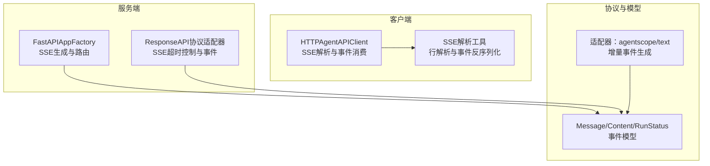
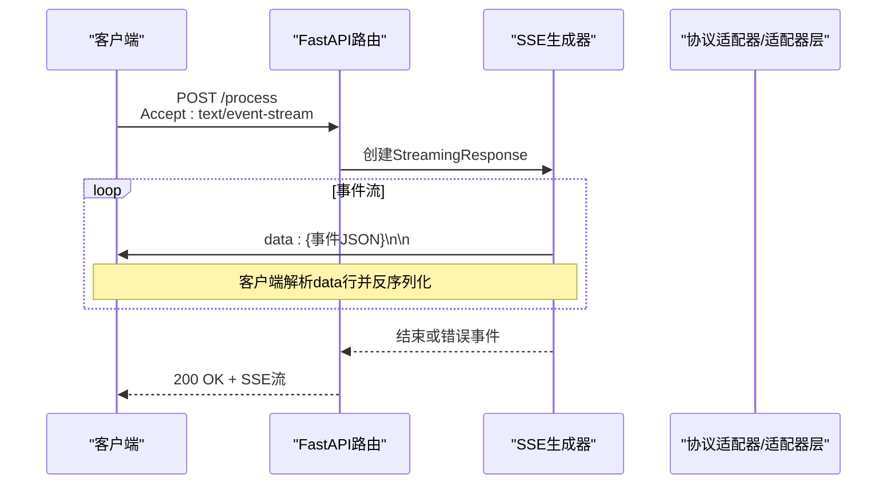
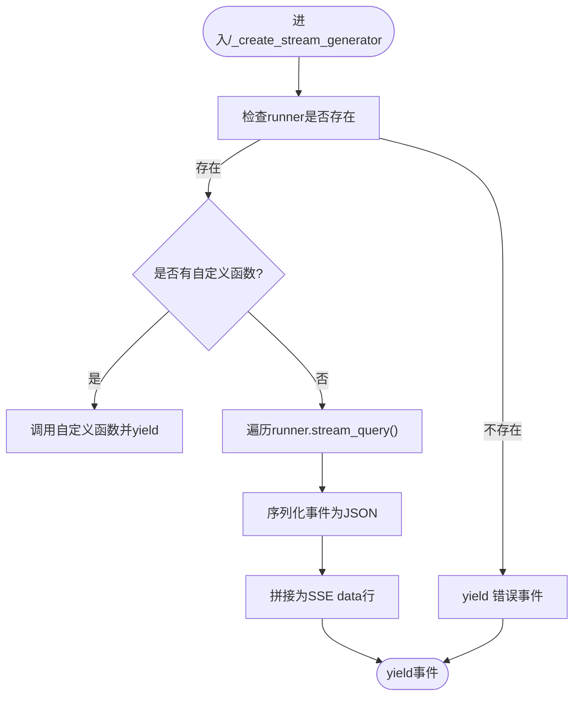
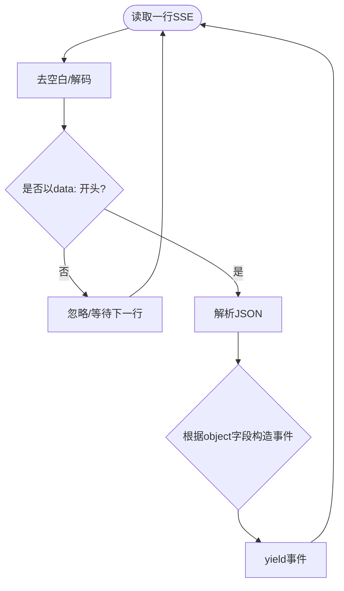
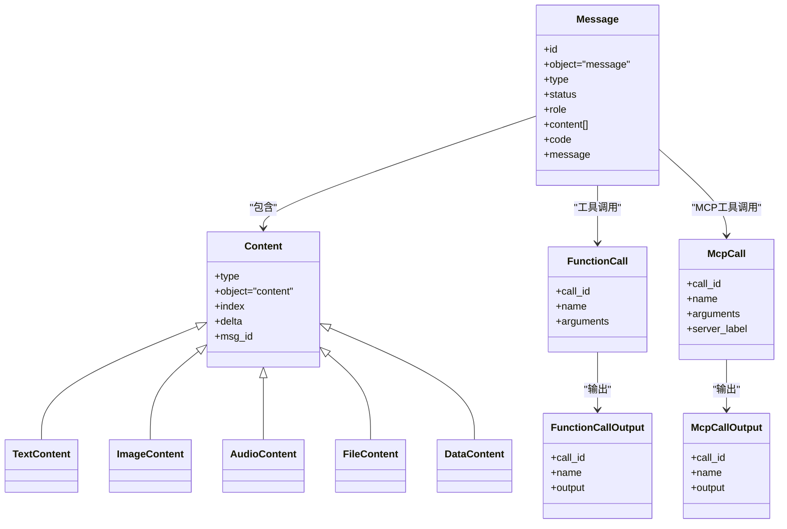
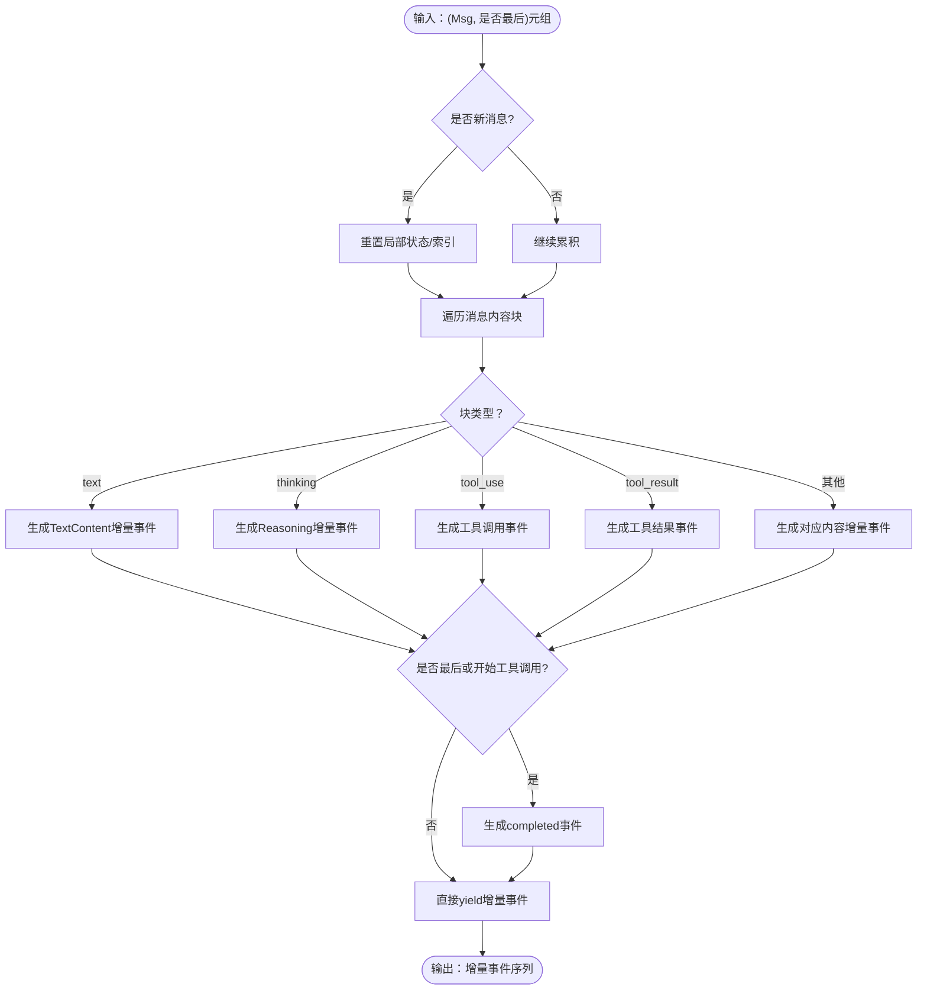
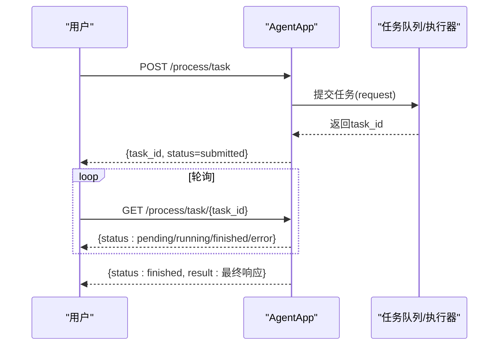
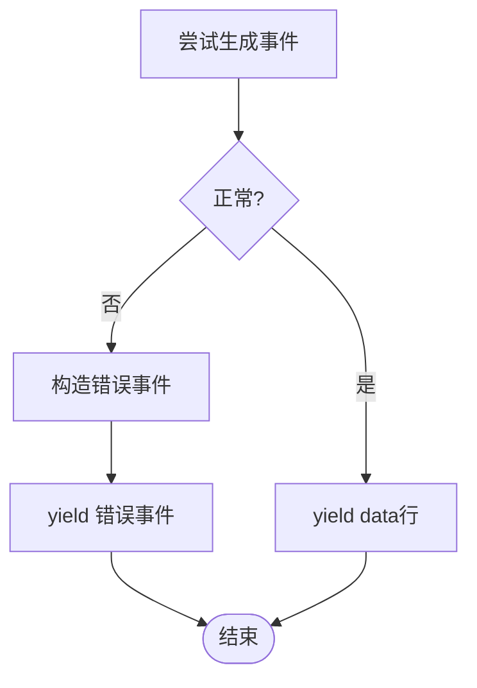
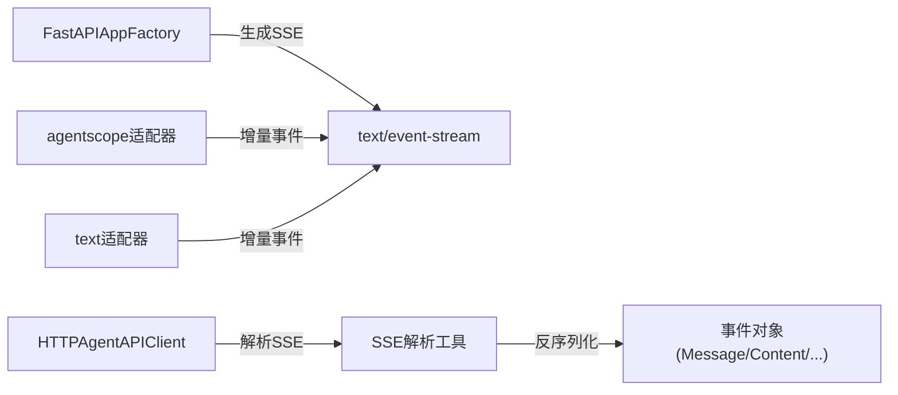

# SSE流式传输

<cite>
**本文引用的文件**
- [fastapi_factory.py](file://src/agentscope_runtime/engine/deployers/utils/service_utils/fastapi_factory.py)
- [agent_api_client.py](file://src/agentscope_runtime/engine/helpers/agent_api_client.py)
- [agent_schemas.py](file://src/agentscope_runtime/engine/schemas/agent_schemas.py)
- [stream.py（agentscope适配器）](file://src/agentscope_runtime/adapters/agentscope/stream.py)
- [stream.py（text适配器）](file://src/agentscope_runtime/adapters/text/stream.py)
- [protocol.md](file://cookbook/zh/protocol.md)
- [test_agent_app_stream_task.py](file://tests/integrated/test_agent_app_stream_task.py)
- [test_agent_app_custom_endpoint.py](file://tests/unit/test_agent_app_custom_endpoint.py)
- [mcp_utils.py](file://src/agentscope_runtime/sandbox/box/shared/routers/mcp_utils.py)
- [response_api_protocol_adapter.py](file://src/agentscope_runtime/engine/deployers/adapter/responses/response_api_protocol_adapter.py)
</cite>

## 目录
1. [简介](#简介)
2. [项目结构](#项目结构)
3. [核心组件](#核心组件)
4. [架构总览](#架构总览)
5. [详细组件分析](#详细组件分析)
6. [依赖关系分析](#依赖关系分析)
7. [性能考量](#性能考量)
8. [故障排查指南](#故障排查指南)
9. [结论](#结论)
10. [附录](#附录)

## 简介
本文件面向AgentScope Runtime的Server-Sent Events（SSE）流式传输，系统性阐述SSE连接建立、事件流格式与数据传输协议；详细说明增量内容传输、流式工具调用与实时状态更新机制；提供客户端实现要点、浏览器兼容性与错误处理策略；并给出性能优化建议与最佳实践。

## 项目结构
围绕SSE的关键代码分布在以下模块：
- 服务端SSE生成与路由：FastAPI工厂与路由封装
- 客户端解析与消费：HTTP客户端与SSE解析工具
- 协议模型与事件类型：消息、内容、工具调用等
- 适配器层：将内部消息流转换为Agent API协议事件
- 测试与示例：端到端流式任务与错误事件覆盖

图表来源
- [fastapi_factory.py:454-469](file://src/agentscope_runtime/engine/deployers/utils/service_utils/fastapi_factory.py#L454-L469)
- [response_api_protocol_adapter.py:44-74](file://src/agentscope_runtime/engine/deployers/adapter/responses/response_api_protocol_adapter.py#L44-L74)
- [agent_api_client.py:155-308](file://src/agentscope_runtime/engine/helpers/agent_api_client.py#L155-L308)
- [agent_schemas.py:18-36](file://src/agentscope_runtime/engine/schemas/agent_schemas.py#L18-L36)
- [stream.py（agentscope适配器）:33-684](file://src/agentscope_runtime/adapters/agentscope/stream.py#L33-L684)
- [stream.py（text适配器）:12-31](file://src/agentscope_runtime/adapters/text/stream.py#L12-L31)

章节来源
- [fastapi_factory.py:454-469](file://src/agentscope_runtime/engine/deployers/utils/service_utils/fastapi_factory.py#L454-L469)
- [agent_api_client.py:155-308](file://src/agentscope_runtime/engine/helpers/agent_api_client.py#L155-L308)
- [agent_schemas.py:18-36](file://src/agentscope_runtime/engine/schemas/agent_schemas.py#L18-L36)

## 核心组件
- SSE服务端生成器
  - 将内部事件序列（消息、内容、工具调用等）序列化为SSE“data”行，媒体类型为text/event-stream
  - 统一错误事件格式，包含错误信息、类型与消息
- SSE客户端解析器
  - 解析SSE行，提取data字段并反序列化为事件对象（Message、Content、AgentResponse等）
  - 支持同步与异步两种消费方式
- 协议与事件模型
  - 定义消息类型、内容类型、运行状态与工具调用结构
  - 适配器将内部消息流转换为增量事件，支持文本、图像、音频、文件、数据等多模态
- 流式任务与状态
  - 支持后台任务提交与状态轮询，最终响应仅存储完成态结果

章节来源
- [fastapi_factory.py:597-626](file://src/agentscope_runtime/engine/deployers/utils/service_utils/fastapi_factory.py#L597-L626)
- [agent_api_client.py:76-153](file://src/agentscope_runtime/engine/helpers/agent_api_client.py#L76-L153)
- [agent_schemas.py:18-36](file://src/agentscope_runtime/engine/schemas/agent_schemas.py#L18-L36)
- [stream.py（agentscope适配器）:33-684](file://src/agentscope_runtime/adapters/agentscope/stream.py#L33-L684)
- [test_agent_app_stream_task.py:61-96](file://tests/integrated/test_agent_app_stream_task.py#L61-L96)

## 架构总览
SSE在AgentScope Runtime中的工作流如下：
- 客户端发起HTTP POST至/process，请求头指定Accept为text/event-stream
- 服务端FastAPI路由返回StreamingResponse，媒体类型为text/event-stream
- 服务端逐条生成SSE事件（data行），事件内容为JSON化的协议事件
- 客户端循环读取SSE行，解析data字段，反序列化为事件对象
- 适配器将内部消息流转换为增量事件，支持工具调用与多模态内容

图表来源
- [fastapi_factory.py:454-469](file://src/agentscope_runtime/engine/deployers/utils/service_utils/fastapi_factory.py#L454-L469)
- [fastapi_factory.py:597-626](file://src/agentscope_runtime/engine/deployers/utils/service_utils/fastapi_factory.py#L597-L626)
- [agent_api_client.py:208-308](file://src/agentscope_runtime/engine/helpers/agent_api_client.py#L208-L308)

## 详细组件分析

### 服务端SSE生成与路由
- 路由与响应
  - /process端点返回StreamingResponse，媒体类型为text/event-stream
  - 设置缓存控制与连接保持头部
- 事件生成
  - 将内部事件（消息、内容、工具调用等）序列化为JSON，封装为data行
  - 统一错误事件格式，包含error、error_type与message
- 自定义端点与流包装
  - 自动识别异步/同步生成器，包装为StreamingResponse
  - 保留签名以便FastAPI参数解析

图表来源
- [fastapi_factory.py:597-626](file://src/agentscope_runtime/engine/deployers/utils/service_utils/fastapi_factory.py#L597-L626)
- [fastapi_factory.py:697-725](file://src/agentscope_runtime/engine/deployers/utils/service_utils/fastapi_factory.py#L697-L725)
- [fastapi_factory.py:728-807](file://src/agentscope_runtime/engine/deployers/utils/service_utils/fastapi_factory.py#L728-L807)

章节来源
- [fastapi_factory.py:454-469](file://src/agentscope_runtime/engine/deployers/utils/service_utils/fastapi_factory.py#L454-L469)
- [fastapi_factory.py:597-626](file://src/agentscope_runtime/engine/deployers/utils/service_utils/fastapi_factory.py#L597-L626)
- [fastapi_factory.py:728-807](file://src/agentscope_runtime/engine/deployers/utils/service_utils/fastapi_factory.py#L728-L807)

### 客户端SSE解析与消费
- 行解析
  - 解析SSE行，识别data、event、id、retry字段
  - data行去除前缀后进行JSON解析
- 事件反序列化
  - 根据object字段判断事件类型，构造Message、Content、AgentResponse等
- 同步与异步
  - 同步：requests库流式迭代行
  - 异步：httpx库异步流式迭代行

图表来源
- [agent_api_client.py:76-111](file://src/agentscope_runtime/engine/helpers/agent_api_client.py#L76-L111)
- [agent_api_client.py:114-152](file://src/agentscope_runtime/engine/helpers/agent_api_client.py#L114-L152)
- [agent_api_client.py:208-308](file://src/agentscope_runtime/engine/helpers/agent_api_client.py#L208-L308)

章节来源
- [agent_api_client.py:76-153](file://src/agentscope_runtime/engine/helpers/agent_api_client.py#L76-L153)
- [agent_api_client.py:208-308](file://src/agentscope_runtime/engine/helpers/agent_api_client.py#L208-L308)

### 协议与事件模型
- 消息类型与运行状态
  - MessageType：message、function_call、plugin_call、mcp_call、reasoning、error等
  - RunStatus：created、in_progress、completed、failed、canceled等
- 内容类型
  - TextContent、ImageContent、AudioContent、FileContent、DataContent、RefusalContent
- 工具调用
  - FunctionCall/FunctionCallOutput与McpCall/McpCallOutput，支持增量参数与输出

图表来源
- [agent_schemas.py:18-36](file://src/agentscope_runtime/engine/schemas/agent_schemas.py#L18-L36)
- [agent_schemas.py:158-189](file://src/agentscope_runtime/engine/schemas/agent_schemas.py#L158-L189)
- [agent_schemas.py:237-263](file://src/agentscope_runtime/engine/schemas/agent_schemas.py#L237-L263)

章节来源
- [agent_schemas.py:18-36](file://src/agentscope_runtime/engine/schemas/agent_schemas.py#L18-L36)
- [agent_schemas.py:158-189](file://src/agentscope_runtime/engine/schemas/agent_schemas.py#L158-L189)
- [agent_schemas.py:237-263](file://src/agentscope_runtime/engine/schemas/agent_schemas.py#L237-L263)

### 适配器：增量内容与工具调用
- agentscope适配器
  - 将内部消息流转换为增量事件，支持文本、思维（reasoning）、工具调用与结果
  - 通过add_delta_content与completed事件实现增量拼接与完成标记
- text适配器
  - 将字符串流转换为文本内容增量事件，最后完成消息

图表来源
- [stream.py（agentscope适配器）:33-684](file://src/agentscope_runtime/adapters/agentscope/stream.py#L33-L684)

章节来源
- [stream.py（agentscope适配器）:33-684](file://src/agentscope_runtime/adapters/agentscope/stream.py#L33-L684)
- [stream.py（text适配器）:12-31](file://src/agentscope_runtime/adapters/text/stream.py#L12-L31)

### 流式任务与实时状态更新
- 任务提交
  - /process/task提交请求，返回task_id与队列信息
- 状态轮询
  - /process/task/{task_id}轮询任务状态，映射为pending/running/finished/error
- 结果存储
  - 仅存储最终完成态响应，中间事件不持久化

图表来源
- [test_agent_app_stream_task.py:139-277](file://tests/integrated/test_agent_app_stream_task.py#L139-L277)

章节来源
- [test_agent_app_stream_task.py:61-96](file://tests/integrated/test_agent_app_stream_task.py#L61-L96)
- [test_agent_app_stream_task.py:139-277](file://tests/integrated/test_agent_app_stream_task.py#L139-L277)

### 错误事件与超时控制
- 服务端错误事件
  - 生成统一错误事件，包含error、error_type与message
- Response API适配器超时控制
  - SSE流带超时控制，超时或异常时发送response.failed事件

图表来源
- [fastapi_factory.py:768-778](file://src/agentscope_runtime/engine/deployers/utils/service_utils/fastapi_factory.py#L768-L778)
- [response_api_protocol_adapter.py:187-198](file://src/agentscope_runtime/engine/deployers/adapter/responses/response_api_protocol_adapter.py#L187-L198)

章节来源
- [fastapi_factory.py:768-778](file://src/agentscope_runtime/engine/deployers/utils/service_utils/fastapi_factory.py#L768-L778)
- [response_api_protocol_adapter.py:187-198](file://src/agentscope_runtime/engine/deployers/adapter/responses/response_api_protocol_adapter.py#L187-L198)

## 依赖关系分析
- 服务端依赖
  - FastAPI路由与StreamingResponse
  - Runner/适配器层将内部事件序列化为SSE事件
- 客户端依赖
  - httpx/requests流式读取
  - 自定义SSE解析与事件反序列化
- 协议依赖
  - Agent API协议模型（Message、Content、AgentResponse等）
  - 适配器将内部消息转换为增量事件

图表来源
- [fastapi_factory.py:597-626](file://src/agentscope_runtime/engine/deployers/utils/service_utils/fastapi_factory.py#L597-L626)
- [agent_api_client.py:208-308](file://src/agentscope_runtime/engine/helpers/agent_api_client.py#L208-L308)
- [stream.py（agentscope适配器）:33-684](file://src/agentscope_runtime/adapters/agentscope/stream.py#L33-L684)
- [stream.py（text适配器）:12-31](file://src/agentscope_runtime/adapters/text/stream.py#L12-L31)

章节来源
- [fastapi_factory.py:597-626](file://src/agentscope_runtime/engine/deployers/utils/service_utils/fastapi_factory.py#L597-L626)
- [agent_api_client.py:208-308](file://src/agentscope_runtime/engine/helpers/agent_api_client.py#L208-L308)
- [stream.py（agentscope适配器）:33-684](file://src/agentscope_runtime/adapters/agentscope/stream.py#L33-L684)
- [stream.py（text适配器）:12-31](file://src/agentscope_runtime/adapters/text/stream.py#L12-L31)

## 性能考量
- 事件序列化
  - 使用统一序列化器，避免深层嵌套导致的性能问题
- 流式写入
  - 逐事件yield，减少缓冲区占用
- 并发与超时
  - Response API适配器引入并发信号量与超时控制，防止资源耗尽
- 客户端读取
  - 异步流式读取，避免阻塞主线程

章节来源
- [fastapi_factory.py:697-725](file://src/agentscope_runtime/engine/deployers/utils/service_utils/fastapi_factory.py#L697-L725)
- [response_api_protocol_adapter.py:44-74](file://src/agentscope_runtime/engine/deployers/adapter/responses/response_api_protocol_adapter.py#L44-L74)

## 故障排查指南
- 常见问题
  - SSE连接未建立：确认Accept头为text/event-stream，媒体类型为text/event-stream
  - 事件解析失败：检查data行格式与JSON合法性
  - 错误事件：关注error、error_type与message字段
- 单元测试覆盖
  - 自定义端点流式错误事件：同步与异步错误均应返回统一错误事件
  - 查询参数与请求携带：确保端点正确接收并转发
- 任务状态
  - 提交后轮询状态，映射pending/running/finished/error
  - 仅最终完成态响应会被存储

章节来源
- [test_agent_app_custom_endpoint.py:206-247](file://tests/unit/test_agent_app_custom_endpoint.py#L206-L247)
- [test_agent_app_custom_endpoint.py:250-275](file://tests/unit/test_agent_app_custom_endpoint.py#L250-L275)
- [test_agent_app_stream_task.py:139-277](file://tests/integrated/test_agent_app_stream_task.py#L139-L277)

## 结论
AgentScope Runtime通过统一的SSE生成与解析机制，实现了从内部事件到Agent API协议事件的可靠流式传输。服务端提供稳定的SSE事件流与错误事件，客户端具备完善的解析与消费能力。配合适配器层的增量事件生成与工具调用支持，以及任务状态的实时轮询，整体方案满足实时性、可维护性与可扩展性的要求。

## 附录

### SSE事件类型与消息结构
- 事件类型
  - response.created/response.in_progress/response.completed/response.failed
  - message.created/message.in_progress/message.completed
  - content.delta/content.completed
  - function_call/function_call_output
  - mcp_call/mcp_call_output
  - error
- 消息结构
  - object/type/status/index/delta/msg_id等字段遵循Agent API协议

章节来源
- [protocol.md:352-363](file://cookbook/zh/protocol.md#L352-L363)
- [agent_schemas.py:237-263](file://src/agentscope_runtime/engine/schemas/agent_schemas.py#L237-L263)

### 传输编码与客户端实现要点
- 传输编码
  - UTF-8，SSE行以data:开头，每条事件以空行结尾
- 客户端要点
  - 设置Accept: text/event-stream
  - 循环读取行，解析data字段并反序列化
  - 处理错误事件与超时场景

章节来源
- [agent_api_client.py:191-206](file://src/agentscope_runtime/engine/helpers/agent_api_client.py#L191-L206)
- [agent_api_client.py:208-308](file://src/agentscope_runtime/engine/helpers/agent_api_client.py#L208-L308)

### 浏览器兼容性与错误处理策略
- 浏览器兼容性
  - 使用原生EventSource或fetch + ReadableStream（现代浏览器）
  - 服务端设置Cache-Control: no-cache与Connection: keep-alive
- 错误处理策略
  - 服务端统一错误事件格式
  - 客户端捕获网络异常与JSON解析异常
  - 超时控制与重试策略（基于应用层）

章节来源
- [fastapi_factory.py:454-469](file://src/agentscope_runtime/engine/deployers/utils/service_utils/fastapi_factory.py#L454-L469)
- [agent_api_client.py:208-308](file://src/agentscope_runtime/engine/helpers/agent_api_client.py#L208-L308)
- [response_api_protocol_adapter.py:187-198](file://src/agentscope_runtime/engine/deployers/adapter/responses/response_api_protocol_adapter.py#L187-L198)

### 增量内容传输与流式工具调用
- 增量内容
  - delta=true表示增量片段，index指示内容槽位
  - completed事件标记片段完成
- 工具调用
  - tool_use生成工具调用事件，tool_result生成工具结果事件
  - 支持function_call与mcp_call两类

章节来源
- [protocol.md:344-363](file://cookbook/zh/protocol.md#L344-L363)
- [stream.py（agentscope适配器）:292-468](file://src/agentscope_runtime/adapters/agentscope/stream.py#L292-L468)

### 实时状态更新机制
- 任务提交与状态轮询
  - 提交后返回task_id，轮询状态映射为pending/running/finished/error
- 结果存储
  - 仅存储最终完成态响应，中间事件不持久化

章节来源
- [test_agent_app_stream_task.py:139-277](file://tests/integrated/test_agent_app_stream_task.py#L139-L277)