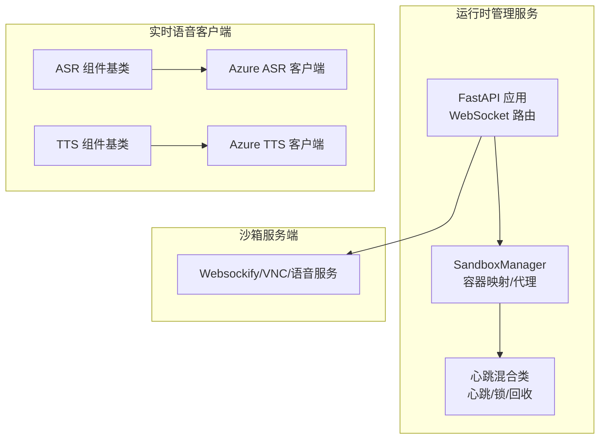
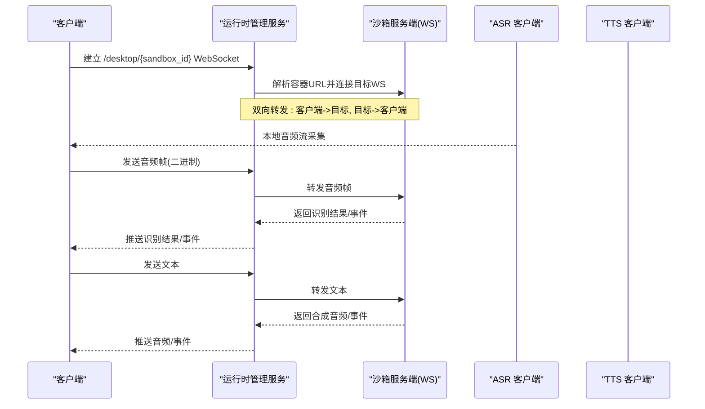
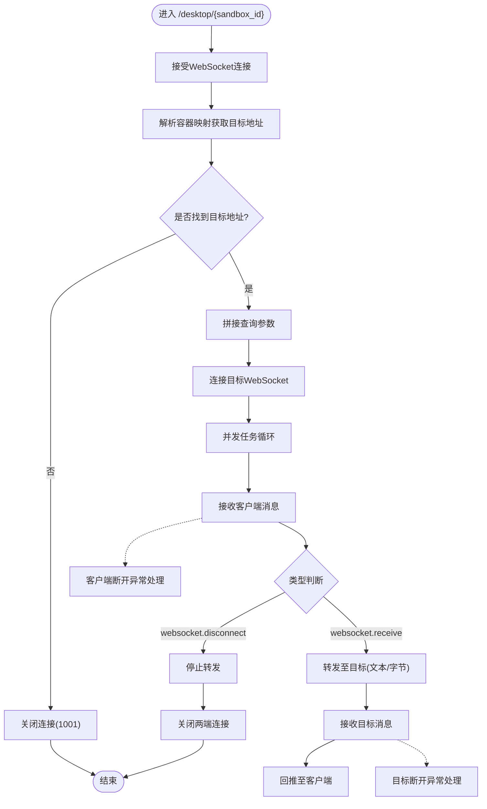
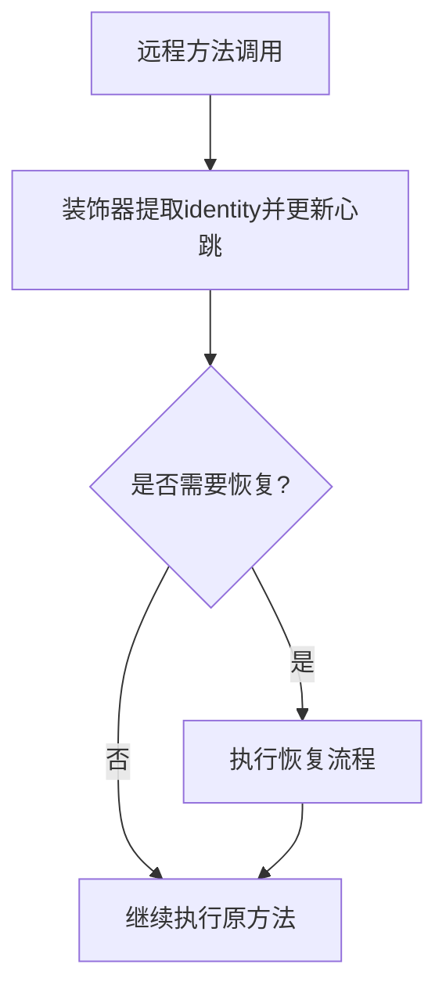
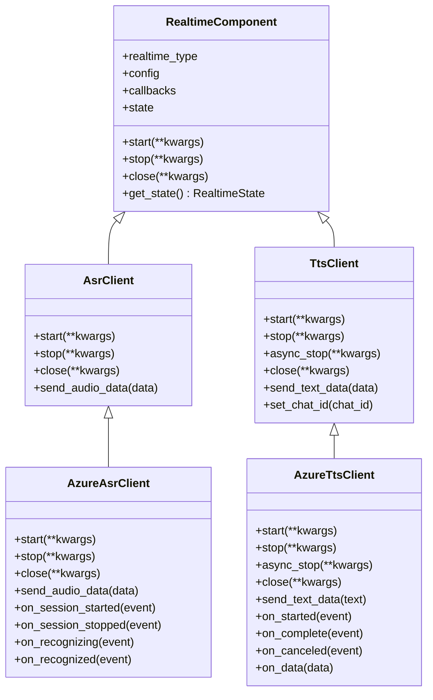
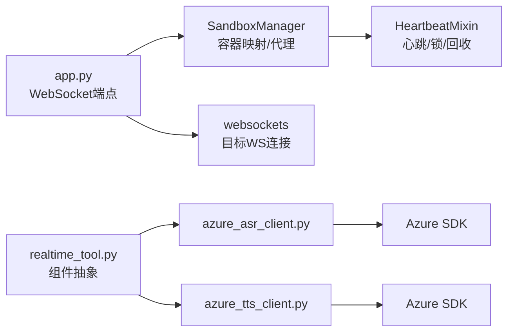

# WebSocket API

<cite>
**本文引用的文件**
- [src/agentscope_runtime/sandbox/manager/server/app.py](file://src/agentscope_runtime/sandbox/manager/server/app.py)
- [src/agentscope_runtime/engine/schemas/realtime.py](file://src/agentscope_runtime/engine/schemas/realtime.py)
- [src/agentscope_runtime/tools/realtime_clients/realtime_tool.py](file://src/agentscope_runtime/tools/realtime_clients/realtime_tool.py)
- [src/agentscope_runtime/tools/realtime_clients/asr_client.py](file://src/agentscope_runtime/tools/realtime_clients/asr_client.py)
- [src/agentscope_runtime/tools/realtime_clients/tts_client.py](file://src/agentscope_runtime/tools/realtime_clients/tts_client.py)
- [src/agentscope_runtime/tools/realtime_clients/azure_asr_client.py](file://src/agentscope_runtime/tools/realtime_clients/azure_asr_client.py)
- [src/agentscope_runtime/tools/realtime_clients/azure_tts_client.py](file://src/agentscope_runtime/tools/realtime_clients/azure_tts_client.py)
- [src/agentscope_runtime/sandbox/manager/heartbeat_mixin.py](file://src/agentscope_runtime/sandbox/manager/heartbeat_mixin.py)
- [src/agentscope_runtime/sandbox/manager/sandbox_manager.py](file://src/agentscope_runtime/sandbox/manager/sandbox_manager.py)
- [src/agentscope_runtime/sandbox/box/mobile/box/config/nginx.conf.template](file://src/agentscope_runtime/sandbox/box/mobile/box/config/nginx.conf.template)
</cite>

## 目录
1. [简介](#简介)
2. [项目结构](#项目结构)
3. [核心组件](#核心组件)
4. [架构总览](#架构总览)
5. [详细组件分析](#详细组件分析)
6. [依赖关系分析](#依赖关系分析)
7. [性能考量](#性能考量)
8. [故障排查指南](#故障排查指南)
9. [结论](#结论)
10. [附录](#附录)

## 简介
本文件面向 AgentScope Runtime 的 WebSocket API，系统性阐述实时通信协议、消息格式与事件类型、连接管理、心跳与断线恢复策略，并提供客户端接入建议与最佳实践。重点覆盖桌面会话 WebSocket 转发代理、实时语音（ASR/TTS）组件以及心跳监控与自动恢复机制。

## 项目结构
与 WebSocket API 相关的关键模块分布如下：
- 服务端 WebSocket 转发：FastAPI + websockets，负责将客户端与目标沙箱服务端 WebSocket 建立双向转发通道
- 实时语音组件：ASR/TTS 客户端封装，支持本地音频流输入与回调事件
- 心跳与回收：基于会话上下文的心跳更新、分布式锁与超时回收
- 配置与模式：实时语音参数、事件枚举与消息载荷模型

图表来源
- [src/agentscope_runtime/sandbox/manager/server/app.py:282-357](file://src/agentscope_runtime/sandbox/manager/server/app.py#L282-L357)
- [src/agentscope_runtime/sandbox/manager/heartbeat_mixin.py:91-489](file://src/agentscope_runtime/sandbox/manager/heartbeat_mixin.py#L91-L489)
- [src/agentscope_runtime/tools/realtime_clients/realtime_tool.py:21-56](file://src/agentscope_runtime/tools/realtime_clients/realtime_tool.py#L21-L56)
- [src/agentscope_runtime/tools/realtime_clients/azure_asr_client.py:33-196](file://src/agentscope_runtime/tools/realtime_clients/azure_asr_client.py#L33-L196)
- [src/agentscope_runtime/tools/realtime_clients/azure_tts_client.py:53-384](file://src/agentscope_runtime/tools/realtime_clients/azure_tts_client.py#L53-L384)

章节来源
- [src/agentscope_runtime/sandbox/manager/server/app.py:282-357](file://src/agentscope_runtime/sandbox/manager/server/app.py#L282-L357)
- [src/agentscope_runtime/sandbox/manager/heartbeat_mixin.py:91-489](file://src/agentscope_runtime/sandbox/manager/heartbeat_mixin.py#L91-L489)

## 核心组件
- WebSocket 转发端点：接收客户端消息，转发到目标沙箱服务端 WebSocket；同时将服务端消息回推给客户端
- 实时语音组件：抽象出 ASR/TTS 组件，提供启动/停止/关闭与数据发送接口；Azure 实现封装了 WebSocket 连接与事件回调
- 心跳与回收：通过会话上下文维护容器活跃时间戳，超时后标记回收并可触发自动恢复
- 消息与事件：实时语音使用指令/事件模型，包含会话开始/结束、音频转写、文本响应、音频开始/结束等事件

章节来源
- [src/agentscope_runtime/sandbox/manager/server/app.py:282-357](file://src/agentscope_runtime/sandbox/manager/server/app.py#L282-L357)
- [src/agentscope_runtime/engine/schemas/realtime.py:105-229](file://src/agentscope_runtime/engine/schemas/realtime.py#L105-L229)
- [src/agentscope_runtime/tools/realtime_clients/realtime_tool.py:21-56](file://src/agentscope_runtime/tools/realtime_clients/realtime_tool.py#L21-L56)

## 架构总览
下图展示客户端、运行时管理服务与沙箱服务端之间的交互路径，以及实时语音组件在客户端侧的作用。

图表来源
- [src/agentscope_runtime/sandbox/manager/server/app.py:282-357](file://src/agentscope_runtime/sandbox/manager/server/app.py#L282-L357)
- [src/agentscope_runtime/tools/realtime_clients/azure_asr_client.py:100-196](file://src/agentscope_runtime/tools/realtime_clients/azure_asr_client.py#L100-L196)
- [src/agentscope_runtime/tools/realtime_clients/azure_tts_client.py:110-384](file://src/agentscope_runtime/tools/realtime_clients/azure_tts_client.py#L110-L384)

## 详细组件分析

### WebSocket 连接与消息转发
- 路由与握手
  - 路径：/desktop/{sandbox_id}
  - 接受客户端连接后，解析容器映射，构造目标 WS 地址（http->ws），附加查询参数
- 双向转发
  - 客户端 -> 目标：当收到 websocket.receive 类型消息时，按 text 或 bytes 转发
  - 目标 -> 客户端：逐条推送字符串消息
- 异常处理
  - 客户端断开：捕获断开异常并关闭目标连接
  - 目标连接关闭：捕获关闭异常并主动关闭客户端连接
  - 其他异常：记录错误并关闭连接

图表来源
- [src/agentscope_runtime/sandbox/manager/server/app.py:282-357](file://src/agentscope_runtime/sandbox/manager/server/app.py#L282-L357)

章节来源
- [src/agentscope_runtime/sandbox/manager/server/app.py:282-357](file://src/agentscope_runtime/sandbox/manager/server/app.py#L282-L357)

### 消息格式与事件类型
- 客户端 -> 服务端消息
  - 结构：包含 type 字段；当 type 为 websocket.receive 时，携带 text 或 bytes 数据；当 type 为 websocket.disconnect 时表示断开
  - 用途：用于将客户端的文本或二进制消息转发到目标服务端
- 服务端 -> 客户端消息
  - 结构：以字符串形式推送，通常为服务端返回的原始消息
  - 用途：将目标服务端的响应回推给客户端
- 实时语音事件
  - 指令/事件枚举：会话开始/结束、音频转写、文本响应、音频开始/结束等
  - 载荷模型：根据指令动态解析为对应载荷对象（如会话开始/结束）

章节来源
- [src/agentscope_runtime/sandbox/manager/server/app.py:319-352](file://src/agentscope_runtime/sandbox/manager/server/app.py#L319-L352)
- [src/agentscope_runtime/engine/schemas/realtime.py:105-229](file://src/agentscope_runtime/engine/schemas/realtime.py#L105-L229)

### 连接管理、心跳与断线恢复
- 心跳更新
  - 通过装饰器在调用远程方法时自动更新会话心跳时间戳
  - 仅对 RUNNING 状态容器生效
- 分布式锁
  - 使用 Redis SET NX EX 或内存令牌进行心跳操作加锁，避免并发冲突
- 回收与恢复
  - 超过心跳阈值未更新的会话，标记为回收状态并可触发自动恢复
  - 支持在需要时对已回收会话进行恢复

图表来源
- [src/agentscope_runtime/sandbox/manager/heartbeat_mixin.py:17-88](file://src/agentscope_runtime/sandbox/manager/heartbeat_mixin.py#L17-L88)
- [src/agentscope_runtime/sandbox/manager/sandbox_manager.py:1634-1665](file://src/agentscope_runtime/sandbox/manager/sandbox_manager.py#L1634-L1665)

章节来源
- [src/agentscope_runtime/sandbox/manager/heartbeat_mixin.py:17-88](file://src/agentscope_runtime/sandbox/manager/heartbeat_mixin.py#L17-L88)
- [src/agentscope_runtime/sandbox/manager/sandbox_manager.py:1634-1665](file://src/agentscope_runtime/sandbox/manager/sandbox_manager.py#L1634-L1665)

### 实时语音组件（ASR/TTS）
- 组件抽象
  - RealtimeComponent：定义 TTS/ASR/语音/视频聊天等类型与通用状态机
- ASR 客户端
  - 提供启动/停止/关闭与音频数据发送接口；Azure 实现封装了 Azure 认知服务 SDK 的连续识别与回调
- TTS 客户端
  - 提供启动/停止/异步停止/关闭与文本数据发送接口；Azure 实现封装了 WebSocket 合成请求与音频流回调

图表来源
- [src/agentscope_runtime/tools/realtime_clients/realtime_tool.py:21-56](file://src/agentscope_runtime/tools/realtime_clients/realtime_tool.py#L21-L56)
- [src/agentscope_runtime/tools/realtime_clients/asr_client.py:13-28](file://src/agentscope_runtime/tools/realtime_clients/asr_client.py#L13-L28)
- [src/agentscope_runtime/tools/realtime_clients/tts_client.py:13-34](file://src/agentscope_runtime/tools/realtime_clients/tts_client.py#L13-L34)
- [src/agentscope_runtime/tools/realtime_clients/azure_asr_client.py:33-196](file://src/agentscope_runtime/tools/realtime_clients/azure_asr_client.py#L33-L196)
- [src/agentscope_runtime/tools/realtime_clients/azure_tts_client.py:53-384](file://src/agentscope_runtime/tools/realtime_clients/azure_tts_client.py#L53-L384)

章节来源
- [src/agentscope_runtime/tools/realtime_clients/realtime_tool.py:21-56](file://src/agentscope_runtime/tools/realtime_clients/realtime_tool.py#L21-L56)
- [src/agentscope_runtime/tools/realtime_clients/azure_asr_client.py:33-196](file://src/agentscope_runtime/tools/realtime_clients/azure_asr_client.py#L33-L196)
- [src/agentscope_runtime/tools/realtime_clients/azure_tts_client.py:53-384](file://src/agentscope_runtime/tools/realtime_clients/azure_tts_client.py#L53-L384)

### Nginx 与 WebSocket 访问控制
- 在反向代理层对 /websockify/ 路径进行访问控制，要求有效的会话 Cookie 或允许静态资源访问
- 对非 WebSocket 的 /websockify/ 请求进行拦截，防止直接 HTTP 访问

章节来源
- [src/agentscope_runtime/sandbox/box/mobile/box/config/nginx.conf.template:46-76](file://src/agentscope_runtime/sandbox/box/mobile/box/config/nginx.conf.template#L46-L76)

## 依赖关系分析
- WebSocket 转发依赖
  - FastAPI WebSocket：路由与握手
  - websockets：连接目标服务端
  - SandboxManager：解析容器映射与代理
- 心跳依赖
  - Redis（可选）：分布式锁
  - ContainerModel：容器状态与会话上下文
- 实时语音依赖
  - Azure 认知服务 SDK：ASR/TTS WebSocket 与回调
  - Pydantic：配置与事件载荷模型

图表来源
- [src/agentscope_runtime/sandbox/manager/server/app.py:282-357](file://src/agentscope_runtime/sandbox/manager/server/app.py#L282-L357)
- [src/agentscope_runtime/sandbox/manager/heartbeat_mixin.py:91-489](file://src/agentscope_runtime/sandbox/manager/heartbeat_mixin.py#L91-L489)
- [src/agentscope_runtime/tools/realtime_clients/realtime_tool.py:21-56](file://src/agentscope_runtime/tools/realtime_clients/realtime_tool.py#L21-L56)
- [src/agentscope_runtime/tools/realtime_clients/azure_asr_client.py:33-196](file://src/agentscope_runtime/tools/realtime_clients/azure_asr_client.py#L33-L196)
- [src/agentscope_runtime/tools/realtime_clients/azure_tts_client.py:53-384](file://src/agentscope_runtime/tools/realtime_clients/azure_tts_client.py#L53-L384)

章节来源
- [src/agentscope_runtime/sandbox/manager/server/app.py:282-357](file://src/agentscope_runtime/sandbox/manager/server/app.py#L282-L357)
- [src/agentscope_runtime/sandbox/manager/heartbeat_mixin.py:91-489](file://src/agentscope_runtime/sandbox/manager/heartbeat_mixin.py#L91-L489)

## 性能考量
- 并发转发：使用 asyncio.gather 并发处理客户端到目标与目标到客户端的消息转发，降低延迟
- 心跳扫描：定期扫描会话心跳，及时回收闲置容器，释放资源
- 事件驱动：实时语音组件通过回调驱动数据流，减少轮询开销
- 代理链路：WebSocket 转发为纯二进制/文本透传，尽量避免额外序列化/反序列化

## 故障排查指南
- 连接失败
  - 目标地址为空：服务端直接关闭连接（1001）
  - 目标连接关闭：服务端主动关闭客户端连接
- 断开处理
  - 客户端断开：捕获断开异常并清理目标连接
  - 目标断开：捕获关闭异常并关闭客户端连接
- 权限与认证
  - 服务端支持 Bearer Token 校验，缺失或无效将返回 401
- 心跳超时
  - 会话长时间无活动会被标记回收；可通过装饰器自动恢复
- Nginx 拦截
  - 对 /websockify/ 的非法 HTTP 访问会被拒绝

章节来源
- [src/agentscope_runtime/sandbox/manager/server/app.py:282-357](file://src/agentscope_runtime/sandbox/manager/server/app.py#L282-L357)
- [src/agentscope_runtime/sandbox/manager/heartbeat_mixin.py:17-88](file://src/agentscope_runtime/sandbox/manager/heartbeat_mixin.py#L17-L88)
- [src/agentscope_runtime/sandbox/box/mobile/box/config/nginx.conf.template:46-76](file://src/agentscope_runtime/sandbox/box/mobile/box/config/nginx.conf.template#L46-L76)

## 结论
AgentScope Runtime 的 WebSocket API 通过轻量的 FastAPI + websockets 实现，提供从客户端到沙箱服务端的透明转发能力；结合实时语音组件与心跳/回收机制，形成完整的实时通信与资源管理闭环。建议在生产环境中启用 Bearer Token 认证、合理设置心跳阈值，并在反向代理层严格限制 /websockify/ 的访问范围。

## 附录

### 客户端接入与最佳实践
- 连接路径
  - 使用 /desktop/{sandbox_id} 建立 WebSocket 连接
  - 可附加查询参数，这些参数将被透传到目标服务端
- 消息发送
  - 文本消息：发送 type 为 websocket.receive 的消息，携带 text 字段
  - 二进制消息：发送 type 为 websocket.receive 的消息，携带 bytes 字段
  - 断开连接：发送 type 为 websocket.disconnect 的消息
- 实时语音
  - ASR：通过本地音频流写入，由服务端转发到目标 ASR 服务
  - TTS：通过文本写入，由服务端转发到目标 TTS 服务，接收音频流
- 心跳与稳定性
  - 保持会话活跃：在业务空闲期也应维持心跳，避免被回收
  - 断线重连：监听连接关闭事件后，重新建立 /desktop/{sandbox_id} 连接
- 安全与鉴权
  - 在请求头中携带 Authorization: Bearer <token>
  - 反向代理层确保 /websockify/ 仅允许 WebSocket 升级请求