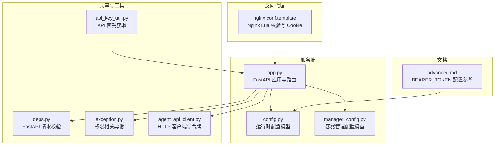
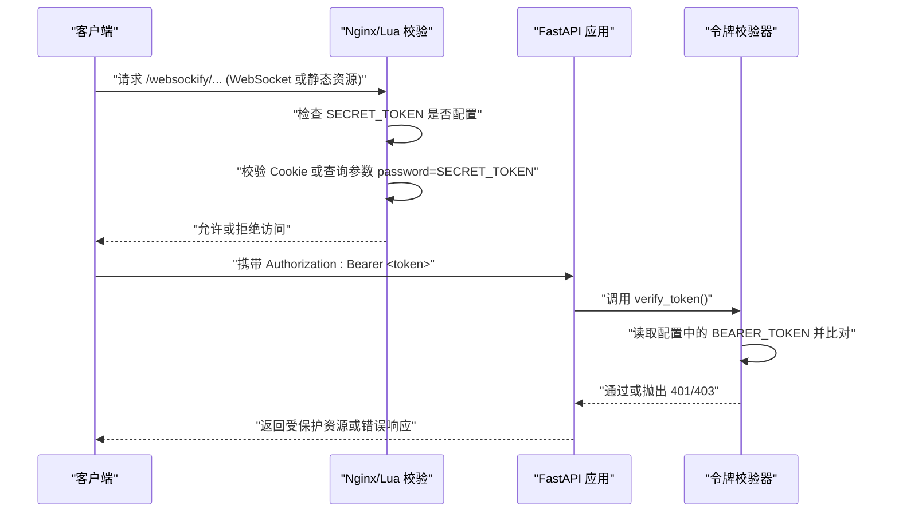
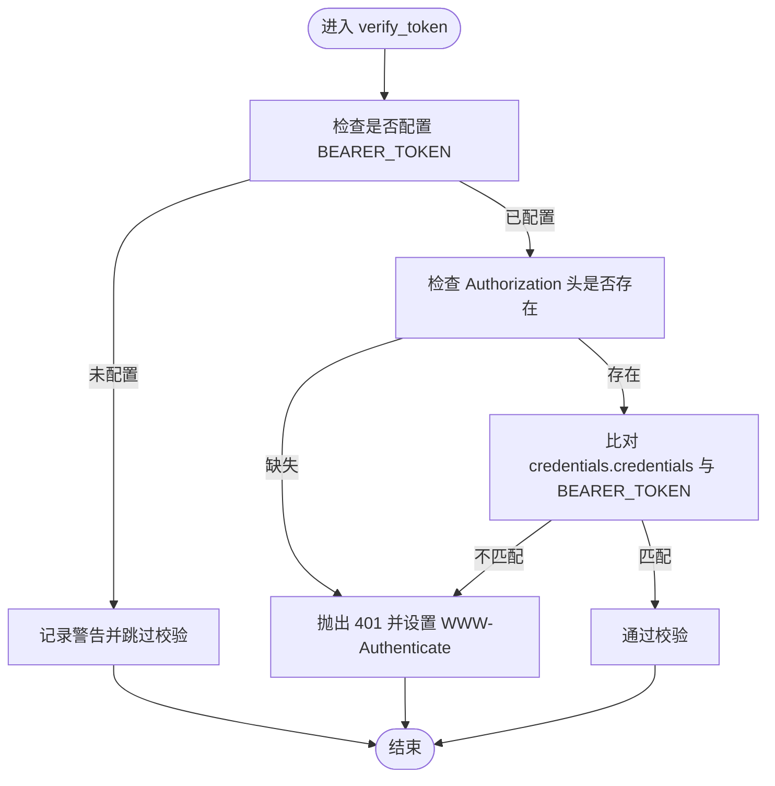
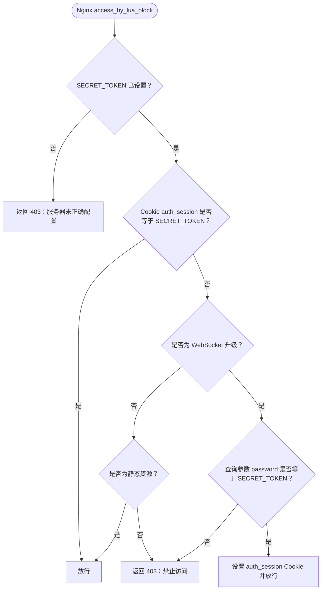
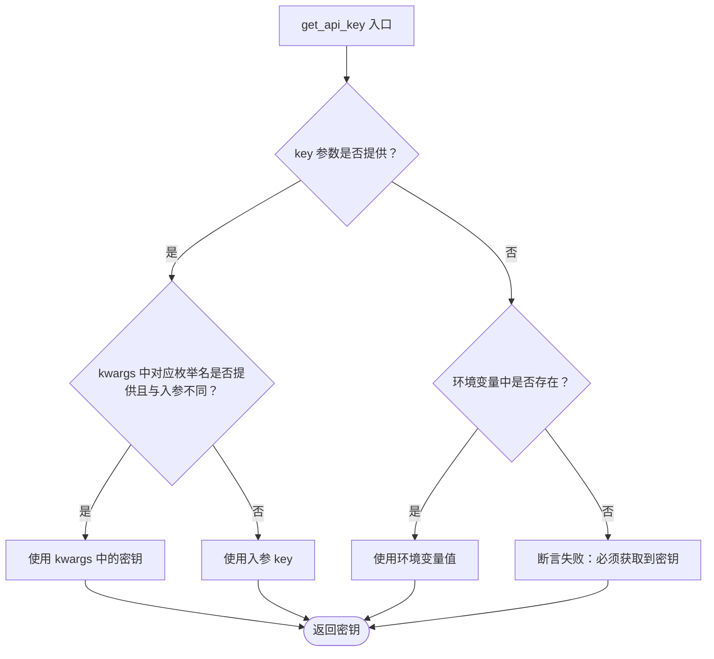
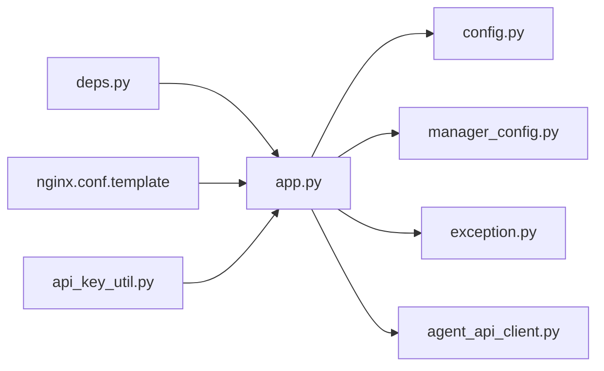

# 认证与授权

<cite>
**本文引用的文件**
- [app.py](file://src/agentscope_runtime/sandbox/manager/server/app.py)
- [config.py](file://src/agentscope_runtime/sandbox/manager/server/config.py)
- [manager_config.py](file://src/agentscope_runtime/sandbox/model/manager_config.py)
- [deps.py](file://src/agentscope_runtime/sandbox/box/shared/dependencies/deps.py)
- [nginx.conf.template](file://src/agentscope_runtime/sandbox/box/mobile/box/config/nginx.conf.template)
- [api_key_util.py](file://src/agentscope_runtime/tools/utils/api_key_util.py)
- [exception.py](file://src/agentscope_runtime/engine/schemas/exception.py)
- [local_logging_handler.py](file://src/agentscope_runtime/engine/tracing/local_logging_handler.py)
- [agent_api_client.py](file://src/agentscope_runtime/engine/helpers/agent_api_client.py)
- [advanced.md](file://cookbook/en/sandbox/advanced.md)
</cite>

## 目录
1. [简介](#简介)
2. [项目结构](#项目结构)
3. [核心组件](#核心组件)
4. [架构总览](#架构总览)
5. [详细组件分析](#详细组件分析)
6. [依赖分析](#依赖分析)
7. [性能考虑](#性能考虑)
8. [故障排查指南](#故障排查指南)
9. [结论](#结论)
10. [附录](#附录)

## 简介
本文件系统性梳理 AgentScope Runtime 的认证与授权机制，覆盖以下方面：
- 支持的认证方式与令牌格式
- 令牌验证流程与中间件集成
- API 密钥管理与来源优先级
- 访问控制与权限异常类型
- JWT 令牌处理与会话管理现状
- 安全头与反向代理层（Nginx）的安全策略
- 多租户与审计日志配置建议
- 安全最佳实践与常见问题防范

## 项目结构
围绕认证与授权的关键代码分布在服务端应用、配置模型、共享依赖、反向代理模板以及工具模块中。下图展示与认证相关的核心文件与职责：

图表来源
- [app.py:1-448](file://src/agentscope_runtime/sandbox/manager/server/app.py#L1-L448)
- [config.py:1-162](file://src/agentscope_runtime/sandbox/manager/server/config.py#L1-L162)
- [manager_config.py:1-376](file://src/agentscope_runtime/sandbox/model/manager_config.py#L1-L376)
- [deps.py:1-23](file://src/agentscope_runtime/sandbox/box/shared/dependencies/deps.py#L1-L23)
- [nginx.conf.template:1-106](file://src/agentscope_runtime/sandbox/box/mobile/box/config/nginx.conf.template#L1-L106)
- [api_key_util.py:1-46](file://src/agentscope_runtime/tools/utils/api_key_util.py#L1-L46)
- [exception.py:247-296](file://src/agentscope_runtime/engine/schemas/exception.py#L247-L296)
- [agent_api_client.py:155-182](file://src/agentscope_runtime/engine/helpers/agent_api_client.py#L155-L182)
- [advanced.md:99-109](file://cookbook/en/sandbox/advanced.md#L99-L109)

章节来源
- [app.py:1-448](file://src/agentscope_runtime/sandbox/manager/server/app.py#L1-L448)
- [config.py:1-162](file://src/agentscope_runtime/sandbox/manager/server/config.py#L1-L162)
- [manager_config.py:1-376](file://src/agentscope_runtime/sandbox/model/manager_config.py#L1-L376)
- [deps.py:1-23](file://src/agentscope_runtime/sandbox/box/shared/dependencies/deps.py#L1-L23)
- [nginx.conf.template:1-106](file://src/agentscope_runtime/sandbox/box/mobile/box/config/nginx.conf.template#L1-L106)
- [api_key_util.py:1-46](file://src/agentscope_runtime/tools/utils/api_key_util.py#L1-L46)
- [exception.py:247-296](file://src/agentscope_runtime/engine/schemas/exception.py#L247-L296)
- [agent_api_client.py:155-182](file://src/agentscope_runtime/engine/helpers/agent_api_client.py#L155-L182)
- [advanced.md:99-109](file://cookbook/en/sandbox/advanced.md#L99-L109)

## 核心组件
- Bearer Token 认证：通过 HTTP Bearer 方式传递令牌，由 FastAPI 的 HTTPBearer 中间件解析，并在服务端进行比对校验。
- SECRET_TOKEN 反向代理层校验：Nginx 使用 Lua 模块在 /websockify/ 路径下进行会话校验，要求客户端携带与 SECRET_TOKEN 匹配的查询参数或 Cookie。
- API 密钥管理：提供统一的 API 密钥获取函数，支持入参、关键字参数与环境变量的优先级顺序。
- 权限异常类型：定义了权限相关异常，便于在业务逻辑中抛出标准化错误。

章节来源
- [app.py:46-143](file://src/agentscope_runtime/sandbox/manager/server/app.py#L46-L143)
- [config.py:19-19](file://src/agentscope_runtime/sandbox/manager/server/config.py#L19-L19)
- [nginx.conf.template:42-91](file://src/agentscope_runtime/sandbox/box/mobile/box/config/nginx.conf.template#L42-L91)
- [api_key_util.py:13-45](file://src/agentscope_runtime/tools/utils/api_key_util.py#L13-L45)
- [exception.py:250-269](file://src/agentscope_runtime/engine/schemas/exception.py#L250-L269)

## 架构总览
下图展示了从客户端到服务端的认证与授权交互路径，包括 HTTP Bearer 校验与 Nginx 层的会话校验。

图表来源
- [app.py:116-143](file://src/agentscope_runtime/sandbox/manager/server/app.py#L116-L143)
- [config.py:19-19](file://src/agentscope_runtime/sandbox/manager/server/config.py#L19-L19)
- [nginx.conf.template:42-91](file://src/agentscope_runtime/sandbox/box/mobile/box/config/nginx.conf.template#L42-L91)

## 详细组件分析

### Bearer Token 认证与验证流程
- 中间件与依赖注入：使用 HTTPBearer 中间件自动解析 Authorization 头，随后在 verify_token 中与配置中的 BEARER_TOKEN 进行比对。
- 未配置时的行为：若未设置 BEARER_TOKEN，则记录警告并跳过校验；配置后则严格校验。
- 错误处理：缺失令牌返回 401 并设置 WWW-Authenticate 头；令牌不匹配返回 401；其他异常统一包装为 500。

图表来源
- [app.py:116-143](file://src/agentscope_runtime/sandbox/manager/server/app.py#L116-L143)
- [config.py:19-19](file://src/agentscope_runtime/sandbox/manager/server/config.py#L19-L19)

章节来源
- [app.py:116-143](file://src/agentscope_runtime/sandbox/manager/server/app.py#L116-L143)
- [config.py:19-19](file://src/agentscope_runtime/sandbox/manager/server/config.py#L19-L19)

### SECRET_TOKEN 与 Nginx 会话校验
- 环境变量：通过环境变量 SECRET_TOKEN 控制校验逻辑。
- 会话 Cookie：当查询参数 password 等于 SECRET_TOKEN 时，设置 HttpOnly、SameSite=Strict 的 auth_session Cookie，并根据 HTTPS 设置 Secure 标记。
- 资源访问控制：非 WebSocket 的 HTTP 请求若未携带有效凭据，将被拒绝；静态资源路径放行。
- WebSocket 升级：仅允许升级为 WebSocket 的请求通过校验。

图表来源
- [nginx.conf.template:42-91](file://src/agentscope_runtime/sandbox/box/mobile/box/config/nginx.conf.template#L42-L91)

章节来源
- [nginx.conf.template:42-91](file://src/agentscope_runtime/sandbox/box/mobile/box/config/nginx.conf.template#L42-L91)

### API 密钥管理
- 统一入口：通过枚举与函数组合，按“入参 > 关键字参数 > 环境变量”的优先级获取 API 密钥。
- 断言保障：若最终无法获取到密钥，断言失败，避免静默错误。

图表来源
- [api_key_util.py:13-45](file://src/agentscope_runtime/tools/utils/api_key_util.py#L13-L45)

章节来源
- [api_key_util.py:13-45](file://src/agentscope_runtime/tools/utils/api_key_util.py#L13-L45)

### 权限与访问控制异常
- 权限相关异常：提供 PermissionDeniedException 与 AccessDeniedException，便于在业务层抛出标准化错误。
- 与认证流程配合：在 verify_token 返回 401/403 后，上层可结合这些异常类型返回一致的错误语义。

章节来源
- [exception.py:250-269](file://src/agentscope_runtime/engine/schemas/exception.py#L250-L269)

### JWT 令牌处理与会话管理现状
- 当前实现：服务端采用 Bearer Token 校验，未发现内置 JWT 解析与签名校验逻辑。
- 会话管理：Nginx 层通过 Cookie 实现轻量会话；FastAPI 层未见显式的 JWT 会话存储或刷新机制。
- 建议：如需引入 JWT，应在 FastAPI 中增加依赖库与解析器，并在 Nginx 层保持一致的校验策略。

章节来源
- [app.py:116-143](file://src/agentscope_runtime/sandbox/manager/server/app.py#L116-L143)
- [nginx.conf.template:79-85](file://src/agentscope_runtime/sandbox/box/mobile/box/config/nginx.conf.template#L79-L85)

### 安全头设置
- CORS：全局启用 CORS 中间件，允许跨域访问（生产环境建议限制具体来源）。
- Bearer 认证：在 401 场景下设置 WWW-Authenticate: Bearer 响应头，引导客户端正确携带令牌。
- Nginx Cookie：设置 HttpOnly、SameSite=Strict、Secure（HTTPS 环境），降低 XSS 与 CSRF 风险。

章节来源
- [app.py:37-44](file://src/agentscope_runtime/sandbox/manager/server/app.py#L37-L44)
- [app.py:128-142](file://src/agentscope_runtime/sandbox/manager/server/app.py#L128-L142)
- [nginx.conf.template:80-85](file://src/agentscope_runtime/sandbox/box/mobile/box/config/nginx.conf.template#L80-L85)

## 依赖分析
- app.py 依赖 config.py 提供的 Settings，其中包含 BEARER_TOKEN 字段；同时依赖 manager_config.py 提供的容器管理配置。
- deps.py 作为共享依赖，提供基于 Header 的 SECRET_TOKEN 校验，适用于某些 FastAPI 路由。
- nginx.conf.template 与 app.py 形成双层校验：Nginx 在反向代理层拦截，FastAPI 在应用层二次校验。
- api_key_util.py 与 exception.py 分别负责密钥获取与异常类型，支撑业务层安全与错误处理。

图表来源
- [app.py:1-448](file://src/agentscope_runtime/sandbox/manager/server/app.py#L1-L448)
- [config.py:1-162](file://src/agentscope_runtime/sandbox/manager/server/config.py#L1-L162)
- [manager_config.py:1-376](file://src/agentscope_runtime/sandbox/model/manager_config.py#L1-L376)
- [deps.py:1-23](file://src/agentscope_runtime/sandbox/box/shared/dependencies/deps.py#L1-L23)
- [nginx.conf.template:1-106](file://src/agentscope_runtime/sandbox/box/mobile/box/config/nginx.conf.template#L1-L106)
- [api_key_util.py:1-46](file://src/agentscope_runtime/tools/utils/api_key_util.py#L1-L46)
- [exception.py:247-296](file://src/agentscope_runtime/engine/schemas/exception.py#L247-L296)
- [agent_api_client.py:155-182](file://src/agentscope_runtime/engine/helpers/agent_api_client.py#L155-L182)

章节来源
- [app.py:1-448](file://src/agentscope_runtime/sandbox/manager/server/app.py#L1-L448)
- [config.py:1-162](file://src/agentscope_runtime/sandbox/manager/server/config.py#L1-L162)
- [manager_config.py:1-376](file://src/agentscope_runtime/sandbox/model/manager_config.py#L1-L376)
- [deps.py:1-23](file://src/agentscope_runtime/sandbox/box/shared/dependencies/deps.py#L1-L23)
- [nginx.conf.template:1-106](file://src/agentscope_runtime/sandbox/box/mobile/box/config/nginx.conf.template#L1-L106)
- [api_key_util.py:1-46](file://src/agentscope_runtime/tools/utils/api_key_util.py#L1-L46)
- [exception.py:247-296](file://src/agentscope_runtime/engine/schemas/exception.py#L247-L296)
- [agent_api_client.py:155-182](file://src/agentscope_runtime/engine/helpers/agent_api_client.py#L155-L182)

## 性能考虑
- 认证开销：Bearer 校验为常数时间操作，对整体性能影响极小。
- CORS：生产环境建议限制允许来源与方法，减少预检请求开销。
- 日志：本地日志处理器默认关闭控制台输出，避免高频写入影响性能；可通过配置调整备份与大小限制。

章节来源
- [local_logging_handler.py:84-111](file://src/agentscope_runtime/engine/tracing/local_logging_handler.py#L84-L111)

## 故障排查指南
- 401 未认证
  - 确认请求头 Authorization 是否包含 Bearer <token>。
  - 检查 BEARER_TOKEN 是否在配置中正确设置。
- 403 禁止访问
  - Bearer 校验失败或 Nginx 层未通过 SECRET_TOKEN 校验。
  - 检查 SECRET_TOKEN 是否设置，Cookie auth_session 是否正确设置，或查询参数 password 是否正确。
- CORS 问题
  - 生产环境请限制 allow_origins、allow_methods、allow_headers。
- 日志定位
  - 使用本地日志处理器查看 trace 事件开始/结束与上下文信息，辅助定位问题。

章节来源
- [app.py:126-142](file://src/agentscope_runtime/sandbox/manager/server/app.py#L126-L142)
- [nginx.conf.template:70-90](file://src/agentscope_runtime/sandbox/box/mobile/box/config/nginx.conf.template#L70-L90)
- [local_logging_handler.py:201-228](file://src/agentscope_runtime/engine/tracing/local_logging_handler.py#L201-L228)

## 结论
- AgentScope Runtime 当前采用双层安全策略：Nginx 层 SECRET_TOKEN 与 FastAPI 层 BEARER_TOKEN。
- API 密钥管理通过统一工具实现，具备明确的优先级与断言保障。
- 权限异常类型完善，便于在业务层进行标准化错误处理。
- 若需引入 JWT 与更完善的会话管理，可在现有基础上扩展 FastAPI 与 Nginx 策略，确保两端一致。

## 附录

### 配置项与示例
- BEARER_TOKEN：用于 FastAPI Bearer 认证的令牌。
- SECRET_TOKEN：用于 Nginx 层会话校验的令牌。
- CORS：允许跨域访问的配置，生产环境建议收紧。

章节来源
- [advanced.md:99-109](file://cookbook/en/sandbox/advanced.md#L99-L109)
- [config.py:19-19](file://src/agentscope_runtime/sandbox/manager/server/config.py#L19-L19)
- [nginx.conf.template:8-8](file://src/agentscope_runtime/sandbox/box/mobile/box/config/nginx.conf.template#L8-L8)

### 多租户认证策略建议
- 租户维度令牌：为每个租户生成独立的 BEARER_TOKEN，服务端按租户映射表进行校验。
- 命名空间隔离：结合容器部署后端（如 k8s）的命名空间与 RBAC，实现资源级隔离。
- 审计日志：开启本地日志处理器，记录请求 ID、步骤、成本与上下文，便于审计与回溯。

章节来源
- [local_logging_handler.py:84-111](file://src/agentscope_runtime/engine/tracing/local_logging_handler.py#L84-L111)