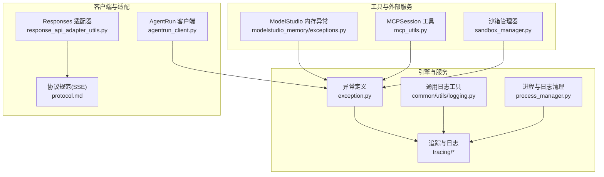
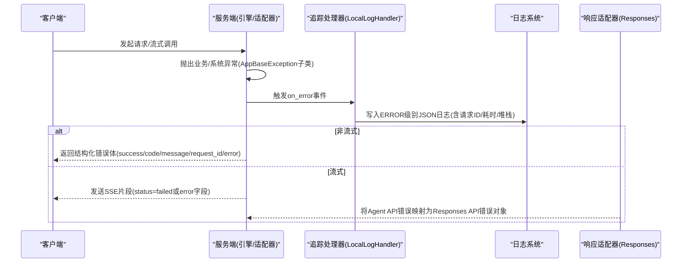
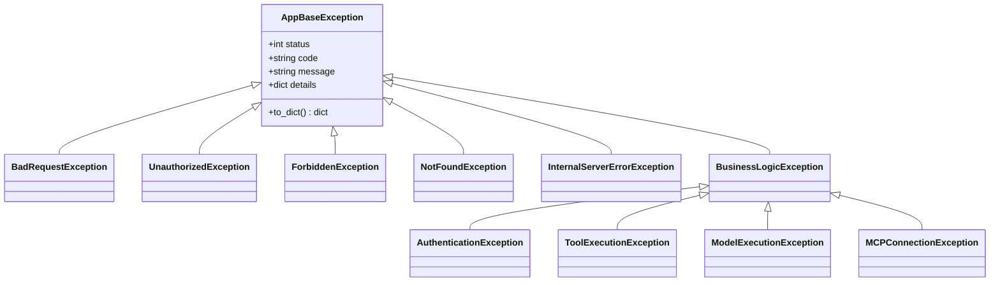
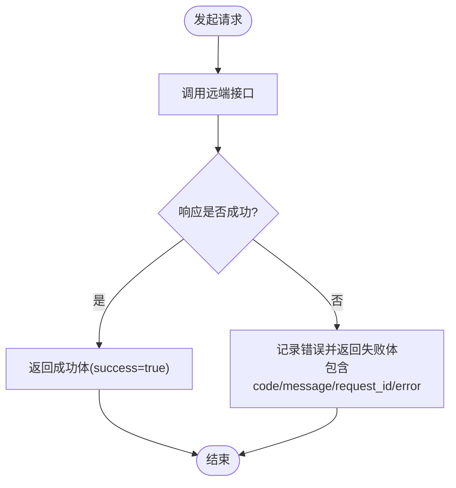
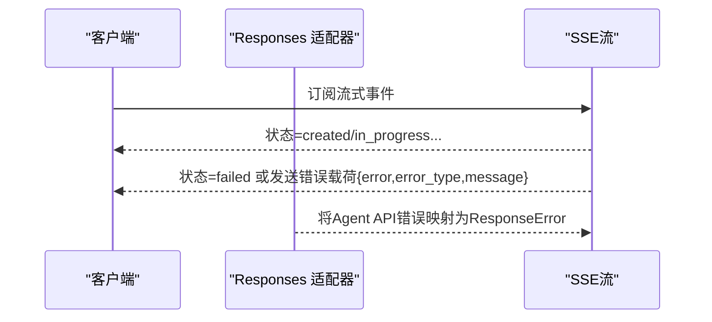
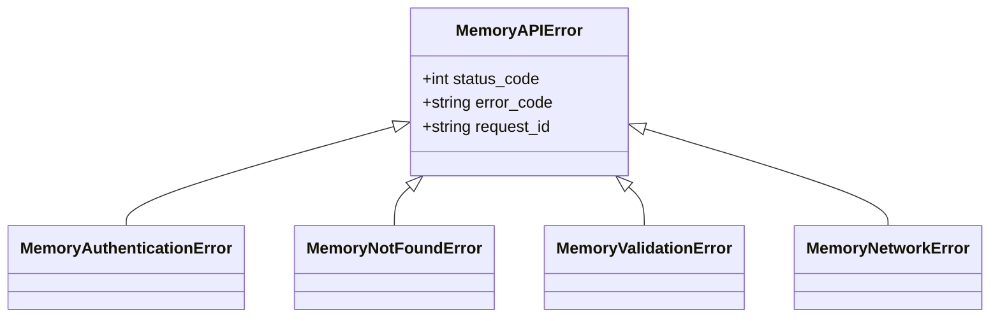
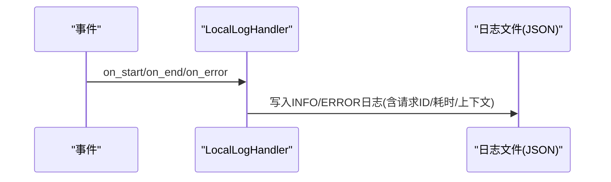
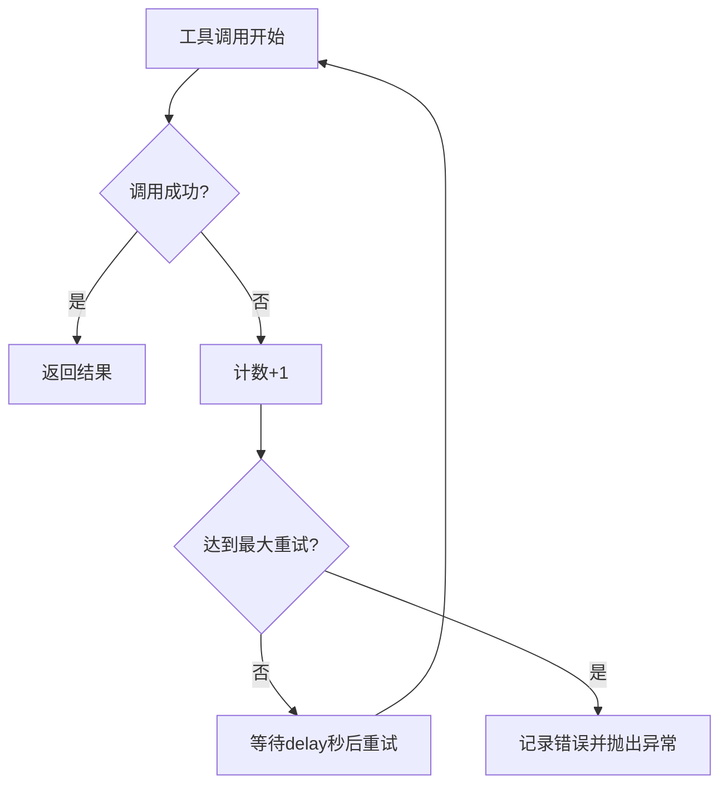
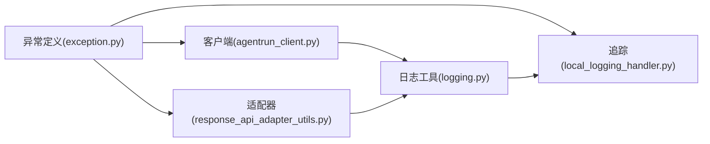

# 错误处理

<cite>
**本文引用的文件**
- [exception.py](file://src/agentscope_runtime/engine/schemas/exception.py)
- [local_logging_handler.py](file://src/agentscope_runtime/engine/tracing/local_logging_handler.py)
- [base.py](file://src/agentscope_runtime/engine/tracing/base.py)
- [logging.py](file://src/agentscope_runtime/common/utils/logging.py)
- [mcp_utils.py](file://src/agentscope_runtime/sandbox/box/shared/routers/mcp_utils.py)
- [sandbox_manager.py](file://src/agentscope_runtime/sandbox/manager/sandbox_manager.py)
- [agentrun_client.py](file://src/agentscope_runtime/common/container_clients/agentrun_client.py)
- [response_api_adapter_utils.py](file://src/agentscope_runtime/engine/deployers/adapter/responses/response_api_adapter_utils.py)
- [protocol.md](file://cookbook/zh/protocol.md)
- [tracing.md](file://cookbook/zh/tracing.md)
- [exceptions.py](file://src/agentscope_runtime/tools/modelstudio_memory/exceptions.py)
- [process_manager.py](file://src/agentscope_runtime/engine/deployers/utils/service_utils/process_manager.py)
- [test_mcp_utils_streamable_http_timeout.py](file://tests/unit/test_mcp_utils_streamable_http_timeout.py)
- [test_agent_app_custom_endpoint.py](file://tests/unit/test_agent_app_custom_endpoint.py)
</cite>

## 目录
1. [简介](#简介)
2. [项目结构](#项目结构)
3. [核心组件](#核心组件)
4. [架构总览](#架构总览)
5. [详细组件分析](#详细组件分析)
6. [依赖分析](#依赖分析)
7. [性能考虑](#性能考虑)
8. [故障排除指南](#故障排除指南)
9. [结论](#结论)
10. [附录](#附录)

## 简介
本文件系统化梳理 AgentScope Runtime 的错误处理机制，覆盖错误类型分层、错误码与消息格式、客户端/服务端/服务器端错误区分、异常传播路径、错误恢复与降级策略、SSE 错误承载与流式传输最佳实践、日志与监控建议以及调试与故障排除方法。目标是帮助开发者在集成与运维过程中快速定位问题、制定恢复策略，并建立一致的错误处理与可观测性实践。

## 项目结构
围绕错误处理的关键模块与文件如下：
- 异常定义与分层：engine/schemas/exception.py
- 追踪与日志：engine/tracing/* 与 common/utils/logging.py
- 客户端错误处理与返回体：common/container_clients/agentrun_client.py
- 代理运行时错误与工具链异常：engine/schemas/exception.py 中的 AgentRuntimeErrorException 及其子类
- 流式传输与 SSE 错误承载：engine/deployers/adapter/responses/response_api_adapter_utils.py、cookbook/zh/protocol.md
- 工具与外部服务异常：tools/modelstudio_memory/exceptions.py
- 服务生命周期与日志清理：engine/deployers/utils/service_utils/process_manager.py
- 单元测试验证：tests/unit 下相关用例

**图表来源**
- [exception.py:1-605](file://src/agentscope_runtime/engine/schemas/exception.py#L1-L605)
- [local_logging_handler.py:150-369](file://src/agentscope_runtime/engine/tracing/local_logging_handler.py#L150-L369)
- [logging.py:1-45](file://src/agentscope_runtime/common/utils/logging.py#L1-L45)
- [process_manager.py:359-398](file://src/agentscope_runtime/engine/deployers/utils/service_utils/process_manager.py#L359-L398)
- [agentrun_client.py:344-839](file://src/agentscope_runtime/common/container_clients/agentrun_client.py#L344-L839)
- [response_api_adapter_utils.py:1409-2465](file://src/agentscope_runtime/engine/deployers/adapter/responses/response_api_adapter_utils.py#L1409-L2465)
- [protocol.md:352-390](file://cookbook/zh/protocol.md#L352-L390)
- [mcp_utils.py:73-187](file://src/agentscope_runtime/sandbox/box/shared/routers/mcp_utils.py#L73-L187)
- [sandbox_manager.py:351-427](file://src/agentscope_runtime/sandbox/manager/sandbox_manager.py#L351-L427)
- [exceptions.py:1-61](file://src/agentscope_runtime/tools/modelstudio_memory/exceptions.py#L1-L61)

**章节来源**
- [exception.py:1-605](file://src/agentscope_runtime/engine/schemas/exception.py#L1-L605)
- [local_logging_handler.py:150-369](file://src/agentscope_runtime/engine/tracing/local_logging_handler.py#L150-L369)
- [logging.py:1-45](file://src/agentscope_runtime/common/utils/logging.py#L1-L45)
- [process_manager.py:359-398](file://src/agentscope_runtime/engine/deployers/utils/service_utils/process_manager.py#L359-L398)
- [agentrun_client.py:344-839](file://src/agentscope_runtime/common/container_clients/agentrun_client.py#L344-L839)
- [response_api_adapter_utils.py:1409-2465](file://src/agentscope_runtime/engine/deployers/adapter/responses/response_api_adapter_utils.py#L1409-L2465)
- [protocol.md:352-390](file://cookbook/zh/protocol.md#L352-L390)
- [mcp_utils.py:73-187](file://src/agentscope_runtime/sandbox/box/shared/routers/mcp_utils.py#L73-L187)
- [sandbox_manager.py:351-427](file://src/agentscope_runtime/sandbox/manager/sandbox_manager.py#L351-L427)
- [exceptions.py:1-61](file://src/agentscope_runtime/tools/modelstudio_memory/exceptions.py#L1-L61)

## 核心组件
- 异常分层与错误码
  - 基类 AppBaseException 提供统一的 status/code/message/details 结构化错误表示。
  - HTTP 状态异常层：BadRequestException、UnauthorizedException、ForbiddenException、NotFound、MethodNotAllowed、Conflict、UnprocessableEntity、TooManyRequests、InternalServerError、BadGateway、ServiceUnavailable、GatewayTimeout 等。
  - 业务异常层：认证/授权、权限、资源、参数、限流、业务逻辑、系统、配置、网络、超时等；以及代理运行时专用异常（工具执行、模型执行、MCP 连接/协议、未知错误等）。
- 日志与追踪
  - LocalLogHandler 将事件开始/结束/错误写入 INFO/ERROR 文件，统一 JSON 格式，携带请求上下文与耗时。
  - BaseLogHandler 提供基础日志接口；ColorFormatter 用于控制台彩色输出。
- 客户端错误处理
  - AgentRun 客户端对远端调用失败进行结构化回传，包含 success/code/message/request_id/error 等字段，便于上层统一处理。
- 流式传输与 SSE 错误承载
  - Responses 适配器将 Agent API 错误映射为 Responses API 错误对象；SSE 协议文档定义了 created/in_progress/completed/failed/rejected/canceled 状态，客户端应监听 failed 并读取 error 字段。
- 工具与外部服务异常
  - ModelStudio Memory 异常体系包含认证/未找到/校验/网络等，支持状态码与错误码追踪。

**章节来源**
- [exception.py:11-63](file://src/agentscope_runtime/engine/schemas/exception.py#L11-L63)
- [exception.py:68-210](file://src/agentscope_runtime/engine/schemas/exception.py#L68-L210)
- [exception.py:215-605](file://src/agentscope_runtime/engine/schemas/exception.py#L215-L605)
- [local_logging_handler.py:150-369](file://src/agentscope_runtime/engine/tracing/local_logging_handler.py#L150-L369)
- [base.py:44-82](file://src/agentscope_runtime/engine/tracing/base.py#L44-L82)
- [logging.py:31-45](file://src/agentscope_runtime/common/utils/logging.py#L31-L45)
- [agentrun_client.py:344-839](file://src/agentscope_runtime/common/container_clients/agentrun_client.py#L344-L839)
- [response_api_adapter_utils.py:1409-2465](file://src/agentscope_runtime/engine/deployers/adapter/responses/response_api_adapter_utils.py#L1409-L2465)
- [protocol.md:352-390](file://cookbook/zh/protocol.md#L352-L390)
- [exceptions.py:8-61](file://src/agentscope_runtime/tools/modelstudio_memory/exceptions.py#L8-L61)

## 架构总览
下图展示从“异常产生”到“日志记录/错误返回/SSE 错误承载”的关键流程：

**图表来源**
- [exception.py:11-63](file://src/agentscope_runtime/engine/schemas/exception.py#L11-L63)
- [local_logging_handler.py:330-369](file://src/agentscope_runtime/engine/tracing/local_logging_handler.py#L330-L369)
- [agentrun_client.py:344-839](file://src/agentscope_runtime/common/container_clients/agentrun_client.py#L344-L839)
- [response_api_adapter_utils.py:1409-2465](file://src/agentscope_runtime/engine/deployers/adapter/responses/response_api_adapter_utils.py#L1409-L2465)
- [protocol.md:352-390](file://cookbook/zh/protocol.md#L352-L390)

## 详细组件分析

### 异常分层与错误码定义
- 分层结构
  - 基类 AppBaseException：统一的 status/code/message/details 字段。
  - HTTP 状态异常：覆盖标准 HTTP 状态，便于网关/反向代理/SDK 层正确映射。
  - 业务异常：按领域细分（认证/授权/权限/资源/参数/限流/业务逻辑/系统/配置/网络/超时/代理运行时）。
- 错误码与消息格式
  - 错误码采用大写字符串标识（如 AUTH_FAILED、TOOL_EXECUTION_FAILED、MODEL_TIMEOUT 等），消息为人类可读描述，details 为结构化补充信息。
  - to_dict 输出统一字典，便于序列化与跨组件传递。

**图表来源**
- [exception.py:11-63](file://src/agentscope_runtime/engine/schemas/exception.py#L11-L63)
- [exception.py:68-210](file://src/agentscope_runtime/engine/schemas/exception.py#L68-L210)
- [exception.py:215-605](file://src/agentscope_runtime/engine/schemas/exception.py#L215-L605)

**章节来源**
- [exception.py:11-63](file://src/agentscope_runtime/engine/schemas/exception.py#L11-L63)
- [exception.py:68-210](file://src/agentscope_runtime/engine/schemas/exception.py#L68-L210)
- [exception.py:215-605](file://src/agentscope_runtime/engine/schemas/exception.py#L215-L605)

### 客户端错误处理与返回体
- AgentRun 客户端在调用远端接口后，若响应非成功，会返回包含 success/code/message/request_id/error 的结构化结果，便于上层统一处理与重试。
- 当捕获到异常时，同样返回包含 error 字段的失败体，确保调用方能获取异常文本。

**图表来源**
- [agentrun_client.py:344-839](file://src/agentscope_runtime/common/container_clients/agentrun_client.py#L344-L839)

**章节来源**
- [agentrun_client.py:344-839](file://src/agentscope_runtime/common/container_clients/agentrun_client.py#L344-L839)

### 流式传输与 SSE 错误承载
- Responses 适配器将 Agent API 的错误消息转换为 Responses API 的 ResponseError，映射有效错误码集合，否则回退为 server_error。
- 协议文档定义了 SSE 状态机：created → in_progress → completed/failed/rejected/canceled；客户端应监听 failed 状态并读取 error 字段进行处理。
- 单元测试验证了同步/异步流式错误端点在发生异常时返回包含 error/error_type/message 的 SSE 错误载荷。

**图表来源**
- [response_api_adapter_utils.py:1409-2465](file://src/agentscope_runtime/engine/deployers/adapter/responses/response_api_adapter_utils.py#L1409-L2465)
- [protocol.md:352-390](file://cookbook/zh/protocol.md#L352-L390)
- [test_agent_app_custom_endpoint.py:206-239](file://tests/unit/test_agent_app_custom_endpoint.py#L206-L239)

**章节来源**
- [response_api_adapter_utils.py:1409-2465](file://src/agentscope_runtime/engine/deployers/adapter/responses/response_api_adapter_utils.py#L1409-L2465)
- [protocol.md:352-390](file://cookbook/zh/protocol.md#L352-L390)
- [test_agent_app_custom_endpoint.py:206-239](file://tests/unit/test_agent_app_custom_endpoint.py#L206-L239)

### 工具与外部服务异常
- ModelStudio Memory 异常体系提供 MemoryAPIError 基类及认证/未找到/校验/网络等子类，支持 status_code、error_code、request_id 等字段，便于端到端追踪。
- 工具执行与模型推理异常通过 AgentRuntimeErrorException 及其子类表达，便于区分业务域错误与系统域错误。

**图表来源**
- [exceptions.py:8-61](file://src/agentscope_runtime/tools/modelstudio_memory/exceptions.py#L8-L61)
- [exception.py:458-605](file://src/agentscope_runtime/engine/schemas/exception.py#L458-L605)

**章节来源**
- [exceptions.py:8-61](file://src/agentscope_runtime/tools/modelstudio_memory/exceptions.py#L8-L61)
- [exception.py:458-605](file://src/agentscope_runtime/engine/schemas/exception.py#L458-L605)

### 追踪与日志记录
- LocalLogHandler 在事件 on_error 时，将异常类型、堆栈详情、耗时、请求 ID 等注入上下文并写入 ERROR 日志；INFO 日志记录事件开始/结束。
- BaseLogHandler 提供抽象接口，便于扩展其他日志/监控后端。
- ColorFormatter 为控制台输出着色，提升可读性。

**图表来源**
- [local_logging_handler.py:201-369](file://src/agentscope_runtime/engine/tracing/local_logging_handler.py#L201-L369)
- [base.py:44-82](file://src/agentscope_runtime/engine/tracing/base.py#L44-L82)
- [logging.py:31-45](file://src/agentscope_runtime/common/utils/logging.py#L31-L45)

**章节来源**
- [local_logging_handler.py:150-369](file://src/agentscope_runtime/engine/tracing/local_logging_handler.py#L150-L369)
- [base.py:44-82](file://src/agentscope_runtime/engine/tracing/base.py#L44-L82)
- [logging.py:31-45](file://src/agentscope_runtime/common/utils/logging.py#L31-L45)

### 异常传播与恢复策略
- 工具执行重试：MCPSessionHandler 在工具调用失败时按最大重试次数与延迟进行重试，超过上限后抛出异常。
- HTTP 请求错误聚合：SandboxManager 在 HTTP/HTTPX 请求失败时，解析服务端返回的 detail/error/text 等字段，拼接成统一错误字符串并记录日志。
- 超时与网络异常：TimeoutException/NetworkException 明确语义，便于上层区分与降级。

**图表来源**
- [mcp_utils.py:142-187](file://src/agentscope_runtime/sandbox/box/shared/routers/mcp_utils.py#L142-L187)
- [sandbox_manager.py:351-427](file://src/agentscope_runtime/sandbox/manager/sandbox_manager.py#L351-L427)
- [exception.py:442-456](file://src/agentscope_runtime/engine/schemas/exception.py#L442-L456)

**章节来源**
- [mcp_utils.py:142-187](file://src/agentscope_runtime/sandbox/box/shared/routers/mcp_utils.py#L142-L187)
- [sandbox_manager.py:351-427](file://src/agentscope_runtime/sandbox/manager/sandbox_manager.py#L351-L427)
- [exception.py:442-456](file://src/agentscope_runtime/engine/schemas/exception.py#L442-L456)

### 降级与容错
- 流式错误降级：当工具/MCP/模型执行失败时，通过 SSE 发送 failed 状态或错误载荷，客户端可据此降级为“不可用/重试/提示用户”，避免阻塞主流程。
- 限流与速率限制：RateLimitExceededException 提供 retry_after 字段，便于客户端退避重试。
- 配置与网络异常：ConfigurationException/NetworkException 提供明确错误语义，便于快速定位配置问题或网络波动。

**章节来源**
- [exception.py:345-359](file://src/agentscope_runtime/engine/schemas/exception.py#L345-L359)
- [protocol.md:352-390](file://cookbook/zh/protocol.md#L352-L390)

## 依赖分析
- 组件耦合
  - 异常定义作为公共契约被引擎、适配器、客户端广泛使用，保证错误语义一致。
  - 追踪处理器依赖日志系统，形成“事件驱动 → 日志落盘”的稳定链路。
  - 客户端与服务端通过结构化错误体/流式错误进行解耦。
- 外部依赖
  - HTTP/HTTPX 客户端库用于请求错误聚合与状态检查。
  - SSE 客户端库用于流式错误承载与超时控制。

**图表来源**
- [exception.py:11-63](file://src/agentscope_runtime/engine/schemas/exception.py#L11-L63)
- [agentrun_client.py:344-839](file://src/agentscope_runtime/common/container_clients/agentrun_client.py#L344-L839)
- [response_api_adapter_utils.py:1409-2465](file://src/agentscope_runtime/engine/deployers/adapter/responses/response_api_adapter_utils.py#L1409-L2465)
- [local_logging_handler.py:150-369](file://src/agentscope_runtime/engine/tracing/local_logging_handler.py#L150-L369)
- [logging.py:31-45](file://src/agentscope_runtime/common/utils/logging.py#L31-L45)

**章节来源**
- [exception.py:11-63](file://src/agentscope_runtime/engine/schemas/exception.py#L11-L63)
- [agentrun_client.py:344-839](file://src/agentscope_runtime/common/container_clients/agentrun_client.py#L344-L839)
- [response_api_adapter_utils.py:1409-2465](file://src/agentscope_runtime/engine/deployers/adapter/responses/response_api_adapter_utils.py#L1409-L2465)
- [local_logging_handler.py:150-369](file://src/agentscope_runtime/engine/tracing/local_logging_handler.py#L150-L369)
- [logging.py:31-45](file://src/agentscope_runtime/common/utils/logging.py#L31-L45)

## 性能考虑
- 日志轮转与 JSON 序列化：LocalLogHandler 使用 JSONFormatter 与轮转策略，避免日志无限增长影响 IO。
- 追踪开销：事件开始/结束/错误均记录耗时，建议在高并发场景下合理采样或仅在关键路径启用详细追踪。
- 流式错误：SSE 错误应尽量精简 payload，减少带宽占用。

[本节为通用建议，不直接分析具体文件]

## 故障排除指南
- 识别错误类型
  - 客户端错误：通常由 BadRequest/Unauthorized/Forbidden 等触发，检查请求参数、鉴权头、权限策略。
  - 服务端错误：由 InternalServerError/BadGateway/ServiceUnavailable/GatewayTimeout 等触发，检查服务健康度与依赖。
  - 业务逻辑错误：由 UnprocessableEntity 下的业务异常触发，检查输入校验、资源存在性、工具可用性。
- 查看日志
  - LocalLogHandler 在 ERROR 级别记录异常类型、堆栈、耗时与请求 ID，结合 INFO 日志定位事件路径。
  - 控制台日志通过 ColorFormatter 增强可读性。
- 定位工具/MCP/模型问题
  - 工具执行失败：查看重试次数与延迟配置，确认外部服务可达性与凭据。
  - MCP 连接/协议错误：检查 MCP 服务状态、协议版本与消息格式。
  - 模型推理超时：调整超时阈值或降级为更小模型。
- 流式错误处理
  - 监听 failed 状态与 error 字段，必要时回退到非流式模式或提示用户重试。
- 清理与诊断
  - 使用 process_manager 清理旧日志文件，避免磁盘压力。
  - 单元测试用例可作为行为参考：验证流式错误载荷与超时配置。

**章节来源**
- [local_logging_handler.py:150-369](file://src/agentscope_runtime/engine/tracing/local_logging_handler.py#L150-L369)
- [logging.py:31-45](file://src/agentscope_runtime/common/utils/logging.py#L31-L45)
- [mcp_utils.py:142-187](file://src/agentscope_runtime/sandbox/box/shared/routers/mcp_utils.py#L142-L187)
- [sandbox_manager.py:351-427](file://src/agentscope_runtime/sandbox/manager/sandbox_manager.py#L351-L427)
- [process_manager.py:359-398](file://src/agentscope_runtime/engine/deployers/utils/service_utils/process_manager.py#L359-L398)
- [test_agent_app_custom_endpoint.py:206-239](file://tests/unit/test_agent_app_custom_endpoint.py#L206-L239)

## 结论
AgentScope Runtime 通过三层异常分层、统一的错误码与消息格式、完善的日志与追踪、以及流式错误承载机制，构建了清晰、可观测且可恢复的错误处理体系。结合客户端结构化错误返回与服务端降级策略，可在复杂分布式环境中快速定位问题并保障用户体验。

[本节为总结，不直接分析具体文件]

## 附录
- 错误示例与调试技巧
  - 使用单元测试用例验证流式错误载荷与超时配置，参考：[test_mcp_utils_streamable_http_timeout.py:43-84](file://tests/unit/test_mcp_utils_streamable_http_timeout.py#L43-L84)、[test_agent_app_custom_endpoint.py:206-239](file://tests/unit/test_agent_app_custom_endpoint.py#L206-L239)。
  - 在本地开发环境启用彩色日志与详细追踪，便于快速定位问题。
- 最佳实践清单
  - 统一使用 AppBaseException 子类表达错误，避免裸异常。
  - 在客户端与服务端均返回结构化错误体，便于前端与 SDK 解析。
  - 在流式场景中，优先使用 failed 状态与 error 字段承载错误。
  - 对可恢复错误实施指数退避重试，对不可恢复错误及时降级与告警。

[本节为补充说明，不直接分析具体文件]