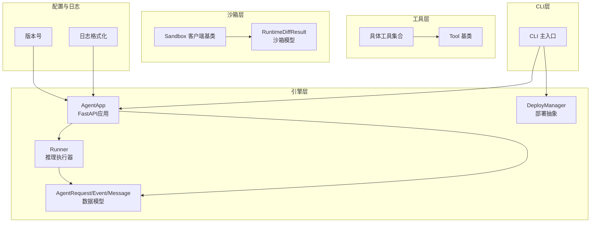
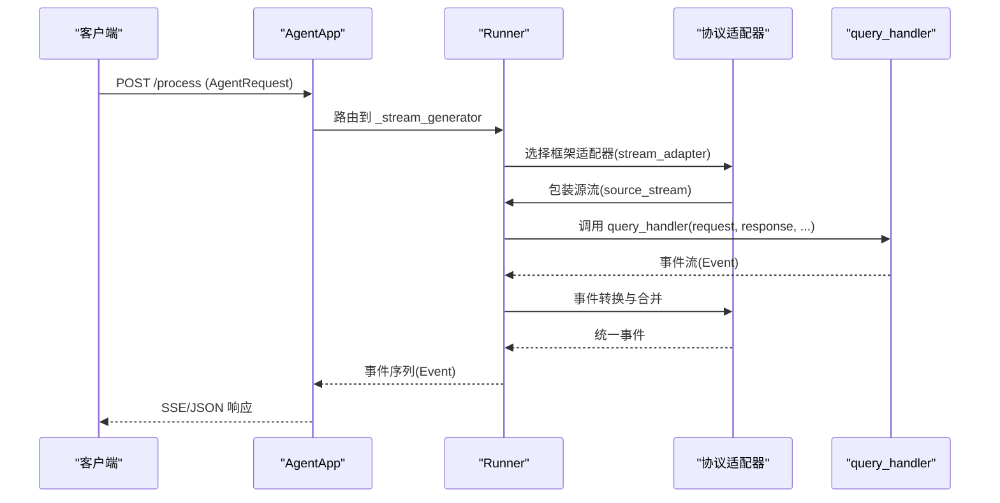
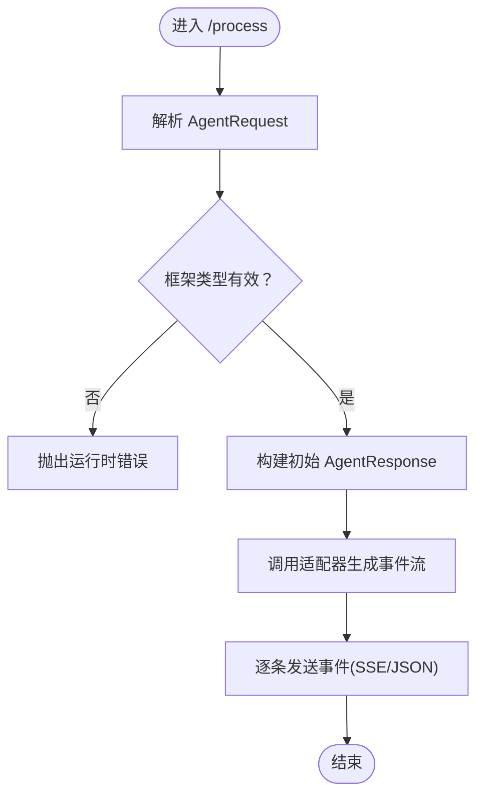
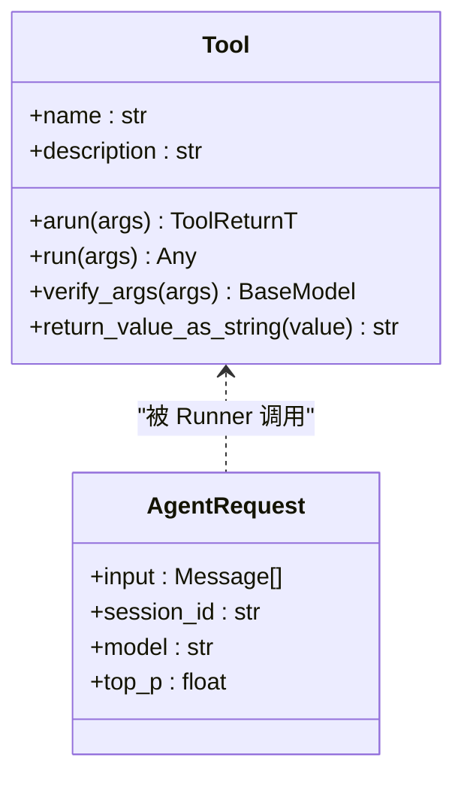
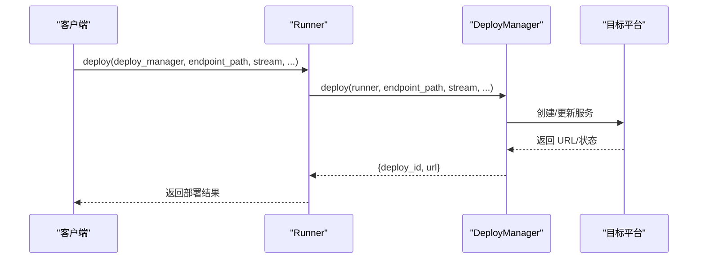
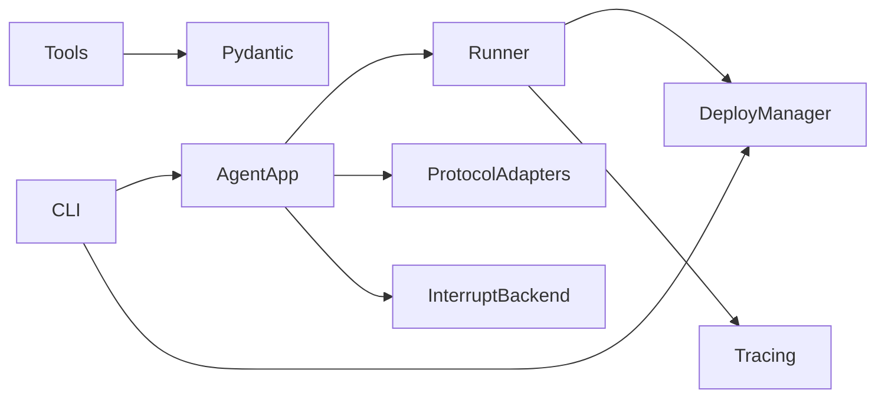

# API文档

<cite>
**本文引用的文件**
- [src/agentscope_runtime/engine/app/agent_app.py](file://src/agentscope_runtime/engine/app/agent_app.py)
- [src/agentscope_runtime/engine/runner.py](file://src/agentscope_runtime/engine/runner.py)
- [src/agentscope_runtime/engine/schemas/agent_schemas.py](file://src/agentscope_runtime/engine/schemas/agent_schemas.py)
- [src/agentscope_runtime/engine/deployers/base.py](file://src/agentscope_runtime/engine/deployers/base.py)
- [src/agentscope_runtime/tools/base.py](file://src/agentscope_runtime/tools/base.py)
- [src/agentscope_runtime/sandbox/client/base.py](file://src/agentscope_runtime/sandbox/client/base.py)
- [src/agentscope_runtime/sandbox/model/api.py](file://src/agentscope_runtime/sandbox/model/api.py)
- [src/agentscope_runtime/cli/cli.py](file://src/agentscope_runtime/cli/cli.py)
- [src/agentscope_runtime/version.py](file://src/agentscope_runtime/version.py)
- [src/agentscope_runtime/common/utils/logging.py](file://src/agentscope_runtime/common/utils/logging.py)
</cite>

## 目录
1. [简介](#简介)
2. [项目结构](#项目结构)
3. [核心组件](#核心组件)
4. [架构总览](#架构总览)
5. [详细组件分析](#详细组件分析)
6. [依赖关系分析](#依赖关系分析)
7. [性能考虑](#性能考虑)
8. [故障排查指南](#故障排查指南)
9. [结论](#结论)
10. [附录](#附录)

## 简介
本文件为 AgentScope Runtime 的全面 API 文档，覆盖核心推理 API、工具 API、部署 API 与配置 API 的接口规范。文档面向不同技术背景的读者，提供方法签名、参数类型、返回值、异常处理、请求/响应示例、使用场景、版本控制与兼容性说明、限流与配额信息、SDK/客户端库使用指南以及性能特征与最佳实践。

## 项目结构
AgentScope Runtime 采用模块化分层设计：
- 引擎层：提供 Agent 应用、Runner、协议适配器与部署管理器等核心能力
- 工具层：统一的 Tool 抽象与工具集合（图像生成、视频生成、搜索、语音识别/合成等）
- 沙箱层：容器化沙箱运行环境与客户端
- CLI 层：命令行工具，提供部署、状态查询、调用等操作入口
- 配置与日志：版本号、日志格式化与输出

**图表来源**
- [src/agentscope_runtime/engine/app/agent_app.py:60-106](file://src/agentscope_runtime/engine/app/agent_app.py#L60-L106)
- [src/agentscope_runtime/engine/runner.py:46-114](file://src/agentscope_runtime/engine/runner.py#L46-L114)
- [src/agentscope_runtime/engine/schemas/agent_schemas.py:736-800](file://src/agentscope_runtime/engine/schemas/agent_schemas.py#L736-L800)
- [src/agentscope_runtime/engine/deployers/base.py:9-44](file://src/agentscope_runtime/engine/deployers/base.py#L9-L44)
- [src/agentscope_runtime/tools/base.py:34-127](file://src/agentscope_runtime/tools/base.py#L34-L127)
- [src/agentscope_runtime/sandbox/client/base.py:10-74](file://src/agentscope_runtime/sandbox/client/base.py#L10-L74)
- [src/agentscope_runtime/sandbox/model/api.py:7-17](file://src/agentscope_runtime/sandbox/model/api.py#L7-L17)
- [src/agentscope_runtime/cli/cli.py:30-64](file://src/agentscope_runtime/cli/cli.py#L30-L64)
- [src/agentscope_runtime/version.py:1-3](file://src/agentscope_runtime/version.py#L1-L3)
- [src/agentscope_runtime/common/utils/logging.py:31-45](file://src/agentscope_runtime/common/utils/logging.py#L31-L45)

**章节来源**
- [src/agentscope_runtime/engine/app/agent_app.py:60-106](file://src/agentscope_runtime/engine/app/agent_app.py#L60-L106)
- [src/agentscope_runtime/engine/runner.py:46-114](file://src/agentscope_runtime/engine/runner.py#L46-L114)
- [src/agentscope_runtime/engine/schemas/agent_schemas.py:736-800](file://src/agentscope_runtime/engine/schemas/agent_schemas.py#L736-L800)
- [src/agentscope_runtime/engine/deployers/base.py:9-44](file://src/agentscope_runtime/engine/deployers/base.py#L9-L44)
- [src/agentscope_runtime/tools/base.py:34-127](file://src/agentscope_runtime/tools/base.py#L34-L127)
- [src/agentscope_runtime/sandbox/client/base.py:10-74](file://src/agentscope_runtime/sandbox/client/base.py#L10-L74)
- [src/agentscope_runtime/sandbox/model/api.py:7-17](file://src/agentscope_runtime/sandbox/model/api.py#L7-L17)
- [src/agentscope_runtime/cli/cli.py:30-64](file://src/agentscope_runtime/cli/cli.py#L30-L64)
- [src/agentscope_runtime/version.py:1-3](file://src/agentscope_runtime/version.py#L1-L3)
- [src/agentscope_runtime/common/utils/logging.py:31-45](file://src/agentscope_runtime/common/utils/logging.py#L31-L45)

## 核心组件
- AgentApp：基于 FastAPI 的推理服务应用，集成 Runner、协议适配器与中断管理，提供健康检查、根路径信息、任务队列等内置路由
- Runner：统一的推理执行器，负责框架类型绑定、事件序列化、错误包装与资源生命周期管理
- 数据模型：AgentRequest、Event、Message 等，定义请求/响应结构与消息内容类型
- 工具基类：Tool 抽象，提供输入/输出类型校验、参数模式解析、同步/异步执行与字符串化转换
- 沙箱客户端：SandboxHttpBase，封装通用工具与会话头信息
- CLI：命令行入口，提供 chat、run、web、deploy、list、status、stop、invoke、sandbox 等子命令

**章节来源**
- [src/agentscope_runtime/engine/app/agent_app.py:60-106](file://src/agentscope_runtime/engine/app/agent_app.py#L60-L106)
- [src/agentscope_runtime/engine/runner.py:46-114](file://src/agentscope_runtime/engine/runner.py#L46-L114)
- [src/agentscope_runtime/engine/schemas/agent_schemas.py:736-800](file://src/agentscope_runtime/engine/schemas/agent_schemas.py#L736-L800)
- [src/agentscope_runtime/tools/base.py:34-127](file://src/agentscope_runtime/tools/base.py#L34-L127)
- [src/agentscope_runtime/sandbox/client/base.py:10-74](file://src/agentscope_runtime/sandbox/client/base.py#L10-L74)
- [src/agentscope_runtime/cli/cli.py:30-64](file://src/agentscope_runtime/cli/cli.py#L30-L64)

## 架构总览
AgentApp 作为服务入口，通过 Runner 执行推理，并根据协议适配器（A2A、Response API、AGUI）注册不同风格的处理端点。Runner 将用户输入转换为框架特定的消息流，再经适配器转换为统一事件流，最终以 Server-Sent Events 或 JSON 响应返回。

**图表来源**
- [src/agentscope_runtime/engine/app/agent_app.py:781-800](file://src/agentscope_runtime/engine/app/agent_app.py#L781-L800)
- [src/agentscope_runtime/engine/runner.py:199-356](file://src/agentscope_runtime/engine/runner.py#L199-L356)

**章节来源**
- [src/agentscope_runtime/engine/app/agent_app.py:781-800](file://src/agentscope_runtime/engine/app/agent_app.py#L781-L800)
- [src/agentscope_runtime/engine/runner.py:199-356](file://src/agentscope_runtime/engine/runner.py#L199-L356)

## 详细组件分析

### 核心推理 API
- 接口名称：POST /process
- 方法签名：AgentApp._stream_generator(request: dict, ...) -> StreamingResponse
- 参数类型：
  - request: dict，符合 AgentRequest 模式；包含 input（消息数组）、可选字段如 session_id、model、top_p 等
- 返回值：
  - 默认：Server-Sent Events 流，事件对象包含 sequence_number、object、status、error 等
  - 可配置：JSON 响应（当 stream=false 时）
- 异常处理：
  - Runner 在框架类型未设置或不合法时抛出运行时错误
  - Runner 在未启动状态下调用 stream_query 抛出运行时错误
  - 适配器内部异常会被包装为统一错误对象
- 使用场景：
  - 实时对话、多模态消息处理、工具调用链路追踪
- 请求/响应示例（路径引用）：
  - 请求示例：[AgentRequest 示例:751-789](file://src/agentscope_runtime/engine/schemas/agent_schemas.py#L751-L789)
  - 响应事件结构：[Event/Message/Content:263-511](file://src/agentscope_runtime/engine/schemas/agent_schemas.py#L263-L511)

**图表来源**
- [src/agentscope_runtime/engine/runner.py:199-356](file://src/agentscope_runtime/engine/runner.py#L199-L356)
- [src/agentscope_runtime/engine/schemas/agent_schemas.py:751-800](file://src/agentscope_runtime/engine/schemas/agent_schemas.py#L751-L800)

**章节来源**
- [src/agentscope_runtime/engine/app/agent_app.py:781-800](file://src/agentscope_runtime/engine/app/agent_app.py#L781-L800)
- [src/agentscope_runtime/engine/runner.py:199-356](file://src/agentscope_runtime/engine/runner.py#L199-L356)
- [src/agentscope_runtime/engine/schemas/agent_schemas.py:751-800](file://src/agentscope_runtime/engine/schemas/agent_schemas.py#L751-L800)

### 工具 API
- 类型：Tool 抽象基类
- 关键方法：
  - arun(args: ToolArgsT, **kwargs) -> ToolReturnT：异步执行工具
  - run(args, **kwargs)：同步执行（内部桥接异步）
  - verify_args(args_list/args)：参数验证与反序列化
  - return_value_as_string(value)：返回值字符串化
- 输入/输出类型：
  - 通过泛型约束 ToolArgsT/ToolReturnT，使用 Pydantic 模型进行参数与返回值校验
- 使用场景：
  - 图像生成/编辑、文本到语音、语音识别、网页搜索、视频生成等
- 示例（路径引用）：
  - 工具基类定义：[Tool 基类:34-127](file://src/agentscope_runtime/tools/base.py#L34-L127)
  - 参数模式解析：[FunctionParameters/FunctionTool:80-120](file://src/agentscope_runtime/engine/schemas/agent_schemas.py#L80-L120)

**图表来源**
- [src/agentscope_runtime/tools/base.py:34-127](file://src/agentscope_runtime/tools/base.py#L34-L127)
- [src/agentscope_runtime/engine/schemas/agent_schemas.py:751-800](file://src/agentscope_runtime/engine/schemas/agent_schemas.py#L751-L800)

**章节来源**
- [src/agentscope_runtime/tools/base.py:34-127](file://src/agentscope_runtime/tools/base.py#L34-L127)
- [src/agentscope_runtime/engine/schemas/agent_schemas.py:80-120](file://src/agentscope_runtime/engine/schemas/agent_schemas.py#L80-L120)

### 部署 API
- 抽象接口：DeployManager
  - deploy(*args, **kwargs) -> Dict[str, str]：返回包含 deploy_id 与 URL 的字典
  - stop(deploy_id: str, **kwargs) -> Dict[str, Any]：停止指定部署实例
- Runner 集成：
  - deploy(deploy_manager: DeployManager, endpoint_path: str, stream: bool, ...) -> URL
- 使用场景：
  - 本地开发、Kubernetes、Knative、Kruise、FC、ModelStudio、AgentRun 等平台部署
- 示例（路径引用）：
  - 部署接口定义：[DeployManager:9-44](file://src/agentscope_runtime/engine/deployers/base.py#L9-L44)
  - Runner 部署调用：[Runner.deploy:122-170](file://src/agentscope_runtime/engine/runner.py#L122-L170)

**图表来源**
- [src/agentscope_runtime/engine/runner.py:122-170](file://src/agentscope_runtime/engine/runner.py#L122-L170)
- [src/agentscope_runtime/engine/deployers/base.py:23-43](file://src/agentscope_runtime/engine/deployers/base.py#L23-L43)

**章节来源**
- [src/agentscope_runtime/engine/deployers/base.py:9-44](file://src/agentscope_runtime/engine/deployers/base.py#L9-L44)
- [src/agentscope_runtime/engine/runner.py:122-170](file://src/agentscope_runtime/engine/runner.py#L122-L170)

### 配置 API
- 版本控制与兼容性：
  - 版本号：v1.1.5
  - 生命周期钩子迁移：init()/shutdown() 已标记弃用，建议使用 FastAPI lifespan 管理
- 日志配置：
  - setup_logger(level)：彩色终端输出，包含文件路径与行号
- 运行时参数：
  - AgentApp 支持 endpoint_path、response_type、stream、request_model、before_start/after_finish、broker_url/backend_url、enable_embedded_worker、enable_stream_task、stream_task_queue、stream_task_timeout、a2a_config/agui_config、interrupt_backend/interrupt_redis_url、mode、protocol_adapters、custom_endpoints 等
- 示例（路径引用）：
  - 版本号：[version:1-3](file://src/agentscope_runtime/version.py#L1-L3)
  - 日志初始化：[setup_logger:31-45](file://src/agentscope_runtime/common/utils/logging.py#L31-L45)
  - AgentApp 构造参数：[AgentApp.__init__:124-151](file://src/agentscope_runtime/engine/app/agent_app.py#L124-L151)

**章节来源**
- [src/agentscope_runtime/version.py:1-3](file://src/agentscope_runtime/version.py#L1-L3)
- [src/agentscope_runtime/common/utils/logging.py:31-45](file://src/agentscope_runtime/common/utils/logging.py#L31-L45)
- [src/agentscope_runtime/engine/app/agent_app.py:124-151](file://src/agentscope_runtime/engine/app/agent_app.py#L124-L151)

### 沙箱 API
- 客户端基类：
  - SandboxHttpBase：封装通用工具（如运行 IPython 单元格、执行 Shell 命令），设置会话头与鉴权头
- 沙箱模型：
  - RuntimeDiffResult：返回文件系统差异与当前浏览器位置
- 示例（路径引用）：
  - 客户端基类：[SandboxHttpBase:10-74](file://src/agentscope_runtime/sandbox/client/base.py#L10-L74)
  - 沙箱模型：[RuntimeDiffResult:7-17](file://src/agentscope_runtime/sandbox/model/api.py#L7-L17)

**章节来源**
- [src/agentscope_runtime/sandbox/client/base.py:10-74](file://src/agentscope_runtime/sandbox/client/base.py#L10-L74)
- [src/agentscope_runtime/sandbox/model/api.py:7-17](file://src/agentscope_runtime/sandbox/model/api.py#L7-L17)

### CLI API
- 子命令：
  - chat、run、web、deploy、list、status、stop、invoke、sandbox
- 入口函数：main()，版本选项通过 @click.version_option 注入
- 示例（路径引用）：
  - CLI 主入口：[cli:30-64](file://src/agentscope_runtime/cli/cli.py#L30-L64)

**章节来源**
- [src/agentscope_runtime/cli/cli.py:30-64](file://src/agentscope_runtime/cli/cli.py#L30-L64)

## 依赖关系分析
- AgentApp 依赖 Runner、协议适配器与中断后端
- Runner 依赖 DeployManager、协议适配器与追踪工具
- 工具层依赖 Pydantic 进行参数与返回值校验
- CLI 依赖 Click 并与 AgentApp/DeployManager 协作

**图表来源**
- [src/agentscope_runtime/engine/app/agent_app.py:340-357](file://src/agentscope_runtime/engine/app/agent_app.py#L340-L357)
- [src/agentscope_runtime/engine/runner.py:20-40](file://src/agentscope_runtime/engine/runner.py#L20-L40)
- [src/agentscope_runtime/tools/base.py:18-25](file://src/agentscope_runtime/tools/base.py#L18-L25)
- [src/agentscope_runtime/cli/cli.py:10-21](file://src/agentscope_runtime/cli/cli.py#L10-L21)

**章节来源**
- [src/agentscope_runtime/engine/app/agent_app.py:340-357](file://src/agentscope_runtime/engine/app/agent_app.py#L340-L357)
- [src/agentscope_runtime/engine/runner.py:20-40](file://src/agentscope_runtime/engine/runner.py#L20-L40)
- [src/agentscope_runtime/tools/base.py:18-25](file://src/agentscope_runtime/tools/base.py#L18-L25)
- [src/agentscope_runtime/cli/cli.py:10-21](file://src/agentscope_runtime/cli/cli.py#L10-L21)

## 性能考虑
- 流式传输：默认启用 SSE，适合长文本与多模态内容增量返回
- 事件序列：通过 SequenceNumberGenerator 保证事件顺序一致性
- 中断与清理：支持分布式中断后端与任务过期清理，避免内存泄漏
- 资源管理：Runner 使用 AsyncExitStack 管理生命周期，确保退出时释放资源
- 最佳实践：
  - 合理设置 stream_task_timeout，避免长时间挂起
  - 使用中断后端在高并发场景下实现任务取消
  - 对工具调用进行参数校验与超时控制

[本节为通用指导，无需列出具体文件来源]

## 故障排查指南
- 常见错误与定位：
  - 框架类型未设置或非法：检查 Runner.framework_type 是否在允许集合内
  - 未启动 Runner：确保在调用 stream_query 前已启动或使用上下文管理器
  - 适配器异常：查看事件中的 error 字段，结合日志定位
- 日志输出：
  - 彩色终端输出，包含文件路径与行号，便于快速定位问题
- 示例（路径引用）：
  - 错误包装与日志：[Runner 异常处理:338-356](file://src/agentscope_runtime/engine/runner.py#L338-L356)
  - 日志初始化：[setup_logger:31-45](file://src/agentscope_runtime/common/utils/logging.py#L31-L45)

**章节来源**
- [src/agentscope_runtime/engine/runner.py:338-356](file://src/agentscope_runtime/engine/runner.py#L338-L356)
- [src/agentscope_runtime/common/utils/logging.py:31-45](file://src/agentscope_runtime/common/utils/logging.py#L31-L45)

## 结论
AgentScope Runtime 提供了统一的推理服务、灵活的工具体系、可扩展的部署能力与完善的 CLI 工具链。通过清晰的数据模型与协议适配器，开发者可以快速构建从本地到云端的多平台推理服务，并在高并发与复杂工作负载下保持稳定与可观测性。

[本节为总结性内容，无需列出具体文件来源]

## 附录

### API 一览表（核心/工具/部署/配置）
- 核心推理 API
  - POST /process：接收 AgentRequest，返回事件流或 JSON
  - GET /：返回服务端点信息（含 /process、/health、/stream、/task 等）
  - GET /health：健康检查
  - POST /shutdown、GET /admin/status：进程管理与状态查询
- 工具 API
  - Tool.arun(args, **kwargs)：异步执行工具
  - Tool.run(args, **kwargs)：同步执行工具
  - Tool.verify_args(args)：参数校验
  - Tool.return_value_as_string(value)：返回值字符串化
- 部署 API
  - Runner.deploy(deploy_manager, endpoint_path, stream, ...)：部署服务
  - DeployManager.deploy/stop：平台无关部署接口
- 配置 API
  - AgentApp.__init__(...)：配置端点、流式、协议适配器、中断后端、部署模式等
  - setup_logger(level)：日志初始化
  - 版本号：__version__

**章节来源**
- [src/agentscope_runtime/engine/app/agent_app.py:382-424](file://src/agentscope_runtime/engine/app/agent_app.py#L382-L424)
- [src/agentscope_runtime/engine/runner.py:122-170](file://src/agentscope_runtime/engine/runner.py#L122-L170)
- [src/agentscope_runtime/engine/deployers/base.py:23-43](file://src/agentscope_runtime/engine/deployers/base.py#L23-L43)
- [src/agentscope_runtime/tools/base.py:94-127](file://src/agentscope_runtime/tools/base.py#L94-L127)
- [src/agentscope_runtime/common/utils/logging.py:31-45](file://src/agentscope_runtime/common/utils/logging.py#L31-L45)
- [src/agentscope_runtime/version.py:1-3](file://src/agentscope_runtime/version.py#L1-L3)