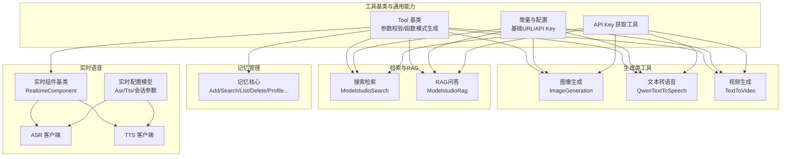
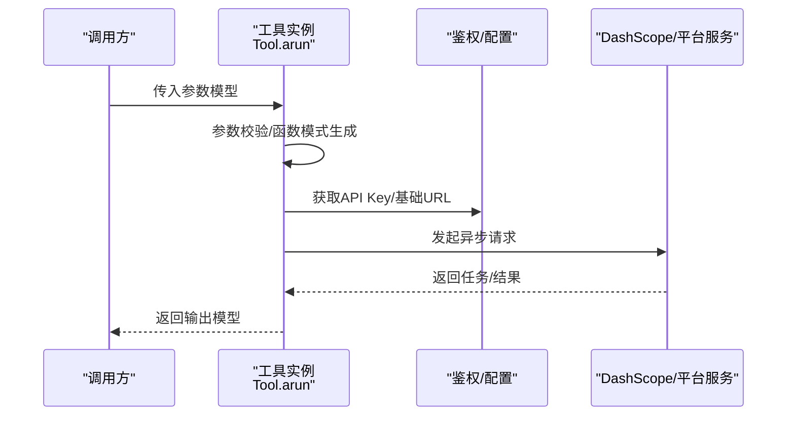
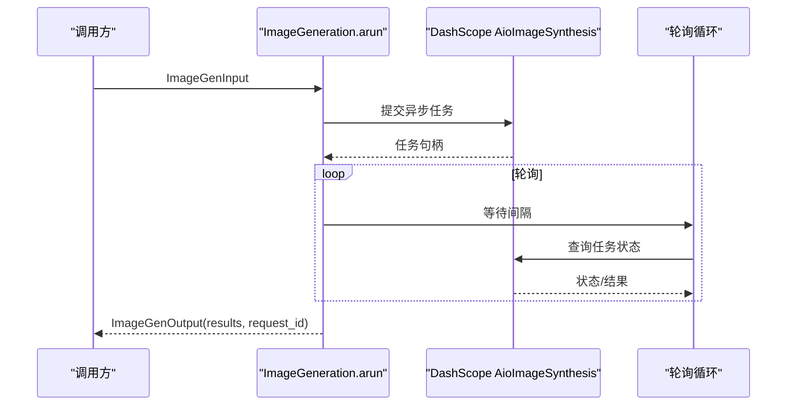
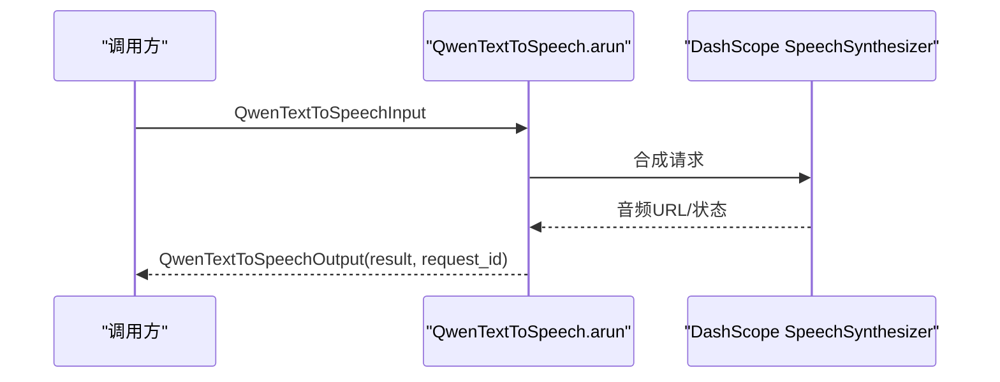
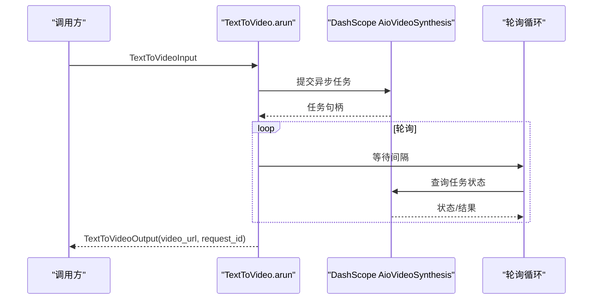
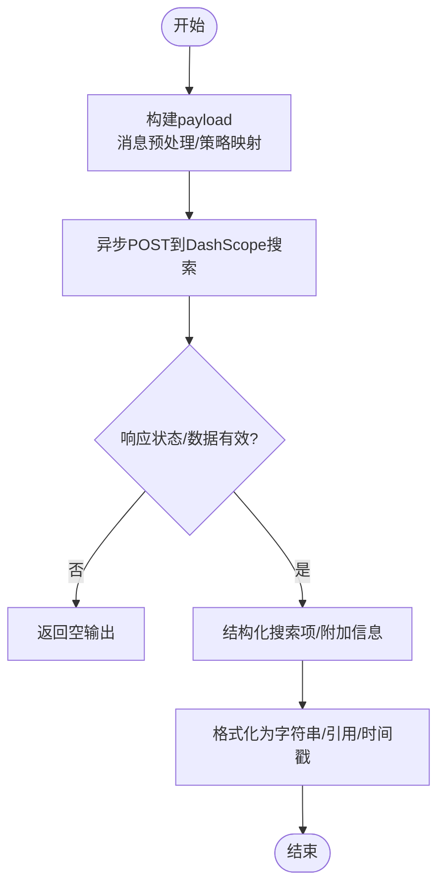
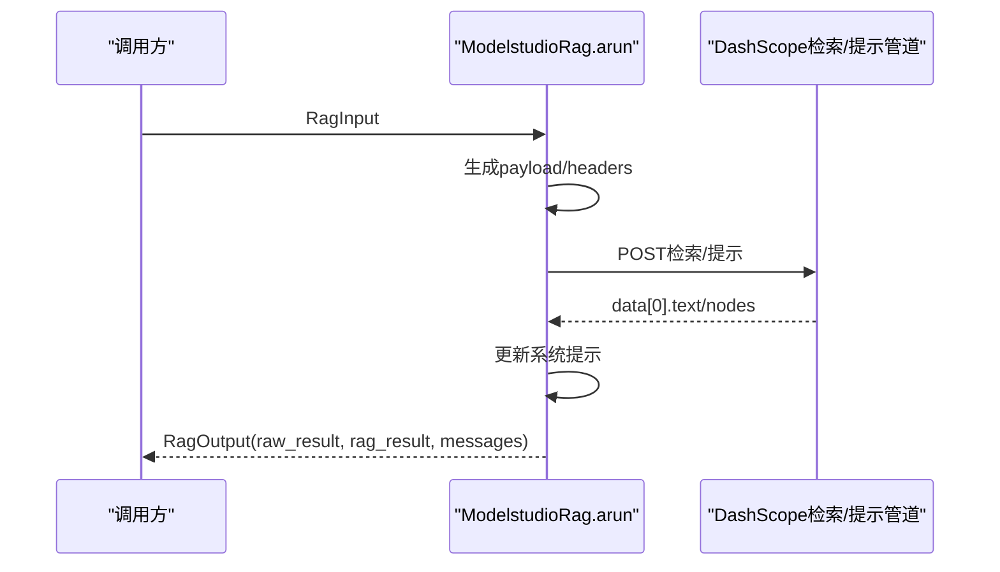
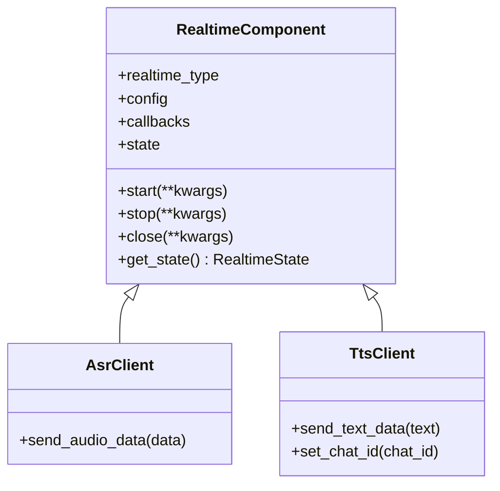
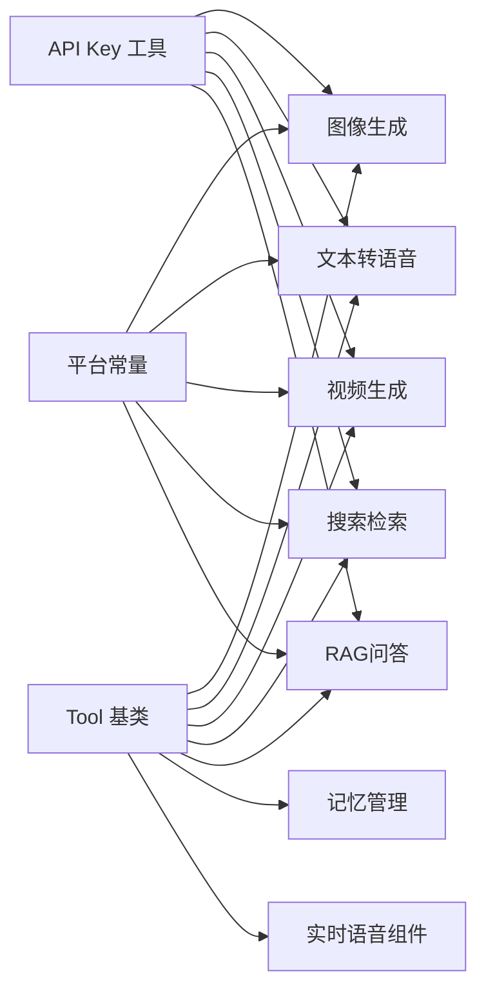

# 工具API

<cite>
**本文引用的文件**
- [src/agentscope_runtime/tools/base.py](file://src/agentscope_runtime/tools/base.py)
- [src/agentscope_runtime/tools/_constants.py](file://src/agentscope_runtime/tools/_constants.py)
- [src/agentscope_runtime/tools/utils/api_key_util.py](file://src/agentscope_runtime/tools/utils/api_key_util.py)
- [src/agentscope_runtime/engine/schemas/modelstudio_llm.py](file://src/agentscope_runtime/engine/schemas/modelstudio_llm.py)
- [src/agentscope_runtime/engine/schemas/realtime.py](file://src/agentscope_runtime/engine/schemas/realtime.py)
- [src/agentscope_runtime/tools/generations/image_generation.py](file://src/agentscope_runtime/tools/generations/image_generation.py)
- [src/agentscope_runtime/tools/generations/qwen_text_to_speech.py](file://src/agentscope_runtime/tools/generations/qwen_text_to_speech.py)
- [src/agentscope_runtime/tools/generations/text_to_video.py](file://src/agentscope_runtime/tools/generations/text_to_video.py)
- [src/agentscope_runtime/tools/searches/modelstudio_search.py](file://src/agentscope_runtime/tools/searches/modelstudio_search.py)
- [src/agentscope_runtime/tools/RAGs/modelstudio_rag.py](file://src/agentscope_runtime/tools/RAGs/modelstudio_rag.py)
- [src/agentscope_runtime/tools/modelstudio_memory/core.py](file://src/agentscope_runtime/tools/modelstudio_memory/core.py)
- [src/agentscope_runtime/tools/realtime_clients/realtime_tool.py](file://src/agentscope_runtime/tools/realtime_clients/realtime_tool.py)
- [src/agentscope_runtime/tools/realtime_clients/asr_client.py](file://src/agentscope_runtime/tools/realtime_clients/asr_client.py)
- [src/agentscope_runtime/tools/realtime_clients/tts_client.py](file://src/agentscope_runtime/tools/realtime_clients/tts_client.py)
- [tests/tools/test_generations.py](file://tests/tools/test_generations.py)
- [tests/tools/test_search.py](file://tests/tools/test_search.py)
</cite>

## 目录
1. [简介](#简介)
2. [项目结构](#项目结构)
3. [核心组件](#核心组件)
4. [架构总览](#架构总览)
5. [详细组件分析](#详细组件分析)
6. [依赖分析](#依赖分析)
7. [性能考虑](#性能考虑)
8. [故障排查指南](#故障排查指南)
9. [结论](#结论)
10. [附录](#附录)

## 简介
本文件面向 AgentScope Runtime 的工具API，系统性梳理图像生成、文本转语音、视频生成、实时语音识别与合成、搜索检索、RAG问答以及记忆管理等工具的接口定义、输入参数、输出格式、调用流程、异步机制、错误处理与最佳实践。文档同时给出性能特征与使用限制说明，帮助开发者在多模态与检索增强场景中高效集成与组合使用这些工具。

## 项目结构
AgentScope Runtime 将工具抽象为统一的 Tool 基类，所有具体工具均实现异步执行方法 arun，并通过 Pydantic 模型定义输入/输出参数，配合参数解析器生成函数式工具的参数模式，便于上层框架或代理系统直接调用与编排。

图表来源
- [src/agentscope_runtime/tools/base.py:34-128](file://src/agentscope_runtime/tools/base.py#L34-L128)
- [src/agentscope_runtime/tools/_constants.py:1-19](file://src/agentscope_runtime/tools/_constants.py#L1-L19)
- [src/agentscope_runtime/tools/utils/api_key_util.py:13-46](file://src/agentscope_runtime/tools/utils/api_key_util.py#L13-L46)
- [src/agentscope_runtime/tools/generations/image_generation.py:70-203](file://src/agentscope_runtime/tools/generations/image_generation.py#L70-L203)
- [src/agentscope_runtime/tools/generations/qwen_text_to_speech.py:53-155](file://src/agentscope_runtime/tools/generations/qwen_text_to_speech.py#L53-L155)
- [src/agentscope_runtime/tools/generations/text_to_video.py:73-222](file://src/agentscope_runtime/tools/generations/text_to_video.py#L73-L222)
- [src/agentscope_runtime/tools/searches/modelstudio_search.py:102-221](file://src/agentscope_runtime/tools/searches/modelstudio_search.py#L102-L221)
- [src/agentscope_runtime/tools/RAGs/modelstudio_rag.py:74-174](file://src/agentscope_runtime/tools/RAGs/modelstudio_rag.py#L74-L174)
- [src/agentscope_runtime/tools/modelstudio_memory/core.py:55-800](file://src/agentscope_runtime/tools/modelstudio_memory/core.py#L55-L800)
- [src/agentscope_runtime/tools/realtime_clients/realtime_tool.py:21-56](file://src/agentscope_runtime/tools/realtime_clients/realtime_tool.py#L21-L56)
- [src/agentscope_runtime/tools/realtime_clients/asr_client.py:13-28](file://src/agentscope_runtime/tools/realtime_clients/asr_client.py#L13-L28)
- [src/agentscope_runtime/tools/realtime_clients/tts_client.py:13-34](file://src/agentscope_runtime/tools/realtime_clients/tts_client.py#L13-L34)
- [src/agentscope_runtime/engine/schemas/realtime.py:21-255](file://src/agentscope_runtime/engine/schemas/realtime.py#L21-L255)

章节来源
- [src/agentscope_runtime/tools/base.py:34-128](file://src/agentscope_runtime/tools/base.py#L34-L128)
- [src/agentscope_runtime/tools/_constants.py:1-19](file://src/agentscope_runtime/tools/_constants.py#L1-L19)

## 核心组件
- 工具基类 Tool：提供统一的异步执行入口 arun，参数校验、函数式参数模式生成、同步包装 run，确保输入/输出类型安全。
- API Key 管理：集中从入参、kwargs 或环境变量获取 DashScope API Key，保证工具调用鉴权一致性。
- 平台常量：统一管理 DashScope HTTP/WebSocket 基础地址、API Key 环境变量等，便于全局替换与测试。

章节来源
- [src/agentscope_runtime/tools/base.py:75-128](file://src/agentscope_runtime/tools/base.py#L75-L128)
- [src/agentscope_runtime/tools/utils/api_key_util.py:13-46](file://src/agentscope_runtime/tools/utils/api_key_util.py#L13-L46)
- [src/agentscope_runtime/tools/_constants.py:4-18](file://src/agentscope_runtime/tools/_constants.py#L4-L18)

## 架构总览
工具API遵循“输入参数模型 → 异步执行 → 输出结果模型”的标准流程；部分工具采用提交/轮询（Submit/Fetch）异步模式，具备超时控制与状态检查；实时语音工具通过配置模型与回调机制组织会话事件流。

图表来源
- [src/agentscope_runtime/tools/base.py:94-128](file://src/agentscope_runtime/tools/base.py#L94-L128)
- [src/agentscope_runtime/tools/utils/api_key_util.py:13-46](file://src/agentscope_runtime/tools/utils/api_key_util.py#L13-L46)
- [src/agentscope_runtime/tools/_constants.py:4-18](file://src/agentscope_runtime/tools/_constants.py#L4-L18)

## 详细组件分析

### 图像生成（Text-to-Image）
- 功能：根据文本提示生成图像，支持多图数量、尺寸、反向提示词、智能改写、水印等参数。
- 输入参数模型：ImageGenInput
  - prompt：正向提示词（字符长度有限制）
  - size：输出分辨率（最高可达200万像素）
  - negative_prompt：反向提示词（字符长度有限制）
  - prompt_extend：是否开启智能改写
  - n：生成数量（1~4）
  - watermark：是否加水印
  - ctx：HTTP 请求上下文（MCP专用）
- 输出模型：ImageGenOutput
  - results：图像URL列表
  - request_id：请求ID
- 异步流程：先提交任务，再轮询任务状态，直至完成或失败/取消；超时阈值约5分钟。
- 错误处理：未设置或无效的 DASHSCOPE_API_KEY 抛出异常；任务状态非成功时抛出运行时错误；超时抛出超时异常。
- 性能与限制：单次生成耗时受模型与分辨率影响；并发建议结合任务队列与限速策略。

图表来源
- [src/agentscope_runtime/tools/generations/image_generation.py:79-203](file://src/agentscope_runtime/tools/generations/image_generation.py#L79-L203)

章节来源
- [src/agentscope_runtime/tools/generations/image_generation.py:21-68](file://src/agentscope_runtime/tools/generations/image_generation.py#L21-L68)
- [src/agentscope_runtime/tools/generations/image_generation.py:79-203](file://src/agentscope_runtime/tools/generations/image_generation.py#L79-L203)
- [tests/tools/test_generations.py:478-498](file://tests/tools/test_generations.py#L478-L498)

### 文本转语音（Qwen-TTS）
- 功能：将文本合成为音频，支持多种音色与流式输出。
- 输入参数模型：QwenTextToSpeechInput
  - text：要合成的文本（Token长度限制）
  - voice：音色选择
  - ctx：HTTP 请求上下文（MCP专用）
- 输出模型：QwenTextToSpeechOutput
  - result：音频URL
  - request_id：请求ID
- 异步流程：一次性调用 DashScope 的语音合成接口，直接返回结果。
- 错误处理：未设置或无效的 DASHSCOPE_API_KEY 抛出异常；API 返回错误码或无法解析响应时抛出运行时错误。
- 性能与限制：单次合成时延较短，适合交互式对话；音色与采样率会影响体积与时延。

图表来源
- [src/agentscope_runtime/tools/generations/qwen_text_to_speech.py:64-155](file://src/agentscope_runtime/tools/generations/qwen_text_to_speech.py#L64-L155)

章节来源
- [src/agentscope_runtime/tools/generations/qwen_text_to_speech.py:17-51](file://src/agentscope_runtime/tools/generations/qwen_text_to_speech.py#L17-L51)
- [src/agentscope_runtime/tools/generations/qwen_text_to_speech.py:64-155](file://src/agentscope_runtime/tools/generations/qwen_text_to_speech.py#L64-L155)
- [tests/tools/test_generations.py:718-767](file://tests/tools/test_generations.py#L718-L767)

### 视频生成（Text-to-Video）
- 功能：根据文本描述生成视频，支持分辨率、时长、反向提示词、智能改写、水印等参数。
- 输入参数模型：TextToVideoInput
  - prompt：正向提示词（字符长度有限制）
  - negative_prompt：反向提示词（字符长度有限制）
  - size：视频分辨率
  - duration：视频时长（秒）
  - prompt_extend：是否开启智能改写
  - watermark：是否加水印
  - ctx：HTTP 请求上下文（MCP专用）
- 输出模型：TextToVideoOutput
  - video_url：视频URL
  - request_id：请求ID
- 异步流程：提交任务后轮询状态，直至完成或失败/取消；超时阈值约10分钟。
- 错误处理：未设置或无效的 DASHSCOPE_API_KEY 抛出异常；任务状态非成功时抛出运行时错误；超时抛出超时异常。
- 性能与限制：生成时延较长，建议批量提交并使用并发控制；分辨率与时长直接影响资源消耗。

图表来源
- [src/agentscope_runtime/tools/generations/text_to_video.py:86-222](file://src/agentscope_runtime/tools/generations/text_to_video.py#L86-L222)

章节来源
- [src/agentscope_runtime/tools/generations/text_to_video.py:21-71](file://src/agentscope_runtime/tools/generations/text_to_video.py#L21-L71)
- [src/agentscope_runtime/tools/generations/text_to_video.py:86-222](file://src/agentscope_runtime/tools/generations/text_to_video.py#L86-L222)
- [tests/tools/test_generations.py:314-431](file://tests/tools/test_generations.py#L314-L431)

### 搜索检索（ModelstudioSearch）
- 功能：基于 DashScope 的搜索服务，返回结构化检索结果字符串与附加信息；支持多种搜索策略与输出规则。
- 输入参数模型：SearchInput
  - messages：消息列表（OpenAIMessage 或 Dict），取最后一条作为查询
  - search_options：SearchOptions（启用来源、引用、策略、条数、意图识别等）
  - search_output_rules：输出规则（字段校验/过滤）
  - search_timeout：请求超时（秒）
  - type：搜索类型（如 image）
- 输出模型：SearchOutput
  - search_result：格式化后的检索结果字符串
  - search_info：附加信息（如额外工具信息、原始结果等）
- 异步流程：构造 payload，发起异步 HTTP 请求，解析响应，后处理为结构化项与字符串。
- 错误处理：缺少 user_id 抛出异常；网络/解析异常时返回空输出。
- 性能与限制：超时默认较短；结果长度与引用格式可配置；支持绿网过滤与来源展示。

图表来源
- [src/agentscope_runtime/tools/searches/modelstudio_search.py:114-221](file://src/agentscope_runtime/tools/searches/modelstudio_search.py#L114-L221)
- [src/agentscope_runtime/tools/searches/modelstudio_search.py:222-371](file://src/agentscope_runtime/tools/searches/modelstudio_search.py#L222-L371)
- [src/agentscope_runtime/tools/searches/modelstudio_search.py:372-651](file://src/agentscope_runtime/tools/searches/modelstudio_search.py#L372-L651)

章节来源
- [src/agentscope_runtime/tools/searches/modelstudio_search.py:47-84](file://src/agentscope_runtime/tools/searches/modelstudio_search.py#L47-L84)
- [src/agentscope_runtime/engine/schemas/modelstudio_llm.py:44-95](file://src/agentscope_runtime/engine/schemas/modelstudio_llm.py#L44-L95)
- [tests/tools/test_search.py:27-46](file://tests/tools/test_search.py#L27-L46)

### RAG问答（ModelstudioRag）
- 功能：从用户知识库召回信息，更新系统提示并返回增强后的消息或纯文本结果。
- 输入参数模型：RagInput
  - messages：字符串或消息列表（不建议使用消息格式）
  - rag_options：RagOptions（索引名/ID、最大块数、最大长度、引用、重写、重排、拒绝过滤、Web搜索等）
  - rest_token：剩余token长度
  - image_urls：多模态RAG的图片URL列表
  - workspace_id：工作空间ID
- 输出模型：RagOutput
  - raw_result：原始节点列表
  - rag_result：排序后的检索结果字符串
  - messages：更新系统提示后的消息列表
- 异步流程：构造请求体与头部，调用检索/提示管道，解析返回并更新系统提示。
- 错误处理：未设置 API Key 抛出异常；HTTP 非200或数据缺失时回退为空结果。
- 性能与限制：块数与长度上限可配置；启用重写/重排/拒绝过滤会增加时延。

图表来源
- [src/agentscope_runtime/tools/RAGs/modelstudio_rag.py:86-174](file://src/agentscope_runtime/tools/RAGs/modelstudio_rag.py#L86-L174)
- [src/agentscope_runtime/tools/RAGs/modelstudio_rag.py:176-262](file://src/agentscope_runtime/tools/RAGs/modelstudio_rag.py#L176-L262)
- [src/agentscope_runtime/tools/RAGs/modelstudio_rag.py:264-341](file://src/agentscope_runtime/tools/RAGs/modelstudio_rag.py#L264-L341)

章节来源
- [src/agentscope_runtime/tools/RAGs/modelstudio_rag.py:28-72](file://src/agentscope_runtime/tools/RAGs/modelstudio_rag.py#L28-L72)
- [src/agentscope_runtime/engine/schemas/modelstudio_llm.py:112-243](file://src/agentscope_runtime/engine/schemas/modelstudio_llm.py#L112-L243)

### 记忆管理（ModelstudioMemory）
- 功能：围绕用户记忆节点的增删查列与用户画像的创建/查询/列出，支持分页与筛选。
- 主要工具类：AddMemory、SearchMemory、ListMemory、DeleteMemory、CreateProfileSchema、GetUserProfile、GetProfileSchema、ListProfileSchemas 等。
- 输入/输出：均以 Pydantic 模型定义，支持异步请求与统一错误处理。
- 异步流程：构造请求体/参数，调用内存服务端点，解析响应为 MemoryNode/Profile 等模型。
- 错误处理：鉴权失败、网络异常、节点不存在等情况均有明确异常类型与日志记录。
- 性能与限制：分页参数可控；批量操作建议限速与并发控制。

```mermaid
classDiagram
class AddMemory {
+arun(args) AddMemoryOutput
}
class SearchMemory {
+arun(args) SearchMemoryOutput
}
class ListMemory {
+arun(args) ListMemoryOutput
}
class DeleteMemory {
+arun(args) DeleteMemoryOutput
}
class CreateProfileSchema {
+arun(args) CreateProfileSchemaOutput
}
class GetUserProfile {
+arun(args) GetUserProfileOutput
}
class GetProfileSchema {
+arun(args) GetProfileSchemaOutput
}
class ListProfileSchemas {
+arun(args) ListProfileSchemasOutput
}
```

图表来源
- [src/agentscope_runtime/tools/modelstudio_memory/core.py:55-800](file://src/agentscope_runtime/tools/modelstudio_memory/core.py#L55-L800)

章节来源
- [src/agentscope_runtime/tools/modelstudio_memory/core.py:55-800](file://src/agentscope_runtime/tools/modelstudio_memory/core.py#L55-L800)

### 实时语音识别与合成（ASR/TTS）
- 组件基类：RealtimeComponent，定义状态枚举与抽象方法（start/stop/close/get_state）。
- ASR 客户端：AsrClient，封装实时语音识别配置与音频数据发送。
- TTS 客户端：TtsClient，封装实时语音合成配置、文本发送与聊天ID设置。
- 实时配置模型：AsrConfig/TtsConfig 与 ModelstudioAsrConfig/ModelstudioTtsConfig，支持采样率、格式、音色、通道等参数。
- 会话协议：ModelstudioVoiceChatRequest/Response 定义会话开始/停止、音频转写、文本响应、音频开始/结束等事件与载荷。

图表来源
- [src/agentscope_runtime/tools/realtime_clients/realtime_tool.py:21-56](file://src/agentscope_runtime/tools/realtime_clients/realtime_tool.py#L21-L56)
- [src/agentscope_runtime/tools/realtime_clients/asr_client.py:13-28](file://src/agentscope_runtime/tools/realtime_clients/asr_client.py#L13-L28)
- [src/agentscope_runtime/tools/realtime_clients/tts_client.py:13-34](file://src/agentscope_runtime/tools/realtime_clients/tts_client.py#L13-L34)
- [src/agentscope_runtime/engine/schemas/realtime.py:21-255](file://src/agentscope_runtime/engine/schemas/realtime.py#L21-L255)

章节来源
- [src/agentscope_runtime/tools/realtime_clients/realtime_tool.py:9-56](file://src/agentscope_runtime/tools/realtime_clients/realtime_tool.py#L9-L56)
- [src/agentscope_runtime/tools/realtime_clients/asr_client.py:13-28](file://src/agentscope_runtime/tools/realtime_clients/asr_client.py#L13-L28)
- [src/agentscope_runtime/tools/realtime_clients/tts_client.py:13-34](file://src/agentscope_runtime/tools/realtime_clients/tts_client.py#L13-L34)
- [src/agentscope_runtime/engine/schemas/realtime.py:21-255](file://src/agentscope_runtime/engine/schemas/realtime.py#L21-L255)

## 依赖分析
- 工具基类 Tool 与参数解析：统一输入/输出类型校验与函数式参数模式生成，降低上层适配成本。
- API Key 管理与平台常量：集中管理鉴权与基础URL，便于测试与部署切换。
- 搜索/RAG/生成工具共享 DashScope SDK 与异步客户端，遵循一致的错误处理与超时策略。
- 实时语音工具依赖统一的配置模型与事件协议，便于跨厂商（ModelStudio/Azure）扩展。

图表来源
- [src/agentscope_runtime/tools/base.py:34-128](file://src/agentscope_runtime/tools/base.py#L34-L128)
- [src/agentscope_runtime/tools/utils/api_key_util.py:13-46](file://src/agentscope_runtime/tools/utils/api_key_util.py#L13-L46)
- [src/agentscope_runtime/tools/_constants.py:4-18](file://src/agentscope_runtime/tools/_constants.py#L4-L18)

章节来源
- [src/agentscope_runtime/tools/base.py:34-128](file://src/agentscope_runtime/tools/base.py#L34-L128)
- [src/agentscope_runtime/tools/utils/api_key_util.py:13-46](file://src/agentscope_runtime/tools/utils/api_key_util.py#L13-L46)
- [src/agentscope_runtime/tools/_constants.py:4-18](file://src/agentscope_runtime/tools/_constants.py#L4-L18)

## 性能考虑
- 异步与轮询：图像/视频生成采用提交/轮询模式，合理设置轮询间隔与超时，避免阻塞；并发任务需结合限速与队列。
- 资源与分辨率：图像/视频的分辨率与时长直接影响生成时延与资源占用，建议按业务场景选择合适参数。
- 检索与RAG：搜索超时与结果长度可配置；RAG的块数、长度、重写/重排/拒绝过滤会显著影响时延与准确性。
- 实时语音：采样率、格式与通道数影响带宽与延迟；VAD参数与供应商差异需要针对性优化。
- 缓存与复用：对重复的检索与RAG请求可引入缓存层，减少平台调用频率。

## 故障排查指南
- 鉴权相关
  - 现象：抛出“请设置有效的 DASHSCOPE_API_KEY”或类似异常
  - 排查：确认环境变量 DASHSCOPE_API_KEY 是否存在且有效；检查工具初始化时传入的 key 是否覆盖环境变量
- 任务状态异常
  - 现象：任务状态为 FAILED/CANCELED 或超时
  - 排查：检查输入参数合法性（长度、格式、分辨率等）；确认平台服务可用性；适当延长超时或降低并发
- 搜索/RAG 返回为空
  - 现象：search_result 为空或 rag_result 为空
  - 排查：确认 user_id/workspace_id 等必需参数；检查搜索策略与输出规则；查看附加信息以定位原因
- 实时语音
  - 现象：ASR/TTS 无响应或状态异常
  - 排查：核对配置模型参数（采样率、格式、语言/Vendor）；检查会话事件序列与回调是否正确触发

章节来源
- [src/agentscope_runtime/tools/generations/image_generation.py:106-109](file://src/agentscope_runtime/tools/generations/image_generation.py#L106-L109)
- [src/agentscope_runtime/tools/generations/qwen_text_to_speech.py:89-92](file://src/agentscope_runtime/tools/generations/qwen_text_to_speech.py#L89-L92)
- [src/agentscope_runtime/tools/generations/text_to_video.py:116-119](file://src/agentscope_runtime/tools/generations/text_to_video.py#L116-L119)
- [src/agentscope_runtime/tools/searches/modelstudio_search.py:140-148](file://src/agentscope_runtime/tools/searches/modelstudio_search.py#L140-L148)
- [src/agentscope_runtime/tools/RAGs/modelstudio_rag.py:208-210](file://src/agentscope_runtime/tools/RAGs/modelstudio_rag.py#L208-L210)

## 结论
AgentScope Runtime 的工具API以 Tool 基类为核心，统一了参数校验、异步执行与输出模型，覆盖图像/视频生成、文本转语音、搜索检索、RAG问答与记忆管理等关键能力；实时语音工具通过配置模型与事件协议实现灵活扩展。建议在生产环境中结合限速、缓存与可观测性，确保稳定性与性能。

## 附录
- 调用示例与测试参考
  - 图像生成/视频生成/文本转语音：见测试文件对并发与提交/轮询模式的演示
  - 搜索检索：见测试文件对 user_id 与搜索策略的使用
- 最佳实践
  - 工具链组合：先检索/再RAG/后生成，注意请求顺序与上下文注入；对重复内容使用缓存
  - 异步与并发：合理设置轮询间隔与超时，避免过度并发导致平台限流
  - 实时语音：针对不同供应商与设备特性调整配置参数，确保VAD与采样率匹配

章节来源
- [tests/tools/test_generations.py:72-183](file://tests/tools/test_generations.py#L72-L183)
- [tests/tools/test_generations.py:314-431](file://tests/tools/test_generations.py#L314-L431)
- [tests/tools/test_generations.py:718-767](file://tests/tools/test_generations.py#L718-L767)
- [tests/tools/test_search.py:27-46](file://tests/tools/test_search.py#L27-L46)