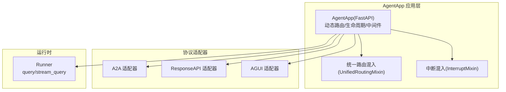
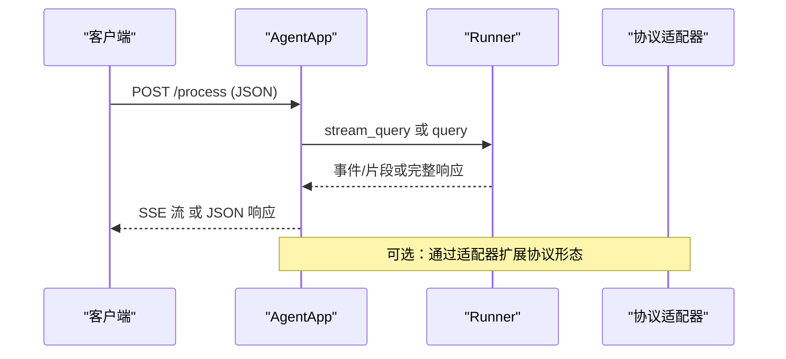
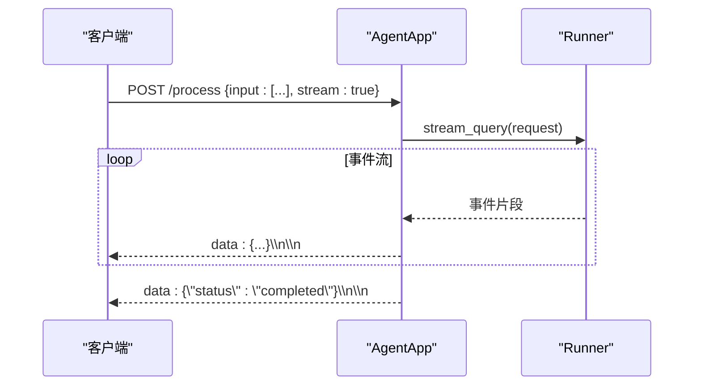
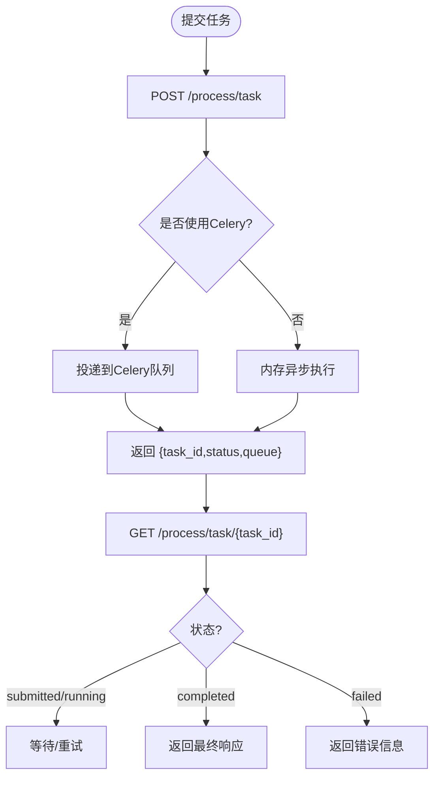
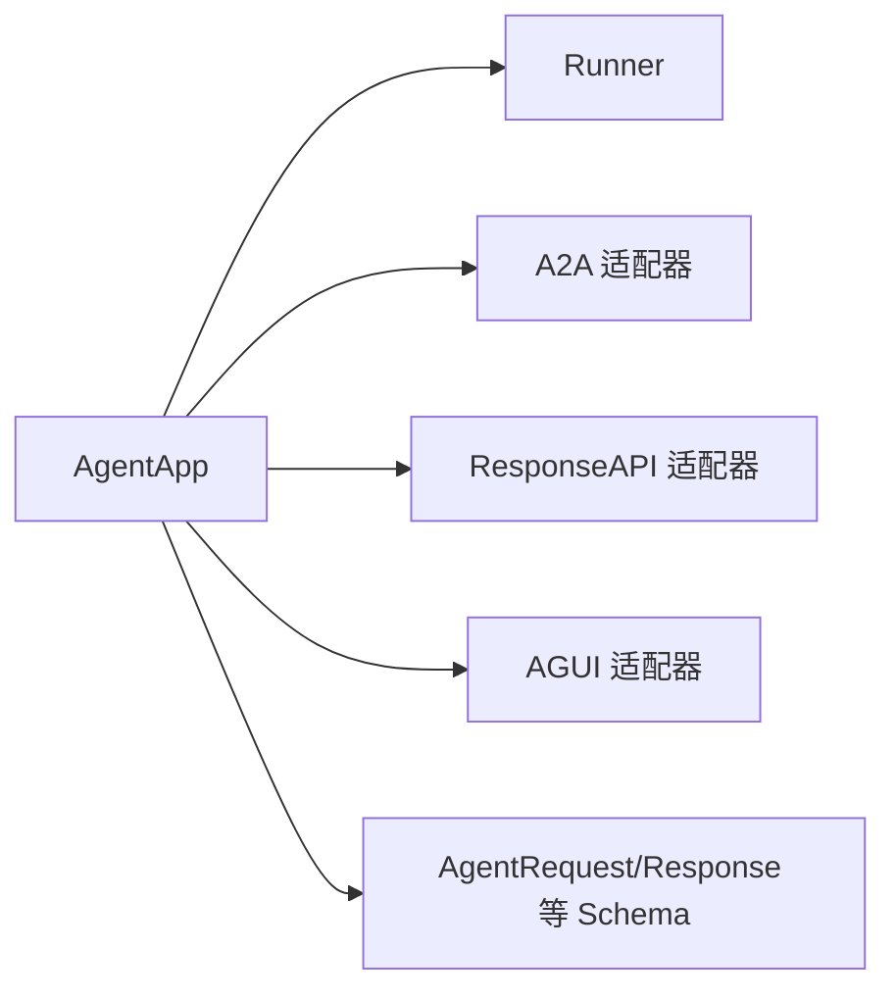

# 核心API

<cite>
**本文引用的文件**   
- [agent_app.py](file://src/agentscope_runtime/engine/app/agent_app.py)
- [agent_schemas.py](file://src/agentscope_runtime/engine/schemas/agent_schemas.py)
- [response_api.py](file://src/agentscope_runtime/engine/schemas/response_api.py)
</cite>

## 目录
1. [简介](#简介)
2. [项目结构](#项目结构)
3. [核心组件](#核心组件)
4. [架构总览](#架构总览)
5. [详细组件分析](#详细组件分析)
6. [依赖分析](#依赖分析)
7. [性能考虑](#性能考虑)
8. [故障排查指南](#故障排查指南)
9. [结论](#结论)
10. [附录](#附录)

## 简介
本文件面向AgentScope Runtime的核心API，聚焦于AgentApp的HTTP接口规范与实现细节。内容覆盖智能体启动、停止、查询与管理的RESTful API，包括：
- 接口的URL路径、HTTP方法、请求参数、响应格式与错误码
- 请求/响应示例（成功与失败）
- 会话管理与状态跟踪机制
- 认证与授权要求
- 版本控制策略与向后兼容性保障

AgentApp基于FastAPI构建，支持多协议适配（如A2A、ResponseAPI、AGUI），并内置流式SSE输出、任务队列与中断管理能力。

## 项目结构
AgentApp位于引擎应用层，负责：
- 注册根端点与健康检查端点
- 动态注册推理主端点（默认“/process”）
- 提供流式SSE输出与可选的后台任务端点（当启用流式任务时）
- 集成协议适配器以扩展API形态
- 生命周期管理（启动前/关闭后钩子、运行时配置更新）

图表来源
- [agent_app.py:60-220](file://src/agentscope_runtime/engine/app/agent_app.py#L60-L220)
- [agent_app.py:340-357](file://src/agentscope_runtime/engine/app/agent_app.py#L340-L357)

章节来源
- [agent_app.py:60-220](file://src/agentscope_runtime/engine/app/agent_app.py#L60-L220)
- [agent_app.py:340-357](file://src/agentscope_runtime/engine/app/agent_app.py#L340-L357)

## 核心组件
- AgentApp：继承FastAPI，集成统一路由与中断能力；在生命周期内绑定Runner并注册端点；支持多协议适配器注入。
- Runner：封装query/stream_query逻辑，作为AgentApp的执行后端。
- 协议适配器：将AgentApp暴露的通用接口映射到不同协议形态（A2A、ResponseAPI、AGUI）。
- 模型Schema：AgentRequest/AgentResponse等，定义请求与响应的数据结构与示例。

章节来源
- [agent_app.py:60-220](file://src/agentscope_runtime/engine/app/agent_app.py#L60-L220)
- [agent_app.py:781-845](file://src/agentscope_runtime/engine/app/agent_app.py#L781-L845)
- [agent_schemas.py:751-865](file://src/agentscope_runtime/engine/schemas/agent_schemas.py#L751-L865)
- [response_api.py:35-66](file://src/agentscope_runtime/engine/schemas/response_api.py#L35-L66)

## 架构总览
AgentApp通过统一路由与中断混入，将Runner的推理能力以HTTP形式对外暴露。根据配置，可启用SSE流式输出、后台任务队列与分布式中断服务。

图表来源
- [agent_app.py:781-845](file://src/agentscope_runtime/engine/app/agent_app.py#L781-L845)
- [agent_app.py:643-703](file://src/agentscope_runtime/engine/app/agent_app.py#L643-L703)

## 详细组件分析

### 1) 根与健康检查端点
- 路径与方法
  - GET “/”
  - GET “/health”
- 行为
  - “/”返回服务信息与可用端点列表（含process/stream/task等）
  - “/health”返回健康状态与运行模式
- 响应字段
  - 通用字段：服务名、运行模式、端点清单
  - 健康检查字段：状态、runner就绪状态
- 示例
  - 成功示例：返回包含“service”“mode”“endpoints”的对象
  - 失败示例：当runner未初始化时，健康检查中runner字段为“not_ready”

章节来源
- [agent_app.py:402-422](file://src/agentscope_runtime/engine/app/agent_app.py#L402-L422)
- [agent_app.py:385-400](file://src/agentscope_runtime/engine/app/agent_app.py#L385-L400)

### 2) 推理主端点（POST /process）
- 路径与方法
  - POST “/process”
- 请求体
  - JSON：AgentRequest（见下节Schema）
  - 必填：input（消息数组）
  - 可选：stream、model、top_p、temperature、tools、session_id、user_id等
- 响应
  - 默认：SSE流（text/event-stream），逐条发送事件片段
  - 若禁用流式，则返回完整JSON响应
- 错误码
  - 400：请求体不符合AgentRequest模型
  - 500：内部异常（如Runner未初始化）
- 示例
  - 成功示例：SSE流中逐条返回事件，最后一条为完成标记
  - 失败示例：请求体缺失必填字段或Runner异常

图表来源
- [agent_app.py:781-845](file://src/agentscope_runtime/engine/app/agent_app.py#L781-L845)
- [agent_app.py:643-703](file://src/agentscope_runtime/engine/app/agent_app.py#L643-L703)

章节来源
- [agent_app.py:781-845](file://src/agentscope_runtime/engine/app/agent_app.py#L781-L845)
- [agent_app.py:643-703](file://src/agentscope_runtime/engine/app/agent_app.py#L643-L703)

### 3) 流式任务端点（POST/GET /process/task）
- 启用条件
  - 需开启enable_stream_task
- 路径与方法
  - POST “/process/task”：提交流式查询为后台任务
  - GET “/process/task/{task_id}”：查询任务状态与结果
- 请求体（POST）
  - JSON：AgentRequest（用于触发流式查询）
- 响应（POST）
  - 返回task_id、status、queue、message
- 响应（GET）
  - 返回任务状态与最终结果（仅存储最终响应，不包含中间事件）
- 错误码
  - 404：task_id不存在
  - 500：任务执行异常
- 示例
  - 成功示例：POST返回task_id；GET轮询返回completed及最终响应
  - 失败示例：任务超时或异常导致failed

图表来源
- [agent_app.py:517-596](file://src/agentscope_runtime/engine/app/agent_app.py#L517-L596)

章节来源
- [agent_app.py:517-596](file://src/agentscope_runtime/engine/app/agent_app.py#L517-L596)

### 4) 进程管理端点（管理员）
- 路径与方法
  - POST “/shutdown”：简单优雅关停（立即触发SIGTERM）
  - POST “/admin/shutdown”：管理员优雅关停（延时触发SIGTERM）
  - GET “/admin/status”：进程状态信息（PID、状态、内存、CPU、启动时间）
- 响应
  - shutdown：返回“shutting down”或“Shutdown initiated”
  - status：返回进程指标
- 示例
  - 成功示例：返回状态提示
  - 失败示例：权限不足或系统信号发送失败

章节来源
- [agent_app.py:601-641](file://src/agentscope_runtime/engine/app/agent_app.py#L601-L641)

### 5) 会话管理与状态跟踪
- 会话标识
  - session_id：对话会话唯一标识
  - user_id：用户唯一标识
- 状态跟踪
  - 事件序列号：SequenceNumberGenerator为事件分配顺序编号
  - 事件状态：Event.status支持created/in_progress/completed/failed/canceled/rejected等
- 中断与恢复
  - 支持本地或Redis分布式中断后端，结合run_and_stream实现会话级中断
- 示例
  - 成功示例：事件按序到达，最后一条completed
  - 失败示例：事件携带error并标记failed

章节来源
- [agent_schemas.py:918-958](file://src/agentscope_runtime/engine/schemas/agent_schemas.py#L918-L958)
- [agent_app.py:679-688](file://src/agentscope_runtime/engine/app/agent_app.py#L679-L688)

### 6) 认证与授权
- 当前实现
  - 未内置认证/授权中间件
  - CORS已启用（允许所有来源/方法/头）
- 建议
  - 在生产环境添加鉴权中间件或网关
  - 限制CORS范围以提升安全性

章节来源
- [agent_app.py:359-380](file://src/agentscope_runtime/engine/app/agent_app.py#L359-L380)

### 7) 版本控制与向后兼容
- 版本字段
  - FastAPI应用version字段来自版本模块
- 兼容性
  - ResponseAPI模型对OpenAI客户端版本差异做了向后兼容处理
- 建议
  - 使用API版本化路径（如/v1）以保障重大变更时的兼容

章节来源
- [agent_app.py:154-160](file://src/agentscope_runtime/engine/app/agent_app.py#L154-L160)
- [response_api.py:16-23](file://src/agentscope_runtime/engine/schemas/response_api.py#L16-L23)

## 依赖分析
AgentApp与Runner、协议适配器、Schema之间存在清晰的依赖关系：
- AgentApp依赖Runner进行推理执行
- AgentApp通过协议适配器扩展API形态
- AgentRequest/AgentResponse等Schema定义了请求/响应契约

图表来源
- [agent_app.py:340-357](file://src/agentscope_runtime/engine/app/agent_app.py#L340-L357)
- [agent_app.py:781-845](file://src/agentscope_runtime/engine/app/agent_app.py#L781-L845)
- [agent_schemas.py:751-865](file://src/agentscope_runtime/engine/schemas/agent_schemas.py#L751-L865)

章节来源
- [agent_app.py:340-357](file://src/agentscope_runtime/engine/app/agent_app.py#L340-L357)
- [agent_app.py:781-845](file://src/agentscope_runtime/engine/app/agent_app.py#L781-L845)
- [agent_schemas.py:751-865](file://src/agentscope_runtime/engine/schemas/agent_schemas.py#L751-L865)

## 性能考虑
- 流式输出
  - SSE适合长连接与实时反馈；注意客户端缓冲与网络稳定性
- 任务队列
  - 后台任务仅保存最终响应，降低存储开销；建议合理设置超时与清理周期
- 中断与并发
  - 分布式中断后端可提升多节点一致性；本地后端适合单机场景
- 资源监控
  - 管理端点/admin/status可用于观察内存/CPU占用

## 故障排查指南
- 常见问题
  - Runner未初始化：健康检查返回runner:not_ready；推理端点返回错误
  - 请求体不符合Schema：400错误，检查AgentRequest字段
  - 任务不存在：GET /process/task/{task_id}返回404
  - 中断异常：检查中断后端配置（本地/Redis）
- 建议
  - 开启访问日志与异常捕获
  - 对外暴露最小权限端点，敏感端点置于受控网络

章节来源
- [agent_app.py:385-400](file://src/agentscope_runtime/engine/app/agent_app.py#L385-L400)
- [agent_app.py:592-596](file://src/agentscope_runtime/engine/app/agent_app.py#L592-L596)
- [agent_app.py:679-688](file://src/agentscope_runtime/engine/app/agent_app.py#L679-L688)

## 结论
AgentApp提供了简洁而强大的HTTP接口，支持SSE流式输出、后台任务与多协议适配。通过明确的Schema与事件状态模型，实现了可靠的会话管理与状态跟踪。建议在生产环境中补充鉴权与CORS限制，并采用版本化路径以确保长期兼容性。

## 附录

### A. 请求/响应Schema要点
- AgentRequest
  - 必填：input（消息数组）
  - 可选：stream、model、top_p、temperature、tools、session_id、user_id等
- AgentResponse
  - 输出：output（消息数组）、usage、完成时间等
- ResponseAPI
  - 对齐OpenAI响应风格的关键字段（如stream、model、temperature、tools等）

章节来源
- [agent_schemas.py:751-865](file://src/agentscope_runtime/engine/schemas/agent_schemas.py#L751-L865)
- [response_api.py:35-66](file://src/agentscope_runtime/engine/schemas/response_api.py#L35-L66)