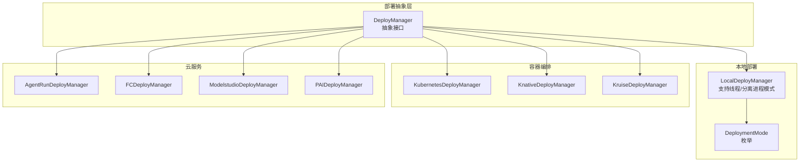
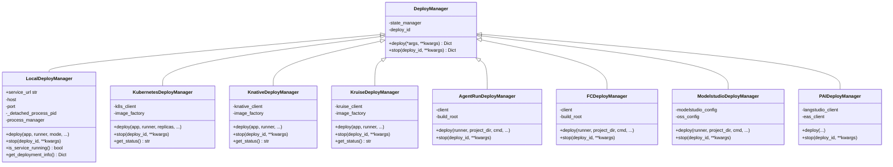
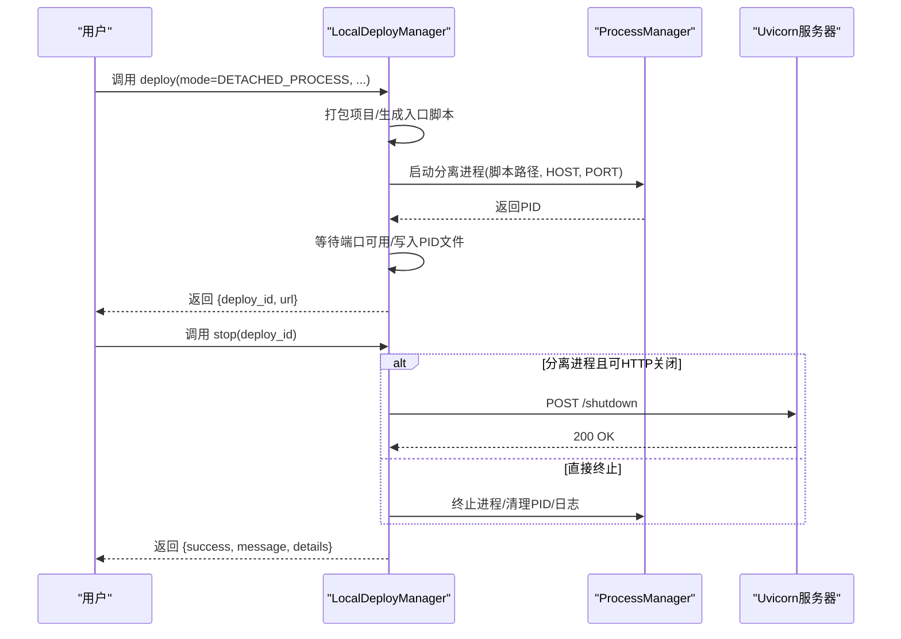
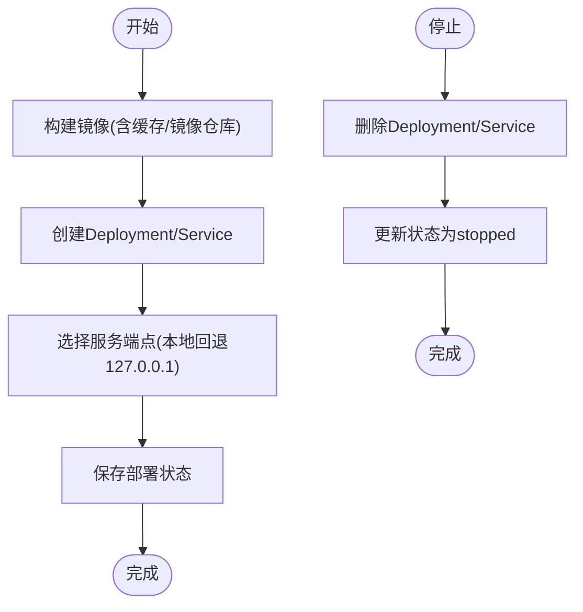
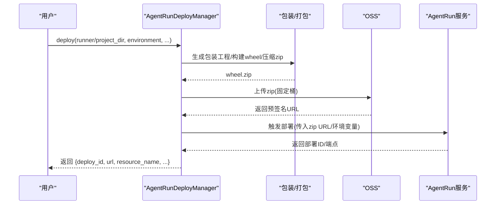
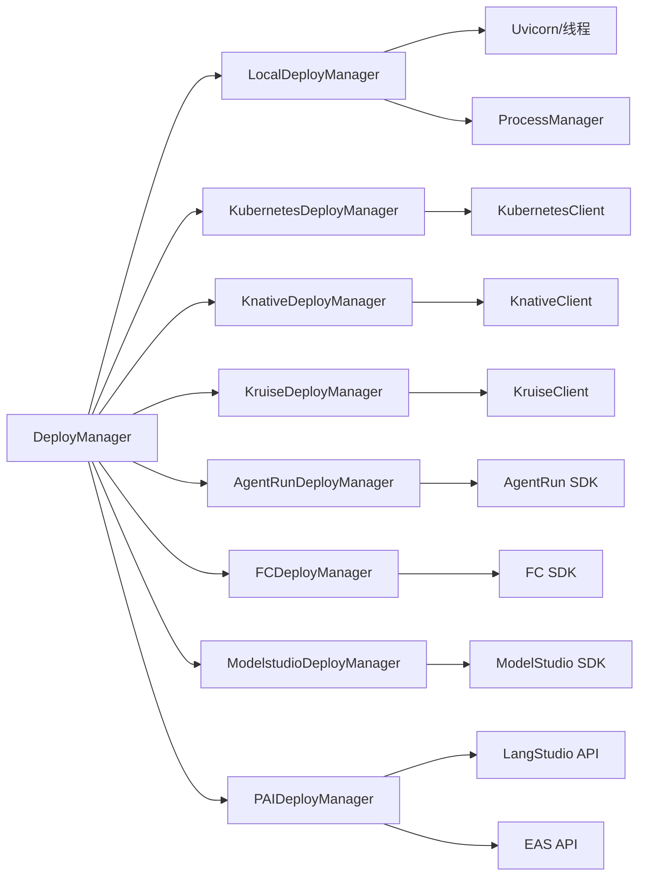

# 部署API

<cite>
**本文引用的文件**
- [base.py](file://src/agentscope_runtime/engine/deployers/base.py)
- [local_deployer.py](file://src/agentscope_runtime/engine/deployers/local_deployer.py)
- [kubernetes_deployer.py](file://src/agentscope_runtime/engine/deployers/kubernetes_deployer.py)
- [agentrun_deployer.py](file://src/agentscope_runtime/engine/deployers/agentrun_deployer.py)
- [fc_deployer.py](file://src/agentscope_runtime/engine/deployers/fc_deployer.py)
- [knative_deployer.py](file://src/agentscope_runtime/engine/deployers/knative_deployer.py)
- [kruise_deployer.py](file://src/agentscope_runtime/engine/deployers/kruise_deployer.py)
- [modelstudio_deployer.py](file://src/agentscope_runtime/engine/deployers/modelstudio_deployer.py)
- [pai_deployer.py](file://src/agentscope_runtime/engine/deployers/pai_deployer.py)
- [deployment_modes.py](file://src/agentscope_runtime/engine/deployers/utils/deployment_modes.py)
- [agentrun_deploy_config.yaml](file://examples/deployments/agentrun_deploy_config.yaml)
- [local_deploy_config.yaml](file://examples/deployments/local_deploy_config.yaml)
- [modelstudio_deploy_config.yaml](file://examples/deployments/modelstudio_deploy_config.yaml)
- [pai_deploy_config.yaml](file://examples/deployments/pai_deploy_config.yaml)
</cite>

## 目录
1. [简介](#简介)
2. [项目结构](#项目结构)
3. [核心组件](#核心组件)
4. [架构总览](#架构总览)
5. [详细组件分析](#详细组件分析)
6. [依赖关系分析](#依赖关系分析)
7. [性能考虑](#性能考虑)
8. [故障排查指南](#故障排查指南)
9. [结论](#结论)
10. [附录](#附录)

## 简介
本文件面向AgentScope Runtime的部署API，系统性梳理了本地部署、Kubernetes部署、AgentRun部署、函数计算（FC）部署、Knative部署、Kruise部署、ModelStudio部署以及PAI部署等多模式部署能力。内容涵盖：
- 各部署模式的API接口定义与调用流程
- 部署配置参数、环境变量与依赖要求
- 部署状态查询与监控接口
- 回滚与更新操作的API
- 失败诊断与恢复机制
- 多环境部署最佳实践

## 项目结构
AgentScope Runtime的部署体系以统一的抽象基类为核心，围绕不同平台提供专用部署器实现，并通过通用工具模块完成镜像构建、打包、资源管理与状态持久化。

图表来源
- [base.py:9-44](file://src/agentscope_runtime/engine/deployers/base.py#L9-L44)
- [local_deployer.py:27-645](file://src/agentscope_runtime/engine/deployers/local_deployer.py#L27-L645)
- [deployment_modes.py:7-15](file://src/agentscope_runtime/engine/deployers/utils/deployment_modes.py#L7-L15)
- [kubernetes_deployer.py:48-391](file://src/agentscope_runtime/engine/deployers/kubernetes_deployer.py#L48-L391)
- [knative_deployer.py:43-291](file://src/agentscope_runtime/engine/deployers/knative_deployer.py#L43-L291)
- [kruise_deployer.py:37-434](file://src/agentscope_runtime/engine/deployers/kruise_deployer.py#L37-L434)
- [agentrun_deployer.py:264-800](file://src/agentscope_runtime/engine/deployers/agentrun_deployer.py#L264-L800)
- [fc_deployer.py:246-1507](file://src/agentscope_runtime/engine/deployers/fc_deployer.py#L246-L1507)
- [modelstudio_deployer.py:544-947](file://src/agentscope_runtime/engine/deployers/modelstudio_deployer.py#L544-L947)
- [pai_deployer.py:246-2336](file://src/agentscope_runtime/engine/deployers/pai_deployer.py#L246-L2336)

章节来源
- [base.py:9-44](file://src/agentscope_runtime/engine/deployers/base.py#L9-L44)
- [local_deployer.py:27-645](file://src/agentscope_runtime/engine/deployers/local_deployer.py#L27-L645)
- [kubernetes_deployer.py:48-391](file://src/agentscope_runtime/engine/deployers/kubernetes_deployer.py#L48-L391)
- [agentrun_deployer.py:264-800](file://src/agentscope_runtime/engine/deployers/agentrun_deployer.py#L264-L800)
- [fc_deployer.py:246-1507](file://src/agentscope_runtime/engine/deployers/fc_deployer.py#L246-L1507)
- [knative_deployer.py:43-291](file://src/agentscope_runtime/engine/deployers/knative_deployer.py#L43-L291)
- [kruise_deployer.py:37-434](file://src/agentscope_runtime/engine/deployers/kruise_deployer.py#L37-L434)
- [modelstudio_deployer.py:544-947](file://src/agentscope_runtime/engine/deployers/modelstudio_deployer.py#L544-L947)
- [pai_deployer.py:246-2336](file://src/agentscope_runtime/engine/deployers/pai_deployer.py#L246-L2336)

## 核心组件
- 抽象基类 DeployManager：定义统一的部署接口（deploy/stop），并内置部署状态管理器。
- 本地部署 LocalDeployManager：支持“守护线程”和“分离进程”两种模式；可选择嵌入Celery Worker。
- 容器编排部署器：Kubernetes/Knative/Kruise，负责镜像构建、资源创建与端点生成。
- 云服务部署器：AgentRun、函数计算（FC）、ModelStudio、PAI，封装SDK调用与制品上传流程。
- 部署模式枚举 DeploymentMode：统一本地部署模式标识。

章节来源
- [base.py:9-44](file://src/agentscope_runtime/engine/deployers/base.py#L9-L44)
- [local_deployer.py:27-645](file://src/agentscope_runtime/engine/deployers/local_deployer.py#L27-L645)
- [deployment_modes.py:7-15](file://src/agentscope_runtime/engine/deployers/utils/deployment_modes.py#L7-L15)
- [kubernetes_deployer.py:48-391](file://src/agentscope_runtime/engine/deployers/kubernetes_deployer.py#L48-L391)
- [knative_deployer.py:43-291](file://src/agentscope_runtime/engine/deployers/knative_deployer.py#L43-L291)
- [kruise_deployer.py:37-434](file://src/agentscope_runtime/engine/deployers/kruise_deployer.py#L37-L434)
- [agentrun_deployer.py:264-800](file://src/agentscope_runtime/engine/deployers/agentrun_deployer.py#L264-L800)
- [fc_deployer.py:246-1507](file://src/agentscope_runtime/engine/deployers/fc_deployer.py#L246-L1507)
- [modelstudio_deployer.py:544-947](file://src/agentscope_runtime/engine/deployers/modelstudio_deployer.py#L544-L947)
- [pai_deployer.py:246-2336](file://src/agentscope_runtime/engine/deployers/pai_deployer.py#L246-L2336)

## 架构总览
下图展示统一部署抽象与各平台实现的关系，以及本地部署的两种模式选择。

图表来源
- [base.py:9-44](file://src/agentscope_runtime/engine/deployers/base.py#L9-L44)
- [local_deployer.py:27-645](file://src/agentscope_runtime/engine/deployers/local_deployer.py#L27-L645)
- [kubernetes_deployer.py:48-391](file://src/agentscope_runtime/engine/deployers/kubernetes_deployer.py#L48-L391)
- [knative_deployer.py:43-291](file://src/agentscope_runtime/engine/deployers/knative_deployer.py#L43-L291)
- [kruise_deployer.py:37-434](file://src/agentscope_runtime/engine/deployers/kruise_deployer.py#L37-L434)
- [agentrun_deployer.py:264-800](file://src/agentscope_runtime/engine/deployers/agentrun_deployer.py#L264-L800)
- [fc_deployer.py:246-1507](file://src/agentscope_runtime/engine/deployers/fc_deployer.py#L246-L1507)
- [modelstudio_deployer.py:544-947](file://src/agentscope_runtime/engine/deployers/modelstudio_deployer.py#L544-L947)
- [pai_deployer.py:246-2336](file://src/agentscope_runtime/engine/deployers/pai_deployer.py#L246-L2336)

## 详细组件分析

### 本地部署（LocalDeployManager）
- 支持模式
  - 守护线程模式（DAEMON_THREAD）：在当前进程中启动Uvicorn服务器线程，适合开发调试。
  - 分离进程模式（DETACHED_PROCESS）：打包项目后以独立进程运行，支持PID文件与日志清理。
- 关键参数
  - host/port：绑定地址与端口
  - mode：DeploymentMode（守护线程/分离进程/独立模板）
  - endpoint_path/request_model/response_type/stream：API路径、请求模型、响应类型（JSON/SSE/文本）、是否流式
  - protocol_adapters/broker_url/backend_url：协议适配器与消息队列配置
  - enable_embedded_worker：是否内嵌Celery Worker
  - project_dir/entrypoint：分离进程模式下的项目目录与入口
- 返回值
  - deploy_id：部署唯一标识
  - url：服务访问地址
- 停止流程
  - 分离进程模式：优先发送/stop端点关闭信号，失败则直接终止进程
  - 守护线程模式：停止Uvicorn线程并清理资源

图表来源
- [local_deployer.py:68-510](file://src/agentscope_runtime/engine/deployers/local_deployer.py#L68-L510)

章节来源
- [local_deployer.py:27-645](file://src/agentscope_runtime/engine/deployers/local_deployer.py#L27-L645)
- [deployment_modes.py:7-15](file://src/agentscope_runtime/engine/deployers/utils/deployment_modes.py#L7-L15)

### Kubernetes部署（KubernetesDeployManager）
- 关键参数
  - k8s_namespace/kubeconfig_path：命名空间与kubeconfig
  - replicas/port：副本数与容器端口
  - base_image/requirements/extra_packages：基础镜像与依赖
  - environment/runtime_config/mount_dir：环境变量、运行时配置与挂载目录
  - image_name/image_tag/push_to_registry/use_cache/pypi_mirror：镜像命名、推送、缓存与镜像源
- 流程
  - 构建镜像（含缓存与镜像仓库）
  - 创建Deployment与Service，自动选择端点（本地集群回退到127.0.0.1）
  - 持久化部署状态
- 停止与状态
  - 删除Deployment与Service
  - 通过状态管理器查询状态或客户端查询K8s资源状态

图表来源
- [kubernetes_deployer.py:126-311](file://src/agentscope_runtime/engine/deployers/kubernetes_deployer.py#L126-L311)

章节来源
- [kubernetes_deployer.py:48-391](file://src/agentscope_runtime/engine/deployers/kubernetes_deployer.py#L48-L391)

### Knative部署（KnativeDeployManager）
- 关键参数
  - annotations/labels：Kn Service注解与标签
  - 其他与K8s部署类似（镜像、端口、环境变量、卷挂载等）
- 流程
  - 构建镜像
  - 创建KService并返回URL
  - 停止时删除KService

章节来源
- [knative_deployer.py:71-221](file://src/agentscope_runtime/engine/deployers/knative_deployer.py#L71-L221)

### Kruise部署（KruiseDeployManager）
- 关键参数
  - annotations/labels：Sandbox自定义资源注解与标签
  - 通过Service暴露Sandbox
- 流程
  - 构建镜像
  - 创建Sandbox CR与Service
  - 自动选择端点（优先LB，否则使用Sandbox IP）

章节来源
- [kruise_deployer.py:138-347](file://src/agentscope_runtime/engine/deployers/kruise_deployer.py#L138-L347)

### AgentRun部署（AgentRunDeployManager）
- 关键参数
  - OSS配置：region/access_key_id/access_key_secret/bucket_name
  - AgentRun配置：region_id/log_config/network_config/cpu/memory/session_concurrency_limit/session_idle_timeout_seconds
  - 项目打包：生成包装工程、构建wheel、压缩为zip
  - 上传至OSS并触发AgentRun部署
- 环境变量
  - ALIBABA_CLOUD_ACCESS_KEY_ID/ALIBABA_CLOUD_ACCESS_KEY_SECRET
  - AGENT_RUN_REGION_ID/AGENT_RUN_LOG_STORE/AGENT_RUN_LOG_PROJECT/AGENT_RUN_NETWORK_MODE/AGENT_RUN_VPC_ID/AGENT_RUN_SECURITY_GROUP_ID/AGENT_RUN_VSWITCH_IDS
  - AGENT_RUN_CPU/AGENT_RUN_MEMORY/AGENT_RUN_SESSION_CONCURRENCY_LIMIT/AGENT_RUN_SESSION_IDLE_TIMEOUT_SECONDS
- 流程
  - 从Runner/项目打包生成wheel
  - Docker容器内安装依赖并打包zip
  - 上传至固定OSS桶，触发AgentRun部署
  - 保存部署状态并返回控制台URL

图表来源
- [agentrun_deployer.py:521-732](file://src/agentscope_runtime/engine/deployers/agentrun_deployer.py#L521-L732)

章节来源
- [agentrun_deployer.py:264-800](file://src/agentscope_runtime/engine/deployers/agentrun_deployer.py#L264-L800)
- [agentrun_deploy_config.yaml:1-28](file://examples/deployments/agentrun_deploy_config.yaml#L1-L28)

### 函数计算（FC）部署（FCDeployManager）
- 关键参数
  - FC配置：region_id/account_id/log_config/vpc_config/cpu/memory/disk/session_concurrency_limit/session_idle_timeout_seconds
  - OSS配置：region/access_key_id/access_key_secret/bucket_name
  - 项目打包：生成包装工程、构建wheel、压缩zip
  - 上传至OSS并创建/更新函数，配置HTTP触发器
- 环境变量
  - ALIBABA_CLOUD_ACCESS_KEY_ID/ALIBABA_CLOUD_ACCESS_KEY_SECRET/FC_ACCOUNT_ID
  - FC_REGION_ID/FC_LOG_STORE/FC_LOG_PROJECT/FC_VPC_ID/FC_SECURITY_GROUP_ID/FC_VSWITCH_IDS
  - FC_CPU/FC_MEMORY/FC_DISK/FC_SESSION_CONCURRENCY_LIMIT/FC_SESSION_IDLE_TIMEOUT_SECONDS

章节来源
- [fc_deployer.py:246-800](file://src/agentscope_runtime/engine/deployers/fc_deployer.py#L246-L800)
- [pai_deploy_config.yaml:1-111](file://examples/deployments/pai_deploy_config.yaml#L1-L111)

### ModelStudio部署（ModelstudioDeployManager）
- 关键参数
  - OSS配置：region/access_key_id/access_key_secret/security_token/bucket_prefix
  - ModelStudio配置：endpoint/workspace_id/access_key_id/access_key_secret/security_token/dashscope_api_key
  - 项目打包：生成包装工程、构建wheel、生成.env注入HOST/PORT
  - 申请临时存储租约、上传至OSS、触发全量代码部署
- 环境变量
  - ALIBABA_CLOUD_ACCESS_KEY_ID/ALIBABA_CLOUD_ACCESS_KEY_SECRET/ALIBABA_CLOUD_SECURITY_TOKEN
  - OSS_REGION/OSS_ACCESS_KEY_ID/OSS_ACCESS_KEY_SECRET/OSS_SESSION_TOKEN/OSS_BUCKET_NAME
  - MODELSTUDIO_ENDPOINT/MODELSTUDIO_WORKSPACE_ID/DASHSCOPE_API_KEY

章节来源
- [modelstudio_deployer.py:544-947](file://src/agentscope_runtime/engine/deployers/modelstudio_deployer.py#L544-L947)
- [modelstudio_deploy_config.yaml:1-22](file://examples/deployments/modelstudio_deploy_config.yaml#L1-L22)

### PAI部署（PAIDeployManager）
- 关键参数
  - context：workspace_id/region/storage（OSS工作目录）
  - spec：name/code（source_dir/entrypoint）/service_group_name/resources（instance_count/type/instance_type/resource_id/quota_id/cpu/memory）/vpc_config/identity/observability/storage/env/tags
  - 行为：wait/timeout/auto_approve
- 环境变量
  - PAI_WORKSPACE_ID/PAI_REGION/PAI_RAM_ROLE_ARN/PAI_OSS_BUCKET/PAI_OSS_PREFIX
- 流程
  - 通过LangStudio API创建/查询Flow与快照
  - 通过EAS API创建/查询部署，支持阶段动作与自动审批
  - 可选等待部署完成并设置超时

章节来源
- [pai_deployer.py:246-2336](file://src/agentscope_runtime/engine/deployers/pai_deployer.py#L246-L2336)
- [pai_deploy_config.yaml:1-111](file://examples/deployments/pai_deploy_config.yaml#L1-L111)

## 依赖关系分析
- 统一抽象：所有部署器均继承自DeployManager，保证接口一致性。
- 本地部署：依赖Uvicorn与进程管理工具，支持守护线程与分离进程两种模式。
- 容器编排：依赖Kubernetes/Knative/Kruise客户端，负责资源创建与端点选择。
- 云服务：依赖对应SDK（AgentRun/FC/ModelStudio/PAI），负责制品上传与服务编排。
- 工具模块：镜像工厂、打包器、网络工具、OSS工具等贯穿多平台部署流程。

图表来源
- [base.py:9-44](file://src/agentscope_runtime/engine/deployers/base.py#L9-L44)
- [local_deployer.py:27-645](file://src/agentscope_runtime/engine/deployers/local_deployer.py#L27-L645)
- [kubernetes_deployer.py:48-391](file://src/agentscope_runtime/engine/deployers/kubernetes_deployer.py#L48-L391)
- [knative_deployer.py:43-291](file://src/agentscope_runtime/engine/deployers/knative_deployer.py#L43-L291)
- [kruise_deployer.py:37-434](file://src/agentscope_runtime/engine/deployers/kruise_deployer.py#L37-L434)
- [agentrun_deployer.py:264-800](file://src/agentscope_runtime/engine/deployers/agentrun_deployer.py#L264-L800)
- [fc_deployer.py:246-1507](file://src/agentscope_runtime/engine/deployers/fc_deployer.py#L246-L1507)
- [modelstudio_deployer.py:544-947](file://src/agentscope_runtime/engine/deployers/modelstudio_deployer.py#L544-L947)
- [pai_deployer.py:246-2336](file://src/agentscope_runtime/engine/deployers/pai_deployer.py#L246-L2336)

## 性能考虑
- 本地部署
  - 分离进程模式适合生产环境，避免主线程阻塞；守护线程模式适合快速迭代。
  - 启停超时与端口探测可减少资源泄漏风险。
- 容器编排
  - 使用镜像缓存与Pypi镜像源提升构建效率；合理设置副本数与资源规格。
  - Knative/Kruise按需扩缩容，注意冷启动与会话亲和。
- 云服务
  - AgentRun/FC/ModelStudio/PAI均支持制品缓存与并行上传，建议启用镜像仓库加速与并行构建。
  - 设置合理的并发限制与空闲超时，避免资源浪费。

## 故障排查指南
- 本地部署
  - 分离进程无法启动：检查端口占用、进程PID文件与日志；确认环境变量HOST/PORT。
  - 守护线程无法优雅退出：检查线程join超时与资源清理。
- Kubernetes/Knative/Kruise
  - 服务端点不可达：本地集群回退到127.0.0.1；检查Service类型与外部IP。
  - 镜像拉取失败：确认镜像仓库凭证与网络策略。
- AgentRun/FC/ModelStudio/PAI
  - SDK未安装：根据提示安装对应SDK；检查AK/SK与工作区权限。
  - 上传失败：检查OSS桶权限与租约申请；确认网络连通性。
  - 部署状态异常：通过状态管理器或平台控制台查看详细日志。

章节来源
- [local_deployer.py:332-351](file://src/agentscope_runtime/engine/deployers/local_deployer.py#L332-L351)
- [kubernetes_deployer.py:73-120](file://src/agentscope_runtime/engine/deployers/kubernetes_deployer.py#L73-L120)
- [agentrun_deployer.py:394-411](file://src/agentscope_runtime/engine/deployers/agentrun_deployer.py#L394-L411)
- [modelstudio_deployer.py:397-410](file://src/agentscope_runtime/engine/deployers/modelstudio_deployer.py#L397-L410)
- [pai_deployer.py:34-54](file://src/agentscope_runtime/engine/deployers/pai_deployer.py#L34-L54)

## 结论
AgentScope Runtime提供了统一的部署抽象与多平台实现，覆盖本地开发、容器编排与主流云服务场景。通过标准化的配置参数、环境变量与状态管理，用户可在不同环境中一致地进行部署、监控、回滚与更新。建议结合业务需求选择合适的部署模式，并遵循最佳实践以确保稳定性与可维护性。

## 附录
- 配置示例
  - AgentRun：见 [agentrun_deploy_config.yaml:1-28](file://examples/deployments/agentrun_deploy_config.yaml#L1-L28)
  - 本地：见 [local_deploy_config.yaml:1-16](file://examples/deployments/local_deploy_config.yaml#L1-L16)
  - ModelStudio：见 [modelstudio_deploy_config.yaml:1-22](file://examples/deployments/modelstudio_deploy_config.yaml#L1-L22)
  - PAI：见 [pai_deploy_config.yaml:1-111](file://examples/deployments/pai_deploy_config.yaml#L1-L111)