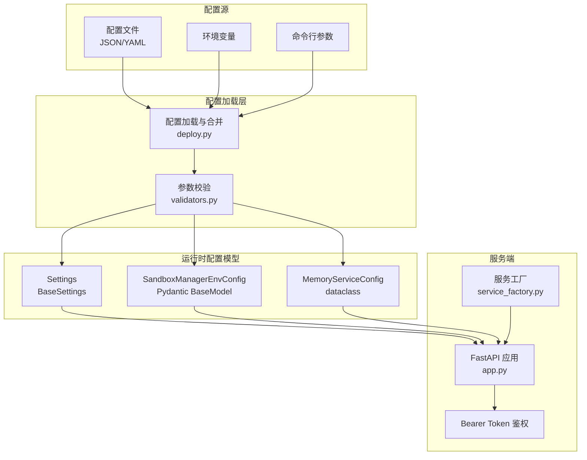
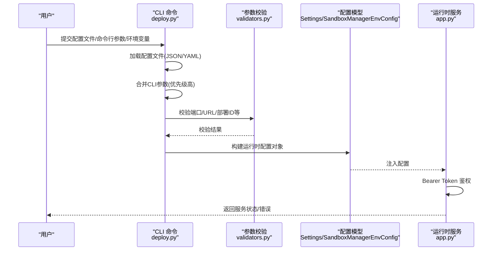
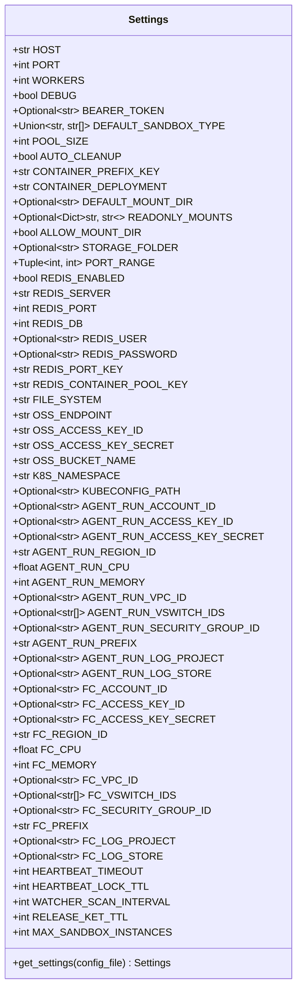
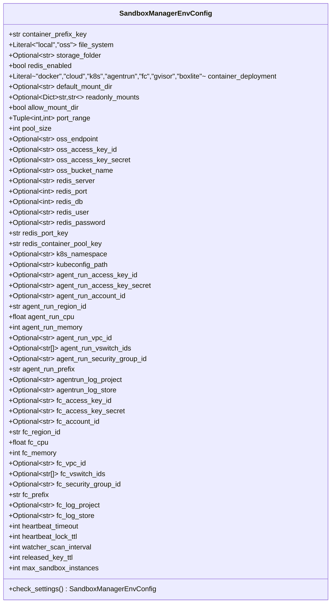
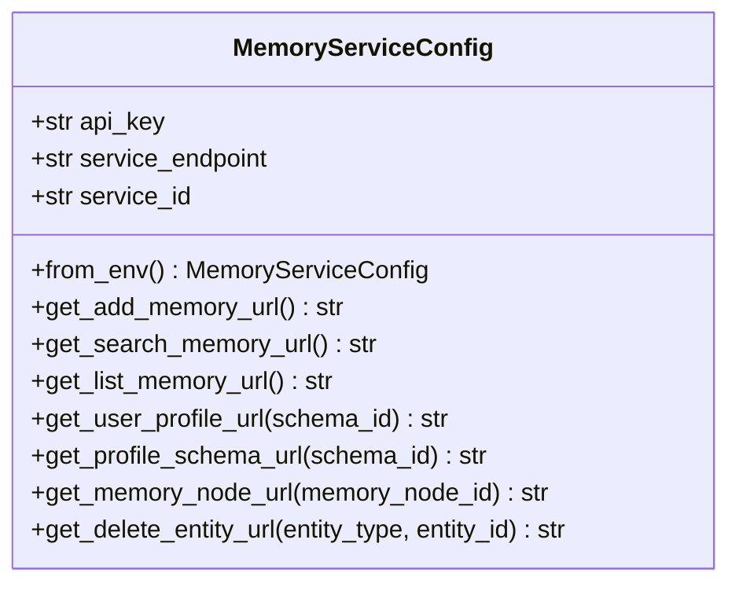
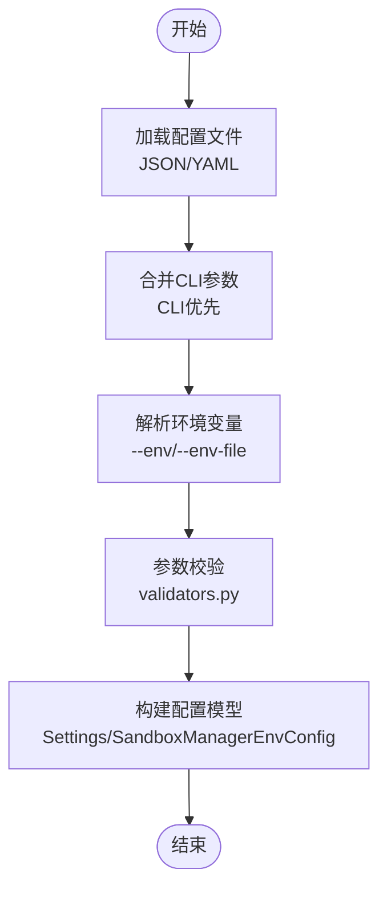
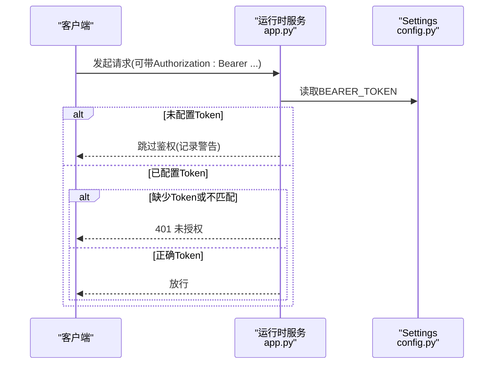
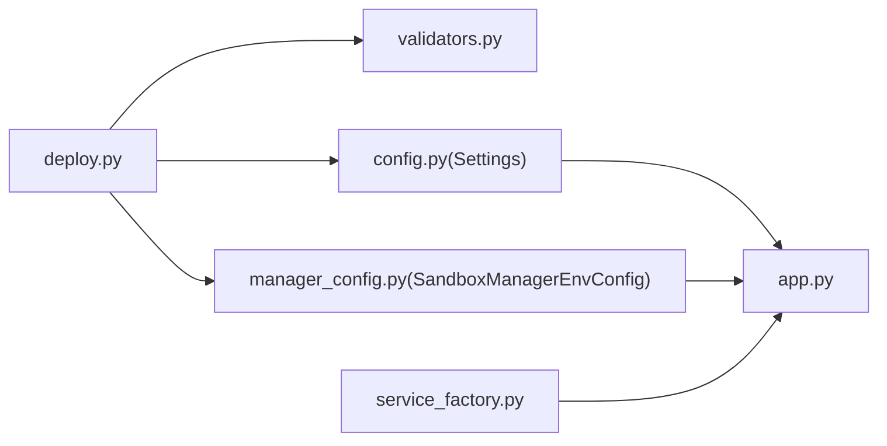

# 配置API

<cite>
**本文引用的文件**
- [config.py](file://src/agentscope_runtime/sandbox/manager/server/config.py)
- [manager_config.py](file://src/agentscope_runtime/sandbox/model/manager_config.py)
- [config.py](file://src/agentscope_runtime/tools/modelstudio_memory/config.py)
- [deploy.py](file://src/agentscope_runtime/cli/commands/deploy.py)
- [validators.py](file://src/agentscope_runtime/cli/utils/validators.py)
- [app.py](file://src/agentscope_runtime/sandbox/manager/server/app.py)
- [local_deploy_config.yaml](file://examples/deployments/local_deploy_config.yaml)
- [agentrun_deploy_config.yaml](file://examples/deployments/agentrun_deploy_config.yaml)
- [service_factory.py](file://src/agentscope_runtime/engine/services/service_factory.py)
- [agent_app.md](file://cookbook/zh/agent_app.md)
</cite>

## 目录
1. [简介](#简介)
2. [项目结构](#项目结构)
3. [核心组件](#核心组件)
4. [架构总览](#架构总览)
5. [详细组件分析](#详细组件分析)
6. [依赖关系分析](#依赖关系分析)
7. [性能考虑](#性能考虑)
8. [故障排查指南](#故障排查指南)
9. [结论](#结论)
10. [附录](#附录)

## 简介
本文件面向AgentScope Runtime的配置API，系统性梳理运行时配置管理能力，包括：
- 配置文件读取：支持JSON/YAML格式，以及环境变量加载
- 动态配置更新：通过运行时服务端点进行配置变更
- 配置验证：字段校验、范围约束、平台特定必填项
- 配置模板与示例：本地部署与AgentRun部署配置样例
- 配置继承与覆盖：文件配置与CLI参数的合并策略
- 配置通知与监听：基于令牌鉴权与后台扫描机制
- 配置安全与权限控制：Bearer Token鉴权
- 配置迁移与版本管理：通过字段校验与模型验证实现

## 项目结构
围绕配置API的关键目录与文件如下：
- 运行时服务端配置：sandbox/manager/server/config.py
- 管理器环境配置模型：sandbox/model/manager_config.py
- 工具服务配置：tools/modelstudio_memory/config.py
- CLI部署命令与配置合并：cli/commands/deploy.py
- CLI参数校验工具：cli/utils/validators.py
- 运行时服务端鉴权与应用：sandbox/manager/server/app.py
- 配置示例：examples/deployments/*.yaml
- 服务工厂与环境变量注入：engine/services/service_factory.py
- AgentApp配置更新示例：cookbook/zh/agent_app.md

图表来源
- [deploy.py:151-211](file://src/agentscope_runtime/cli/commands/deploy.py#L151-L211)
- [validators.py:56-118](file://src/agentscope_runtime/cli/utils/validators.py#L56-L118)
- [config.py:11-162](file://src/agentscope_runtime/sandbox/manager/server/config.py#L11-L162)
- [manager_config.py:11-376](file://src/agentscope_runtime/sandbox/model/manager_config.py#L11-L376)
- [config.py:15-99](file://src/agentscope_runtime/tools/modelstudio_memory/config.py#L15-L99)
- [app.py:99-135](file://src/agentscope_runtime/sandbox/manager/server/app.py#L99-L135)
- [service_factory.py:13-47](file://src/agentscope_runtime/engine/services/service_factory.py#L13-L47)

章节来源
- [config.py:11-162](file://src/agentscope_runtime/sandbox/manager/server/config.py#L11-L162)
- [manager_config.py:11-376](file://src/agentscope_runtime/sandbox/model/manager_config.py#L11-L376)
- [config.py:15-99](file://src/agentscope_runtime/tools/modelstudio_memory/config.py#L15-L99)
- [deploy.py:151-211](file://src/agentscope_runtime/cli/commands/deploy.py#L151-L211)
- [validators.py:56-118](file://src/agentscope_runtime/cli/utils/validators.py#L56-L118)
- [app.py:99-135](file://src/agentscope_runtime/sandbox/manager/server/app.py#L99-L135)
- [service_factory.py:13-47](file://src/agentscope_runtime/engine/services/service_factory.py#L13-L47)

## 核心组件
- 运行时服务端配置模型（Settings）
  - 类型：BaseSettings（支持从.env/.env.example加载）
  - 关键字段：服务端口、工作进程数、调试开关、Bearer Token、沙箱类型、容器后端、挂载目录、只读挂载、存储路径、端口范围、Redis/OSS/K8s/AgentRun/FC等云平台配置、心跳与扫描间隔、最大实例数等
  - 字段校验：WORKERS在未启用Redis时强制为1；字符串列表字段支持多种输入格式解析
  - 默认值：按字段定义提供
  - 有效范围：如端口范围、超时时间、实例数等有明确上下界
- 管理器环境配置模型（SandboxManagerEnvConfig）
  - 类型：Pydantic BaseModel
  - 关键字段：文件系统类型（local/oss）、存储目录、Redis开关、容器部署后端、默认挂载目录、只读挂载映射、允许挂载目录、端口范围、池化大小、OSS/OSS密钥、Redis服务器/端口/库/认证、K8s命名空间与kubeconfig、AgentRun/FC资源配额与网络配置、心跳/锁TTL/扫描间隔/释放记录TTL、最大沙箱实例数
  - 字段校验：当file_system=oss时要求完整设置OSS字段；启用redis时要求完整设置Redis字段；容器后端为agentrun/FC时分别要求对应后端的必要字段
  - 默认值：按字段定义提供
  - 有效范围：数值字段gt/ge约束
- 工具服务配置（MemoryServiceConfig）
  - 类型：dataclass
  - 关键字段：API Key、服务端点、服务ID
  - 环境变量加载：from_env方法从环境变量构建配置
  - 默认端点：DashScope内存服务API
- CLI配置加载与合并
  - 支持JSON/YAML配置文件加载
  - CLI参数优先级高于配置文件
  - 环境变量可来自.env文件与--env/--env-file
- 运行时服务端鉴权
  - Bearer Token校验，未配置时跳过鉴权并告警

章节来源
- [config.py:11-162](file://src/agentscope_runtime/sandbox/manager/server/config.py#L11-L162)
- [manager_config.py:11-376](file://src/agentscope_runtime/sandbox/model/manager_config.py#L11-L376)
- [config.py:15-99](file://src/agentscope_runtime/tools/modelstudio_memory/config.py#L15-L99)
- [deploy.py:151-211](file://src/agentscope_runtime/cli/commands/deploy.py#L151-L211)
- [app.py:116-135](file://src/agentscope_runtime/sandbox/manager/server/app.py#L116-L135)

## 架构总览
下图展示配置从“配置源”到“运行时服务”的整体流程，包括加载、合并、校验与应用。

图表来源
- [deploy.py:151-211](file://src/agentscope_runtime/cli/commands/deploy.py#L151-L211)
- [validators.py:56-118](file://src/agentscope_runtime/cli/utils/validators.py#L56-L118)
- [config.py:11-162](file://src/agentscope_runtime/sandbox/manager/server/config.py#L11-L162)
- [manager_config.py:11-376](file://src/agentscope_runtime/sandbox/model/manager_config.py#L11-L376)
- [app.py:99-135](file://src/agentscope_runtime/sandbox/manager/server/app.py#L99-L135)

## 详细组件分析

### 组件A：运行时服务端配置模型（Settings）
- 数据结构
  - 基于pydantic-settings的BaseSettings，支持从.env/.env.example加载
  - 字段覆盖顺序：.env文件 > .env.example > 默认值
- 关键字段与默认值
  - 服务：HOST、PORT、WORKERS、DEBUG、BEARER_TOKEN
  - 沙箱：DEFAULT_SANDBOX_TYPE、POOL_SIZE、AUTO_CLEANUP、CONTAINER_PREFIX_KEY、CONTAINER_DEPLOYMENT、DEFAULT_MOUNT_DIR、READONLY_MOUNTS、ALLOW_MOUNT_DIR、STORAGE_FOLDER、PORT_RANGE
  - Redis：REDIS_ENABLED、REDIS_SERVER、REDIS_PORT、REDIS_DB、REDIS_USER、REDIS_PASSWORD、REDIS_PORT_KEY、REDIS_CONTAINER_POOL_KEY
  - OSS：FILE_SYSTEM、OSS_ENDPOINT、OSS_ACCESS_KEY_ID、OSS_ACCESS_KEY_SECRET、OSS_BUCKET_NAME
  - K8s：K8S_NAMESPACE、KUBECONFIG_PATH
  - AgentRun：AGENT_RUN_ACCOUNT_ID、AGENT_RUN_ACCESS_KEY_ID、AGENT_RUN_ACCESS_KEY_SECRET、AGENT_RUN_REGION_ID、AGENT_RUN_CPU、AGENT_RUN_MEMORY、AGENT_RUN_VPC_ID、AGENT_RUN_VSWITCH_IDS、AGENT_RUN_SECURITY_GROUP_ID、AGENT_RUN_PREFIX、AGENT_RUN_LOG_PROJECT、AGENT_RUN_LOG_STORE
  - FC：FC_ACCOUNT_ID、FC_ACCESS_KEY_ID、FC_ACCESS_KEY_SECRET、FC_REGION_ID、FC_CPU、FC_MEMORY、FC_VPC_ID、FC_VSWITCH_IDS、FC_SECURITY_GROUP_ID、FC_PREFIX、FC_LOG_PROJECT、FC_LOG_STORE
  - 心跳与扫描：HEARTBEAT_TIMEOUT、HEARTBEAT_LOCK_TTL、WATCHER_SCAN_INTERVAL、RELEASE_KET_TTL、MAX_SANDBOX_INSTANCES
- 字段校验
  - WORKERS在REDIS_ENABLED=false时强制为1
  - DEFAULT_SANDBOX_TYPE/FC_VSWITCH_IDS/AGENT_RUN_VSWITCH_IDS支持字符串列表解析
- 典型用途
  - 作为运行时服务端的全局配置入口，被FastAPI应用读取并应用

图表来源
- [config.py:11-162](file://src/agentscope_runtime/sandbox/manager/server/config.py#L11-L162)

章节来源
- [config.py:11-162](file://src/agentscope_runtime/sandbox/manager/server/config.py#L11-L162)

### 组件B：管理器环境配置模型（SandboxManagerEnvConfig）
- 数据结构
  - Pydantic BaseModel，提供强类型字段与校验
- 关键字段与默认值
  - 文件系统：file_system（local/oss），storage_folder，default_mount_dir
  - Redis：redis_enabled，redis_server/port/db/user/password
  - 容器部署：container_deployment（docker/cloud/k8s/agentrun/fc/gvisor/boxlite）
  - 挂载与端口：readonly_mounts、allow_mount_dir、port_range、pool_size
  - OSS：oss_endpoint/access_key_id/access_key_secret/bucket_name
  - K8s：k8s_namespace、kubeconfig_path
  - AgentRun：agent_run_*系列字段
  - FC：fc_*系列字段
  - 心跳与扫描：heartbeat_timeout、heartbeat_lock_ttl、watcher_scan_interval、released_key_ttl、max_sandbox_instances
- 字段校验
  - file_system=oss时要求完整OSS字段
  - redis_enabled=true时要求完整Redis字段
  - container_deployment=agentrun/FC时要求对应后端必要字段
- 典型用途
  - 作为沙箱管理器的配置模型，用于容器生命周期管理与资源分配

图表来源
- [manager_config.py:11-376](file://src/agentscope_runtime/sandbox/model/manager_config.py#L11-L376)

章节来源
- [manager_config.py:11-376](file://src/agentscope_runtime/sandbox/model/manager_config.py#L11-L376)

### 组件C：工具服务配置（MemoryServiceConfig）
- 数据结构
  - dataclass，提供from_env静态方法从环境变量加载
- 关键字段与默认值
  - api_key：必需
  - service_endpoint：默认DashScope内存服务端点
  - service_id：默认"memory_service"
- 典型用途
  - 为ModelStudio Memory服务提供统一配置入口

图表来源
- [config.py:15-99](file://src/agentscope_runtime/tools/modelstudio_memory/config.py#L15-L99)

章节来源
- [config.py:15-99](file://src/agentscope_runtime/tools/modelstudio_memory/config.py#L15-L99)

### 组件D：CLI配置加载与合并（deploy.py）
- 功能
  - 从JSON/YAML加载配置文件
  - 合并CLI参数（CLI优先）
  - 解析--env与--env-file，支持.env文件
- 典型流程
  - 读取配置文件 → 合并CLI参数 → 解析环境变量 → 校验参数 → 构建运行时配置

图表来源
- [deploy.py:151-211](file://src/agentscope_runtime/cli/commands/deploy.py#L151-L211)
- [validators.py:56-118](file://src/agentscope_runtime/cli/utils/validators.py#L56-L118)

章节来源
- [deploy.py:151-211](file://src/agentscope_runtime/cli/commands/deploy.py#L151-L211)
- [validators.py:56-118](file://src/agentscope_runtime/cli/utils/validators.py#L56-L118)

### 组件E：运行时服务端鉴权（app.py）
- 功能
  - Bearer Token鉴权，未配置时跳过并记录警告
- 典型流程
  - 读取Settings → 获取BEARER_TOKEN → 校验请求头 → 通过或拒绝

图表来源
- [app.py:116-135](file://src/agentscope_runtime/sandbox/manager/server/app.py#L116-L135)
- [config.py:147-162](file://src/agentscope_runtime/sandbox/manager/server/config.py#L147-L162)

章节来源
- [app.py:116-135](file://src/agentscope_runtime/sandbox/manager/server/app.py#L116-L135)
- [config.py:147-162](file://src/agentscope_runtime/sandbox/manager/server/config.py#L147-L162)

### 组件F：配置模板与示例
- 本地部署配置示例
  - host/port、entrypoint（可选）、environment（键值对）
- AgentRun部署配置示例
  - name、entrypoint（可选）、skip_upload、region、cpu/memory、environment（含云平台密钥）

章节来源
- [local_deploy_config.yaml:1-16](file://examples/deployments/local_deploy_config.yaml#L1-L16)
- [agentrun_deploy_config.yaml:1-28](file://examples/deployments/agentrun_deploy_config.yaml#L1-L28)

### 组件G：配置继承与覆盖机制
- 覆盖顺序（高到低）
  1) CLI参数（--env、--env-file、--config等）
  2) 配置文件（JSON/YAML）
  3) 环境变量（.env/.env.example）
  4) 默认值
- 特殊处理
  - 环境变量合并：先读.env/.env.example，再叠加--env/--env-file，最后CLI参数覆盖
  - 列表字段：支持字符串形式的列表解析

章节来源
- [deploy.py:151-211](file://src/agentscope_runtime/cli/commands/deploy.py#L151-L211)
- [config.py:147-162](file://src/agentscope_runtime/sandbox/manager/server/config.py#L147-L162)

### 组件H：配置验证API
- 端口校验：1-65535
- URL校验：必须以http://或https://开头
- 部署ID校验：必须非空且包含下划线
- 文件/目录存在性校验
- 配置模型校验：SandboxManagerEnvConfig在file_system=oss、redis_enabled、container_deployment等场景下的字段完整性检查

章节来源
- [validators.py:56-118](file://src/agentscope_runtime/cli/utils/validators.py#L56-L118)
- [manager_config.py:286-376](file://src/agentscope_runtime/sandbox/model/manager_config.py#L286-L376)

### 组件I：配置变更通知与监听API
- 监听机制
  - 心跳扫描间隔（watcher_scan_interval）：后台循环扫描心跳、补池、清理释放记录
  - 心跳超时（heartbeat_timeout）与分布式锁TTL（heartbeat_lock_ttl）
  - 释放记录TTL（released_key_ttl）
- 变更入口
  - AgentApp可通过路由接口实现配置更新（示例见cookbook）

章节来源
- [manager_config.py:251-284](file://src/agentscope_runtime/sandbox/model/manager_config.py#L251-L284)
- [agent_app.md:558-618](file://cookbook/zh/agent_app.md#L558-L618)

### 组件J：配置安全与权限控制API
- Bearer Token鉴权
  - 通过Authorization: Bearer进行鉴权
  - 未配置时跳过鉴权并记录警告
- 环境变量安全
  - 敏感信息建议通过--env-file或环境变量文件管理，避免硬编码在配置文件中

章节来源
- [app.py:116-135](file://src/agentscope_runtime/sandbox/manager/server/app.py#L116-L135)
- [deploy.py:241-298](file://src/agentscope_runtime/cli/commands/deploy.py#L241-L298)

### 组件K：配置迁移与版本管理API
- 字段校验与模型验证
  - 通过Pydantic模型的Field约束（如gt/ge）与model_validator实现版本兼容与迁移校验
  - 当file_system=oss或启用redis时强制字段完整性，避免旧配置导致的运行时错误
- 建议实践
  - 在升级版本时，优先通过新增字段与默认值保证向后兼容，同时在新版本中逐步收紧校验规则

章节来源
- [manager_config.py:286-376](file://src/agentscope_runtime/sandbox/model/manager_config.py#L286-L376)

## 依赖关系分析
- 配置加载依赖
  - deploy.py依赖validators.py进行参数校验
  - 运行时服务端app.py依赖config.py中的Settings
  - 管理器配置依赖manager_config.py中的SandboxManagerEnvConfig
- 服务工厂
  - service_factory.py支持从环境变量加载配置并注入服务实例，便于配置驱动的服务注册

图表来源
- [deploy.py:151-211](file://src/agentscope_runtime/cli/commands/deploy.py#L151-L211)
- [validators.py:56-118](file://src/agentscope_runtime/cli/utils/validators.py#L56-L118)
- [config.py:11-162](file://src/agentscope_runtime/sandbox/manager/server/config.py#L11-L162)
- [manager_config.py:11-376](file://src/agentscope_runtime/sandbox/model/manager_config.py#L11-L376)
- [app.py:99-135](file://src/agentscope_runtime/sandbox/manager/server/app.py#L99-L135)
- [service_factory.py:13-47](file://src/agentscope_runtime/engine/services/service_factory.py#L13-L47)

章节来源
- [deploy.py:151-211](file://src/agentscope_runtime/cli/commands/deploy.py#L151-L211)
- [validators.py:56-118](file://src/agentscope_runtime/cli/utils/validators.py#L56-L118)
- [config.py:11-162](file://src/agentscope_runtime/sandbox/manager/server/config.py#L11-L162)
- [manager_config.py:11-376](file://src/agentscope_runtime/sandbox/model/manager_config.py#L11-L376)
- [app.py:99-135](file://src/agentscope_runtime/sandbox/manager/server/app.py#L99-L135)
- [service_factory.py:13-47](file://src/agentscope_runtime/engine/services/service_factory.py#L13-L47)

## 性能考虑
- 心跳扫描间隔（watcher_scan_interval）影响后台任务频率，建议根据实例规模与资源占用合理设置
- 最大沙箱实例数（max_sandbox_instances）限制可防止资源耗尽
- 端口范围（PORT_RANGE）与池化大小（pool_size）需结合容器后端能力与宿主机资源规划

## 故障排查指南
- 配置文件格式错误
  - 现象：解析失败
  - 排查：确认文件扩展名与内容格式（JSON/YAML）
- 环境变量缺失
  - 现象：运行时报错或功能异常
  - 排查：检查.env/.env.example与--env/--env-file是否正确设置
- 参数校验失败
  - 现象：端口越界、URL非法、部署ID格式错误
  - 排查：参考validators.py中的校验规则
- 配置模型校验失败
  - 现象：file_system=oss或启用redis时缺少必要字段
  - 排查：补齐SandboxManagerEnvConfig中对应字段
- 鉴权失败
  - 现象：401未授权
  - 排查：确认BEARER_TOKEN配置与请求头一致

章节来源
- [deploy.py:151-211](file://src/agentscope_runtime/cli/commands/deploy.py#L151-L211)
- [validators.py:56-118](file://src/agentscope_runtime/cli/utils/validators.py#L56-L118)
- [manager_config.py:286-376](file://src/agentscope_runtime/sandbox/model/manager_config.py#L286-L376)
- [app.py:116-135](file://src/agentscope_runtime/sandbox/manager/server/app.py#L116-L135)

## 结论
AgentScope Runtime的配置API通过“配置文件+环境变量+CLI参数”的多源融合，配合严格的字段校验与模型验证，实现了灵活、安全、可维护的运行时配置管理。结合Bearer Token鉴权、心跳扫描与释放记录TTL等机制，可在生产环境中稳定运行。建议在实际部署中遵循“最小暴露面”原则，将敏感信息置于环境变量或.env文件中，并通过示例配置文件快速启动。

## 附录
- 配置模板与示例
  - 本地部署配置示例：[local_deploy_config.yaml:1-16](file://examples/deployments/local_deploy_config.yaml#L1-L16)
  - AgentRun部署配置示例：[agentrun_deploy_config.yaml:1-28](file://examples/deployments/agentrun_deploy_config.yaml#L1-L28)
- AgentApp配置更新示例
  - 见cookbook文档中的示例与说明：[agent_app.md:558-618](file://cookbook/zh/agent_app.md#L558-L618)