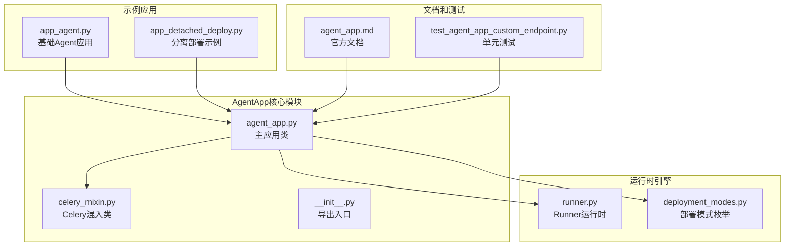
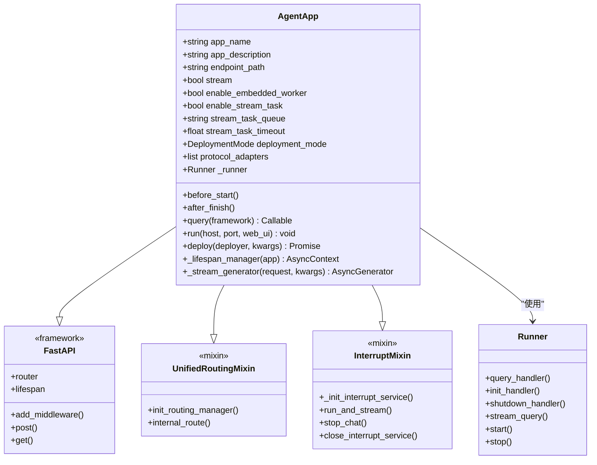
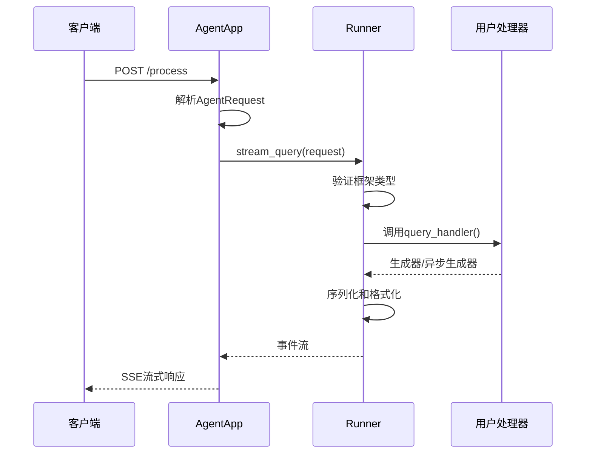
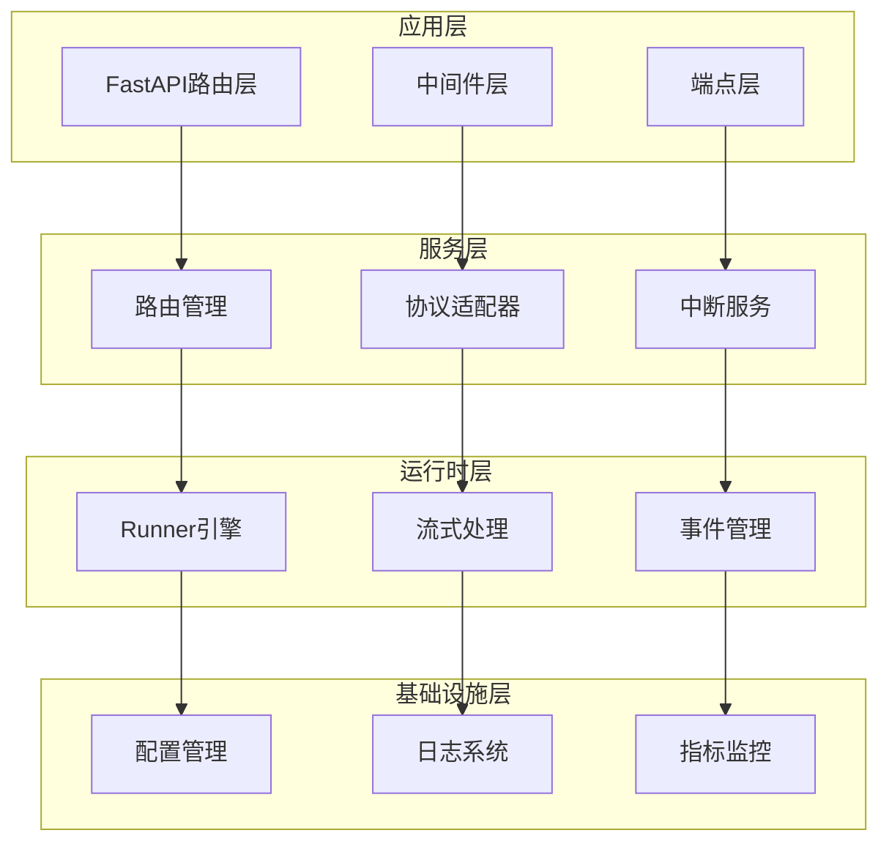
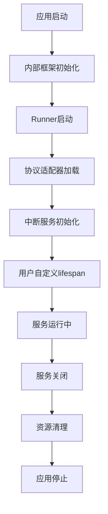
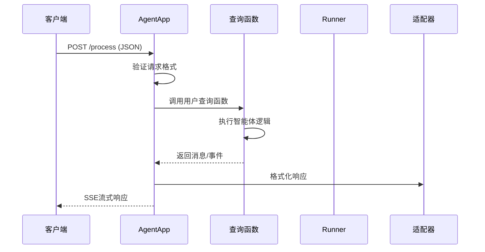
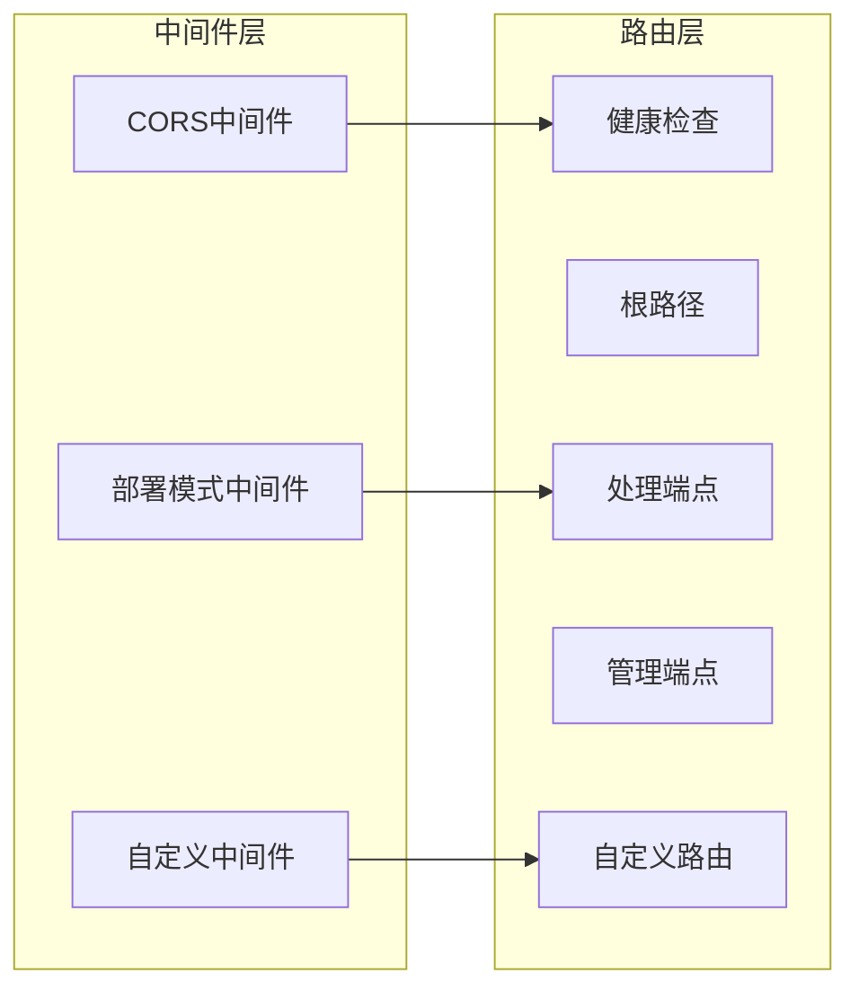
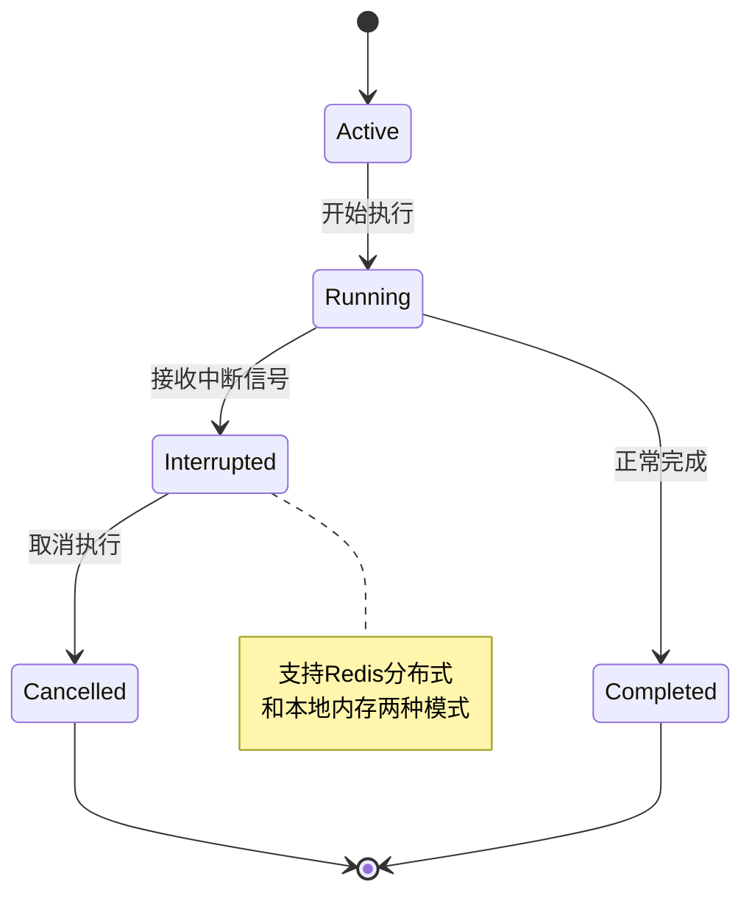
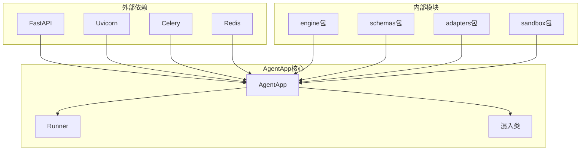
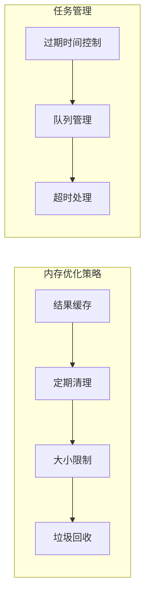

# AgentApp应用框架

<cite>
**本文档引用的文件**
- [agent_app.py](file://src/agentscope_runtime/engine/app/agent_app.py)
- [__init__.py](file://src/agentscope_runtime/engine/app/__init__.py)
- [celery_mixin.py](file://src/agentscope_runtime/engine/app/celery_mixin.py)
- [runner.py](file://src/agentscope_runtime/engine/runner.py)
- [deployment_modes.py](file://src/agentscope_runtime/engine/deployers/utils/deployment_modes.py)
- [agent_app.md](file://cookbook/zh/agent_app.md)
- [quickstart.md](file://cookbook/zh/quickstart.md)
- [app_agent.py](file://examples/deployments/detached_local_deploy/app_agent.py)
- [app_detached_deploy.py](file://examples/deployments/detached_local_deploy/app_detached_deploy.py)
- [test_agent_app_custom_endpoint.py](file://tests/unit/test_agent_app_custom_endpoint.py)
</cite>

## 目录
1. [简介](#简介)
2. [项目结构](#项目结构)
3. [核心组件](#核心组件)
4. [架构概览](#架构概览)
5. [详细组件分析](#详细组件分析)
6. [依赖关系分析](#依赖关系分析)
7. [性能考虑](#性能考虑)
8. [故障排除指南](#故障排除指南)
9. [结论](#结论)
10. [附录](#附录)

## 简介

AgentApp是AgentScope Runtime框架中的核心应用组件，它是一个基于FastAPI的智能体应用服务器，专门为AI智能体提供HTTP API服务。AgentApp继承自FastAPI，同时集成了Runner运行时引擎、协议适配器、任务中断管理等高级功能。

AgentApp的主要特点包括：
- **完全兼容FastAPI生态**：支持原生路由注册、中间件扩展及标准生命周期管理
- **流式响应（SSE）**：实现实时输出和流式数据传输
- **任务中断管理**：提供基于分布式后端的任务中断机制
- **多框架支持**：支持Agentscope、AutoGen、AGNO、LangGraph等多种智能体框架
- **灵活部署**：支持多种部署模式和环境配置

## 项目结构

AgentApp应用框架位于agentscope_runtime引擎的app模块中，主要包含以下核心文件：



**图表来源**
- [agent_app.py:1-943](file://src/agentscope_runtime/engine/app/agent_app.py#L1-L943)
- [runner.py:1-356](file://src/agentscope_runtime/engine/runner.py#L1-L356)
- [deployment_modes.py:1-15](file://src/agentscope_runtime/engine/deployers/utils/deployment_modes.py#L1-L15)

**章节来源**
- [agent_app.py:1-943](file://src/agentscope_runtime/engine/app/agent_app.py#L1-L943)
- [__init__.py:1-7](file://src/agentscope_runtime/engine/app/__init__.py#L1-L7)

## 核心组件

### AgentApp主类

AgentApp是整个框架的核心，继承自FastAPI并融合了多个混入类的功能：



**图表来源**
- [agent_app.py:60-943](file://src/agentscope_runtime/engine/app/agent_app.py#L60-L943)
- [runner.py:46-356](file://src/agentscope_runtime/engine/runner.py#L46-L356)

### Runner运行时引擎

Runner是AgentApp的核心执行引擎，负责智能体逻辑的执行和生命周期管理：



**图表来源**
- [runner.py:199-356](file://src/agentscope_runtime/engine/runner.py#L199-L356)
- [agent_app.py:798-846](file://src/agentscope_runtime/engine/app/agent_app.py#L798-L846)

**章节来源**
- [agent_app.py:60-943](file://src/agentscope_runtime/engine/app/agent_app.py#L60-L943)
- [runner.py:46-356](file://src/agentscope_runtime/engine/runner.py#L46-L356)

## 架构概览

AgentApp采用分层架构设计，从上到下分为应用层、服务层、运行时层和基础设施层：



**图表来源**
- [agent_app.py:124-221](file://src/agentscope_runtime/engine/app/agent_app.py#L124-L221)
- [runner.py:46-121](file://src/agentscope_runtime/engine/runner.py#L46-L121)

## 详细组件分析

### 生命周期管理

AgentApp采用FastAPI的lifespan机制进行生命周期管理，提供了统一的启动和关闭流程：



**图表来源**
- [agent_app.py:248-339](file://src/agentscope_runtime/engine/app/agent_app.py#L248-L339)

AgentApp支持两种生命周期管理模式：

1. **传统装饰器模式**（已废弃）
   - 使用`@app.init`和`@app.shutdown`装饰器
   - 适用于简单场景，但不推荐使用

2. **现代lifespan模式**（推荐）
   - 使用`@asynccontextmanager`装饰的lifespan函数
   - 更符合FastAPI标准，支持状态共享和资源管理

**章节来源**
- [agent_app.py:248-339](file://src/agentscope_runtime/engine/app/agent_app.py#L248-L339)
- [agent_app.md:183-240](file://cookbook/zh/agent_app.md#L183-L240)

### 查询处理函数

AgentApp通过`@app.query()`装饰器注册智能体查询处理函数：



**图表来源**
- [agent_app.py:722-740](file://src/agentscope_runtime/engine/app/agent_app.py#L722-L740)
- [runner.py:199-356](file://src/agentscope_runtime/engine/runner.py#L199-L356)

查询处理函数支持以下特性：
- **多框架支持**：Agentscope、AutoGen、AGNO、LangGraph
- **异步处理**：支持async/await语法
- **流式输出**：支持生成器和异步生成器
- **参数注入**：自动解析AgentRequest对象

**章节来源**
- [agent_app.py:722-740](file://src/agentscope_runtime/engine/app/agent_app.py#L722-L740)
- [runner.py:246-321](file://src/agentscope_runtime/engine/runner.py#L246-L321)

### 中间件和路由

AgentApp内置了多种中间件和路由管理功能：



**图表来源**
- [agent_app.py:359-425](file://src/agentscope_runtime/engine/app/agent_app.py#L359-L425)

**章节来源**
- [agent_app.py:359-425](file://src/agentscope_runtime/engine/app/agent_app.py#L359-L425)

### 任务中断管理

AgentApp提供了强大的任务中断功能，支持分布式环境下的任务控制：



**图表来源**
- [agent_app.py:643-689](file://src/agentscope_runtime/engine/app/agent_app.py#L643-L689)

**章节来源**
- [agent_app.py:643-689](file://src/agentscope_runtime/engine/app/agent_app.py#L643-L689)

## 依赖关系分析

AgentApp的依赖关系体现了清晰的分层架构：



**图表来源**
- [agent_app.py:16-51](file://src/agentscope_runtime/engine/app/agent_app.py#L16-L51)

**章节来源**
- [agent_app.py:16-51](file://src/agentscope_runtime/engine/app/agent_app.py#L16-L51)

## 性能考虑

### 流式处理优化

AgentApp的流式处理机制经过精心优化，确保低延迟和高吞吐量：

1. **SSE流式传输**：使用Server-Sent Events实现高效的实时通信
2. **异步生成器**：避免阻塞操作，提高并发性能
3. **事件序列化**：智能的序列化策略减少网络开销

### 内存管理



**图表来源**
- [agent_app.py:426-471](file://src/agentscope_runtime/engine/app/agent_app.py#L426-L471)

### 并发处理

AgentApp支持多种并发模式：
- **异步I/O**：充分利用异步特性
- **多进程部署**：支持多进程模式
- **分布式中断**：Redis支持分布式环境

## 故障排除指南

### 常见配置问题

1. **生命周期函数错误**
   ```python
   # ❌ 错误：使用废弃的装饰器
   @app.init
   def init_func(self):
       pass
   
   # ✅ 正确：使用lifespan函数
   @asynccontextmanager
   async def lifespan(app):
       yield
   ```

2. **查询函数签名错误**
   ```python
   # ❌ 错误：缺少必要的参数
   @agent_app.query(framework="agentscope")
   async def query_func():
       pass
   
   # ✅ 正确：包含必需参数
   @agent_app.query(framework="agentscope")
   async def query_func(self, msgs, request: AgentRequest = None, **kwargs):
       pass
   ```

3. **部署模式选择**
   - **开发环境**：使用`DAEMON_THREAD`模式
   - **生产环境**：使用`DETACHED_PROCESS`模式
   - **独立部署**：使用`STANDALONE`模式

**章节来源**
- [agent_app.md:183-240](file://cookbook/zh/agent_app.md#L183-L240)
- [deployment_modes.py:7-15](file://src/agentscope_runtime/engine/deployers/utils/deployment_modes.py#L7-L15)

### 性能优化建议

1. **合理设置流式参数**
   - 控制`stream_task_timeout`避免长时间占用
   - 适当调整`stream_task_queue`队列大小

2. **优化中断服务**
   - 在分布式环境中使用Redis作为中断后端
   - 定期清理过期任务避免内存泄漏

3. **监控和调试**
   - 使用`/health`端点进行健康检查
   - 利用`/admin/status`监控进程状态

## 结论

AgentApp应用框架为AI智能体提供了一个强大而灵活的HTTP服务解决方案。通过继承FastAPI并集成Runner引擎，AgentApp实现了以下核心价值：

1. **开发效率**：提供简洁的API和丰富的功能特性
2. **性能表现**：优化的流式处理和并发机制
3. **可扩展性**：模块化的架构设计支持定制扩展
4. **可靠性**：完善的生命周期管理和错误处理机制

AgentApp特别适合构建生产级的AI智能体服务，支持从简单的聊天机器人到复杂的企业级应用的各种场景。

## 附录

### 快速开始示例

```python
from contextlib import asynccontextmanager
from fastapi import FastAPI
from agentscope_runtime.engine import AgentApp

@asynccontextmanager
async def lifespan(app: FastAPI):
    # 启动阶段：初始化资源
    yield
    # 清理阶段：释放资源

app = AgentApp(
    app_name="MyAgent",
    app_description="A simple AI agent",
    lifespan=lifespan,
)

@app.post("/process")
async def process_request(request: dict):
    return {"message": "Hello World"}

if __name__ == "__main__":
    app.run()
```

### 配置选项参考

| 参数名 | 类型 | 默认值 | 描述 |
|--------|------|--------|------|
| app_name | str | "AgentScope Runtime API" | 应用名称 |
| app_description | str | "" | 应用描述 |
| endpoint_path | str | "/process" | 主要处理端点路径 |
| response_type | str | "sse" | 响应类型（默认SSE） |
| stream | bool | True | 是否启用流式响应 |
| mode | DeploymentMode | DAEMON_THREAD | 部署模式 |

### 最佳实践

1. **使用lifespan模式**：统一管理应用生命周期
2. **合理设计查询函数**：遵循异步编程规范
3. **配置适当的中间件**：平衡安全性和性能
4. **监控应用状态**：利用内置的健康检查端点
5. **优化流式处理**：合理控制数据流大小和频率