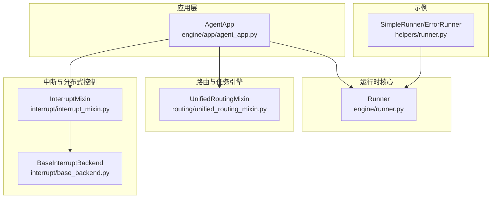
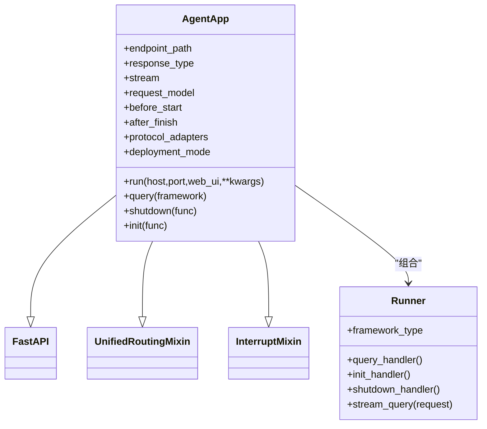
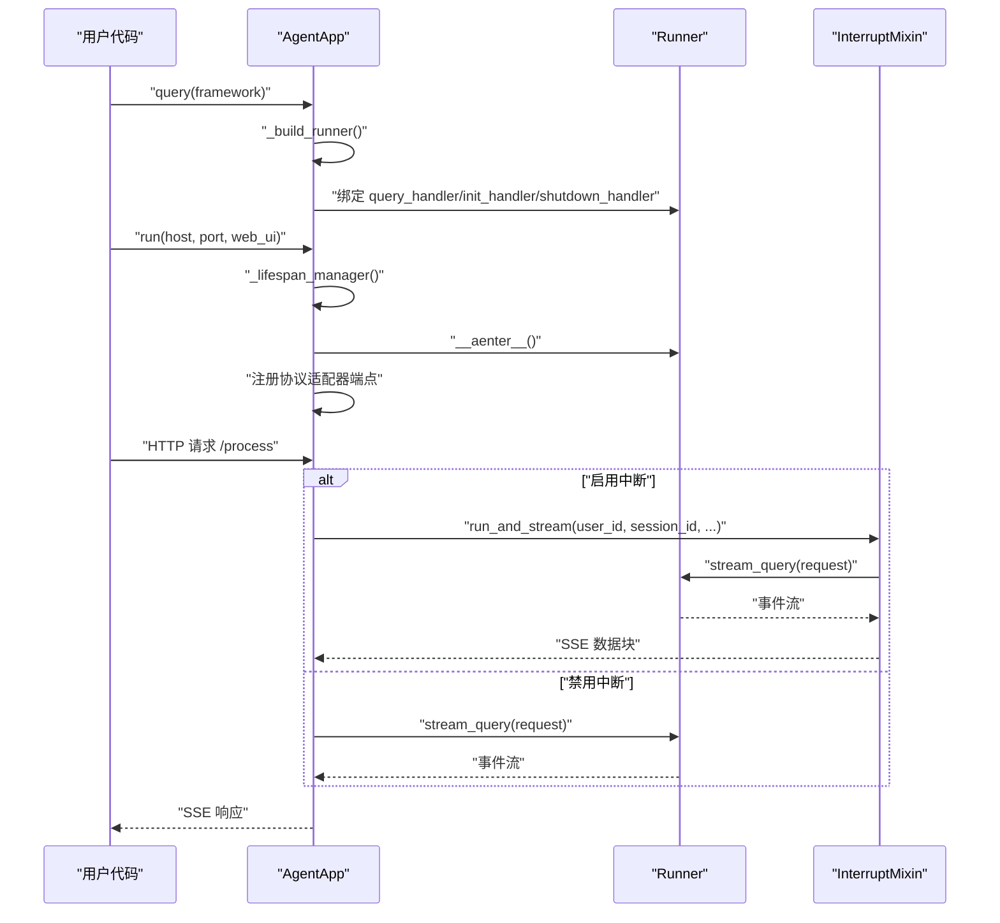
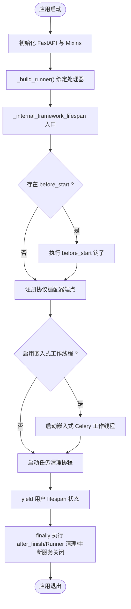
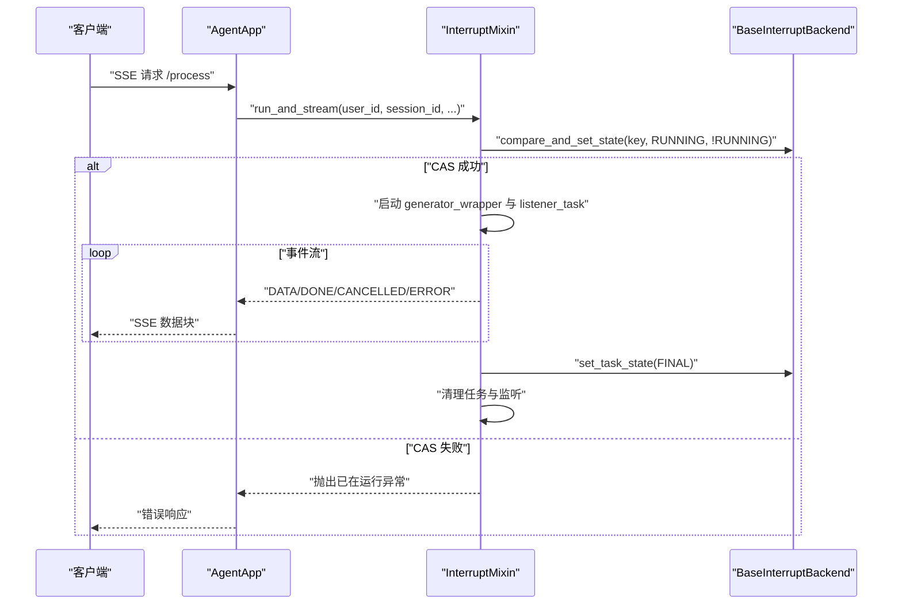
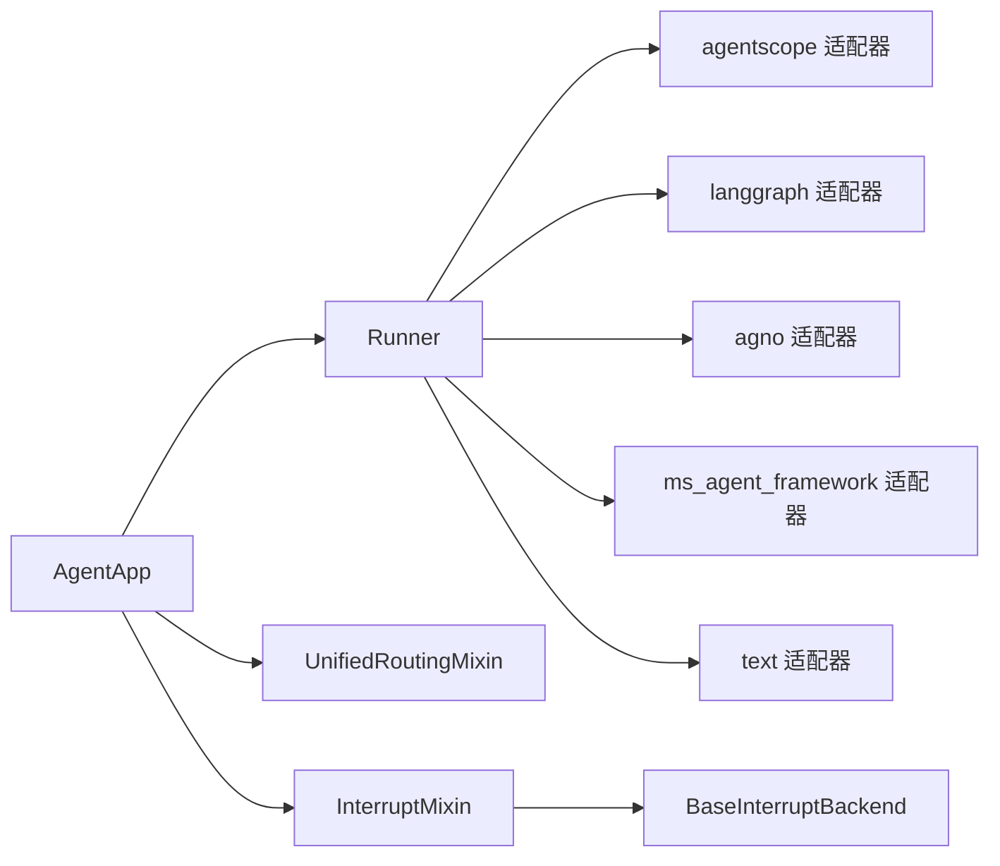

# AgentApp核心架构

<cite>
**本文引用的文件**
- [agent_app.py](file://src/agentscope_runtime/engine/app/agent_app.py)
- [runner.py](file://src/agentscope_runtime/engine/runner.py)
- [unified_routing_mixin.py](file://src/agentscope_runtime/engine/deployers/utils/service_utils/routing/unified_routing_mixin.py)
- [interrupt_mixin.py](file://src/agentscope_runtime/engine/deployers/utils/service_utils/interrupt/interrupt_mixin.py)
- [base_backend.py](file://src/agentscope_runtime/engine/deployers/utils/service_utils/interrupt/base_backend.py)
- [runner.py](file://src/agentscope_runtime/engine/helpers/runner.py)
</cite>

## 目录
1. [引言](#引言)
2. [项目结构](#项目结构)
3. [核心组件](#核心组件)
4. [架构总览](#架构总览)
5. [详细组件分析](#详细组件分析)
6. [依赖关系分析](#依赖关系分析)
7. [性能考虑](#性能考虑)
8. [故障排查指南](#故障排查指南)
9. [结论](#结论)
10. [附录](#附录)

## 引言
本文件系统性阐述 AgentApp 的核心架构设计与实现细节。AgentApp 是一个以 FastAPI 为基础的智能体 API 服务统一入口，通过多重继承模式整合了统一路由能力与分布式中断控制能力，并与 Runner 协同完成推理与流式输出。本文将从继承关系、初始化流程、核心属性与方法、与 Runner 的集成、生命周期管理、装饰器模式绑定查询处理器、架构图与代码示例路径、性能优化建议与最佳实践等方面进行深入解析。

## 项目结构
AgentApp 所在的关键模块与文件组织如下：
- 应用层：engine/app/agent_app.py
- 运行时核心：engine/runner.py
- 路由与任务引擎：engine/deployers/utils/service_utils/routing/unified_routing_mixin.py
- 中断与分布式控制：engine/deployers/utils/service_utils/interrupt/interrupt_mixin.py
- 中断后端抽象：engine/deployers/utils/service_utils/interrupt/base_backend.py
- 示例 Runner：engine/helpers/runner.py

图表来源
- [agent_app.py:60-220](file://src/agentscope_runtime/engine/app/agent_app.py#L60-L220)
- [runner.py:46-121](file://src/agentscope_runtime/engine/runner.py#L46-L121)
- [unified_routing_mixin.py:16-120](file://src/agentscope_runtime/engine/deployers/utils/service_utils/routing/unified_routing_mixin.py#L16-L120)
- [interrupt_mixin.py:8-50](file://src/agentscope_runtime/engine/deployers/utils/service_utils/interrupt/interrupt_mixin.py#L8-L50)
- [base_backend.py:25-90](file://src/agentscope_runtime/engine/deployers/utils/service_utils/interrupt/base_backend.py#L25-L90)
- [runner.py:13-41](file://src/agentscope_runtime/engine/helpers/runner.py#L13-L41)

章节来源
- [agent_app.py:60-220](file://src/agentscope_runtime/engine/app/agent_app.py#L60-L220)
- [runner.py:46-121](file://src/agentscope_runtime/engine/runner.py#L46-L121)
- [unified_routing_mixin.py:16-120](file://src/agentscope_runtime/engine/deployers/utils/service_utils/routing/unified_routing_mixin.py#L16-L120)
- [interrupt_mixin.py:8-50](file://src/agentscope_runtime/engine/deployers/utils/service_utils/interrupt/interrupt_mixin.py#L8-L50)
- [base_backend.py:25-90](file://src/agentscope_runtime/engine/deployers/utils/service_utils/interrupt/base_backend.py#L25-L90)
- [runner.py:13-41](file://src/agentscope_runtime/engine/helpers/runner.py#L13-L41)

## 核心组件
- AgentApp：继承自 FastAPI、UnifiedRoutingMixin、InterruptMixin，负责统一 API 入口、协议适配、内置路由、生命周期管理、流式输出与任务队列等。
- Runner：运行时核心，封装 query_handler、init_handler、shutdown_handler 等钩子，支持多框架类型适配与流式输出。
- UnifiedRoutingMixin：提供统一路由、任务提交与状态查询、自定义端点注册与恢复、内部路由标记等功能。
- InterruptMixin：提供分布式中断能力，基于 BaseInterruptBackend 实现任务状态管理与取消信号订阅。
- BaseInterruptBackend：中断后端抽象接口，定义发布/订阅、状态设置与 CAS 操作等。

章节来源
- [agent_app.py:60-220](file://src/agentscope_runtime/engine/app/agent_app.py#L60-L220)
- [runner.py:46-121](file://src/agentscope_runtime/engine/runner.py#L46-L121)
- [unified_routing_mixin.py:16-120](file://src/agentscope_runtime/engine/deployers/utils/service_utils/routing/unified_routing_mixin.py#L16-L120)
- [interrupt_mixin.py:8-50](file://src/agentscope_runtime/engine/deployers/utils/service_utils/interrupt/interrupt_mixin.py#L8-L50)
- [base_backend.py:25-90](file://src/agentscope_runtime/engine/deployers/utils/service_utils/interrupt/base_backend.py#L25-L90)

## 架构总览
AgentApp 将 FastAPI 的 Web 服务能力与统一路由、中断控制、Runner 推理链路有机融合，形成“协议适配 + 统一路由 + 分布式中断 + 流式输出”的一体化智能体 API 服务。

图表来源
- [agent_app.py:60-220](file://src/agentscope_runtime/engine/app/agent_app.py#L60-L220)
- [runner.py:46-121](file://src/agentscope_runtime/engine/runner.py#L46-L121)

## 详细组件分析

### AgentApp 类设计与多重继承
- 继承关系：AgentApp 同时继承 FastAPI、UnifiedRoutingMixin、InterruptMixin，从而具备：
  - Web 服务与生命周期管理（FastAPI）
  - 统一路由与任务引擎（UnifiedRoutingMixin）
  - 分布式中断与任务状态管理（InterruptMixin）
- 设计理念：通过多重继承将不同职责解耦到 Mixin，保持 AgentApp 的简洁与可扩展性；同时利用 FastAPI 的 lifespan 机制统一内外部生命周期。

章节来源
- [agent_app.py:60-107](file://src/agentscope_runtime/engine/app/agent_app.py#L60-L107)
- [agent_app.py:124-220](file://src/agentscope_runtime/engine/app/agent_app.py#L124-L220)

### 初始化流程与核心属性
- 关键参数与默认值：
  - 应用元信息：app_name、app_description、version（来自 FastAPI）
  - API 入口：endpoint_path、response_type、stream、request_model
  - 生命周期钩子：before_start、after_finish（支持同步/异步）
  - Runner 集成：runner（可选）、enable_embedded_worker、enable_stream_task、stream_task_queue、stream_task_timeout
  - 协议适配：a2a_config、agui_config、protocol_adapters
  - 中断服务：interrupt_backend、interrupt_redis_url
  - 部署模式：mode（DeploymentMode）
  - 自定义端点：custom_endpoints
- 初始化步骤要点：
  - 传递 lifespan 到 FastAPI，使用 _lifespan_manager 组织内部与用户生命周期
  - 初始化路由管理器（UnifiedRoutingMixin）
  - 构建 Runner（若未传入则创建默认 Runner）
  - 初始化协议适配器（A2A、ResponseAPI、AGUI）
  - 设置中断服务（本地或 Redis 后端）
  - 注册内置路由（健康检查、根路径、进程控制）
  - 添加中间件（CORS、动态部署模式响应头）

章节来源
- [agent_app.py:124-220](file://src/agentscope_runtime/engine/app/agent_app.py#L124-L220)
- [agent_app.py:248-339](file://src/agentscope_runtime/engine/app/agent_app.py#L248-L339)
- [agent_app.py:340-357](file://src/agentscope_runtime/engine/app/agent_app.py#L340-L357)
- [agent_app.py:359-381](file://src/agentscope_runtime/engine/app/agent_app.py#L359-L381)
- [agent_app.py:382-425](file://src/agentscope_runtime/engine/app/agent_app.py#L382-L425)

### 与 Runner 的集成与装饰器模式
- 查询处理器绑定：
  - query(framework) 装饰器用于注册 query_handler，并设置 Runner.framework_type
  - init()/shutdown() 装饰器分别注册初始化与关闭钩子
  - _build_runner() 将已注册的处理器绑定到 Runner 实例
- 推理与流式输出：
  - _stream_generator/_common_stream_generator/_stream_generator_with_interrupt 组合 Runner.stream_query 并按需加入中断控制
  - _add_endpoint_router() 动态注册主推理端点，兼容 Depends 参数签名
- 示例 Runner：
  - SimpleRunner 与 ErrorRunner 展示了最小化实现与错误处理

图表来源
- [agent_app.py:722-760](file://src/agentscope_runtime/engine/app/agent_app.py#L722-L760)
- [agent_app.py:760-780](file://src/agentscope_runtime/engine/app/agent_app.py#L760-L780)
- [agent_app.py:781-846](file://src/agentscope_runtime/engine/app/agent_app.py#L781-L846)
- [agent_app.py:643-703](file://src/agentscope_runtime/engine/app/agent_app.py#L643-L703)
- [runner.py:199-356](file://src/agentscope_runtime/engine/runner.py#L199-L356)
- [interrupt_mixin.py:38-139](file://src/agentscope_runtime/engine/deployers/utils/service_utils/interrupt/interrupt_mixin.py#L38-L139)

章节来源
- [agent_app.py:722-760](file://src/agentscope_runtime/engine/app/agent_app.py#L722-L760)
- [agent_app.py:760-780](file://src/agentscope_runtime/engine/app/agent_app.py#L760-L780)
- [agent_app.py:781-846](file://src/agentscope_runtime/engine/app/agent_app.py#L781-L846)
- [agent_app.py:643-703](file://src/agentscope_runtime/engine/app/agent_app.py#L643-L703)
- [runner.py:199-356](file://src/agentscope_runtime/engine/runner.py#L199-L356)
- [interrupt_mixin.py:38-139](file://src/agentscope_runtime/engine/deployers/utils/service_utils/interrupt/interrupt_mixin.py#L38-L139)
- [runner.py:13-41](file://src/agentscope_runtime/engine/helpers/runner.py#L13-L41)

### 生命周期管理机制（内部与外部）
- 内部生命周期（_internal_framework_lifespan）：
  - 构建 Runner、进入上下文、执行 before_start 钩子
  - 为每个协议适配器注册端点（根据 stream 选择 query 或 stream_query）
  - 可选启动嵌入式 Celery 工作线程与任务清理协程
  - finally 中执行 after_finish、Runner 清理、中断服务关闭
- 外部生命周期（用户提供的 lifespan）：
  - 通过 _lifespan_manager 与内部生命周期协同，用户可在外部注入自己的资源与状态
- 进程控制端点：
  - /shutdown 与 /admin/shutdown 支持优雅关闭
  - /admin/status 提供进程状态信息

图表来源
- [agent_app.py:248-339](file://src/agentscope_runtime/engine/app/agent_app.py#L248-L339)
- [agent_app.py:317-339](file://src/agentscope_runtime/engine/app/agent_app.py#L317-L339)
- [agent_app.py:598-642](file://src/agentscope_runtime/engine/app/agent_app.py#L598-L642)

章节来源
- [agent_app.py:248-339](file://src/agentscope_runtime/engine/app/agent_app.py#L248-L339)
- [agent_app.py:317-339](file://src/agentscope_runtime/engine/app/agent_app.py#L317-L339)
- [agent_app.py:598-642](file://src/agentscope_runtime/engine/app/agent_app.py#L598-L642)

### 协议适配与 OpenAPI 扩展
- AgentApp 在生成 OpenAPI 时，会根据已加载的协议适配器向 components.schemas 注入 A2ARequest、ResponseAPI、AgentRequest 等模型定义，确保文档与实际请求格式一致。
- 协议适配器初始化顺序：A2A、ResponseAPI、AGUI，默认配置来源于构造函数参数与环境变量。

章节来源
- [agent_app.py:68-123](file://src/agentscope_runtime/engine/app/agent_app.py#L68-L123)
- [agent_app.py:340-357](file://src/agentscope_runtime/engine/app/agent_app.py#L340-L357)

### 中断与分布式控制
- 中断后端选择策略：
  - 若传入外部 backend 实例：直接使用
  - 若提供 redis_url：使用 RedisInterruptBackend
  - 否则：使用 LocalInterruptBackend（单机）
- 中断执行流程：
  - run_and_stream 使用 compare_and_set_state 防止并发重复执行
  - 通过队列与监听任务实现数据、完成、取消、错误状态的传播
  - finally 中根据是否被取消更新最终状态（STOPPED/FINISHED），并清理资源

图表来源
- [interrupt_mixin.py:38-139](file://src/agentscope_runtime/engine/deployers/utils/service_utils/interrupt/interrupt_mixin.py#L38-L139)
- [base_backend.py:50-85](file://src/agentscope_runtime/engine/deployers/utils/service_utils/interrupt/base_backend.py#L50-L85)

章节来源
- [agent_app.py:222-247](file://src/agentscope_runtime/engine/app/agent_app.py#L222-L247)
- [interrupt_mixin.py:38-139](file://src/agentscope_runtime/engine/deployers/utils/service_utils/interrupt/interrupt_mixin.py#L38-L139)
- [base_backend.py:50-85](file://src/agentscope_runtime/engine/deployers/utils/service_utils/interrupt/base_backend.py#L50-L85)

### 统一路由与自定义端点
- UnifiedRoutingMixin 提供：
  - task(path, queue)：注册异步任务端点，支持 Celery 或内存模式
  - endpoint(path, methods)：注册自定义端点
  - sync_routing_metadata()/restore_custom_endpoints()：路由元数据同步与恢复
  - internal_route/is_internal_route：内部系统路由标记与识别
- AgentApp 内置端点：
  - /health、/（根路径）、/shutdown、/admin/shutdown、/admin/status
  - /process（主推理端点）、/process/stream（流式端点，按配置）
  - /process/task 与 /process/task/{task_id}（后台任务提交与状态轮询）

章节来源
- [unified_routing_mixin.py:16-253](file://src/agentscope_runtime/engine/deployers/utils/service_utils/routing/unified_routing_mixin.py#L16-L253)
- [agent_app.py:382-425](file://src/agentscope_runtime/engine/app/agent_app.py#L382-L425)
- [agent_app.py:497-597](file://src/agentscope_runtime/engine/app/agent_app.py#L497-L597)

### 任务清理与过期回收
- _task_cleanup_worker 定期清理已完成/失败且超过 TTL 的任务，避免内存泄漏
- _cleanup_expired_tasks 计算任务完成时间并删除过期条目

章节来源
- [agent_app.py:426-471](file://src/agentscope_runtime/engine/app/agent_app.py#L426-L471)
- [agent_app.py:460-471](file://src/agentscope_runtime/engine/app/agent_app.py#L460-L471)

## 依赖关系分析
- AgentApp 对 Runner 的依赖是组合关系，通过 _build_runner 将用户注册的处理器绑定到 Runner
- AgentApp 对 Mixin 的依赖是继承关系，分别提供 Web 生命周期、统一路由与中断控制
- Runner 对多种框架类型（agentscope、autogen、agno、langgraph、ms_agent_framework、text）进行适配，通过流式适配器桥接不同消息格式

图表来源
- [agent_app.py:60-220](file://src/agentscope_runtime/engine/app/agent_app.py#L60-L220)
- [runner.py:246-321](file://src/agentscope_runtime/engine/runner.py#L246-L321)
- [interrupt_mixin.py:8-50](file://src/agentscope_runtime/engine/deployers/utils/service_utils/interrupt/interrupt_mixin.py#L8-L50)
- [base_backend.py:25-90](file://src/agentscope_runtime/engine/deployers/utils/service_utils/interrupt/base_backend.py#L25-L90)

章节来源
- [agent_app.py:60-220](file://src/agentscope_runtime/engine/app/agent_app.py#L60-L220)
- [runner.py:246-321](file://src/agentscope_runtime/engine/runner.py#L246-L321)
- [interrupt_mixin.py:8-50](file://src/agentscope_runtime/engine/deployers/utils/service_utils/interrupt/interrupt_mixin.py#L8-L50)
- [base_backend.py:25-90](file://src/agentscope_runtime/engine/deployers/utils/service_utils/interrupt/base_backend.py#L25-L90)

## 性能考虑
- 流式输出与 SSE：
  - 使用 StreamingResponse 输出事件流，减少一次性响应体积
  - 在 _common_stream_generator 中对事件对象进行序列化，避免重复转换
- 中断与并发控制：
  - run_and_stream 通过 compare_and_set_state 防止同一会话并发执行
  - 使用 asyncio.Queue 与任务分离，降低阻塞风险
- 任务清理：
  - 定期清理过期任务，防止 active_tasks 无限增长
- 协议适配器：
  - 仅在需要时加载对应框架的适配器，避免不必要的导入开销
- 部署模式：
  - DETACHED_PROCESS 与 STANDALONE 模式下通过响应头标识，便于网关与负载均衡策略

[本节为通用性能建议，不直接分析具体文件，故无章节来源]

## 故障排查指南
- 生命周期钩子异常：
  - before_start/after_finish 抛出异常会被捕获并记录日志，不影响整体生命周期
- Runner 未启动：
  - stream_query 会在未启动时抛出异常，确保在 async with Runner() 或调用 start() 后再发起请求
- 中断服务异常：
  - close_interrupt_service 在清理阶段捕获异常并记录警告，不影响应用退出
- 任务清理失败：
  - _task_cleanup_worker 捕获异常并记录错误日志，然后继续循环

章节来源
- [agent_app.py:295-316](file://src/agentscope_runtime/engine/app/agent_app.py#L295-L316)
- [runner.py:214-219](file://src/agentscope_runtime/engine/runner.py#L214-L219)
- [agent_app.py:469-471](file://src/agentscope_runtime/engine/app/agent_app.py#L469-L471)
- [interrupt_mixin.py:148-151](file://src/agentscope_runtime/engine/deployers/utils/service_utils/interrupt/interrupt_mixin.py#L148-L151)

## 结论
AgentApp 通过多重继承将 FastAPI 的 Web 能力、统一路由与任务引擎、分布式中断控制整合为一体，配合 Runner 的多框架适配与流式输出，形成了高内聚、低耦合、可扩展的智能体 API 服务统一入口。其生命周期管理采用 FastAPI 的 lifespan 机制，既保证了内部服务的一致性，又允许用户注入外部状态与资源，适合在生产环境中稳定运行。

[本节为总结性内容，不直接分析具体文件，故无章节来源]

## 附录
- 快速上手示例参考：
  - 示例 Runner（SimpleRunner/ErrorRunner）展示了最小化实现与错误处理
  - AgentApp 的 run() 方法支持启动 Web UI 与服务器
- 相关实现路径（用于定位源码）：
  - AgentApp 主类与初始化：[agent_app.py:60-220](file://src/agentscope_runtime/engine/app/agent_app.py#L60-L220)
  - 生命周期管理：[agent_app.py:248-339](file://src/agentscope_runtime/engine/app/agent_app.py#L248-L339)
  - 查询处理器绑定与端点注册：[agent_app.py:722-846](file://src/agentscope_runtime/engine/app/agent_app.py#L722-L846)
  - Runner 流式推理与框架适配：[runner.py:199-356](file://src/agentscope_runtime/engine/runner.py#L199-L356)
  - 统一路由与任务引擎：[unified_routing_mixin.py:16-253](file://src/agentscope_runtime/engine/deployers/utils/service_utils/routing/unified_routing_mixin.py#L16-L253)
  - 中断与分布式控制：[interrupt_mixin.py:8-151](file://src/agentscope_runtime/engine/deployers/utils/service_utils/interrupt/interrupt_mixin.py#L8-L151)
  - 中断后端抽象：[base_backend.py:25-90](file://src/agentscope_runtime/engine/deployers/utils/service_utils/interrupt/base_backend.py#L25-L90)
  - 示例 Runner：[runner.py:13-41](file://src/agentscope_runtime/engine/helpers/runner.py#L13-L41)