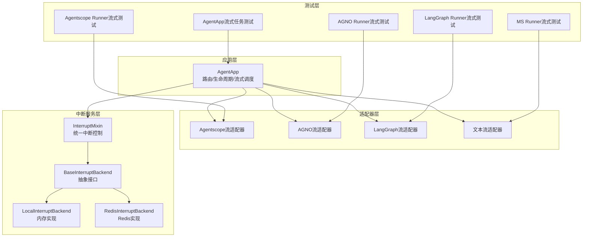
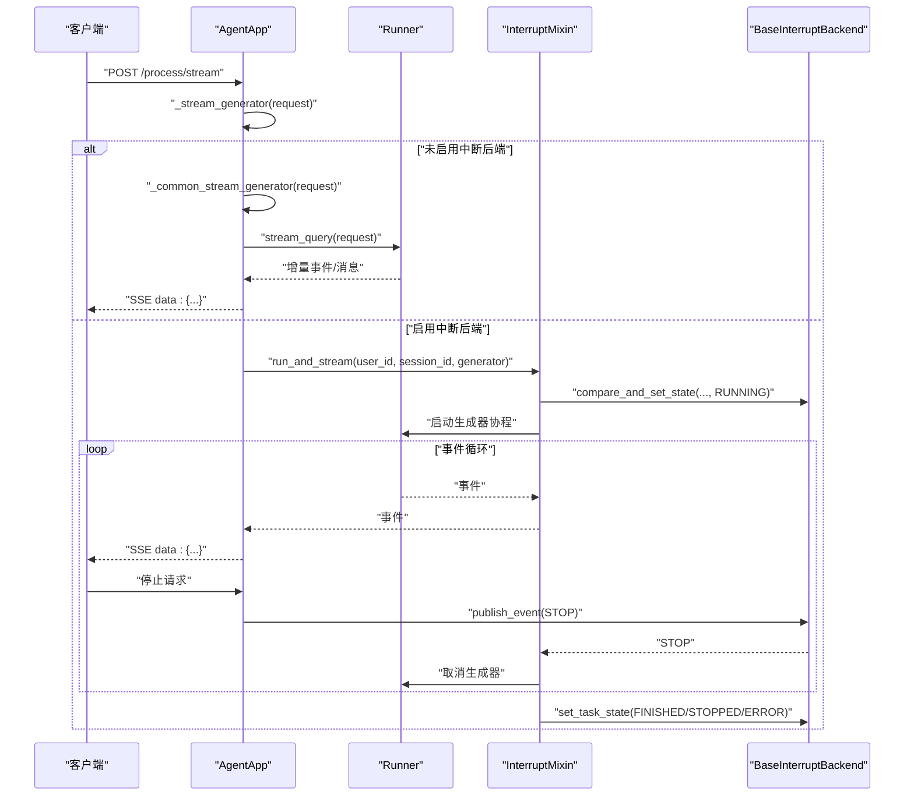
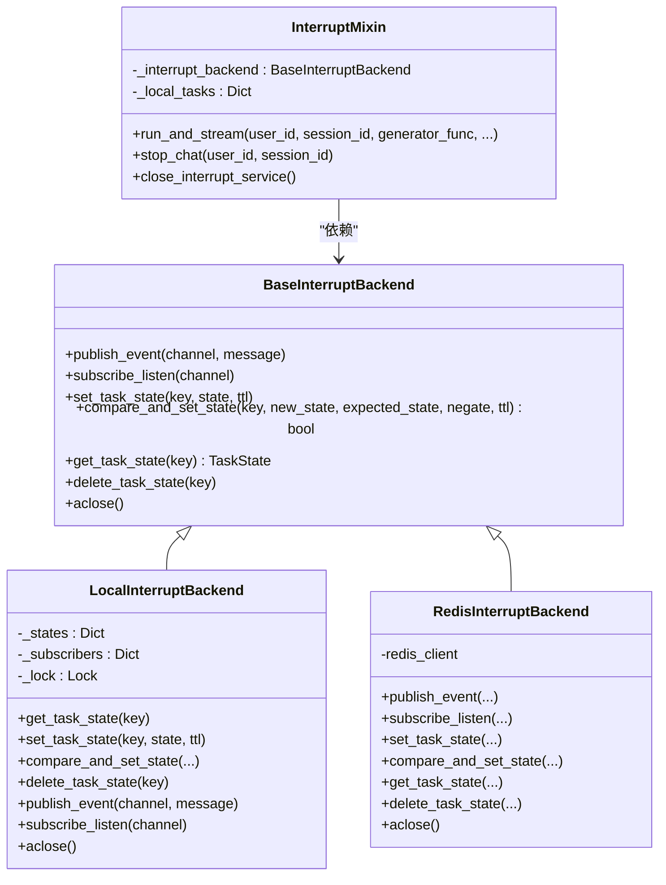
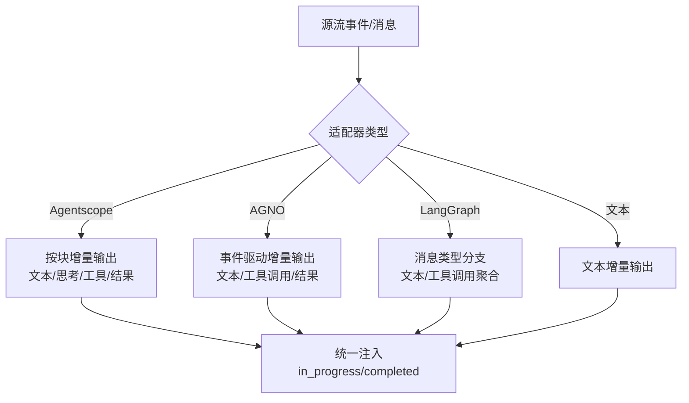
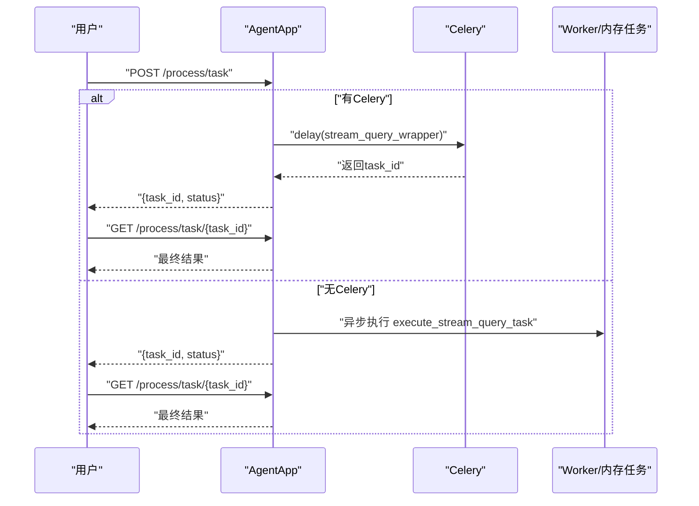
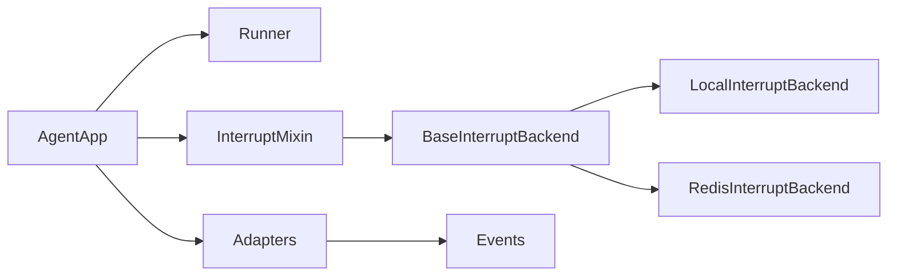

# 流式响应处理

<cite>
**本文引用的文件**
- [agent_app.py](file://src/agentscope_runtime/engine/app/agent_app.py)
- [stream.py（Agentscope适配器）](file://src/agentscope_runtime/adapters/agentscope/stream.py)
- [stream.py（AGNO适配器）](file://src/agentscope_runtime/adapters/agno/stream.py)
- [stream.py（LangGraph适配器）](file://src/agentscope_runtime/adapters/langgraph/stream.py)
- [stream.py（文本适配器）](file://src/agentscope_runtime/adapters/text/stream.py)
- [base_backend.py](file://src/agentscope_runtime/engine/deployers/utils/service_utils/interrupt/base_backend.py)
- [local_backend.py](file://src/agentscope_runtime/engine/deployers/utils/service_utils/interrupt/local_backend.py)
- [redis_backend.py](file://src/agentscope_runtime/engine/deployers/utils/service_utils/interrupt/redis_backend.py)
- [interrupt_mixin.py](file://src/agentscope_runtime/engine/deployers/utils/service_utils/interrupt/interrupt_mixin.py)
- [test_agent_app_stream_task.py](file://tests/integrated/test_agent_app_stream_task.py)
- [test_runner_stream_agentscope.py](file://tests/integrated/test_runner_stream_agentscope.py)
- [test_runner_stream_agno.py](file://tests/integrated/test_runner_stream_agno.py)
- [test_runner_stream_langgraph.py](file://tests/integrated/test_runner_stream_langgraph.py)
- [test_runner_stream_ms.py](file://tests/integrated/test_runner_stream_ms.py)
</cite>

## 目录
1. [简介](#简介)
2. [项目结构](#项目结构)
3. [核心组件](#核心组件)
4. [架构总览](#架构总览)
5. [详细组件分析](#详细组件分析)
6. [依赖关系分析](#依赖关系分析)
7. [性能考虑](#性能考虑)
8. [故障排除指南](#故障排除指南)
9. [结论](#结论)
10. [附录：完整API与配置示例](#附录完整api与配置示例)

## 简介
本文件聚焦于AgentApp的流式响应处理能力，系统性阐述以下主题：
- 流式生成器体系：_stream_generator、_common_stream_generator与_stream_generator_with_interrupt的职责分工与协作流程
- SSE事件流格式化与事件推送机制
- 中断后端集成：_local与_redis后端的选择逻辑与运行时行为
- 带中断的流式任务执行：run_and_stream的实现原理与错误处理
- 后台执行模式：Celery集成与内存模式的差异与适用场景
- 配置项与性能优化建议
- 完整的流式API使用示例与故障排除指南

## 项目结构
围绕流式响应处理的关键代码分布在如下模块：
- 应用层：AgentApp负责路由注册、生命周期管理、流式生成器调度与中断服务初始化
- 适配器层：针对不同框架（Agentscope、AGNO、LangGraph、纯文本）的消息流转换
- 中断服务层：抽象后端接口、本地内存实现与Redis实现、混入类提供统一的中断控制
- 测试层：覆盖AgentApp流式任务、Runner在各框架下的流式输出



图表来源
- [agent_app.py:643-703](file://src/agentscope_runtime/engine/app/agent_app.py#L643-L703)
- [stream.py（Agentscope适配器）:33-684](file://src/agentscope_runtime/adapters/agentscope/stream.py#L33-L684)
- [stream.py（AGNO适配器）:32-124](file://src/agentscope_runtime/adapters/agno/stream.py#L32-L124)
- [stream.py（LangGraph适配器）:28-257](file://src/agentscope_runtime/adapters/langgraph/stream.py#L28-L257)
- [stream.py（文本适配器）:12-31](file://src/agentscope_runtime/adapters/text/stream.py#L12-L31)
- [base_backend.py:25-90](file://src/agentscope_runtime/engine/deployers/utils/service_utils/interrupt/base_backend.py#L25-L90)
- [local_backend.py:9-132](file://src/agentscope_runtime/engine/deployers/utils/service_utils/interrupt/local_backend.py#L9-L132)
- [redis_backend.py:7-107](file://src/agentscope_runtime/engine/deployers/utils/service_utils/interrupt/redis_backend.py#L7-L107)
- [interrupt_mixin.py:8-151](file://src/agentscope_runtime/engine/deployers/utils/service_utils/interrupt/interrupt_mixin.py#L8-L151)

章节来源
- [agent_app.py:643-703](file://src/agentscope_runtime/engine/app/agent_app.py#L643-L703)
- [base_backend.py:25-90](file://src/agentscope_runtime/engine/deployers/utils/service_utils/interrupt/base_backend.py#L25-L90)

## 核心组件
- 流式生成器族
  - _common_stream_generator：标准化SSE数据块生成，将Runner输出序列化为"data: ..."行
  - _stream_generator：根据是否启用中断后端选择走普通或带中断的流式路径
  - _stream_generator_with_interrupt：在run_and_stream包装下，支持分布式中断与状态管理
- 适配器层
  - Agentscope适配器：将多模态消息流转换为增量内容块，支持文本、思考、工具调用与结果等
  - AGNO适配器：基于事件模型，将内容事件与工具调用事件转为增量消息
  - LangGraph适配器：将LangChain消息流转换为增量文本与工具调用
  - 文本适配器：最简实现，直接将字符串片段作为增量文本
- 中断服务
  - BaseInterruptBackend：定义发布/订阅、状态设置与CAS、获取与删除、关闭等抽象
  - LocalInterruptBackend：基于内存与异步队列的轻量实现
  - RedisInterruptBackend：基于Redis的持久化与广播
  - InterruptMixin：run_and_stream统一入口，负责状态机流转、监听停止信号、资源清理与最终状态落盘

章节来源
- [agent_app.py:643-703](file://src/agentscope_runtime/engine/app/agent_app.py#L643-L703)
- [stream.py（Agentscope适配器）:33-684](file://src/agentscope_runtime/adapters/agentscope/stream.py#L33-L684)
- [stream.py（AGNO适配器）:32-124](file://src/agentscope_runtime/adapters/agno/stream.py#L32-L124)
- [stream.py（LangGraph适配器）:28-257](file://src/agentscope_runtime/adapters/langgraph/stream.py#L28-L257)
- [stream.py（文本适配器）:12-31](file://src/agentscope_runtime/adapters/text/stream.py#L12-L31)
- [base_backend.py:25-90](file://src/agentscope_runtime/engine/deployers/utils/service_utils/interrupt/base_backend.py#L25-L90)
- [local_backend.py:9-132](file://src/agentscope_runtime/engine/deployers/utils/service_utils/interrupt/local_backend.py#L9-L132)
- [redis_backend.py:7-107](file://src/agentscope_runtime/engine/deployers/utils/service_utils/interrupt/redis_backend.py#L7-L107)
- [interrupt_mixin.py:8-151](file://src/agentscope_runtime/engine/deployers/utils/service_utils/interrupt/interrupt_mixin.py#L8-L151)

## 架构总览
AgentApp通过统一的流式生成器调度，将Runner的增量输出转换为SSE事件流；当启用中断后端时，所有流式任务均受InterruptMixin管控，确保并发安全与可中断性。



图表来源
- [agent_app.py:643-703](file://src/agentscope_runtime/engine/app/agent_app.py#L643-L703)
- [interrupt_mixin.py:38-139](file://src/agentscope_runtime/engine/deployers/utils/service_utils/interrupt/interrupt_mixin.py#L38-L139)
- [base_backend.py:25-90](file://src/agentscope_runtime/engine/deployers/utils/service_utils/interrupt/base_backend.py#L25-L90)

## 详细组件分析

### 流式生成器与SSE事件流
- _common_stream_generator
  - 负责将Runner返回的事件对象序列化为JSON，并以"data: ..."行封装为SSE事件
  - 支持模型实例的model_dump_json与通用json序列化回退
- _stream_generator
  - 在未启用中断后端时，直接委托_common_stream_generator
  - 在启用中断后端时，委托_stream_generator_with_interrupt
- _stream_generator_with_interrupt
  - 将_request解析为AgentRequest，提取user_id与session_id
  - 通过run_and_stream包装原始生成器，实现分布式中断与状态管理

```mermaid
flowchart TD
Start(["进入 _common_stream_generator"]) --> CheckRunner{"存在Runner?"}
CheckRunner --> |否| RaiseErr["抛出错误并终止"]
CheckRunner --> |是| Loop["遍历 Runner.stream_query(...)"]
Loop --> Serialize{"事件可序列化?"}
Serialize --> |模型| ToJson["model_dump_json()"]
Serialize --> |字典/结构| JsonDumps["json.dumps()"]
Serialize --> |其他| Fallback["{\"text\": str(chunk)}"]
ToJson --> SSE["拼接为SSE data 行"]
JsonDumps --> SSE
Fallback --> SSE
SSE --> Yield["yield 到上游"]
Yield --> Loop
```

图表来源
- [agent_app.py:690-703](file://src/agentscope_runtime/engine/app/agent_app.py#L690-L703)

章节来源
- [agent_app.py:643-703](file://src/agentscope_runtime/engine/app/agent_app.py#L643-L703)

### 中断后端与选择逻辑
- 选择逻辑
  - 若外部传入backend实例：优先使用该实例
  - 若提供redis_url：使用RedisInterruptBackend
  - 否则：使用LocalInterruptBackend（单进程）
- 运行时行为
  - run_and_stream中对同一会话键执行原子CAS，仅允许非RUNNING状态切换到RUNNING
  - 订阅频道(chan:user_id:session_id)，收到STOP即取消工作协程
  - 正常结束落盘FINISHED，被中断落盘STOPPED，异常落盘ERROR
  - 清理阶段取消监听与工作协程，释放本地任务映射



图表来源
- [base_backend.py:25-90](file://src/agentscope_runtime/engine/deployers/utils/service_utils/interrupt/base_backend.py#L25-L90)
- [local_backend.py:9-132](file://src/agentscope_runtime/engine/deployers/utils/service_utils/interrupt/local_backend.py#L9-L132)
- [redis_backend.py:7-107](file://src/agentscope_runtime/engine/deployers/utils/service_utils/interrupt/redis_backend.py#L7-L107)
- [interrupt_mixin.py:8-151](file://src/agentscope_runtime/engine/deployers/utils/service_utils/interrupt/interrupt_mixin.py#L8-L151)

章节来源
- [agent_app.py:222-246](file://src/agentscope_runtime/engine/app/agent_app.py#L222-L246)
- [interrupt_mixin.py:38-139](file://src/agentscope_runtime/engine/deployers/utils/service_utils/interrupt/interrupt_mixin.py#L38-L139)
- [local_backend.py:26-91](file://src/agentscope_runtime/engine/deployers/utils/service_utils/interrupt/local_backend.py#L26-L91)
- [redis_backend.py:32-104](file://src/agentscope_runtime/engine/deployers/utils/service_utils/interrupt/redis_backend.py#L32-L104)

### 适配器层：多框架消息流转换
- Agentscope适配器
  - 支持文本、思考、工具调用与工具结果的增量输出
  - 对自定义类型可通过type_converters回调扩展
  - 使用in_progress/completed语义表达增量与完成
- AGNO适配器
  - 基于事件模型，区分RunContentEvent与Reasoning事件
  - 工具调用与结果以消息形式一次性完成
- LangGraph适配器
  - 处理HumanMessage、AIMessage、SystemMessage、ToolMessage
  - 支持tool_call_chunks的聚合与增量输出
- 文本适配器
  - 最简实现，逐段文本增量输出



图表来源
- [stream.py（Agentscope适配器）:33-684](file://src/agentscope_runtime/adapters/agentscope/stream.py#L33-L684)
- [stream.py（AGNO适配器）:32-124](file://src/agentscope_runtime/adapters/agno/stream.py#L32-L124)
- [stream.py（LangGraph适配器）:28-257](file://src/agentscope_runtime/adapters/langgraph/stream.py#L28-L257)
- [stream.py（文本适配器）:12-31](file://src/agentscope_runtime/adapters/text/stream.py#L12-L31)

章节来源
- [stream.py（Agentscope适配器）:33-684](file://src/agentscope_runtime/adapters/agentscope/stream.py#L33-L684)
- [stream.py（AGNO适配器）:32-124](file://src/agentscope_runtime/adapters/agno/stream.py#L32-L124)
- [stream.py（LangGraph适配器）:28-257](file://src/agentscope_runtime/adapters/langgraph/stream.py#L28-L257)
- [stream.py（文本适配器）:12-31](file://src/agentscope_runtime/adapters/text/stream.py#L12-L31)

### 后台执行模式：Celery与内存模式
- 模式选择
  - 若存在celery_app：使用Celery执行，提交任务并返回task_id
  - 否则：在内存中创建任务，使用execute_stream_query_task异步执行
- 结果存储
  - 仅保存最终响应，不保留中间事件
  - 支持定时清理过期任务（默认1小时）



图表来源
- [agent_app.py:544-597](file://src/agentscope_runtime/engine/app/agent_app.py#L544-L597)
- [agent_app.py:472-496](file://src/agentscope_runtime/engine/app/agent_app.py#L472-L496)

章节来源
- [agent_app.py:472-597](file://src/agentscope_runtime/engine/app/agent_app.py#L472-L597)

## 依赖关系分析
- 组件耦合
  - AgentApp与Runner通过流式查询接口解耦
  - 适配器层与AgentApp通过统一的事件/消息接口交互
  - 中断服务通过Mix-in与AgentApp耦合，但后端实现可替换
- 外部依赖
  - Redis用于分布式中断与状态持久化
  - Celery用于后台任务执行
- 潜在环路
  - 当前设计避免了循环依赖：AgentApp依赖Runner与中断后端，适配器独立于AgentApp



图表来源
- [agent_app.py:60-70](file://src/agentscope_runtime/engine/app/agent_app.py#L60-L70)
- [interrupt_mixin.py:8-151](file://src/agentscope_runtime/engine/deployers/utils/service_utils/interrupt/interrupt_mixin.py#L8-L151)
- [base_backend.py:25-90](file://src/agentscope_runtime/engine/deployers/utils/service_utils/interrupt/base_backend.py#L25-L90)

章节来源
- [agent_app.py:60-70](file://src/agentscope_runtime/engine/app/agent_app.py#L60-L70)
- [interrupt_mixin.py:8-151](file://src/agentscope_runtime/engine/deployers/utils/service_utils/interrupt/interrupt_mixin.py#L8-L151)
- [base_backend.py:25-90](file://src/agentscope_runtime/engine/deployers/utils/service_utils/interrupt/base_backend.py#L25-L90)

## 性能考虑
- SSE序列化开销
  - 优先使用模型的JSON序列化方法，减少额外转换
  - 避免在热路径上进行复杂格式变换
- 中断与状态管理
  - CAS操作应尽量短小，避免在锁内执行耗时逻辑
  - Redis后端利用Lua脚本保证CAS原子性
- 适配器效率
  - Agentscope适配器支持自定义类型转换器，建议复用已有的高效转换器
  - LangGraph适配器对tool_call_chunks进行聚合，减少事件数量
- 后台任务
  - Celery模式下，任务仅保存最终结果，降低存储压力
  - 内存模式下，注意任务超时与清理策略

## 故障排除指南
- 无法接收SSE事件
  - 检查是否正确使用StreamingResponse包裹_generator
  - 确认SSE格式为"data: ..."且以"\n\n"结尾
- 中断无效
  - 确认已启用中断后端（Redis或Local），并在请求中携带user_id与session_id
  - 检查频道名称"chan:user_id:session_id"是否一致
- 重复任务或并发冲突
  - CAS失败会抛出运行时错误，表示当前会话已在RUNNING状态
- 任务未完成或丢失
  - 后台任务仅保存最终结果，若需中间事件请改用实时流式接口
  - 定期检查任务清理日志，确认过期任务被清理

章节来源
- [agent_app.py:643-703](file://src/agentscope_runtime/engine/app/agent_app.py#L643-L703)
- [interrupt_mixin.py:50-62](file://src/agentscope_runtime/engine/deployers/utils/service_utils/interrupt/interrupt_mixin.py#L50-L62)
- [agent_app.py:544-597](file://src/agentscope_runtime/engine/app/agent_app.py#L544-L597)

## 结论
AgentApp的流式响应处理通过“生成器+适配器+中断服务”的分层设计，实现了跨框架的一致性输出与可控的中断能力。SSE事件流与增量消息语义保证了前端的良好体验；中断后端提供了从单机到分布式的一致性保障；后台任务模式兼顾了性能与可维护性。结合本文的配置建议与故障排除清单，可在生产环境中稳定地部署与运维。

## 附录：完整API与配置示例
- 流式端点
  - POST /process/stream：实时流式响应（SSE）
  - POST /process/task：后台任务提交（仅保存最终结果）
  - GET /process/task/{task_id}：查询任务状态与结果
- 关键配置
  - enable_stream_task：是否启用后台任务
  - stream_task_queue：Celery队列名
  - stream_task_timeout：任务超时时间
  - interrupt_backend：外部中断后端实例
  - interrupt_redis_url：Redis连接URL（启用Redis后端）
- 使用示例（概念性步骤）
  - 实时流式：向/process/stream发送AgentRequest，接收SSE事件
  - 后台任务：向/process/task提交请求，获得task_id，轮询状态直至完成
  - 中断：向后端发布STOP信号至"chan:user_id:session_id"，触发run_and_stream取消

章节来源
- [agent_app.py:402-423](file://src/agentscope_runtime/engine/app/agent_app.py#L402-L423)
- [agent_app.py:544-597](file://src/agentscope_runtime/engine/app/agent_app.py#L544-L597)
- [agent_app.py:643-703](file://src/agentscope_runtime/engine/app/agent_app.py#L643-L703)