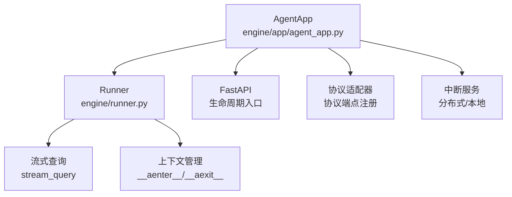
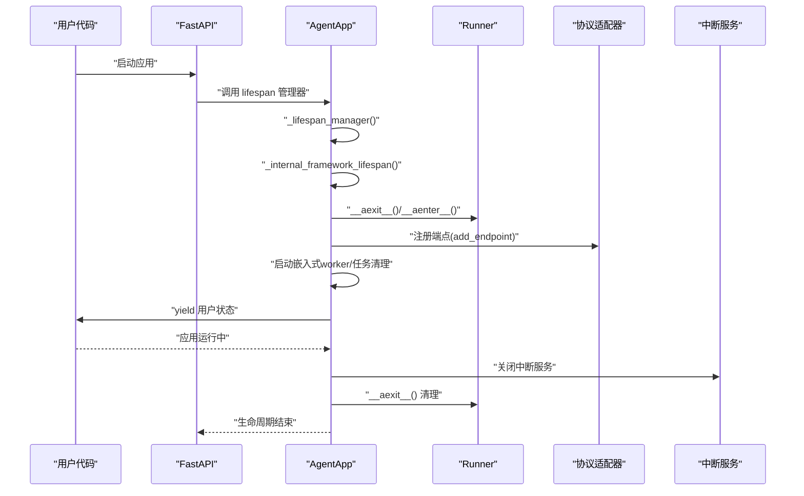
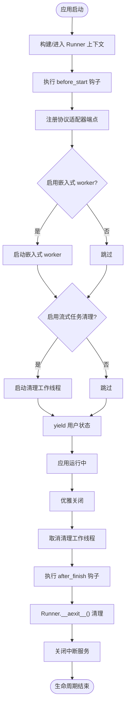
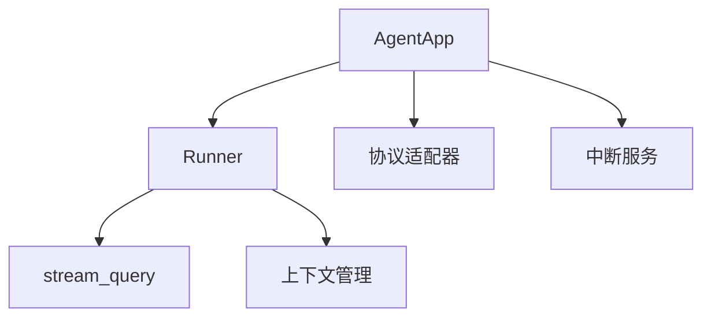

# 生命周期管理

<cite>
**本文引用的文件**
- [agent_app.py](file://src/agentscope_runtime/engine/app/agent_app.py)
- [runner.py](file://src/agentscope_runtime/engine/runner.py)
- [agent_app.md](file://cookbook/zh/agent_app.md)
- [test_agent_app.py](file://tests/integrated/test_agent_app.py)
- [test_agent_app_custom_endpoint.py](file://tests/unit/test_agent_app_custom_endpoint.py)
</cite>

## 目录
1. [简介](#简介)
2. [项目结构](#项目结构)
3. [核心组件](#核心组件)
4. [架构总览](#架构总览)
5. [详细组件分析](#详细组件分析)
6. [依赖分析](#依赖分析)
7. [性能考虑](#性能考虑)
8. [故障排查指南](#故障排查指南)
9. [结论](#结论)
10. [附录](#附录)

## 简介
本文围绕 AgentApp 的生命周期管理展开，重点阐述以下内容：
- _lifespan_manager 方法的工作原理，包括内部生命周期与用户生命周期的协调机制
- _internal_framework_lifespan 如何管理 Runner 的启动与清理，以及 before_start 与 after_finish 钩子的执行时机
- AsyncExitStack 的使用方式与异常处理机制
- 完整的生命周期流程图，覆盖从应用启动到优雅关闭的全过程
- 自定义生命周期钩子的实现示例与常见问题的解决方案

## 项目结构
AgentApp 生命周期管理相关的关键文件与职责：
- engine/app/agent_app.py：定义 AgentApp 类，集成 FastAPI，提供生命周期管理入口与内部 Runner 管理
- engine/runner.py：定义 Runner 类，负责实际的推理与流式处理，提供 async 上下文管理与清理
- cookbook/zh/agent_app.md：官方使用手册，包含生命周期管理的最佳实践与示例
- tests/integrated/test_agent_app.py 与 tests/unit/test_agent_app_custom_endpoint.py：测试用例，验证生命周期行为与流式输出

图表来源
- [agent_app.py:60-120](file://src/agentscope_runtime/engine/app/agent_app.py#L60-L120)
- [runner.py:46-120](file://src/agentscope_runtime/engine/runner.py#L46-L120)

章节来源
- [agent_app.py:60-120](file://src/agentscope_runtime/engine/app/agent_app.py#L60-L120)
- [runner.py:46-120](file://src/agentscope_runtime/engine/runner.py#L46-L120)

## 核心组件
- AgentApp：继承 FastAPI，提供统一的生命周期管理入口，负责 Runner 的绑定、协议适配器注册、中断服务初始化与健康检查端点等
- Runner：核心执行引擎，提供 async 上下文管理、流式查询、部署能力与资源清理
- 生命周期钩子：before_start、after_finish 与用户自定义 lifespan，分别在内部框架与用户逻辑之间进行协调

章节来源
- [agent_app.py:124-220](file://src/agentscope_runtime/engine/app/agent_app.py#L124-L220)
- [runner.py:46-120](file://src/agentscope_runtime/engine/runner.py#L46-L120)

## 架构总览
AgentApp 的生命周期由三部分协作完成：
- 内部框架生命周期：负责 Runner 的构建与启动、协议适配器端点注册、嵌入式 Celery worker 启动、流式任务清理工作线程等
- 用户生命周期：通过 lifespan 参数提供的 asynccontextmanager，实现用户自定义资源的初始化与清理
- 异常处理：在内部生命周期与用户生命周期的退出路径中，均进行异常捕获与日志记录，保证优雅关闭

图表来源
- [agent_app.py:248-337](file://src/agentscope_runtime/engine/app/agent_app.py#L248-L337)
- [runner.py:105-120](file://src/agentscope_runtime/engine/runner.py#L105-L120)

章节来源
- [agent_app.py:248-337](file://src/agentscope_runtime/engine/app/agent_app.py#L248-L337)
- [runner.py:105-120](file://src/agentscope_runtime/engine/runner.py#L105-L120)

## 详细组件分析

### _lifespan_manager：主生命周期编排器
- 职责：将内部框架生命周期与用户生命周期进行组合，确保两者按序执行并在异常时正确清理
- 执行流程：
  - 使用 AsyncExitStack 进入内部框架生命周期
  - 若存在用户 lifespan，则进入用户生命周期并获取 user_state
  - yield user_state 给上层应用使用
  - 异常时记录错误并向上抛出
- 协调机制：内部生命周期负责 Runner、协议适配器、中断服务等；用户生命周期负责业务资源（如数据库、缓存、会话等）

章节来源
- [agent_app.py:317-337](file://src/agentscope_runtime/engine/app/agent_app.py#L317-L337)

### _internal_framework_lifespan：内部框架生命周期
- 职责：负责 Runner 的构建与启动、before_start 钩子执行、协议适配器端点注册、嵌入式 Celery worker 启动、流式任务清理工作线程启动与清理、after_finish 钩子执行、Runner 与中断服务的清理
- 关键步骤：
  - 构建 Runner（_build_runner）
  - 退出并重新进入 Runner 上下文，确保干净状态
  - 执行 before_start（支持同步/异步）
  - 根据 stream 选择 query 或 stream_query，注册协议适配器端点
  - 启动嵌入式 Celery worker（条件满足时）
  - 启动流式任务清理工作线程
  - yield 控制权给用户生命周期
  - finally 中依次清理：取消任务清理任务、执行 after_finish、Runner 清理、中断服务关闭
- 异常处理：在 after_finish、Runner 清理、中断服务关闭各处捕获异常并记录日志，避免中断优雅关闭流程

章节来源
- [agent_app.py:248-316](file://src/agentscope_runtime/engine/app/agent_app.py#L248-L316)

### Runner 生命周期与清理
- 上下文管理：__aenter__ 调用 start，__aexit__ 调用 stop
- start：执行 init_handler（支持同步/异步），设置健康状态
- stop：执行 shutdown_handler（支持同步/异步），关闭 AsyncExitStack，重置健康状态
- 流式查询：stream_query 在运行前校验框架类型与健康状态，按不同框架类型选择适配器，输出标准化事件流

章节来源
- [runner.py:76-120](file://src/agentscope_runtime/engine/runner.py#L76-L120)
- [runner.py:199-356](file://src/agentscope_runtime/engine/runner.py#L199-L356)

### AsyncExitStack 使用与异常处理
- AsyncExitStack 用于组合多个异步上下文管理器，确保在异常或正常退出时按逆序清理
- 在 _lifespan_manager 中：
  - enter_async_context 内部框架生命周期
  - enter_async_context 用户生命周期（可选）
  - yield 返回用户状态
  - 异常时记录错误并抛出
- 在 _internal_framework_lifespan 中：
  - finally 块中清理任务清理任务、after_finish、Runner、中断服务，各处捕获异常并记录日志

章节来源
- [agent_app.py:317-337](file://src/agentscope_runtime/engine/app/agent_app.py#L317-L337)
- [agent_app.py:248-316](file://src/agentscope_runtime/engine/app/agent_app.py#L248-L316)

### 生命周期流程图（从启动到优雅关闭）

图表来源
- [agent_app.py:248-316](file://src/agentscope_runtime/engine/app/agent_app.py#L248-L316)
- [runner.py:105-120](file://src/agentscope_runtime/engine/runner.py#L105-L120)

章节来源
- [agent_app.py:248-316](file://src/agentscope_runtime/engine/app/agent_app.py#L248-L316)
- [runner.py:105-120](file://src/agentscope_runtime/engine/runner.py#L105-L120)

### 自定义生命周期钩子实现示例
- 使用 lifespan 参数（推荐）：定义 asynccontextmanager，启动阶段初始化资源，yield 将控制权交给 AgentApp，finally 执行清理
- 使用 before_start/after_finish：适用于简单逻辑，支持同步/异步函数

章节来源
- [agent_app.md:155-234](file://cookbook/zh/agent_app.md#L155-L234)
- [agent_app.py:133-134](file://src/agentscope_runtime/engine/app/agent_app.py#L133-L134)

### 常见问题与解决方案
- 旧版装饰器失效：init/shutdown 装饰器已废弃，统一迁移到 lifespan 模式
- Runner 未启动导致流式查询报错：确保在 lifespan 中正确初始化 Runner，或使用 @app.query 装饰器自动构建
- 中断服务未关闭：确认 _internal_framework_lifespan 的 finally 分支中已关闭中断服务
- 资源泄漏：使用 AsyncExitStack 管理资源，确保异常与正常退出路径均能清理

章节来源
- [agent_app.md:155-234](file://cookbook/zh/agent_app.md#L155-L234)
- [agent_app.py:248-316](file://src/agentscope_runtime/engine/app/agent_app.py#L248-L316)

## 依赖分析
- AgentApp 依赖 Runner 提供执行与清理能力
- AgentApp 通过协议适配器注册端点，支持多框架（agentscope、langgraph、agno、ms_agent_framework）
- 中断服务可选，支持本地与 Redis 后端，用于分布式任务中断
- 测试用例验证生命周期行为与流式输出，确保生命周期管理的正确性

图表来源
- [agent_app.py:60-120](file://src/agentscope_runtime/engine/app/agent_app.py#L60-L120)
- [runner.py:46-120](file://src/agentscope_runtime/engine/runner.py#L46-L120)

章节来源
- [agent_app.py:60-120](file://src/agentscope_runtime/engine/app/agent_app.py#L60-L120)
- [runner.py:46-120](file://src/agentscope_runtime/engine/runner.py#L46-L120)

## 性能考虑
- 流式任务清理工作线程定期清理过期任务，避免内存累积
- Runner 的健康状态检查与框架类型校验，避免无效调用
- 嵌入式 Celery worker 仅在启用时启动，减少不必要的资源消耗

## 故障排查指南
- 日志定位：内部生命周期与用户生命周期的异常均会被记录，优先查看生命周期相关日志
- 资源清理：确认 after_finish、Runner.__aexit__、中断服务关闭是否被执行
- 流式输出：验证协议适配器与流式查询路径，确保事件序列号与状态正确

章节来源
- [agent_app.py:248-316](file://src/agentscope_runtime/engine/app/agent_app.py#L248-L316)
- [runner.py:199-356](file://src/agentscope_runtime/engine/runner.py#L199-L356)

## 结论
AgentApp 的生命周期管理通过 _lifespan_manager 与 _internal_framework_lifespan 的协作，实现了内部框架与用户逻辑的有序衔接。借助 AsyncExitStack，生命周期在异常与正常退出时均能保证资源的正确清理。配合 Runner 的上下文管理与中断服务的生命周期，整体架构具备良好的可维护性与可扩展性。

## 附录
- 使用手册与示例：参见 cookbook/zh/agent_app.md 中的生命周期管理章节
- 测试用例参考：
  - 集成测试：验证流式输出与生命周期行为
  - 单元测试：验证自定义端点与流式错误处理

章节来源
- [agent_app.md:155-234](file://cookbook/zh/agent_app.md#L155-L234)
- [test_agent_app.py:1-200](file://tests/integrated/test_agent_app.py#L1-L200)
- [test_agent_app_custom_endpoint.py:1-398](file://tests/unit/test_agent_app_custom_endpoint.py#L1-L398)