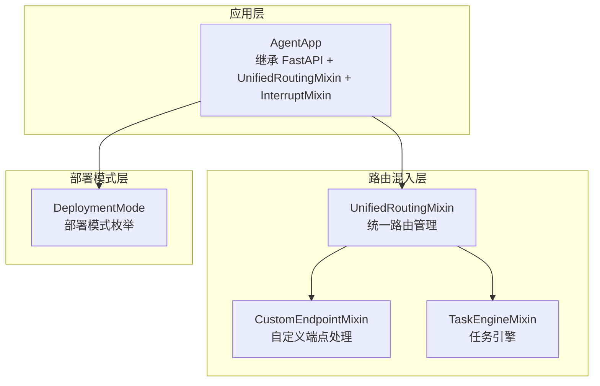
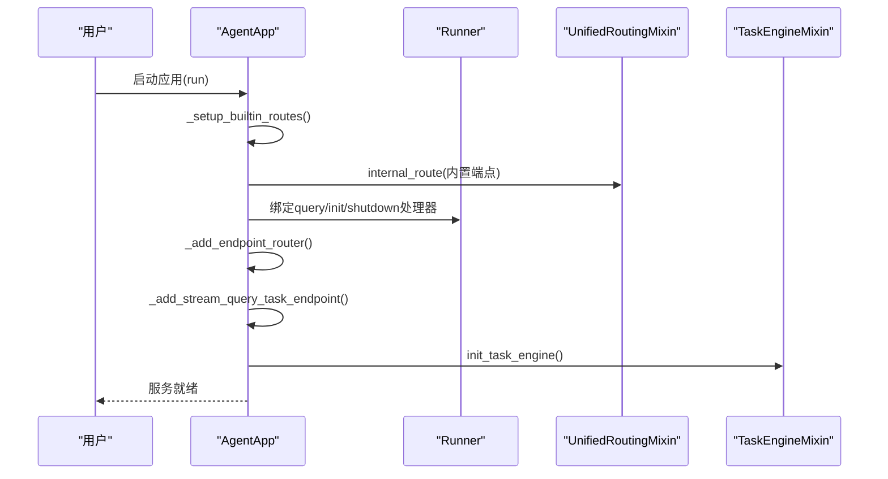
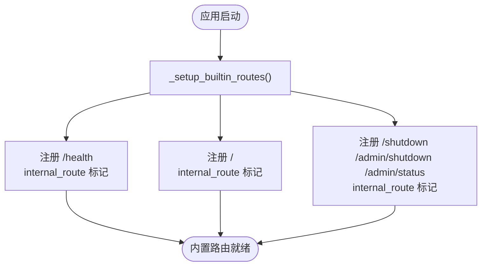
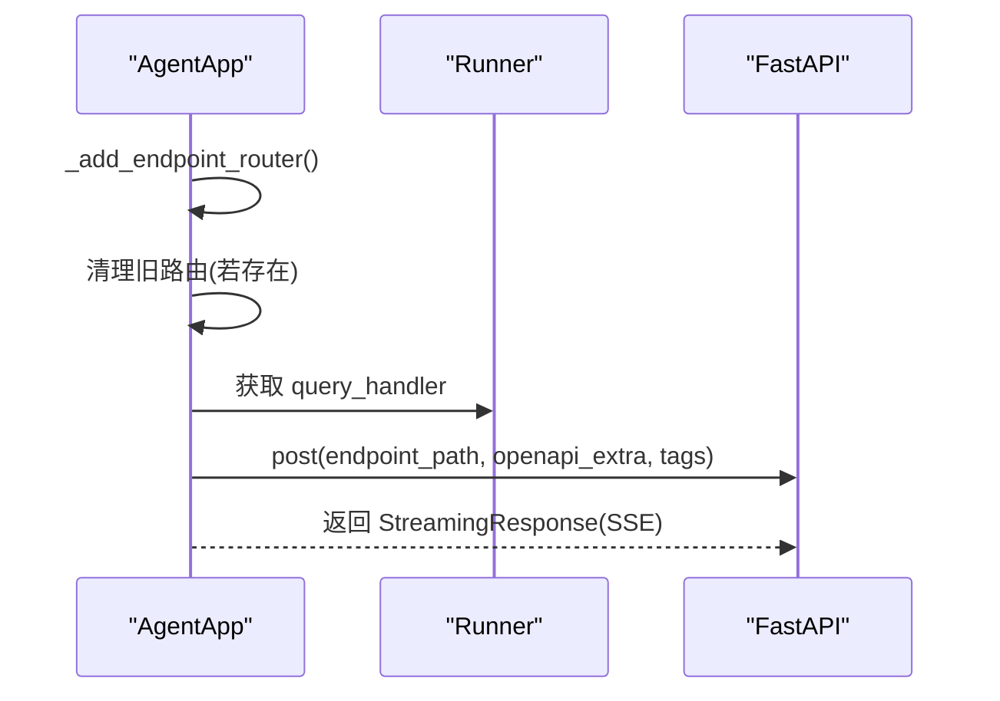
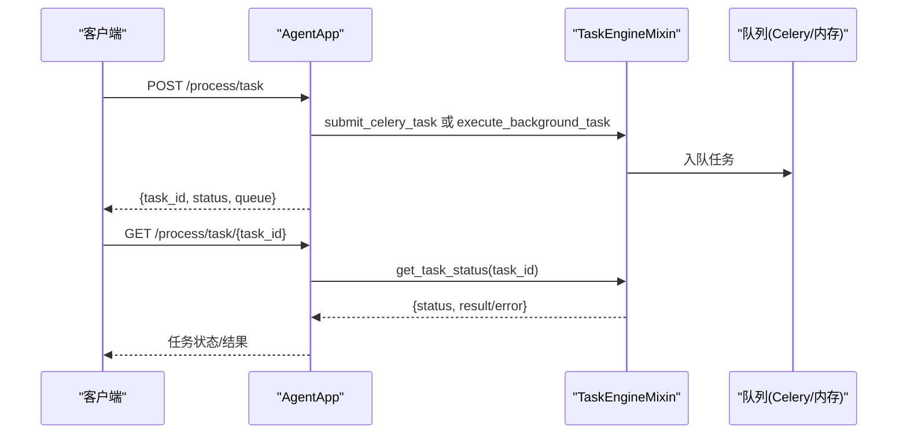
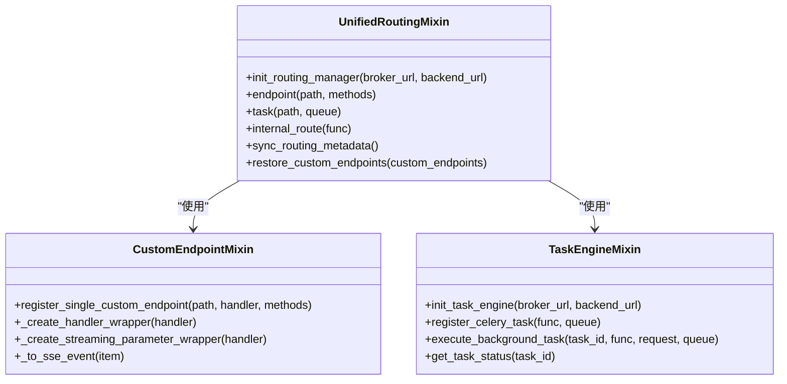
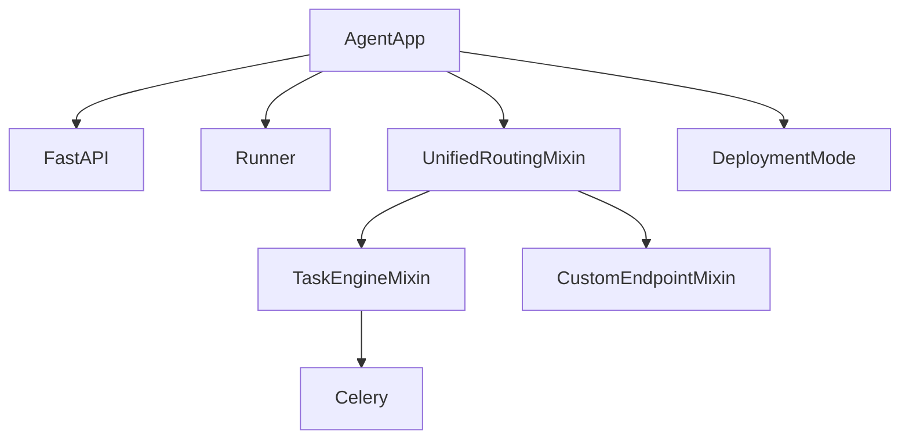

# 端点路由系统

<cite>
**本文档引用的文件**
- [agent_app.py](file://src/agentscope_runtime/engine/app/agent_app.py)
- [unified_routing_mixin.py](file://src/agentscope_runtime/engine/deployers/utils/service_utils/routing/unified_routing_mixin.py)
- [custom_endpoint_mixin.py](file://src/agentscope_runtime/engine/deployers/utils/service_utils/routing/custom_endpoint_mixin.py)
- [task_engine_mixin.py](file://src/agentscope_runtime/engine/deployers/utils/service_utils/routing/task_engine_mixin.py)
- [deployment_modes.py](file://src/agentscope_runtime/engine/deployers/utils/deployment_modes.py)
- [test_agent_app_custom_endpoint.py](file://tests/unit/test_agent_app_custom_endpoint.py)
- [test_agent_app.py](file://tests/integrated/test_agent_app.py)
</cite>

## 目录
1. [简介](#简介)
2. [项目结构](#项目结构)
3. [核心组件](#核心组件)
4. [架构总览](#架构总览)
5. [详细组件分析](#详细组件分析)
6. [依赖关系分析](#依赖关系分析)
7. [性能考虑](#性能考虑)
8. [故障排除指南](#故障排除指南)
9. [结论](#结论)
10. [附录](#附录)

## 简介
本文件面向AgentApp端点路由系统，系统性阐述内置路由注册机制（健康检查、根路径、进程控制端点）、动态端点路由实现（`_process_control_endpoints`、`_add_stream_query_task_endpoint`）、路由装饰器与优先级管理、与UnifiedRoutingMixin的集成、多部署模式下的路由配置支持，以及扩展指南（自定义端点添加与路由冲突解决）。同时提供完整配置示例与调试技巧，帮助开发者在不同部署环境中快速上手并稳定运行。

## 项目结构
AgentApp路由系统由三层组成：
- 应用层：AgentApp继承FastAPI与多个混入类，负责生命周期管理、协议适配器注入、内置路由注册与中间件设置。
- 路由混入层：UnifiedRoutingMixin提供统一的路由元数据同步、自定义端点恢复、任务端点装饰器等能力；CustomEndpointMixin负责自定义端点的参数解析与流式封装；TaskEngineMixin提供任务引擎初始化、Celery集成与后台任务执行。
- 部署模式层：通过DeploymentMode枚举与动态中间件，支持多种部署模式下的路由行为差异。

**图表来源**
- [agent_app.py:60-220](file://src/agentscope_runtime/engine/app/agent_app.py#L60-L220)
- [unified_routing_mixin.py:16-253](file://src/agentscope_runtime/engine/deployers/utils/service_utils/routing/unified_routing_mixin.py#L16-L253)
- [custom_endpoint_mixin.py:15-235](file://src/agentscope_runtime/engine/deployers/utils/service_utils/routing/custom_endpoint_mixin.py#L15-L235)
- [task_engine_mixin.py:13-391](file://src/agentscope_runtime/engine/deployers/utils/service_utils/routing/task_engine_mixin.py#L13-L391)
- [deployment_modes.py:7-15](file://src/agentscope_runtime/engine/deployers/utils/deployment_modes.py#L7-L15)

**章节来源**
- [agent_app.py:60-220](file://src/agentscope_runtime/engine/app/agent_app.py#L60-L220)
- [unified_routing_mixin.py:16-253](file://src/agentscope_runtime/engine/deployers/utils/service_utils/routing/unified_routing_mixin.py#L16-L253)
- [custom_endpoint_mixin.py:15-235](file://src/agentscope_runtime/engine/deployers/utils/service_utils/routing/custom_endpoint_mixin.py#L15-L235)
- [task_engine_mixin.py:13-391](file://src/agentscope_runtime/engine/deployers/utils/service_utils/routing/task_engine_mixin.py#L13-L391)
- [deployment_modes.py:7-15](file://src/agentscope_runtime/engine/deployers/utils/deployment_modes.py#L7-L15)

## 核心组件
- AgentApp：FastAPI子类，负责内置路由注册、协议适配器、生命周期管理、中间件与流式生成器。
- UnifiedRoutingMixin：统一路由管理，提供endpoint/task装饰器、内部路由标记、自定义端点元数据同步与恢复。
- CustomEndpointMixin：自定义端点注册与包装，支持同步/异步/生成器函数，自动参数解析与SSE封装。
- TaskEngineMixin：任务引擎初始化与执行，支持Celery分布式队列与内存回退模式，提供任务提交、状态查询与清理。
- DeploymentMode：部署模式枚举，配合动态中间件影响响应头与行为。

**章节来源**
- [agent_app.py:60-220](file://src/agentscope_runtime/engine/app/agent_app.py#L60-L220)
- [unified_routing_mixin.py:16-253](file://src/agentscope_runtime/engine/deployers/utils/service_utils/routing/unified_routing_mixin.py#L16-L253)
- [custom_endpoint_mixin.py:15-235](file://src/agentscope_runtime/engine/deployers/utils/service_utils/routing/custom_endpoint_mixin.py#L15-L235)
- [task_engine_mixin.py:13-391](file://src/agentscope_runtime/engine/deployers/utils/service_utils/routing/task_engine_mixin.py#L13-L391)
- [deployment_modes.py:7-15](file://src/agentscope_runtime/engine/deployers/utils/deployment_modes.py#L7-L15)

## 架构总览
AgentApp在启动时完成以下关键步骤：
- 初始化路由管理器（任务引擎）与内置路由（健康检查、根路径、进程控制端点）。
- 注册协议适配器端点（如A2A、ResponseAPI、AGUI）。
- 根据配置启用嵌入式Celery工作线程或内存任务执行。
- 启动任务清理协程（可选）。
- 提供动态端点注册与任务端点（/process/task与GET /process/task/{task_id}）。

**图表来源**
- [agent_app.py:248-339](file://src/agentscope_runtime/engine/app/agent_app.py#L248-L339)
- [agent_app.py:382-425](file://src/agentscope_runtime/engine/app/agent_app.py#L382-L425)
- [agent_app.py:781-846](file://src/agentscope_runtime/engine/app/agent_app.py#L781-L846)
- [agent_app.py:497-597](file://src/agentscope_runtime/engine/app/agent_app.py#L497-L597)
- [unified_routing_mixin.py:17-24](file://src/agentscope_runtime/engine/deployers/utils/service_utils/routing/unified_routing_mixin.py#L17-L24)
- [task_engine_mixin.py:14-46](file://src/agentscope_runtime/engine/deployers/utils/service_utils/routing/task_engine_mixin.py#L14-L46)

**章节来源**
- [agent_app.py:248-339](file://src/agentscope_runtime/engine/app/agent_app.py#L248-L339)
- [agent_app.py:382-425](file://src/agentscope_runtime/engine/app/agent_app.py#L382-L425)
- [agent_app.py:781-846](file://src/agentscope_runtime/engine/app/agent_app.py#L781-L846)
- [agent_app.py:497-597](file://src/agentscope_runtime/engine/app/agent_app.py#L497-L597)
- [unified_routing_mixin.py:17-24](file://src/agentscope_runtime/engine/deployers/utils/service_utils/routing/unified_routing_mixin.py#L17-L24)
- [task_engine_mixin.py:14-46](file://src/agentscope_runtime/engine/deployers/utils/service_utils/routing/task_engine_mixin.py#L14-L46)

## 详细组件分析

### 内置路由注册机制
AgentApp在构造阶段调用`_setup_builtin_routes`注册三类内置端点，并使用`UnifiedRoutingMixin.internal_route`标记为内部系统路由，避免被自定义端点元数据收集。

- 健康检查端点：GET /health，返回服务状态与部署模式。
- 根路径端点：GET /，返回服务信息与可用端点列表（含/health、/process、/process/stream、/process/task等）。
- 进程控制端点：POST /shutdown（简单关闭）、POST /admin/shutdown（带延迟关闭）、GET /admin/status（进程状态信息）。

**图表来源**
- [agent_app.py:382-425](file://src/agentscope_runtime/engine/app/agent_app.py#L382-L425)
- [agent_app.py:598-642](file://src/agentscope_runtime/engine/app/agent_app.py#L598-L642)
- [unified_routing_mixin.py:240-252](file://src/agentscope_runtime/engine/deployers/utils/service_utils/routing/unified_routing_mixin.py#L240-L252)

**章节来源**
- [agent_app.py:382-425](file://src/agentscope_runtime/engine/app/agent_app.py#L382-L425)
- [agent_app.py:598-642](file://src/agentscope_runtime/engine/app/agent_app.py#L598-L642)
- [unified_routing_mixin.py:240-252](file://src/agentscope_runtime/engine/deployers/utils/service_utils/routing/unified_routing_mixin.py#L240-L252)

### 动态端点路由实现
AgentApp通过`_add_endpoint_router`动态构建主推理端点`/process`，该端点基于Runner的query_handler进行流式生成。端点注册前会清理同名旧路由，确保幂等性。

**图表来源**
- [agent_app.py:781-846](file://src/agentscope_runtime/engine/app/agent_app.py#L781-L846)

**章节来源**
- [agent_app.py:781-846](file://src/agentscope_runtime/engine/app/agent_app.py#L781-L846)

### 流式查询任务端点
当启用`enable_stream_task`时，AgentApp注册两个任务端点：
- POST /process/task：提交流式查询任务，返回task_id与队列信息；支持Celery或内存模式。
- GET /process/task/{task_id}：轮询任务状态与结果，仅存储最终响应事件。

**图表来源**
- [agent_app.py:497-597](file://src/agentscope_runtime/engine/app/agent_app.py#L497-L597)
- [task_engine_mixin.py:112-160](file://src/agentscope_runtime/engine/deployers/utils/service_utils/routing/task_engine_mixin.py#L112-L160)
- [task_engine_mixin.py:349-391](file://src/agentscope_runtime/engine/deployers/utils/service_utils/routing/task_engine_mixin.py#L349-L391)

**章节来源**
- [agent_app.py:497-597](file://src/agentscope_runtime/engine/app/agent_app.py#L497-L597)
- [task_engine_mixin.py:112-160](file://src/agentscope_runtime/engine/deployers/utils/service_utils/routing/task_engine_mixin.py#L112-L160)
- [task_engine_mixin.py:349-391](file://src/agentscope_runtime/engine/deployers/utils/service_utils/routing/task_engine_mixin.py#L349-L391)

### 路由装饰器与优先级管理
- endpoint装饰器：用于注册自定义端点，支持同步/异步/生成器函数，自动参数解析与SSE封装。
- task装饰器：注册可后台执行的任务端点，自动生成状态查询端点`{path}/{task_id}`。
- internal_route装饰器：将路由标记为内部系统路由，避免被自定义端点元数据收集。
- 元数据同步：`sync_routing_metadata`遍历所有路由，过滤内部路径与系统路由，生成可发现的自定义端点清单。
- 自定义端点恢复：`restore_custom_endpoints`根据元数据重建路由，确保重启/迁移后路由一致性。

**图表来源**
- [unified_routing_mixin.py:16-253](file://src/agentscope_runtime/engine/deployers/utils/service_utils/routing/unified_routing_mixin.py#L16-L253)
- [custom_endpoint_mixin.py:15-235](file://src/agentscope_runtime/engine/deployers/utils/service_utils/routing/custom_endpoint_mixin.py#L15-L235)
- [task_engine_mixin.py:13-391](file://src/agentscope_runtime/engine/deployers/utils/service_utils/routing/task_engine_mixin.py#L13-L391)

**章节来源**
- [unified_routing_mixin.py:103-114](file://src/agentscope_runtime/engine/deployers/utils/service_utils/routing/unified_routing_mixin.py#L103-L114)
- [unified_routing_mixin.py:240-252](file://src/agentscope_runtime/engine/deployers/utils/service_utils/routing/unified_routing_mixin.py#L240-L252)
- [unified_routing_mixin.py:120-185](file://src/agentscope_runtime/engine/deployers/utils/service_utils/routing/unified_routing_mixin.py#L120-L185)
- [unified_routing_mixin.py:186-237](file://src/agentscope_runtime/engine/deployers/utils/service_utils/routing/unified_routing_mixin.py#L186-L237)

### 与UnifiedRoutingMixin的集成
AgentApp直接继承UnifiedRoutingMixin以获得统一路由管理能力：
- 在构造阶段调用`init_routing_manager`初始化任务引擎。
- 使用`internal_route`装饰内置端点，确保其不被纳入自定义端点元数据。
- 在生命周期中注册协议适配器端点，随后根据配置启用任务端点与清理协程。

**章节来源**
- [agent_app.py:164](file://src/agentscope_runtime/engine/app/agent_app.py#L164)
- [agent_app.py:273-274](file://src/agentscope_runtime/engine/app/agent_app.py#L273-L274)
- [agent_app.py:385-400](file://src/agentscope_runtime/engine/app/agent_app.py#L385-L400)
- [agent_app.py:402-422](file://src/agentscope_runtime/engine/app/agent_app.py#L402-L422)

### 多部署模式下的路由配置
AgentApp通过动态中间件为不同部署模式设置响应头：
- DETACHED_PROCESS：添加X-Process-Mode: detached。
- STANDALONE：添加X-Deployment-Mode: standalone。
结合DeploymentMode枚举，可实现对不同部署形态的差异化行为。

**章节来源**
- [agent_app.py:374-379](file://src/agentscope_runtime/engine/app/agent_app.py#L374-L379)
- [deployment_modes.py:7-15](file://src/agentscope_runtime/engine/deployers/utils/deployment_modes.py#L7-L15)

## 依赖关系分析
- AgentApp依赖FastAPI进行路由与中间件管理，依赖Runner进行推理与流式生成。
- UnifiedRoutingMixin依赖TaskEngineMixin与CustomEndpointMixin实现统一路由与任务管理。
- TaskEngineMixin可选依赖Celery，提供分布式任务执行；否则回退到内存任务执行。
- DeploymentMode影响中间件行为，从而影响路由对外暴露的头部信息。

**图表来源**
- [agent_app.py:16-51](file://src/agentscope_runtime/engine/app/agent_app.py#L16-L51)
- [unified_routing_mixin.py:16-11](file://src/agentscope_runtime/engine/deployers/utils/service_utils/routing/unified_routing_mixin.py#L16-L11)
- [task_engine_mixin.py:25-46](file://src/agentscope_runtime/engine/deployers/utils/service_utils/routing/task_engine_mixin.py#L25-L46)
- [deployment_modes.py:7-15](file://src/agentscope_runtime/engine/deployers/utils/deployment_modes.py#L7-L15)

**章节来源**
- [agent_app.py:16-51](file://src/agentscope_runtime/engine/app/agent_app.py#L16-L51)
- [unified_routing_mixin.py:16-11](file://src/agentscope_runtime/engine/deployers/utils/service_utils/routing/unified_routing_mixin.py#L16-L11)
- [task_engine_mixin.py:25-46](file://src/agentscope_runtime/engine/deployers/utils/service_utils/routing/task_engine_mixin.py#L25-L46)
- [deployment_modes.py:7-15](file://src/agentscope_runtime/engine/deployers/utils/deployment_modes.py#L7-L15)

## 性能考虑
- 流式任务仅保存最终响应事件，减少内存占用，适合长时间流式任务。
- Celery模式下，任务在独立工作线程/进程中执行，避免阻塞主请求循环。
- 内存模式下，使用线程池执行生成器/同步函数，注意CPU密集型任务可能阻塞事件循环。
- 任务清理协程定期清理过期任务，防止active_tasks膨胀。

[本节为通用指导，无需具体文件分析]

## 故障排除指南
- 内置端点未生效：确认是否使用`@UnifiedRoutingMixin.internal_route`装饰器标记，以及是否在`_setup_builtin_routes`中注册。
- 自定义端点无法访问：检查`sync_routing_metadata`是否正确过滤内部路由；确认端点路径未与内置路由冲突。
- 任务端点返回错误：检查Celery配置（broker_url/backend_url），或确认内存模式下是否正确初始化任务锁与活跃任务表。
- 流式端点异常：检查自定义端点包装器是否正确处理异常并返回SSE错误事件。
- 调试技巧：
  - 使用测试用例中的SSE解析工具验证事件格式。
  - 通过GET /admin/status检查进程状态与资源使用情况。
  - 在不同部署模式下观察响应头差异（X-Process-Mode、X-Deployment-Mode）。

**章节来源**
- [unified_routing_mixin.py:120-185](file://src/agentscope_runtime/engine/deployers/utils/service_utils/routing/unified_routing_mixin.py#L120-L185)
- [custom_endpoint_mixin.py:157-206](file://src/agentscope_runtime/engine/deployers/utils/service_utils/routing/custom_endpoint_mixin.py#L157-L206)
- [agent_app.py:628-642](file://src/agentscope_runtime/engine/app/agent_app.py#L628-L642)
- [test_agent_app_custom_endpoint.py:19-44](file://tests/unit/test_agent_app_custom_endpoint.py#L19-L44)

## 结论
AgentApp端点路由系统通过统一的路由管理与任务引擎，实现了从内置端点到自定义端点的全栈路由能力。借助装饰器与元数据同步机制，系统在多部署模式下保持一致的行为与可观测性。开发者可通过endpoint/task装饰器快速扩展功能，同时利用internal_route与元数据同步机制避免路由冲突，确保系统稳定运行。

[本节为总结，无需具体文件分析]

## 附录

### 扩展指南：自定义端点添加
- 使用endpoint装饰器注册自定义端点，支持同步/异步/生成器函数，自动参数解析与SSE封装。
- 若需后台任务，使用task装饰器，系统将自动生成状态查询端点。
- 注意端点路径唯一性，避免与内置路由冲突。

**章节来源**
- [unified_routing_mixin.py:103-114](file://src/agentscope_runtime/engine/deployers/utils/service_utils/routing/unified_routing_mixin.py#L103-L114)
- [custom_endpoint_mixin.py:15-58](file://src/agentscope_runtime/engine/deployers/utils/service_utils/routing/custom_endpoint_mixin.py#L15-L58)

### 路由冲突解决方法
- 使用internal_route装饰器标记内部系统路由，避免被元数据收集。
- 在`restore_custom_endpoints`前清理旧路由，确保幂等性。
- 检查`sync_routing_metadata`过滤逻辑，确保内部路径与系统路由不被收录。

**章节来源**
- [unified_routing_mixin.py:240-252](file://src/agentscope_runtime/engine/deployers/utils/service_utils/routing/unified_routing_mixin.py#L240-L252)
- [unified_routing_mixin.py:186-237](file://src/agentscope_runtime/engine/deployers/utils/service_utils/routing/unified_routing_mixin.py#L186-L237)
- [agent_app.py:867-875](file://src/agentscope_runtime/engine/app/agent_app.py#L867-L875)

### 完整路由配置示例
- 启用流式任务：设置`enable_stream_task=True`，AgentApp将注册POST /process/task与GET /process/task/{task_id}。
- 自定义端点：使用`@app.endpoint("/your-path")`注册端点，支持查询参数与请求体模型。
- 协议适配器：默认注册A2A、ResponseAPI、AGUI适配器端点，可在构造时传入自定义适配器列表。

**章节来源**
- [agent_app.py:149-219](file://src/agentscope_runtime/engine/app/agent_app.py#L149-L219)
- [agent_app.py:340-357](file://src/agentscope_runtime/engine/app/agent_app.py#L340-L357)
- [agent_app.py:497-597](file://src/agentscope_runtime/engine/app/agent_app.py#L497-L597)

### 调试技巧
- 使用测试用例中的SSE解析工具验证事件格式与错误事件。
- 通过GET /admin/status检查进程状态与资源使用情况。
- 在不同部署模式下观察响应头差异，辅助定位部署相关问题。

**章节来源**
- [test_agent_app_custom_endpoint.py:19-44](file://tests/unit/test_agent_app_custom_endpoint.py#L19-L44)
- [agent_app.py:628-642](file://src/agentscope_runtime/engine/app/agent_app.py#L628-L642)
- [agent_app.py:374-379](file://src/agentscope_runtime/engine/app/agent_app.py#L374-L379)