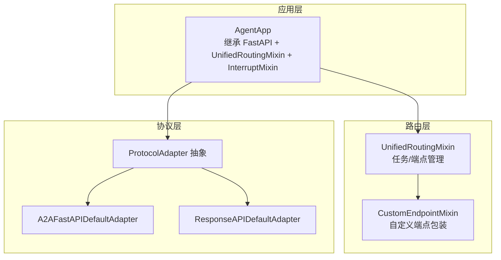
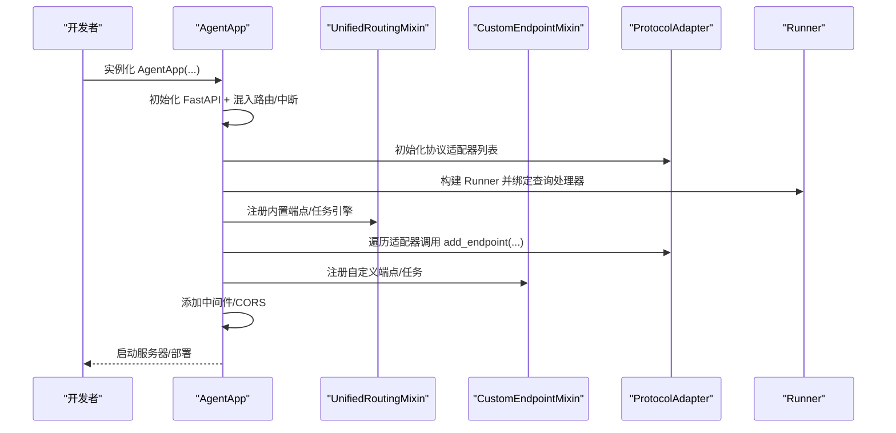
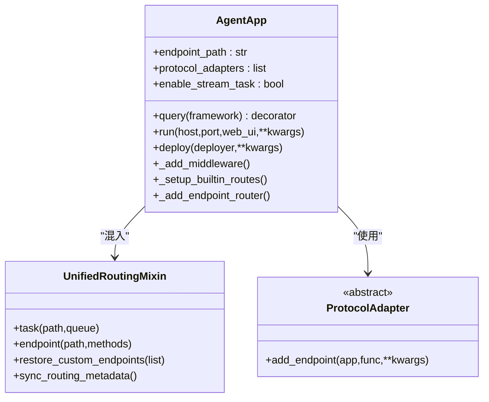
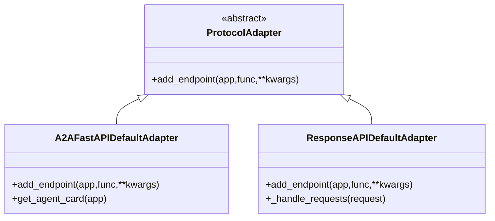
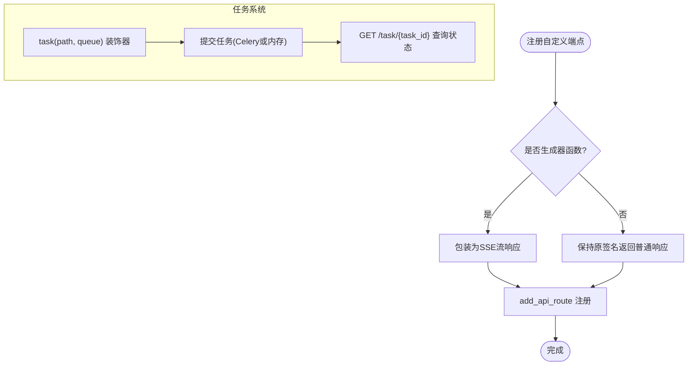
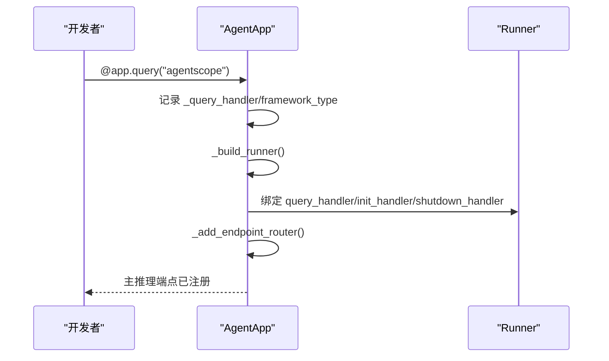
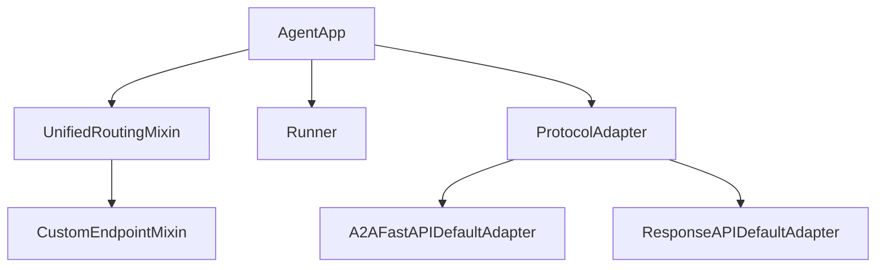

# 自定义扩展开发

<cite>
**本文引用的文件**
- [agent_app.py](file://src/agentscope_runtime/engine/app/agent_app.py)
- [protocol_adapter.py](file://src/agentscope_runtime/engine/deployers/adapter/protocol_adapter.py)
- [unified_routing_mixin.py](file://src/agentscope_runtime/engine/deployers/utils/service_utils/routing/unified_routing_mixin.py)
- [custom_endpoint_mixin.py](file://src/agentscope_runtime/engine/deployers/utils/service_utils/routing/custom_endpoint_mixin.py)
- [fastapi_factory.py](file://src/agentscope_runtime/engine/deployers/utils/service_utils/fastapi_factory.py)
- [a2a_protocol_adapter.py](file://src/agentscope_runtime/engine/deployers/adapter/a2a/a2a_protocol_adapter.py)
- [response_api_protocol_adapter.py](file://src/agentscope_runtime/engine/deployers/adapter/responses/response_api_protocol_adapter.py)
- [base.py](file://src/agentscope_runtime/engine/deployers/base.py)
</cite>

## 目录
1. [简介](#简介)
2. [项目结构](#项目结构)
3. [核心组件](#核心组件)
4. [架构总览](#架构总览)
5. [详细组件分析](#详细组件分析)
6. [依赖分析](#依赖分析)
7. [性能考虑](#性能考虑)
8. [故障排查指南](#故障排查指南)
9. [结论](#结论)
10. [附录：完整扩展开发示例](#附录完整扩展开发示例)

## 简介
本指南面向需要在 AgentScope Runtime 上进行“自定义扩展开发”的工程师，围绕以下目标展开：
- 如何继承 AgentApp 类进行功能扩展（中间件、路由、生命周期钩子）
- 如何实现自定义协议适配器并集成到 AgentApp 中
- 如何开发自定义查询处理器（query handler）并将其注入 Runner
- 如何扩展现有端点路由系统，添加业务特定的 API 接口
- 提供可复用的扩展开发示例、测试策略与部署注意事项
- 明确扩展与核心功能的兼容性要求

## 项目结构
AgentApp 的扩展能力由三层协同实现：
- 应用层：AgentApp 继承 FastAPI 并混入统一路由与中断能力
- 路由层：UnifiedRoutingMixin 提供任务队列、自定义端点注册与元数据同步
- 协议层：ProtocolAdapter 抽象协议适配器，内置 A2A 与 Response API 适配器

图表来源
- [agent_app.py:60-220](file://src/agentscope_runtime/engine/app/agent_app.py#L60-L220)
- [unified_routing_mixin.py:16-100](file://src/agentscope_runtime/engine/deployers/utils/service_utils/routing/unified_routing_mixin.py#L16-L100)
- [custom_endpoint_mixin.py:15-58](file://src/agentscope_runtime/engine/deployers/utils/service_utils/routing/custom_endpoint_mixin.py#L15-L58)
- [protocol_adapter.py:6-25](file://src/agentscope_runtime/engine/deployers/adapter/protocol_adapter.py#L6-L25)
- [a2a_protocol_adapter.py:136-258](file://src/agentscope_runtime/engine/deployers/adapter/a2a/a2a_protocol_adapter.py#L136-L258)
- [response_api_protocol_adapter.py:33-315](file://src/agentscope_runtime/engine/deployers/adapter/responses/response_api_protocol_adapter.py#L33-L315)

章节来源
- [agent_app.py:60-220](file://src/agentscope_runtime/engine/app/agent_app.py#L60-L220)
- [unified_routing_mixin.py:16-100](file://src/agentscope_runtime/engine/deployers/utils/service_utils/routing/unified_routing_mixin.py#L16-L100)
- [custom_endpoint_mixin.py:15-58](file://src/agentscope_runtime/engine/deployers/utils/service_utils/routing/custom_endpoint_mixin.py#L15-L58)
- [protocol_adapter.py:6-25](file://src/agentscope_runtime/engine/deployers/adapter/protocol_adapter.py#L6-L25)

## 核心组件
- AgentApp：FastAPI 子类，负责生命周期管理、内置路由、协议适配器注册、中间件注入、Runner 注入与查询处理端点生成
- UnifiedRoutingMixin：提供任务提交/状态查询、自定义端点注册与恢复、内部路由标记等能力
- CustomEndpointMixin：封装自定义端点的注册逻辑，支持同步/异步/生成器函数，自动参数解析与 SSE 包装
- ProtocolAdapter 及其默认实现：A2A 与 Response API 适配器，负责向应用注册协议特定端点

章节来源
- [agent_app.py:60-220](file://src/agentscope_runtime/engine/app/agent_app.py#L60-L220)
- [unified_routing_mixin.py:16-100](file://src/agentscope_runtime/engine/deployers/utils/service_utils/routing/unified_routing_mixin.py#L16-L100)
- [custom_endpoint_mixin.py:15-58](file://src/agentscope_runtime/engine/deployers/utils/service_utils/routing/custom_endpoint_mixin.py#L15-L58)
- [protocol_adapter.py:6-25](file://src/agentscope_runtime/engine/deployers/adapter/protocol_adapter.py#L6-L25)

## 架构总览
AgentApp 的启动流程与扩展点如下：

图表来源
- [agent_app.py:124-220](file://src/agentscope_runtime/engine/app/agent_app.py#L124-L220)
- [agent_app.py:248-316](file://src/agentscope_runtime/engine/app/agent_app.py#L248-L316)
- [unified_routing_mixin.py:17-100](file://src/agentscope_runtime/engine/deployers/utils/service_utils/routing/unified_routing_mixin.py#L17-L100)
- [custom_endpoint_mixin.py:15-58](file://src/agentscope_runtime/engine/deployers/utils/service_utils/routing/custom_endpoint_mixin.py#L15-L58)
- [protocol_adapter.py:10-25](file://src/agentscope_runtime/engine/deployers/adapter/protocol_adapter.py#L10-L25)

## 详细组件分析

### 组件一：AgentApp 扩展点与生命周期
- 查询处理器注入：通过装饰器方式注入 query handler，并绑定到 Runner
- 内置端点：健康检查、根路径信息、进程控制等
- 协议适配器：默认注册 A2A、Response API、AGUI 适配器
- 中间件：CORS 与按部署模式动态设置响应头
- 运行时配置热更新：支持运行时修改 endpoint_path、protocol_adapters、custom_endpoints 等

图表来源
- [agent_app.py:124-220](file://src/agentscope_runtime/engine/app/agent_app.py#L124-L220)
- [agent_app.py:722-740](file://src/agentscope_runtime/engine/app/agent_app.py#L722-L740)
- [unified_routing_mixin.py:16-100](file://src/agentscope_runtime/engine/deployers/utils/service_utils/routing/unified_routing_mixin.py#L16-L100)
- [protocol_adapter.py:6-25](file://src/agentscope_runtime/engine/deployers/adapter/protocol_adapter.py#L6-L25)

章节来源
- [agent_app.py:124-220](file://src/agentscope_runtime/engine/app/agent_app.py#L124-L220)
- [agent_app.py:248-316](file://src/agentscope_runtime/engine/app/agent_app.py#L248-L316)
- [agent_app.py:722-740](file://src/agentscope_runtime/engine/app/agent_app.py#L722-L740)

### 组件二：自定义协议适配器
- 协议适配器抽象：ProtocolAdapter 定义 add_endpoint(app, func, **kwargs)
- 默认实现：
  - A2A 适配器：注册 JSON-RPC 与 well-known 端点，支持注册中心注册
  - Response API 适配器：注册 OpenAI 兼容的响应端点，支持流式与非流式
- 集成方式：AgentApp 在生命周期中遍历 protocol_adapters 列表并调用 add_endpoint

图表来源
- [protocol_adapter.py:6-25](file://src/agentscope_runtime/engine/deployers/adapter/protocol_adapter.py#L6-L25)
- [a2a_protocol_adapter.py:136-258](file://src/agentscope_runtime/engine/deployers/adapter/a2a/a2a_protocol_adapter.py#L136-L258)
- [response_api_protocol_adapter.py:33-315](file://src/agentscope_runtime/engine/deployers/adapter/responses/response_api_protocol_adapter.py#L33-L315)

章节来源
- [protocol_adapter.py:6-25](file://src/agentscope_runtime/engine/deployers/adapter/protocol_adapter.py#L6-L25)
- [a2a_protocol_adapter.py:136-258](file://src/agentscope_runtime/engine/deployers/adapter/a2a/a2a_protocol_adapter.py#L136-L258)
- [response_api_protocol_adapter.py:33-315](file://src/agentscope_runtime/engine/deployers/adapter/responses/response_api_protocol_adapter.py#L33-L315)

### 组件三：自定义端点与任务系统
- 自定义端点注册：endpoint(path, methods) 装饰器，支持同步/异步/生成器函数，自动参数解析与 SSE 包装
- 任务系统：task(path, queue) 装饰器，支持 Celery 或内存队列，提供任务提交与状态查询
- 路由元数据同步：sync_routing_metadata 与 restore_custom_endpoints 支持端点持久化与恢复

图表来源
- [custom_endpoint_mixin.py:15-58](file://src/agentscope_runtime/engine/deployers/utils/service_utils/routing/custom_endpoint_mixin.py#L15-L58)
- [custom_endpoint_mixin.py:126-235](file://src/agentscope_runtime/engine/deployers/utils/service_utils/routing/custom_endpoint_mixin.py#L126-L235)
- [unified_routing_mixin.py:25-99](file://src/agentscope_runtime/engine/deployers/utils/service_utils/routing/unified_routing_mixin.py#L25-L99)
- [unified_routing_mixin.py:186-237](file://src/agentscope_runtime/engine/deployers/utils/service_utils/routing/unified_routing_mixin.py#L186-L237)

章节来源
- [custom_endpoint_mixin.py:15-58](file://src/agentscope_runtime/engine/deployers/utils/service_utils/routing/custom_endpoint_mixin.py#L15-L58)
- [custom_endpoint_mixin.py:126-235](file://src/agentscope_runtime/engine/deployers/utils/service_utils/routing/custom_endpoint_mixin.py#L126-L235)
- [unified_routing_mixin.py:25-99](file://src/agentscope_runtime/engine/deployers/utils/service_utils/routing/unified_routing_mixin.py#L25-L99)
- [unified_routing_mixin.py:186-237](file://src/agentscope_runtime/engine/deployers/utils/service_utils/routing/unified_routing_mixin.py#L186-L237)

### 组件四：查询处理器与 Runner 绑定
- query(framework) 装饰器：绑定用户自定义查询处理器到 Runner
- _build_runner：将装饰器绑定到 Runner 的 query_handler/init_handler/shutdown_handler
- _add_endpoint_router：根据 Runner 的 query_handler 动态生成主推理端点

图表来源
- [agent_app.py:722-740](file://src/agentscope_runtime/engine/app/agent_app.py#L722-L740)
- [agent_app.py:760-780](file://src/agentscope_runtime/engine/app/agent_app.py#L760-L780)
- [agent_app.py:781-845](file://src/agentscope_runtime/engine/app/agent_app.py#L781-L845)

章节来源
- [agent_app.py:722-740](file://src/agentscope_runtime/engine/app/agent_app.py#L722-L740)
- [agent_app.py:760-780](file://src/agentscope_runtime/engine/app/agent_app.py#L760-L780)
- [agent_app.py:781-845](file://src/agentscope_runtime/engine/app/agent_app.py#L781-L845)

## 依赖分析
- AgentApp 依赖：
  - FastAPI 基础框架与生命周期
  - UnifiedRoutingMixin：统一路由与任务引擎
  - ProtocolAdapter：协议适配器抽象
  - Runner：查询执行器
- 协议适配器依赖：
  - A2A 适配器：依赖 a2a.server.* 与注册中心
  - Response API 适配器：依赖 openai.types.responses 与自定义执行器
- 路由与端点：
  - CustomEndpointMixin 与 UnifiedRoutingMixin 提供端点注册与任务管理
  - FastAPIAppFactory（已弃用）曾提供工厂模式，现直接使用 AgentApp

图表来源
- [agent_app.py:60-220](file://src/agentscope_runtime/engine/app/agent_app.py#L60-L220)
- [protocol_adapter.py:6-25](file://src/agentscope_runtime/engine/deployers/adapter/protocol_adapter.py#L6-L25)
- [a2a_protocol_adapter.py:136-258](file://src/agentscope_runtime/engine/deployers/adapter/a2a/a2a_protocol_adapter.py#L136-L258)
- [response_api_protocol_adapter.py:33-315](file://src/agentscope_runtime/engine/deployers/adapter/responses/response_api_protocol_adapter.py#L33-L315)
- [unified_routing_mixin.py:16-100](file://src/agentscope_runtime/engine/deployers/utils/service_utils/routing/unified_routing_mixin.py#L16-L100)
- [custom_endpoint_mixin.py:15-58](file://src/agentscope_runtime/engine/deployers/utils/service_utils/routing/custom_endpoint_mixin.py#L15-L58)

章节来源
- [agent_app.py:60-220](file://src/agentscope_runtime/engine/app/agent_app.py#L60-L220)
- [protocol_adapter.py:6-25](file://src/agentscope_runtime/engine/deployers/adapter/protocol_adapter.py#L6-L25)
- [a2a_protocol_adapter.py:136-258](file://src/agentscope_runtime/engine/deployers/adapter/a2a/a2a_protocol_adapter.py#L136-L258)
- [response_api_protocol_adapter.py:33-315](file://src/agentscope_runtime/engine/deployers/adapter/responses/response_api_protocol_adapter.py#L33-L315)
- [unified_routing_mixin.py:16-100](file://src/agentscope_runtime/engine/deployers/utils/service_utils/routing/unified_routing_mixin.py#L16-L100)
- [custom_endpoint_mixin.py:15-58](file://src/agentscope_runtime/engine/deployers/utils/service_utils/routing/custom_endpoint_mixin.py#L15-L58)

## 性能考虑
- 流式响应：默认使用 SSE，注意客户端缓冲与超时控制
- 并发限制：Response API 适配器使用信号量限制并发请求
- 任务清理：启用流式任务时，定期清理过期任务，避免内存泄漏
- 中间件开销：CORS 与动态响应头仅在必要时添加，避免重复计算

## 故障排查指南
- 查询处理器未生效
  - 检查是否正确使用 @app.query(...) 装饰器并传入允许的框架类型
  - 确认 _build_runner 已被调用且已绑定到 Runner
- 自定义端点不生效
  - 使用 endpoint(...) 装饰器注册；确认方法列表与路径无冲突
  - 若使用任务系统，检查队列配置与 Celery 是否可用
- 协议适配器端点缺失
  - 确认 protocol_adapters 列表已初始化并在生命周期中被遍历
  - A2A 适配器需确保注册中心可用或禁用注册
- 任务状态查询失败
  - 检查 task(path, queue) 装饰器是否正确注册了状态查询路由
  - 查看 active_tasks 与 task_locks 的状态

章节来源
- [agent_app.py:722-740](file://src/agentscope_runtime/engine/app/agent_app.py#L722-L740)
- [agent_app.py:760-780](file://src/agentscope_runtime/engine/app/agent_app.py#L760-L780)
- [unified_routing_mixin.py:25-99](file://src/agentscope_runtime/engine/deployers/utils/service_utils/routing/unified_routing_mixin.py#L25-L99)
- [a2a_protocol_adapter.py:253-299](file://src/agentscope_runtime/engine/deployers/adapter/a2a/a2a_protocol_adapter.py#L253-L299)

## 结论
通过 AgentApp 的扩展机制，开发者可以：
- 以最小侵入的方式注入自定义查询处理器
- 以装饰器方式快速扩展路由与任务系统
- 以协议适配器形式无缝对接 A2A 与 Response API
- 在不破坏核心功能的前提下，实现业务特定的 API 与中间件

## 附录：完整扩展开发示例
以下示例展示从零到一的扩展开发步骤，涵盖中间件、装饰器与自定义服务。

- 步骤一：继承 AgentApp 并注入自定义查询处理器
  - 使用 @app.query(...) 装饰器绑定自定义处理函数
  - 在生命周期钩子中进行初始化与资源清理
  - 参考路径：[agent_app.py:722-740](file://src/agentscope_runtime/engine/app/agent_app.py#L722-L740)，[agent_app.py:760-780](file://src/agentscope_runtime/engine/app/agent_app.py#L760-L780)

- 步骤二：添加自定义中间件
  - 在 AgentApp 初始化后追加中间件（如 CORS、认证、限流）
  - 参考路径：[agent_app.py:359-381](file://src/agentscope_runtime/engine/app/agent_app.py#L359-L381)

- 步骤三：注册自定义端点与任务
  - 使用 @app.endpoint(...) 注册业务 API
  - 使用 @app.task(...) 注册后台任务，支持队列与状态查询
  - 参考路径：[unified_routing_mixin.py:103-113](file://src/agentscope_runtime/engine/deployers/utils/service_utils/routing/unified_routing_mixin.py#L103-L113)，[unified_routing_mixin.py:25-99](file://src/agentscope_runtime/engine/deployers/utils/service_utils/routing/unified_routing_mixin.py#L25-L99)

- 步骤四：实现自定义协议适配器
  - 继承 ProtocolAdapter 并实现 add_endpoint
  - 在 AgentApp 生命周期中注册适配器
  - 参考路径：[protocol_adapter.py:6-25](file://src/agentscope_runtime/engine/deployers/adapter/protocol_adapter.py#L6-L25)，[agent_app.py:340-357](file://src/agentscope_runtime/engine/app/agent_app.py#L340-L357)

- 步骤五：集成现有端点路由系统
  - 使用 UnifiedRoutingMixin 的 endpoint/task 能力
  - 通过 restore_custom_endpoints 恢复持久化的端点
  - 参考路径：[unified_routing_mixin.py:186-237](file://src/agentscope_runtime/engine/deployers/utils/service_utils/routing/unified_routing_mixin.py#L186-L237)

- 步骤六：测试策略
  - 单元测试：针对自定义端点与任务的输入输出进行断言
  - 集成测试：验证查询处理器与 Runner 的交互
  - 性能测试：压测流式响应与并发任务
  - 参考路径：[base.py:9-44](file://src/agentscope_runtime/engine/deployers/base.py#L9-L44)

- 步骤七：部署注意事项
  - 确保部署模式与中间件配置一致（DETACHED_PROCESS/STANDALONE）
  - 任务队列配置（Celery/Redis）与超时参数合理设置
  - 证书与反向代理（Nginx）对 SSE 的支持
  - 参考路径：[agent_app.py:881-943](file://src/agentscope_runtime/engine/app/agent_app.py#L881-L943)，[response_api_protocol_adapter.py:22-31](file://src/agentscope_runtime/engine/deployers/adapter/responses/response_api_protocol_adapter.py#L22-L31)