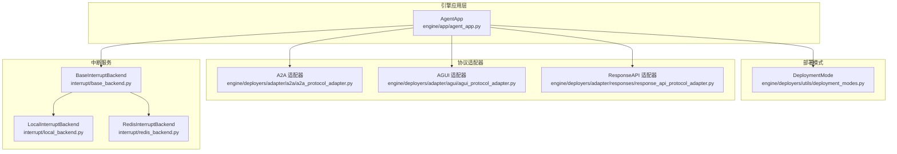
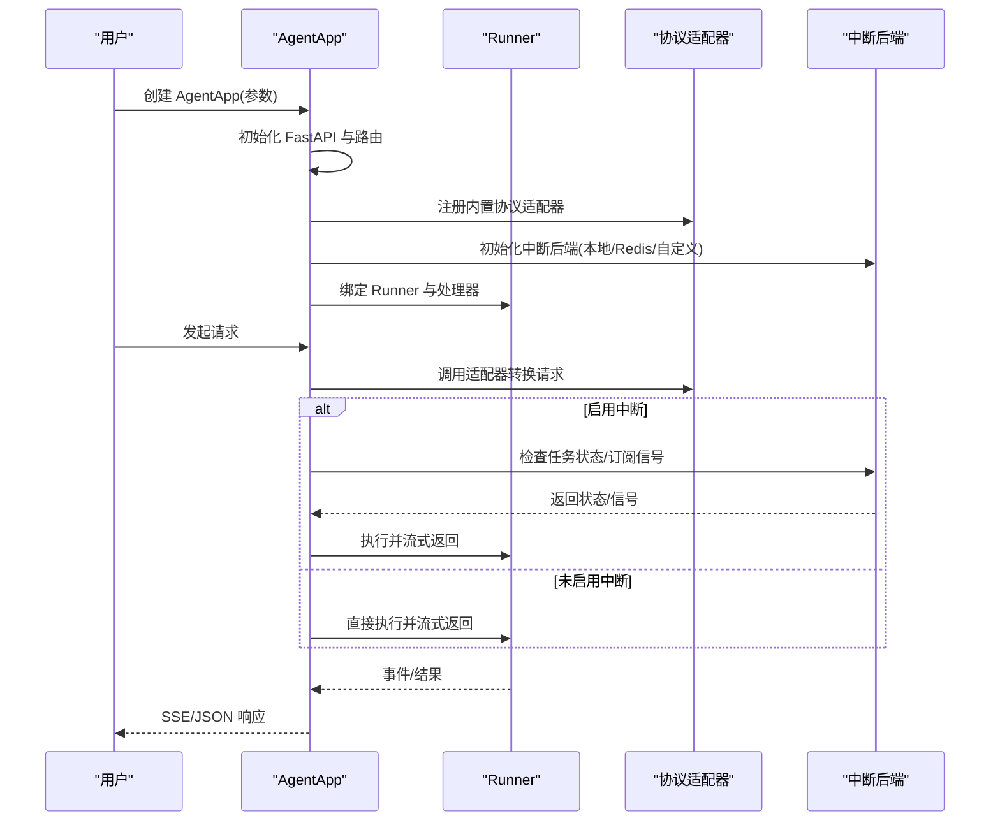
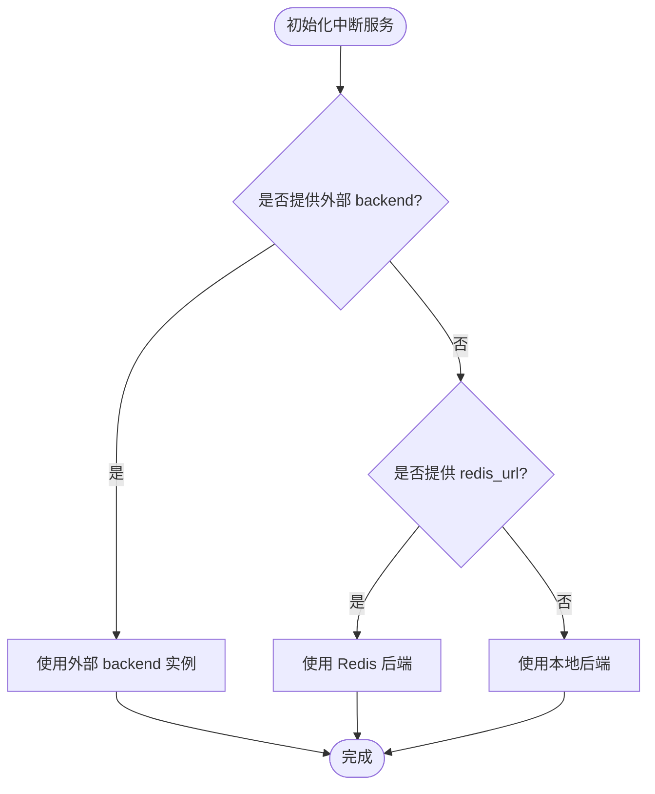
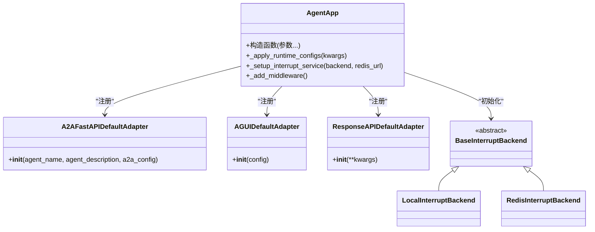

# 配置选项详解

<cite>
**本文引用的文件列表**
- [agent_app.py](file://src/agentscope_runtime/engine/app/agent_app.py)
- [deployment_modes.py](file://src/agentscope_runtime/engine/deployers/utils/deployment_modes.py)
- [a2a_protocol_adapter.py](file://src/agentscope_runtime/engine/deployers/adapter/a2a/a2a_protocol_adapter.py)
- [agui_protocol_adapter.py](file://src/agentscope_runtime/engine/deployers/adapter/agui/agui_protocol_adapter.py)
- [response_api_protocol_adapter.py](file://src/agentscope_runtime/engine/deployers/adapter/responses/response_api_protocol_adapter.py)
- [local_backend.py](file://src/agentscope_runtime/engine/deployers/utils/service_utils/interrupt/local_backend.py)
- [redis_backend.py](file://src/agentscope_runtime/engine/deployers/utils/service_utils/interrupt/redis_backend.py)
- [base_backend.py](file://src/agentscope_runtime/engine/deployers/utils/service_utils/interrupt/base_backend.py)
- [agent_app.md](file://cookbook/zh/agent_app.md)
- [protocol.md](file://cookbook/zh/protocol.md)
- [a2a_registry.md](file://cookbook/zh/a2a_registry.md)
</cite>

## 目录
1. [简介](#简介)
2. [项目结构](#项目结构)
3. [核心组件](#核心组件)
4. [架构总览](#架构总览)
5. [详细组件分析](#详细组件分析)
6. [依赖关系分析](#依赖关系分析)
7. [性能考量](#性能考量)
8. [故障排查指南](#故障排查指南)
9. [结论](#结论)
10. [附录](#附录)

## 简介
本文件面向使用 AgentApp 的工程师与运维人员，系统梳理 AgentApp 构造函数中的全部配置项、协议适配器的配置方式、中断服务的本地与 Redis 后端配置、部署模式的影响与相关配置项、配置验证规则与默认值、配置优先级与覆盖机制，以及完整示例与常见问题解决方案。目标是帮助读者快速、准确地完成 AgentApp 的配置与上线。

## 项目结构
AgentApp 位于引擎层，围绕 FastAPI 提供统一的生命周期管理、协议适配、中断服务与部署能力。关键目录与文件：
- 引擎应用层：engine/app/agent_app.py
- 部署模式枚举：engine/deployers/utils/deployment_modes.py
- 协议适配器：
  - A2A：engine/deployers/adapter/a2a/a2a_protocol_adapter.py
  - AGUI：engine/deployers/adapter/agui/agui_protocol_adapter.py
  - ResponseAPI：engine/deployers/adapter/responses/response_api_protocol_adapter.py
- 中断服务：
  - 抽象接口：engine/deployers/utils/service_utils/interrupt/base_backend.py
  - 本地实现：engine/deployers/utils/service_utils/interrupt/local_backend.py
  - Redis 实现：engine/deployers/utils/service_utils/interrupt/redis_backend.py
- 使用手册与示例：
  - AgentApp 使用说明：cookbook/zh/agent_app.md
  - 协议适配器说明：cookbook/zh/protocol.md
  - A2A 注册中心配置：cookbook/zh/a2a_registry.md

图表来源
- [agent_app.py:60-220](file://src/agentscope_runtime/engine/app/agent_app.py#L60-L220)
- [deployment_modes.py:7-15](file://src/agentscope_runtime/engine/deployers/utils/deployment_modes.py#L7-L15)
- [a2a_protocol_adapter.py:136-200](file://src/agentscope_runtime/engine/deployers/adapter/a2a/a2a_protocol_adapter.py#L136-L200)
- [agui_protocol_adapter.py:91-110](file://src/agentscope_runtime/engine/deployers/adapter/agui/agui_protocol_adapter.py#L91-L110)
- [response_api_protocol_adapter.py:33-45](file://src/agentscope_runtime/engine/deployers/adapter/responses/response_api_protocol_adapter.py#L33-L45)
- [base_backend.py:25-90](file://src/agentscope_runtime/engine/deployers/utils/service_utils/interrupt/base_backend.py#L25-L90)
- [local_backend.py:9-40](file://src/agentscope_runtime/engine/deployers/utils/service_utils/interrupt/local_backend.py#L9-L40)
- [redis_backend.py:7-49](file://src/agentscope_runtime/engine/deployers/utils/service_utils/interrupt/redis_backend.py#L7-L49)

章节来源
- [agent_app.py:60-220](file://src/agentscope_runtime/engine/app/agent_app.py#L60-L220)
- [deployment_modes.py:7-15](file://src/agentscope_runtime/engine/deployers/utils/deployment_modes.py#L7-L15)

## 核心组件
本节聚焦 AgentApp 构造函数的关键参数与默认值，以及与之配套的协议适配器、中断服务与部署模式。

- 构造函数核心参数与默认值
  - app_name：字符串，默认“AgentScope Runtime API”
  - app_description：字符串，默认空
  - endpoint_path：字符串，默认“/process”
  - response_type：字符串，默认“sse”
  - stream：布尔，默认 True
  - request_model：类型，默认 AgentRequest
  - before_start/after_finish：可选回调，默认 None
  - broker_url/backend_url：可选字符串，默认 None
  - runner：Runner 实例，默认 None（内部创建）
  - enable_embedded_worker：布尔，默认 False
  - enable_stream_task：布尔，默认 False
  - stream_task_queue：字符串，默认“stream_query”
  - stream_task_timeout：浮点或 None，默认 None
  - a2a_config：可选 AgentCardWithRuntimeConfig，默认 None
  - agui_config：可选 AGUIAdaptorConfig，默认 None
  - interrupt_backend：可选 BaseInterruptBackend，默认 None
  - interrupt_redis_url：可选字符串，默认 None
  - lifespan：FastAPI 生命周期上下文，默认 None
  - mode：DeploymentMode，默认 DAEMON_THREAD
  - protocol_adapters：可选适配器列表，默认 None（自动初始化）
  - custom_endpoints：可选自定义端点列表，默认 None
  - 其他 kwargs：透传给 FastAPI 构造函数

- 协议适配器
  - A2A：A2AFastAPIDefaultAdapter，支持 AgentCard 与运行时配置（主机、端口、注册中心、任务超时、wellknown 路径等）
  - AGUI：AGUIDefaultAdapter，支持 AG-UI 前端协议，可配置路由路径与并发限制
  - ResponseAPI：ResponseAPIDefaultAdapter，支持 OpenAI Responses API，可配置超时与并发限制

- 中断服务
  - 本地：LocalInterruptBackend（默认）
  - Redis：RedisInterruptBackend（分布式）
  - 自定义：实现 BaseInterruptBackend 的实例

- 部署模式
  - DAEMON_THREAD：本地守护线程模式
  - DETACHED_PROCESS：独立进程模式
  - STANDALONE：独立打包模板模式

章节来源
- [agent_app.py:124-220](file://src/agentscope_runtime/engine/app/agent_app.py#L124-L220)
- [a2a_protocol_adapter.py:93-134](file://src/agentscope_runtime/engine/deployers/adapter/a2a/a2a_protocol_adapter.py#L93-L134)
- [agui_protocol_adapter.py:80-110](file://src/agentscope_runtime/engine/deployers/adapter/agui/agui_protocol_adapter.py#L80-L110)
- [response_api_protocol_adapter.py:33-45](file://src/agentscope_runtime/engine/deployers/adapter/responses/response_api_protocol_adapter.py#L33-L45)
- [deployment_modes.py:7-15](file://src/agentscope_runtime/engine/deployers/utils/deployment_modes.py#L7-L15)
- [base_backend.py:25-90](file://src/agentscope_runtime/engine/deployers/utils/service_utils/interrupt/base_backend.py#L25-L90)
- [local_backend.py:9-40](file://src/agentscope_runtime/engine/deployers/utils/service_utils/interrupt/local_backend.py#L9-L40)
- [redis_backend.py:7-49](file://src/agentscope_runtime/engine/deployers/utils/service_utils/interrupt/redis_backend.py#L7-L49)

## 架构总览
AgentApp 继承 FastAPI 并混入统一路由与中断能力，自动注册内置协议适配器，支持生命周期钩子与中间件注入。运行时根据配置选择中断后端，按部署模式设置响应头与进程行为。

图表来源
- [agent_app.py:222-316](file://src/agentscope_runtime/engine/app/agent_app.py#L222-L316)
- [agent_app.py:643-703](file://src/agentscope_runtime/engine/app/agent_app.py#L643-L703)
- [base_backend.py:25-90](file://src/agentscope_runtime/engine/deployers/utils/service_utils/interrupt/base_backend.py#L25-L90)

## 详细组件分析

### AgentApp 构造函数与运行时配置
- 关键参数与默认值
  - app_name、app_description：影响 OpenAPI 标题与描述
  - endpoint_path：主处理端点路径
  - response_type：响应类型（默认“sse”）
  - stream：是否启用流式输出
  - request_model：请求模型（默认 AgentRequest）
  - before_start/after_finish：生命周期钩子
  - broker_url/backend_url：消息/路由相关地址
  - runner：可注入 Runner 实例
  - enable_embedded_worker：是否启用嵌入式 Celery 工作进程
  - enable_stream_task：是否启用后台任务模式
  - stream_task_queue/stream_task_timeout：后台任务队列与超时
  - a2a_config/agui_config：协议适配器配置
  - interrupt_backend/interrupt_redis_url：中断后端配置
  - lifespan：FastAPI 生命周期
  - mode：部署模式
  - protocol_adapters/custom_endpoints：自定义适配器与端点
  - 其他 kwargs：透传给 FastAPI

- 运行时配置更新
  - _apply_runtime_configs：支持在运行时动态更新 stream、protocol_adapters、embed_task_processor、mode、runner、endpoint_path、custom_endpoints 等

- 配置验证与约束
  - framework 参数校验：query 装饰器限定框架类型为 agentscope、autogen、agno、langgraph
  - 中断后端选择：优先使用外部传入的 backend；否则使用 redis_url；否则使用本地后端
  - 部署模式中间件：根据 mode 设置响应头（如 X-Process-Mode、X-Deployment-Mode）

章节来源
- [agent_app.py:124-220](file://src/agentscope_runtime/engine/app/agent_app.py#L124-L220)
- [agent_app.py:847-880](file://src/agentscope_runtime/engine/app/agent_app.py#L847-L880)
- [agent_app.py:722-740](file://src/agentscope_runtime/engine/app/agent_app.py#L722-L740)
- [agent_app.py:374-379](file://src/agentscope_runtime/engine/app/agent_app.py#L374-L379)
- [agent_app.py:222-246](file://src/agentscope_runtime/engine/app/agent_app.py#L222-L246)

### 协议适配器配置

#### A2A 协议适配器
- 配置对象：AgentCardWithRuntimeConfig
  - agent_card：AgentCard 或字典（name/description/url/version/skills 等）
  - host/port：A2A 端点主机与端口（默认从环境变量或 8080）
  - registry：注册中心实例或列表（可从环境变量自动创建）
  - task_timeout/task_event_timeout：任务与事件超时
  - wellknown_path：well-known 端点路径
- 初始化流程
  - 若未提供 a2a_config，则创建默认实例
  - 若 registry 为空且环境可用，则尝试从环境变量创建 NacosRegistry
  - 将配置注入 A2A 适配器，生成 AgentCard（含 URL、传输协议、接口等）

- A2A 适配器参数
  - agent_name/agent_description：作为回退值
  - a2a_config：AgentCardWithRuntimeConfig 实例
  - json_rpc_path：JSON-RPC 路径（默认 /a2a）

章节来源
- [a2a_protocol_adapter.py:55-91](file://src/agentscope_runtime/engine/deployers/adapter/a2a/a2a_protocol_adapter.py#L55-L91)
- [a2a_protocol_adapter.py:93-134](file://src/agentscope_runtime/engine/deployers/adapter/a2a/a2a_protocol_adapter.py#L93-L134)
- [a2a_protocol_adapter.py:145-200](file://src/agentscope_runtime/engine/deployers/adapter/a2a/a2a_protocol_adapter.py#L145-L200)
- [a2a_protocol_adapter.py:356-374](file://src/agentscope_runtime/engine/deployers/adapter/a2a/a2a_protocol_adapter.py#L356-L374)

#### AGUI 协议适配器
- 配置对象：AGUIAdaptorConfig
  - route_path：AGUI 端点路径（默认 /ag-ui）
- 适配器特性
  - 并发限制：通过 max_concurrent_requests 控制
  - 流式响应：基于 SSE，支持 AGUI 事件转换
  - 输入模型：FlexibleRunAgentInput 支持 snake_case/camelCase 字段名

章节来源
- [agui_protocol_adapter.py:80-110](file://src/agentscope_runtime/engine/deployers/adapter/agui/agui_protocol_adapter.py#L80-L110)
- [agui_protocol_adapter.py:108-146](file://src/agentscope_runtime/engine/deployers/adapter/agui/agui_protocol_adapter.py#L108-L146)

#### ResponseAPI 协议适配器
- 特性
  - 支持 OpenAI Responses API 请求格式
  - 流式与非流式两种响应模式
  - 超时控制与并发限制
- 关键参数
  - timeout：请求超时（秒，默认 300）
  - max_concurrent_requests：最大并发请求数（默认 100）

章节来源
- [response_api_protocol_adapter.py:33-45](file://src/agentscope_runtime/engine/deployers/adapter/responses/response_api_protocol_adapter.py#L33-L45)
- [response_api_protocol_adapter.py:44-97](file://src/agentscope_runtime/engine/deployers/adapter/responses/response_api_protocol_adapter.py#L44-L97)

### 中断服务配置

#### 中断后端抽象与实现
- 抽象接口：BaseInterruptBackend
  - 事件发布/订阅：publish_event、subscribe_listen
  - 任务状态管理：set_task_state、compare_and_set_state、get_task_state、delete_task_state
  - 生命周期：aclose
- 本地实现：LocalInterruptBackend
  - 基于内存与 asyncio primitives，适合单机运行
- Redis 实现：RedisInterruptBackend
  - 基于 redis.asyncio，支持跨节点分布式中断

- AgentApp 中的初始化策略
  - 若传入 interrupt_backend：使用外部实例
  - 否则若传入 interrupt_redis_url：使用 Redis 后端
  - 否则使用 LocalInterruptBackend

图表来源
- [agent_app.py:222-246](file://src/agentscope_runtime/engine/app/agent_app.py#L222-L246)
- [base_backend.py:25-90](file://src/agentscope_runtime/engine/deployers/utils/service_utils/interrupt/base_backend.py#L25-L90)
- [local_backend.py:9-40](file://src/agentscope_runtime/engine/deployers/utils/service_utils/interrupt/local_backend.py#L9-L40)
- [redis_backend.py:7-49](file://src/agentscope_runtime/engine/deployers/utils/service_utils/interrupt/redis_backend.py#L7-L49)

章节来源
- [agent_app.py:222-246](file://src/agentscope_runtime/engine/app/agent_app.py#L222-L246)
- [base_backend.py:25-90](file://src/agentscope_runtime/engine/deployers/utils/service_utils/interrupt/base_backend.py#L25-L90)
- [local_backend.py:9-40](file://src/agentscope_runtime/engine/deployers/utils/service_utils/interrupt/local_backend.py#L9-L40)
- [redis_backend.py:7-49](file://src/agentscope_runtime/engine/deployers/utils/service_utils/interrupt/redis_backend.py#L7-L49)

### 部署模式与相关配置
- DeploymentMode 枚举
  - DAEMON_THREAD：本地守护线程模式
  - DETACHED_PROCESS：独立进程模式（响应头 X-Process-Mode: detached）
  - STANDALONE：独立打包模板模式（响应头 X-Deployment-Mode: standalone）

- 中间件行为
  - 根据部署模式动态设置响应头，便于客户端识别运行模式

章节来源
- [deployment_modes.py:7-15](file://src/agentscope_runtime/engine/deployers/utils/deployment_modes.py#L7-L15)
- [agent_app.py:374-379](file://src/agentscope_runtime/engine/app/agent_app.py#L374-L379)

## 依赖关系分析

图表来源
- [agent_app.py:193-201](file://src/agentscope_runtime/engine/app/agent_app.py#L193-L201)
- [agent_app.py:222-246](file://src/agentscope_runtime/engine/app/agent_app.py#L222-L246)
- [a2a_protocol_adapter.py:136-200](file://src/agentscope_runtime/engine/deployers/adapter/a2a/a2a_protocol_adapter.py#L136-L200)
- [agui_protocol_adapter.py:91-110](file://src/agentscope_runtime/engine/deployers/adapter/agui/agui_protocol_adapter.py#L91-L110)
- [response_api_protocol_adapter.py:33-45](file://src/agentscope_runtime/engine/deployers/adapter/responses/response_api_protocol_adapter.py#L33-L45)
- [base_backend.py:25-90](file://src/agentscope_runtime/engine/deployers/utils/service_utils/interrupt/base_backend.py#L25-L90)
- [local_backend.py:9-40](file://src/agentscope_runtime/engine/deployers/utils/service_utils/interrupt/local_backend.py#L9-L40)
- [redis_backend.py:7-49](file://src/agentscope_runtime/engine/deployers/utils/service_utils/interrupt/redis_backend.py#L7-L49)

## 性能考量
- 流式输出与并发
  - stream=True 时采用 SSE，适合长链路与实时反馈
  - AGUI 与 ResponseAPI 适配器均支持并发限制，避免过载
- 超时与清理
  - ResponseAPI 适配器提供请求超时控制
  - AgentApp 提供后台任务清理周期（每 5 分钟清理过期任务）
- 中断后端选择
  - 单机建议本地后端；分布式建议 Redis 后端，确保跨节点一致性

[本节为通用指导，不直接分析具体文件]

## 故障排查指南
- 无法找到 Runner 或未注册处理函数
  - 症状：流式生成器返回错误
  - 排查：确认已通过 @app.query 装饰器注册处理函数
- 中断无效或未生效
  - 症状：外部触发中断后任务未停止
  - 排查：检查中断后端配置（本地/Redis/自定义）是否正确；确保处理函数捕获 asyncio.CancelledError 并进行清理
- A2A 注册中心不可用
  - 症状：A2A 适配器初始化失败
  - 排查：检查环境变量或显式传入 registry；确认 Nacos 服务可达
- ResponseAPI 超时频繁
  - 症状：SSE 流被中断
  - 排查：调整 timeout 与 max_concurrent_requests；检查下游执行耗时

章节来源
- [agent_app.py:643-703](file://src/agentscope_runtime/engine/app/agent_app.py#L643-L703)
- [agent_app.py:669-688](file://src/agentscope_runtime/engine/app/agent_app.py#L669-L688)
- [a2a_protocol_adapter.py:55-91](file://src/agentscope_runtime/engine/deployers/adapter/a2a/a2a_protocol_adapter.py#L55-L91)
- [response_api_protocol_adapter.py:161-200](file://src/agentscope_runtime/engine/deployers/adapter/responses/response_api_protocol_adapter.py#L161-L200)

## 结论
AgentApp 提供了高度可配置的应用骨架，涵盖协议适配、中断管理与部署模式等关键能力。通过合理的参数组合与后端选择，可在单机与分布式场景下稳定运行。建议在生产环境优先使用 Redis 中断后端与明确的生命周期管理，并结合并发与超时参数保障稳定性。

[本节为总结性内容，不直接分析具体文件]

## 附录

### 配置项与默认值一览
- AgentApp 构造函数
  - app_name：默认“AgentScope Runtime API”
  - app_description：默认空
  - endpoint_path：默认“/process”
  - response_type：默认“sse”
  - stream：默认 True
  - request_model：默认 AgentRequest
  - enable_embedded_worker：默认 False
  - enable_stream_task：默认 False
  - stream_task_queue：默认“stream_query”
  - stream_task_timeout：默认 None
  - mode：默认 DAEMON_THREAD
- A2A 适配器
  - AgentCardWithRuntimeConfig：host 默认自动检测；port 默认 8080；registry 可从环境变量创建；task_timeout 默认 60；task_event_timeout 默认 10；wellknown_path 默认 /.wellknown/agent-card.json
- AGUI 适配器
  - AGUIAdaptorConfig：route_path 默认“/ag-ui”
  - 并发限制默认 100
- ResponseAPI 适配器
  - timeout 默认 300；并发限制默认 100

章节来源
- [agent_app.py:124-220](file://src/agentscope_runtime/engine/app/agent_app.py#L124-L220)
- [a2a_protocol_adapter.py:93-134](file://src/agentscope_runtime/engine/deployers/adapter/a2a/a2a_protocol_adapter.py#L93-L134)
- [agui_protocol_adapter.py:80-110](file://src/agentscope_runtime/engine/deployers/adapter/agui/agui_protocol_adapter.py#L80-L110)
- [response_api_protocol_adapter.py:33-45](file://src/agentscope_runtime/engine/deployers/adapter/responses/response_api_protocol_adapter.py#L33-L45)

### 配置优先级与覆盖机制
- AgentApp 运行时更新
  - _apply_runtime_configs 支持动态覆盖：stream、protocol_adapters、embed_task_processor、mode、runner、endpoint_path、custom_endpoints
- A2A 注册中心
  - 显式传入 a2a_config.registry 优先于环境变量自动创建
- 中断后端
  - 外部传入 backend 优先于 redis_url，再优先于本地后端

章节来源
- [agent_app.py:847-880](file://src/agentscope_runtime/engine/app/agent_app.py#L847-L880)
- [a2a_protocol_adapter.py:55-91](file://src/agentscope_runtime/engine/deployers/adapter/a2a/a2a_protocol_adapter.py#L55-L91)
- [agent_app.py:222-246](file://src/agentscope_runtime/engine/app/agent_app.py#L222-L246)

### 完整配置示例与常见问题
- 示例来源
  - AgentApp 基础使用与生命周期：cookbook/zh/agent_app.md
  - 协议适配器使用：cookbook/zh/protocol.md
  - A2A 注册中心配置：cookbook/zh/a2a_registry.md
- 常见问题
  - 未注册处理函数导致无响应：需使用 @app.query 装饰器
  - 中断未生效：检查中断后端配置与异常处理
  - A2A 注册中心不可用：检查环境变量或显式传入 registry

章节来源
- [agent_app.md:47-191](file://cookbook/zh/agent_app.md#L47-L191)
- [protocol.md:593-626](file://cookbook/zh/protocol.md#L593-L626)
- [a2a_registry.md:125-160](file://cookbook/zh/a2a_registry.md#L125-L160)