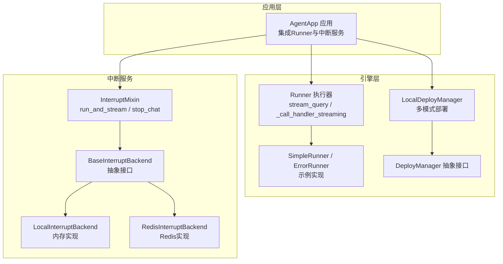
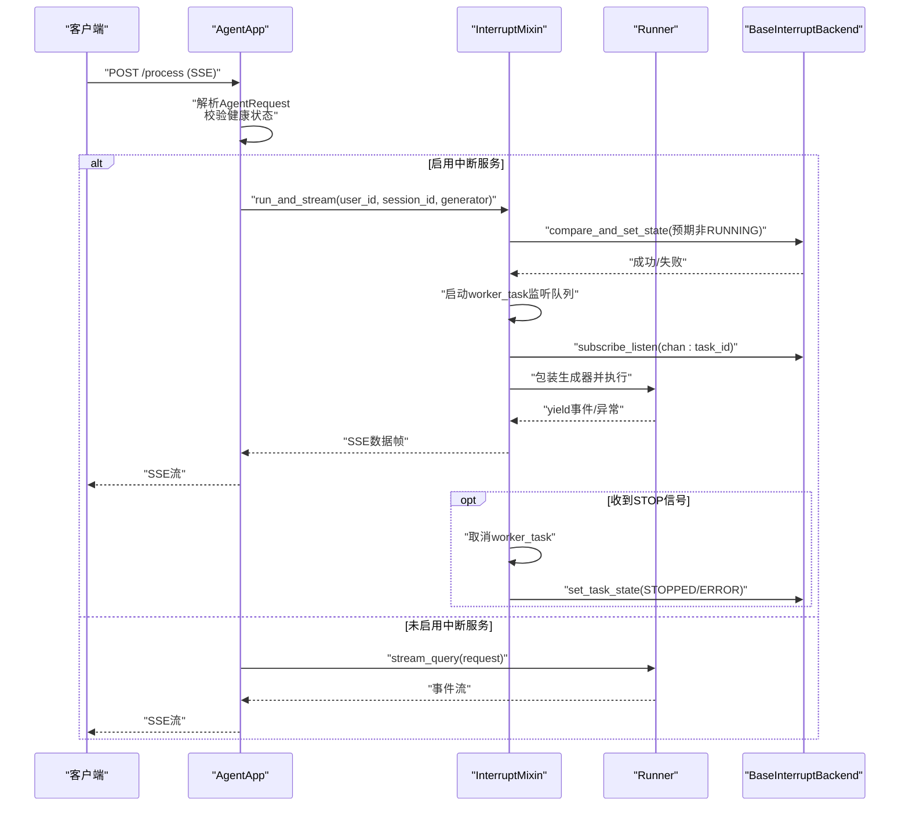
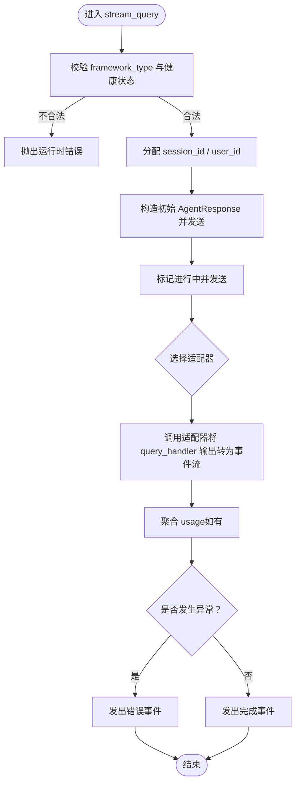
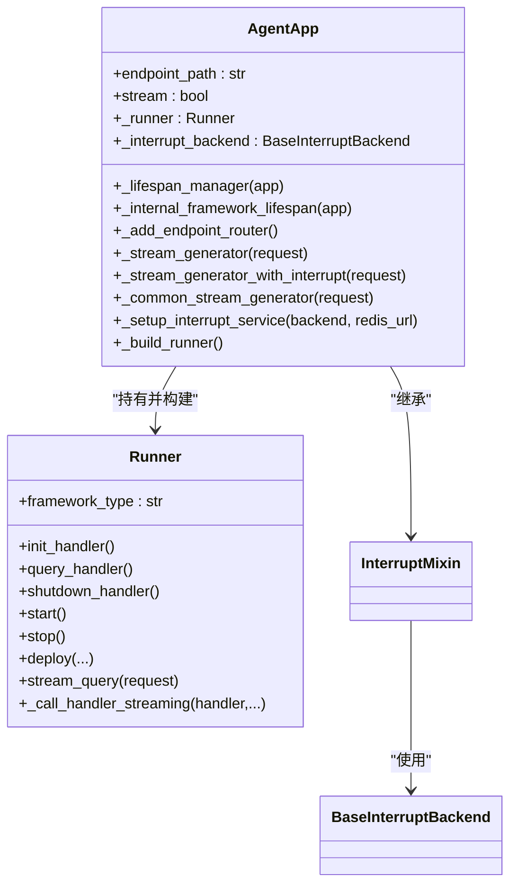
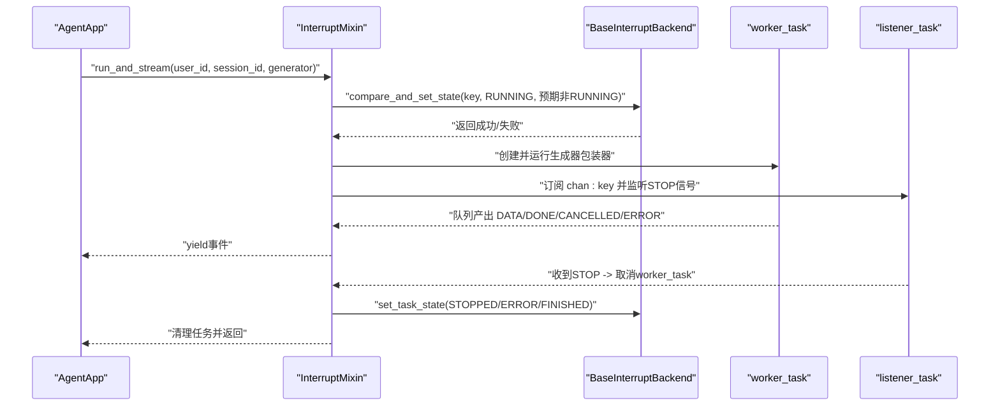
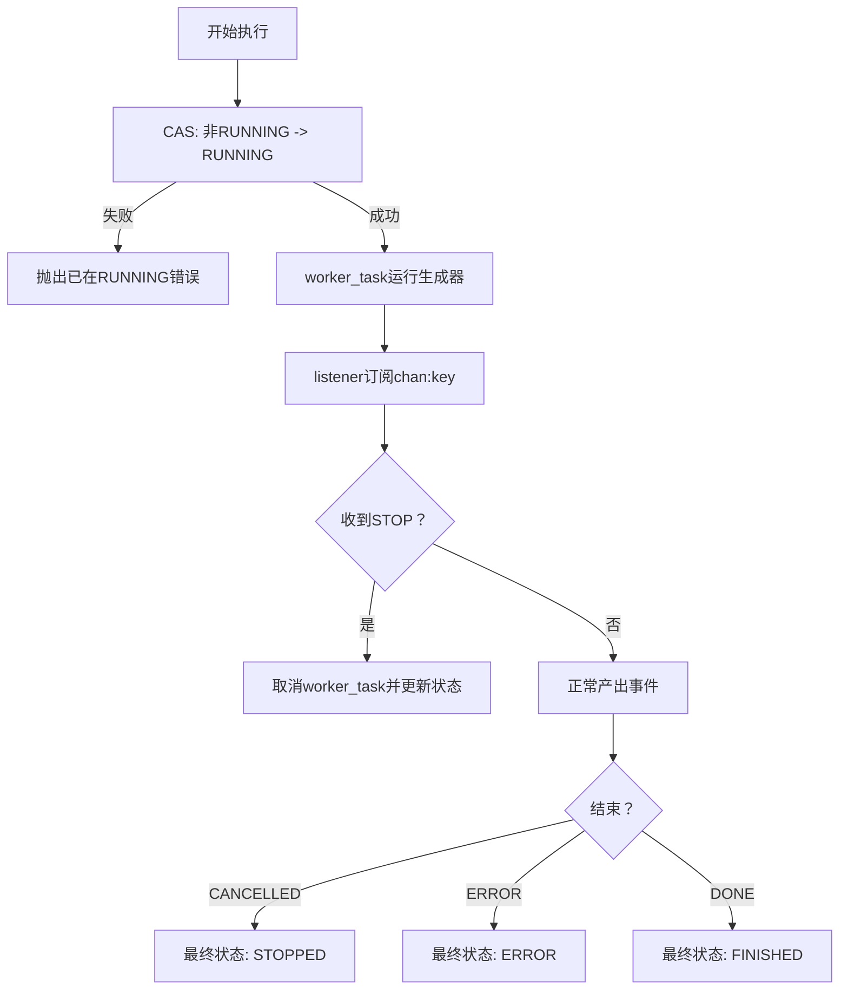
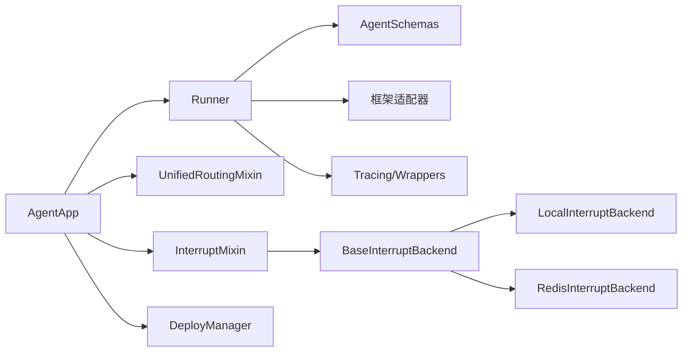

# Runner执行器

<cite>
**本文引用的文件**
- [runner.py](file://src/agentscope_runtime/engine/runner.py)
- [agent_app.py](file://src/agentscope_runtime/engine/app/agent_app.py)
- [interrupt_mixin.py](file://src/agentscope_runtime/engine/deployers/utils/service_utils/interrupt/interrupt_mixin.py)
- [base_backend.py](file://src/agentscope_runtime/engine/deployers/utils/service_utils/interrupt/base_backend.py)
- [local_backend.py](file://src/agentscope_runtime/engine/deployers/utils/service_utils/interrupt/local_backend.py)
- [redis_backend.py](file://src/agentscope_runtime/engine/deployers/utils/service_utils/interrupt/redis_backend.py)
- [interrupt_and_restore_example.py](file://examples/interrupt/interrupt_and_restore_example.py)
- [local_deployer.py](file://src/agentscope_runtime/engine/deployers/local_deployer.py)
- [base.py](file://src/agentscope_runtime/engine/deployers/base.py)
- [runner.py（helpers）](file://src/agentscope_runtime/engine/helpers/runner.py)
</cite>

## 目录
1. [简介](#简介)
2. [项目结构](#项目结构)
3. [核心组件](#核心组件)
4. [架构总览](#架构总览)
5. [详细组件分析](#详细组件分析)
6. [依赖分析](#依赖分析)
7. [性能考虑](#性能考虑)
8. [故障排除指南](#故障排除指南)
9. [结论](#结论)
10. [附录](#附录)

## 简介
本文件为Runner执行器的技术文档，聚焦于以下目标：
- 深入解释Runner的架构设计、执行流程与中断处理机制
- 详细说明分布式中断服务的工作原理、手动任务抢占与状态持久化恢复逻辑
- 记录Runner的初始化过程、执行循环与资源管理
- 解释Runner与AgentApp的协作关系与数据传递机制
- 提供性能优化建议与故障排除指南
- 包含异步执行与并发处理的最佳实践
- 解决常见执行问题与调试技巧

## 项目结构
Runner位于引擎子系统中，作为AgentApp的核心执行单元，负责：
- 接收请求并驱动框架适配器进行消息流式输出
- 统一异常处理与响应序列号生成
- 通过部署管理器进行本地或远程部署
- 与中断服务协同实现分布式中断与状态管理

**图示来源**
- [runner.py:46-356](file://src/agentscope_runtime/engine/runner.py#L46-L356)
- [agent_app.py:60-943](file://src/agentscope_runtime/engine/app/agent_app.py#L60-L943)
- [interrupt_mixin.py:8-151](file://src/agentscope_runtime/engine/deployers/utils/service_utils/interrupt/interrupt_mixin.py#L8-L151)
- [base_backend.py:25-90](file://src/agentscope_runtime/engine/deployers/utils/service_utils/interrupt/base_backend.py#L25-L90)
- [local_backend.py:9-132](file://src/agentscope_runtime/engine/deployers/utils/service_utils/interrupt/local_backend.py#L9-L132)
- [redis_backend.py:7-107](file://src/agentscope_runtime/engine/deployers/utils/service_utils/interrupt/redis_backend.py#L7-L107)
- [local_deployer.py:27-645](file://src/agentscope_runtime/engine/deployers/local_deployer.py#L27-L645)
- [base.py:9-44](file://src/agentscope_runtime/engine/deployers/base.py#L9-L44)
- [runner.py（helpers）:13-41](file://src/agentscope_runtime/engine/helpers/runner.py#L13-L41)

**章节来源**
- [runner.py:46-356](file://src/agentscope_runtime/engine/runner.py#L46-L356)
- [agent_app.py:60-943](file://src/agentscope_runtime/engine/app/agent_app.py#L60-L943)
- [interrupt_mixin.py:8-151](file://src/agentscope_runtime/engine/deployers/utils/service_utils/interrupt/interrupt_mixin.py#L8-L151)
- [base_backend.py:25-90](file://src/agentscope_runtime/engine/deployers/utils/service_utils/interrupt/base_backend.py#L25-L90)
- [local_backend.py:9-132](file://src/agentscope_runtime/engine/deployers/utils/service_utils/interrupt/local_backend.py#L9-L132)
- [redis_backend.py:7-107](file://src/agentscope_runtime/engine/deployers/utils/service_utils/interrupt/redis_backend.py#L7-L107)
- [local_deployer.py:27-645](file://src/agentscope_runtime/engine/deployers/local_deployer.py#L27-L645)
- [base.py:9-44](file://src/agentscope_runtime/engine/deployers/base.py#L9-L44)
- [runner.py（helpers）:13-41](file://src/agentscope_runtime/engine/helpers/runner.py#L13-L41)

## 核心组件
- Runner：统一的执行器，负责接收AgentRequest，绑定框架类型，调用query_handler，并通过适配器将中间结果转换为事件流。
- AgentApp：基于FastAPI的应用容器，集成Runner与中断服务，提供生命周期管理、路由注册与部署能力。
- 中断服务（InterruptMixin + Backend）：提供分布式任务状态与信号通道，支持原子状态变更与事件订阅，实现手动抢占与状态持久化。
- 部署管理器（DeployManager + LocalDeployManager）：封装本地多模式部署（守护线程/分离进程），并支持外部平台扩展。

**章节来源**
- [runner.py:46-356](file://src/agentscope_runtime/engine/runner.py#L46-L356)
- [agent_app.py:60-943](file://src/agentscope_runtime/engine/app/agent_app.py#L60-L943)
- [interrupt_mixin.py:8-151](file://src/agentscope_runtime/engine/deployers/utils/service_utils/interrupt/interrupt_mixin.py#L8-L151)
- [base_backend.py:25-90](file://src/agentscope_runtime/engine/deployers/utils/service_utils/interrupt/base_backend.py#L25-L90)
- [local_backend.py:9-132](file://src/agentscope_runtime/engine/deployers/utils/service_utils/interrupt/local_backend.py#L9-L132)
- [redis_backend.py:7-107](file://src/agentscope_runtime/engine/deployers/utils/service_utils/interrupt/redis_backend.py#L7-L107)
- [local_deployer.py:27-645](file://src/agentscope_runtime/engine/deployers/local_deployer.py#L27-L645)
- [base.py:9-44](file://src/agentscope_runtime/engine/deployers/base.py#L9-L44)

## 架构总览
Runner与AgentApp的协作关系如下：
- AgentApp在生命周期内构建Runner并注入查询/初始化/关闭处理器
- 请求进入后，AgentApp根据是否启用中断服务选择不同的流式生成路径
- Runner根据framework_type选择对应的消息流适配器，将query_handler的输出转换为事件流
- 中断服务通过Backend实现任务状态原子更新与事件广播，支持手动抢占

**图示来源**
- [agent_app.py:643-703](file://src/agentscope_runtime/engine/app/agent_app.py#L643-L703)
- [interrupt_mixin.py:38-139](file://src/agentscope_runtime/engine/deployers/utils/service_utils/interrupt/interrupt_mixin.py#L38-L139)
- [runner.py:193-356](file://src/agentscope_runtime/engine/runner.py#L193-L356)
- [base_backend.py:40-90](file://src/agentscope_runtime/engine/deployers/utils/service_utils/interrupt/base_backend.py#L40-L90)

**章节来源**
- [agent_app.py:643-703](file://src/agentscope_runtime/engine/app/agent_app.py#L643-L703)
- [interrupt_mixin.py:38-139](file://src/agentscope_runtime/engine/deployers/utils/service_utils/interrupt/interrupt_mixin.py#L38-L139)
- [runner.py:193-356](file://src/agentscope_runtime/engine/runner.py#L193-L356)

## 详细组件分析

### Runner执行器
- 初始化与生命周期
  - start：可选调用init_handler，设置健康状态
  - stop：可选调用shutdown_handler，关闭AsyncExitStack与部署管理器
  - 异步上下文：__aenter__/__aexit__用于自动生命周期管理
- 部署能力
  - deploy：委托给DeployManager，保存部署实例以备停止
- 流式查询
  - stream_query：校验framework_type与健康状态；分配session_id/user_id；生成初始/进行中响应；根据framework_type选择适配器；聚合最终usage；捕获异常并返回错误事件；完成时返回completed事件
  - _call_handler_streaming：兼容同步/异步/生成器/协程的调用分发
- 错误处理
  - 将未知异常包装为AppBaseException，保证统一错误格式

**图示来源**
- [runner.py:193-356](file://src/agentscope_runtime/engine/runner.py#L193-L356)

**章节来源**
- [runner.py:46-356](file://src/agentscope_runtime/engine/runner.py#L46-L356)

### AgentApp与Runner协作
- 生命周期管理
  - _lifespan_manager：组合用户自定义lifespan与内部框架生命周期，确保Runner正确进入/退出
  - _internal_framework_lifespan：构建Runner、注册协议端点、可选启动嵌入式Celery worker与任务清理worker
- 路由与端点
  - _add_endpoint_router：动态注册/process端点，将用户函数签名映射为JSON请求体
  - _add_stream_query_task_endpoint：提供后台任务提交与状态查询端点（可选）
- 流式生成
  - _stream_generator/_stream_generator_with_interrupt：根据是否配置中断后端选择不同路径
  - _common_stream_generator：标准SSE格式化输出
- 中断服务集成
  - _setup_interrupt_service：根据传入backend或redis_url初始化中断服务
  - _build_runner：将装饰器绑定的处理器复制到Runner实例

**图示来源**
- [agent_app.py:124-943](file://src/agentscope_runtime/engine/app/agent_app.py#L124-L943)
- [runner.py:46-171](file://src/agentscope_runtime/engine/runner.py#L46-L171)
- [interrupt_mixin.py:8-151](file://src/agentscope_runtime/engine/deployers/utils/service_utils/interrupt/interrupt_mixin.py#L8-L151)

**章节来源**
- [agent_app.py:124-943](file://src/agentscope_runtime/engine/app/agent_app.py#L124-L943)

### 中断服务与手动抢占
- 中断后端抽象
  - BaseInterruptBackend：定义发布/订阅、任务状态读写、CAS操作与关闭接口
- 本地实现
  - LocalInterruptBackend：基于内存字典与队列，使用锁保证原子性，适合单机场景
- Redis实现
  - RedisInterruptBackend：使用Lua脚本实现原子CAS，支持发布/订阅与TTL
- 中断混入
  - InterruptMixin：提供run_and_stream包装器，执行前进行CAS状态检查，防止并发冲突；维护worker与listener任务；在收到STOP信号时取消任务并更新最终状态；支持stop_chat广播停止信号

**图示来源**
- [interrupt_mixin.py:38-139](file://src/agentscope_runtime/engine/deployers/utils/service_utils/interrupt/interrupt_mixin.py#L38-L139)
- [base_backend.py:40-90](file://src/agentscope_runtime/engine/deployers/utils/service_utils/interrupt/base_backend.py#L40-L90)
- [local_backend.py:61-90](file://src/agentscope_runtime/engine/deployers/utils/service_utils/interrupt/local_backend.py#L61-L90)
- [redis_backend.py:44-90](file://src/agentscope_runtime/engine/deployers/utils/service_utils/interrupt/redis_backend.py#L44-L90)

**章节来源**
- [interrupt_mixin.py:8-151](file://src/agentscope_runtime/engine/deployers/utils/service_utils/interrupt/interrupt_mixin.py#L8-L151)
- [base_backend.py:25-90](file://src/agentscope_runtime/engine/deployers/utils/service_utils/interrupt/base_backend.py#L25-L90)
- [local_backend.py:9-132](file://src/agentscope_runtime/engine/deployers/utils/service_utils/interrupt/local_backend.py#L9-L132)
- [redis_backend.py:7-107](file://src/agentscope_runtime/engine/deployers/utils/service_utils/interrupt/redis_backend.py#L7-L107)

### 分布式中断服务工作原理
- 任务标识：使用"user_id:session_id"作为唯一键
- 原子状态：通过compare_and_set_state确保同一会话仅允许一个RUNNING实例
- 事件通道：每个任务拥有独立频道"chan:key"，用于广播STOP信号
- 状态持久化：任务结束后根据是否被中断设置STOPPED或FINISHED，错误时置ERROR
- 手动抢占：通过stop_chat向指定频道发布STOP信号，触发worker_task取消

**图示来源**
- [interrupt_mixin.py:48-139](file://src/agentscope_runtime/engine/deployers/utils/service_utils/interrupt/interrupt_mixin.py#L48-L139)

**章节来源**
- [interrupt_mixin.py:38-139](file://src/agentscope_runtime/engine/deployers/utils/service_utils/interrupt/interrupt_mixin.py#L38-L139)

### 状态持久化与恢复逻辑
- 示例工程展示了在中断与异常情况下如何保存/加载会话状态：
  - 中断：捕获CancelledError，调用agent.interrupt()停止底层执行，保存状态，再重新抛出以使Runner将任务状态置为STOPPED
  - 正常完成：保存最终状态
  - 异常：捕获其他异常，保存状态并向上抛出以置ERROR
- 该模式可与外部会话存储（如Redis）配合，实现跨节点的状态恢复

**章节来源**
- [interrupt_and_restore_example.py:103-152](file://examples/interrupt/interrupt_and_restore_example.py#L103-L152)

### 初始化过程、执行循环与资源管理
- 初始化
  - AgentApp在生命周期中构建Runner并注入处理器
  - Runner在start阶段调用init_handler（若存在）
- 执行循环
  - stream_query按框架类型选择适配器，逐条产出事件，聚合usage，最终发出完成或错误事件
- 资源管理
  - Runner.stop关闭AsyncExitStack与部署管理器
  - AgentApp在生命周期结束时清理Runner与中断后端

**章节来源**
- [agent_app.py:248-316](file://src/agentscope_runtime/engine/app/agent_app.py#L248-L316)
- [runner.py:76-121](file://src/agentscope_runtime/engine/runner.py#L76-L121)

### 与AgentApp的协作关系与数据传递
- 协作方式
  - AgentApp持有Runner实例，将用户装饰的query/init/shutdown处理器绑定到Runner
  - AgentApp根据是否启用中断服务选择不同的流式生成路径
  - AgentApp注册/process端点，将请求转发至Runner.stream_query
- 数据传递
  - 请求模型：AgentRequest（包含id、input、session_id、user_id等）
  - 响应模型：AgentResponse（包含事件序列、usage、状态）

**章节来源**
- [agent_app.py:781-845](file://src/agentscope_runtime/engine/app/agent_app.py#L781-L845)
- [runner.py:193-356](file://src/agentscope_runtime/engine/runner.py#L193-L356)

### 部署与运行模式
- DeployManager抽象与LocalDeployManager实现
  - 支持守护线程与分离进程两种本地模式
  - 分离进程模式支持打包、日志清理、PID文件管理与优雅停止
- 运行控制
  - 提供/admin/shutdown与/admin/status等管理端点
  - 支持后台任务提交与状态查询（可选）

**章节来源**
- [base.py:9-44](file://src/agentscope_runtime/engine/deployers/base.py#L9-L44)
- [local_deployer.py:27-645](file://src/agentscope_runtime/engine/deployers/local_deployer.py#L27-L645)
- [agent_app.py:598-641](file://src/agentscope_runtime/engine/app/agent_app.py#L598-L641)

## 依赖分析
- Runner依赖
  - 框架适配器：根据framework_type动态导入
  - Schema模型：AgentRequest/AgentResponse/Event/RunStatus/Usage等
  - Tracing：TraceType与追踪工具
- AgentApp依赖
  - Routing与InterruptMixin：统一路由与中断服务
  - DeployManager：部署入口
  - ProtocolAdapter：协议适配（A2A/ResponseAPI/AGUI）
- 中断服务依赖
  - BaseInterruptBackend派生类：Local/Redis
  - asyncio：队列、任务与信号监听

**图示来源**
- [runner.py:20-40](file://src/agentscope_runtime/engine/runner.py#L20-L40)
- [agent_app.py:42-51](file://src/agentscope_runtime/engine/app/agent_app.py#L42-L51)
- [interrupt_mixin.py:5-6](file://src/agentscope_runtime/engine/deployers/utils/service_utils/interrupt/interrupt_mixin.py#L5-L6)

**章节来源**
- [runner.py:20-40](file://src/agentscope_runtime/engine/runner.py#L20-L40)
- [agent_app.py:42-51](file://src/agentscope_runtime/engine/app/agent_app.py#L42-L51)
- [interrupt_mixin.py:5-6](file://src/agentscope_runtime/engine/deployers/utils/service_utils/interrupt/interrupt_mixin.py#L5-L6)

## 性能考虑
- 异步优先：尽量使用异步生成器与异步I/O，避免阻塞事件流
- 原子状态：CAS操作减少竞态条件，降低重复执行成本
- 缓存与序列号：使用SequenceNumberGenerator保证事件顺序一致性
- 资源回收：及时取消任务与关闭连接，避免泄漏
- 部署模式：分离进程模式便于隔离与弹性伸缩；守护线程模式适合开发与快速迭代

[本节为通用指导，无需特定文件来源]

## 故障排除指南
- 无法连接服务
  - 检查主机与端口配置，确认防火墙与容器网络
- 解析错误
  - SSE需逐行解析，容忍心跳空行或部分JSON块
- 上下文未保留
  - 确保每次请求携带相同session_id，并在init_func中启动state/session服务
- 中断无效
  - 确认已启用中断服务（传入interrupt_backend或interrupt_redis_url）
  - 检查频道名称与任务键一致（user_id:session_id）
- 状态未更新
  - 确认worker_task在异常/取消时仍能更新最终状态
  - 检查Backend实现（Redis需可用且Lua脚本可执行）

**章节来源**
- [agent_app.py:382-422](file://src/agentscope_runtime/engine/app/agent_app.py#L382-L422)
- [interrupt_mixin.py:140-146](file://src/agentscope_runtime/engine/deployers/utils/service_utils/interrupt/interrupt_mixin.py#L140-L146)

## 结论
Runner执行器通过清晰的生命周期管理、灵活的框架适配与完善的中断服务，实现了高可靠、可扩展的Agent推理执行。结合AgentApp的统一路由与部署能力，可在本地与分布式环境中稳定运行。建议在生产环境采用Redis中断后端与分离进程部署模式，并完善状态持久化与监控告警体系。

[本节为总结，无需特定文件来源]

## 附录
- 示例：中断与恢复
  - 展示了在CancelledError与异常情况下保存/加载会话状态的完整流程
- 辅助Runner
  - 提供SimpleRunner与ErrorRunner示例，便于快速验证与调试

**章节来源**
- [interrupt_and_restore_example.py:1-174](file://examples/interrupt/interrupt_and_restore_example.py#L1-L174)
- [runner.py（helpers）:13-41](file://src/agentscope_runtime/engine/helpers/runner.py#L13-L41)