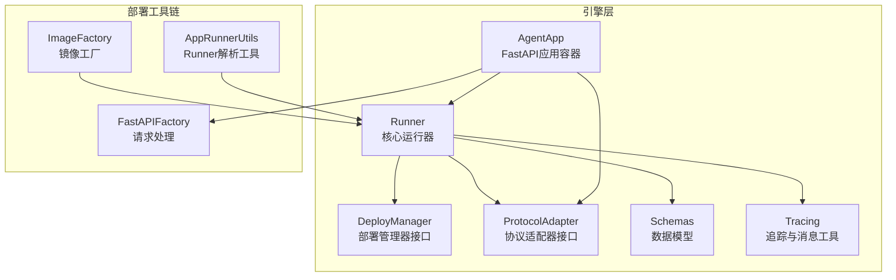
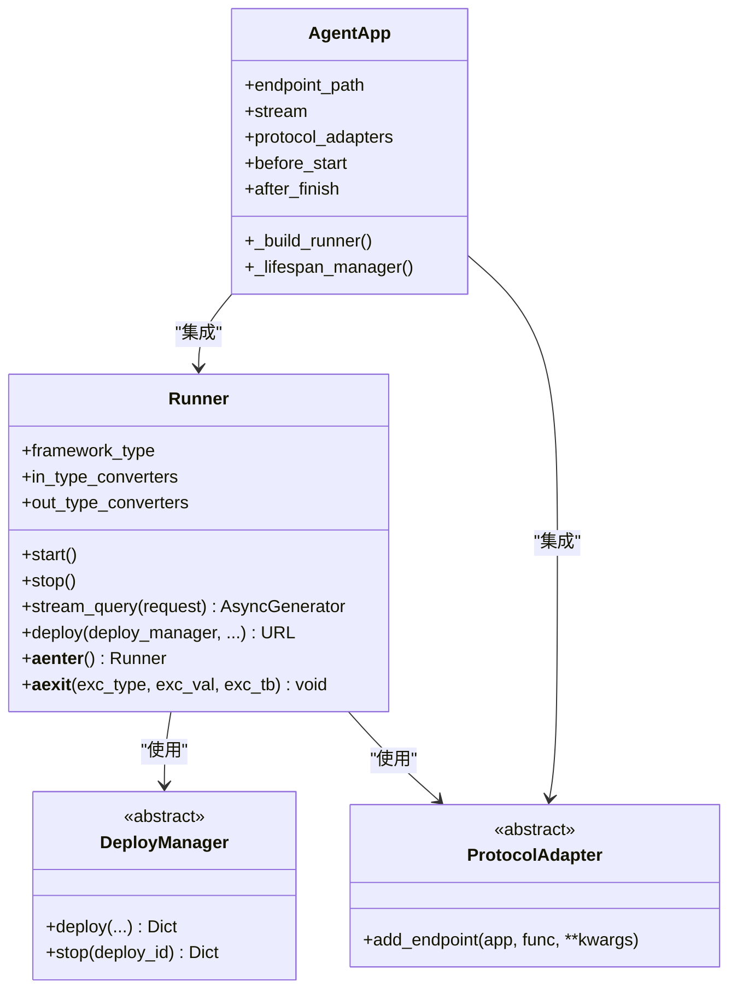
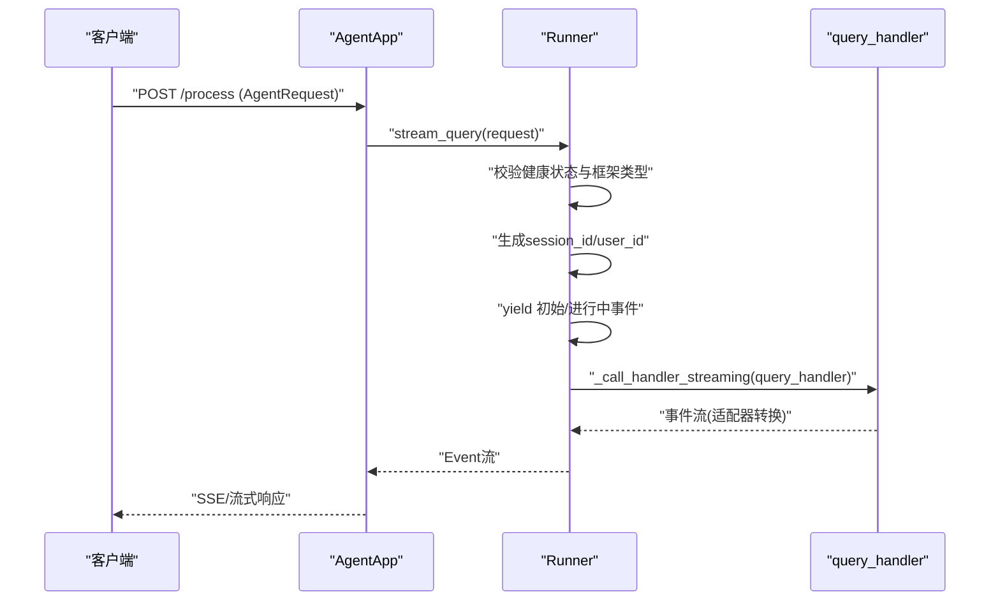
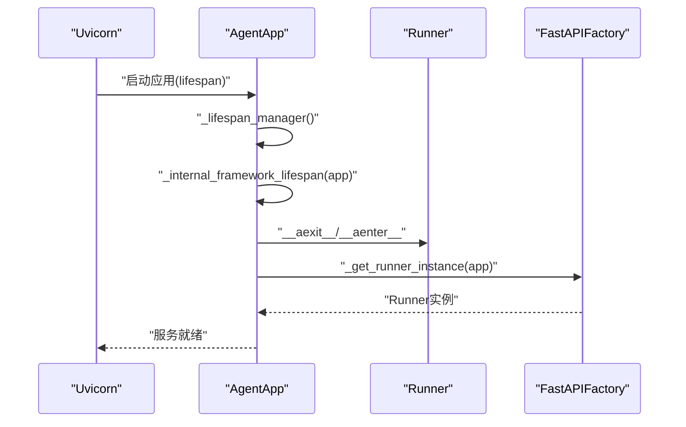
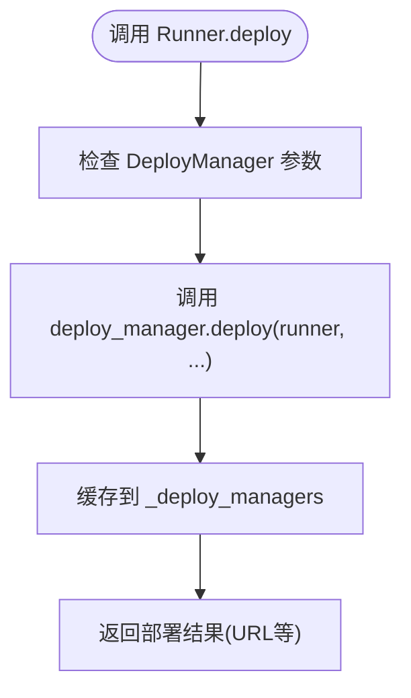
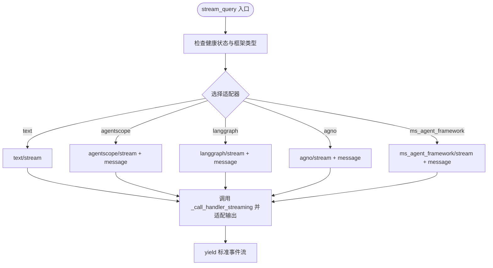
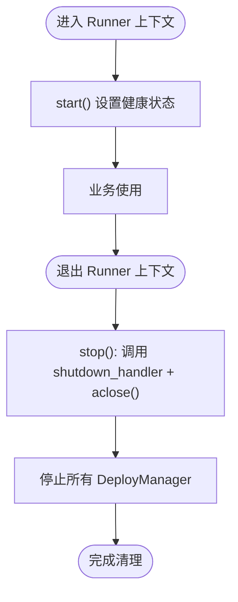
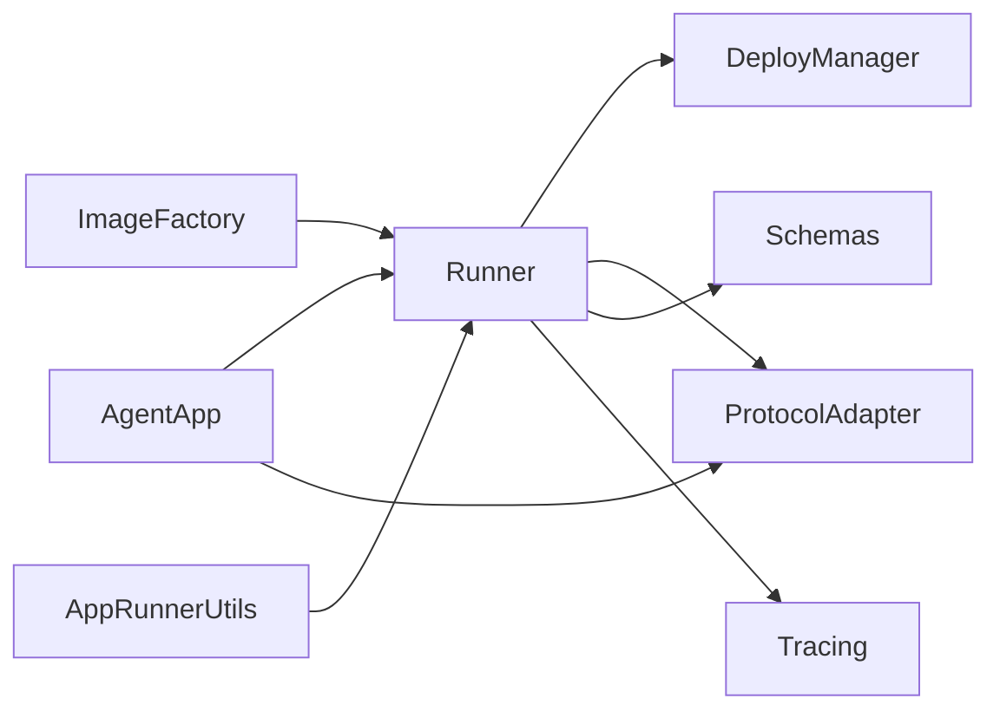

# Runner架构设计

<cite>
**本文档引用的文件**
- [engine/runner.py](file://src/agentscope_runtime/engine/runner.py)
- [engine/helpers/runner.py](file://src/agentscope_runtime/engine/helpers/runner.py)
- [engine/app/agent_app.py](file://src/agentscope_runtime/engine/app/agent_app.py)
- [engine/deployers/base.py](file://src/agentscope_runtime/engine/deployers/base.py)
- [engine/deployers/agentrun_deployer.py](file://src/agentscope_runtime/engine/deployers/agentrun_deployer.py)
- [engine/deployers/utils/app_runner_utils.py](file://src/agentscope_runtime/engine/deployers/utils/app_runner_utils.py)
- [engine/deployers/utils/service_utils/fastapi_factory.py](file://src/agentscope_runtime/engine/deployers/utils/service_utils/fastapi_factory.py)
- [engine/deployers/utils/docker_image_utils/image_factory.py](file://src/agentscope_runtime/engine/deployers/utils/docker_image_utils/image_factory.py)
- [engine/deployers/adapter/protocol_adapter.py](file://src/agentscope_runtime/engine/deployers/adapter/protocol_adapter.py)
- [engine/schemas/agent_schemas.py](file://src/agentscope_runtime/engine/schemas/agent_schemas.py)
- [engine/tracing/wrapper.py](file://src/agentscope_runtime/engine/tracing/wrapper.py)
- [engine/tracing/message_util.py](file://src/agentscope_runtime/engine/tracing/message_util.py)
- [engine/constant.py](file://src/agentscope_runtime/engine/constant.py)
- [engine/__init__.py](file://src/agentscope_runtime/engine/__init__.py)
</cite>

## 目录
1. [简介](#简介)
2. [项目结构](#项目结构)
3. [核心组件](#核心组件)
4. [架构总览](#架构总览)
5. [详细组件分析](#详细组件分析)
6. [依赖关系分析](#依赖关系分析)
7. [性能考量](#性能考量)
8. [故障排查指南](#故障排查指南)
9. [结论](#结论)

## 简介
本文件系统性阐述Runner架构设计，围绕其整体设计原则、核心组件、设计模式展开；详解Runner初始化与生命周期管理、健康状态监控机制；记录Runner与DeployManager、ProtocolAdapter的协作关系与依赖注入机制；解释异步上下文管理器的实现原理与资源清理策略；提供架构图表与组件交互流程图；包含设计决策的技术背景与权衡考虑，并给出扩展性建议与常见问题解决方案。

## 项目结构
Runner位于引擎层核心位置，向上通过AgentApp集成FastAPI，向下对接部署管理器（DeployManager）与协议适配器（ProtocolAdapter），并向外提供流式查询能力。关键目录与职责如下：
- engine/runner.py：Runner核心实现，负责生命周期、健康检查、流式查询与资源清理
- engine/app/agent_app.py：基于FastAPI的应用容器，集成Runner与中断服务、路由与协议适配
- engine/deployers/*：部署管理器抽象与具体实现，负责打包、构建镜像与部署
- engine/deployers/adapter/*：协议适配器接口与实现，负责协议转换与端点注册
- engine/schemas/*：统一的数据模型与事件类型
- engine/tracing/*：追踪装饰器与消息工具，用于事件聚合与完成原因提取

**图表来源**
- [engine/runner.py:46-356](file://src/agentscope_runtime/engine/runner.py#L46-L356)
- [engine/app/agent_app.py:60-200](file://src/agentscope_runtime/engine/app/agent_app.py#L60-L200)
- [engine/deployers/base.py:9-44](file://src/agentscope_runtime/engine/deployers/base.py#L9-L44)
- [engine/deployers/adapter/protocol_adapter.py:6-24](file://src/agentscope_runtime/engine/deployers/adapter/protocol_adapter.py#L6-L24)
- [engine/deployers/utils/docker_image_utils/image_factory.py:67-232](file://src/agentscope_runtime/engine/deployers/utils/docker_image_utils/image_factory.py#L67-L232)
- [engine/deployers/utils/app_runner_utils.py:12-29](file://src/agentscope_runtime/engine/deployers/utils/app_runner_utils.py#L12-L29)
- [engine/deployers/utils/service_utils/fastapi_factory.py:536-576](file://src/agentscope_runtime/engine/deployers/utils/service_utils/fastapi_factory.py#L536-L576)

**章节来源**
- [engine/runner.py:46-356](file://src/agentscope_runtime/engine/runner.py#L46-L356)
- [engine/app/agent_app.py:60-200](file://src/agentscope_runtime/engine/app/agent_app.py#L60-L200)
- [engine/deployers/base.py:9-44](file://src/agentscope_runtime/engine/deployers/base.py#L9-L44)

## 核心组件
- Runner：统一的异步运行器，提供启动/停止、健康状态、流式查询、协议适配与资源清理能力
- AgentApp：基于FastAPI的应用容器，集成Runner、协议适配器、中断服务与生命周期钩子
- DeployManager：部署管理器接口，定义通用的部署与停止能力
- ProtocolAdapter：协议适配器接口，定义端点添加与协议转换能力
- Schemas：统一的AgentRequest、AgentResponse、Event、RunStatus等数据模型
- Tracing：追踪装饰器与消息工具，用于事件聚合与完成原因提取

**章节来源**
- [engine/runner.py:46-356](file://src/agentscope_runtime/engine/runner.py#L46-L356)
- [engine/app/agent_app.py:60-200](file://src/agentscope_runtime/engine/app/agent_app.py#L60-L200)
- [engine/deployers/base.py:9-44](file://src/agentscope_runtime/engine/deployers/base.py#L9-L44)
- [engine/deployers/adapter/protocol_adapter.py:6-24](file://src/agentscope_runtime/engine/deployers/adapter/protocol_adapter.py#L6-L24)
- [engine/schemas/agent_schemas.py:1-100](file://src/agentscope_runtime/engine/schemas/agent_schemas.py#L1-L100)

## 架构总览
Runner采用“运行器 + 应用容器 + 部署管理器 + 协议适配器”的分层架构，遵循以下设计原则：
- 分离关注点：Runner专注执行与流式输出；AgentApp专注HTTP服务与生命周期；DeployManager专注部署与停止
- 异步优先：全链路异步化，支持流式生成与异步上下文管理
- 可插拔协议：通过ProtocolAdapter实现多协议支持与协议转换
- 健康与安全：内置健康状态检查与异常包装，确保服务稳定
- 可扩展：通过框架类型与适配器扩展支持不同AI框架的消息格式

**图表来源**
- [engine/runner.py:46-356](file://src/agentscope_runtime/engine/runner.py#L46-L356)
- [engine/app/agent_app.py:60-200](file://src/agentscope_runtime/engine/app/agent_app.py#L60-L200)
- [engine/deployers/base.py:9-44](file://src/agentscope_runtime/engine/deployers/base.py#L9-L44)
- [engine/deployers/adapter/protocol_adapter.py:6-24](file://src/agentscope_runtime/engine/deployers/adapter/protocol_adapter.py#L6-L24)

## 详细组件分析

### Runner类设计与实现
Runner是引擎的核心执行单元，提供以下关键能力：
- 初始化与生命周期
  - start()：调用init_handler（若存在且可调用），设置健康状态为True
  - stop()：调用shutdown_handler（若存在且可调用），关闭AsyncExitStack，设置健康状态为False
  - __aenter__/__aexit__：实现异步上下文管理器，自动start/stop
- 健康状态监控
  - _health布尔标志位，stream_query前进行有效性检查
  - 框架类型校验，确保framework_type在允许集合内
- 流式查询与协议适配
  - stream_query：统一入口，生成会话ID与用户ID，产出初始与进行中事件，调用适配器将query_handler结果转为标准事件流
  - _call_handler_streaming：兼容同步/异步/生成器/协程返回
  - 支持text、agentscope、langgraph、agno、ms_agent_framework等框架类型的流式适配
- 部署与资源管理
  - deploy：委托DeployManager执行部署，缓存deploy_manager实例
  - AsyncExitStack：集中管理异步资源，stop时统一清理

**图表来源**
- [engine/app/agent_app.py:248-265](file://src/agentscope_runtime/engine/app/agent_app.py#L248-L265)
- [engine/deployers/utils/service_utils/fastapi_factory.py:550-576](file://src/agentscope_runtime/engine/deployers/utils/service_utils/fastapi_factory.py#L550-L576)
- [engine/runner.py:199-356](file://src/agentscope_runtime/engine/runner.py#L199-L356)

**章节来源**
- [engine/runner.py:46-356](file://src/agentscope_runtime/engine/runner.py#L46-L356)
- [engine/constant.py:1-100](file://src/agentscope_runtime/engine/constant.py#L1-L100)
- [engine/schemas/agent_schemas.py:1-100](file://src/agentscope_runtime/engine/schemas/agent_schemas.py#L1-L100)

### AgentApp与Runner的协作
AgentApp作为FastAPI应用容器，负责：
- 生命周期管理：_lifespan_manager与_internal_framework_lifespan协调Runner的构建与启动
- 协议适配：集成多种ProtocolAdapter，动态注册端点
- 中断服务：支持本地与Redis分布式中断后端，保障并发任务隔离
- 请求处理：通过FastAPIFactory获取Runner实例并转发请求

**图表来源**
- [engine/app/agent_app.py:248-265](file://src/agentscope_runtime/engine/app/agent_app.py#L248-L265)
- [engine/deployers/utils/service_utils/fastapi_factory.py:536-576](file://src/agentscope_runtime/engine/deployers/utils/service_utils/fastapi_factory.py#L536-L576)

**章节来源**
- [engine/app/agent_app.py:60-200](file://src/agentscope_runtime/engine/app/agent_app.py#L60-L200)
- [engine/deployers/utils/service_utils/interrupt/interrupt_mixin.py:35-72](file://src/agentscope_runtime/engine/deployers/utils/service_utils/interrupt/interrupt_mixin.py#L35-L72)

### DeployManager与Runner的协作
DeployManager定义了统一的部署与停止接口，Runner通过deploy方法委托其实现：
- deploy：接收Runner实例与部署参数，返回部署结果（包含URL等）
- stop：停止指定deploy_id的服务
- Runner维护_deploy_managers字典，缓存已部署的管理器实例

**图表来源**
- [engine/runner.py:122-170](file://src/agentscope_runtime/engine/runner.py#L122-L170)
- [engine/deployers/base.py:9-44](file://src/agentscope_runtime/engine/deployers/base.py#L9-L44)

**章节来源**
- [engine/runner.py:122-170](file://src/agentscope_runtime/engine/runner.py#L122-L170)
- [engine/deployers/base.py:9-44](file://src/agentscope_runtime/engine/deployers/base.py#L9-L44)

### ProtocolAdapter与Runner的协作
ProtocolAdapter提供协议转换能力，Runner在stream_query中根据framework_type选择对应适配器：
- 适配器选择：根据framework_type导入并绑定适配器函数
- 输入转换：将外部消息转换为框架内部消息格式
- 输出转换：将框架内部事件流转换为标准事件流
- 错误包装：捕获异常并包装为统一错误格式

**图表来源**
- [engine/runner.py:199-356](file://src/agentscope_runtime/engine/runner.py#L199-L356)
- [engine/deployers/adapter/protocol_adapter.py:6-24](file://src/agentscope_runtime/engine/deployers/adapter/protocol_adapter.py#L6-L24)

**章节来源**
- [engine/runner.py:199-356](file://src/agentscope_runtime/engine/runner.py#L199-L356)
- [engine/deployers/adapter/protocol_adapter.py:6-24](file://src/agentscope_runtime/engine/deployers/adapter/protocol_adapter.py#L6-L24)

### 异步上下文管理器与资源清理
Runner通过AsyncExitStack集中管理异步资源，stop时统一清理：
- start：设置健康状态为True
- stop：调用shutdown_handler（若存在），关闭AsyncExitStack，设置健康状态为False
- __aexit__：在退出时调用stop，并停止所有已缓存的DeployManager

**图表来源**
- [engine/runner.py:76-121](file://src/agentscope_runtime/engine/runner.py#L76-L121)

**章节来源**
- [engine/runner.py:76-121](file://src/agentscope_runtime/engine/runner.py#L76-L121)

### 初始化与生命周期管理
- AgentApp在_lifespan_manager中协调Runner的构建与启动，确保在应用启动前完成Runner的初始化
- Runner支持两种初始化方式：显式start或异步上下文管理器自动start
- 健康状态检查贯穿stream_query，防止未初始化的调用

**章节来源**
- [engine/app/agent_app.py:248-265](file://src/agentscope_runtime/engine/app/agent_app.py#L248-L265)
- [engine/runner.py:76-121](file://src/agentscope_runtime/engine/runner.py#L76-L121)

### 健康状态监控机制
- Runner内部维护_health布尔标志位，start时置True，stop时置False
- stream_query在开始阶段检查_health，未启动时报错
- 框架类型检查：framework_type必须在ALLOWED_FRAMEWORK_TYPES中

**章节来源**
- [engine/runner.py:76-121](file://src/agentscope_runtime/engine/runner.py#L76-L121)
- [engine/runner.py:207-219](file://src/agentscope_runtime/engine/runner.py#L207-L219)
- [engine/constant.py:1-100](file://src/agentscope_runtime/engine/constant.py#L1-L100)

### 依赖注入机制
- Runner通过构造函数注入DeployManager与ProtocolAdapter
- AgentApp通过构造参数注入Runner实例，或默认创建Runner
- FastAPIFactory从FastAPI应用状态中解析Runner实例，确保请求处理时可用

**章节来源**
- [engine/runner.py:122-170](file://src/agentscope_runtime/engine/runner.py#L122-L170)
- [engine/app/agent_app.py:185-190](file://src/agentscope_runtime/engine/app/agent_app.py#L185-L190)
- [engine/deployers/utils/service_utils/fastapi_factory.py:550-576](file://src/agentscope_runtime/engine/deployers/utils/service_utils/fastapi_factory.py#L550-L576)

## 依赖关系分析
Runner与各组件的依赖关系如下：
- Runner依赖DeployManager接口与ProtocolAdapter接口
- Runner依赖Schemas进行数据建模与事件序列化
- Runner依赖Tracing进行事件追踪与聚合
- AgentApp依赖Runner与ProtocolAdapter，集成中断服务与生命周期管理
- ImageFactory与AppRunnerUtils辅助Runner的镜像构建与Runner解析

**图表来源**
- [engine/runner.py:20-40](file://src/agentscope_runtime/engine/runner.py#L20-L40)
- [engine/app/agent_app.py:51-52](file://src/agentscope_runtime/engine/app/agent_app.py#L51-L52)
- [engine/deployers/utils/docker_image_utils/image_factory.py:67-80](file://src/agentscope_runtime/engine/deployers/utils/docker_image_utils/image_factory.py#L67-L80)
- [engine/deployers/utils/app_runner_utils.py:12-29](file://src/agentscope_runtime/engine/deployers/utils/app_runner_utils.py#L12-L29)

**章节来源**
- [engine/runner.py:20-40](file://src/agentscope_runtime/engine/runner.py#L20-L40)
- [engine/app/agent_app.py:51-52](file://src/agentscope_runtime/engine/app/agent_app.py#L51-L52)
- [engine/deployers/utils/docker_image_utils/image_factory.py:67-80](file://src/agentscope_runtime/engine/deployers/utils/docker_image_utils/image_factory.py#L67-L80)
- [engine/deployers/utils/app_runner_utils.py:12-29](file://src/agentscope_runtime/engine/deployers/utils/app_runner_utils.py#L12-L29)

## 性能考量
- 异步优先：全链路异步化，避免阻塞IO，提升吞吐量
- 流式输出：事件流式产生与传输，降低内存峰值
- 资源池化：DeployManager与ProtocolAdapter的复用减少重复初始化开销
- 追踪开销：Tracing装饰器在调试阶段启用，生产环境可按需关闭以减少开销
- 镜像构建：ImageFactory通过缓存与平台配置优化构建效率

## 故障排查指南
- Runner未启动导致stream_query失败
  - 现象：抛出“Runner has not been started”错误
  - 排查：确认是否调用start或使用异步上下文管理器
  - 参考：[engine/runner.py:214-219](file://src/agentscope_runtime/engine/runner.py#L214-L219)
- 框架类型不合法
  - 现象：抛出“Framework type is invalid or not set”错误
  - 排查：设置正确的framework_type并在ALLOWED_FRAMEWORK_TYPES中
  - 参考：[engine/runner.py:207-212](file://src/agentscope_runtime/engine/runner.py#L207-L212)
- 协议适配器异常
  - 现象：适配器转换过程中抛出异常
  - 排查：检查输入/输出类型转换器与适配器实现
  - 参考：[engine/runner.py:322-342](file://src/agentscope_runtime/engine/runner.py#L322-L342)
- 部署失败
  - 现象：deploy返回失败或抛出RuntimeError
  - 排查：检查DeployManager配置、网络与权限
  - 参考：[engine/deployers/base.py:23-43](file://src/agentscope_runtime/engine/deployers/base.py#L23-L43)
- 中断服务冲突
  - 现象：并发任务冲突或中断失败
  - 排查：检查Redis连接或本地中断后端配置
  - 参考：[engine/deployers/utils/service_utils/interrupt/interrupt_mixin.py:35-72](file://src/agentscope_runtime/engine/deployers/utils/service_utils/interrupt/interrupt_mixin.py#L35-L72)

**章节来源**
- [engine/runner.py:207-219](file://src/agentscope_runtime/engine/runner.py#L207-L219)
- [engine/runner.py:322-342](file://src/agentscope_runtime/engine/runner.py#L322-L342)
- [engine/deployers/base.py:23-43](file://src/agentscope_runtime/engine/deployers/base.py#L23-L43)
- [engine/deployers/utils/service_utils/interrupt/interrupt_mixin.py:35-72](file://src/agentscope_runtime/engine/deployers/utils/service_utils/interrupt/interrupt_mixin.py#L35-L72)

## 结论
Runner架构通过清晰的分层与接口设计，实现了运行器、应用容器、部署管理器与协议适配器的解耦协作。其异步上下文管理器与健康状态监控确保了服务的稳定性与可维护性；流式查询与多框架适配提升了扩展性与兼容性。结合部署工具链与中断服务，Runner能够支撑从本地开发到云端部署的完整生命周期管理。