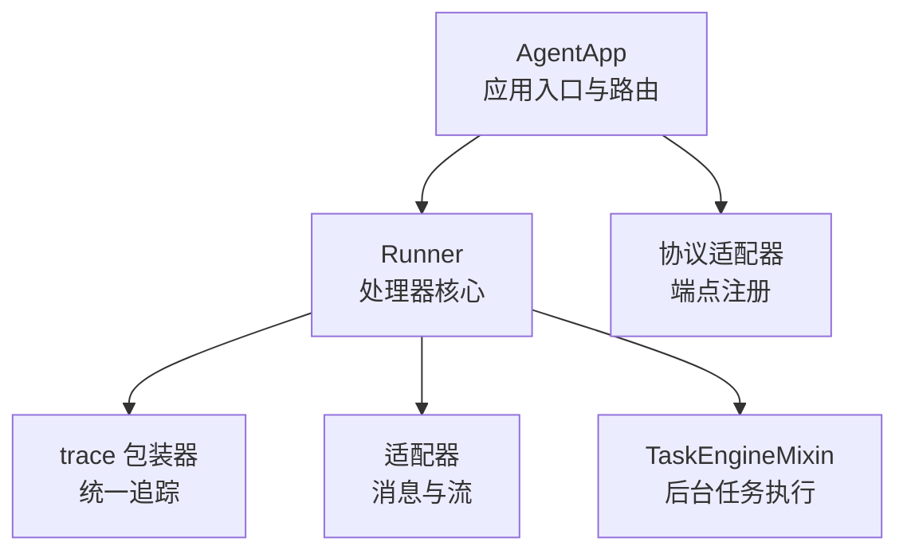
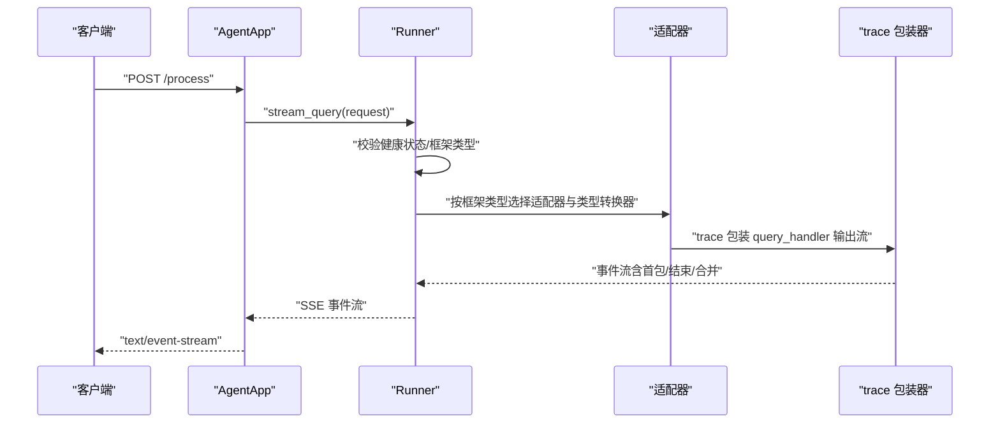
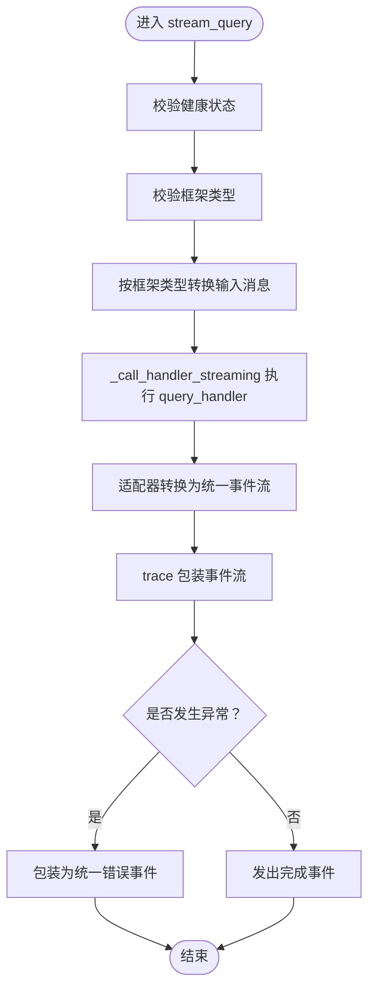
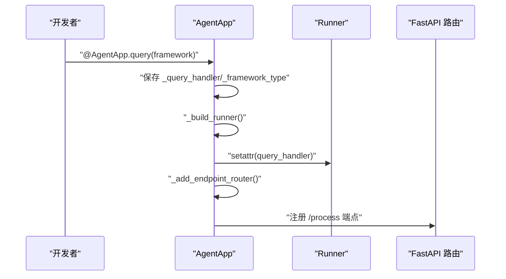
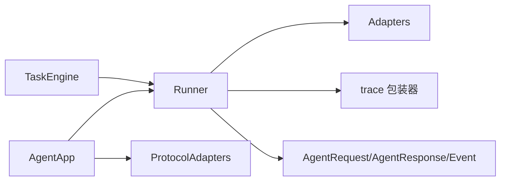

# 处理器管理

<cite>
**本文引用的文件**
- [runner.py](file://src/agentscope_runtime/engine/runner.py)
- [agent_app.py](file://src/agentscope_runtime/engine/app/agent_app.py)
- [task_engine_mixin.py](file://src/agentscope_runtime/engine/deployers/utils/service_utils/routing/task_engine_mixin.py)
- [wrapper.py](file://src/agentscope_runtime/engine/tracing/wrapper.py)
- [message.py（agentscope 适配器）](file://src/agentscope_runtime/adapters/agentscope/message.py)
- [stream.py（agentscope 适配器）](file://src/agentscope_runtime/adapters/agentscope/stream.py)
- [message.py（langgraph 适配器）](file://src/agentscope_runtime/adapters/langgraph/message.py)
- [message.py（agno 适配器）](file://src/agentscope_runtime/adapters/agno/message.py)
- [protocol.md（协议适配器文档）](file://cookbook/zh/protocol.md)
</cite>

## 目录
1. [简介](#简介)
2. [项目结构](#项目结构)
3. [核心组件](#核心组件)
4. [架构总览](#架构总览)
5. [详细组件分析](#详细组件分析)
6. [依赖分析](#依赖分析)
7. [性能考虑](#性能考虑)
8. [故障排除指南](#故障排除指南)
9. [结论](#结论)
10. [附录](#附录)

## 简介
本文件面向“Runner 处理器管理”的技术文档，围绕以下目标展开：
- 深入解释 query_handler、init_handler 和 shutdown_handler 的注册与调用机制
- 识别并执行同步与异步处理器（含协程函数检测）
- 解释处理器生命周期管理、异常捕获与错误传播
- 说明类型转换器的配置与使用、输入输出格式适配流程
- 提供处理器开发指南、最佳实践、性能优化与调试技巧
- 总结常见问题与故障排除方法

## 项目结构
本节聚焦与“处理器管理”直接相关的模块与文件：
- 引擎核心 Runner：负责处理器生命周期、查询流式执行、框架类型适配与类型转换器应用
- 应用入口 AgentApp：负责装饰器注册、构建 Runner、绑定端点路由、统一生命周期管理
- 任务引擎 TaskEngineMixin：提供后台任务执行、并发与阻塞控制、结果归一化
- 追踪包装器 trace：对处理器执行进行统一追踪、事件合并与异常传播
- 适配器消息与流：根据框架类型将输入消息转换为各框架期望的消息对象，并将输出流转换为统一事件流

图表来源
- [agent_app.py:60-120](file://src/agentscope_runtime/engine/app/agent_app.py#L60-L120)
- [runner.py:46-120](file://src/agentscope_runtime/engine/runner.py#L46-L120)
- [task_engine_mixin.py:13-120](file://src/agentscope_runtime/engine/deployers/utils/service_utils/routing/task_engine_mixin.py#L13-L120)
- [wrapper.py:94-230](file://src/agentscope_runtime/engine/tracing/wrapper.py#L94-L230)

章节来源
- [agent_app.py:60-120](file://src/agentscope_runtime/engine/app/agent_app.py#L60-L120)
- [runner.py:46-120](file://src/agentscope_runtime/engine/runner.py#L46-L120)

## 核心组件
- Runner：提供 query_handler、init_handler、shutdown_handler 的默认实现；封装 stream_query 的统一执行路径；通过框架类型选择适配器与类型转换器；内置健康状态与退出栈管理。
- AgentApp：通过装饰器将用户函数注册为 query/init/shutdown 处理器；构建 Runner 并绑定端点；统一生命周期（lifespan）管理；支持多协议适配器。
- TaskEngineMixin：提供后台任务执行能力，自动识别并执行同步/异步/生成器风格的处理器，结果归一化。
- trace 包装器：对任意处理器（同步/异步/生成器）进行统一追踪，支持首包延迟、结束原因判断与合并输出。

章节来源
- [runner.py:60-120](file://src/agentscope_runtime/engine/runner.py#L60-L120)
- [agent_app.py:722-780](file://src/agentscope_runtime/engine/app/agent_app.py#L722-L780)
- [task_engine_mixin.py:13-120](file://src/agentscope_runtime/engine/deployers/utils/service_utils/routing/task_engine_mixin.py#L13-L120)
- [wrapper.py:94-230](file://src/agentscope_runtime/engine/tracing/wrapper.py#L94-L230)

## 架构总览
下图展示从请求进入、处理器执行、适配与追踪到响应返回的完整链路：

图表来源
- [agent_app.py:798-845](file://src/agentscope_runtime/engine/app/agent_app.py#L798-L845)
- [runner.py:199-356](file://src/agentscope_runtime/engine/runner.py#L199-L356)
- [wrapper.py:94-230](file://src/agentscope_runtime/engine/tracing/wrapper.py#L94-L230)

## 详细组件分析

### Runner：处理器生命周期与执行策略
- 生命周期
  - start：检测并调用 init_handler（同步/异步），设置健康状态
  - stop：检测并调用 shutdown_handler（同步/异步），关闭退出栈，重置健康状态
  - 上下文管理：支持 async with Runner() 自动启动/停止
- 查询执行
  - stream_query：校验框架类型与健康状态；构造初始响应；根据 framework_type 选择适配器与消息转换器；将 query_handler 的输出经适配器转为统一事件流；异常捕获并转换为统一错误事件
  - 类型转换器：in_type_converters/out_type_converters 分别用于输入消息转换与输出事件转换
- 同步/异步识别与执行
  - _call_handler_streaming：自动识别 async generator、generator、coroutine、普通返回，并逐一切换为可迭代/可等待的模式
- 错误传播
  - 非 AppBaseException 统一包装为 UnknownAgentException；最终生成失败事件并结束流

图表来源
- [runner.py:199-356](file://src/agentscope_runtime/engine/runner.py#L199-L356)
- [runner.py:172-192](file://src/agentscope_runtime/engine/runner.py#L172-L192)

章节来源
- [runner.py:60-120](file://src/agentscope_runtime/engine/runner.py#L60-L120)
- [runner.py:172-192](file://src/agentscope_runtime/engine/runner.py#L172-L192)
- [runner.py:199-356](file://src/agentscope_runtime/engine/runner.py#L199-L356)

### AgentApp：处理器注册与端点绑定
- 装饰器注册
  - query(framework)：注册 query_handler，并设置 framework_type；随后构建 Runner 并绑定端点
  - init()/shutdown()：注册 init_handler/shutdown_handler（已废弃，建议使用 lifespan）
- Runner 构建与绑定
  - _build_runner：将用户函数以 MethodType 绑定到 Runner 的对应属性
  - _add_endpoint_router：动态注册 /process 端点，返回 StreamingResponse
- 生命周期管理
  - _lifespan_manager：组合内部 Runner 生命周期与用户 lifespan，确保启动/清理顺序正确
  - _internal_framework_lifespan：在内部生命周期中调用 Runner.start，注册协议适配器端点，可选启动嵌入式 Celery worker 与任务清理 worker

图表来源
- [agent_app.py:722-780](file://src/agentscope_runtime/engine/app/agent_app.py#L722-L780)
- [agent_app.py:781-845](file://src/agentscope_runtime/engine/app/agent_app.py#L781-L845)

章节来源
- [agent_app.py:722-780](file://src/agentscope_runtime/engine/app/agent_app.py#L722-L780)
- [agent_app.py:781-845](file://src/agentscope_runtime/engine/app/agent_app.py#L781-L845)
- [agent_app.py:248-316](file://src/agentscope_runtime/engine/app/agent_app.py#L248-L316)

### 类型转换器与输入输出格式适配
- 输入适配（消息转换）
  - agentscope：message_to_agentscope_msg 支持自定义 type_converters 映射，将运行时消息转换为 Msg 对象
  - langgraph：message_to_langgraph_msg 支持自定义 type_converters 映射，将运行时消息转换为 LangChain BaseMessage
  - agno：message_to_agno_message 将运行时消息转换为 OpenAI 格式
- 输出适配（事件流）
  - agentscope 流适配器将 Msg/Content 流转换为统一事件流，支持工具调用、推理内容等
- 使用方式
  - 在 Runner 中设置 in_type_converters/out_type_converters，由 stream_query 在适配阶段注入/应用

章节来源
- [message.py（agentscope 适配器）:53-393](file://src/agentscope_runtime/adapters/agentscope/message.py#L53-L393)
- [message.py（langgraph 适配器）:23-77](file://src/agentscope_runtime/adapters/langgraph/message.py#L23-L77)
- [message.py（agno 适配器）:10-39](file://src/agentscope_runtime/adapters/agno/message.py#L10-L39)
- [stream.py（agentscope 适配器）:33-187](file://src/agentscope_runtime/adapters/agentscope/stream.py#L33-L187)
- [runner.py:246-320](file://src/agentscope_runtime/engine/runner.py#L246-L320)

### 同步/异步处理器识别与执行策略
- 协程函数检测
  - Runner.start/stop：通过 inspect.iscoroutinefunction 判断 init_handler/shutdown_handler 的执行方式
  - Runner._call_handler_streaming：自动识别 async generator、generator、coroutine、普通返回
  - TaskEngineMixin：在后台任务中识别 async generator、async function、generator、普通函数，并通过线程池执行同步函数
- 执行策略
  - 同步函数：直接调用
  - 异步函数：await 执行
  - 生成器函数：在独立线程池中收集结果
  - 异步生成器：逐项消费并归一化

章节来源
- [runner.py:76-98](file://src/agentscope_runtime/engine/runner.py#L76-L98)
- [runner.py:172-192](file://src/agentscope_runtime/engine/runner.py#L172-L192)
- [task_engine_mixin.py:195-222](file://src/agentscope_runtime/engine/deployers/utils/service_utils/routing/task_engine_mixin.py#L195-L222)

### 生命周期管理与异常处理
- 生命周期
  - AgentApp._lifespan_manager：组合用户 lifespan 与内部 Runner 生命周期
  - Runner.__aenter__/__aexit__：自动 start/stop
- 异常处理
  - Runner.stream_query：捕获非 AppBaseException 并包装为 UnknownAgentException，生成失败事件
  - Runner.stop：捕获 shutdown_handler 异常并记录警告
  - TaskEngineMixin：在后台任务执行中捕获异常并记录状态

章节来源
- [agent_app.py:248-316](file://src/agentscope_runtime/engine/app/agent_app.py#L248-L316)
- [runner.py:88-121](file://src/agentscope_runtime/engine/runner.py#L88-L121)
- [runner.py:338-356](file://src/agentscope_runtime/engine/runner.py#L338-L356)
- [task_engine_mixin.py:232-240](file://src/agentscope_runtime/engine/deployers/utils/service_utils/routing/task_engine_mixin.py#L232-L240)

### 协议适配器与端点注册
- AgentApp 默认注册多种协议适配器（A2A、ResponseAPI、AGUI），通过 add_endpoint 将统一的 func（即 Runner.stream_query）挂载到不同协议的端点上
- 自定义适配器可通过继承 ProtocolAdapter 实现 add_endpoint，完成请求/响应格式转换

章节来源
- [agent_app.py:340-357](file://src/agentscope_runtime/engine/app/agent_app.py#L340-L357)
- [protocol.md（协议适配器文档）:630-671](file://cookbook/zh/protocol.md#L630-L671)

## 依赖分析
- Runner 依赖
  - 适配器：根据 framework_type 动态导入并使用消息转换与流适配
  - 追踪：通过 trace 装饰器包装 stream_query，实现统一追踪
  - Schema：使用 AgentRequest/AgentResponse/Event 等模型
- AgentApp 依赖
  - Runner：作为内部核心实例
  - 协议适配器：注册端点
  - FastAPI：路由与 lifespan 管理
- TaskEngineMixin 依赖
  - inspect：识别函数类型
  - concurrent.futures：同步函数在线程池中执行
  - Celery（可选）：分布式任务执行

图表来源
- [runner.py:20-40](file://src/agentscope_runtime/engine/runner.py#L20-L40)
- [agent_app.py:25-51](file://src/agentscope_runtime/engine/app/agent_app.py#L25-L51)
- [task_engine_mixin.py:2-7](file://src/agentscope_runtime/engine/deployers/utils/service_utils/routing/task_engine_mixin.py#L2-L7)

章节来源
- [runner.py:20-40](file://src/agentscope_runtime/engine/runner.py#L20-L40)
- [agent_app.py:25-51](file://src/agentscope_runtime/engine/app/agent_app.py#L25-L51)
- [task_engine_mixin.py:2-7](file://src/agentscope_runtime/engine/deployers/utils/service_utils/routing/task_engine_mixin.py#L2-L7)

## 性能考虑
- 生成器与异步生成器
  - 优先使用异步生成器以降低阻塞风险；同步生成器在独立线程池中执行，避免阻塞事件循环
- 线程池与并发
  - TaskEngineMixin 使用 ThreadPoolExecutor 执行同步函数；合理设置并发度，避免过多线程导致上下文切换开销
- 结果归一化
  - _coerce_result 将 Pydantic 模型、列表、字典等归一化为可序列化结构，减少下游处理成本
- 追踪开销
  - trace 包装器会带来一定的序列化与日志开销；生产环境可按需开启导出与控制日志级别

章节来源
- [task_engine_mixin.py:195-222](file://src/agentscope_runtime/engine/deployers/utils/service_utils/routing/task_engine_mixin.py#L195-L222)
- [task_engine_mixin.py:47-63](file://src/agentscope_runtime/engine/deployers/utils/service_utils/routing/task_engine_mixin.py#L47-L63)
- [wrapper.py:94-230](file://src/agentscope_runtime/engine/tracing/wrapper.py#L94-L230)

## 故障排除指南
- 启动阶段
  - init_handler 未调用：检查是否为可调用对象；确认 Runner.start 是否被正确触发
  - 健康状态异常：确保在 async with Runner() 或 AgentApp lifespan 内调用
- 执行阶段
  - query_handler 返回类型不一致：确认返回值符合框架期望；必要时使用类型转换器
  - 异步/同步混用：确保返回类型与调用方约定一致；异步生成器需逐项消费
- 关闭阶段
  - shutdown_handler 抛出异常：不影响整体关闭流程，但会记录警告；建议在关闭逻辑中自行处理异常
- 任务执行
  - 后台任务无事件：检查 stream 函数是否至少产生一个事件；超时将抛出 TimeoutError
  - Celery 未配置：fallback 到内存模式，注意内存占用与并发限制

章节来源
- [runner.py:76-98](file://src/agentscope_runtime/engine/runner.py#L76-L98)
- [runner.py:338-356](file://src/agentscope_runtime/engine/runner.py#L338-L356)
- [task_engine_mixin.py:232-347](file://src/agentscope_runtime/engine/deployers/utils/service_utils/routing/task_engine_mixin.py#L232-L347)

## 结论
本文件系统性梳理了 Runner 处理器管理的注册、生命周期、执行策略与错误处理机制，明确了同步/异步识别与类型转换器的应用方式。结合协议适配器与追踪包装器，形成了从请求到响应的完整链路。实践中应优先采用异步生成器、合理配置类型转换器，并在生命周期内妥善处理异常与资源释放。

## 附录

### 处理器开发指南与最佳实践
- 注册处理器
  - 使用 AgentApp.query(framework) 注册 query_handler，并设置 framework_type
  - 如需初始化/收尾逻辑，使用 lifespan 或在 Runner.start/stop 中处理
- 编写异步生成器
  - 优先返回异步生成器，逐条产出事件，避免阻塞
  - 若必须使用同步生成器，注意线程池开销
- 类型转换器
  - 在 Runner 中设置 in_type_converters/out_type_converters，针对特殊消息类型提供自定义转换
  - 输入转换：将运行时消息映射为框架期望的消息对象
  - 输出转换：将事件流转换为统一事件格式
- 追踪与可观测性
  - 使用 trace 包装器自动采集首包延迟、结束原因与合并输出
  - 生产环境谨慎开启导出与控制日志级别

章节来源
- [agent_app.py:722-780](file://src/agentscope_runtime/engine/app/agent_app.py#L722-L780)
- [runner.py:246-320](file://src/agentscope_runtime/engine/runner.py#L246-L320)
- [wrapper.py:94-230](file://src/agentscope_runtime/engine/tracing/wrapper.py#L94-L230)