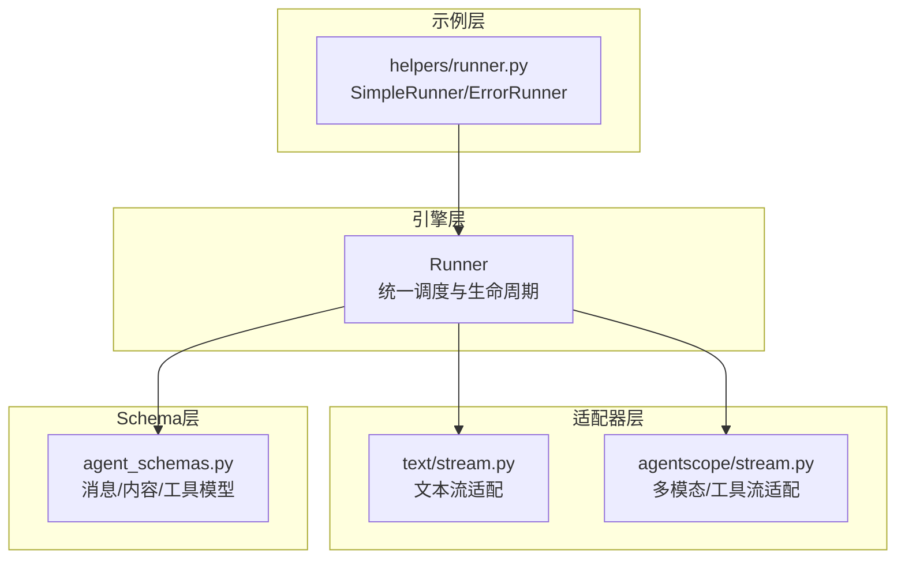
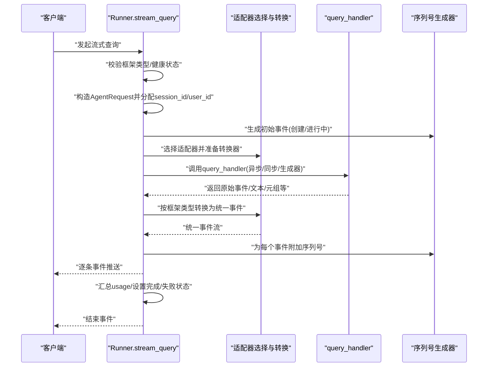
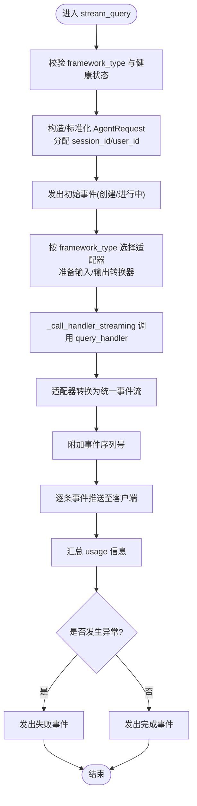
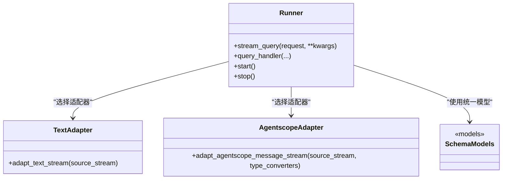
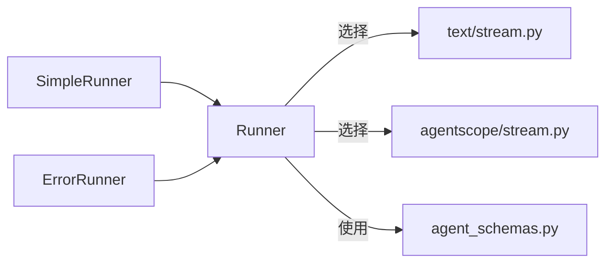

# 执行流程控制

<cite>
**本文引用的文件**
- [engine/runner.py](file://src/agentscope_runtime/engine/runner.py)
- [adapters/text/stream.py](file://src/agentscope_runtime/adapters/text/stream.py)
- [adapters/agentscope/stream.py](file://src/agentscope_runtime/adapters/agentscope/stream.py)
- [adapters/utils.py](file://src/agentscope_runtime/adapters/utils.py)
- [engine/schemas/agent_schemas.py](file://src/agentscope_runtime/engine/schemas/agent_schemas.py)
- [engine/helpers/runner.py](file://src/agentscope_runtime/engine/helpers/runner.py)
- [engine/__init__.py](file://src/agentscope_runtime/engine/__init__.py)
</cite>

## 目录
1. [引言](#引言)
2. [项目结构](#项目结构)
3. [核心组件](#核心组件)
4. [架构总览](#架构总览)
5. [详细组件分析](#详细组件分析)
6. [依赖分析](#依赖分析)
7. [性能考虑](#性能考虑)
8. [故障排查指南](#故障排查指南)
9. [结论](#结论)
10. [附录](#附录)

## 引言
本文件围绕 Runner 的执行流程控制，系统性阐述 stream_query 方法的完整执行流程、参数与请求对象处理、适配器选择逻辑、消息转换过程、事件序列号生成、会话 ID 分配与用户 ID 管理、流式处理与异步生成器使用、错误处理策略，并提供执行流程图与状态转换图。同时给出性能优化建议与内存管理最佳实践，以及常见问题与调试方法。

## 项目结构
本项目采用分层+适配器模式组织：引擎层（Runner）负责统一调度与生命周期管理；适配器层针对不同框架类型（如 text、agentscope、langgraph、agno、ms_agent_framework）进行消息格式转换与流式输出封装；Schema 层定义统一的消息、内容、工具调用等数据模型；示例层提供简单 Runner 实现用于演示。

图表来源
- [engine/runner.py:46-355](file://src/agentscope_runtime/engine/runner.py#L46-L355)
- [adapters/text/stream.py:12-31](file://src/agentscope_runtime/adapters/text/stream.py#L12-L31)
- [adapters/agentscope/stream.py:33-684](file://src/agentscope_runtime/adapters/agentscope/stream.py#L33-L684)
- [engine/schemas/agent_schemas.py:18-200](file://src/agentscope_runtime/engine/schemas/agent_schemas.py#L18-L200)
- [engine/helpers/runner.py:13-41](file://src/agentscope_runtime/engine/helpers/runner.py#L13-L41)

章节来源
- [engine/runner.py:46-355](file://src/agentscope_runtime/engine/runner.py#L46-L355)
- [engine/__init__.py:1-35](file://src/agentscope_runtime/engine/__init__.py#L1-L35)

## 核心组件
- Runner：统一的执行与生命周期管理入口，提供 stream_query 流式查询接口、部署能力、健康检查、资源清理等。
- 适配器：按框架类型选择对应的输入/输出转换器与流式适配器，将底层 query_handler 的输出转换为统一的事件流。
- Schema 模型：统一的消息类型、内容类型、运行状态、工具调用与输出等模型，支撑跨框架一致性。
- 示例 Runner：提供最小可运行示例（SimpleRunner），演示如何实现 query_handler 并以流式方式返回结果。

章节来源
- [engine/runner.py:46-355](file://src/agentscope_runtime/engine/runner.py#L46-L355)
- [adapters/text/stream.py:12-31](file://src/agentscope_runtime/adapters/text/stream.py#L12-L31)
- [adapters/agentscope/stream.py:33-684](file://src/agentscope_runtime/adapters/agentscope/stream.py#L33-L684)
- [engine/schemas/agent_schemas.py:18-200](file://src/agentscope_runtime/engine/schemas/agent_schemas.py#L18-L200)
- [engine/helpers/runner.py:13-41](file://src/agentscope_runtime/engine/helpers/runner.py#L13-L41)

## 架构总览
Runner 将外部请求标准化为 AgentRequest，分配 session_id 与 user_id，初始化事件序列号生成器，发出初始“创建”与“进行中”事件后，根据 framework_type 选择对应适配器，将 query_handler 的输出转换为统一的事件流，最终在完成或失败时发出“完成/失败”事件。

图表来源
- [engine/runner.py:199-355](file://src/agentscope_runtime/engine/runner.py#L199-L355)
- [adapters/text/stream.py:12-31](file://src/agentscope_runtime/adapters/text/stream.py#L12-L31)
- [adapters/agentscope/stream.py:33-684](file://src/agentscope_runtime/adapters/agentscope/stream.py#L33-L684)

## 详细组件分析

### Runner.stream_query 执行流程
- 参数与请求对象处理
  - 支持传入 dict 或 AgentRequest；若为 dict 则自动包装为 AgentRequest。
  - 若未提供 session_id，则自动生成 UUID；若未提供 user_id，则回退为 session_id。
- 健康与框架类型校验
  - 必须先 start 或使用 async with Runner() 启动；否则抛出异常。
  - framework_type 必须在允许集合内，否则抛出异常。
- 初始化与事件序列
  - 发出“创建”事件，随后发出“进行中”事件，作为流式开始的信号。
  - 使用 SequenceNumberGenerator 为后续事件附加序列号。
- 适配器选择与消息转换
  - 根据 framework_type 动态导入并选择适配器函数。
  - 针对 agentscope/langgraph/agno/ms_agent_framework 等框架，会将输入消息转换为对应框架的消息结构，并注入 type_converters。
  - 对于 text 框架，直接将字符串增量拼接为文本内容块。
- 调用与流式生成
  - 通过 _call_handler_streaming 统一处理 query_handler 的返回：支持协程、异步生成器、普通生成器与同步返回。
  - 将原始事件流交由适配器转换为统一事件流。
- 结束与错误处理
  - 汇总最后一条消息的 usage 信息到 response。
  - 若发生异常且非业务基类异常，则包装为未知异常并发出“失败”事件；否则发出“完成”事件。

图表来源
- [engine/runner.py:199-355](file://src/agentscope_runtime/engine/runner.py#L199-L355)

章节来源
- [engine/runner.py:199-355](file://src/agentscope_runtime/engine/runner.py#L199-L355)

### 适配器选择与消息转换
- text 框架
  - 输入为字符串增量流；适配器将增量文本封装为文本内容块，最终完成消息构建。
- agentscope 框架
  - 输入为 (Msg, 是否最后一条) 元组流；适配器解析 Msg 的 content 列表，支持 text、thinking、tool_use、tool_result 等类型。
  - 支持自定义 type_converters，将特定类型元素转换为事件流；必须返回迭代器或异步迭代器。
  - 自动处理工具调用与结果消息的成对生成与索引。
  - 支持图片、音频、视频、文件等多媒体内容的增量与完成事件。
- 其他框架
  - langgraph、agno、ms_agent_framework 等框架具有类似的输入消息转换与适配器封装逻辑，便于扩展。

图表来源
- [engine/runner.py:246-320](file://src/agentscope_runtime/engine/runner.py#L246-L320)
- [adapters/text/stream.py:12-31](file://src/agentscope_runtime/adapters/text/stream.py#L12-L31)
- [adapters/agentscope/stream.py:33-684](file://src/agentscope_runtime/adapters/agentscope/stream.py#L33-L684)
- [engine/schemas/agent_schemas.py:18-200](file://src/agentscope_runtime/engine/schemas/agent_schemas.py#L18-L200)

章节来源
- [engine/runner.py:246-320](file://src/agentscope_runtime/engine/runner.py#L246-L320)
- [adapters/text/stream.py:12-31](file://src/agentscope_runtime/adapters/text/stream.py#L12-L31)
- [adapters/agentscope/stream.py:33-684](file://src/agentscope_runtime/adapters/agentscope/stream.py#L33-L684)

### 事件序列号生成、会话ID与用户ID管理
- 事件序列号
  - 使用 SequenceNumberGenerator 为每个事件附加递增序号，确保客户端有序消费。
- 会话ID与用户ID
  - 若请求未携带 session_id，则自动生成 UUID；user_id 默认回退为 session_id。
- 运行状态
  - 初始事件为“创建”，随后为“进行中”；完成后根据是否异常分别标记“完成/失败”。

章节来源
- [engine/runner.py:224-240](file://src/agentscope_runtime/engine/runner.py#L224-L240)
- [engine/runner.py:332-355](file://src/agentscope_runtime/engine/runner.py#L332-L355)

### 流式处理与异步生成器
- 统一调用封装
  - _call_handler_streaming 支持四种返回形态：异步生成器、普通生成器、协程、同步值；统一封装为事件流。
- 适配器转换
  - 适配器内部以异步迭代方式消费源流，边消费边产出统一事件，保证低延迟与低内存占用。
- 文本适配器
  - 将字符串增量封装为文本内容块，完成后完成消息与响应构建。
- 多模态/工具适配器
  - 解析 Msg 的 content 列表，按类型拆分为文本、思考、工具调用/结果、多媒体等增量事件；支持自定义转换器扩展。

章节来源
- [engine/runner.py:172-192](file://src/agentscope_runtime/engine/runner.py#L172-L192)
- [adapters/text/stream.py:12-31](file://src/agentscope_runtime/adapters/text/stream.py#L12-L31)
- [adapters/agentscope/stream.py:33-684](file://src/agentscope_runtime/adapters/agentscope/stream.py#L33-L684)

### 错误处理策略
- 异常捕获与分类
  - 适配器转换过程中捕获异常；若非业务基类异常则包装为未知异常。
- 事件状态
  - 发生异常时发出“失败”事件；否则发出“完成”事件。
- 日志与追踪
  - 记录错误详情与堆栈，便于定位问题。

章节来源
- [engine/runner.py:332-343](file://src/agentscope_runtime/engine/runner.py#L332-L343)

### 示例 Runner（SimpleRunner/ErrorRunner）
- SimpleRunner
  - 演示最简 query_handler 实现，逐条返回文本片段，验证流式输出。
- ErrorRunner
  - 在中间抛出异常，验证错误路径与失败事件生成。

章节来源
- [engine/helpers/runner.py:13-41](file://src/agentscope_runtime/engine/helpers/runner.py#L13-L41)

## 依赖分析
- Runner 依赖适配器层按框架类型动态导入，形成松耦合的扩展点。
- 适配器依赖统一的 Schema 模型，保证事件结构一致。
- 示例 Runner 依赖 Runner 接口，便于快速集成与测试。

图表来源
- [engine/runner.py:246-320](file://src/agentscope_runtime/engine/runner.py#L246-L320)
- [adapters/text/stream.py:12-31](file://src/agentscope_runtime/adapters/text/stream.py#L12-L31)
- [adapters/agentscope/stream.py:33-684](file://src/agentscope_runtime/adapters/agentscope/stream.py#L33-L684)
- [engine/schemas/agent_schemas.py:18-200](file://src/agentscope_runtime/engine/schemas/agent_schemas.py#L18-L200)
- [engine/helpers/runner.py:13-41](file://src/agentscope_runtime/engine/helpers/runner.py#L13-L41)

章节来源
- [engine/runner.py:246-320](file://src/agentscope_runtime/engine/runner.py#L246-L320)
- [engine/helpers/runner.py:13-41](file://src/agentscope_runtime/engine/helpers/runner.py#L13-L41)

## 性能考虑
- 低延迟与低内存占用
  - 采用异步迭代与边消费边产出的策略，避免一次性缓存全部内容。
  - 适配器内部对 Msg 进行深拷贝，避免修改原对象导致的额外开销与竞态。
- 流式聚合
  - 仅在完成阶段汇总 usage，减少中间状态计算。
- 类型转换器
  - 自定义转换器需返回迭代器或异步迭代器，避免阻塞主事件循环。
- 资源管理
  - 使用 AsyncExitStack 管理资源关闭，确保 stop 阶段释放资源。

章节来源
- [adapters/agentscope/stream.py:58-684](file://src/agentscope_runtime/adapters/agentscope/stream.py#L58-L684)
- [engine/runner.py:88-104](file://src/agentscope_runtime/engine/runner.py#L88-L104)

## 故障排查指南
- 常见问题
  - 未启动 Runner 即调用 stream_query：检查是否已 start 或使用 async with Runner()。
  - framework_type 未设置或非法：确认在子类中正确设置 framework_type。
  - 适配器转换器返回类型不合法：自定义 type_converters 必须返回迭代器或异步迭代器。
  - 工具调用/结果消息未成对出现：检查上游生成逻辑，确保 tool_use 与 tool_result 成对产生。
- 调试方法
  - 启用日志：观察错误事件与堆栈信息。
  - 简化流程：使用 SimpleRunner 验证 query_handler 输出是否符合预期。
  - 分段验证：先验证文本适配器，再逐步引入多模态/工具调用场景。

章节来源
- [engine/runner.py:207-219](file://src/agentscope_runtime/engine/runner.py#L207-L219)
- [engine/runner.py:332-343](file://src/agentscope_runtime/engine/runner.py#L332-L343)
- [engine/helpers/runner.py:13-41](file://src/agentscope_runtime/engine/helpers/runner.py#L13-L41)

## 结论
Runner 的 stream_query 提供了统一的流式执行入口，通过适配器层实现对多框架的无缝支持。其设计强调异步、低延迟与可扩展性，配合完善的错误处理与事件序列号机制，能够满足复杂对话与工具调用场景下的实时交互需求。建议在生产环境中结合日志与监控，持续优化适配器转换器与资源管理策略。

## 附录
- 关键流程与状态
  - 创建 → 进行中 → 文本/思考/工具/多媒体增量 → 完成/失败
- 参考实现
  - text 适配器：将字符串增量转为文本内容块
  - agentscope 适配器：解析 Msg 的 content 列表，支持多种类型与工具调用/结果