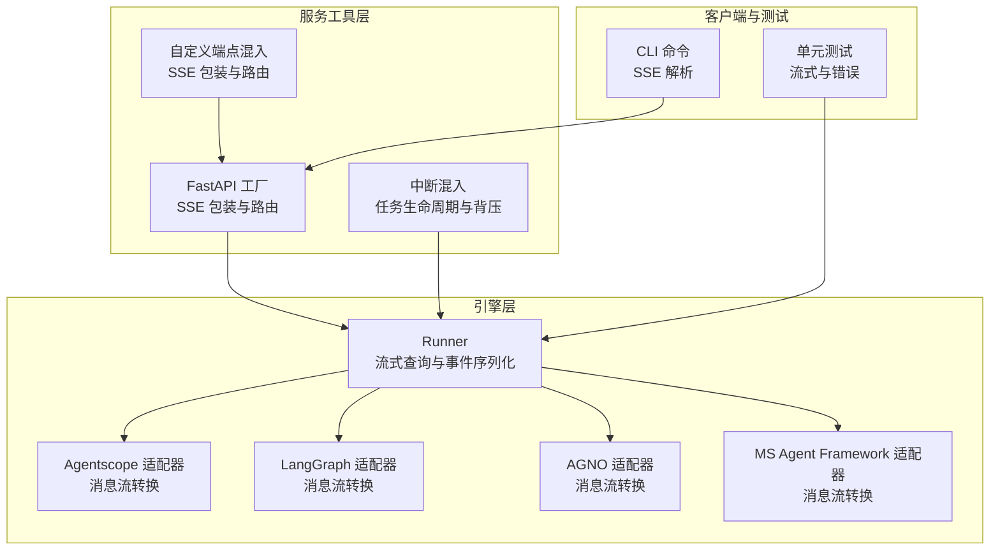
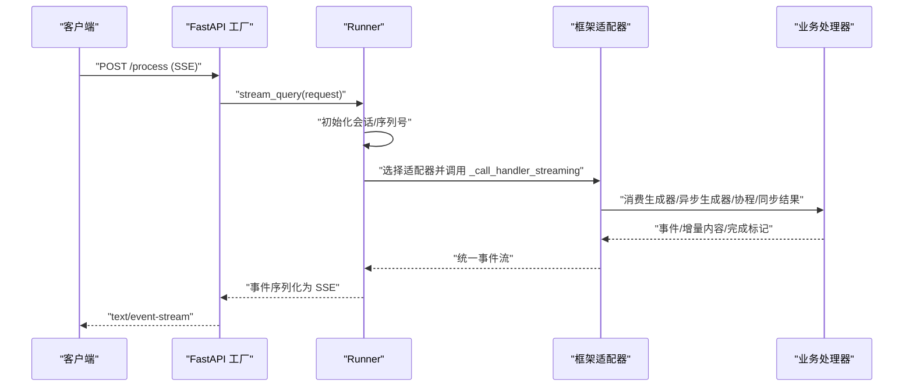
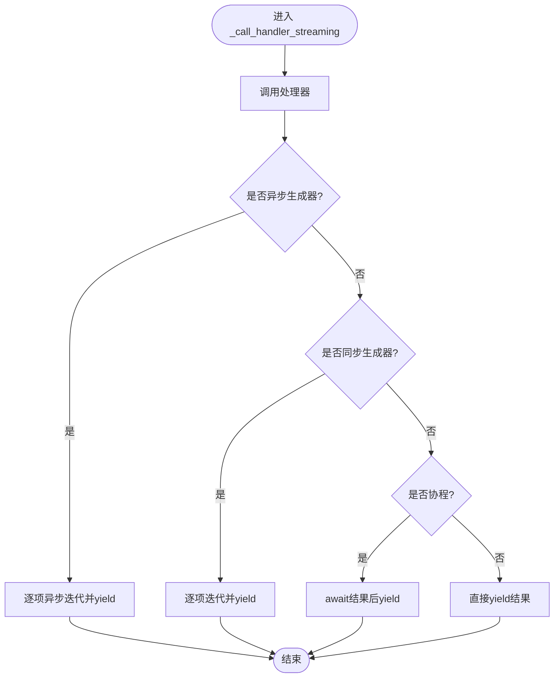
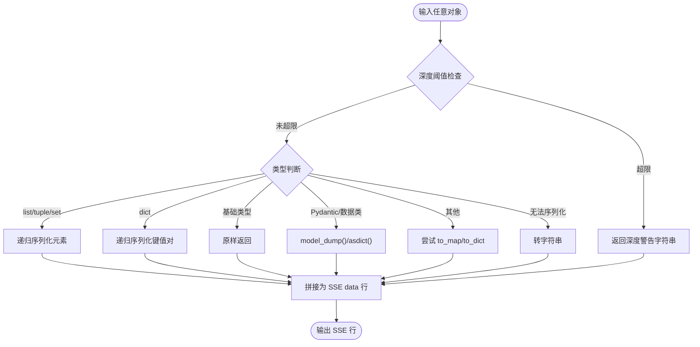
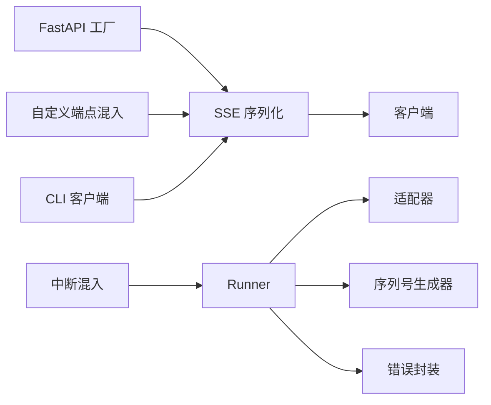

# 流式处理机制

<cite>
**本文档引用的文件**
- [runner.py](file://src/agentscope_runtime/engine/runner.py)
- [fastapi_factory.py](file://src/agentscope_runtime/engine/deployers/utils/service_utils/fastapi_factory.py)
- [custom_endpoint_mixin.py](file://src/agentscope_runtime/engine/deployers/utils/service_utils/routing/custom_endpoint_mixin.py)
- [stream.py](file://src/agentscope_runtime/adapters/agentscope/stream.py)
- [chat.py](file://src/agentscope_runtime/cli/commands/chat.py)
- [interrupt_mixin.py](file://src/agentscope_runtime/engine/deployers/utils/service_utils/interrupt/interrupt_mixin.py)
- [agent_api_client.py](file://src/agentscope_runtime/engine/helpers/agent_api_client.py)
- [test_runner_stream.py](file://tests/unit/test_runner_stream.py)
- [test_agent_app_custom_endpoint.py](file://tests/unit/test_agent_app_custom_endpoint.py)
</cite>

## 目录
1. [引言](#引言)
2. [项目结构](#项目结构)
3. [核心组件](#核心组件)
4. [架构总览](#架构总览)
5. [详细组件分析](#详细组件分析)
6. [依赖关系分析](#依赖关系分析)
7. [性能考虑](#性能考虑)
8. [故障排除指南](#故障排除指南)
9. [结论](#结论)

## 引言
本文件系统性阐述 Runner 的流式处理机制，重点围绕 `_call_handler_streaming` 方法的流式调用逻辑、生成器检测与异步处理策略，以及在不同框架（Agentscope、LangGraph、AGNO、MS Agent Framework 等）下的统一适配。文档还涵盖流式数据传输协议（SSE）、事件序列化与消息合并机制、背压控制与内存管理、性能优化策略、实现示例与调试方法，并给出完整性保证与错误恢复机制。

## 项目结构
本项目采用分层架构：Engine 层负责运行时调度与流式适配；Adapters 层针对不同框架的消息格式进行转换；Service Utils 提供 FastAPI 工厂与自定义端点包装；CLI 提供命令行工具解析 SSE；Tests 覆盖流式场景与错误路径。

**图表来源**
- [runner.py:172-192](file://src/agentscope_runtime/engine/runner.py#L172-L192)
- [fastapi_factory.py:597-627](file://src/agentscope_runtime/engine/deployers/utils/service_utils/fastapi_factory.py#L597-L627)
- [custom_endpoint_mixin.py:15-58](file://src/agentscope_runtime/engine/deployers/utils/service_utils/routing/custom_endpoint_mixin.py#L15-L58)
- [interrupt_mixin.py:35-107](file://src/agentscope_runtime/engine/deployers/utils/service_utils/interrupt/interrupt_mixin.py#L35-L107)

**章节来源**
- [runner.py:1-356](file://src/agentscope_runtime/engine/runner.py#L1-L356)
- [fastapi_factory.py:1-1129](file://src/agentscope_runtime/engine/deployers/utils/service_utils/fastapi_factory.py#L1-L1129)
- [custom_endpoint_mixin.py:1-235](file://src/agentscope_runtime/engine/deployers/utils/service_utils/routing/custom_endpoint_mixin.py#L1-L235)
- [interrupt_mixin.py:1-107](file://src/agentscope_runtime/engine/deployers/utils/service_utils/interrupt/interrupt_mixin.py#L1-L107)

## 核心组件
- Runner：统一的流式查询入口，负责参数校验、会话与用户标识分配、事件序列号生成、框架适配器选择与错误包装。
- 适配器：将各框架的生成器输出转换为统一的事件流（消息、内容增量、完成状态等）。
- FastAPI 工厂与自定义端点混入：将任意处理器（同步/异步/生成器）包装为 SSE 流响应，自动处理签名保留与异常转错误事件。
- 中断混入：支持分布式任务中断，通过队列与状态机实现背压与取消。
- CLI 客户端：解析 SSE 数据行，按对象类型与状态进行处理。

**章节来源**
- [runner.py:172-192](file://src/agentscope_runtime/engine/runner.py#L172-L192)
- [stream.py:33-684](file://src/agentscope_runtime/adapters/agentscope/stream.py#L33-L684)
- [fastapi_factory.py:696-726](file://src/agentscope_runtime/engine/deployers/utils/service_utils/fastapi_factory.py#L696-L726)
- [custom_endpoint_mixin.py:125-206](file://src/agentscope_runtime/engine/deployers/utils/service_utils/routing/custom_endpoint_mixin.py#L125-L206)
- [interrupt_mixin.py:35-107](file://src/agentscope_runtime/engine/deployers/utils/service_utils/interrupt/interrupt_mixin.py#L35-L107)
- [chat.py:517-521](file://src/agentscope_runtime/cli/commands/chat.py#L517-L521)

## 架构总览
下图展示从请求到 SSE 事件的完整链路，包括 Runner 的统一适配、框架特定适配器、SSE 序列化与客户端解析。

**图表来源**
- [fastapi_factory.py:597-627](file://src/agentscope_runtime/engine/deployers/utils/service_utils/fastapi_factory.py#L597-L627)
- [runner.py:199-356](file://src/agentscope_runtime/engine/runner.py#L199-L356)
- [stream.py:33-684](file://src/agentscope_runtime/adapters/agentscope/stream.py#L33-L684)

## 详细组件分析

### Runner 流式调用与生成器检测
- 统一入口：`stream_query` 负责初始化请求、分配会话与用户 ID、生成序列号、发送初始与进行中事件，并最终产出完成或失败事件。
- 生成器检测：`_call_handler_streaming` 通过类型检查分别处理异步生成器、同步生成器、协程与普通返回值，确保统一的流式产出。
- 框架适配：根据 `framework_type` 选择对应适配器，将底层生成器转换为统一事件流；同时支持自定义类型转换器扩展。

**图表来源**
- [runner.py:172-192](file://src/agentscope_runtime/engine/runner.py#L172-L192)

**章节来源**
- [runner.py:172-192](file://src/agentscope_runtime/engine/runner.py#L172-L192)
- [runner.py:199-356](file://src/agentscope_runtime/engine/runner.py#L199-L356)

### SSE 序列化与事件包装
- 自动签名保留：FastAPI 工厂与自定义端点混入均通过手动复制函数元数据避免 `functools.wraps` 导致的类型误判，确保异步生成器被正确等待。
- 序列化策略：`_to_sse_event` 将任意可序列化对象递归序列化为 JSON，并以 SSE `data:` 行形式输出，支持 BaseModel、dataclass、dict/list/tuple/set 等。
- 错误事件：当处理器抛出异常时，包装器生成包含错误信息的事件，客户端据此终止或重试。

**图表来源**
- [fastapi_factory.py:696-726](file://src/agentscope_runtime/engine/deployers/utils/service_utils/fastapi_factory.py#L696-L726)
- [custom_endpoint_mixin.py:94-123](file://src/agentscope_runtime/engine/deployers/utils/service_utils/routing/custom_endpoint_mixin.py#L94-L123)

**章节来源**
- [fastapi_factory.py:696-726](file://src/agentscope_runtime/engine/deployers/utils/service_utils/fastapi_factory.py#L696-L726)
- [custom_endpoint_mixin.py:94-123](file://src/agentscope_runtime/engine/deployers/utils/service_utils/routing/custom_endpoint_mixin.py#L94-L123)

### 不同生成器类型的识别与处理策略
- 异步生成器（async def ... yield）：直接异步迭代并逐项序列化为 SSE。
- 同步生成器（def ... yield）：同步迭代并逐项序列化为 SSE。
- 协程（async def 返回 awaitable）：await 后单次产出。
- 普通返回值：直接序列化为 SSE。
- 自定义端点：通过混入自动识别并包装，保持参数解析能力。

**章节来源**
- [runner.py:172-192](file://src/agentscope_runtime/engine/runner.py#L172-L192)
- [custom_endpoint_mixin.py:157-206](file://src/agentscope_runtime/engine/deployers/utils/service_utils/routing/custom_endpoint_mixin.py#L157-L206)

### 事件序列化与消息合并机制
- 事件序列号：使用 `SequenceNumberGenerator` 为每个事件附加序号，便于客户端重建顺序。
- 消息增量：文本、图像、音频、视频、文件等通过增量内容（delta）逐步产出，最后统一完成。
- 内容合并：适配器对 Agentscope 消息进行增量合并，避免重复与越界输出；支持工具调用与结果的成对处理。
- 完整性保证：在消息末尾发出完成事件，客户端据此判定流结束。

**章节来源**
- [runner.py:230-239](file://src/agentscope_runtime/engine/runner.py#L230-L239)
- [runner.py:332-337](file://src/agentscope_runtime/engine/runner.py#L332-L337)
- [stream.py:119-228](file://src/agentscope_runtime/adapters/agentscope/stream.py#L119-L228)
- [stream.py:292-468](file://src/agentscope_runtime/adapters/agentscope/stream.py#L292-L468)

### 背压控制、内存管理与性能优化
- 背压控制：中断混入通过队列与状态机实现，当收到中断信号时立即停止消费并关闭生成器实例，避免堆积。
- 内存管理：任务执行模式仅保留最终事件以减少中间事件占用；长轮询或高并发场景建议限制并发与缓冲大小。
- 性能优化：优先使用异步生成器；避免在事件序列化中进行重型计算；合理设置客户端缓冲与解析频率。

**章节来源**
- [interrupt_mixin.py:35-107](file://src/agentscope_runtime/engine/deployers/utils/service_utils/interrupt/interrupt_mixin.py#L35-L107)
- [task_engine_mixin.py:241-267](file://src/agentscope_runtime/engine/deployers/utils/service_utils/routing/task_engine_mixin.py#L241-L267)

### 实现示例与调试方法
- 示例路径：参考集成测试中的 Agentscope/LangGraph/AGNO/MS Agent Framework 流式示例，验证不同框架的流式行为。
- 调试技巧：
  - 使用 CLI 命令行工具以流式方式发起请求并实时打印事件。
  - 在客户端侧解析 SSE 行，区分 data 与事件类型，捕获错误事件并记录堆栈。
  - 对自定义处理器启用日志，观察包装器的异常事件输出。

**章节来源**
- [chat.py:701-737](file://src/agentscope_runtime/cli/commands/chat.py#L701-L737)
- [agent_api_client.py:76-101](file://src/agentscope_runtime/engine/helpers/agent_api_client.py#L76-L101)
- [test_agent_app_custom_endpoint.py:206-247](file://tests/unit/test_agent_app_custom_endpoint.py#L206-L247)

### 完整性保证与错误恢复机制
- 完整性：通过初始“进行中”事件与最终完成/失败事件确保客户端能够正确重建消息；增量内容在最后统一完成。
- 错误恢复：包装器捕获异常并生成标准化错误事件；客户端可根据错误类型决定重试或降级策略；Runner 将未知异常包装为标准错误对象。

**章节来源**
- [runner.py:338-356](file://src/agentscope_runtime/engine/runner.py#L338-L356)
- [fastapi_factory.py:768-779](file://src/agentscope_runtime/engine/deployers/utils/service_utils/fastapi_factory.py#L768-L779)
- [custom_endpoint_mixin.py:166-176](file://src/agentscope_runtime/engine/deployers/utils/service_utils/routing/custom_endpoint_mixin.py#L166-L176)

## 依赖关系分析
- Runner 依赖适配器层以统一不同框架的消息格式；依赖序列号生成器与错误封装。
- FastAPI 工厂与自定义端点混入共同提供 SSE 包装与路由；二者均依赖类型检查与签名保留策略。
- 中断混入为 Runner 提供分布式任务生命周期管理，配合队列实现背压。
- CLI 客户端依赖 SSE 解析工具，用于本地调试与演示。

**图表来源**
- [runner.py:199-356](file://src/agentscope_runtime/engine/runner.py#L199-L356)
- [fastapi_factory.py:696-726](file://src/agentscope_runtime/engine/deployers/utils/service_utils/fastapi_factory.py#L696-L726)
- [custom_endpoint_mixin.py:94-123](file://src/agentscope_runtime/engine/deployers/utils/service_utils/routing/custom_endpoint_mixin.py#L94-L123)
- [interrupt_mixin.py:35-107](file://src/agentscope_runtime/engine/deployers/utils/service_utils/interrupt/interrupt_mixin.py#L35-L107)
- [chat.py:517-521](file://src/agentscope_runtime/cli/commands/chat.py#L517-L521)

**章节来源**
- [runner.py:1-356](file://src/agentscope_runtime/engine/runner.py#L1-L356)
- [fastapi_factory.py:1-1129](file://src/agentscope_runtime/engine/deployers/utils/service_utils/fastapi_factory.py#L1-L1129)
- [custom_endpoint_mixin.py:1-235](file://src/agentscope_runtime/engine/deployers/utils/service_utils/routing/custom_endpoint_mixin.py#L1-L235)
- [interrupt_mixin.py:1-107](file://src/agentscope_runtime/engine/deployers/utils/service_utils/interrupt/interrupt_mixin.py#L1-L107)
- [chat.py:1-737](file://src/agentscope_runtime/cli/commands/chat.py#L1-L737)

## 性能考虑
- 优先使用异步生成器以降低阻塞与上下文切换开销。
- 控制事件粒度：过细的增量可能导致网络与解析成本上升，应权衡实时性与性能。
- 避免在序列化阶段进行昂贵操作；必要时将 CPU 密集型任务移至后台或外部服务。
- 对高并发场景，结合中断混入与队列限制同时运行的任务数量，防止资源耗尽。

## 故障排除指南
- SSE 解析异常：确认客户端正确解析 `data:` 行并区分对象类型与状态字段。
- 处理器类型误判：若出现“非可迭代协程”错误，请检查是否对异步生成器使用了 `functools.wraps`，应采用手动元数据复制策略。
- 错误事件缺失：检查包装器是否捕获异常并生成错误事件；客户端需在收到错误事件后终止或回退。
- 中断无效：确认中断后端状态机与队列通道配置正确，且生成器实例在 finally 中被正确关闭。

**章节来源**
- [fastapi_factory.py:735-758](file://src/agentscope_runtime/engine/deployers/utils/service_utils/fastapi_factory.py#L735-L758)
- [custom_endpoint_mixin.py:133-156](file://src/agentscope_runtime/engine/deployers/utils/service_utils/routing/custom_endpoint_mixin.py#L133-L156)
- [interrupt_mixin.py:70-107](file://src/agentscope_runtime/engine/deployers/utils/service_utils/interrupt/interrupt_mixin.py#L70-L107)
- [test_agent_app_custom_endpoint.py:206-247](file://tests/unit/test_agent_app_custom_endpoint.py#L206-L247)

## 结论
Runner 的流式处理机制通过统一的生成器检测与适配器层，实现了对同步、异步与协程的无缝支持；借助 SSE 序列化与事件序列号，保障了消息的有序与可恢复；结合中断混入与任务执行模式，提供了背压控制与内存优化。实践中应优先采用异步生成器、合理设计事件粒度，并在客户端侧完善错误事件处理与调试流程。