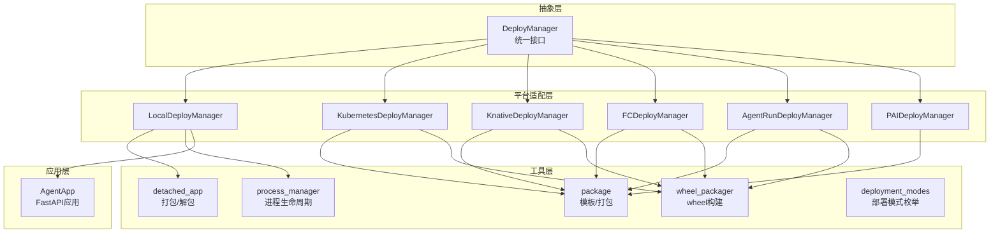
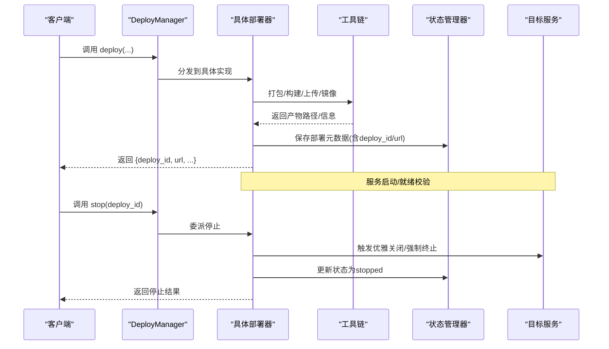
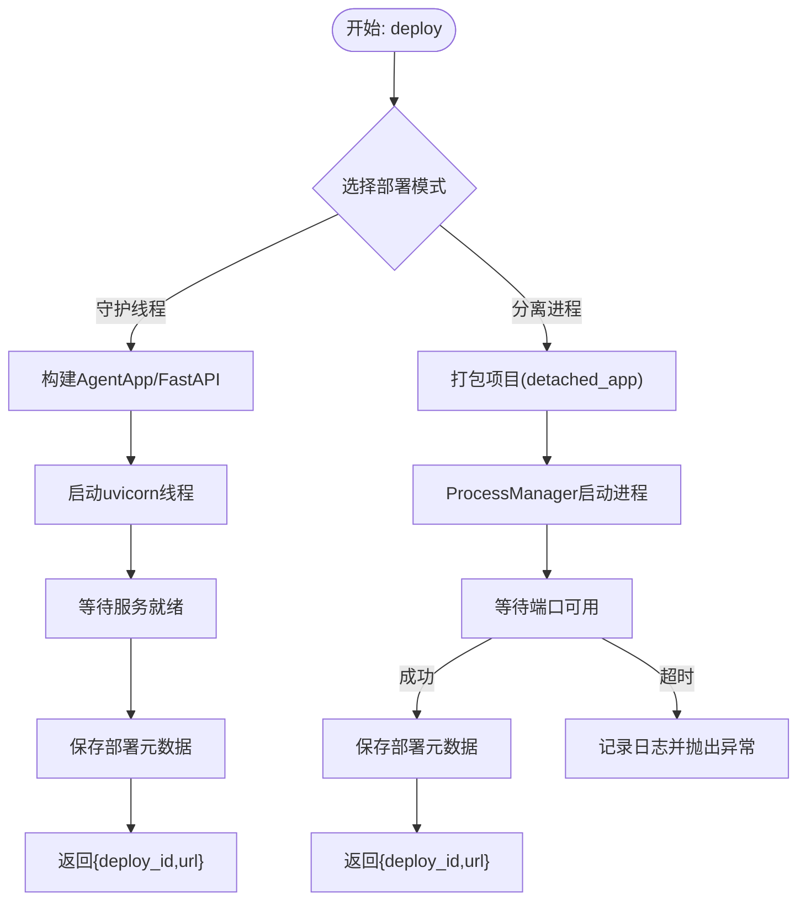
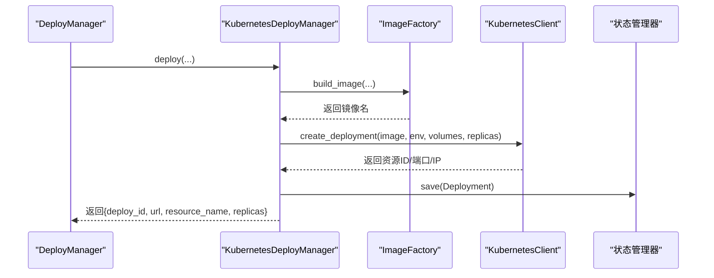
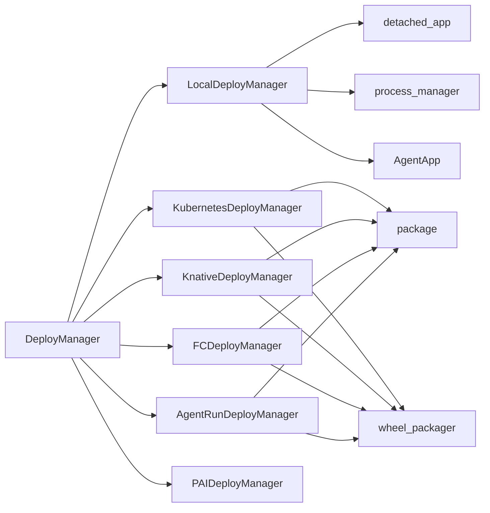

# 部署集成机制

<cite>
**本文档引用的文件**
- [engine/deployers/base.py](file://src/agentscope_runtime/engine/deployers/base.py)
- [engine/deployers/local_deployer.py](file://src/agentscope_runtime/engine/deployers/local_deployer.py)
- [engine/deployers/agentrun_deployer.py](file://src/agentscope_runtime/engine/deployers/agentrun_deployer.py)
- [engine/deployers/kubernetes_deployer.py](file://src/agentscope_runtime/engine/deployers/kubernetes_deployer.py)
- [engine/deployers/knative_deployer.py](file://src/agentscope_runtime/engine/deployers/knative_deployer.py)
- [engine/deployers/fc_deployer.py](file://src/agentscope_runtime/engine/deployers/fc_deployer.py)
- [engine/deployers/pai_deployer.py](file://src/agentscope_runtime/engine/deployers/pai_deployer.py)
- [engine/deployers/utils/deployment_modes.py](file://src/agentscope_runtime/engine/deployers/utils/deployment_modes.py)
- [engine/deployers/utils/detached_app.py](file://src/agentscope_runtime/engine/deployers/utils/detached_app.py)
- [engine/deployers/utils/package.py](file://src/agentscope_runtime/engine/deployers/utils/package.py)
- [engine/deployers/utils/wheel_packager.py](file://src/agentscope_runtime/engine/deployers/utils/wheel_packager.py)
- [engine/deployers/utils/service_utils/process_manager.py](file://src/agentscope_runtime/engine/deployers/utils/service_utils/process_manager.py)
- [engine/app/agent_app.py](file://src/agentscope_runtime/engine/app/agent_app.py)
</cite>

## 目录
1. [简介](#简介)
2. [项目结构](#项目结构)
3. [核心组件](#核心组件)
4. [架构总览](#架构总览)
5. [详细组件分析](#详细组件分析)
6. [依赖关系分析](#依赖关系分析)
7. [性能考虑](#性能考虑)
8. [故障排除指南](#故障排除指南)
9. [结论](#结论)
10. [附录](#附录)

## 简介
本文件系统性阐述 Runner 的部署集成机制，围绕 DeployManager 抽象类与各平台部署器（本地、Kubernetes、Knative、阿里云函数计算、AgentRun、PAI）的 deploy 方法展开，详细说明部署流程、参数配置、部署模式、容器化与环境变量管理、部署结果存储与部署 ID 管理、多实例协调、异常处理与回滚策略、资源清理、性能优化与故障排除等。文档同时提供配置示例与最佳实践建议，帮助开发者在不同环境中稳定、高效地完成服务部署。

## 项目结构
该模块采用“统一抽象 + 多平台适配”的分层设计：
- 抽象层：DeployManager 定义统一接口（deploy/stop），并内置部署状态管理。
- 平台适配层：各部署器实现具体 deploy/stop 流程，封装平台差异。
- 工具层：打包、镜像构建、进程管理、模板渲染等工具支撑部署流程。
- 应用层：AgentApp 提供统一的 FastAPI 应用骨架，支持多协议适配与中断控制。

图示来源
- [engine/deployers/base.py:9-44](file://src/agentscope_runtime/engine/deployers/base.py#L9-L44)
- [engine/deployers/local_deployer.py:27-645](file://src/agentscope_runtime/engine/deployers/local_deployer.py#L27-L645)
- [engine/deployers/kubernetes_deployer.py:48-391](file://src/agentscope_runtime/engine/deployers/kubernetes_deployer.py#L48-L391)
- [engine/deployers/knative_deployer.py:43-291](file://src/agentscope_runtime/engine/deployers/knative_deployer.py#L43-L291)
- [engine/deployers/fc_deployer.py:246-1507](file://src/agentscope_runtime/engine/deployers/fc_deployer.py#L246-L1507)
- [engine/deployers/agentrun_deployer.py:264-2672](file://src/agentscope_runtime/engine/deployers/agentrun_deployer.py#L264-L2672)
- [engine/deployers/pai_deployer.py:1-2336](file://src/agentscope_runtime/engine/deployers/pai_deployer.py#L1-L2336)
- [engine/deployers/utils/detached_app.py:40-602](file://src/agentscope_runtime/engine/deployers/utils/detached_app.py#L40-L602)
- [engine/deployers/utils/package.py:580-748](file://src/agentscope_runtime/engine/deployers/utils/package.py#L580-L748)
- [engine/deployers/utils/wheel_packager.py:145-475](file://src/agentscope_runtime/engine/deployers/utils/wheel_packager.py#L145-L475)
- [engine/deployers/utils/service_utils/process_manager.py:12-441](file://src/agentscope_runtime/engine/deployers/utils/service_utils/process_manager.py#L12-L441)
- [engine/deployers/utils/deployment_modes.py:7-15](file://src/agentscope_runtime/engine/deployers/utils/deployment_modes.py#L7-L15)
- [engine/app/agent_app.py:60-943](file://src/agentscope_runtime/engine/app/agent_app.py#L60-L943)

章节来源
- [engine/deployers/base.py:9-44](file://src/agentscope_runtime/engine/deployers/base.py#L9-L44)
- [engine/deployers/local_deployer.py:27-645](file://src/agentscope_runtime/engine/deployers/local_deployer.py#L27-L645)
- [engine/deployers/kubernetes_deployer.py:48-391](file://src/agentscope_runtime/engine/deployers/kubernetes_deployer.py#L48-L391)
- [engine/deployers/knative_deployer.py:43-291](file://src/agentscope_runtime/engine/deployers/knative_deployer.py#L43-L291)
- [engine/deployers/fc_deployer.py:246-1507](file://src/agentscope_runtime/engine/deployers/fc_deployer.py#L246-L1507)
- [engine/deployers/agentrun_deployer.py:264-2672](file://src/agentscope_runtime/engine/deployers/agentrun_deployer.py#L264-L2672)
- [engine/deployers/pai_deployer.py:1-2336](file://src/agentscope_runtime/engine/deployers/pai_deployer.py#L1-L2336)
- [engine/deployers/utils/detached_app.py:40-602](file://src/agentscope_runtime/engine/deployers/utils/detached_app.py#L40-L602)
- [engine/deployers/utils/package.py:580-748](file://src/agentscope_runtime/engine/deployers/utils/package.py#L580-L748)
- [engine/deployers/utils/wheel_packager.py:145-475](file://src/agentscope_runtime/engine/deployers/utils/wheel_packager.py#L145-L475)
- [engine/deployers/utils/service_utils/process_manager.py:12-441](file://src/agentscope_runtime/engine/deployers/utils/service_utils/process_manager.py#L12-L441)
- [engine/deployers/utils/deployment_modes.py:7-15](file://src/agentscope_runtime/engine/deployers/utils/deployment_modes.py#L7-L15)
- [engine/app/agent_app.py:60-943](file://src/agentscope_runtime/engine/app/agent_app.py#L60-L943)

## 核心组件
- DeployManager 抽象基类：定义统一的 deploy/stop 接口，生成唯一部署 ID，并通过状态管理器持久化部署元数据。
- 各平台部署器：实现具体 deploy/stop 流程，封装平台特定的资源编排、镜像构建、上传与发布逻辑。
- 工具链：detached_app 打包/解包、package 模板渲染与项目打包、wheel_packager wheel 构建、process_manager 进程生命周期管理、deployment_modes 部署模式枚举。
- AgentApp：统一的 FastAPI 应用骨架，支持多协议适配、流式任务、中断控制与健康检查端点。

章节来源
- [engine/deployers/base.py:9-44](file://src/agentscope_runtime/engine/deployers/base.py#L9-L44)
- [engine/deployers/utils/deployment_modes.py:7-15](file://src/agentscope_runtime/engine/deployers/utils/deployment_modes.py#L7-L15)
- [engine/deployers/utils/detached_app.py:40-602](file://src/agentscope_runtime/engine/deployers/utils/detached_app.py#L40-L602)
- [engine/deployers/utils/package.py:580-748](file://src/agentscope_runtime/engine/deployers/utils/package.py#L580-L748)
- [engine/deployers/utils/wheel_packager.py:145-475](file://src/agentscope_runtime/engine/deployers/utils/wheel_packager.py#L145-L475)
- [engine/deployers/utils/service_utils/process_manager.py:12-441](file://src/agentscope_runtime/engine/deployers/utils/service_utils/process_manager.py#L12-L441)
- [engine/app/agent_app.py:60-943](file://src/agentscope_runtime/engine/app/agent_app.py#L60-L943)

## 架构总览
下图展示从调用 deploy 到服务上线的关键路径，以及状态管理与资源清理的交互：

图示来源
- [engine/deployers/base.py:23-44](file://src/agentscope_runtime/engine/deployers/base.py#L23-L44)
- [engine/deployers/local_deployer.py:68-174](file://src/agentscope_runtime/engine/deployers/local_deployer.py#L68-L174)
- [engine/deployers/kubernetes_deployer.py:126-312](file://src/agentscope_runtime/engine/deployers/kubernetes_deployer.py#L126-L312)
- [engine/deployers/knative_deployer.py:71-222](file://src/agentscope_runtime/engine/deployers/knative_deployer.py#L71-L222)
- [engine/deployers/fc_deployer.py:416-582](file://src/agentscope_runtime/engine/deployers/fc_deployer.py#L416-L582)
- [engine/deployers/agentrun_deployer.py:521-733](file://src/agentscope_runtime/engine/deployers/agentrun_deployer.py#L521-L733)
- [engine/deployers/pai_deployer.py:1-2336](file://src/agentscope_runtime/engine/deployers/pai_deployer.py#L1-L2336)

## 详细组件分析

### DeployManager 抽象与状态管理
- 统一接口：deploy/stop 必须由子类实现；stop 返回标准化结果字典。
- 部署 ID：使用 UUID 生成全局唯一标识，便于跨平台追踪。
- 状态管理：默认使用 DeploymentStateManager，保存/更新部署元数据（平台、URL、状态、配置等）。

章节来源
- [engine/deployers/base.py:9-44](file://src/agentscope_runtime/engine/deployers/base.py#L9-L44)

### 本地部署 LocalDeployManager
- 支持两种模式：
  - 守护线程模式（DAEMON_THREAD）：在当前进程中启动 uvicorn 服务器线程，适合开发调试。
  - 分离进程模式（DETACHED_PROCESS）：打包项目后以独立进程运行，支持日志轮转与 PID 文件管理。
- 关键流程：
  - 守护线程模式：构建 AgentApp/FastAPI，配置 uvicorn，启动线程并等待就绪。
  - 分离进程模式：通过 detached_app 打包项目，使用 ProcessManager 启动进程，等待端口可用，记录部署元数据。
- 停止流程：优先尝试 HTTP /shutdown，失败则直接终止进程；清理 PID 文件与日志。
- 就绪检测：对 0.0.0.0 绑定进行主机规范化，避免连接失败。

图示来源
- [engine/deployers/local_deployer.py:68-174](file://src/agentscope_runtime/engine/deployers/local_deployer.py#L68-L174)
- [engine/deployers/local_deployer.py:260-383](file://src/agentscope_runtime/engine/deployers/local_deployer.py#L260-L383)
- [engine/deployers/local_deployer.py:415-511](file://src/agentscope_runtime/engine/deployers/local_deployer.py#L415-L511)
- [engine/deployers/utils/detached_app.py:40-144](file://src/agentscope_runtime/engine/deployers/utils/detached_app.py#L40-L144)
- [engine/deployers/utils/service_utils/process_manager.py:25-138](file://src/agentscope_runtime/engine/deployers/utils/service_utils/process_manager.py#L25-L138)

章节来源
- [engine/deployers/local_deployer.py:27-645](file://src/agentscope_runtime/engine/deployers/local_deployer.py#L27-L645)
- [engine/deployers/utils/deployment_modes.py:7-15](file://src/agentscope_runtime/engine/deployers/utils/deployment_modes.py#L7-L15)
- [engine/deployers/utils/detached_app.py:40-602](file://src/agentscope_runtime/engine/deployers/utils/detached_app.py#L40-L602)
- [engine/deployers/utils/service_utils/process_manager.py:12-441](file://src/agentscope_runtime/engine/deployers/utils/service_utils/process_manager.py#L12-L441)

### Kubernetes 部署 KubernetesDeployManager
- 功能：基于 ImageFactory 构建镜像，使用 KubernetesClient 创建 Deployment/Service，自动选择内网/外网访问地址。
- 关键流程：
  - 构建镜像：支持缓存、推送、自定义镜像名/标签、端口映射、卷挂载、环境变量注入。
  - 创建资源：根据部署 ID 生成资源名，创建 Deployment 与 Service，解析 URL。
  - 停止流程：删除 Deployment，更新状态。
- 环境适配：本地集群（Minikube/Kind）自动回退到 127.0.0.1 访问。

图示来源
- [engine/deployers/kubernetes_deployer.py:126-312](file://src/agentscope_runtime/engine/deployers/kubernetes_deployer.py#L126-L312)
- [engine/deployers/kubernetes_deployer.py:313-377](file://src/agentscope_runtime/engine/deployers/kubernetes_deployer.py#L313-L377)

章节来源
- [engine/deployers/kubernetes_deployer.py:48-391](file://src/agentscope_runtime/engine/deployers/kubernetes_deployer.py#L48-L391)

### Knative 部署 KnativeDeployManager
- 功能：将 Runner 打包为 Knative Service，支持注解/标签扩展。
- 关键流程：
  - 构建镜像：与 Kubernetes 类似。
  - 创建 KService：设置端口、环境变量、卷挂载、注解/标签。
  - 停止流程：删除 KService。
- 适用场景：需要按需扩缩容与自动伸缩的服务。

章节来源
- [engine/deployers/knative_deployer.py:43-291](file://src/agentscope_runtime/engine/deployers/knative_deployer.py#L43-L291)

### 阿里云函数计算 FCDeployManager
- 功能：将项目打包为 wheel，上传至 OSS，创建/更新 FC 函数，配置 HTTP 触发器与会话亲和。
- 关键流程：
  - 包装与构建：generate_wrapper_project + build_wheel。
  - 上传与部署：_upload_to_fixed_oss_bucket + deploy_to_fc。
  - 环境变量：支持外部传入与 .env 文件生成。
- 停止流程：删除函数（如需要）或仅更新版本。

章节来源
- [engine/deployers/fc_deployer.py:246-1507](file://src/agentscope_runtime/engine/deployers/fc_deployer.py#L246-L1507)
- [engine/deployers/utils/wheel_packager.py:145-475](file://src/agentscope_runtime/engine/deployers/utils/wheel_packager.py#L145-L475)

### AgentRun 部署 AgentRunDeployManager
- 功能：面向阿里云 AgentRun 服务，支持代码型运行时，配置日志、网络、CPU/内存、会话并发与空闲超时。
- 关键流程：
  - 包装与构建：与 FC 类似，但针对 AgentRun 的运行时特性。
  - 上传与发布：上传 zip 至 OSS，创建/更新 AgentRuntime，创建/更新 Endpoint。
  - 环境变量：支持从 .env 注入。
- 停止流程：更新 AgentRuntime 或跳过上传。

章节来源
- [engine/deployers/agentrun_deployer.py:264-2672](file://src/agentscope_runtime/engine/deployers/agentrun_deployer.py#L264-L2672)

### PAI 部署 PAIDeployManager
- 功能：通过 LangStudio API 创建 Flow、快照与部署，支持多种资源类型（公共ECS、EAS资源组、配额）。
- 关键流程：
  - 配置合并：支持 YAML 与 CLI 参数合并。
  - 部署创建：创建 Flow、快照、部署，支持自动审批与超时控制。
  - 状态查询：异步轮询部署状态。
- 适用场景：企业级 PAI 环境的托管部署。

章节来源
- [engine/deployers/pai_deployer.py:1-2336](file://src/agentscope_runtime/engine/deployers/pai_deployer.py#L1-L2336)

### 工具链与模板
- detached_app：将项目打包为可执行包，提取入口脚本，写入 bundle 元数据。
- package：Jinja2 模板渲染，生成 main.py，打包源码为 deployment.zip。
- wheel_packager：生成包装项目、构建 wheel、合并本地 wheel。
- process_manager：分离进程的生命周期管理（启动/优雅停止/强制终止/日志轮转/PID 文件）。

章节来源
- [engine/deployers/utils/detached_app.py:40-602](file://src/agentscope_runtime/engine/deployers/utils/detached_app.py#L40-L602)
- [engine/deployers/utils/package.py:580-748](file://src/agentscope_runtime/engine/deployers/utils/package.py#L580-L748)
- [engine/deployers/utils/wheel_packager.py:145-475](file://src/agentscope_runtime/engine/deployers/utils/wheel_packager.py#L145-L475)
- [engine/deployers/utils/service_utils/process_manager.py:12-441](file://src/agentscope_runtime/engine/deployers/utils/service_utils/process_manager.py#L12-L441)

### AgentApp 应用骨架
- 功能：统一 FastAPI 应用，支持多协议适配（A2A/ResponseAPI/AGUI）、流式任务、中断控制、健康检查与进程控制端点。
- 生命周期：通过 lifespan 管理 Runner 初始化/清理、钩子函数、Celery worker 内嵌执行。
- 中断服务：支持本地/Redis 后端，实现分布式中断能力。

章节来源
- [engine/app/agent_app.py:60-943](file://src/agentscope_runtime/engine/app/agent_app.py#L60-L943)

## 依赖关系分析
- 组件耦合：
  - DeployManager 是所有部署器的父类，耦合度低，便于扩展新平台。
  - 各部署器与工具链松耦合，通过函数调用传递路径/配置。
  - AgentApp 与部署器通过打包/解包接口协作，不直接依赖具体平台。
- 可能的循环依赖：
  - 未发现直接循环导入；工具链模块相互独立。
- 外部依赖：
  - Kubernetes/Knative：KubernetesClient、ImageFactory。
  - FC/AgentRun：SDK 客户端与 OSS。
  - 进程管理：psutil、subprocess。

图示来源
- [engine/deployers/base.py:9-44](file://src/agentscope_runtime/engine/deployers/base.py#L9-L44)
- [engine/deployers/local_deployer.py:27-645](file://src/agentscope_runtime/engine/deployers/local_deployer.py#L27-L645)
- [engine/deployers/kubernetes_deployer.py:48-391](file://src/agentscope_runtime/engine/deployers/kubernetes_deployer.py#L48-L391)
- [engine/deployers/knative_deployer.py:43-291](file://src/agentscope_runtime/engine/deployers/knative_deployer.py#L43-L291)
- [engine/deployers/fc_deployer.py:246-1507](file://src/agentscope_runtime/engine/deployers/fc_deployer.py#L246-L1507)
- [engine/deployers/agentrun_deployer.py:264-2672](file://src/agentscope_runtime/engine/deployers/agentrun_deployer.py#L264-L2672)
- [engine/deployers/pai_deployer.py:1-2336](file://src/agentscope_runtime/engine/deployers/pai_deployer.py#L1-L2336)
- [engine/deployers/utils/detached_app.py:40-602](file://src/agentscope_runtime/engine/deployers/utils/detached_app.py#L40-L602)
- [engine/deployers/utils/package.py:580-748](file://src/agentscope_runtime/engine/deployers/utils/package.py#L580-L748)
- [engine/deployers/utils/wheel_packager.py:145-475](file://src/agentscope_runtime/engine/deployers/utils/wheel_packager.py#L145-L475)
- [engine/deployers/utils/service_utils/process_manager.py:12-441](file://src/agentscope_runtime/engine/deployers/utils/service_utils/process_manager.py#L12-L441)
- [engine/app/agent_app.py:60-943](file://src/agentscope_runtime/engine/app/agent_app.py#L60-L943)

## 性能考虑
- 构建缓存：KubernetesDeployManager 支持 build 缓存与推送控制，减少重复构建时间。
- 镜像大小：通过 package 的忽略规则与 wheel 合并，减小镜像体积。
- 进程隔离：分离进程模式避免主线程阻塞，提升稳定性。
- 资源限制：FC/AgentRun/PAI 支持 CPU/内存/磁盘配置，合理分配避免资源争用。
- 会话亲和：FC 的会话亲和配置有助于长连接/上下文保持，降低抖动。
- 日志轮转：分离进程模式自动清理旧日志，避免磁盘占用过高。

## 故障排除指南
- 本地部署
  - 无法就绪：检查绑定地址（0.0.0.0 → 127.0.0.1），确认端口未被占用。
  - 分离进程启动失败：查看日志文件，确认入口脚本与环境变量。
- Kubernetes/Knative
  - 镜像拉取失败：检查镜像仓库凭证与网络策略。
  - Service 不可达：确认 ExternalIP/LoadBalancer 是否可用，或切换到本地回退地址。
- FC/AgentRun
  - 上传 OSS 失败：检查 OSS 凭证与 Bucket 权限。
  - 函数更新失败：核对命令、端口与自定义运行时配置。
- PAI
  - Flow/Deployment 创建失败：检查工作区权限、VPC 配置与资源规格。
- 通用
  - 部署 ID 丢失：确认状态管理器可用与持久化路径正确。
  - 回滚策略：FC/AgentRun 支持更新现有资源；Kubernetes/Knative 可通过版本标签与滚动更新实现回滚。

章节来源
- [engine/deployers/local_deployer.py:597-608](file://src/agentscope_runtime/engine/deployers/local_deployer.py#L597-L608)
- [engine/deployers/kubernetes_deployer.py:73-121](file://src/agentscope_runtime/engine/deployers/kubernetes_deployer.py#L73-L121)
- [engine/deployers/fc_deployer.py:587-800](file://src/agentscope_runtime/engine/deployers/fc_deployer.py#L587-L800)
- [engine/deployers/agentrun_deployer.py:674-733](file://src/agentscope_runtime/engine/deployers/agentrun_deployer.py#L674-L733)
- [engine/deployers/pai_deployer.py:406-595](file://src/agentscope_runtime/engine/deployers/pai_deployer.py#L406-L595)

## 结论
该部署集成机制以 DeployManager 为核心抽象，结合平台专用部署器与完善的工具链，实现了从本地开发到云端生产的一体化部署体验。通过统一的部署 ID 管理、状态持久化与多模式支持，开发者可在不同环境中快速、安全地交付服务。建议在生产中启用资源限制、会话亲和与日志轮转，并结合监控告警完善运维体系。

## 附录
- 部署模式
  - 守护线程模式：适合开发调试，无需额外资源。
  - 分离进程模式：适合生产，具备进程隔离与资源回收。
  - Kubernetes/Knative：适合容器化与弹性扩缩容。
  - FC/AgentRun/PAI：适合云原生函数/托管服务。
- 环境变量管理
  - 本地：通过 .env 文件与环境变量注入。
  - 云平台：通过平台提供的密钥管理与环境变量配置。
- 最佳实践
  - 明确资源规格与超时配置。
  - 使用构建缓存与最小化镜像。
  - 启用健康检查与灰度发布。
  - 建立回滚与应急处置预案。