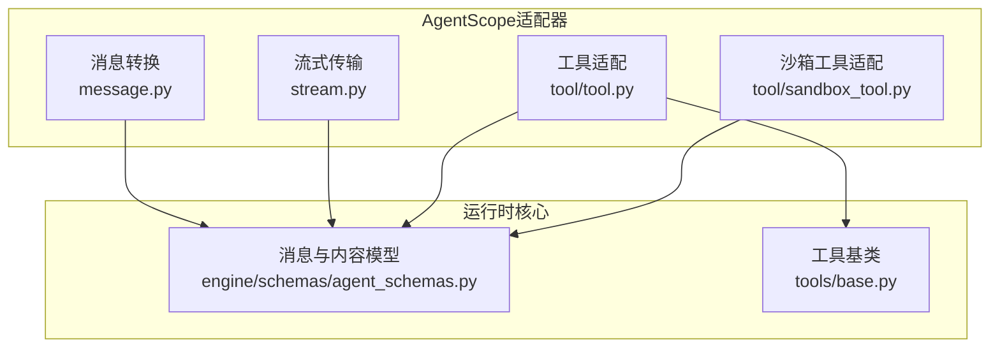
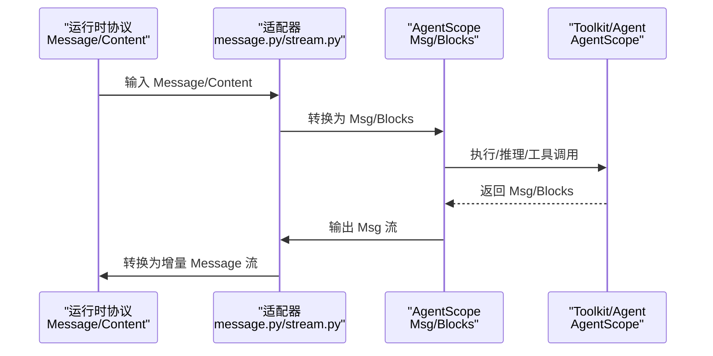
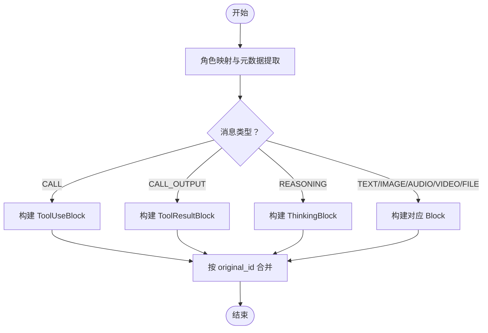
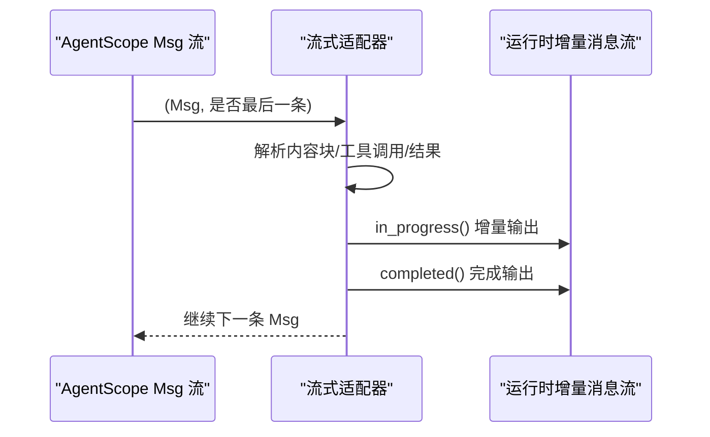
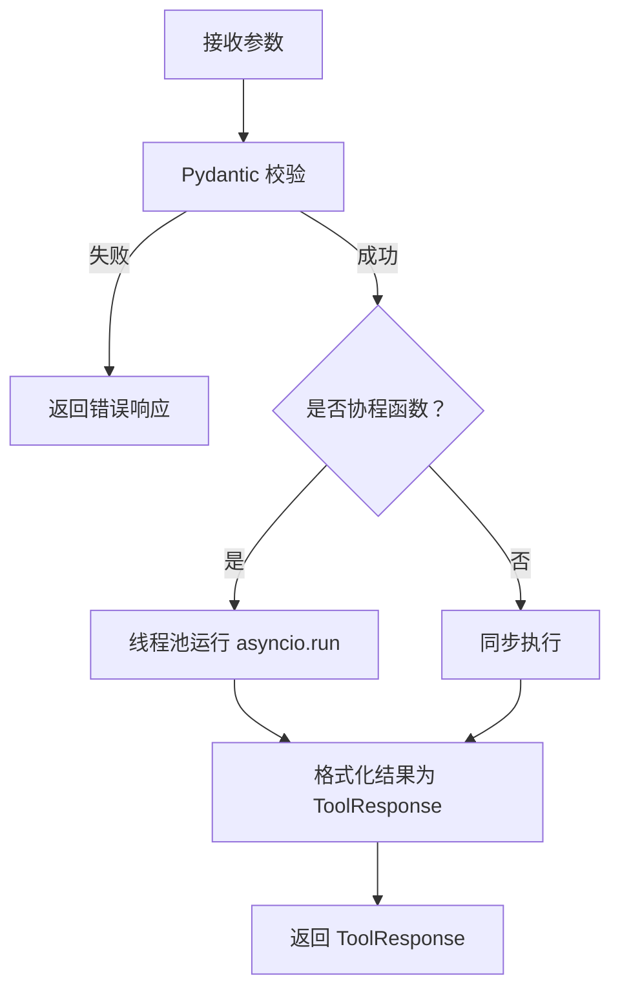
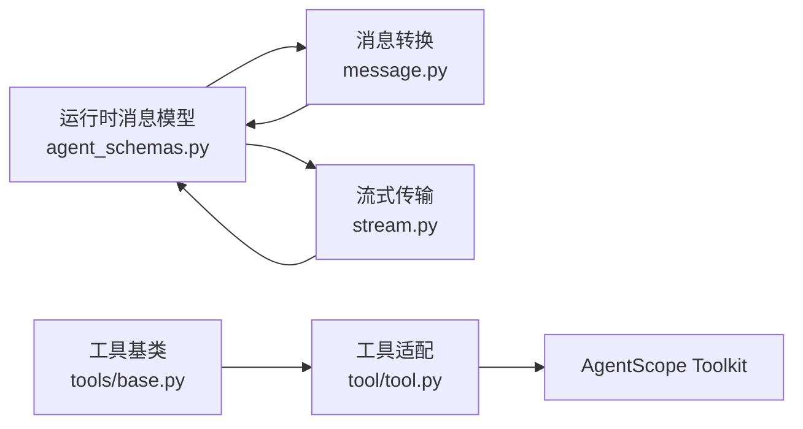

# AgentScope适配器

<cite>
**本文引用的文件列表**
- [message.py](file://src/agentscope_runtime/adapters/agentscope/message.py)
- [stream.py](file://src/agentscope_runtime/adapters/agentscope/stream.py)
- [tool.py](file://src/agentscope_runtime/adapters/agentscope/tool/tool.py)
- [sandbox_tool.py](file://src/agentscope_runtime/adapters/agentscope/tool/sandbox_tool.py)
- [agent_schemas.py](file://src/agentscope_runtime/engine/schemas/agent_schemas.py)
- [base.py](file://src/agentscope_runtime/tools/base.py)
- [modelstudio_search.py](file://src/agentscope_runtime/tools/searches/modelstudio_search.py)
- [test_agentscope_tool_adapter.py](file://tests/tools/test_agentscope_tool_adapter.py)
</cite>

## 目录
1. [简介](#简介)
2. [项目结构](#项目结构)
3. [核心组件](#核心组件)
4. [架构总览](#架构总览)
5. [详细组件分析](#详细组件分析)
6. [依赖关系分析](#依赖关系分析)
7. [性能考量](#性能考量)
8. [故障排查指南](#故障排查指南)
9. [结论](#结论)
10. [附录](#附录)

## 简介
本文件系统性阐述 AgentScope 适配器在 agentscope-runtime 中的作用与实现，重点覆盖以下方面：
- 消息格式转换：从运行时通用消息到 AgentScope 原生消息的双向转换，支持文本、图像、音频、视频、文件等多模态内容。
- 工具调用与结果处理：统一处理 ToolUseBlock 与 ToolResultBlock 的生成与转换，兼容插件调用与 MCP 调用两类场景。
- 流式传输与 SSE 连接管理：基于异步迭代器的增量输出，支持 in_progress/completed 状态与 delta 内容拼接。
- 元数据与类型映射：对消息角色、类型、索引、使用量、原始 ID 等进行规范化与保留。
- 与 AgentScope 原生能力的集成：通过工具适配器将 agentscope-runtime 的 Tool 包装为 AgentScope 可识别的函数型工具，并可接入 Toolkit 与 ReActAgent 等。

## 项目结构
AgentScope 适配器位于 adapters/agentscope 目录下，主要由三部分组成：
- 消息转换模块：负责将运行时通用消息（Message）转换为 AgentScope Msg 对象，以及反向转换。
- 流式传输模块：将 AgentScope 的 Msg 流转换为运行时协议的增量消息流。
- 工具适配模块：将 agentscope-runtime 的 Tool 转换为 AgentScope 的 RegisteredToolFunction，并提供批量适配工具。

图表来源
- [message.py:53-394](file://src/agentscope_runtime/adapters/agentscope/message.py#L53-L394)
- [stream.py:33-684](file://src/agentscope_runtime/adapters/agentscope/stream.py#L33-L684)
- [tool.py:17-232](file://src/agentscope_runtime/adapters/agentscope/tool/tool.py#L17-L232)
- [sandbox_tool.py:15-70](file://src/agentscope_runtime/adapters/agentscope/tool/sandbox_tool.py#L15-L70)
- [agent_schemas.py:18-510](file://src/agentscope_runtime/engine/schemas/agent_schemas.py#L18-L510)
- [base.py:34-265](file://src/agentscope_runtime/tools/base.py#L34-L265)

章节来源
- [message.py:1-394](file://src/agentscope_runtime/adapters/agentscope/message.py#L1-L394)
- [stream.py:1-684](file://src/agentscope_runtime/adapters/agentscope/stream.py#L1-L684)
- [tool.py:1-232](file://src/agentscope_runtime/adapters/agentscope/tool/tool.py#L1-L232)
- [sandbox_tool.py:1-70](file://src/agentscope_runtime/adapters/agentscope/tool/sandbox_tool.py#L1-L70)
- [agent_schemas.py:1-1020](file://src/agentscope_runtime/engine/schemas/agent_schemas.py#L1-L1020)
- [base.py:1-265](file://src/agentscope_runtime/tools/base.py#L1-L265)

## 核心组件
- 消息转换器：将运行时 Message 列表或单条消息转换为 AgentScope Msg；同时支持自定义类型转换器覆盖。
- 流式适配器：将 AgentScope Msg 流转换为运行时协议的增量消息流，支持文本、思考、工具调用与结果、以及多模态内容的增量拼接。
- 工具适配器：将 agentscope-runtime 的 Tool 包装为 AgentScope 的 RegisteredToolFunction，自动转换输入校验、执行与结果格式化。
- 沙箱工具适配器：确保沙箱工具返回值能被转换为 ToolResponse，优先尝试 MCP CallToolResult 到 AgentScope Block 的转换。

章节来源
- [message.py:53-394](file://src/agentscope_runtime/adapters/agentscope/message.py#L53-L394)
- [stream.py:33-684](file://src/agentscope_runtime/adapters/agentscope/stream.py#L33-L684)
- [tool.py:17-232](file://src/agentscope_runtime/adapters/agentscope/tool/tool.py#L17-L232)
- [sandbox_tool.py:15-70](file://src/agentscope_runtime/adapters/agentscope/tool/sandbox_tool.py#L15-L70)

## 架构总览
AgentScope 适配器在整体架构中的位置如下：

图表来源
- [message.py:53-394](file://src/agentscope_runtime/adapters/agentscope/message.py#L53-L394)
- [stream.py:33-684](file://src/agentscope_runtime/adapters/agentscope/stream.py#L33-L684)
- [agent_schemas.py:480-734](file://src/agentscope_runtime/engine/schemas/agent_schemas.py#L480-L734)

## 详细组件分析

### 消息格式转换（message_to_agentscope_msg）
- 角色映射与元数据保留：将运行时 role 映射为 AgentScope 支持的角色，优先使用 metadata 中的 original_id/original_name 作为 Msg 的 id/name；若存在 usage/metadata 字段则一并保留。
- 类型转换：
  - 插件/函数/工具调用：将 content 中的 arguments 提取为 ToolUseBlock，id/name 来自 data。
  - 工具调用输出：将 content 中的 output 提取为 ToolResultBlock，支持字符串、字典、列表与 MCP CallToolResult 结构的自动转换。
  - 思考内容：将 MessageType.REASONING 转换为 ThinkingBlock。
  - 文本/图像/音频/视频/文件：根据 content.type 与对应字段（text/image_url/data/video_url/file_url）生成相应 Block；对 data: 开头的 base64 数据进行解析并封装为 Base64Source；对非 base64 的 URL 使用 URLSource。
- 多消息分组：当输入为列表时，按 metadata.original_id 或消息 id 进行分组合并，保证同一轮对话的消息内容顺序与完整性。

图表来源
- [message.py:53-394](file://src/agentscope_runtime/adapters/agentscope/message.py#L53-L394)

章节来源
- [message.py:53-394](file://src/agentscope_runtime/adapters/agentscope/message.py#L53-L394)

### 流式传输与增量拼接（adapt_agentscope_message_stream）
- 消息状态管理：维护当前消息 id、索引、增量内存、工具调用标志位，区分普通消息与思考消息的增量输出。
- 增量内容拼接：对文本、图像、音频、视频、文件等类型分别构造增量内容（delta=True），并在必要时触发 completed 事件。
- 工具调用与结果：
  - 工具调用：根据 tool_type（plugin/mcp）选择 MessageType 与数据体类型（FunctionCall/McpCall），逐次增量更新 arguments。
  - 工具结果：根据原始调用消息类型决定 MessageType 与数据体类型（FunctionCallOutput/McpCallOutput），增量更新 output 并在最后完成。
- 自定义转换器：type_converters 支持按 block.type 注入自定义转换逻辑，返回同步/异步迭代器以支持复杂多步增量输出。
- 最终收尾：在流结束时输出剩余文本内容与最终 completed 事件。

图表来源
- [stream.py:33-684](file://src/agentscope_runtime/adapters/agentscope/stream.py#L33-L684)

章节来源
- [stream.py:33-684](file://src/agentscope_runtime/adapters/agentscope/stream.py#L33-L684)

### 工具适配（agentscope_tool_adapter / agentscope_toolkit_adapter）
- 输入校验：使用 Tool.input_type 对传入参数进行 Pydantic 校验，失败时返回包含错误标记的 ToolResponse。
- 异步/同步执行：检测工具是否为协程函数，若为协程则在独立线程池中安全运行 asyncio.run；否则直接同步执行。
- 结果格式化：优先将 Pydantic 模型结果序列化为 JSON 字符串，否则转为字符串；将结果写入 ToolResponse.content，并在 metadata 中保留原始结果字典以便后续处理。
- JSON Schema 转换：将 agentscope-runtime 的 Tool.function_schema 转换为 AgentScope 的 function 类型 JSON Schema，便于与 Toolkit 集成。

图表来源
- [tool.py:17-232](file://src/agentscope_runtime/adapters/agentscope/tool/tool.py#L17-L232)
- [base.py:34-265](file://src/agentscope_runtime/tools/base.py#L34-L265)

章节来源
- [tool.py:17-232](file://src/agentscope_runtime/adapters/agentscope/tool/tool.py#L17-L232)
- [base.py:34-265](file://src/agentscope_runtime/tools/base.py#L34-L265)

### 沙箱工具适配（sandbox_tool_adapter）
- 目标：确保沙箱工具返回值能被转换为 ToolResponse，以满足 Toolkit 的要求。
- 优先策略：尝试将返回值解析为 MCP CallToolResult，再转换为 AgentScope 的 Blocks；若失败则回退为将任意结果转为 TextBlock。
- 日志与健壮性：捕获转换异常并记录警告，保证工具链路不中断。

章节来源
- [sandbox_tool.py:15-70](file://src/agentscope_runtime/adapters/agentscope/tool/sandbox_tool.py#L15-L70)

### 与 AgentScope 原生功能的集成
- 工具注册：通过 agentscope_toolkit_adapter 将多个 Tool 注册为 Toolkit，每个 Tool 被包装为 RegisteredToolFunction，具备名称、描述与 JSON Schema。
- ReActAgent 集成：在测试中展示了如何将适配后的工具注入 ReActAgent，实现端到端的工具调用与结果处理。

章节来源
- [test_agentscope_tool_adapter.py:164-360](file://tests/tools/test_agentscope_tool_adapter.py#L164-L360)

## 依赖关系分析
- 消息与内容模型：运行时协议的 Message/Content 与 AgentScope 的 Msg/Blocks 之间通过适配器进行桥接，涉及 MessageType、Content 类型、索引与增量拼接。
- 工具接口：agentscope-runtime 的 Tool 通过适配器转换为 AgentScope 的 RegisteredToolFunction，依赖 Tool 的输入/输出类型与 JSON Schema。
- MCP 集成：工具适配器支持 MCP CallToolResult 的自动转换，增强与 MCP 生态的互操作性。

图表来源
- [agent_schemas.py:18-510](file://src/agentscope_runtime/engine/schemas/agent_schemas.py#L18-L510)
- [message.py:53-394](file://src/agentscope_runtime/adapters/agentscope/message.py#L53-L394)
- [stream.py:33-684](file://src/agentscope_runtime/adapters/agentscope/stream.py#L33-L684)
- [base.py:34-265](file://src/agentscope_runtime/tools/base.py#L34-L265)
- [tool.py:17-232](file://src/agentscope_runtime/adapters/agentscope/tool/tool.py#L17-L232)

章节来源
- [agent_schemas.py:1-1020](file://src/agentscope_runtime/engine/schemas/agent_schemas.py#L1-L1020)
- [message.py:1-394](file://src/agentscope_runtime/adapters/agentscope/message.py#L1-L394)
- [stream.py:1-684](file://src/agentscope_runtime/adapters/agentscope/stream.py#L1-L684)
- [base.py:1-265](file://src/agentscope_runtime/tools/base.py#L1-L265)
- [tool.py:1-232](file://src/agentscope_runtime/adapters/agentscope/tool/tool.py#L1-L232)

## 性能考量
- 异步流式处理：流式适配器采用异步迭代器，避免阻塞，适合高并发与长连接场景。
- 增量拼接优化：仅对 delta 内容进行增量拼接，减少重复序列化与网络传输。
- 工具执行隔离：协程工具在独立线程池中运行，避免事件循环阻塞。
- JSON 序列化：结果格式化时尽量使用模型的 model_dump，减少不必要的字符串转换。

## 故障排查指南
- 工具输入校验失败：检查 Tool.input_type 的 JSON Schema 与传入参数是否匹配；适配器会返回包含错误标记的 ToolResponse。
- 工具执行异常：适配器捕获异常并返回错误响应；可通过日志定位具体异常。
- MCP 结果转换失败：沙箱工具适配器会记录警告并回退为文本块；建议检查返回值结构是否符合 CallToolResult。
- 流式输出异常：确认 Msg.content 的类型与结构正确；对于自定义转换器，需确保返回的是迭代器或异步迭代器。

章节来源
- [tool.py:59-143](file://src/agentscope_runtime/adapters/agentscope/tool/tool.py#L59-L143)
- [sandbox_tool.py:38-67](file://src/agentscope_runtime/adapters/agentscope/tool/sandbox_tool.py#L38-L67)
- [stream.py:163-180](file://src/agentscope_runtime/adapters/agentscope/stream.py#L163-L180)

## 结论
AgentScope 适配器通过消息转换、流式传输与工具适配三大模块，实现了 agentscope-runtime 与 AgentScope 的无缝对接。其设计兼顾了多模态内容处理、工具调用与结果的标准化、以及流式传输的实时性与可靠性。配合 MCP 与 Toolkit 的生态，能够快速集成各类工具与代理能力。

## 附录

### 实际使用示例（路径指引）
- 工具适配与 Toolkit 注册：参考测试用例中的工具适配与 Toolkit 创建流程。
  - 示例路径：[test_agentscope_tool_adapter.py:67-95](file://tests/tools/test_agentscope_tool_adapter.py#L67-L95)
- 工具执行与响应：参考测试用例中对 Toolkit.call_tool_function 的异步生成器使用。
  - 示例路径：[test_agentscope_tool_adapter.py:164-194](file://tests/tools/test_agentscope_tool_adapter.py#L164-L194)
- 搜索工具适配：参考 ModelstudioSearch 的 Tool 实现，展示输入/输出模型与异步执行。
  - 示例路径：[modelstudio_search.py:102-200](file://src/agentscope_runtime/tools/searches/modelstudio_search.py#L102-L200)

### 常见问题与解决方案
- 多模态内容未正确显示：检查 content.type 与对应字段（如 image_url/data/video_url/file_url）是否正确设置；对于 base64 数据，确保 data: 前缀与媒体类型正确。
- 工具调用 arguments 为空：确认 ToolUseBlock 的 input 是否为字典且包含有效参数；适配器会将字典序列化为 JSON 字符串。
- 流式输出重复或错序：检查自定义转换器返回的迭代器是否按顺序产生增量内容；确保索引与消息 id 的一致性。