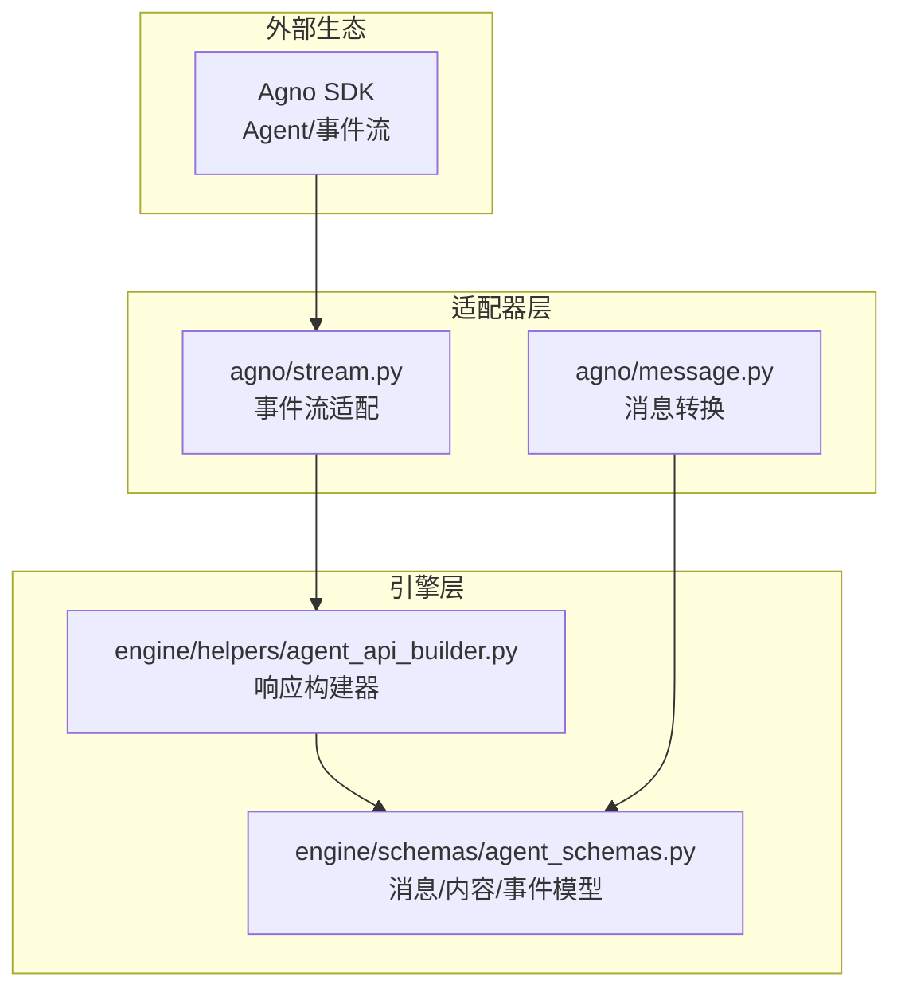
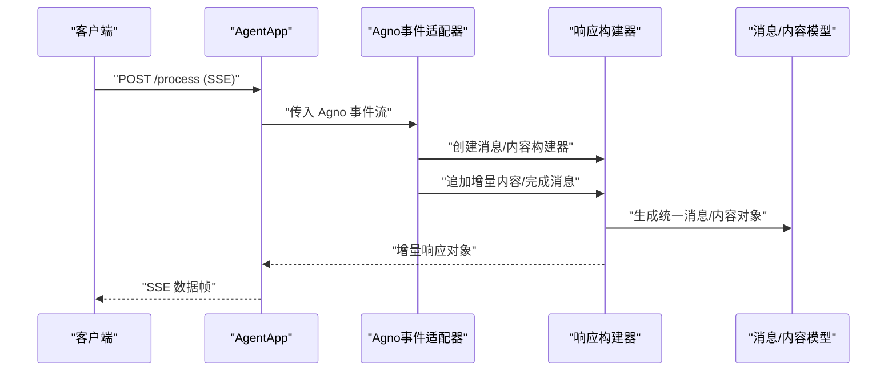
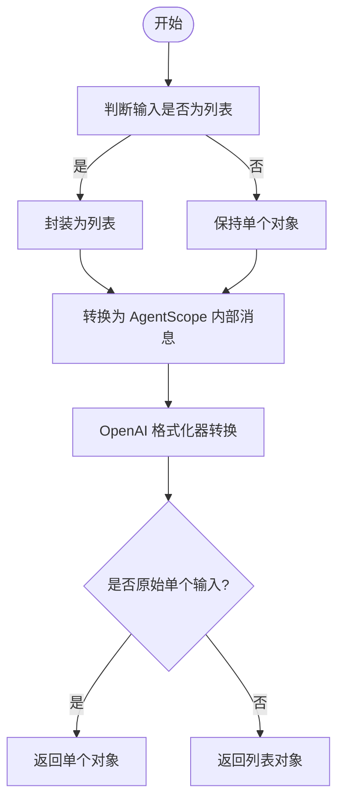
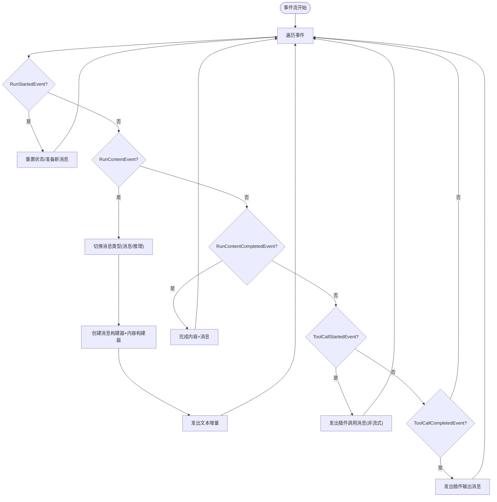
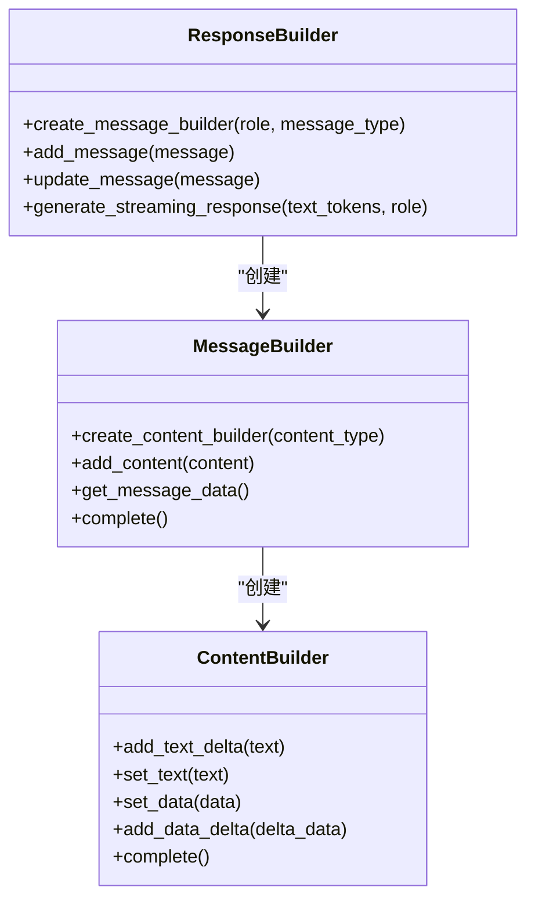
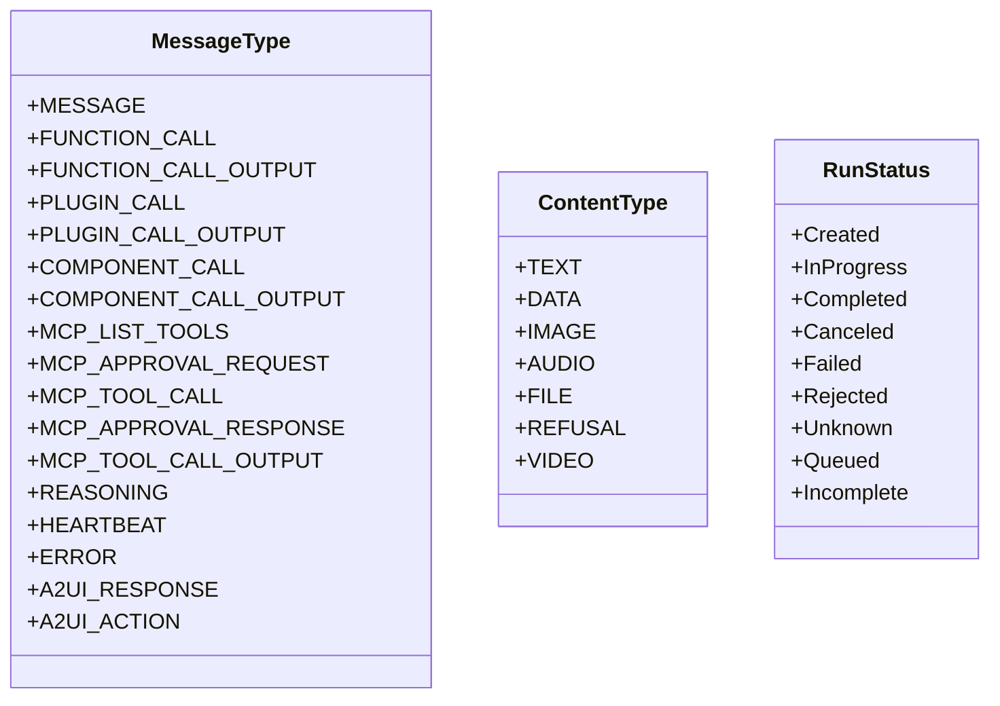
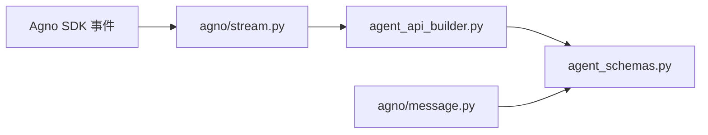

# Agno适配器

<cite>
**本文引用的文件**
- [message.py](file://src/agentscope_runtime/adapters/agno/message.py)
- [stream.py](file://src/agentscope_runtime/adapters/agno/stream.py)
- [agent_schemas.py](file://src/agentscope_runtime/engine/schemas/agent_schemas.py)
- [agent_api_builder.py](file://src/agentscope_runtime/engine/helpers/agent_api_builder.py)
- [agno_guidelines.md](file://cookbook/zh/agno_guidelines.md)
- [test_agno_agent_app.py](file://tests/integrated/test_agno_agent_app.py)
- [test_runner_stream_agno.py](file://tests/integrated/test_runner_stream_agno.py)
</cite>

## 目录
1. [简介](#简介)
2. [项目结构](#项目结构)
3. [核心组件](#核心组件)
4. [架构总览](#架构总览)
5. [组件详解](#组件详解)
6. [依赖关系分析](#依赖关系分析)
7. [性能考量](#性能考量)
8. [故障排查指南](#故障排查指南)
9. [结论](#结论)
10. [附录](#附录)

## 简介
本文件面向需要在 AgentScope Runtime 中集成并使用 Agno 的开发者，系统性地说明 Agno 适配器的消息格式、通信协议、消息转换与事件处理机制、状态同步与工具调用实现、流式传输处理与连接管理、Agno 特定消息类型与数据结构、与 Agno 生态的集成方式与最佳实践，并提供配置示例、常见问题解决方案以及调试与监控建议。

## 项目结构
Agno 适配器位于适配器目录下，核心文件包括消息转换与流式事件适配两个模块；配合引擎层的通用消息模型与响应生成器，形成从 Agno 事件到统一消息格式的转换链路。

**图表来源**
- [message.py:10-39](file://src/agentscope_runtime/adapters/agno/message.py#L10-L39)
- [stream.py:32-124](file://src/agentscope_runtime/adapters/agno/stream.py#L32-L124)
- [agent_schemas.py:18-511](file://src/agentscope_runtime/engine/schemas/agent_schemas.py#L18-L511)
- [agent_api_builder.py:467-655](file://src/agentscope_runtime/engine/helpers/agent_api_builder.py#L467-L655)

**章节来源**
- [message.py:10-39](file://src/agentscope_runtime/adapters/agno/message.py#L10-L39)
- [stream.py:32-124](file://src/agentscope_runtime/adapters/agno/stream.py#L32-L124)
- [agent_schemas.py:18-511](file://src/agentscope_runtime/engine/schemas/agent_schemas.py#L18-L511)
- [agent_api_builder.py:467-655](file://src/agentscope_runtime/engine/helpers/agent_api_builder.py#L467-L655)

## 核心组件
- 消息转换器：将 AgentScope 的 Message 转换为 OpenAI 兼容格式，便于与 Agno 的 OpenAI 兼容接口对接。
- 事件流适配器：将 Agno 的运行事件流转换为统一的消息/内容增量流，支持文本、推理、工具调用等事件类型。
- 响应构建器：按统一模型生成增量消息与内容对象，支持多内容块、多消息聚合与完成标记。
- 通用消息模型：定义消息类型、内容类型、事件状态、工具调用与输出等结构化数据。

**章节来源**
- [message.py:10-39](file://src/agentscope_runtime/adapters/agno/message.py#L10-L39)
- [stream.py:32-124](file://src/agentscope_runtime/adapters/agno/stream.py#L32-L124)
- [agent_api_builder.py:28-465](file://src/agentscope_runtime/engine/helpers/agent_api_builder.py#L28-L465)
- [agent_schemas.py:18-511](file://src/agentscope_runtime/engine/schemas/agent_schemas.py#L18-L511)

## 架构总览
Agno 适配器的工作流自上而下分为三层：
- 协议适配层：接收 Agno 的事件流，识别事件类型并映射到统一消息模型。
- 消息转换层：对输入消息进行格式化，确保与下游兼容。
- 响应生成层：通过响应构建器生成增量消息与内容，支持 SSE/HTTP 流式输出。

**图表来源**
- [stream.py:32-124](file://src/agentscope_runtime/adapters/agno/stream.py#L32-L124)
- [agent_api_builder.py:28-465](file://src/agentscope_runtime/engine/helpers/agent_api_builder.py#L28-L465)
- [agent_schemas.py:480-734](file://src/agentscope_runtime/engine/schemas/agent_schemas.py#L480-L734)

## 组件详解

### 消息转换（Agno 与统一消息）
- 输入：AgentScope 的 Message 或消息列表。
- 处理：先转换为 AgentScope 的内部消息表示，再由 OpenAI 格式化器转换为 OpenAI 兼容格式。
- 输出：单个或多个 OpenAI 兼容消息对象，用于与 Agno 的 OpenAI 兼容接口交互。

**图表来源**
- [message.py:10-39](file://src/agentscope_runtime/adapters/agno/message.py#L10-L39)

**章节来源**
- [message.py:10-39](file://src/agentscope_runtime/adapters/agno/message.py#L10-L39)

### 事件流适配（消息增量与状态同步）
- 输入：Agno 的运行事件流（如开始、内容增量、推理内容、工具调用开始/完成等）。
- 处理：根据事件类型切换消息类型（消息/推理），维护消息与内容构建器，按增量生成内容对象并在完成后完成消息。
- 输出：统一的增量消息/内容对象序列，支持多轮对话与状态同步。

**图表来源**
- [stream.py:32-124](file://src/agentscope_runtime/adapters/agno/stream.py#L32-L124)

**章节来源**
- [stream.py:32-124](file://src/agentscope_runtime/adapters/agno/stream.py#L32-L124)

### 响应构建器（消息/内容增量生成）
- 功能：按统一模型生成增量消息与内容，支持文本、图像、数据等类型；自动合并增量并标记完成。
- 关键点：消息与内容均带有增量标记与索引，便于多内容块与多消息聚合；完成时统一标记状态。

**图表来源**
- [agent_api_builder.py:467-655](file://src/agentscope_runtime/engine/helpers/agent_api_builder.py#L467-L655)

**章节来源**
- [agent_api_builder.py:28-465](file://src/agentscope_runtime/engine/helpers/agent_api_builder.py#L28-L465)

### 消息类型与数据结构（Agno 特定）
- 消息类型（MessageType）：涵盖消息、函数/插件调用、推理、心跳、错误、A2UI 等。
- 内容类型（ContentType）：文本、数据、图片、音频、视频、文件、拒绝等。
- 工具调用：函数调用与输出、MCP 工具调用与输出、工具列表与审批请求/响应。
- 事件状态（RunStatus）：created、in_progress、completed、canceled、failed、rejected、queued、incomplete 等。

**图表来源**
- [agent_schemas.py:18-78](file://src/agentscope_runtime/engine/schemas/agent_schemas.py#L18-L78)

**章节来源**
- [agent_schemas.py:18-78](file://src/agentscope_runtime/engine/schemas/agent_schemas.py#L18-L78)

## 依赖关系分析
- 适配器依赖引擎的通用消息模型与响应构建器，保证输出格式一致。
- 事件流适配器依赖 Agno 的运行事件类型，将其映射到统一消息/内容增量。
- 消息转换器依赖 OpenAI 格式化器，确保与兼容接口的互通。

**图表来源**
- [stream.py:32-124](file://src/agentscope_runtime/adapters/agno/stream.py#L32-L124)
- [agent_api_builder.py:467-655](file://src/agentscope_runtime/engine/helpers/agent_api_builder.py#L467-L655)
- [agent_schemas.py:18-511](file://src/agentscope_runtime/engine/schemas/agent_schemas.py#L18-L511)
- [message.py:10-39](file://src/agentscope_runtime/adapters/agno/message.py#L10-L39)

**章节来源**
- [stream.py:32-124](file://src/agentscope_runtime/adapters/agno/stream.py#L32-L124)
- [agent_api_builder.py:467-655](file://src/agentscope_runtime/engine/helpers/agent_api_builder.py#L467-L655)
- [agent_schemas.py:18-511](file://src/agentscope_runtime/engine/schemas/agent_schemas.py#L18-L511)
- [message.py:10-39](file://src/agentscope_runtime/adapters/agno/message.py#L10-L39)

## 性能考量
- 流式增量：通过内容构建器的增量追加与完成标记，减少一次性大对象的构造与序列化开销。
- 多内容块聚合：同一消息内的多内容块按索引管理，避免重复分配与拷贝。
- 事件驱动：按事件粒度生成响应，降低等待与缓冲时间，提升端到端延迟表现。
- 工具调用：工具调用事件不进行流式拆分，直接一次性输出，避免复杂状态机带来的额外成本。

## 故障排查指南
- SSE 流异常
  - 现象：客户端未收到增量事件或连接提前关闭。
  - 排查：确认服务端返回的 Content-Type 是否为 text/event-stream；检查事件流是否在 RunContentCompletedEvent 后正确结束。
  - 参考测试：集成测试验证 SSE 行为与 [DONE] 结束符。
  - 章节来源
    - [test_agno_agent_app.py:93-151](file://tests/integrated/test_agno_agent_app.py#L93-L151)
    - [test_agno_agent_app.py:171-248](file://tests/integrated/test_agno_agent_app.py#L171-L248)

- OpenAI 兼容模式不可用
  - 现象：使用兼容模式接口时报错或无响应。
  - 排查：确认基础 URL 与 API Key 配置正确；验证 AgentApp 是否正确挂载兼容模式路由。
  - 章节来源
    - [agno_guidelines.md:145-158](file://cookbook/zh/agno_guidelines.md#L145-L158)

- 工具调用未触发
  - 现象：前端未显示工具调用步骤或结果。
  - 排查：确认事件流中存在 ToolCallStartedEvent 与 ToolCallCompletedEvent；检查工具参数与结果的 JSON 序列化。
  - 章节来源
    - [stream.py:84-122](file://src/agentscope_runtime/adapters/agno/stream.py#L84-L122)

- 多轮对话记忆失效
  - 现象：第二轮对话未保留上下文。
  - 排查：确认 session_id 传递正确；检查 Agno 的数据库或会话存储是否启用并可读写。
  - 章节来源
    - [test_agno_agent_app.py:171-248](file://tests/integrated/test_agno_agent_app.py#L171-L248)
    - [agno_guidelines.md:19-27](file://cookbook/zh/agno_guidelines.md#L19-L27)

## 结论
Agno 适配器通过清晰的事件流适配与统一消息模型，实现了从 Agno 到 AgentScope Runtime 的高效转换与流式输出。结合响应构建器的增量生成机制，能够在多轮对话、工具调用与推理场景中提供稳定、可观测且高性能的体验。建议在生产环境中配合合适的日志与监控策略，持续优化事件处理与资源占用。

## 附录

### 集成与配置示例
- 快速集成要点
  - 在 AgentApp 中注册查询函数并标注框架为 agno。
  - 使用 Agno Agent 初始化模型与会话存储，开启事件流与流式输出。
  - 通过 /process 端点接收 SSE 流式响应，或使用 OpenAI 兼容模式。
- 参考示例
  - 章节来源
    - [agno_guidelines.md:19-94](file://cookbook/zh/agno_guidelines.md#L19-L94)
    - [test_agno_agent_app.py:21-66](file://tests/integrated/test_agno_agent_app.py#L21-L66)

### 最佳实践
- 明确消息类型与事件边界：区分消息与推理两类内容，避免混用。
- 严格管理 session_id：确保跨轮次上下文一致性。
- 工具调用非流式：工具调用与输出一次性发送，避免状态碎片化。
- 错误与拒绝处理：利用事件状态与错误对象，向客户端反馈明确信息。

### 调试与监控
- 调试建议
  - 使用集成测试中的断言逻辑验证事件顺序与内容片段。
  - 在事件流中打印关键事件类型与消息状态，定位卡顿或中断点。
- 监控指标
  - 事件吞吐量（每秒事件数）、消息完成率、平均增量延迟、工具调用成功率。
  - 章节来源
    - [test_runner_stream_agno.py:86-206](file://tests/integrated/test_runner_stream_agno.py#L86-L206)