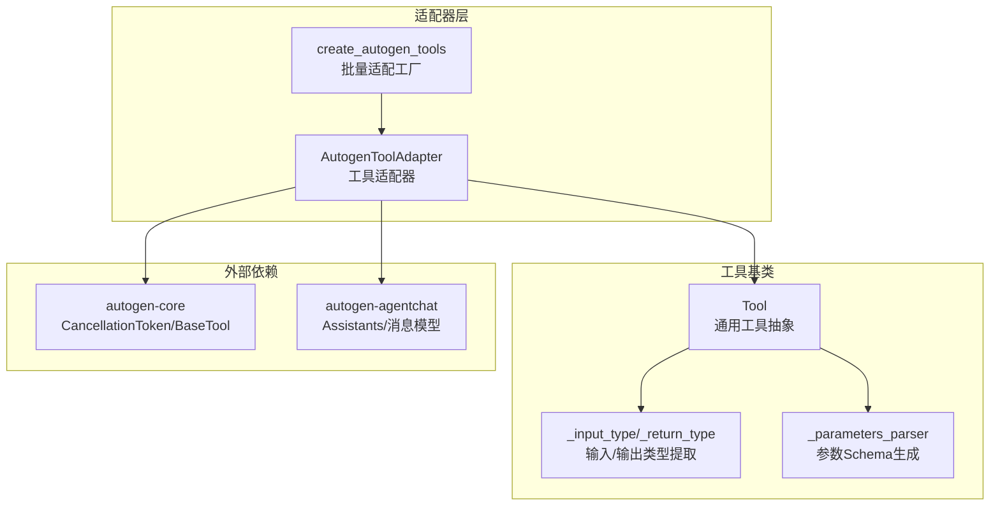
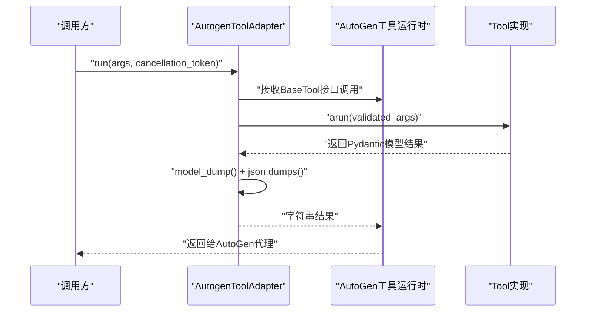
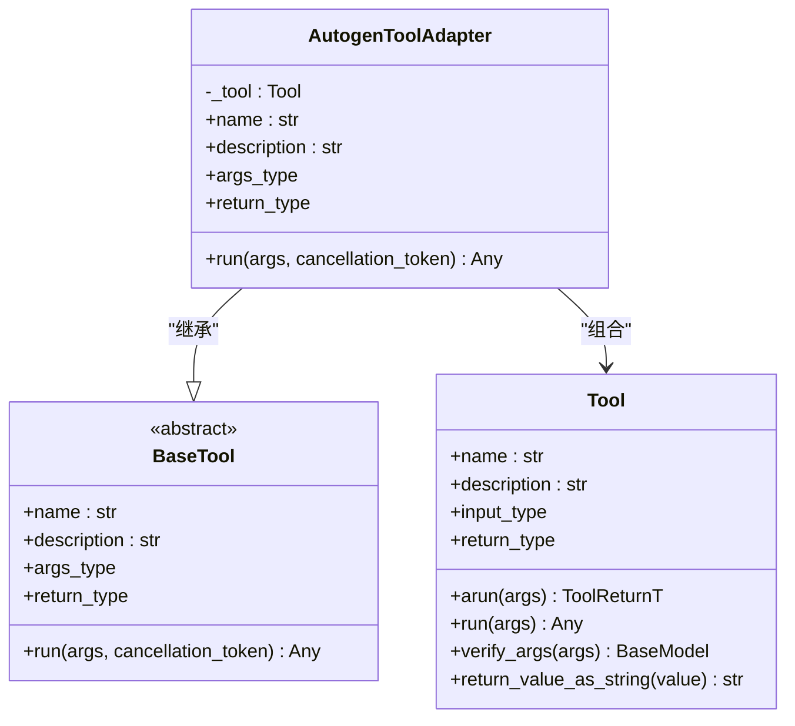
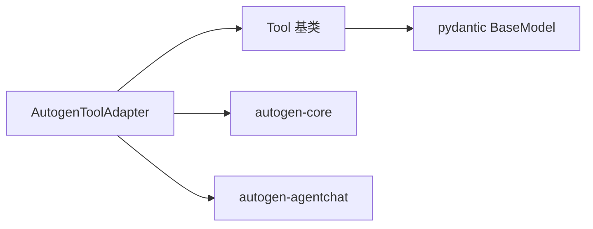

# AutoGen适配器

<cite>
**本文引用的文件**
- [tool.py](file://src/agentscope_runtime/adapters/autogen/tool/tool.py)
- [__init__.py](file://src/agentscope_runtime/adapters/autogen/tool/__init__.py)
- [base.py](file://src/agentscope_runtime/tools/base.py)
- [pyproject.toml](file://pyproject.toml)
- [test_autogen_tool_adapter.py](file://tests/tools/test_autogen_tool_adapter.py)
- [tools.md（中文）](file://cookbook/zh/tools/tools.md)
- [tools.md（英文）](file://cookbook/en/tools/tools.md)
</cite>

## 目录
1. [简介](#简介)
2. [项目结构](#项目结构)
3. [核心组件](#核心组件)
4. [架构总览](#架构总览)
5. [组件详解](#组件详解)
6. [依赖关系分析](#依赖关系分析)
7. [性能考量](#性能考量)
8. [故障排查指南](#故障排查指南)
9. [结论](#结论)
10. [附录](#附录)

## 简介
本文件面向使用 AutoGen 框架的开发者，系统化阐述 agentscope-runtime 中 AutoGen 适配器的设计与实现，重点覆盖：
- 工具调用机制与消息格式
- 工具包装与执行流程（含参数序列化/反序列化）
- AutoGen 特有的消息类型与角色分配机制
- 与 AutoGen 群组与代理的集成示例
- 工具调用的安全性与权限控制
- 版本兼容性与迁移指南
- 性能优化与资源管理建议

## 项目结构
AutoGen 适配器位于 adapters/autogen/tool 目录下，核心为工具适配器类与工厂函数，配合通用工具基类完成参数校验、返回值序列化与 AutoGen 运行时的对接。

图表来源
- [tool.py:28-107](file://src/agentscope_runtime/adapters/autogen/tool/tool.py#L28-L107)
- [base.py:34-160](file://src/agentscope_runtime/tools/base.py#L34-L160)
- [pyproject.toml:72-72](file://pyproject.toml#L72-L72)

章节来源
- [tool.py:1-212](file://src/agentscope_runtime/adapters/autogen/tool/tool.py#L1-L212)
- [__init__.py:1-8](file://src/agentscope_runtime/adapters/autogen/tool/__init__.py#L1-L8)
- [base.py:1-265](file://src/agentscope_runtime/tools/base.py#L1-L265)
- [pyproject.toml:1-104](file://pyproject.toml#L1-L104)

## 核心组件
- AutogenToolAdapter：将 agentscope-runtime 的 Tool 包装为 AutoGen 可识别的工具，负责参数校验、异步执行与结果序列化。
- create_autogen_tools：批量创建适配器实例，支持名称与描述的覆盖。
- Tool 基类：提供输入/输出类型提取、参数 Schema 解析、同步/异步执行与返回值字符串化等能力。

章节来源
- [tool.py:28-107](file://src/agentscope_runtime/adapters/autogen/tool/tool.py#L28-L107)
- [tool.py:140-211](file://src/agentscope_runtime/adapters/autogen/tool/tool.py#L140-L211)
- [base.py:34-160](file://src/agentscope_runtime/tools/base.py#L34-L160)

## 架构总览
AutoGen 适配器通过继承 AutoGen 的 BaseTool 并复用 Tool 的类型系统，实现“输入参数自动校验 + 异步执行 + 结果统一序列化”的闭环。

图表来源
- [tool.py:109-137](file://src/agentscope_runtime/adapters/autogen/tool/tool.py#L109-L137)
- [base.py:94-127](file://src/agentscope_runtime/tools/base.py#L94-L127)

## 组件详解

### 工具适配器类（AutogenToolAdapter）
- 角色与职责
  - 将 Tool 的输入/输出类型映射为 AutoGen 的 args_type 与 return_type
  - 在 run 方法中对传入参数进行异步执行并统一序列化为字符串
  - 提供取消令牌传递以支持中断
- 关键行为
  - 参数校验：基于 Tool.input_type 的 Pydantic 模型进行校验
  - 执行路径：调用 Tool.arun(args) 获取 Pydantic 结果
  - 序列化：使用 model_dump() 后 json.dumps() 输出
  - 错误处理：捕获异常并抛出带上下文的 RuntimeError

图表来源
- [tool.py:28-107](file://src/agentscope_runtime/adapters/autogen/tool/tool.py#L28-L107)
- [tool.py:109-137](file://src/agentscope_runtime/adapters/autogen/tool/tool.py#L109-L137)
- [base.py:34-160](file://src/agentscope_runtime/tools/base.py#L34-L160)

章节来源
- [tool.py:28-107](file://src/agentscope_runtime/adapters/autogen/tool/tool.py#L28-L107)
- [tool.py:109-137](file://src/agentscope_runtime/adapters/autogen/tool/tool.py#L109-L137)

### 工具批量创建（create_autogen_tools）
- 功能：遍历 Tool 列表，按需应用名称/描述覆盖，生成 AutogenToolAdapter 列表
- 兼容性：在 autogen-core 可用时正常工作；否则导入时即抛出明确提示

章节来源
- [tool.py:140-211](file://src/agentscope_runtime/adapters/autogen/tool/tool.py#L140-L211)
- [__init__.py:1-8](file://src/agentscope_runtime/adapters/autogen/tool/__init__.py#L1-L8)

### 工具基类（Tool）与参数序列化/反序列化
- 输入参数验证
  - 支持字符串、字典或 Pydantic 模型三种输入形式
  - 使用 Tool.input_type 对输入进行 Pydantic 校验
- 返回值序列化
  - Tool.return_value_as_string 将任意返回值转为字符串
  - AutogenToolAdapter.run 中将结果 model_dump 后统一 json.dumps
- 类型系统
  - 通过泛型参数提取 ToolArgsT/ToolReturnT
  - 自动解析输入类型的 JSON Schema 作为函数参数定义

章节来源
- [base.py:94-127](file://src/agentscope_runtime/tools/base.py#L94-L127)
- [base.py:162-194](file://src/agentscope_runtime/tools/base.py#L162-L194)
- [base.py:214-246](file://src/agentscope_runtime/tools/base.py#L214-L246)
- [base.py:248-265](file://src/agentscope_runtime/tools/base.py#L248-L265)
- [tool.py:128-137](file://src/agentscope_runtime/adapters/autogen/tool/tool.py#L128-L137)

### AutoGen 消息格式与角色分配
- AutoGen 适配器不直接转换消息格式，而是通过工具调用链路与 AutoGen 的 Assistants/消息模型协作
- 适配器仅负责工具参数的输入校验与结果序列化，消息层面的角色与类型由 AutoGen 运行时决定
- 若需要在其他适配器中处理消息格式（如 AgentScope），可参考相应适配器的消息转换逻辑

章节来源
- [tool.py:109-137](file://src/agentscope_runtime/adapters/autogen/tool/tool.py#L109-L137)

### 与 AutoGen 群组与代理的集成示例
- 示例要点
  - 使用 ModelstudioSearchLite 等工具
  - 通过 AutogenToolAdapter 包装工具
  - 创建 OpenAIChatCompletionClient 作为模型客户端
  - 使用 AssistantAgent 注册工具并发起消息交互
- 参考示例路径
  - [tools.md（中文）:208-245](file://cookbook/zh/tools/tools.md#L208-L245)
  - [tools.md（英文）:207-244](file://cookbook/en/tools/tools.md#L207-L244)

章节来源
- [tools.md（中文）:208-245](file://cookbook/zh/tools/tools.md#L208-L245)
- [tools.md（英文）:207-244](file://cookbook/en/tools/tools.md#L207-L244)

### 安全性与权限控制
- 输入校验
  - 通过 Tool.input_type 的 Pydantic 模型对参数进行强类型校验，避免非法输入进入工具执行
- 结果序列化
  - 统一将结果转为字符串，降低下游解析风险
- 取消与超时
  - 适配器接收 CancellationToken，便于在 AutoGen 侧实现中断与超时控制
- 权限边界
  - 工具本身应遵循最小权限原则；适配器不引入额外权限控制，权限策略应在工具实现与部署环境中落实

章节来源
- [tool.py:109-137](file://src/agentscope_runtime/adapters/autogen/tool/tool.py#L109-L137)
- [base.py:111-127](file://src/agentscope_runtime/tools/base.py#L111-L127)

### 版本兼容性与迁移指南
- 依赖声明
  - autogen-agentchat 在可选依赖中声明，确保安装时可选启用
- 运行时导入保护
  - 适配器在导入时检查 autogen-core 是否可用，不可用时抛出明确错误
- 迁移建议
  - 从旧版本升级时，优先确认 autogen-core 与 autogen-agentchat 的版本范围满足需求
  - 如需批量适配多个工具，使用 create_autogen_tools 统一生成适配器列表

章节来源
- [pyproject.toml:72-72](file://pyproject.toml#L72-L72)
- [tool.py:13-21](file://src/agentscope_runtime/adapters/autogen/tool/tool.py#L13-L21)

## 依赖关系分析
- 内部依赖
  - AutogenToolAdapter 依赖 Tool 的类型系统与执行接口
  - Tool 提供输入/输出类型提取与参数 Schema 解析
- 外部依赖
  - autogen-core：提供 BaseTool 与 CancellationToken
  - autogen-agentchat：提供代理与消息模型（示例中使用）

图表来源
- [tool.py:13-21](file://src/agentscope_runtime/adapters/autogen/tool/tool.py#L13-L21)
- [base.py:20-25](file://src/agentscope_runtime/tools/base.py#L20-L25)

章节来源
- [tool.py:1-212](file://src/agentscope_runtime/adapters/autogen/tool/tool.py#L1-L212)
- [base.py:1-265](file://src/agentscope_runtime/tools/base.py#L1-L265)
- [pyproject.toml:72-72](file://pyproject.toml#L72-L72)

## 性能考量
- 异步执行
  - 工具执行采用异步模式，适配器直接透传 cancellation_token，有利于长任务中断与资源回收
- 序列化成本
  - 结果统一 json.dumps，建议在工具内部尽量返回轻量级数据结构，减少序列化开销
- 批量适配
  - 使用 create_autogen_tools 批量生成适配器，避免重复初始化带来的额外成本
- 资源管理
  - 在 AutoGen 侧合理设置并发与超时，结合工具自身的资源占用情况（如网络请求、文件IO）进行容量规划

章节来源
- [tool.py:109-137](file://src/agentscope_runtime/adapters/autogen/tool/tool.py#L109-L137)
- [tool.py:140-211](file://src/agentscope_runtime/adapters/autogen/tool/tool.py#L140-L211)

## 故障排查指南
- 导入失败（缺少 autogen-core）
  - 现象：导入适配器时报错，提示需安装 autogen-core
  - 处理：安装 autogen-core 或在 pyproject.toml 的可选依赖中启用相关功能
- 工具执行异常
  - 现象：适配器抛出 RuntimeError，包含工具名与原始异常信息
  - 处理：检查工具实现是否正确、输入参数是否符合 Tool.input_type、网络/权限等外部依赖
- 参数校验失败
  - 现象：Tool.arun 抛出类型错误
  - 处理：确认传入参数与 Tool.input_type 的字段一致，必要时使用 Tool.verify_args 进行预校验
- 单元测试参考
  - 测试覆盖了适配器创建、批量适配、运行方法与输入模型创建等关键路径

章节来源
- [tool.py:13-21](file://src/agentscope_runtime/adapters/autogen/tool/tool.py#L13-L21)
- [tool.py:133-137](file://src/agentscope_runtime/adapters/autogen/tool/tool.py#L133-L137)
- [base.py:111-127](file://src/agentscope_runtime/tools/base.py#L111-L127)
- [test_autogen_tool_adapter.py:39-111](file://tests/tools/test_autogen_tool_adapter.py#L39-L111)

## 结论
AutoGen 适配器通过“类型系统 + 异步执行 + 统一序列化”的设计，在不侵入 AutoGen 运行时的前提下，实现了对 agentscope-runtime 工具的无缝集成。其核心优势在于：
- 明确的参数校验与结果序列化，提升安全性与稳定性
- 与 AutoGen 的 CancellationToken 对接，便于中断与资源管理
- 工厂函数支持批量适配，简化多工具场景下的集成复杂度

## 附录
- 快速开始示例（参考）
  - [tools.md（中文）:208-245](file://cookbook/zh/tools/tools.md#L208-L245)
  - [tools.md（英文）:207-244](file://cookbook/en/tools/tools.md#L207-L244)
- 相关实现参考
  - [tool.py:1-212](file://src/agentscope_runtime/adapters/autogen/tool/tool.py#L1-L212)
  - [base.py:1-265](file://src/agentscope_runtime/tools/base.py#L1-L265)
  - [pyproject.toml:1-104](file://pyproject.toml#L1-L104)