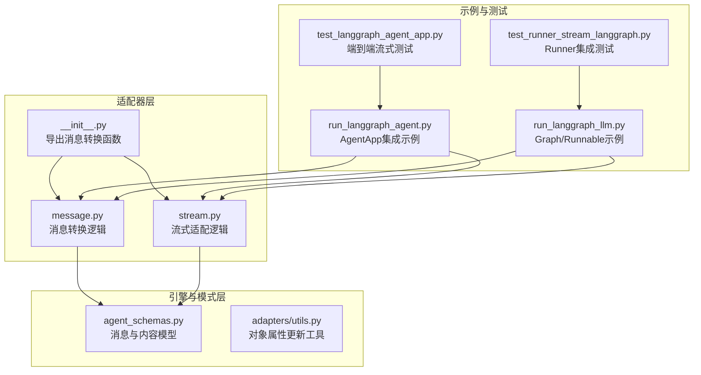
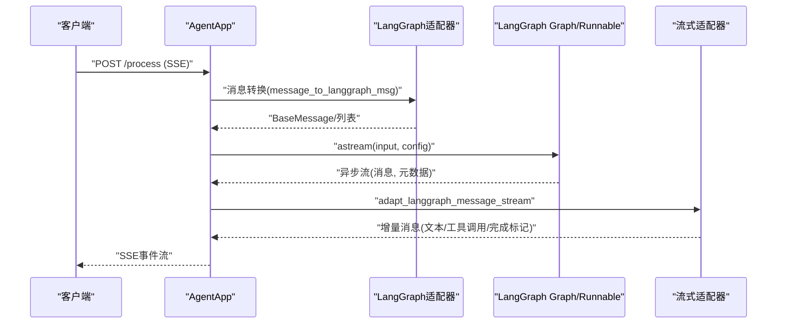
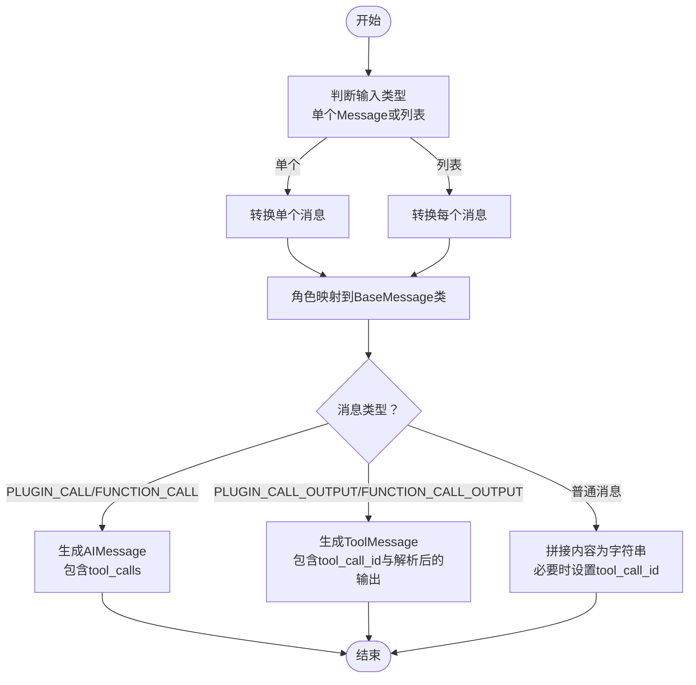
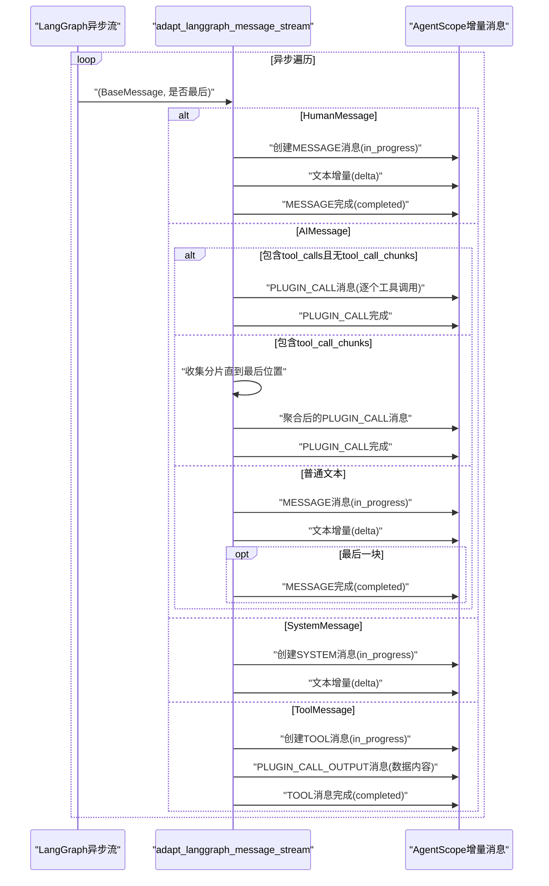
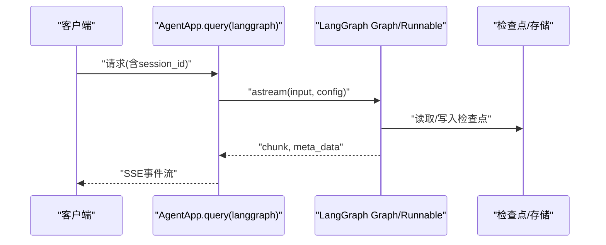
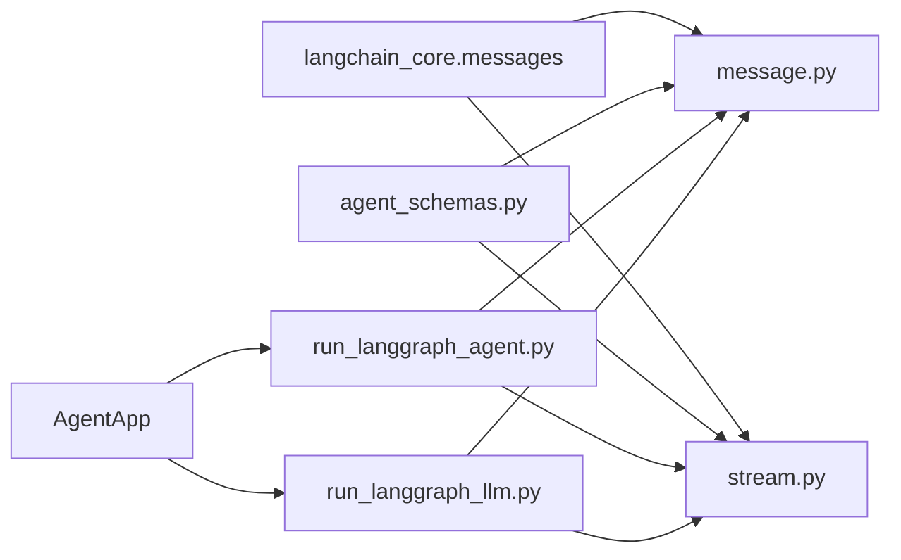

# LangGraph适配器

<cite>
**本文档引用的文件**
- [__init__.py](file://src/agentscope_runtime/adapters/langgraph/__init__.py)
- [message.py](file://src/agentscope_runtime/adapters/langgraph/message.py)
- [stream.py](file://src/agentscope_runtime/adapters/langgraph/stream.py)
- [agent_schemas.py](file://src/agentscope_runtime/engine/schemas/agent_schemas.py)
- [run_langgraph_agent.py](file://examples/integrations/langgraph/run_langgraph_agent.py)
- [run_langgraph_llm.py](file://examples/integrations/langgraph/run_langgraph_llm.py)
- [test_langgraph_agent_app.py](file://tests/integrated/test_langgraph_agent_app.py)
- [test_runner_stream_langgraph.py](file://tests/integrated/test_runner_stream_langgraph.py)
- [utils.py](file://src/agentscope_runtime/adapters/utils.py)
</cite>

## 目录
1. [简介](#简介)
2. [项目结构](#项目结构)
3. [核心组件](#核心组件)
4. [架构总览](#架构总览)
5. [详细组件分析](#详细组件分析)
6. [依赖关系分析](#依赖关系分析)
7. [性能考虑](#性能考虑)
8. [故障排查指南](#故障排查指南)
9. [结论](#结论)
10. [附录](#附录)

## 简介
本文件系统性地阐述 LangGraph 适配器在 AgentScope 运行时中的设计与实现，重点覆盖以下方面：
- LangGraph 框架的消息格式与状态管理机制
- 消息转换流程：节点消息、边消息与状态更新的处理方式
- 流式传输的实现与 WebSocket 连接管理（基于 SSE）
- LangGraph 特有的消息类型与元数据字段
- 与 LangGraph Graph 和 Runnable 的集成示例
- 错误处理与调试技巧
- 状态保持与上下文传递的实现机制

LangGraph 适配器通过将 AgentScope 的通用消息协议转换为 LangGraph 的 BaseMessage，并将 LangGraph 的流式输出转换回 AgentScope 的流式消息，实现了跨框架的无缝协作。

## 项目结构
LangGraph 适配器位于适配器模块中，核心文件包括：
- 消息转换模块：负责将 AgentScope 的 Message 转换为 LangGraph 的 BaseMessage
- 流式适配模块：负责将 LangGraph 的异步流转换为 AgentScope 的增量消息
- 集成示例：展示如何在 AgentApp 中集成 LangGraph Graph 与 Runnable
- 测试用例：验证流式输出、多轮对话与内存状态管理

**图表来源**
- [__init__.py:1-11](file://src/agentscope_runtime/adapters/langgraph/__init__.py#L1-L11)
- [message.py:1-163](file://src/agentscope_runtime/adapters/langgraph/message.py#L1-L163)
- [stream.py:1-257](file://src/agentscope_runtime/adapters/langgraph/stream.py#L1-L257)
- [agent_schemas.py:1-1020](file://src/agentscope_runtime/engine/schemas/agent_schemas.py#L1-L1020)
- [run_langgraph_agent.py:1-172](file://examples/integrations/langgraph/run_langgraph_agent.py#L1-L172)
- [run_langgraph_llm.py:1-118](file://examples/integrations/langgraph/run_langgraph_llm.py#L1-L118)
- [test_langgraph_agent_app.py:1-285](file://tests/integrated/test_langgraph_agent_app.py#L1-L285)
- [test_runner_stream_langgraph.py:1-201](file://tests/integrated/test_runner_stream_langgraph.py#L1-L201)
- [utils.py:1-7](file://src/agentscope_runtime/adapters/utils.py#L1-L7)

**章节来源**
- [__init__.py:1-11](file://src/agentscope_runtime/adapters/langgraph/__init__.py#L1-L11)
- [message.py:1-163](file://src/agentscope_runtime/adapters/langgraph/message.py#L1-L163)
- [stream.py:1-257](file://src/agentscope_runtime/adapters/langgraph/stream.py#L1-L257)
- [agent_schemas.py:1-1020](file://src/agentscope_runtime/engine/schemas/agent_schemas.py#L1-L1020)

## 核心组件
- 消息转换函数：将 AgentScope 的 Message 或消息列表转换为 LangGraph 的 BaseMessage（支持角色映射与工具调用转换）
- 流式适配器：将 LangGraph 的异步流（含工具调用分片）转换为 AgentScope 的增量消息，支持 SSE 输出
- AgentApp 集成：通过装饰器注册查询处理，驱动 LangGraph Graph/Runnable 并返回流式结果
- Runner 集成：通过自定义 Runner 封装 LangGraph 查询逻辑，便于单元测试与批量处理

**章节来源**
- [message.py:23-163](file://src/agentscope_runtime/adapters/langgraph/message.py#L23-L163)
- [stream.py:28-257](file://src/agentscope_runtime/adapters/langgraph/stream.py#L28-L257)
- [run_langgraph_agent.py:59-107](file://examples/integrations/langgraph/run_langgraph_agent.py#L59-L107)
- [run_langgraph_llm.py:40-76](file://examples/integrations/langgraph/run_langgraph_llm.py#L40-L76)
- [test_runner_stream_langgraph.py:22-78](file://tests/integrated/test_runner_stream_langgraph.py#L22-L78)

## 架构总览
LangGraph 适配器的运行时架构由“请求输入 → 消息转换 → LangGraph执行 → 流式适配 → 响应输出”构成。下图展示了从 AgentApp 到 LangGraph Graph/Runnable 的调用链路以及消息流的转换过程。

**图表来源**
- [run_langgraph_agent.py:59-107](file://examples/integrations/langgraph/run_langgraph_agent.py#L59-L107)
- [run_langgraph_llm.py:40-76](file://examples/integrations/langgraph/run_langgraph_llm.py#L40-L76)
- [message.py:23-163](file://src/agentscope_runtime/adapters/langgraph/message.py#L23-L163)
- [stream.py:28-257](file://src/agentscope_runtime/adapters/langgraph/stream.py#L28-L257)

## 详细组件分析

### 消息转换组件（message_to_langgraph_msg）
该函数负责将 AgentScope 的 Message 转换为 LangGraph 的 BaseMessage，支持：
- 角色映射：user → HumanMessage；assistant → AIMessage；system → SystemMessage；tool → ToolMessage
- 工具调用转换：将函数调用与调用输出分别转换为 AIMessage 的 tool_calls 与 ToolMessage
- 内容拼接：将多段内容合并为字符串
- ToolMessage 元数据：从消息元数据提取 tool_call_id

**图表来源**
- [message.py:23-163](file://src/agentscope_runtime/adapters/langgraph/message.py#L23-L163)

**章节来源**
- [message.py:23-163](file://src/agentscope_runtime/adapters/langgraph/message.py#L23-L163)

### 流式适配组件（adapt_langgraph_message_stream）
该异步生成器将 LangGraph 的异步流转换为 AgentScope 的增量消息，支持：
- 工具调用分片聚合：识别 tool_call_chunks 并在最后位置聚合生成完整的工具调用消息
- 文本增量：将 AIMessage 的内容按增量发送，维护索引与消息 ID
- 完成标记：根据 chunk_position 判断是否为最后一块，触发 completed 事件
- 多种消息类型：HumanMessage、AIMessage、SystemMessage、ToolMessage 的差异化处理

**图表来源**
- [stream.py:28-257](file://src/agentscope_runtime/adapters/langgraph/stream.py#L28-L257)

**章节来源**
- [stream.py:28-257](file://src/agentscope_runtime/adapters/langgraph/stream.py#L28-L257)

### 与 LangGraph Graph 和 Runnable 的集成
- AgentApp 集成：通过装饰器注册查询处理，传入 session_id 作为线程标识，驱动 LangGraph Agent 或 StateGraph 的 astream，将 chunk 与元数据返回给流式适配器
- 状态管理：使用 InMemorySaver 作为检查点存储，通过 configurable.thread_id 实现会话隔离
- 长期记忆：使用 InMemoryStore 存储用户级长期记忆，结合节点名称进行条件写入

**图表来源**
- [run_langgraph_agent.py:59-107](file://examples/integrations/langgraph/run_langgraph_agent.py#L59-L107)
- [run_langgraph_llm.py:40-76](file://examples/integrations/langgraph/run_langgraph_llm.py#L40-L76)

**章节来源**
- [run_langgraph_agent.py:59-107](file://examples/integrations/langgraph/run_langgraph_agent.py#L59-L107)
- [run_langgraph_llm.py:40-76](file://examples/integrations/langgraph/run_langgraph_llm.py#L40-L76)

### 端到端流式测试与验证
- 端到端测试：启动 AgentApp，向 /process 发送 POST 请求，验证响应头为 text/event-stream，并在事件中包含期望的输出片段
- 多轮对话：在同一 session_id 下发起多次请求，验证上下文延续与状态保持
- Runner 集成测试：通过自定义 Runner 封装 LangGraph 查询逻辑，验证消息类型与完成状态

**章节来源**
- [test_langgraph_agent_app.py:142-281](file://tests/integrated/test_langgraph_agent_app.py#L142-L281)
- [test_runner_stream_langgraph.py:80-201](file://tests/integrated/test_runner_stream_langgraph.py#L80-L201)

## 依赖关系分析
- LangGraph 适配器依赖于：
  - LangChain 的 BaseMessage 及其子类（HumanMessage、AIMessage、SystemMessage、ToolMessage）
  - AgentScope 的消息与内容模型（Message、TextContent、DataContent、FunctionCall、FunctionCallOutput、MessageType 等）
- AgentApp 集成示例依赖于：
  - LangGraph 的 Graph/Runnable、检查点与存储接口
  - AgentScope 的 AgentRequest 与 SSE 响应机制

**图表来源**
- [message.py:9-25](file://src/agentscope_runtime/adapters/langgraph/message.py#L9-L25)
- [stream.py:10-25](file://src/agentscope_runtime/adapters/langgraph/stream.py#L10-L25)
- [agent_schemas.py:18-36](file://src/agentscope_runtime/engine/schemas/agent_schemas.py#L18-L36)
- [run_langgraph_agent.py:7-16](file://examples/integrations/langgraph/run_langgraph_agent.py#L7-L16)
- [run_langgraph_llm.py:6-13](file://examples/integrations/langgraph/run_langgraph_llm.py#L6-L13)

**章节来源**
- [message.py:9-25](file://src/agentscope_runtime/adapters/langgraph/message.py#L9-L25)
- [stream.py:10-25](file://src/agentscope_runtime/adapters/langgraph/stream.py#L10-L25)
- [agent_schemas.py:18-36](file://src/agentscope_runtime/engine/schemas/agent_schemas.py#L18-L36)
- [run_langgraph_agent.py:7-16](file://examples/integrations/langgraph/run_langgraph_agent.py#L7-L16)
- [run_langgraph_llm.py:6-13](file://examples/integrations/langgraph/run_langgraph_llm.py#L6-L13)

## 性能考虑
- 流式聚合策略：对工具调用分片采用 reduce 合并，避免频繁序列化开销
- 增量内容拼接：仅在需要时拼接文本增量，减少不必要的字符串操作
- 消息去重与分组：在列表转换时利用 original_id 进行分组，便于后续合并（当前实现保留结构以备扩展）
- 线程隔离：通过 configurable.thread_id 实现会话隔离，避免检查点冲突

[本节为通用指导，无需特定文件来源]

## 故障排查指南
- 工具调用解析失败：当工具调用参数为非标准 JSON 时，适配器会降级为字符串处理。建议在上游确保参数格式正确
- ToolMessage 缺少 tool_call_id：若消息元数据中未提供 tool_call_id，将使用空字符串填充
- SSE 连接中断：确认 AgentApp 的 /process 端点返回 Content-Type 为 text/event-stream，并检查网络代理与防火墙配置
- 状态不一致：检查 session_id 是否一致，以及检查点存储是否正确初始化
- 调试技巧：
  - 在查询处理中打印 chunk_position 与元数据，定位流式分片边界
  - 使用测试用例中的断言方法验证输出片段是否包含预期关键词
  - 对比不同消息类型的输出结构，确保消息类型映射正确

**章节来源**
- [message.py:66-106](file://src/agentscope_runtime/adapters/langgraph/message.py#L66-L106)
- [stream.py:95-180](file://src/agentscope_runtime/adapters/langgraph/stream.py#L95-L180)
- [test_langgraph_agent_app.py:162-195](file://tests/integrated/test_langgraph_agent_app.py#L162-L195)

## 结论
LangGraph 适配器通过标准化的消息转换与流式适配，成功打通了 AgentScope 与 LangGraph 的生态边界。它不仅支持常规消息与工具调用的双向转换，还提供了稳健的流式传输与状态管理能力。配合 AgentApp 与 Runner 的集成示例，开发者可以快速构建具备多轮对话、工具调用与状态保持的智能体应用。

[本节为总结性内容，无需特定文件来源]

## 附录

### LangGraph 特有消息类型与元数据字段
- 消息类型：
  - AIMessage：用于模型回复与工具调用
  - HumanMessage：用于用户输入
  - SystemMessage：用于系统提示
  - ToolMessage：用于工具调用输出
- 元数据字段：
  - chunk_position：指示分片位置（如 "last" 表示最后一块）
  - tool_call_chunks：工具调用分片集合
  - tool_call_id：工具调用唯一标识
  - thread_id：LangGraph 线程标识（用于会话隔离）

**章节来源**
- [stream.py:67-102](file://src/agentscope_runtime/adapters/langgraph/stream.py#L67-L102)
- [run_langgraph_agent.py:95-106](file://examples/integrations/langgraph/run_langgraph_agent.py#L95-L106)

### 与 LangGraph Graph 和 Runnable 的集成要点
- 使用 astream 并指定 stream_mode="messages"
- 通过 config 的 configurable.thread_id 传递 session_id
- 在查询处理中根据元数据（如 langgraph_node）进行条件写入（如长期记忆）
- 使用 InMemorySaver 与 InMemoryStore 管理短期与长期记忆

**章节来源**
- [run_langgraph_agent.py:81-107](file://examples/integrations/langgraph/run_langgraph_agent.py#L81-L107)
- [run_langgraph_llm.py:62-76](file://examples/integrations/langgraph/run_langgraph_llm.py#L62-L76)