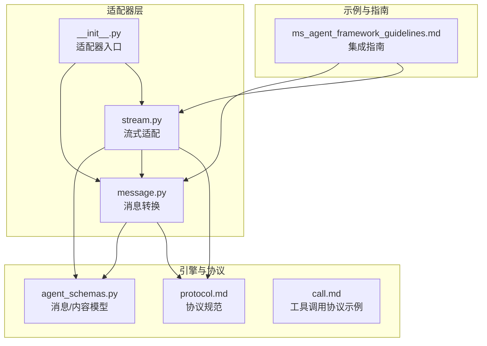
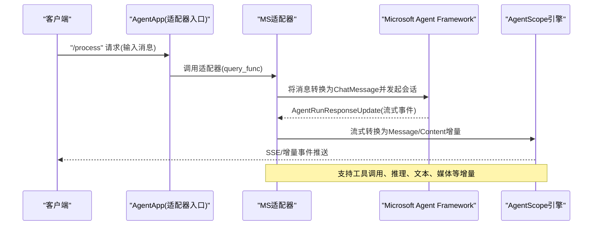
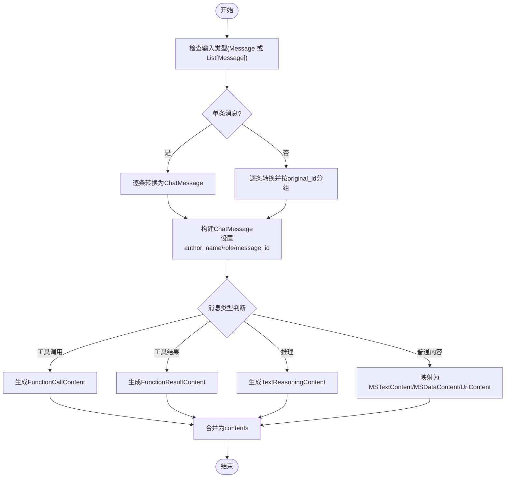
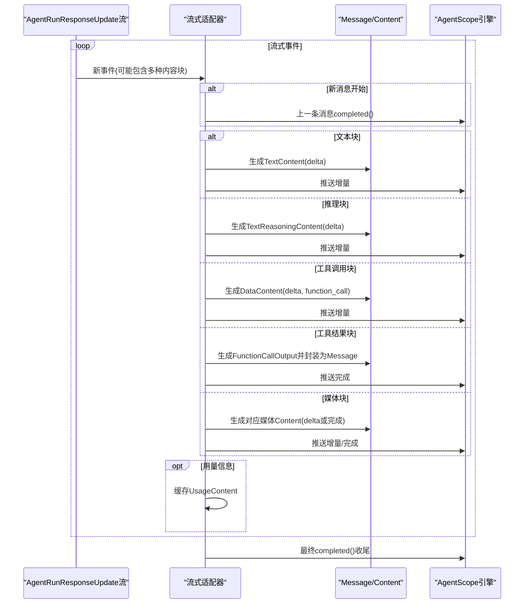
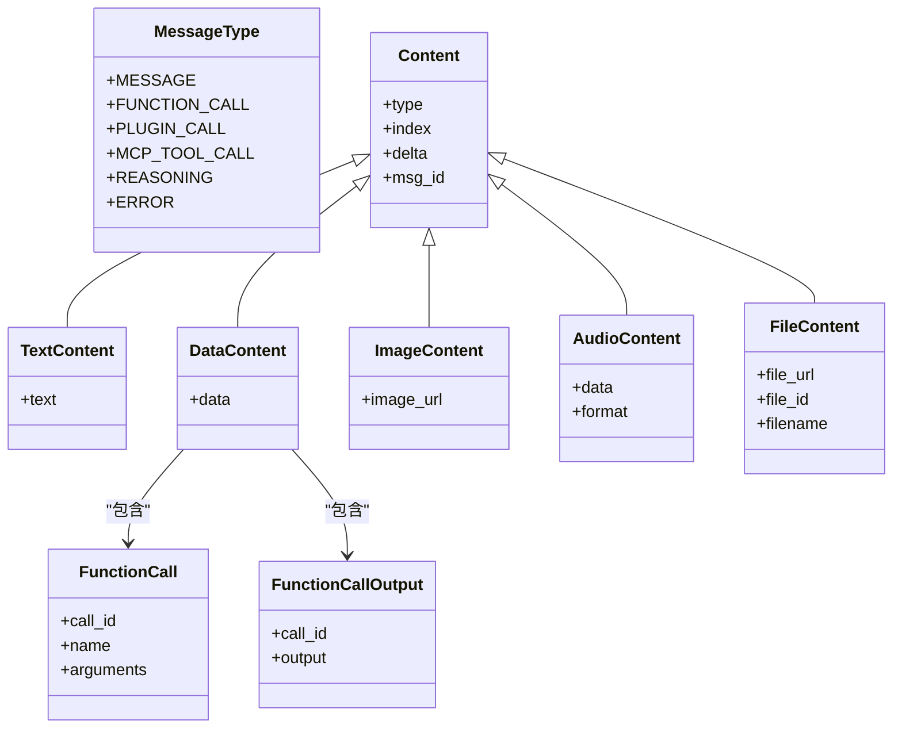
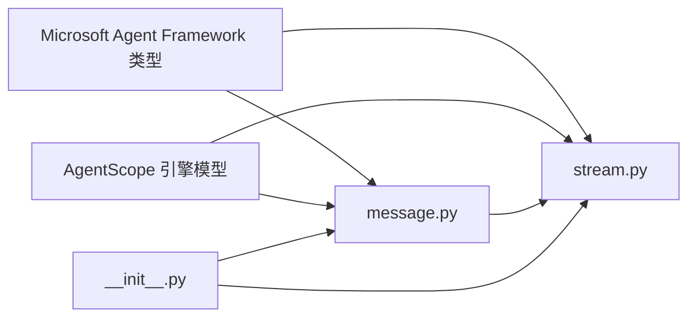

# MS Agent Framework适配器

<cite>
**本文档引用的文件**
- [message.py](file://src/agentscope_runtime/adapters/ms_agent_framework/message.py)
- [stream.py](file://src/agentscope_runtime/adapters/ms_agent_framework/stream.py)
- [__init__.py](file://src/agentscope_runtime/adapters/ms_agent_framework/__init__.py)
- [ms_agent_framework_guidelines.md](file://cookbook/zh/ms_agent_framework_guidelines.md)
- [agent_schemas.py](file://src/agentscope_runtime/engine/schemas/agent_schemas.py)
- [protocol.md](file://cookbook/en/protocol.md)
- [call.md](file://cookbook/en/call.md)
</cite>

## 目录
1. [简介](#简介)
2. [项目结构](#项目结构)
3. [核心组件](#核心组件)
4. [架构总览](#架构总览)
5. [详细组件分析](#详细组件分析)
6. [依赖关系分析](#依赖关系分析)
7. [性能考虑](#性能考虑)
8. [故障排除指南](#故障排除指南)
9. [结论](#结论)
10. [附录](#附录)

## 简介
本文件面向需要在 AgentScope Runtime 中集成 Microsoft Agent Framework 的开发者，系统性阐述 MS Agent Framework 适配器的消息格式与协议规范、消息转换机制（对话状态、工具调用、响应格式）、流式传输实现与实时通信机制，并提供与 Microsoft AI SDK 的集成指南、Microsoft 特有的消息类型与元数据处理方法、实际集成示例与配置参数说明，以及故障排除与性能优化建议。

## 项目结构
MS Agent Framework 适配器位于适配器目录下，包含消息转换与流式适配两个核心模块，配合引擎层的消息模型与协议规范文档，形成从 AgentScope 内部消息到 Microsoft Agent Framework 协议的双向映射能力。

**图表来源**
- [message.py:1-216](file://src/agentscope_runtime/adapters/ms_agent_framework/message.py#L1-L216)
- [stream.py:1-420](file://src/agentscope_runtime/adapters/ms_agent_framework/stream.py#L1-L420)
- [__init__.py:1-1](file://src/agentscope_runtime/adapters/ms_agent_framework/__init__.py#L1-L1)
- [agent_schemas.py:1-400](file://src/agentscope_runtime/engine/schemas/agent_schemas.py#L1-L400)
- [protocol.md:142-225](file://cookbook/en/protocol.md#L142-L225)
- [call.md:252-281](file://cookbook/en/call.md#L252-L281)
- [ms_agent_framework_guidelines.md:1-183](file://cookbook/zh/ms_agent_framework_guidelines.md#L1-L183)

**章节来源**
- [message.py:1-216](file://src/agentscope_runtime/adapters/ms_agent_framework/message.py#L1-L216)
- [stream.py:1-420](file://src/agentscope_runtime/adapters/ms_agent_framework/stream.py#L1-L420)
- [__init__.py:1-1](file://src/agentscope_runtime/adapters/ms_agent_framework/__init__.py#L1-L1)
- [agent_schemas.py:1-400](file://src/agentscope_runtime/engine/schemas/agent_schemas.py#L1-L400)
- [protocol.md:142-225](file://cookbook/en/protocol.md#L142-L225)
- [call.md:252-281](file://cookbook/en/call.md#L252-L281)
- [ms_agent_framework_guidelines.md:1-183](file://cookbook/zh/ms_agent_framework_guidelines.md#L1-L183)

## 核心组件
- 消息转换器：将 AgentScope 内部消息（含文本、图片、音频、数据、文件、推理、工具调用等）转换为 Microsoft Agent Framework 的 ChatMessage 结构，并保留原始消息 ID、作者名与附加属性。
- 流式适配器：将 Microsoft Agent Framework 的 AgentRunResponseUpdate 流转换为 AgentScope 的 Message/Content 流，支持文本增量、推理内容、工具调用参数增量、工具结果、媒体资源等的增量推送与最终完成事件。

**章节来源**
- [message.py:23-216](file://src/agentscope_runtime/adapters/ms_agent_framework/message.py#L23-L216)
- [stream.py:36-420](file://src/agentscope_runtime/adapters/ms_agent_framework/stream.py#L36-L420)

## 架构总览
MS Agent Framework 适配器在 AgentScope Runtime 中承担“协议桥接”的职责：一方面将内部消息转换为 Microsoft Agent Framework 的消息结构；另一方面将框架的运行时更新流转换为内部的增量消息流，支撑多轮对话、工具调用与多媒体内容的实时交互。

**图表来源**
- [message.py:23-216](file://src/agentscope_runtime/adapters/ms_agent_framework/message.py#L23-L216)
- [stream.py:36-420](file://src/agentscope_runtime/adapters/ms_agent_framework/stream.py#L36-L420)
- [ms_agent_framework_guidelines.md:46-106](file://cookbook/zh/ms_agent_framework_guidelines.md#L46-L106)

## 详细组件分析

### 组件A：消息转换器（message_to_ms_agent_framework_message）
负责将 AgentScope 的 Message 列表转换为 Microsoft Agent Framework 的 ChatMessage 列表，支持：
- 角色与作者名映射（优先使用 metadata 中的 original_name/original_id）
- 多种内容类型映射：文本、图片、音频、数据、文件
- 工具调用与工具结果的特殊处理：FunctionCallContent、FunctionResultContent
- 推理内容：TextReasoningContent
- 对象分组：按 original_id 合并消息内容块

**图表来源**
- [message.py:23-216](file://src/agentscope_runtime/adapters/ms_agent_framework/message.py#L23-L216)

**章节来源**
- [message.py:23-216](file://src/agentscope_runtime/adapters/ms_agent_framework/message.py#L23-L216)

### 组件B：流式适配器（adapt_ms_agent_framework_message_stream）
将 Microsoft Agent Framework 的 AgentRunResponseUpdate 流转换为 AgentScope 的增量消息流，关键特性：
- 基于 message_id 的消息分组与状态管理
- 文本增量（TextContent.delta）、推理增量（TextReasoningContent）、工具调用参数增量（DataContent.delta）与工具结果（FunctionCallOutput）
- 媒体资源（图像、音频、文件）的增量与完成事件
- 使用 UsageContent 记录用量信息并在消息完成时回填
- 错误内容（ErrorContent）直接抛出为运行时异常

**图表来源**
- [stream.py:36-420](file://src/agentscope_runtime/adapters/ms_agent_framework/stream.py#L36-L420)

**章节来源**
- [stream.py:36-420](file://src/agentscope_runtime/adapters/ms_agent_framework/stream.py#L36-L420)

### 组件C：消息类型与内容模型
- MessageType：涵盖 message、function_call、plugin_call、mcp_call、reasoning、error 等类型
- Content 系列：TextContent、DataContent、ImageContent、AudioContent、FileContent 等
- 工具调用相关：FunctionCall、FunctionCallOutput、McpCall、McpCallOutput 等

**图表来源**
- [agent_schemas.py:18-36](file://src/agentscope_runtime/engine/schemas/agent_schemas.py#L18-L36)
- [agent_schemas.py:320-400](file://src/agentscope_runtime/engine/schemas/agent_schemas.py#L320-L400)
- [protocol.md:142-225](file://cookbook/en/protocol.md#L142-L225)

**章节来源**
- [agent_schemas.py:18-36](file://src/agentscope_runtime/engine/schemas/agent_schemas.py#L18-L36)
- [agent_schemas.py:320-400](file://src/agentscope_runtime/engine/schemas/agent_schemas.py#L320-L400)
- [protocol.md:142-225](file://cookbook/en/protocol.md#L142-L225)

## 依赖关系分析
- 适配器依赖 Microsoft Agent Framework 的消息类型（ChatMessage、各内容块类型）与运行时更新类型（AgentRunResponseUpdate）
- 适配器依赖 AgentScope 引擎的消息与内容模型（Message、Content、FunctionCall、FunctionCallOutput 等）
- 流式适配器依赖 UsageContent 与错误内容（ErrorContent）进行状态与异常处理
- 初始化文件作为适配器入口，导出转换与流式适配函数

**图表来源**
- [message.py:7-20](file://src/agentscope_runtime/adapters/ms_agent_framework/message.py#L7-L20)
- [stream.py:8-33](file://src/agentscope_runtime/adapters/ms_agent_framework/stream.py#L8-L33)
- [__init__.py:1-1](file://src/agentscope_runtime/adapters/ms_agent_framework/__init__.py#L1-L1)

**章节来源**
- [message.py:1-216](file://src/agentscope_runtime/adapters/ms_agent_framework/message.py#L1-L216)
- [stream.py:1-420](file://src/agentscope_runtime/adapters/ms_agent_framework/stream.py#L1-L420)
- [__init__.py:1-1](file://src/agentscope_runtime/adapters/ms_agent_framework/__init__.py#L1-L1)

## 性能考虑
- 流式增量推送：优先使用 delta 字段进行增量传输，减少重复内容与带宽占用
- 消息分组与合并：按 original_id 合并内容块，避免过多小消息导致的开销
- 深拷贝与状态缓存：在流式适配器中对消息对象进行深拷贝，避免并发污染；缓存用量信息在消息完成时统一回填
- 媒体资源：优先使用 URI 引用而非内联数据，降低消息体积
- 错误快速失败：遇到 ErrorContent 直接抛出异常，避免无效流继续消耗资源

[本节为通用性能建议，不直接分析具体文件]

## 故障排除指南
- 输入类型错误：当传入非 Message 或 List[Message] 时会触发类型错误，需确保输入符合预期
- 不支持的内容类型：当内容类型不在映射表中会抛出异常，需检查内容类型是否受支持
- 工具调用参数解析：工具调用参数为字符串时尝试 JSON 解析，失败则回退为空字典，确保参数格式正确
- 媒体资源格式：音频/视频/文件等媒体类型需提供正确的 URI 与类型标识
- 错误内容处理：当收到 ErrorContent 时会抛出运行时异常，需根据错误码与详情定位问题

**章节来源**
- [message.py:149-150](file://src/agentscope_runtime/adapters/ms_agent_framework/message.py#L149-L150)
- [message.py:89-95](file://src/agentscope_runtime/adapters/ms_agent_framework/message.py#L89-L95)
- [stream.py:369-374](file://src/agentscope_runtime/adapters/ms_agent_framework/stream.py#L369-L374)

## 结论
MS Agent Framework 适配器通过明确的消息转换与流式适配机制，实现了 AgentScope 与 Microsoft Agent Framework 的无缝对接。其设计兼顾了多模态内容、工具调用与推理过程的实时传输需求，并提供了完善的错误处理与状态管理。结合集成示例与协议规范，开发者可快速构建具备多轮对话、会话记忆与流式响应能力的智能体应用。

[本节为总结性内容，不直接分析具体文件]

## 附录

### 集成示例与配置参数
- 示例应用：参考集成指南中的示例，展示如何使用 AgentApp 注册查询函数、创建 OpenAI 兼容客户端、恢复/保存会话线程、启用流式输出
- 关键参数：
  - 模型 ID：如 qwen-plus
  - API Key：通过环境变量配置
  - Base URL：DashScope 兼容模式地址
  - 会话 ID：用于线程恢复与状态持久化
- API 交互：
  - HTTP POST /process：提交用户输入，支持 SSE 流式返回
  - OpenAI 兼容模式：通过 /compatible-mode/v1 访问

**章节来源**
- [ms_agent_framework_guidelines.md:46-106](file://cookbook/zh/ms_agent_framework_guidelines.md#L46-L106)
- [ms_agent_framework_guidelines.md:134-170](file://cookbook/zh/ms_agent_framework_guidelines.md#L134-L170)

### Microsoft 特有消息类型与元数据处理
- 特有类型：
  - 推理消息（REASONING）：使用 TextReasoningContent 表达思考过程
  - 工具调用（MCP/Plugin）：使用 FunctionCallContent/FunctionResultContent 与 DataContent 包裹
  - 错误消息（ERROR）：使用 ErrorContent 抛出异常
- 元数据处理：
  - 优先使用 metadata 中的 original_id 与 original_name
  - additional_properties 透传自 metadata 中的 metadata 字段
  - message_id 优先使用 original_id，否则回退为原始消息 ID

**章节来源**
- [message.py:67-76](file://src/agentscope_runtime/adapters/ms_agent_framework/message.py#L67-L76)
- [message.py:70-76](file://src/agentscope_runtime/adapters/ms_agent_framework/message.py#L70-L76)
- [message.py:200-206](file://src/agentscope_runtime/adapters/ms_agent_framework/message.py#L200-L206)

### 协议与消息格式参考
- 内容模型基础字段：type、index、delta、msg_id 等
- 工具调用协议示例：包含 RUN_STARTED、TOOL_CALL_START/ARGS/END/RESULT、TEXT_MESSAGE_START/CONTENT/END、RUN_FINISHED 等事件类型

**章节来源**
- [protocol.md:142-225](file://cookbook/en/protocol.md#L142-L225)
- [call.md:252-281](file://cookbook/en/call.md#L252-L281)