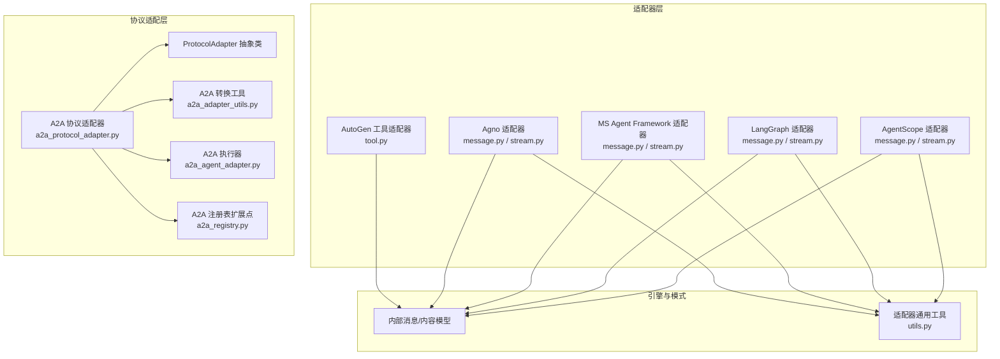
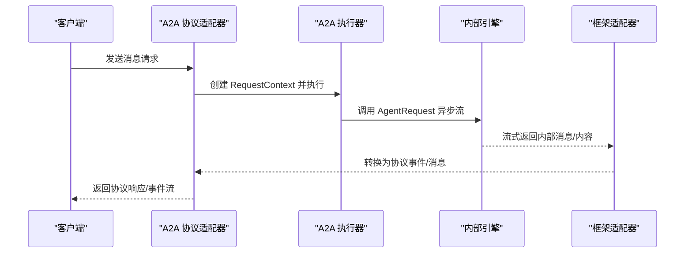
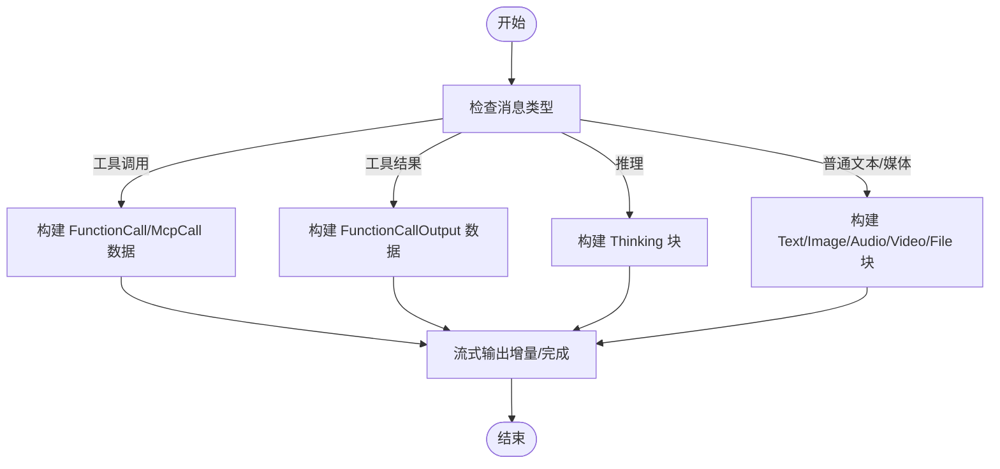
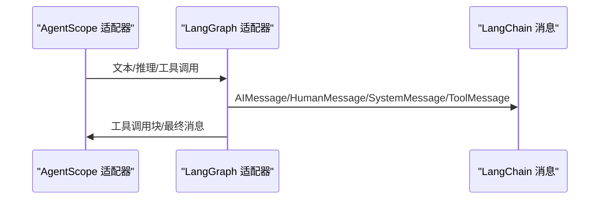
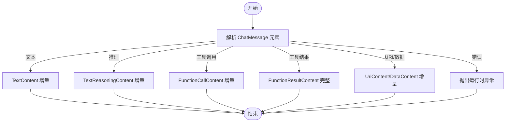
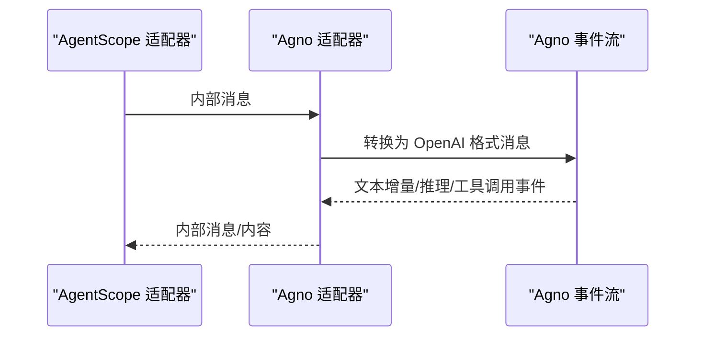
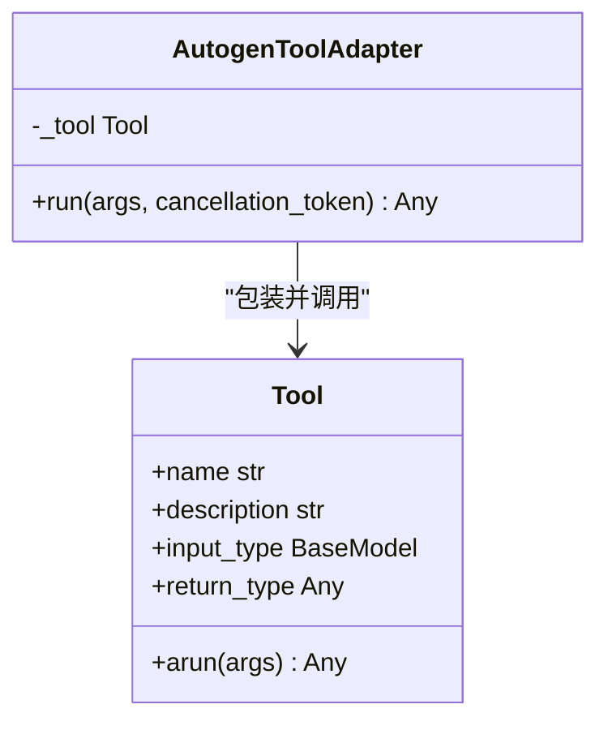
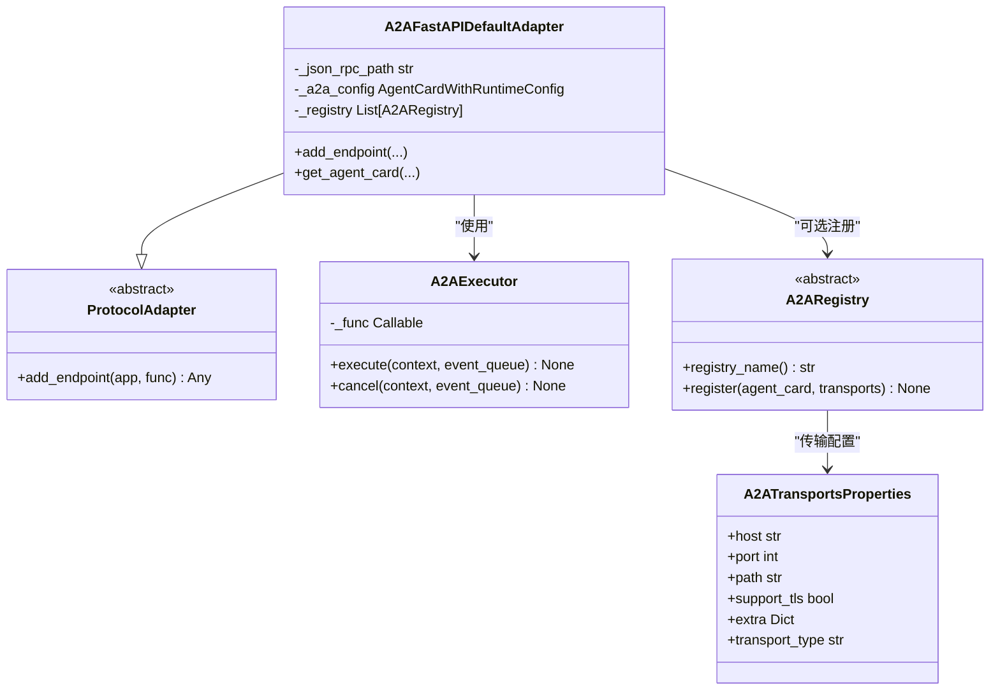
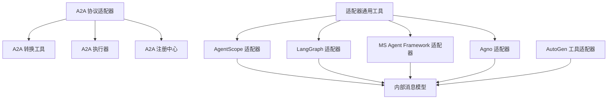

# 协议适配器系统

<cite>
**本文档引用的文件**
- [a2a_adapter_utils.py](file://src/agentscope_runtime/engine/deployers/adapter/a2a/a2a_adapter_utils.py)
- [a2a_agent_adapter.py](file://src/agentscope_runtime/engine/deployers/adapter/a2a/a2a_agent_adapter.py)
- [a2a_protocol_adapter.py](file://src/agentscope_runtime/engine/deployers/adapter/a2a/a2a_protocol_adapter.py)
- [a2a_registry.py](file://src/agentscope_runtime/engine/deployers/adapter/a2a/a2a_registry.py)
- [protocol_adapter.py](file://src/agentscope_runtime/engine/deployers/adapter/protocol_adapter.py)
- [agentscope_message.py](file://src/agentscope_runtime/adapters/agentscope/message.py)
- [agentscope_stream.py](file://src/agentscope_runtime/adapters/agentscope/stream.py)
- [langgraph_message.py](file://src/agentscope_runtime/adapters/langgraph/message.py)
- [langgraph_stream.py](file://src/agentscope_runtime/adapters/langgraph/stream.py)
- [ms_agent_framework_message.py](file://src/agentscope_runtime/adapters/ms_agent_framework/message.py)
- [ms_agent_framework_stream.py](file://src/agentscope_runtime/adapters/ms_agent_framework/stream.py)
- [agno_message.py](file://src/agentscope_runtime/adapters/agno/message.py)
- [agno_stream.py](file://src/agentscope_runtime/adapters/agno/stream.py)
- [autogen_tool.py](file://src/agentscope_runtime/adapters/autogen/tool/tool.py)
- [utils.py](file://src/agentscope_runtime/adapters/utils.py)
</cite>

## 目录
1. [简介](#简介)
2. [项目结构](#项目结构)
3. [核心组件](#核心组件)
4. [架构总览](#架构总览)
5. [详细组件分析](#详细组件分析)
6. [依赖关系分析](#依赖关系分析)
7. [性能考虑](#性能考虑)
8. [故障排除指南](#故障排除指南)
9. [结论](#结论)
10. [附录](#附录)

## 简介
本文件系统性阐述协议适配器系统的设计理念与实现原理，覆盖以下适配器：
- AgentScope 适配器：消息与流式输出转换、工具调用与推理内容处理
- LangGraph 适配器：消息与流式输出转换、工具调用（含工具调用块）处理
- MS Agent Framework 适配器：消息与流式输出转换、工具调用与错误处理
- Agno 适配器：消息格式转换与事件流适配
- AutoGen 工具适配器：将运行时工具包装为 AutoGen 可用工具
- A2A 协议适配器：FastAPI 集成、代理卡片生成、任务管理与服务发现

系统通过统一的内部消息模型与协议适配层，实现多框架间的跨框架兼容，支持同步/异步流式输出、工具调用、推理内容、以及事件驱动的任务状态更新。

## 项目结构
适配器系统位于 src/agentscope_runtime/adapters 下，按框架划分目录；协议适配层位于 src/agentscope_runtime/engine/deployers/adapter 下，包含通用协议适配接口与 A2A 实现。

**图表来源**
- [a2a_protocol_adapter.py:136-498](file://src/agentscope_runtime/engine/deployers/adapter/a2a/a2a_protocol_adapter.py#L136-L498)
- [a2a_adapter_utils.py:35-405](file://src/agentscope_runtime/engine/deployers/adapter/a2a/a2a_adapter_utils.py#L35-L405)
- [a2a_agent_adapter.py:23-70](file://src/agentscope_runtime/engine/deployers/adapter/a2a/a2a_agent_adapter.py#L23-L70)
- [a2a_registry.py:45-77](file://src/agentscope_runtime/engine/deployers/adapter/a2a/a2a_registry.py#L45-L77)
- [protocol_adapter.py:6-25](file://src/agentscope_runtime/engine/deployers/adapter/protocol_adapter.py#L6-L25)
- [agentscope_message.py:53-394](file://src/agentscope_runtime/adapters/agentscope/message.py#L53-L394)
- [agentscope_stream.py:33-684](file://src/agentscope_runtime/adapters/agentscope/stream.py#L33-L684)
- [langgraph_message.py:23-163](file://src/agentscope_runtime/adapters/langgraph/message.py#L23-L163)
- [langgraph_stream.py:28-257](file://src/agentscope_runtime/adapters/langgraph/stream.py#L28-L257)
- [ms_agent_framework_message.py:23-216](file://src/agentscope_runtime/adapters/ms_agent_framework/message.py#L23-L216)
- [ms_agent_framework_stream.py:36-420](file://src/agentscope_runtime/adapters/ms_agent_framework/stream.py#L36-L420)
- [agno_message.py:10-40](file://src/agentscope_runtime/adapters/agno/message.py#L10-L40)
- [agno_stream.py:32-124](file://src/agentscope_runtime/adapters/agno/stream.py#L32-L124)
- [autogen_tool.py:28-212](file://src/agentscope_runtime/adapters/autogen/tool/tool.py#L28-L212)
- [utils.py:2-7](file://src/agentscope_runtime/adapters/utils.py#L2-L7)

**章节来源**
- [a2a_protocol_adapter.py:136-498](file://src/agentscope_runtime/engine/deployers/adapter/a2a/a2a_protocol_adapter.py#L136-L498)
- [protocol_adapter.py:6-25](file://src/agentscope_runtime/engine/deployers/adapter/protocol_adapter.py#L6-L25)

## 核心组件
- 内部消息/内容模型：统一的 Message、Content、TextContent、ImageContent、AudioContent、VideoContent、DataContent、FileContent、FunctionCall、FunctionCallOutput、McpCall、McpCallOutput、MessageType、Role 等，用于跨框架传输与处理。
- 适配器通用工具：_update_obj_attrs 用于在流式过程中动态更新消息对象属性（如 usage、metadata）。
- 协议适配抽象：ProtocolAdapter 定义 add_endpoint 接口，A2A 协议适配器继承该接口，提供 FastAPI 路由注册、代理卡片生成、任务存储与服务注册。

**章节来源**
- [agentscope_stream.py:33-684](file://src/agentscope_runtime/adapters/agentscope/stream.py#L33-L684)
- [utils.py:2-7](file://src/agentscope_runtime/adapters/utils.py#L2-L7)
- [protocol_adapter.py:6-25](file://src/agentscope_runtime/engine/deployers/adapter/protocol_adapter.py#L6-L25)

## 架构总览
系统采用“协议适配层 + 框架适配器层”的分层设计：
- 协议适配层负责与外部协议交互（如 A2A），生成/解析协议消息，维护任务状态与事件队列。
- 框架适配器层负责将内部消息模型转换为各框架期望的消息格式，并处理工具调用、推理内容与流式输出。

**图表来源**
- [a2a_agent_adapter.py:27-63](file://src/agentscope_runtime/engine/deployers/adapter/a2a/a2a_agent_adapter.py#L27-L63)
- [a2a_protocol_adapter.py:222-258](file://src/agentscope_runtime/engine/deployers/adapter/a2a/a2a_protocol_adapter.py#L222-L258)
- [a2a_adapter_utils.py:218-327](file://src/agentscope_runtime/engine/deployers/adapter/a2a/a2a_adapter_utils.py#L218-L327)

## 详细组件分析

### AgentScope 适配器
- 消息转换：支持文本、图像、音频、视频、数据、文件等类型，以及工具调用（plugin/mcp）、工具结果、推理内容（thinking）。可自定义 type_converters 进行扩展。
- 流式输出：支持增量文本、推理文本、工具调用参数增量、工具结果增量、多媒体内容增量；在消息结束或工具调用结束时发出 completed 事件。
- 工具调用机制：根据工具类型选择 MessageType.PLUGIN_CALL 或 MessageType.MCP_TOOL_CALL，并将参数/结果序列化为 DataContent 的 data 字段。

**图表来源**
- [agentscope_message.py:112-196](file://src/agentscope_runtime/adapters/agentscope/message.py#L112-L196)
- [agentscope_stream.py:292-468](file://src/agentscope_runtime/adapters/agentscope/stream.py#L292-L468)

**章节来源**
- [agentscope_message.py:53-394](file://src/agentscope_runtime/adapters/agentscope/message.py#L53-L394)
- [agentscope_stream.py:33-684](file://src/agentscope_runtime/adapters/agentscope/stream.py#L33-L684)

### LangGraph 适配器
- 消息转换：将内部消息映射到 LangGraph 的 HumanMessage、AIMessage、SystemMessage、ToolMessage；工具调用转换为 AIMessage 的 tool_calls，工具结果转换为 ToolMessage。
- 流式输出：支持工具调用块（tool_call_chunks）与普通文本增量；在最后块时合并工具调用并输出完整消息。
- 事件处理：区分普通消息与工具调用块，确保工具调用的完整性和顺序。

**图表来源**
- [langgraph_message.py:23-163](file://src/agentscope_runtime/adapters/langgraph/message.py#L23-L163)
- [langgraph_stream.py:28-257](file://src/agentscope_runtime/adapters/langgraph/stream.py#L28-L257)

**章节来源**
- [langgraph_message.py:23-163](file://src/agentscope_runtime/adapters/langgraph/message.py#L23-L163)
- [langgraph_stream.py:28-257](file://src/agentscope_runtime/adapters/langgraph/stream.py#L28-L257)

### MS Agent Framework 适配器
- 消息转换：将内部消息映射到 ChatMessage，支持 FunctionCallContent、FunctionResultContent、TextReasoningContent、UriContent、DataContent 等。
- 流式输出：支持文本增量、推理文本增量、工具调用增量、工具结果增量；在遇到工具调用时切换到工具消息流。
- 错误处理：识别 ErrorContent 并抛出运行时异常。

**图表来源**
- [ms_agent_framework_message.py:58-178](file://src/agentscope_runtime/adapters/ms_agent_framework/message.py#L58-L178)
- [ms_agent_framework_stream.py:138-377](file://src/agentscope_runtime/adapters/ms_agent_framework/stream.py#L138-L377)

**章节来源**
- [ms_agent_framework_message.py:23-216](file://src/agentscope_runtime/adapters/ms_agent_framework/message.py#L23-L216)
- [ms_agent_framework_stream.py:36-420](file://src/agentscope_runtime/adapters/ms_agent_framework/stream.py#L36-L420)

### Agno 适配器
- 消息转换：先转换为 AgentScope Msg，再使用 OpenAIChatFormatter 输出为 Agno 消息格式。
- 流式输出：基于 Agno 的事件流（RunContentEvent、RunContentCompletedEvent、ToolCallStartedEvent、ToolCallCompletedEvent）转换为内部消息/内容，支持推理内容与工具调用。

**图表来源**
- [agno_message.py:10-40](file://src/agentscope_runtime/adapters/agno/message.py#L10-L40)
- [agno_stream.py:32-124](file://src/agentscope_runtime/adapters/agno/stream.py#L32-L124)

**章节来源**
- [agno_message.py:10-40](file://src/agentscope_runtime/adapters/agno/message.py#L10-L40)
- [agno_stream.py:32-124](file://src/agentscope_runtime/adapters/agno/stream.py#L32-L124)

### AutoGen 工具适配器
- 工具包装：将 agentscope_runtime.tools.base.Tool 包装为 AutoGen Core 的 BaseTool，自动从工具输入/输出类型生成 Pydantic 模型。
- 运行机制：异步调用工具 arun，将结果序列化为字符串返回；异常时增强错误信息。
- 批量创建：提供 create_autogen_tools 工具批量适配函数。

**图表来源**
- [autogen_tool.py:28-138](file://src/agentscope_runtime/adapters/autogen/tool/tool.py#L28-L138)

**章节来源**
- [autogen_tool.py:140-212](file://src/agentscope_runtime/adapters/autogen/tool/tool.py#L140-L212)

### A2A 协议适配器
- 协议接口：实现 ProtocolAdapter 的 add_endpoint，向 FastAPI 应用添加 A2A 路由与代理卡片端点。
- 执行器：A2AExecutor 将外部请求封装为 AgentRequest，调用内部异步流，将最终响应转换为 A2A 消息并入队事件。
- 转换工具：提供 A2A 与内部消息/内容之间的双向转换，包括消息、内容、任务状态、工件更新事件。
- 注册中心：A2ARegistry 抽象定义注册行为，支持多注册中心与传输属性配置。

**图表来源**
- [protocol_adapter.py:6-25](file://src/agentscope_runtime/engine/deployers/adapter/protocol_adapter.py#L6-L25)
- [a2a_protocol_adapter.py:136-498](file://src/agentscope_runtime/engine/deployers/adapter/a2a/a2a_protocol_adapter.py#L136-L498)
- [a2a_agent_adapter.py:23-70](file://src/agentscope_runtime/engine/deployers/adapter/a2a/a2a_agent_adapter.py#L23-L70)
- [a2a_registry.py:45-77](file://src/agentscope_runtime/engine/deployers/adapter/a2a/a2a_registry.py#L45-L77)

**章节来源**
- [a2a_protocol_adapter.py:55-498](file://src/agentscope_runtime/engine/deployers/adapter/a2a/a2a_protocol_adapter.py#L55-L498)
- [a2a_agent_adapter.py:23-70](file://src/agentscope_runtime/engine/deployers/adapter/a2a/a2a_agent_adapter.py#L23-L70)
- [a2a_adapter_utils.py:35-405](file://src/agentscope_runtime/engine/deployers/adapter/a2a/a2a_adapter_utils.py#L35-L405)
- [a2a_registry.py:24-77](file://src/agentscope_runtime/engine/deployers/adapter/a2a/a2a_registry.py#L24-L77)

## 依赖关系分析
- 组件内聚与耦合
  - 适配器层内部高度内聚，分别面向单一框架；与协议适配层通过统一消息模型解耦。
  - 协议适配层与框架适配器层通过内部消息模型进行数据交换，避免直接依赖具体第三方框架。
- 外部依赖
  - A2A 协议适配器依赖 a2a-server、a2a-types、FastAPI；可选依赖 Nacos 注册中心。
  - LangGraph 适配器依赖 langchain_core 消息类型。
  - MS Agent Framework 适配器依赖 agent_framework。
  - Agno 适配器依赖 agno 运行时事件模型。
  - AutoGen 工具适配器依赖 autogen-core 与 agentscope_runtime.tools.base.Tool。

**图表来源**
- [a2a_protocol_adapter.py:222-331](file://src/agentscope_runtime/engine/deployers/adapter/a2a/a2a_protocol_adapter.py#L222-L331)
- [a2a_adapter_utils.py:143-405](file://src/agentscope_runtime/engine/deployers/adapter/a2a/a2a_adapter_utils.py#L143-L405)
- [agentscope_stream.py:33-684](file://src/agentscope_runtime/adapters/agentscope/stream.py#L33-L684)
- [langgraph_stream.py:28-257](file://src/agentscope_runtime/adapters/langgraph/stream.py#L28-L257)
- [ms_agent_framework_stream.py:36-420](file://src/agentscope_runtime/adapters/ms_agent_framework/stream.py#L36-L420)
- [agno_stream.py:32-124](file://src/agentscope_runtime/adapters/agno/stream.py#L32-L124)
- [autogen_tool.py:28-138](file://src/agentscope_runtime/adapters/autogen/tool/tool.py#L28-L138)
- [utils.py:2-7](file://src/agentscope_runtime/adapters/utils.py#L2-L7)

**章节来源**
- [a2a_protocol_adapter.py:222-331](file://src/agentscope_runtime/engine/deployers/adapter/a2a/a2a_protocol_adapter.py#L222-L331)
- [agentscope_stream.py:33-684](file://src/agentscope_runtime/adapters/agentscope/stream.py#L33-L684)
- [langgraph_stream.py:28-257](file://src/agentscope_runtime/adapters/langgraph/stream.py#L28-L257)
- [ms_agent_framework_stream.py:36-420](file://src/agentscope_runtime/adapters/ms_agent_framework/stream.py#L36-L420)
- [agno_stream.py:32-124](file://src/agentscope_runtime/adapters/agno/stream.py#L32-L124)
- [autogen_tool.py:28-138](file://src/agentscope_runtime/adapters/autogen/tool/tool.py#L28-L138)

## 性能考虑
- 流式处理优先：所有适配器均采用异步迭代器进行流式输出，减少内存占用与延迟。
- 增量内容合并：在工具调用与推理场景中，通过索引与增量内容合并策略，避免重复发送与错序。
- 最小化对象复制：在流式过程中对消息对象进行深拷贝，避免修改原始对象导致的副作用。
- 事件聚合：LangGraph 适配器对工具调用块进行聚合，减少事件数量，提升吞吐。

[本节为通用指导，无需特定文件来源]

## 故障排除指南
- A2A 协议相关
  - 任务状态映射：确认内部 RunStatus 到 TaskState 的映射是否正确，避免未知状态导致的状态更新失败。
  - 事件队列：若出现事件丢失，检查 A2AExecutor 的事件入队逻辑与异常捕获。
  - 注册失败：注册中心异常不会阻塞启动，但需关注日志中的警告信息。
- AgentScope 适配器
  - 工具调用参数：当参数为字符串时尝试 JSON 解析，若失败回退为空字典；确保传入参数格式正确。
  - 自定义转换器：type_converters 必须返回生成器/异步生成器，否则会抛出类型错误。
- LangGraph 适配器
  - 工具调用块：注意 tool_call_chunks 与 chunk_position 的处理，确保在最后块时合并工具调用。
  - 角色映射：ToolMessage 需要 tool_call_id，若缺失将无法正确映射为工具结果。
- MS Agent Framework 适配器
  - 错误内容：遇到 ErrorContent 将抛出运行时异常，需在上游捕获并处理。
  - 多媒体内容：音频/视频/文件的 URI 与 base64 编码需正确传递，避免内容解析失败。
- Agno 适配器
  - 事件顺序：确保 RunContentEvent 与 RunContentCompletedEvent 成对出现，避免消息未完成。
  - 工具调用：工具调用不支持流式，会在 ToolCallStartedEvent 后立即输出完整消息。
- AutoGen 工具适配器
  - 依赖安装：未安装 autogen-core 会抛出 ImportError，需按提示安装。
  - 结果序列化：工具返回值需可 JSON 序列化，否则会转为字符串。

**章节来源**
- [a2a_agent_adapter.py:61-63](file://src/agentscope_runtime/engine/deployers/adapter/a2a/a2a_agent_adapter.py#L61-L63)
- [agentscope_stream.py:175-180](file://src/agentscope_runtime/adapters/agentscope/stream.py#L175-L180)
- [langgraph_stream.py:104-144](file://src/agentscope_runtime/adapters/langgraph/stream.py#L104-L144)
- [ms_agent_framework_stream.py:369-377](file://src/agentscope_runtime/adapters/ms_agent_framework/stream.py#L369-L377)
- [agno_stream.py:84-102](file://src/agentscope_runtime/adapters/agno/stream.py#L84-L102)
- [autogen_tool.py:16-21](file://src/agentscope_runtime/adapters/autogen/tool/tool.py#L16-L21)

## 结论
协议适配器系统通过统一的内部消息模型与分层适配架构，实现了与 AgentScope、LangGraph、MS Agent Framework、Agno、AutoGen 等多框架的高效兼容。A2A 协议适配器进一步提供了标准化的代理卡片、任务管理与服务发现能力。通过异步流式处理与事件驱动机制，系统在保证跨框架一致性的同时，兼顾了性能与可扩展性。

[本节为总结，无需特定文件来源]

## 附录

### 适配器注册、配置与使用方法
- 注册与配置
  - A2A 协议适配器：通过 A2AFastAPIDefaultAdapter.add_endpoint(app, func) 注册路由；可通过 AgentCardWithRuntimeConfig 配置主机、端口、注册中心、超时等参数。
  - 协议适配抽象：实现 ProtocolAdapter.add_endpoint，即可接入新的协议。
- 使用示例路径
  - A2A 执行器与转换工具：[a2a_agent_adapter.py:23-70](file://src/agentscope_runtime/engine/deployers/adapter/a2a/a2a_agent_adapter.py#L23-L70)，[a2a_adapter_utils.py:35-405](file://src/agentscope_runtime/engine/deployers/adapter/a2a/a2a_adapter_utils.py#L35-L405)
  - AgentScope 适配器：消息转换与流式输出 [agentscope_message.py:53-394](file://src/agentscope_runtime/adapters/agentscope/message.py#L53-L394)，[agentscope_stream.py:33-684](file://src/agentscope_runtime/adapters/agentscope/stream.py#L33-L684)
  - LangGraph 适配器：消息转换与流式输出 [langgraph_message.py:23-163](file://src/agentscope_runtime/adapters/langgraph/message.py#L23-L163)，[langgraph_stream.py:28-257](file://src/agentscope_runtime/adapters/langgraph/stream.py#L28-L257)
  - MS Agent Framework 适配器：消息转换与流式输出 [ms_agent_framework_message.py:23-216](file://src/agentscope_runtime/adapters/ms_agent_framework/message.py#L23-L216)，[ms_agent_framework_stream.py:36-420](file://src/agentscope_runtime/adapters/ms_agent_framework/stream.py#L36-L420)
  - Agno 适配器：消息转换与事件流 [agno_message.py:10-40](file://src/agentscope_runtime/adapters/agno/message.py#L10-L40)，[agno_stream.py:32-124](file://src/agentscope_runtime/adapters/agno/stream.py#L32-L124)
  - AutoGen 工具适配器：工具包装与批量创建 [autogen_tool.py:28-212](file://src/agentscope_runtime/adapters/autogen/tool/tool.py#L28-L212)

**章节来源**
- [a2a_protocol_adapter.py:222-331](file://src/agentscope_runtime/engine/deployers/adapter/a2a/a2a_protocol_adapter.py#L222-L331)
- [protocol_adapter.py:10-24](file://src/agentscope_runtime/engine/deployers/adapter/protocol_adapter.py#L10-L24)
- [agentscope_message.py:53-394](file://src/agentscope_runtime/adapters/agentscope/message.py#L53-L394)
- [agentscope_stream.py:33-684](file://src/agentscope_runtime/adapters/agentscope/stream.py#L33-L684)
- [langgraph_message.py:23-163](file://src/agentscope_runtime/adapters/langgraph/message.py#L23-L163)
- [langgraph_stream.py:28-257](file://src/agentscope_runtime/adapters/langgraph/stream.py#L28-L257)
- [ms_agent_framework_message.py:23-216](file://src/agentscope_runtime/adapters/ms_agent_framework/message.py#L23-L216)
- [ms_agent_framework_stream.py:36-420](file://src/agentscope_runtime/adapters/ms_agent_framework/stream.py#L36-L420)
- [agno_message.py:10-40](file://src/agentscope_runtime/adapters/agno/message.py#L10-L40)
- [agno_stream.py:32-124](file://src/agentscope_runtime/adapters/agno/stream.py#L32-L124)
- [autogen_tool.py:140-212](file://src/agentscope_runtime/adapters/autogen/tool/tool.py#L140-L212)

### 跨框架兼容性与限制
- 兼容性
  - 统一内部消息模型作为跨框架桥梁，确保消息、内容、工具调用、推理内容在不同框架间一致表达。
  - 流式输出统一采用增量内容与 completed 事件，简化上层处理。
- 限制
  - 某些框架的高级特性（如推理事件细分、视频内容）在部分适配器中尚未完全支持，需通过自定义转换器扩展。
  - AutoGen 工具适配器需要 autogen-core 依赖，且工具返回值需可 JSON 序列化。

[本节为通用指导，无需特定文件来源]

### 自定义适配器开发指南与最佳实践
- 开发步骤
  - 定义消息转换函数：实现 from_framework_to_internal 与 internal_to_framework 的双向转换。
  - 实现流式适配器：基于 AsyncIterator 实现增量输出，遵循 completed 语义。
  - 扩展工具调用：根据框架工具模型，构造内部 FunctionCall/FunctionCallOutput 或 McpCall/McpCallOutput。
- 最佳实践
  - 使用 type_converters 提供可插拔的自定义转换逻辑。
  - 在流式过程中保持消息对象的不可变性，必要时进行深拷贝。
  - 对异常进行明确分类与日志记录，便于问题定位。
  - 与协议适配层解耦，仅依赖内部消息模型。

[本节为通用指导，无需特定文件来源]