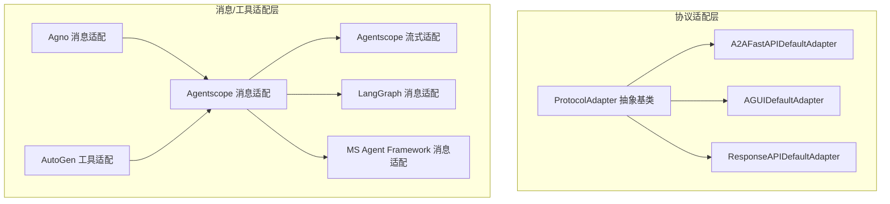
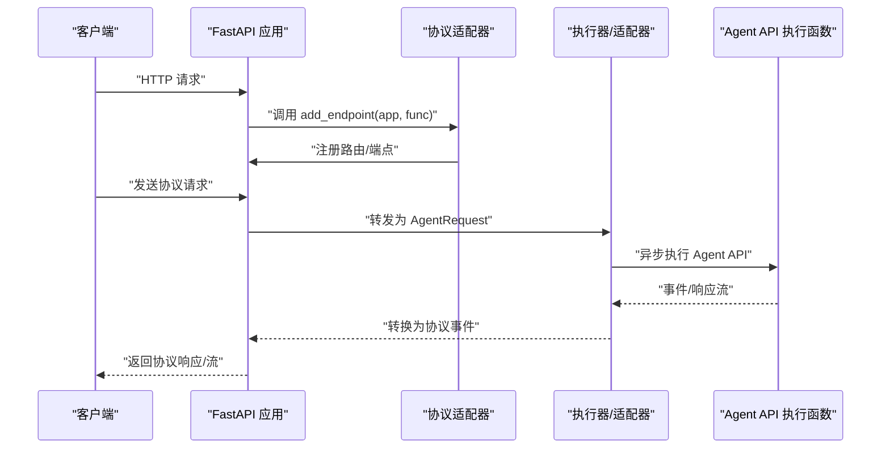
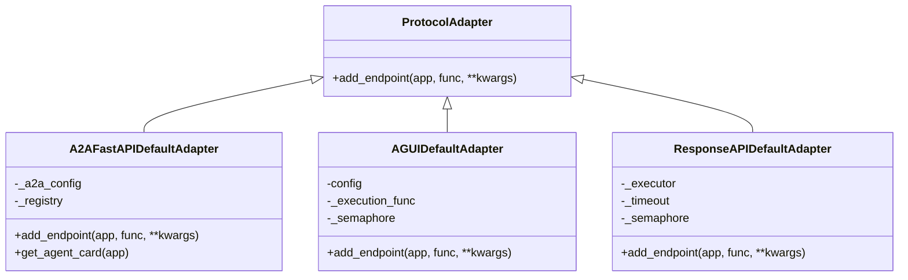
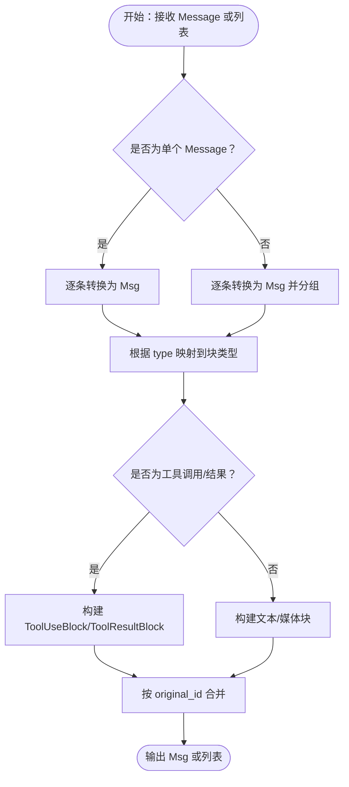
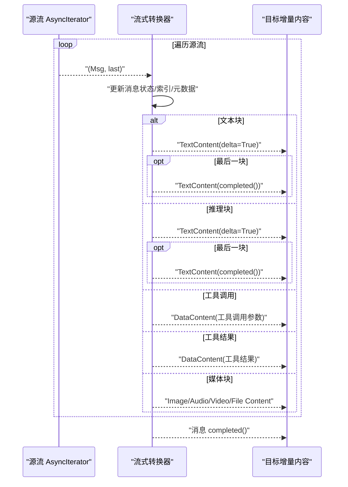
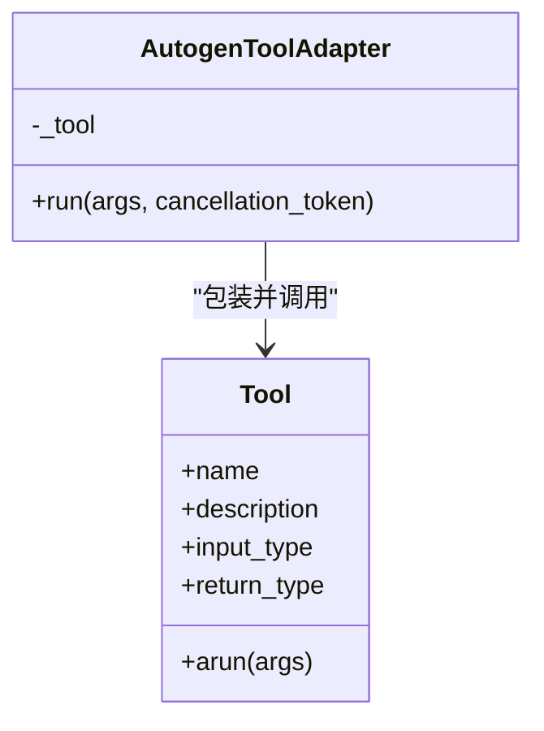
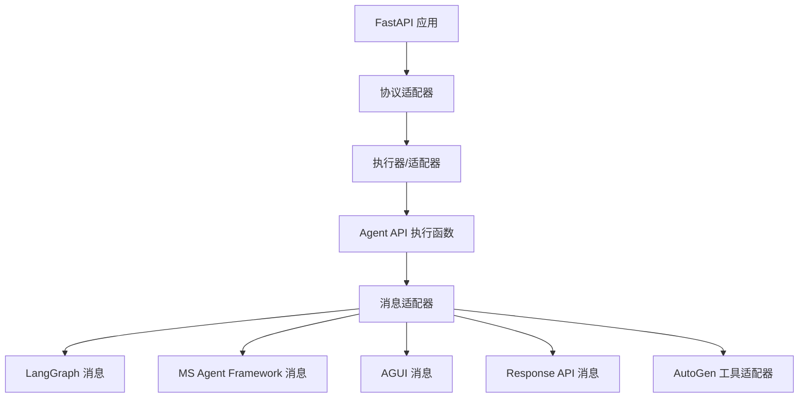

# 自定义适配器开发

<cite>
**本文档引用的文件**
- [adapters/__init__.py](file://src/agentscope_runtime/adapters/__init__.py)
- [adapters/utils.py](file://src/agentscope_runtime/adapters/utils.py)
- [adapters/agentscope/message.py](file://src/agentscope_runtime/adapters/agentscope/message.py)
- [adapters/agentscope/stream.py](file://src/agentscope_runtime/adapters/agentscope/stream.py)
- [adapters/langgraph/message.py](file://src/agentscope_runtime/adapters/langgraph/message.py)
- [adapters/agno/message.py](file://src/agentscope_runtime/adapters/agno/message.py)
- [adapters/ms_agent_framework/message.py](file://src/agentscope_runtime/adapters/ms_agent_framework/message.py)
- [adapters/autogen/tool/tool.py](file://src/agentscope_runtime/adapters/autogen/tool/tool.py)
- [engine/deployers/adapter/__init__.py](file://src/agentscope_runtime/engine/deployers/adapter/__init__.py)
- [engine/deployers/adapter/protocol_adapter.py](file://src/agentscope_runtime/engine/deployers/adapter/protocol_adapter.py)
- [engine/deployers/adapter/a2a/a2a_protocol_adapter.py](file://src/agentscope_runtime/engine/deployers/adapter/a2a/a2a_protocol_adapter.py)
- [engine/deployers/adapter/a2a/a2a_agent_adapter.py](file://src/agentscope_runtime/engine/deployers/adapter/a2a/a2a_agent_adapter.py)
- [engine/deployers/adapter/agui/agui_protocol_adapter.py](file://src/agentscope_runtime/engine/deployers/adapter/agui/agui_protocol_adapter.py)
- [engine/deployers/adapter/responses/response_api_protocol_adapter.py](file://src/agentscope_runtime/engine/deployers/adapter/responses/response_api_protocol_adapter.py)
</cite>

## 目录
1. [简介](#简介)
2. [项目结构](#项目结构)
3. [核心组件](#核心组件)
4. [架构总览](#架构总览)
5. [详细组件分析](#详细组件分析)
6. [依赖关系分析](#依赖关系分析)
7. [性能考虑](#性能考虑)
8. [故障排除指南](#故障排除指南)
9. [结论](#结论)
10. [附录](#附录)

## 简介
本指南面向需要在 Agentscope Runtime 中开发自定义适配器的工程师，系统讲解从基类继承、接口实现到消息转换逻辑的完整流程；详解适配器注册机制与配置管理；提供测试与验证方法、最佳实践（错误处理、性能优化、安全性）以及与核心系统的集成方式与依赖关系。文档同时给出开发示例与模板代码路径，帮助快速落地。

## 项目结构
适配器体系分为两大层面：
- 协议适配层：负责将 Agent API 的请求/事件映射到具体协议（如 A2A、AGUI、Response API），并提供端点注册能力。
- 消息/工具适配层：负责在不同框架间进行消息格式与流式输出的转换，或把本地工具包装为第三方框架可用的工具类型。

**图表来源**
- [engine/deployers/adapter/protocol_adapter.py:6-25](file://src/agentscope_runtime/engine/deployers/adapter/protocol_adapter.py#L6-L25)
- [engine/deployers/adapter/a2a/a2a_protocol_adapter.py:136-498](file://src/agentscope_runtime/engine/deployers/adapter/a2a/a2a_protocol_adapter.py#L136-L498)
- [engine/deployers/adapter/agui/agui_protocol_adapter.py:91-226](file://src/agentscope_runtime/engine/deployers/adapter/agui/agui_protocol_adapter.py#L91-L226)
- [engine/deployers/adapter/responses/response_api_protocol_adapter.py:33-315](file://src/agentscope_runtime/engine/deployers/adapter/responses/response_api_protocol_adapter.py#L33-L315)
- [adapters/agentscope/message.py:53-394](file://src/agentscope_runtime/adapters/agentscope/message.py#L53-L394)
- [adapters/agentscope/stream.py:33-684](file://src/agentscope_runtime/adapters/agentscope/stream.py#L33-L684)
- [adapters/langgraph/message.py:23-163](file://src/agentscope_runtime/adapters/langgraph/message.py#L23-L163)
- [adapters/ms_agent_framework/message.py:23-216](file://src/agentscope_runtime/adapters/ms_agent_framework/message.py#L23-L216)
- [adapters/agno/message.py:10-40](file://src/agentscope_runtime/adapters/agno/message.py#L10-L40)
- [adapters/autogen/tool/tool.py:28-212](file://src/agentscope_runtime/adapters/autogen/tool/tool.py#L28-L212)

**章节来源**
- [engine/deployers/adapter/__init__.py:1-11](file://src/agentscope_runtime/engine/deployers/adapter/__init__.py#L1-L11)
- [adapters/__init__.py:1-1](file://src/agentscope_runtime/adapters/__init__.py#L1-L1)
- [adapters/utils.py:1-7](file://src/agentscope_runtime/adapters/utils.py#L1-L7)

## 核心组件
- 协议适配抽象基类：定义统一的端点注册接口，供具体协议适配器实现。
- 消息适配器：将 Agent API 的消息模型转换为目标框架的消息模型，并支持自定义转换器。
- 流式适配器：将 Agent API 的流式事件转换为目标框架的增量消息块。
- 工具适配器：将本地工具包装为第三方框架（如 AutoGen）可用的工具类型。

**章节来源**
- [engine/deployers/adapter/protocol_adapter.py:6-25](file://src/agentscope_runtime/engine/deployers/adapter/protocol_adapter.py#L6-L25)
- [adapters/agentscope/message.py:53-394](file://src/agentscope_runtime/adapters/agentscope/message.py#L53-L394)
- [adapters/agentscope/stream.py:33-684](file://src/agentscope_runtime/adapters/agentscope/stream.py#L33-L684)
- [adapters/autogen/tool/tool.py:28-212](file://src/agentscope_runtime/adapters/autogen/tool/tool.py#L28-L212)

## 架构总览
下图展示了协议适配器如何在 FastAPI 应用中注册端点，并将执行函数与内部 Agent API 进行对接，同时通过消息/工具适配器完成数据格式转换。

**图表来源**
- [engine/deployers/adapter/a2a/a2a_protocol_adapter.py:222-258](file://src/agentscope_runtime/engine/deployers/adapter/a2a/a2a_protocol_adapter.py#L222-L258)
- [engine/deployers/adapter/agui/agui_protocol_adapter.py:212-226](file://src/agentscope_runtime/engine/deployers/adapter/agui/agui_protocol_adapter.py#L212-L226)
- [engine/deployers/adapter/responses/response_api_protocol_adapter.py:285-315](file://src/agentscope_runtime/engine/deployers/adapter/responses/response_api_protocol_adapter.py#L285-L315)

## 详细组件分析

### 协议适配器基类与实现
- 基类职责：定义统一的端点注册接口，确保各协议适配器遵循一致的扩展点。
- 具体实现：
  - A2A 适配器：生成 AgentCard，注册 well-known 端点与 JSON-RPC 路由，支持服务发现注册。
  - AGUI 适配器：提供 SSE 流式响应，支持并发控制与运行结束事件。
  - Response API 适配器：兼容 OpenAI Response API，支持流式与非流式响应。

**图表来源**
- [engine/deployers/adapter/protocol_adapter.py:6-25](file://src/agentscope_runtime/engine/deployers/adapter/protocol_adapter.py#L6-L25)
- [engine/deployers/adapter/a2a/a2a_protocol_adapter.py:136-498](file://src/agentscope_runtime/engine/deployers/adapter/a2a/a2a_protocol_adapter.py#L136-L498)
- [engine/deployers/adapter/agui/agui_protocol_adapter.py:91-226](file://src/agentscope_runtime/engine/deployers/adapter/agui/agui_protocol_adapter.py#L91-L226)
- [engine/deployers/adapter/responses/response_api_protocol_adapter.py:33-315](file://src/agentscope_runtime/engine/deployers/adapter/responses/response_api_protocol_adapter.py#L33-L315)

**章节来源**
- [engine/deployers/adapter/protocol_adapter.py:6-25](file://src/agentscope_runtime/engine/deployers/adapter/protocol_adapter.py#L6-L25)
- [engine/deployers/adapter/a2a/a2a_protocol_adapter.py:136-498](file://src/agentscope_runtime/engine/deployers/adapter/a2a/a2a_protocol_adapter.py#L136-L498)
- [engine/deployers/adapter/agui/agui_protocol_adapter.py:91-226](file://src/agentscope_runtime/engine/deployers/adapter/agui/agui_protocol_adapter.py#L91-L226)
- [engine/deployers/adapter/responses/response_api_protocol_adapter.py:33-315](file://src/agentscope_runtime/engine/deployers/adapter/responses/response_api_protocol_adapter.py#L33-L315)

### 消息转换逻辑（Agentscope）
- 输入：Agent API 的 Message 列表。
- 支持类型：文本、图像、音频、视频、文件、工具调用、工具结果、推理（thinking）等。
- 特性：
  - 支持自定义转换器映射，按 message.type 分派。
  - 对工具调用/结果进行标准化，兼容 MCP 与插件调用。
  - 处理 base64/url 源，自动识别媒体类型。
  - 支持多消息合并（按 original_id 分组）。

**图表来源**
- [adapters/agentscope/message.py:53-394](file://src/agentscope_runtime/adapters/agentscope/message.py#L53-L394)

**章节来源**
- [adapters/agentscope/message.py:53-394](file://src/agentscope_runtime/adapters/agentscope/message.py#L53-L394)

### 流式消息转换（Agentscope）
- 输入：异步迭代器，元素为 (Msg, 是否最后一条)。
- 输出：增量内容块（文本/媒体/工具调用/工具结果/推理），支持自定义转换器。
- 关键点：
  - 维护消息 ID、索引、元数据、用量信息。
  - 区分普通消息与工具调用阶段，确保工具调用在最后一条消息中完整输出。
  - 支持自定义转换器返回同步/异步迭代器。

**图表来源**
- [adapters/agentscope/stream.py:33-684](file://src/agentscope_runtime/adapters/agentscope/stream.py#L33-L684)

**章节来源**
- [adapters/agentscope/stream.py:33-684](file://src/agentscope_runtime/adapters/agentscope/stream.py#L33-L684)

### 其他框架消息适配
- LangGraph 适配：将 Agent API 消息转换为 LangChain 的 BaseMessage，支持工具调用与工具消息。
- MS Agent Framework 适配：将 Agent API 消息转换为 ChatMessage，支持函数调用/结果与推理内容。
- Agno 适配：先转为 Agentscope Msg，再使用 OpenAI Chat 格式化器输出。

**章节来源**
- [adapters/langgraph/message.py:23-163](file://src/agentscope_runtime/adapters/langgraph/message.py#L23-L163)
- [adapters/ms_agent_framework/message.py:23-216](file://src/agentscope_runtime/adapters/ms_agent_framework/message.py#L23-L216)
- [adapters/agno/message.py:10-40](file://src/agentscope_runtime/adapters/agno/message.py#L10-L40)

### 工具适配（AutoGen）
- 将本地 Tool 包装为 AutoGen 的 BaseTool，自动从 Tool 的输入/返回类型生成 Pydantic 模型。
- 提供批量创建工具适配器的便捷函数，支持名称/描述覆盖。

**图表来源**
- [adapters/autogen/tool/tool.py:28-212](file://src/agentscope_runtime/adapters/autogen/tool/tool.py#L28-L212)

**章节来源**
- [adapters/autogen/tool/tool.py:28-212](file://src/agentscope_runtime/adapters/autogen/tool/tool.py#L28-L212)

## 依赖关系分析
- 协议适配器依赖于 FastAPI 应用实例与执行函数，负责端点注册与请求/事件转换。
- 消息/工具适配器依赖于 Agent API 的消息模型与工具基类，向下游框架输出标准格式。
- A2A 适配器可选依赖服务注册中心（如 Nacos），用于服务发现与注册。

**图表来源**
- [engine/deployers/adapter/a2a/a2a_protocol_adapter.py:222-258](file://src/agentscope_runtime/engine/deployers/adapter/a2a/a2a_protocol_adapter.py#L222-L258)
- [engine/deployers/adapter/agui/agui_protocol_adapter.py:212-226](file://src/agentscope_runtime/engine/deployers/adapter/agui/agui_protocol_adapter.py#L212-L226)
- [engine/deployers/adapter/responses/response_api_protocol_adapter.py:285-315](file://src/agentscope_runtime/engine/deployers/adapter/responses/response_api_protocol_adapter.py#L285-L315)
- [adapters/agentscope/message.py:53-394](file://src/agentscope_runtime/adapters/agentscope/message.py#L53-L394)
- [adapters/autogen/tool/tool.py:28-212](file://src/agentscope_runtime/adapters/autogen/tool/tool.py#L28-L212)

**章节来源**
- [engine/deployers/adapter/a2a/a2a_protocol_adapter.py:222-258](file://src/agentscope_runtime/engine/deployers/adapter/a2a/a2a_protocol_adapter.py#L222-L258)
- [engine/deployers/adapter/agui/agui_protocol_adapter.py:212-226](file://src/agentscope_runtime/engine/deployers/adapter/agui/agui_protocol_adapter.py#L212-L226)
- [engine/deployers/adapter/responses/response_api_protocol_adapter.py:285-315](file://src/agentscope_runtime/engine/deployers/adapter/responses/response_api_protocol_adapter.py#L285-L315)
- [adapters/agentscope/message.py:53-394](file://src/agentscope_runtime/adapters/agentscope/message.py#L53-L394)
- [adapters/autogen/tool/tool.py:28-212](file://src/agentscope_runtime/adapters/autogen/tool/tool.py#L28-L212)

## 性能考虑
- 并发控制：AGUI 与 Response API 适配器均内置信号量限制并发请求数，避免过载。
- 超时控制：Response API 适配器对流式响应设置超时，超时后返回标准化失败事件。
- 流式传输：优先采用 SSE/异步迭代器，减少内存占用与延迟。
- 数据序列化：尽量复用模型 dump，避免重复构造对象。
- 缓存与去重：消息适配器按 original_id 合并消息，避免重复输出。

[本节为通用指导，无需特定文件来源]

## 故障排除指南
- 协议适配器初始化失败：检查配置对象（如 A2A 的 AgentCard）字段合法性与默认值生成逻辑。
- AGUI 流式异常：确认执行函数返回的事件可被正确转换为 SSE 数据，注意异常捕获与错误事件发送。
- Response API 非流式为空：检查执行器是否产生最终响应，否则返回空响应错误对象。
- AutoGen 工具适配导入失败：确保已安装 autogen-core，否则会抛出 ImportError。
- A2A 注册失败：若启用注册中心，需确保环境变量或注册实例有效，日志会记录失败但不阻塞启动。

**章节来源**
- [engine/deployers/adapter/agui/agui_protocol_adapter.py:108-146](file://src/agentscope_runtime/engine/deployers/adapter/agui/agui_protocol_adapter.py#L108-L146)
- [engine/deployers/adapter/responses/response_api_protocol_adapter.py:119-160](file://src/agentscope_runtime/engine/deployers/adapter/responses/response_api_protocol_adapter.py#L119-L160)
- [adapters/autogen/tool/tool.py:13-22](file://src/agentscope_runtime/adapters/autogen/tool/tool.py#L13-L22)
- [engine/deployers/adapter/a2a/a2a_protocol_adapter.py:259-299](file://src/agentscope_runtime/engine/deployers/adapter/a2a/a2a_protocol_adapter.py#L259-L299)

## 结论
通过协议适配器与消息/工具适配器的分层设计，Agentscope Runtime 为多框架集成提供了清晰的扩展点。开发者只需关注消息格式转换与端点注册，即可快速实现自定义适配器并接入核心 Agent API。建议在开发中遵循本文的最佳实践，确保稳定性、性能与安全性。

[本节为总结，无需特定文件来源]

## 附录

### 开发流程与最佳实践
- 基类继承与接口实现
  - 继承协议适配器基类，实现端点注册方法。
  - 参考路径：[协议适配器基类:6-25](file://src/agentscope_runtime/engine/deployers/adapter/protocol_adapter.py#L6-L25)
- 消息转换逻辑
  - 在消息适配器中实现类型映射与自定义转换器，确保工具调用/结果与媒体块的正确处理。
  - 参考路径：[Agentscope 消息适配:53-394](file://src/agentscope_runtime/adapters/agentscope/message.py#L53-L394)
- 流式转换逻辑
  - 使用异步迭代器逐块输出增量内容，注意工具调用阶段的完整性。
  - 参考路径：[Agentscope 流式适配:33-684](file://src/agentscope_runtime/adapters/agentscope/stream.py#L33-L684)
- 工具适配
  - 将本地工具包装为第三方框架工具类型，确保输入/输出模型匹配。
  - 参考路径：[AutoGen 工具适配:28-212](file://src/agentscope_runtime/adapters/autogen/tool/tool.py#L28-L212)
- 适配器注册与配置
  - 在 FastAPI 应用中调用适配器的端点注册方法，传入执行函数。
  - 参考路径：[A2A 协议适配器:222-258](file://src/agentscope_runtime/engine/deployers/adapter/a2a/a2a_protocol_adapter.py#L222-L258)、[AGUI 协议适配器:212-226](file://src/agentscope_runtime/engine/deployers/adapter/agui/agui_protocol_adapter.py#L212-L226)、[Response API 协议适配器:285-315](file://src/agentscope_runtime/engine/deployers/adapter/responses/response_api_protocol_adapter.py#L285-L315)
- 错误处理与性能优化
  - 异常捕获与标准化错误事件；并发与超时控制；SSE 流式传输；按 original_id 合并消息。
  - 参考路径：[AGUI 协议适配器:108-146](file://src/agentscope_runtime/engine/deployers/adapter/agui/agui_protocol_adapter.py#L108-L146)、[Response API 协议适配器:161-218](file://src/agentscope_runtime/engine/deployers/adapter/responses/response_api_protocol_adapter.py#L161-L218)
- 安全性考虑
  - 严格校验输入参数与配置对象；避免在日志中泄露敏感信息；必要时启用鉴权中间件。
  - 参考路径：[A2A 协议适配器:356-498](file://src/agentscope_runtime/engine/deployers/adapter/a2a/a2a_protocol_adapter.py#L356-L498)

### 测试与验证方法
- 单元测试：针对消息/工具适配器的关键分支（工具调用、媒体块、推理）编写断言。
- 集成测试：在 FastAPI 应用中注册协议适配器，模拟请求并验证事件流与响应格式。
- 性能测试：并发压测与超时场景验证，观察 SSE 响应与错误事件行为。
- 参考路径：
  - [A2A 协议适配器测试](file://tests/unit/test_a2a_protocol_adapter.py)
  - [AGUI 协议适配器测试](file://tests/unit/test_agui_protocol_adapter.py)
  - [Response API 协议适配器测试](file://tests/unit/test_response_api_protocol_adapter.py)
  - [Agentscope 消息适配测试](file://tests/tools/test_agentscope_tool_adapter.py)
  - [AutoGen 工具适配测试](file://tests/tools/test_autogen_tool_adapter.py)

### 模板代码路径
- 自定义协议适配器模板：参考协议适配器基类与任一具体实现，按需扩展端点注册与配置解析。
  - [协议适配器基类:6-25](file://src/agentscope_runtime/engine/deployers/adapter/protocol_adapter.py#L6-L25)
  - [A2A 协议适配器:136-498](file://src/agentscope_runtime/engine/deployers/adapter/a2a/a2a_protocol_adapter.py#L136-L498)
- 自定义消息适配器模板：基于现有消息适配器，添加新的类型映射与自定义转换器。
  - [Agentscope 消息适配:53-394](file://src/agentscope_runtime/adapters/agentscope/message.py#L53-L394)
- 自定义工具适配器模板：参考 AutoGen 工具适配器，包装本地工具并生成 Pydantic 模型。
  - [AutoGen 工具适配:28-212](file://src/agentscope_runtime/adapters/autogen/tool/tool.py#L28-L212)