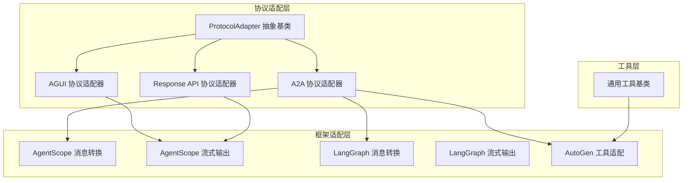
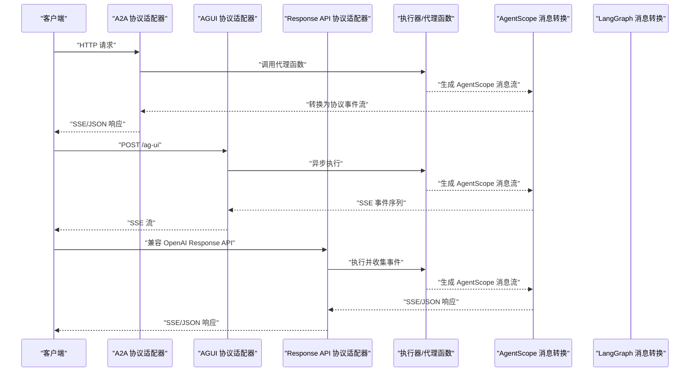
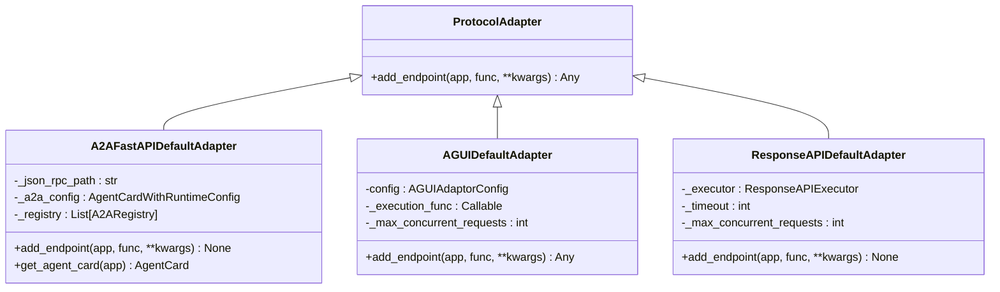
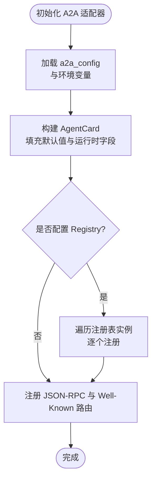
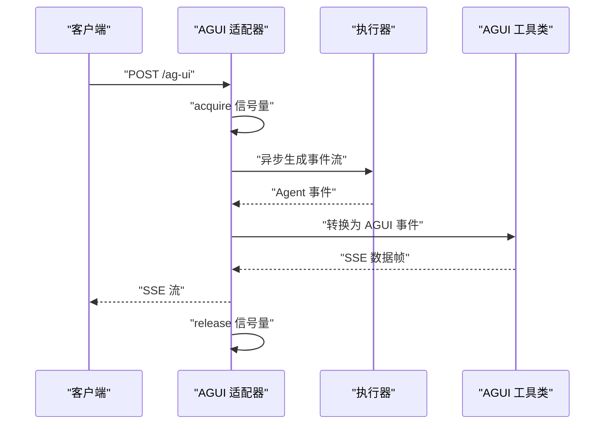
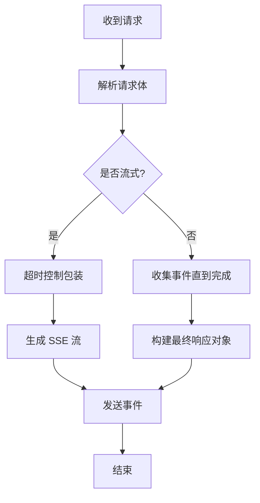
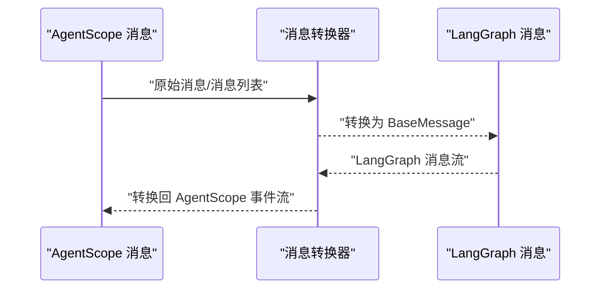
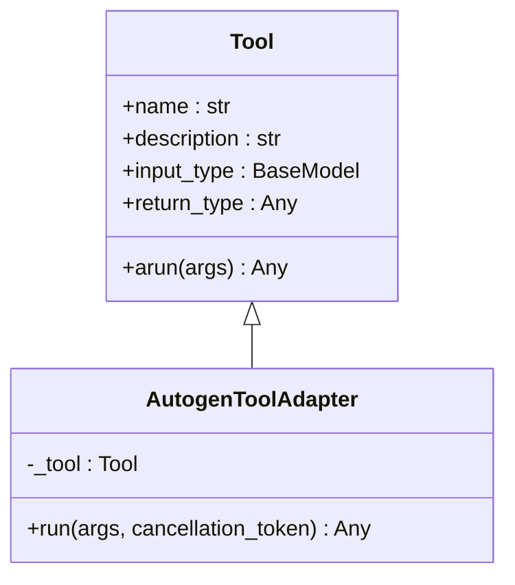
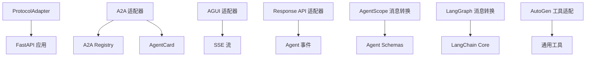

# 适配器架构设计

<cite>
**本文档引用的文件**
- [protocol_adapter.py](file://src/agentscope_runtime/engine/deployers/adapter/protocol_adapter.py)
- [a2a_protocol_adapter.py](file://src/agentscope_runtime/engine/deployers/adapter/a2a/a2a_protocol_adapter.py)
- [agui_protocol_adapter.py](file://src/agentscope_runtime/engine/deployers/adapter/agui/agui_protocol_adapter.py)
- [response_api_protocol_adapter.py](file://src/agentscope_runtime/engine/deployers/adapter/responses/response_api_protocol_adapter.py)
- [a2a_registry.py](file://src/agentscope_runtime/engine/deployers/adapter/a2a/a2a_registry.py)
- [message.py](file://src/agentscope_runtime/adapters/agentscope/message.py)
- [stream.py](file://src/agentscope_runtime/adapters/agentscope/stream.py)
- [message.py](file://src/agentscope_runtime/adapters/langgraph/message.py)
- [stream.py](file://src/agentscope_runtime/adapters/langgraph/stream.py)
- [tool.py](file://src/agentscope_runtime/adapters/autogen/tool/tool.py)
- [agent_schemas.py](file://src/agentscope_runtime/engine/schemas/agent_schemas.py)
</cite>

## 目录
1. [简介](#简介)
2. [项目结构](#项目结构)
3. [核心组件](#核心组件)
4. [架构总览](#架构总览)
5. [详细组件分析](#详细组件分析)
6. [依赖关系分析](#依赖关系分析)
7. [性能考虑](#性能考虑)
8. [故障排查指南](#故障排查指南)
9. [结论](#结论)
10. [附录](#附录)

## 简介
本文件系统性阐述适配器架构设计，聚焦于协议适配器的整体设计理念、适配器基类与扩展点、消息转换机制、工具调用处理流程、注册与配置管理、生命周期管理、跨框架兼容性与设计约束、接口标准与最佳实践。通过架构图与组件交互示例，帮助开发者快速理解并高效扩展多协议、多框架的智能体运行时。

## 项目结构
适配器体系主要分为三层：
- 协议适配层：面向不同协议（A2A、AGUI、Response API）的适配器实现，负责路由注册与请求处理。
- 框架适配层：面向不同AI框架（AgentScope、LangGraph、AutoGen）的消息转换与流式输出适配。
- 工具适配层：将通用工具封装为特定框架可用的工具类型。

**图表来源**
- [protocol_adapter.py:6-25](file://src/agentscope_runtime/engine/deployers/adapter/protocol_adapter.py#L6-L25)
- [a2a_protocol_adapter.py:136-258](file://src/agentscope_runtime/engine/deployers/adapter/a2a/a2a_protocol_adapter.py#L136-L258)
- [agui_protocol_adapter.py:91-226](file://src/agentscope_runtime/engine/deployers/adapter/agui/agui_protocol_adapter.py#L91-L226)
- [response_api_protocol_adapter.py:33-315](file://src/agentscope_runtime/engine/deployers/adapter/responses/response_api_protocol_adapter.py#L33-L315)
- [message.py:53-394](file://src/agentscope_runtime/adapters/agentscope/message.py#L53-L394)
- [stream.py:33-684](file://src/agentscope_runtime/adapters/agentscope/stream.py#L33-L684)
- [message.py:23-163](file://src/agentscope_runtime/adapters/langgraph/message.py#L23-L163)
- [stream.py:28-257](file://src/agentscope_runtime/adapters/langgraph/stream.py#L28-L257)
- [tool.py:28-212](file://src/agentscope_runtime/adapters/autogen/tool/tool.py#L28-L212)

**章节来源**
- [protocol_adapter.py:6-25](file://src/agentscope_runtime/engine/deployers/adapter/protocol_adapter.py#L6-L25)
- [a2a_protocol_adapter.py:136-258](file://src/agentscope_runtime/engine/deployers/adapter/a2a/a2a_protocol_adapter.py#L136-L258)
- [agui_protocol_adapter.py:91-226](file://src/agentscope_runtime/engine/deployers/adapter/agui/agui_protocol_adapter.py#L91-L226)
- [response_api_protocol_adapter.py:33-315](file://src/agentscope_runtime/engine/deployers/adapter/responses/response_api_protocol_adapter.py#L33-L315)

## 核心组件
- 协议适配器基类：定义统一的 add_endpoint 接口，要求子类实现协议特定的路由注册与请求处理逻辑。
- A2A 协议适配器：基于 FastAPI，提供 AgentCard 构建、Well-Known 端点、任务存储与执行、可选服务注册。
- AGUI 协议适配器：提供 SSE 流式响应，支持并发控制与错误处理。
- Response API 协议适配器：兼容 OpenAI Response API，支持流式与非流式响应，内置超时控制。
- 框架消息转换：AgentScope/LangGraph 双向消息转换，支持工具调用、推理、多媒体内容等。
- 工具适配：将通用工具封装为 AutoGen 工具类型，保持输入/输出模型一致。

**章节来源**
- [protocol_adapter.py:6-25](file://src/agentscope_runtime/engine/deployers/adapter/protocol_adapter.py#L6-L25)
- [a2a_protocol_adapter.py:136-498](file://src/agentscope_runtime/engine/deployers/adapter/a2a/a2a_protocol_adapter.py#L136-L498)
- [agui_protocol_adapter.py:91-226](file://src/agentscope_runtime/engine/deployers/adapter/agui/agui_protocol_adapter.py#L91-L226)
- [response_api_protocol_adapter.py:33-315](file://src/agentscope_runtime/engine/deployers/adapter/responses/response_api_protocol_adapter.py#L33-L315)
- [message.py:53-394](file://src/agentscope_runtime/adapters/agentscope/message.py#L53-L394)
- [stream.py:33-684](file://src/agentscope_runtime/adapters/agentscope/stream.py#L33-L684)
- [message.py:23-163](file://src/agentscope_runtime/adapters/langgraph/message.py#L23-L163)
- [stream.py:28-257](file://src/agentscope_runtime/adapters/langgraph/stream.py#L28-L257)
- [tool.py:28-212](file://src/agentscope_runtime/adapters/autogen/tool/tool.py#L28-L212)

## 架构总览
适配器采用“协议适配器 + 框架适配器 + 工具适配器”的分层设计，协议适配器负责对外暴露统一的 HTTP/SSE 接口；框架适配器负责在内部进行消息格式转换与流式输出；工具适配器负责将通用工具桥接到不同框架。

**图表来源**
- [a2a_protocol_adapter.py:222-258](file://src/agentscope_runtime/engine/deployers/adapter/a2a/a2a_protocol_adapter.py#L222-L258)
- [agui_protocol_adapter.py:212-226](file://src/agentscope_runtime/engine/deployers/adapter/agui/agui_protocol_adapter.py#L212-L226)
- [response_api_protocol_adapter.py:285-315](file://src/agentscope_runtime/engine/deployers/adapter/responses/response_api_protocol_adapter.py#L285-L315)
- [message.py:53-394](file://src/agentscope_runtime/adapters/agentscope/message.py#L53-L394)
- [stream.py:33-684](file://src/agentscope_runtime/adapters/agentscope/stream.py#L33-L684)

## 详细组件分析

### 协议适配器基类与扩展点
- 设计模式：抽象基类 + 多态实现，确保不同协议适配器遵循统一接口。
- 关键方法：add_endpoint(app, func, **kwargs)，由子类实现具体路由注册与请求处理。
- 扩展点：允许传入自定义参数（如路径、超时、并发限制等），便于协议定制。

**图表来源**
- [protocol_adapter.py:6-25](file://src/agentscope_runtime/engine/deployers/adapter/protocol_adapter.py#L6-L25)
- [a2a_protocol_adapter.py:136-498](file://src/agentscope_runtime/engine/deployers/adapter/a2a/a2a_protocol_adapter.py#L136-L498)
- [agui_protocol_adapter.py:91-226](file://src/agentscope_runtime/engine/deployers/adapter/agui/agui_protocol_adapter.py#L91-L226)
- [response_api_protocol_adapter.py:33-315](file://src/agentscope_runtime/engine/deployers/adapter/responses/response_api_protocol_adapter.py#L33-L315)

**章节来源**
- [protocol_adapter.py:6-25](file://src/agentscope_runtime/engine/deployers/adapter/protocol_adapter.py#L6-L25)
- [a2a_protocol_adapter.py:136-258](file://src/agentscope_runtime/engine/deployers/adapter/a2a/a2a_protocol_adapter.py#L136-L258)
- [agui_protocol_adapter.py:91-150](file://src/agentscope_runtime/engine/deployers/adapter/agui/agui_protocol_adapter.py#L91-L150)
- [response_api_protocol_adapter.py:33-80](file://src/agentscope_runtime/engine/deployers/adapter/responses/response_api_protocol_adapter.py#L33-L80)

### A2A 协议适配器
- 功能要点：
  - 构建 AgentCard：从配置中提取字段，自动推导 URL、版本、能力等。
  - 注册服务发现：可选地注册到多个 A2ARegistry 实例（如 Nacos）。
  - 路由注册：向 FastAPI 应用添加 JSON-RPC 与 Well-Known 端点。
  - 传输属性：根据运行时环境构建多传输配置。
- 配置管理：支持从 a2a_config 或环境变量注入 Registry；支持主机、端口、超时等运行时参数。
- 生命周期：初始化时完成配置解析与校验；add_endpoint 时注册路由与服务。

**图表来源**
- [a2a_protocol_adapter.py:55-91](file://src/agentscope_runtime/engine/deployers/adapter/a2a/a2a_protocol_adapter.py#L55-L91)
- [a2a_protocol_adapter.py:259-331](file://src/agentscope_runtime/engine/deployers/adapter/a2a/a2a_protocol_adapter.py#L259-L331)
- [a2a_protocol_adapter.py:222-258](file://src/agentscope_runtime/engine/deployers/adapter/a2a/a2a_protocol_adapter.py#L222-L258)

**章节来源**
- [a2a_protocol_adapter.py:55-91](file://src/agentscope_runtime/engine/deployers/adapter/a2a/a2a_protocol_adapter.py#L55-L91)
- [a2a_protocol_adapter.py:259-331](file://src/agentscope_runtime/engine/deployers/adapter/a2a/a2a_protocol_adapter.py#L259-L331)
- [a2a_protocol_adapter.py:222-258](file://src/agentscope_runtime/engine/deployers/adapter/a2a/a2a_protocol_adapter.py#L222-L258)
- [a2a_registry.py:45-77](file://src/agentscope_runtime/engine/deployers/adapter/a2a/a2a_registry.py#L45-L77)

### AGUI 协议适配器
- 功能要点：
  - 提供 /ag-ui 端点，接收 FlexibleRunAgentInput 并返回 SSE 流。
  - 使用信号量控制并发请求数量，避免过载。
  - 将 AGUI 事件转换为 SSE 数据帧，支持运行结束事件与错误事件。
- 错误处理：捕获异常并返回 HTTP 500，同时释放信号量保证资源回收。

**图表来源**
- [agui_protocol_adapter.py:108-146](file://src/agentscope_runtime/engine/deployers/adapter/agui/agui_protocol_adapter.py#L108-L146)
- [agui_protocol_adapter.py:155-199](file://src/agentscope_runtime/engine/deployers/adapter/agui/agui_protocol_adapter.py#L155-L199)
- [agui_protocol_adapter.py:212-226](file://src/agentscope_runtime/engine/deployers/adapter/agui/agui_protocol_adapter.py#L212-L226)

**章节来源**
- [agui_protocol_adapter.py:108-146](file://src/agentscope_runtime/engine/deployers/adapter/agui/agui_protocol_adapter.py#L108-L146)
- [agui_protocol_adapter.py:155-199](file://src/agentscope_runtime/engine/deployers/adapter/agui/agui_protocol_adapter.py#L155-L199)
- [agui_protocol_adapter.py:212-226](file://src/agentscope_runtime/engine/deployers/adapter/agui/agui_protocol_adapter.py#L212-L226)

### Response API 协议适配器
- 功能要点：
  - 兼容 OpenAI Response API 的请求格式，支持流式与非流式响应。
  - 内置超时控制，超时或异常时发送标准化失败事件。
  - 将 Agent 事件序列转换为 SSE 事件或最终 JSON 对象。
- 并发与超时：通过信号量限制并发请求；对流式响应设置超时保护。

**图表来源**
- [response_api_protocol_adapter.py:44-97](file://src/agentscope_runtime/engine/deployers/adapter/responses/response_api_protocol_adapter.py#L44-L97)
- [response_api_protocol_adapter.py:161-218](file://src/agentscope_runtime/engine/deployers/adapter/responses/response_api_protocol_adapter.py#L161-L218)
- [response_api_protocol_adapter.py:285-315](file://src/agentscope_runtime/engine/deployers/adapter/responses/response_api_protocol_adapter.py#L285-L315)

**章节来源**
- [response_api_protocol_adapter.py:44-97](file://src/agentscope_runtime/engine/deployers/adapter/responses/response_api_protocol_adapter.py#L44-L97)
- [response_api_protocol_adapter.py:161-218](file://src/agentscope_runtime/engine/deployers/adapter/responses/response_api_protocol_adapter.py#L161-L218)
- [response_api_protocol_adapter.py:285-315](file://src/agentscope_runtime/engine/deployers/adapter/responses/response_api_protocol_adapter.py#L285-L315)

### 框架消息转换与流式输出
- AgentScope 消息转换：
  - 支持多种内容块（文本、图像、音频、视频、文件、工具调用、推理等）。
  - 自动处理 Base64/URL 源，支持 MCP 工具调用结果转换。
  - 支持自定义类型转换器与按 original_id 分组合并消息。
- AgentScope 流式输出：
  - 将 AgentScope 消息流转换为增量内容（delta）与完成事件。
  - 支持工具调用、工具结果、推理消息的增量与完成状态。
  - 支持自定义类型转换器，扩展新的内容类型。
- LangGraph 消息转换：
  - 将 AgentScope 消息转换为 LangGraph 的 BaseMessage（Human/AI/System/Tool）。
  - 支持工具调用与工具结果的双向转换。
- LangGraph 流式输出：
  - 将 LangGraph 消息流转换为 AgentScope 事件流，处理工具调用分片与最后完成事件。

**图表来源**
- [message.py:53-394](file://src/agentscope_runtime/adapters/agentscope/message.py#L53-L394)
- [stream.py:33-684](file://src/agentscope_runtime/adapters/agentscope/stream.py#L33-L684)
- [message.py:23-163](file://src/agentscope_runtime/adapters/langgraph/message.py#L23-L163)
- [stream.py:28-257](file://src/agentscope_runtime/adapters/langgraph/stream.py#L28-L257)

**章节来源**
- [message.py:53-394](file://src/agentscope_runtime/adapters/agentscope/message.py#L53-L394)
- [stream.py:33-684](file://src/agentscope_runtime/adapters/agentscope/stream.py#L33-L684)
- [message.py:23-163](file://src/agentscope_runtime/adapters/langgraph/message.py#L23-L163)
- [stream.py:28-257](file://src/agentscope_runtime/adapters/langgraph/stream.py#L28-L257)

### 工具调用处理流程（AutoGen）
- 将通用工具封装为 AutoGen 工具类型，保持输入/输出模型一致。
- 运行时将工具结果序列化为字符串，便于框架间传递。
- 支持批量创建工具适配器，简化集成。

**图表来源**
- [tool.py:28-212](file://src/agentscope_runtime/adapters/autogen/tool/tool.py#L28-L212)

**章节来源**
- [tool.py:28-212](file://src/agentscope_runtime/adapters/autogen/tool/tool.py#L28-L212)

### 注册机制与配置管理
- A2A Registry 抽象：定义注册名称与注册接口，实现可插拔的服务发现。
- 配置优先级：
  - a2a_config.registry 显式指定最高优先级；
  - 未指定时可从环境变量自动创建（如 Nacos）；
  - deploy 方法传入的 protocol_adapters 会覆盖已配置的适配器。
- 生命周期：
  - 初始化阶段完成配置解析与校验；
  - 启动阶段注册路由与服务；
  - 异常处理：注册失败不阻断启动，仅记录警告日志。

**章节来源**
- [a2a_registry.py:45-77](file://src/agentscope_runtime/engine/deployers/adapter/a2a/a2a_registry.py#L45-L77)
- [a2a_protocol_adapter.py:55-91](file://src/agentscope_runtime/engine/deployers/adapter/a2a/a2a_protocol_adapter.py#L55-L91)
- [a2a_protocol_adapter.py:259-299](file://src/agentscope_runtime/engine/deployers/adapter/a2a/a2a_protocol_adapter.py#L259-L299)

## 依赖关系分析
- 协议适配器依赖 FastAPI 应用实例进行路由注册。
- 框架适配器依赖 AgentScope/LangGraph 的消息模型与事件流。
- 工具适配器依赖通用工具基类与 AutoGen 的工具接口。
- A2A 适配器可选依赖 A2A Registry 与 Nacos SDK。

**图表来源**
- [protocol_adapter.py:6-25](file://src/agentscope_runtime/engine/deployers/adapter/protocol_adapter.py#L6-L25)
- [a2a_protocol_adapter.py:136-258](file://src/agentscope_runtime/engine/deployers/adapter/a2a/a2a_protocol_adapter.py#L136-L258)
- [agui_protocol_adapter.py:91-226](file://src/agentscope_runtime/engine/deployers/adapter/agui/agui_protocol_adapter.py#L91-L226)
- [response_api_protocol_adapter.py:33-315](file://src/agentscope_runtime/engine/deployers/adapter/responses/response_api_protocol_adapter.py#L33-L315)
- [message.py:53-394](file://src/agentscope_runtime/adapters/agentscope/message.py#L53-L394)
- [message.py:23-163](file://src/agentscope_runtime/adapters/langgraph/message.py#L23-L163)
- [tool.py:28-212](file://src/agentscope_runtime/adapters/autogen/tool/tool.py#L28-L212)
- [agent_schemas.py:18-80](file://src/agentscope_runtime/engine/schemas/agent_schemas.py#L18-L80)

**章节来源**
- [protocol_adapter.py:6-25](file://src/agentscope_runtime/engine/deployers/adapter/protocol_adapter.py#L6-L25)
- [a2a_protocol_adapter.py:136-258](file://src/agentscope_runtime/engine/deployers/adapter/a2a/a2a_protocol_adapter.py#L136-L258)
- [agui_protocol_adapter.py:91-226](file://src/agentscope_runtime/engine/deployers/adapter/agui/agui_protocol_adapter.py#L91-L226)
- [response_api_protocol_adapter.py:33-315](file://src/agentscope_runtime/engine/deployers/adapter/responses/response_api_protocol_adapter.py#L33-L315)
- [message.py:53-394](file://src/agentscope_runtime/adapters/agentscope/message.py#L53-L394)
- [message.py:23-163](file://src/agentscope_runtime/adapters/langgraph/message.py#L23-L163)
- [tool.py:28-212](file://src/agentscope_runtime/adapters/autogen/tool/tool.py#L28-L212)
- [agent_schemas.py:18-80](file://src/agentscope_runtime/engine/schemas/agent_schemas.py#L18-L80)

## 性能考虑
- 并发控制：AGUI 与 Response API 适配器均使用信号量限制并发请求，避免资源争用。
- 超时保护：Response API 适配器对流式响应设置超时，防止长时间占用连接。
- 流式输出：AgentScope/LangGraph 流式适配器按增量内容推送，降低内存峰值。
- 资源回收：异常路径释放信号量，确保资源及时回收。
- 日志级别：框架适配器默认降低日志级别，减少开销。

**章节来源**
- [agui_protocol_adapter.py:108-146](file://src/agentscope_runtime/engine/deployers/adapter/agui/agui_protocol_adapter.py#L108-L146)
- [response_api_protocol_adapter.py:161-218](file://src/agentscope_runtime/engine/deployers/adapter/responses/response_api_protocol_adapter.py#L161-L218)
- [stream.py:33-684](file://src/agentscope_runtime/adapters/agentscope/stream.py#L33-L684)

## 故障排查指南
- A2A 注册失败：检查 Registry 配置与网络连通性；查看日志中的警告信息；确认 A2A 配置优先级。
- AGUI SSE 异常：确认请求体格式正确；检查信号量是否被异常释放；关注 HTTP 500 错误与堆栈信息。
- Response API 超时：调整超时参数；检查后端执行耗时；确认事件流是否正常产生。
- 消息转换错误：核对消息类型与内容结构；检查自定义类型转换器返回值；验证内容块来源（Base64/URL）。
- 工具适配异常：确认工具输入/输出模型匹配；检查工具 arun 返回值序列化；查看 AutoGen 工具接口兼容性。

**章节来源**
- [a2a_protocol_adapter.py:259-299](file://src/agentscope_runtime/engine/deployers/adapter/a2a/a2a_protocol_adapter.py#L259-L299)
- [agui_protocol_adapter.py:135-145](file://src/agentscope_runtime/engine/deployers/adapter/agui/agui_protocol_adapter.py#L135-L145)
- [response_api_protocol_adapter.py:182-218](file://src/agentscope_runtime/engine/deployers/adapter/responses/response_api_protocol_adapter.py#L182-L218)
- [message.py:53-394](file://src/agentscope_runtime/adapters/agentscope/message.py#L53-L394)
- [tool.py:133-138](file://src/agentscope_runtime/adapters/autogen/tool/tool.py#L133-L138)

## 结论
该适配器架构以协议适配器为核心，向上提供统一的外部接口，向下通过框架与工具适配器实现多协议、多框架的无缝集成。通过清晰的扩展点、完善的配置与注册机制、严格的生命周期管理与错误处理，以及针对性能的优化策略，能够满足复杂场景下的部署与运维需求。建议在实际项目中遵循接口规范与最佳实践，结合业务特性选择合适的适配器组合。

## 附录
- 接口标准与扩展点
  - 协议适配器：统一的 add_endpoint 接口，支持自定义参数与并发控制。
  - 框架适配器：消息转换与流式输出接口，支持自定义类型转换器。
  - 工具适配器：输入/输出模型与框架工具接口一致，支持批量创建。
- 跨框架兼容性
  - AgentScope：统一消息模型与事件流，支持多媒体与工具调用。
  - LangGraph：与 BaseMessage 互转，支持工具调用分片与完成事件。
  - AutoGen：工具适配器桥接通用工具，保持输入/输出模型一致。
- 最佳实践
  - 明确配置优先级，合理使用环境变量与显式配置。
  - 控制并发与超时，保障系统稳定性。
  - 使用自定义类型转换器扩展内容类型，保持向后兼容。
  - 在异常路径确保资源回收与日志记录，便于问题定位。