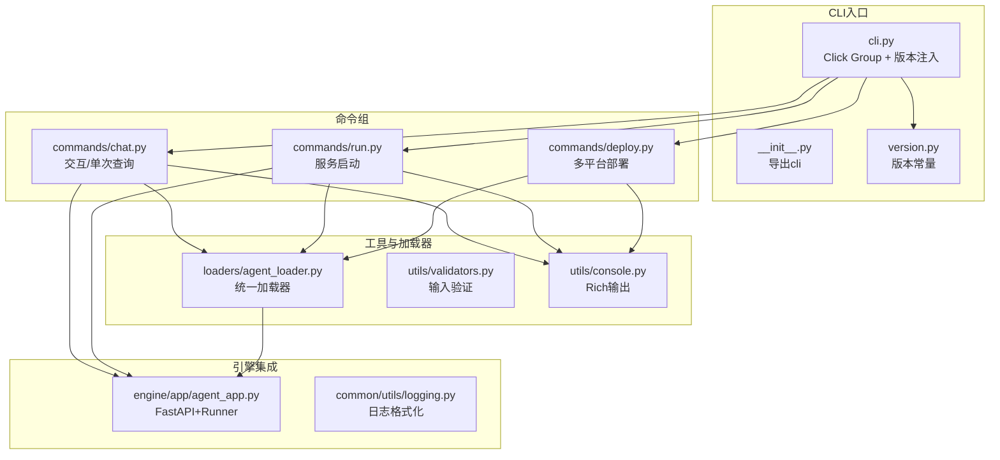
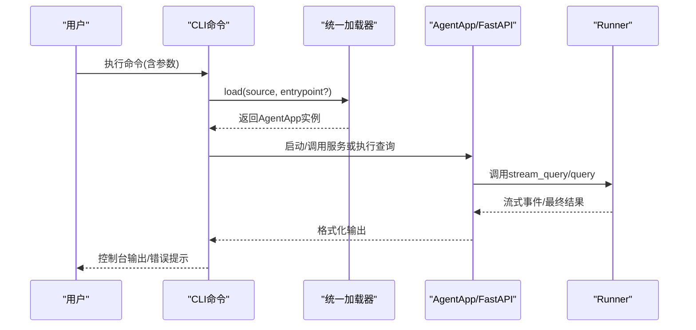
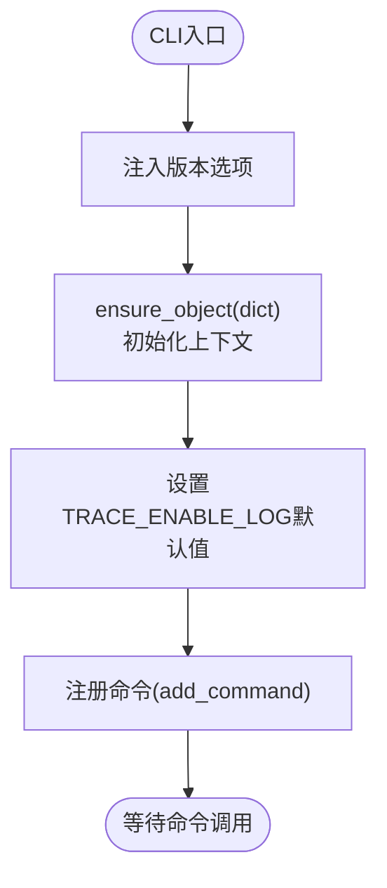
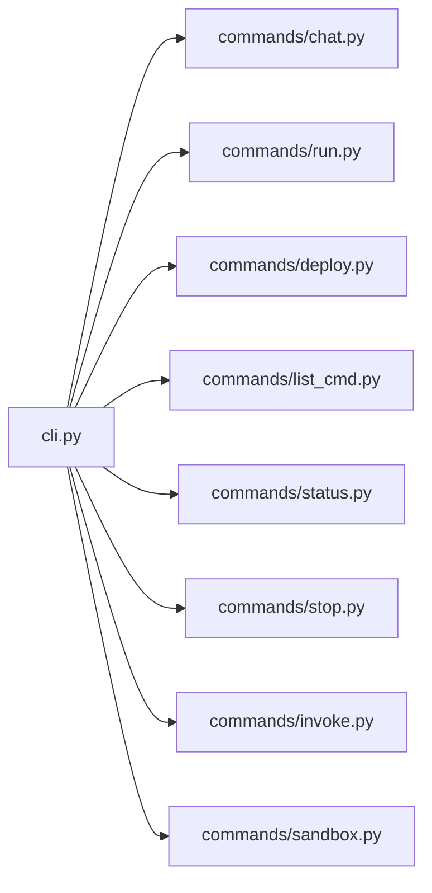
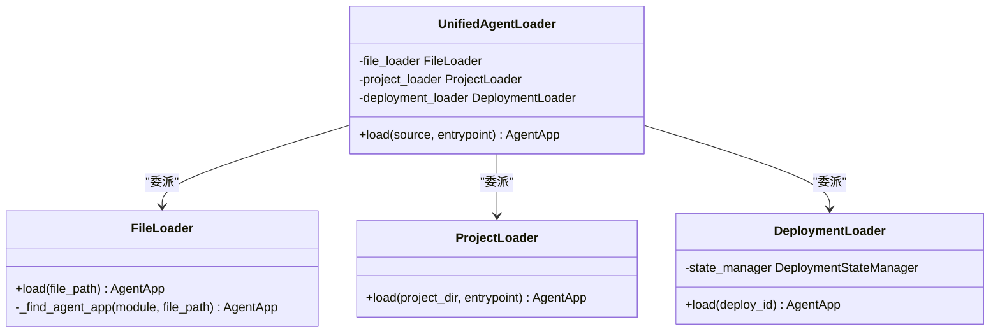
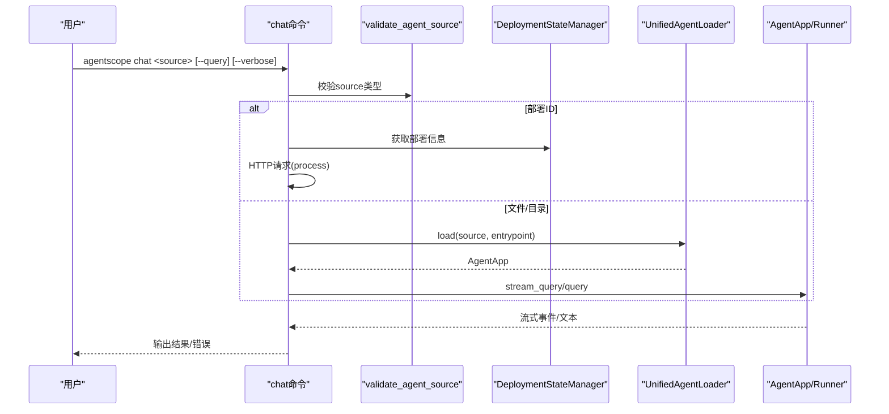
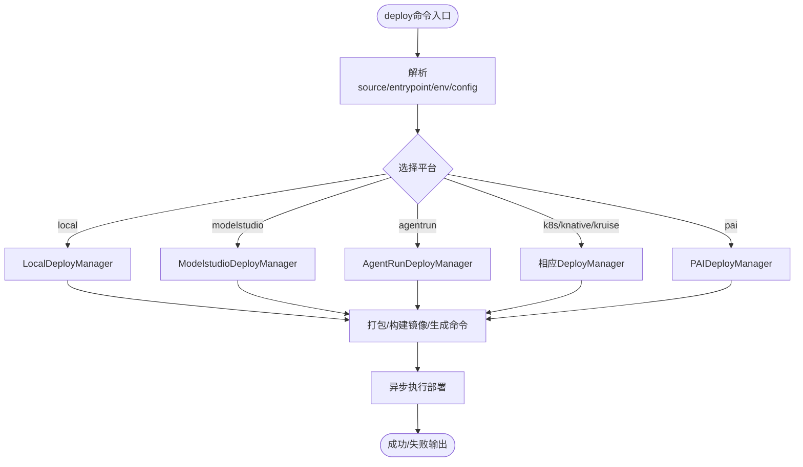
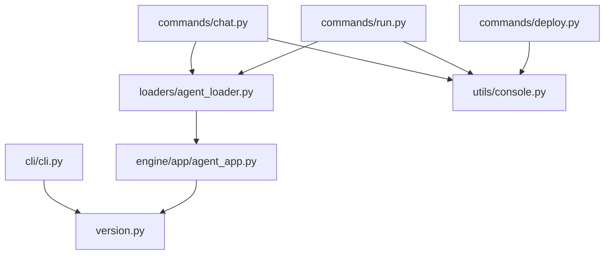

# CLI架构设计

<cite>
**本文档引用的文件**
- [cli.py](file://src/agentscope_runtime/cli/cli.py)
- [__init__.py](file://src/agentscope_runtime/cli/__init__.py)
- [version.py](file://src/agentscope_runtime/version.py)
- [chat.py](file://src/agentscope_runtime/cli/commands/chat.py)
- [run.py](file://src/agentscope_runtime/cli/commands/run.py)
- [deploy.py](file://src/agentscope_runtime/cli/commands/deploy.py)
- [agent_loader.py](file://src/agentscope_runtime/cli/loaders/agent_loader.py)
- [console.py](file://src/agentscope_runtime/cli/utils/console.py)
- [validators.py](file://src/agentscope_runtime/cli/utils/validators.py)
- [agent_app.py](file://src/agentscope_runtime/engine/app/agent_app.py)
- [logging.py](file://src/agentscope_runtime/common/utils/logging.py)
</cite>

## 目录
1. [简介](#简介)
2. [项目结构](#项目结构)
3. [核心组件](#核心组件)
4. [架构总览](#架构总览)
5. [详细组件分析](#详细组件分析)
6. [依赖关系分析](#依赖关系分析)
7. [性能考量](#性能考量)
8. [故障排查指南](#故障排查指南)
9. [结论](#结论)
10. [附录](#附录)

## 简介
本文件面向AgentScope Runtime CLI的架构设计，系统性阐述其基于Click框架的命令体系、命令注册机制与上下文管理；详述CLI初始化流程、版本控制与环境变量策略；解释命令分组与模块化设计原则；记录错误处理、日志系统与调试能力；最后总结扩展性与可维护性的设计要点及最佳实践。

## 项目结构
AgentScope CLI采用“分层+模块化”的组织方式：
- 核心入口：在主入口中定义Click Group并注册所有命令，统一注入版本信息与全局上下文。
- 命令分组：commands目录按功能划分命令（如chat、run、deploy等），每个命令独立实现参数解析、业务逻辑与输出。
- 工具与加载器：loaders负责从文件/目录/部署ID加载AgentApp；utils提供验证、输出格式化等通用能力。
- 引擎集成：命令通过AgentApp与引擎交互，支持本地运行、HTTP流式响应与多协议适配。

**图表来源**
- [cli.py:10-54](file://src/agentscope_runtime/cli/cli.py#L10-L54)
- [__init__.py:1-8](file://src/agentscope_runtime/cli/__init__.py#L1-L8)
- [version.py:1-3](file://src/agentscope_runtime/version.py#L1-L3)
- [chat.py:1-120](file://src/agentscope_runtime/cli/commands/chat.py#L1-L120)
- [run.py:1-120](file://src/agentscope_runtime/cli/commands/run.py#L1-L120)
- [deploy.py:1-120](file://src/agentscope_runtime/cli/commands/deploy.py#L1-L120)
- [agent_loader.py:1-120](file://src/agentscope_runtime/cli/loaders/agent_loader.py#L1-L120)
- [console.py:1-120](file://src/agentscope_runtime/cli/utils/console.py#L1-L120)
- [agent_app.py:1-120](file://src/agentscope_runtime/engine/app/agent_app.py#L1-L120)
- [logging.py:1-45](file://src/agentscope_runtime/common/utils/logging.py#L1-L45)

**章节来源**
- [cli.py:10-54](file://src/agentscope_runtime/cli/cli.py#L10-L54)
- [__init__.py:1-8](file://src/agentscope_runtime/cli/__init__.py#L1-L8)
- [version.py:1-3](file://src/agentscope_runtime/version.py#L1-L3)

## 核心组件
- Click Group与版本注入：在CLI入口定义Click Group，统一注入版本选项与全局上下文对象，确保各命令共享配置与状态。
- 命令注册：通过add_command集中注册各命令，保持注册表清晰、便于扩展。
- 统一加载器：UnifiedAgentLoader封装文件/目录/部署ID三种源的加载逻辑，屏蔽上层差异。
- 输出与验证：console模块提供Rich风格输出；validators提供输入校验与部署ID存在性检查。
- 引擎集成：AgentApp作为FastAPI应用承载Runner，提供流式SSE响应与多协议适配。

**章节来源**
- [cli.py:30-54](file://src/agentscope_runtime/cli/cli.py#L30-L54)
- [agent_loader.py:238-296](file://src/agentscope_runtime/cli/loaders/agent_loader.py#L238-L296)
- [console.py:78-185](file://src/agentscope_runtime/cli/utils/console.py#L78-L185)
- [validators.py:13-54](file://src/agentscope_runtime/cli/utils/validators.py#L13-L54)
- [agent_app.py:60-220](file://src/agentscope_runtime/engine/app/agent_app.py#L60-L220)

## 架构总览
CLI采用“命令驱动 + 加载器 + 引擎”三层架构：
- 命令层：解析参数、执行业务逻辑、调用加载器与引擎。
- 加载器层：抽象不同源类型，统一返回AgentApp实例。
- 引擎层：提供HTTP服务、流式响应、生命周期管理与中断控制。

**图表来源**
- [chat.py:125-247](file://src/agentscope_runtime/cli/commands/chat.py#L125-L247)
- [run.py:110-173](file://src/agentscope_runtime/cli/commands/run.py#L110-L173)
- [agent_loader.py:251-296](file://src/agentscope_runtime/cli/loaders/agent_loader.py#L251-L296)
- [agent_app.py:781-800](file://src/agentscope_runtime/engine/app/agent_app.py#L781-L800)

## 详细组件分析

### CLI入口与上下文管理
- 全局版本：通过version_option注入版本信息，prog_name标识程序名。
- 上下文对象：ensure_object(dict)保证ctx为字典，便于命令间共享状态。
- 环境变量默认值：在导入运行时模块前设置TRACE_ENABLE_LOG默认值，避免后续模块读取到空值。

**图表来源**
- [cli.py:30-54](file://src/agentscope_runtime/cli/cli.py#L30-L54)
- [version.py:1-3](file://src/agentscope_runtime/version.py#L1-L3)

**章节来源**
- [cli.py:23-27](file://src/agentscope_runtime/cli/cli.py#L23-L27)
- [cli.py:41-42](file://src/agentscope_runtime/cli/cli.py#L41-L42)

### 命令注册机制
- 命令导入：在入口文件中集中导入各命令模块。
- 注册方式：使用cli.add_command逐一注册，形成统一的命令树。
- 可扩展性：新增命令仅需在commands目录添加文件并在入口导入与注册。

**图表来源**
- [cli.py:10-54](file://src/agentscope_runtime/cli/cli.py#L10-L54)

**章节来源**
- [cli.py:45-54](file://src/agentscope_runtime/cli/cli.py#L45-L54)

### 统一加载器设计
- 多源支持：FileLoader、ProjectLoader、DeploymentLoader分别处理文件、目录与部署ID。
- 统一接口：UnifiedAgentLoader根据源类型委派至对应加载器，屏蔽差异。
- 错误处理：集中抛出AgentLoadError，便于上层捕获与提示。

**图表来源**
- [agent_loader.py:238-296](file://src/agentscope_runtime/cli/loaders/agent_loader.py#L238-L296)
- [agent_loader.py:28-143](file://src/agentscope_runtime/cli/loaders/agent_loader.py#L28-L143)
- [agent_loader.py:145-193](file://src/agentscope_runtime/cli/loaders/agent_loader.py#L145-L193)
- [agent_loader.py:195-236](file://src/agentscope_runtime/cli/loaders/agent_loader.py#L195-L236)

**章节来源**
- [agent_loader.py:238-296](file://src/agentscope_runtime/cli/loaders/agent_loader.py#L238-L296)

### chat命令：交互与单次查询
- 源类型判定：优先识别部署ID，否则按文件/目录加载。
- 交互模式：支持REPL式对话，信号处理与异常捕获完善。
- 单次查询：支持一次性请求，支持HTTP与本地两种路径。
- 日志与追踪：根据verbose切换TRACE_ENABLE_LOG与根日志级别。

**图表来源**
- [chat.py:125-247](file://src/agentscope_runtime/cli/commands/chat.py#L125-L247)
- [chat.py:517-800](file://src/agentscope_runtime/cli/commands/chat.py#L517-L800)
- [validators.py:13-54](file://src/agentscope_runtime/cli/utils/validators.py#L13-L54)

**章节来源**
- [chat.py:76-124](file://src/agentscope_runtime/cli/commands/chat.py#L76-L124)
- [chat.py:125-247](file://src/agentscope_runtime/cli/commands/chat.py#L125-L247)

### run命令：服务启动
- 参数：host/port/verbose/entrypoint。
- 行为：加载AgentApp并启动HTTP服务，支持Ctrl+C优雅退出。
- 日志：verbose控制日志级别与TRACE_ENABLE_LOG。

**章节来源**
- [run.py:55-173](file://src/agentscope_runtime/cli/commands/run.py#L55-L173)

### deploy命令：多平台部署
- 平台：local、modelstudio、agentrun、k8s、knative、kruise、pai等。
- 配置：支持配置文件与CLI参数合并，环境变量可来自.env与--env。
- 入口点：支持目录自动探测或显式指定entrypoint。
- 错误处理：失败时打印错误并退出，必要时打印堆栈。

**图表来源**
- [deploy.py:301-446](file://src/agentscope_runtime/cli/commands/deploy.py#L301-L446)
- [deploy.py:448-595](file://src/agentscope_runtime/cli/commands/deploy.py#L448-L595)
- [deploy.py:597-767](file://src/agentscope_runtime/cli/commands/deploy.py#L597-L767)

**章节来源**
- [deploy.py:301-446](file://src/agentscope_runtime/cli/commands/deploy.py#L301-L446)
- [deploy.py:448-595](file://src/agentscope_runtime/cli/commands/deploy.py#L448-L595)
- [deploy.py:597-767](file://src/agentscope_runtime/cli/commands/deploy.py#L597-L767)

### 输出与日志系统
- Rich输出：console模块提供统一的成功/错误/警告/信息输出，支持跨平台终端美化。
- 表格与JSON：提供表格渲染与JSON高亮输出，便于调试与展示。
- 日志格式化：logging模块提供带颜色与相对路径的日志格式化器，便于开发调试。

**章节来源**
- [console.py:78-379](file://src/agentscope_runtime/cli/utils/console.py#L78-L379)
- [logging.py:6-45](file://src/agentscope_runtime/common/utils/logging.py#L6-L45)

### 输入验证与错误处理
- 验证器：validators提供源类型判断、端口、平台、文件/目录、URL、部署ID等校验。
- 错误处理：命令内捕获KeyboardInterrupt与通用异常，结合console输出与traceback控制台打印。

**章节来源**
- [validators.py:13-119](file://src/agentscope_runtime/cli/utils/validators.py#L13-L119)
- [chat.py:238-247](file://src/agentscope_runtime/cli/commands/chat.py#L238-L247)
- [run.py:164-173](file://src/agentscope_runtime/cli/commands/run.py#L164-L173)

## 依赖关系分析
- 命令到加载器：chat、run命令均依赖UnifiedAgentLoader进行源加载。
- 加载器到引擎：AgentLoader返回AgentApp，后者继承FastAPI并集成Runner。
- 输出到第三方：console依赖Rich；日志依赖标准库logging。
- 版本到引擎：version.py提供版本号，AgentApp在OpenAPI中注入版本信息。

**图表来源**
- [chat.py:200-207](file://src/agentscope_runtime/cli/commands/chat.py#L200-L207)
- [run.py:133-140](file://src/agentscope_runtime/cli/commands/run.py#L133-L140)
- [agent_loader.py:251-296](file://src/agentscope_runtime/cli/loaders/agent_loader.py#L251-L296)
- [agent_app.py:68-106](file://src/agentscope_runtime/engine/app/agent_app.py#L68-L106)
- [console.py:1-120](file://src/agentscope_runtime/cli/utils/console.py#L1-L120)
- [cli.py:21](file://src/agentscope_runtime/cli/cli.py#L21)
- [version.py:1-3](file://src/agentscope_runtime/version.py#L1-L3)

**章节来源**
- [cli.py:10-21](file://src/agentscope_runtime/cli/cli.py#L10-L21)
- [agent_app.py:154-162](file://src/agentscope_runtime/engine/app/agent_app.py#L154-L162)

## 性能考量
- 流式响应：AgentApp通过SSE向客户端推送增量内容，降低延迟与内存占用。
- 生命周期管理：统一的lifespan管理Runner与中间件，减少重复初始化成本。
- 并发任务清理：定时清理过期任务，避免资源泄漏。
- 本地运行优化：run命令直接启动服务，避免额外网络开销。

[本节为通用性能讨论，无需特定文件分析]

## 故障排查指南
- 常见问题定位
  - 源路径错误：使用validators.validate_agent_source进行源类型校验。
  - 端口冲突：使用validators.validate_port校验端口范围。
  - 部署ID不存在：通过DeploymentStateManager.exists确认部署ID有效性。
- 输出与日志
  - 使用console模块的echo_error/echo_warning提升可读性。
  - verbose模式下开启TRACE_ENABLE_LOG与DEBUG级别日志，便于定位问题。
- 异常处理
  - chat/run命令对KeyboardInterrupt与通用异常进行捕获与友好提示。
  - deploy命令在失败时打印错误并可选打印堆栈，便于快速定位。

**章节来源**
- [validators.py:56-119](file://src/agentscope_runtime/cli/utils/validators.py#L56-L119)
- [chat.py:238-247](file://src/agentscope_runtime/cli/commands/chat.py#L238-L247)
- [run.py:164-173](file://src/agentscope_runtime/cli/commands/run.py#L164-L173)
- [deploy.py:440-446](file://src/agentscope_runtime/cli/commands/deploy.py#L440-L446)

## 结论
AgentScope CLI以Click为核心，采用模块化命令分组与统一加载器，实现了从源码到部署的全链路管理。通过Rich输出与日志系统提升可观测性，借助AgentApp的流式响应与生命周期管理保障性能与稳定性。整体设计具备良好的扩展性与可维护性，适合持续演进与团队协作。

## 附录
- 最佳实践
  - 新增命令：在commands目录新增文件并在入口注册，遵循现有参数与输出风格。
  - 错误处理：统一使用console输出与异常捕获，避免裸异常传播。
  - 配置管理：优先使用配置文件，CLI参数作为覆盖，保持一致性。
  - 日志规范：在verbose模式下启用详细日志，生产环境保持适度日志级别。
- 设计模式
  - 统一加载器：策略模式封装不同源的加载策略。
  - 生命周期管理：模板方法与上下文管理器组合，确保资源正确释放。
  - 命令注册：工厂+注册表模式，便于扩展与测试。