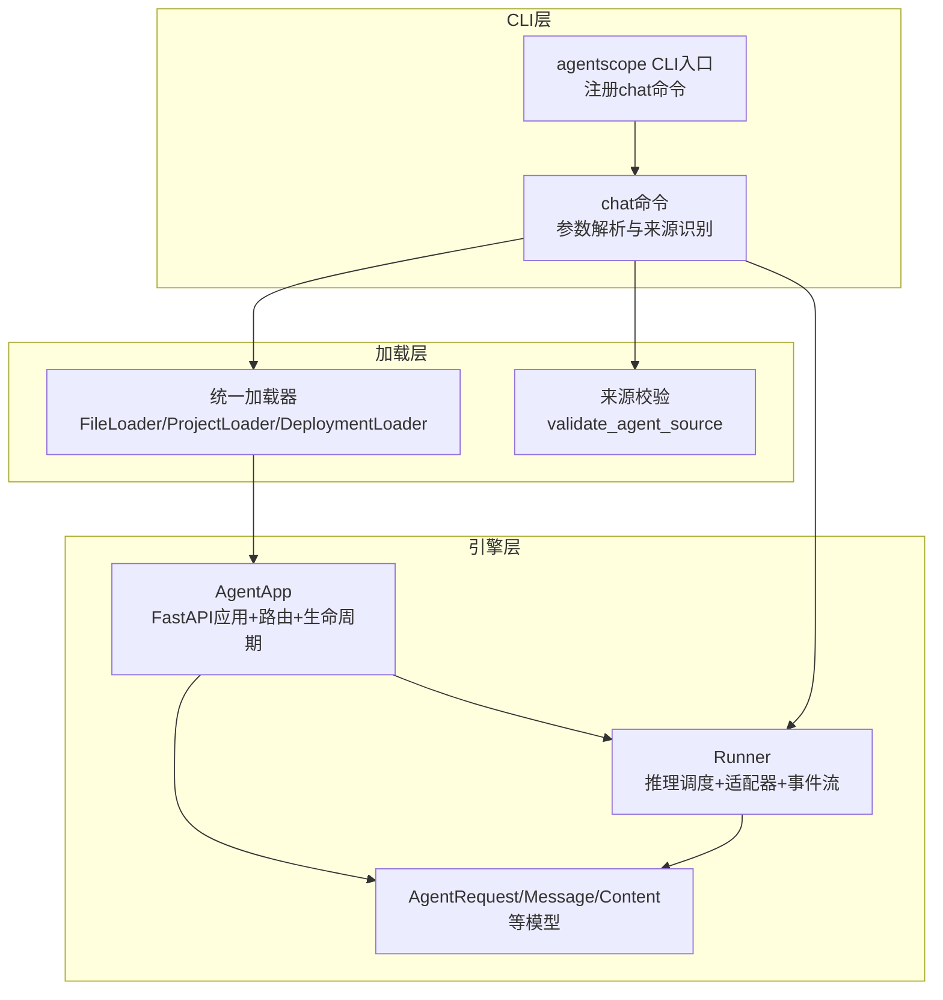
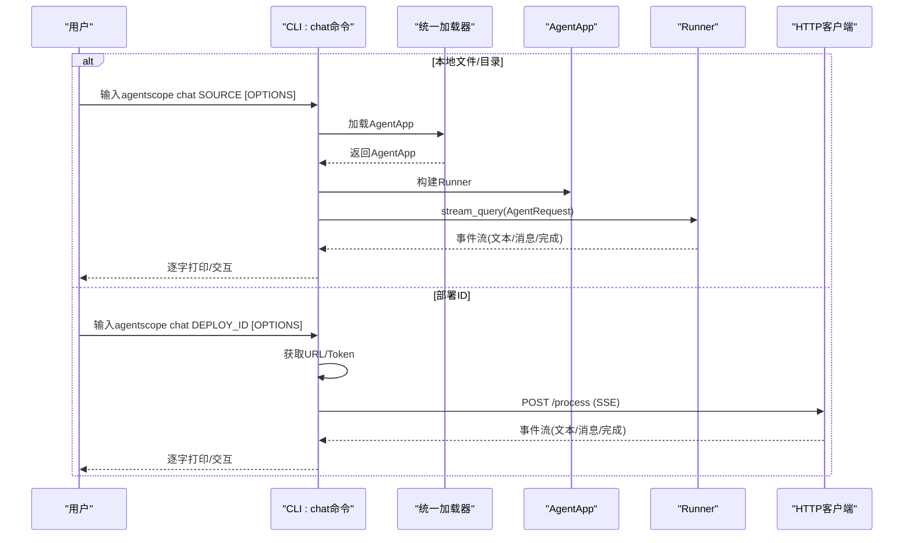
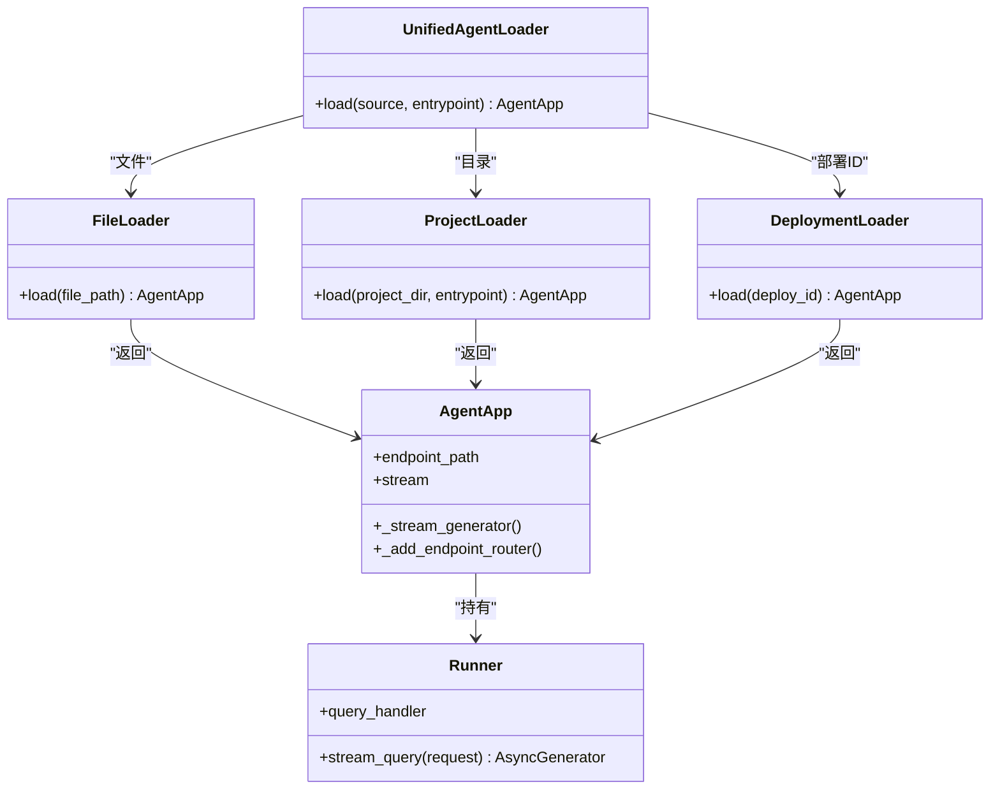
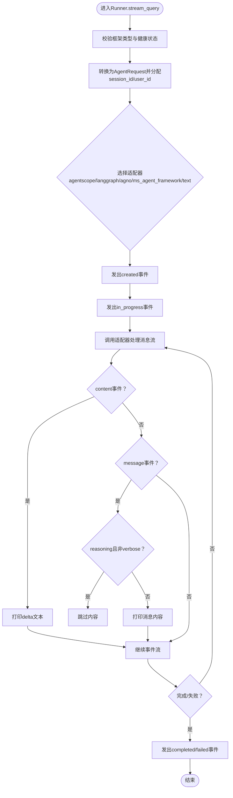
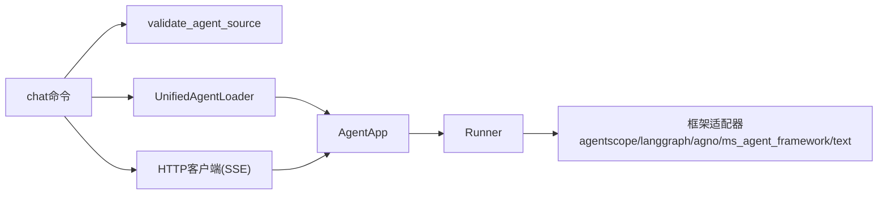

# chat聊天命令

<cite>
**本文档引用的文件**
- [chat.py](file://src/agentscope_runtime/cli/commands/chat.py)
- [cli.py](file://src/agentscope_runtime/cli/cli.py)
- [agent_app.py](file://src/agentscope_runtime/engine/app/agent_app.py)
- [runner.py](file://src/agentscope_runtime/engine/runner.py)
- [agent_schemas.py](file://src/agentscope_runtime/engine/schemas/agent_schemas.py)
- [agent_loader.py](file://src/agentscope_runtime/cli/loaders/agent_loader.py)
- [cli.md](file://cookbook/zh/cli.md)
- [test_agent_app.py](file://tests/integrated/test_agent_app.py)
</cite>

## 目录
1. [简介](#简介)
2. [项目结构](#项目结构)
3. [核心组件](#核心组件)
4. [架构总览](#架构总览)
5. [详细组件分析](#详细组件分析)
6. [依赖关系分析](#依赖关系分析)
7. [性能考量](#性能考量)
8. [故障排查指南](#故障排查指南)
9. [结论](#结论)
10. [附录](#附录)

## 简介
chat聊天命令是AgentScope Runtime提供的CLI子命令，用于在开发阶段以交互式或多轮对话的方式运行智能体，或执行单次查询进行快速验证。该命令支持三种来源：
- 本地Python文件（agent.py）
- 本地项目目录（自动解析入口文件）
- 已部署的服务（通过部署ID）

chat命令同时支持两种运行模式：
- 交互式模式：持续对话，适合调试和体验
- 单次查询模式：执行一次输入后退出，适合脚本化调用

此外，chat命令还内置了对“推理消息”（reasoning）的过滤逻辑，配合verbose开关控制是否显示推理细节，便于开发者在不同粒度下观察智能体内部思考过程。

## 项目结构
chat命令位于CLI层，负责参数解析、来源识别、加载AgentApp、以及与Runner交互；AgentApp与Runner共同构成后端推理与流式输出的核心。

图表来源
- [cli.py:45-54](file://src/agentscope_runtime/cli/cli.py#L45-L54)
- [chat.py:44-109](file://src/agentscope_runtime/cli/commands/chat.py#L44-L109)
- [agent_loader.py:238-296](file://src/agentscope_runtime/cli/loaders/agent_loader.py#L238-L296)
- [agent_app.py:60-220](file://src/agentscope_runtime/engine/app/agent_app.py#L60-L220)
- [runner.py:46-120](file://src/agentscope_runtime/engine/runner.py#L46-L120)
- [agent_schemas.py:751-800](file://src/agentscope_runtime/engine/schemas/agent_schemas.py#L751-L800)

章节来源
- [cli.py:45-54](file://src/agentscope_runtime/cli/cli.py#L45-L54)
- [chat.py:44-109](file://src/agentscope_runtime/cli/commands/chat.py#L44-L109)
- [agent_loader.py:238-296](file://src/agentscope_runtime/cli/loaders/agent_loader.py#L238-L296)

## 核心组件
- CLI入口与命令注册：CLI入口负责注册chat命令，并设置全局环境变量（如TRACE_ENABLE_LOG）。
- chat命令：解析参数、识别来源类型（文件/目录/部署ID）、选择本地加载或HTTP调用、控制交互/单次模式、处理verbose输出与推理消息过滤。
- 统一加载器：根据来源类型委派到FileLoader、ProjectLoader或DeploymentLoader，最终返回AgentApp实例。
- AgentApp：基于FastAPI的应用，内置路由、协议适配器、中断服务、任务清理等能力，提供/process端点及SSE流式输出。
- Runner：推理调度器，负责将不同框架的消息流适配为统一事件流，支持多框架（agentscope、langgraph、agno、ms_agent_framework等）。
- 数据模型：AgentRequest、Message、Content等，定义请求与响应的数据结构，支持文本、图片、音频、工具调用等多种内容类型。

章节来源
- [cli.py:23-28](file://src/agentscope_runtime/cli/cli.py#L23-L28)
- [chat.py:44-109](file://src/agentscope_runtime/cli/commands/chat.py#L44-L109)
- [agent_loader.py:238-296](file://src/agentscope_runtime/cli/loaders/agent_loader.py#L238-L296)
- [agent_app.py:60-220](file://src/agentscope_runtime/engine/app/agent_app.py#L60-L220)
- [runner.py:46-120](file://src/agentscope_runtime/engine/runner.py#L46-L120)
- [agent_schemas.py:751-800](file://src/agentscope_runtime/engine/schemas/agent_schemas.py#L751-L800)

## 架构总览
chat命令的执行路径分为两条主线：
- 本地模式：通过UnifiedAgentLoader加载AgentApp，构建Runner，直接调用Runner.stream_query进行流式推理。
- 部署模式：通过部署元数据获取服务URL与Token，向/process端点发起POST请求，使用SSE接收流式事件。

图表来源
- [chat.py:125-246](file://src/agentscope_runtime/cli/commands/chat.py#L125-L246)
- [agent_loader.py:238-296](file://src/agentscope_runtime/cli/loaders/agent_loader.py#L238-L296)
- [agent_app.py:781-800](file://src/agentscope_runtime/engine/app/agent_app.py#L781-L800)
- [runner.py:193-356](file://src/agentscope_runtime/engine/runner.py#L193-L356)

## 详细组件分析

### chat命令参数与行为
- 参数与选项
  - SOURCE：必填，支持Python文件路径、项目目录或部署ID。
  - --query/-q：单次查询模式，提供后立即退出。
  - --session-id：会话ID，用于对话连续性；未提供时自动生成。
  - --user-id：用户ID，默认"default_user"。
  - --verbose/-v：详细模式，开启跟踪日志与推理消息显示。
  - --entrypoint/-e：目录源的入口文件名（仅目录源可用）。
- 行为
  - 来源识别：优先判断是否为部署ID，否则按文件/目录处理。
  - 本地模式：加载AgentApp，构建Runner，进入交互或单次查询。
  - 部署模式：获取URL与Token，使用SSE流式POST到/process端点。
  - 交互模式：循环读取用户输入，发送AgentRequest，实时打印事件流。
  - 单次查询：发送一次请求，打印响应后退出。
  - 推理消息过滤：在非verbose模式下跳过type为"reasoning"的消息内容。

章节来源
- [chat.py:44-109](file://src/agentscope_runtime/cli/commands/chat.py#L44-L109)
- [chat.py:125-246](file://src/agentscope_runtime/cli/commands/chat.py#L125-L246)
- [chat.py:249-353](file://src/agentscope_runtime/cli/commands/chat.py#L249-L353)
- [chat.py:355-515](file://src/agentscope_runtime/cli/commands/chat.py#L355-L515)
- [chat.py:531-641](file://src/agentscope_runtime/cli/commands/chat.py#L531-L641)
- [chat.py:643-800](file://src/agentscope_runtime/cli/commands/chat.py#L643-L800)

### 统一加载器与AgentApp集成
- 统一加载器
  - 支持三种来源：文件、目录、部署ID。
  - 目录源支持entrypoint参数，优先查找app.py/agent.py/main.py等入口文件。
  - 部署ID通过状态管理器获取原始源，再委派给对应加载器。
- AgentApp
  - 基于FastAPI，内置路由与协议适配器，提供/process端点。
  - 生命周期管理：lifespan内初始化Runner、注册协议适配器、启动中断服务等。
  - 流式输出：/_stream_generator将Runner的事件流包装为SSE。

图表来源
- [agent_loader.py:238-296](file://src/agentscope_runtime/cli/loaders/agent_loader.py#L238-L296)
- [agent_app.py:60-220](file://src/agentscope_runtime/engine/app/agent_app.py#L60-L220)
- [runner.py:46-120](file://src/agentscope_runtime/engine/runner.py#L46-L120)

章节来源
- [agent_loader.py:238-296](file://src/agentscope_runtime/cli/loaders/agent_loader.py#L238-L296)
- [agent_app.py:60-220](file://src/agentscope_runtime/engine/app/agent_app.py#L60-L220)
- [runner.py:46-120](file://src/agentscope_runtime/engine/runner.py#L46-L120)

### Runner与事件流
- Runner.stream_query
  - 校验框架类型与健康状态。
  - 将请求转换为AgentRequest，分配session_id与user_id。
  - 根据框架类型选择消息流适配器（agentscope/langgraph/agno/ms_agent_framework/text）。
  - 产生事件序列：created/in_progress/completed/failed等。
  - 支持错误封装与token用量统计。
- 事件类型
  - content事件：delta为True表示增量文本，delta为False表示完整消息。
  - message事件：包含角色、内容、状态、usage等字段。
  - reasoning事件：在非verbose模式下会被过滤。

图表来源
- [runner.py:193-356](file://src/agentscope_runtime/engine/runner.py#L193-L356)
- [agent_schemas.py:263-318](file://src/agentscope_runtime/engine/schemas/agent_schemas.py#L263-L318)
- [agent_schemas.py:480-510](file://src/agentscope_runtime/engine/schemas/agent_schemas.py#L480-L510)

章节来源
- [runner.py:193-356](file://src/agentscope_runtime/engine/runner.py#L193-L356)
- [agent_schemas.py:263-318](file://src/agentscope_runtime/engine/schemas/agent_schemas.py#L263-L318)
- [agent_schemas.py:480-510](file://src/agentscope_runtime/engine/schemas/agent_schemas.py#L480-L510)

### 与AgentApp的集成与消息传递机制
- AgentApp端点
  - /process：接收AgentRequest，返回SSE事件流。
  - /process/stream：与/process类似，但明确标注为流式。
  - /health：健康检查。
- 消息传递
  - 请求：AgentRequest(input: List[Message], session_id, user_id, ...)。
  - 响应：事件流中的content/message事件，携带文本增量或完整消息。
  - 中断与清理：AgentApp内置中断服务与任务清理worker，支持分布式中断与过期任务清理。

章节来源
- [agent_app.py:382-424](file://src/agentscope_runtime/engine/app/agent_app.py#L382-L424)
- [agent_app.py:643-703](file://src/agentscope_runtime/engine/app/agent_app.py#L643-L703)
- [agent_app.py:426-471](file://src/agentscope_runtime/engine/app/agent_app.py#L426-L471)
- [agent_schemas.py:751-800](file://src/agentscope_runtime/engine/schemas/agent_schemas.py#L751-L800)

### 会话管理与持久化
- 会话ID与用户ID
  - chat命令：若未提供session-id，自动生成；user-id默认"default_user"。
  - Runner：若请求未提供session_id/user_id，自动分配。
- 持久化
  - 仓库中存在对会话状态的保存/加载示例（通过RedisSession），但chat命令当前未直接使用持久化逻辑，主要依赖AgentApp的生命周期与内存状态。
  - 若需持久化，可在AgentApp的query_handler中集成会话存储（如RedisSession），并在请求前后load/save会话状态。

章节来源
- [chat.py:167-214](file://src/agentscope_runtime/cli/commands/chat.py#L167-L214)
- [runner.py:224-228](file://src/agentscope_runtime/engine/runner.py#L224-L228)
- [test_agent_app.py:70-86](file://tests/integrated/test_agent_app.py#L70-L86)

### 使用方法与示例
- 交互模式（多轮对话）
  - 本地文件：agentscope chat app_agent.py
  - 项目目录：agentscope chat ./my-agent-project
  - 已部署：agentscope chat local_20250101_120000_abc123
- 单次查询模式
  - agentscope chat app_agent.py --query "What is the weather today?"
  - agentscope chat app_agent.py --query "Hello" --session-id my-session --user-id user123
  - agentscope chat app_agent.py --query "Hello" --verbose
- 自定义入口点
  - agentscope chat ./my-project --entrypoint custom_app.py

章节来源
- [cli.md:240-276](file://cookbook/zh/cli.md#L240-L276)

## 依赖关系分析
chat命令与AgentApp/Runner之间的依赖关系如下：

图表来源
- [chat.py:125-246](file://src/agentscope_runtime/cli/commands/chat.py#L125-L246)
- [agent_loader.py:238-296](file://src/agentscope_runtime/cli/loaders/agent_loader.py#L238-L296)
- [agent_app.py:60-220](file://src/agentscope_runtime/engine/app/agent_app.py#L60-L220)
- [runner.py:246-312](file://src/agentscope_runtime/engine/runner.py#L246-L312)

章节来源
- [chat.py:125-246](file://src/agentscope_runtime/cli/commands/chat.py#L125-L246)
- [agent_loader.py:238-296](file://src/agentscope_runtime/cli/loaders/agent_loader.py#L238-L296)
- [agent_app.py:60-220](file://src/agentscope_runtime/engine/app/agent_app.py#L60-L220)
- [runner.py:246-312](file://src/agentscope_runtime/engine/runner.py#L246-L312)

## 性能考量
- 流式输出：采用SSE与增量content事件，降低延迟，提升交互体验。
- 事件过滤：在非verbose模式下跳过reasoning事件，减少输出量，提高可读性。
- 任务清理：AgentApp内置任务清理worker，定期清理过期任务，避免内存泄漏。
- 并发与中断：支持分布式中断后端，可在长耗时任务中优雅停止。

章节来源
- [agent_app.py:426-471](file://src/agentscope_runtime/engine/app/agent_app.py#L426-L471)
- [agent_app.py:460-471](file://src/agentscope_runtime/engine/app/agent_app.py#L460-L471)
- [runner.py:338-356](file://src/agentscope_runtime/engine/runner.py#L338-L356)

## 故障排查指南
- 无法加载AgentApp
  - 检查文件/目录是否存在，入口文件是否正确导出AgentApp实例。
  - 目录源需提供--entrypoint或存在约定入口文件。
- 部署ID无效
  - 确认部署ID正确，且部署元数据中包含URL与Token。
  - 部署平台为ModelStudio时，不支持HTTP查询，需前往控制台交互。
- HTTP请求失败
  - 检查网络连通性、URL与Token。
  - 关注SSE解析错误与JSON解码异常。
- 交互模式异常
  - 检查终端编码（UTF-8），避免输入编码错误。
  - 使用--verbose查看详细日志与推理过程。
- 任务过期与中断
  - 若出现任务堆积，检查任务清理worker是否正常运行。
  - 使用中断服务向特定会话广播停止信号。

章节来源
- [chat.py:135-160](file://src/agentscope_runtime/cli/commands/chat.py#L135-L160)
- [chat.py:531-641](file://src/agentscope_runtime/cli/commands/chat.py#L531-L641)
- [chat.py:643-800](file://src/agentscope_runtime/cli/commands/chat.py#L643-L800)
- [agent_app.py:426-471](file://src/agentscope_runtime/engine/app/agent_app.py#L426-L471)

## 结论
chat聊天命令为AgentScope Runtime提供了便捷的开发与调试入口，既支持本地交互式对话，也支持通过部署ID进行远程调用。其核心在于：
- 统一的来源识别与加载机制
- 基于Runner的多框架适配与事件流
- 与AgentApp的SSE端点无缝对接
- 对推理消息的细粒度控制与过滤

在实际使用中，建议结合verbose开关与会话ID进行问题定位，并在需要时扩展AgentApp的会话持久化能力以满足业务需求。

## 附录
- 常见使用场景
  - 快速验证智能体逻辑：单次查询模式
  - 多轮调试与联调：交互模式
  - 远程服务集成：部署ID模式
- 最佳实践
  - 明确区分session_id与user_id，便于追踪与审计
  - 在非verbose模式下聚焦关键输出，避免噪声
  - 对长耗时任务启用中断服务，提升可控性
  - 如需跨进程/跨节点一致性，考虑引入会话持久化