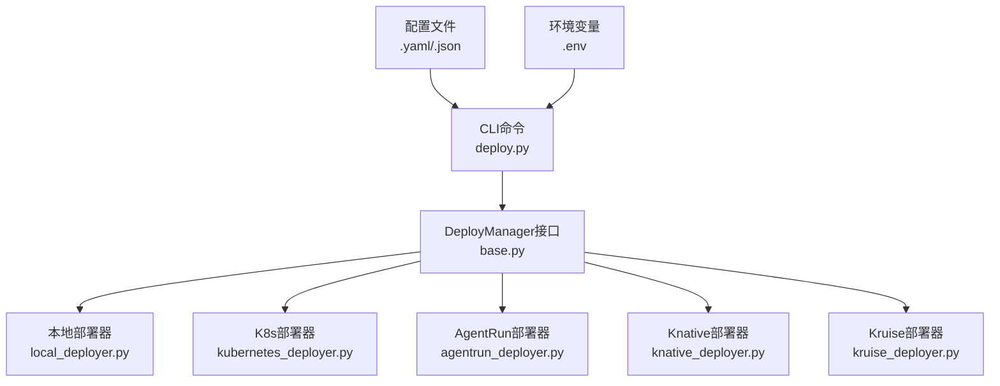
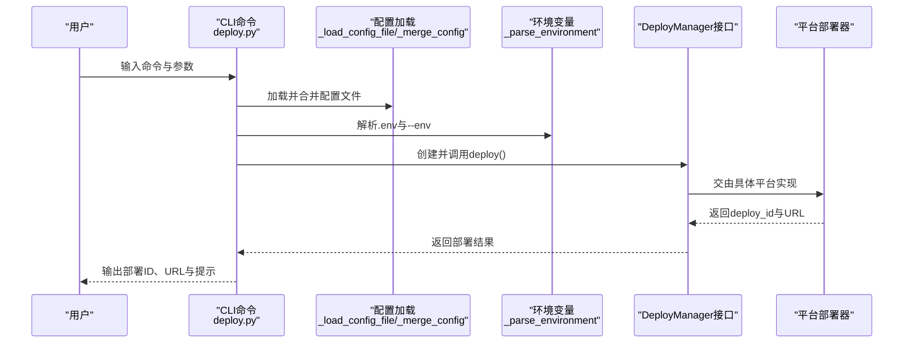
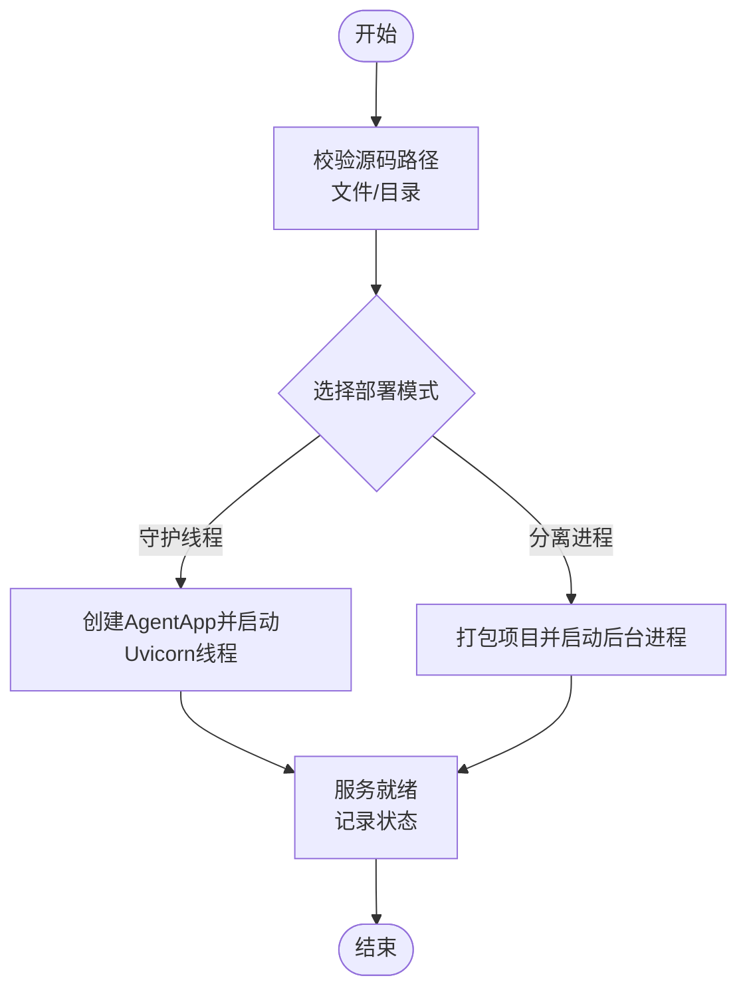
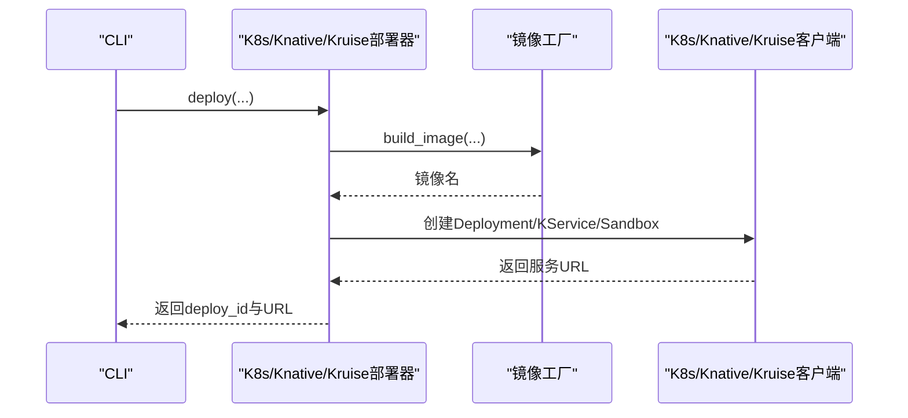
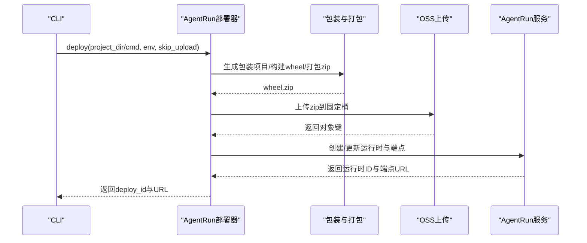
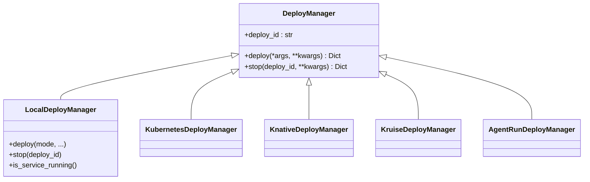

# deploy部署命令

<cite>
**本文引用的文件**
- [deploy.py](file://src/agentscope_runtime/cli/commands/deploy.py)
- [base.py](file://src/agentscope_runtime/engine/deployers/base.py)
- [local_deployer.py](file://src/agentscope_runtime/engine/deployers/local_deployer.py)
- [kubernetes_deployer.py](file://src/agentscope_runtime/engine/deployers/kubernetes_deployer.py)
- [agentrun_deployer.py](file://src/agentscope_runtime/engine/deployers/agentrun_deployer.py)
- [knative_deployer.py](file://src/agentscope_runtime/engine/deployers/knative_deployer.py)
- [kruise_deployer.py](file://src/agentscope_runtime/engine/deployers/kruise_deployer.py)
- [deployment_modes.py](file://src/agentscope_runtime/engine/deployers/utils/deployment_modes.py)
- [agentrun_deploy_config.yaml](file://examples/deployments/agentrun_deploy_config.yaml)
- [local_deploy_config.yaml](file://examples/deployments/local_deploy_config.yaml)
- [pai_deploy_config.yaml](file://examples/deployments/pai_deploy_config.yaml)
- [README.md](file://README.md)
- [deployment.md](file://cookbook/en/deployment.md)
- [deployment.md](file://cookbook/zh/deployment.md)
</cite>

## 目录
1. [简介](#简介)
2. [项目结构](#项目结构)
3. [核心组件](#核心组件)
4. [架构总览](#架构总览)
5. [详细组件分析](#详细组件分析)
6. [依赖分析](#依赖分析)
7. [性能考虑](#性能考虑)
8. [故障排查指南](#故障排查指南)
9. [结论](#结论)
10. [附录](#附录)

## 简介
本文件面向“deploy部署命令”的使用者与维护者，系统性阐述AgentScope Runtime中的部署能力与最佳实践。内容覆盖：
- 多种部署模式与平台选择（本地、Kubernetes、Knative、Kruise、AgentRun、ModelStudio、PAI）
- 部署配置文件格式与关键参数
- 从构建到发布的完整流程
- 部署前准备与环境检查
- 部署后的验证与监控
- 批量部署与自动化部署建议

## 项目结构
deploy命令位于CLI层，按平台抽象出统一的DeployManager接口，并由各平台的具体DeployManager实现完成实际部署。配置文件采用JSON或YAML格式，支持环境变量注入与合并优先级控制。

图示来源
- [deploy.py](file://src/agentscope_runtime/cli/commands/deploy.py)
- [base.py](file://src/agentscope_runtime/engine/deployers/base.py)
- [local_deployer.py](file://src/agentscope_runtime/engine/deployers/local_deployer.py)
- [kubernetes_deployer.py](file://src/agentscope_runtime/engine/deployers/kubernetes_deployer.py)
- [agentrun_deployer.py](file://src/agentscope_runtime/engine/deployers/agentrun_deployer.py)
- [knative_deployer.py](file://src/agentscope_runtime/engine/deployers/knative_deployer.py)
- [kruise_deployer.py](file://src/agentscope_runtime/engine/deployers/kruise_deployer.py)

章节来源
- [deploy.py](file://src/agentscope_runtime/cli/commands/deploy.py)
- [base.py](file://src/agentscope_runtime/engine/deployers/base.py)

## 核心组件
- CLI命令入口：解析参数、加载配置、合并环境变量、调用对应平台的DeployManager并输出结果
- DeployManager接口：定义统一的deploy/stop能力，生成唯一deploy_id并持久化状态
- 平台部署器：按平台特性封装镜像构建、资源编排、上传与发布流程
- 部署模式：本地部署支持守护线程与分离进程两种模式
- 配置与环境：支持YAML/JSON配置文件与.env文件，CLI参数具有更高优先级

章节来源
- [deploy.py](file://src/agentscope_runtime/cli/commands/deploy.py)
- [base.py](file://src/agentscope_runtime/engine/deployers/base.py)
- [deployment_modes.py](file://src/agentscope_runtime/engine/deployers/utils/deployment_modes.py)

## 架构总览
下图展示了deploy命令在CLI与各平台部署器之间的交互关系，以及配置与环境变量的处理流程。

图示来源
- [deploy.py](file://src/agentscope_runtime/cli/commands/deploy.py)
- [base.py](file://src/agentscope_runtime/engine/deployers/base.py)

## 详细组件分析

### CLI命令与参数解析
- 支持的平台：local、modelstudio、agentrun、k8s、knative、kruise、pai
- 公共参数：
  - --name：部署名称
  - --host/--port：本地部署主机与端口
  - --entrypoint/-e：项目目录下的入口文件名
  - --env/-E：环境变量（可多次传入）
  - --env-file：.env文件路径
  - --config/-c：部署配置文件（.json/.yaml/.yml）
- 平台特定参数：
  - agentrun：--region、--cpu、--memory、--skip-upload
  - modelstudio：--skip-upload
  - k8s/knative/kruise：镜像构建、命名空间、副本数、卷挂载、环境变量等
  - pai：--config指定YAML配置，包含上下文与规格

章节来源
- [deploy.py](file://src/agentscope_runtime/cli/commands/deploy.py)

### 配置文件格式与参数说明
- 通用字段
  - name：部署名称
  - host/port：本地部署服务器地址与端口
  - entrypoint：入口文件名（自动检测默认值）
  - environment：环境变量字典
- 平台专用字段
  - agentrun：region、cpu、memory、skip_upload
  - k8s/knative/kruise：镜像名/标签、端口、副本数、卷挂载、环境变量、运行时配置等
  - pai：context/spec（工作区、规格、资源、网络、身份、存储、环境变量、标签）

章节来源
- [agentrun_deploy_config.yaml](file://examples/deployments/agentrun_deploy_config.yaml)
- [local_deploy_config.yaml](file://examples/deployments/local_deploy_config.yaml)
- [pai_deploy_config.yaml](file://examples/deployments/pai_deploy_config.yaml)

### 本地部署（local）
- 模式
  - 守护线程模式：在当前进程中启动Uvicorn服务线程
  - 分离进程模式：打包项目并以后台进程方式启动，支持独立PID与日志清理
- 关键流程
  - 解析源码（文件或目录），自动发现入口
  - 合并环境变量（.env与--env）
  - 选择部署模式并启动
  - 记录部署状态，返回deploy_id与URL

图示来源
- [local_deployer.py](file://src/agentscope_runtime/engine/deployers/local_deployer.py)
- [deployment_modes.py](file://src/agentscope_runtime/engine/deployers/utils/deployment_modes.py)

章节来源
- [local_deployer.py](file://src/agentscope_runtime/engine/deployers/local_deployer.py)

### Kubernetes/Knative/Kruise部署
- 统一流程
  - 构建镜像（含依赖安装、协议适配器、自定义端点打包）
  - 推送镜像至注册表（可选）
  - 在集群中创建Deployment/Service或KService/Kruise Sandbox
  - 自动选择服务端点（本地集群回退到127.0.0.1）
  - 记录部署状态并返回URL
- 特殊能力
  - K8s：支持副本数、卷挂载、环境变量、运行时配置
  - Knative：支持注解与标签，按需创建KService
  - Kruise：支持Sandbox CR，自动选择端点

图示来源
- [kubernetes_deployer.py](file://src/agentscope_runtime/engine/deployers/kubernetes_deployer.py)
- [knative_deployer.py](file://src/agentscope_runtime/engine/deployers/knative_deployer.py)
- [kruise_deployer.py](file://src/agentscope_runtime/engine/deployers/kruise_deployer.py)

章节来源
- [kubernetes_deployer.py](file://src/agentscope_runtime/engine/deployers/kubernetes_deployer.py)
- [knative_deployer.py](file://src/agentscope_runtime/engine/deployers/knative_deployer.py)
- [kruise_deployer.py](file://src/agentscope_runtime/engine/deployers/kruise_deployer.py)

### AgentRun部署
- 流程要点
  - 生成包装项目与wheel包（可跳过上传）
  - 将zip包上传至OSS（固定桶）
  - 调用AgentRun API创建/更新运行时与端点
  - 返回运行时ID、端点URL与控制台链接
- 环境与资源
  - 通过环境变量设置区域、CPU、内存、网络与日志配置
  - 支持外部wheel路径直接更新

图示来源
- [agentrun_deployer.py](file://src/agentscope_runtime/engine/deployers/agentrun_deployer.py)

章节来源
- [agentrun_deployer.py](file://src/agentscope_runtime/engine/deployers/agentrun_deployer.py)

### ModelStudio部署
- 流程要点
  - 生成包装项目与wheel包（可跳过上传）
  - 上传zip至OSS（临时/固定桶），调用ModelStudio API创建运行时
  - 返回部署ID、控制台URL与工作区ID
- 环境要求
  - 阿里云AK、ModelStudio工作区ID等

章节来源
- [deploy.py](file://src/agentscope_runtime/cli/commands/deploy.py)

### PAI部署
- 流程要点
  - 读取YAML配置（context/spec），支持工作区、资源、网络、存储、环境变量与标签
  - 通过PAI LangStudio/EAS等SDK进行部署
  - 返回服务名称与状态
- 注意事项
  - 需要安装PAI相关SDK依赖

章节来源
- [deploy.py](file://src/agentscope_runtime/cli/commands/deploy.py)

## 依赖分析
- CLI对各平台部署器采用延迟导入与条件可用性检查，未安装依赖时给出明确提示
- 部署器均继承自DeployManager，确保统一的deploy/stop接口与状态管理
- 本地部署器支持两种模式，通过DeploymentMode枚举区分

图示来源
- [base.py](file://src/agentscope_runtime/engine/deployers/base.py)
- [local_deployer.py](file://src/agentscope_runtime/engine/deployers/local_deployer.py)
- [kubernetes_deployer.py](file://src/agentscope_runtime/engine/deployers/kubernetes_deployer.py)
- [knative_deployer.py](file://src/agentscope_runtime/engine/deployers/knative_deployer.py)
- [kruise_deployer.py](file://src/agentscope_runtime/engine/deployers/kruise_deployer.py)
- [agentrun_deployer.py](file://src/agentscope_runtime/engine/deployers/agentrun_deployer.py)

章节来源
- [base.py](file://src/agentscope_runtime/engine/deployers/base.py)
- [deployment_modes.py](file://src/agentscope_runtime/engine/deployers/utils/deployment_modes.py)

## 性能考虑
- 本地部署
  - 分离进程模式适合长期运行，避免主线程阻塞；守护线程模式便于集成测试
  - 启动超时与关闭超时可配置，避免长时间阻塞
- 容器化部署
  - 启用构建缓存与自定义PyPI镜像可显著缩短镜像构建时间
  - 合理设置副本数与资源配额，结合HPA实现弹性伸缩
- AgentRun/ModelStudio/PAI
  - 通过skip_upload仅构建wheel用于本地验证，减少云端等待
  - 使用外部wheel路径可直接更新已有运行时，提升迭代效率

## 故障排查指南
- 常见问题
  - 配置文件格式错误：检查JSON/YAML语法与字段类型
  - 环境变量缺失：确认AK、工作区ID、OSS桶等关键变量
  - 端口占用：修改--port或释放占用端口
  - 权限不足：检查K8s/Knative/Kruise RBAC与AgentRun/ModelStudio/PAI授权
- 诊断建议
  - 查看CLI输出的部署ID与URL，结合平台控制台定位问题
  - 本地部署：查看分离进程的日志文件与PID文件
  - 容器部署：检查镜像构建日志与Pod事件
  - AgentRun/ModelStudio：核对OSS上传状态与运行时版本发布情况

章节来源
- [deploy.py](file://src/agentscope_runtime/cli/commands/deploy.py)
- [local_deployer.py](file://src/agentscope_runtime/engine/deployers/local_deployer.py)

## 结论
deploy命令提供了统一的部署入口，覆盖本地与多云平台，支持灵活的配置与环境变量注入。通过合理的配置文件与环境准备、分阶段的部署流程与完善的监控手段，可高效地将Agent应用从开发环境过渡到生产环境。

## 附录

### 部署前准备与环境检查清单
- 安装与依赖
  - 安装Runtime与所需扩展
  - 安装平台SDK（如AgentRun/ModelStudio/PAI/Knative/Kruise）
- 凭证与权限
  - 阿里云AK、工作区ID、OSS桶等
  - K8s/Knative/Kruise集群访问凭据
- 网络与存储
  - 确认镜像仓库可达与网络策略
  - 准备OSS存储与访问权限
- 本地验证
  - 本地部署验证端口与路由
  - 检查代理与工具调用是否正常

章节来源
- [README.md](file://README.md)
- [deployment.md](file://cookbook/en/deployment.md)
- [deployment.md](file://cookbook/zh/deployment.md)

### 部署后的验证与监控
- 健康检查
  - 通过返回的URL访问服务端点，验证响应与流式输出
- 日志与追踪
  - 本地：查看分离进程日志与PID文件
  - 容器：采集Pod日志与指标
  - 平台：接入平台自带的控制台与日志服务
- 回滚与停止
  - 使用deploy_id调用stop接口或平台控制台操作

章节来源
- [base.py](file://src/agentscope_runtime/engine/deployers/base.py)
- [local_deployer.py](file://src/agentscope_runtime/engine/deployers/local_deployer.py)

### 批量部署与自动化部署最佳实践
- CI/CD流水线
  - 将deploy命令纳入流水线，按环境注入不同配置文件
  - 使用--skip-upload进行快速验证，再在发布分支执行上传
- 配置管理
  - 将公共参数放入YAML，敏感参数放入密钥管理服务
  - 使用--tag与--env为不同环境打标与注入变量
- 蓝绿/金丝雀
  - 通过不同部署名称与标签实现多版本并行
  - 结合K8s/HPA与平台扩缩容策略

章节来源
- [pai_deploy_config.yaml](file://examples/deployments/pai_deploy_config.yaml)
- [agentrun_deploy_config.yaml](file://examples/deployments/agentrun_deploy_config.yaml)
- [local_deploy_config.yaml](file://examples/deployments/local_deploy_config.yaml)