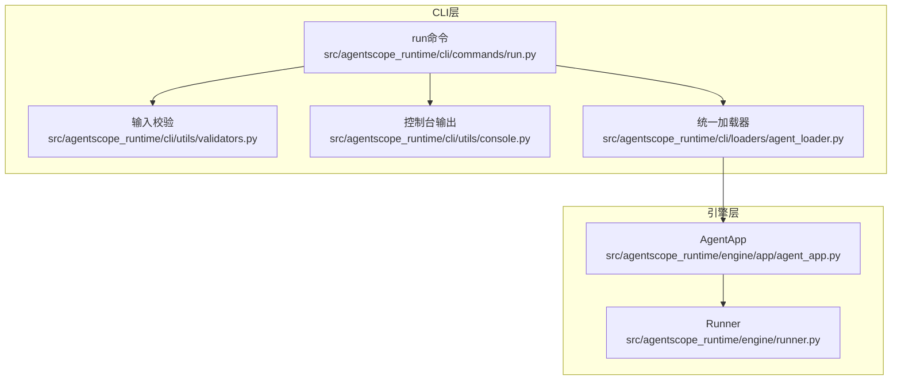
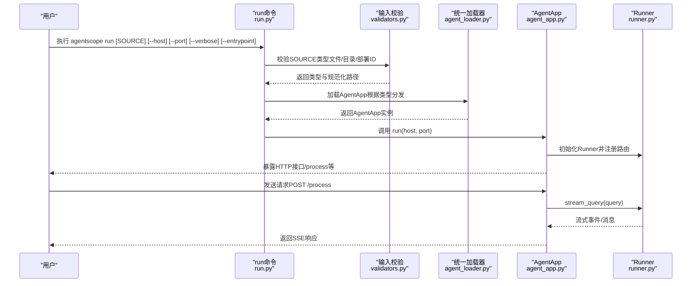
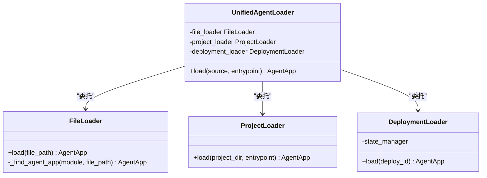
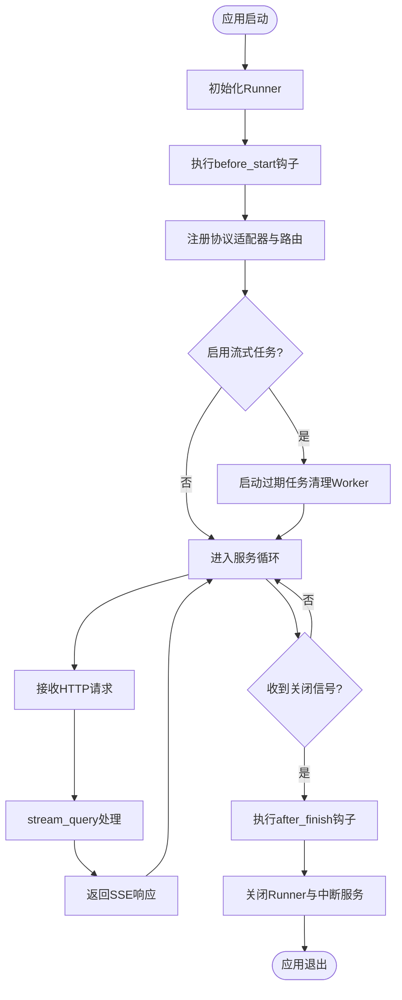
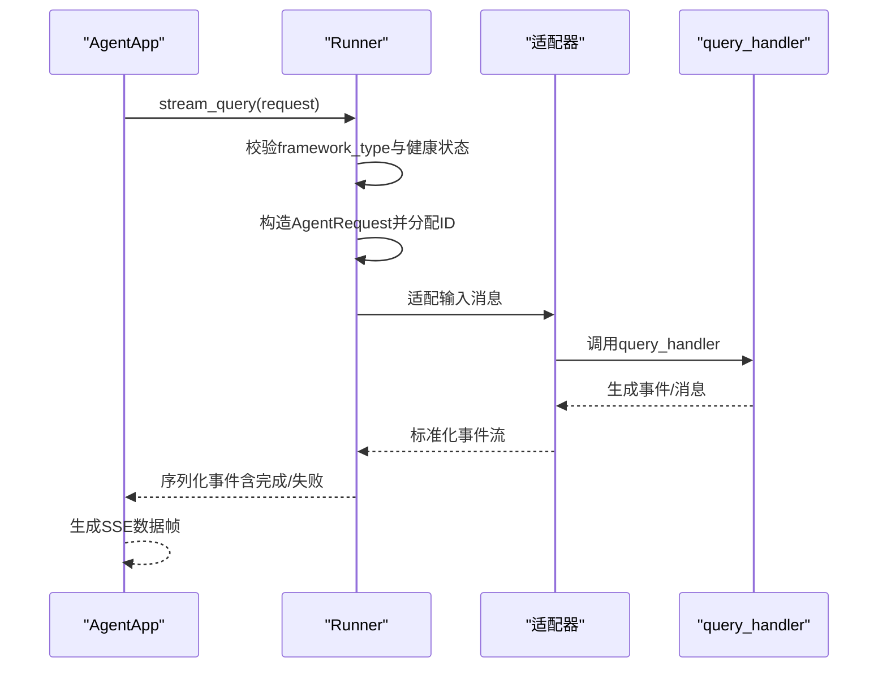
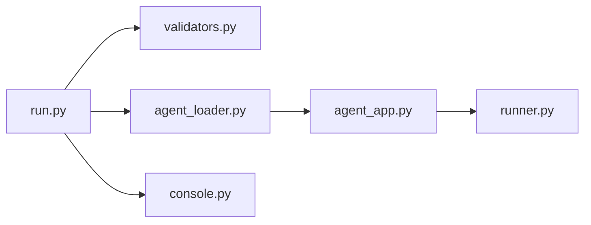

# run运行命令

<cite>
**本文档引用的文件**
- [run.py](file://src/agentscope_runtime/cli/commands/run.py)
- [agent_loader.py](file://src/agentscope_runtime/cli/loaders/agent_loader.py)
- [agent_app.py](file://src/agentscope_runtime/engine/app/agent_app.py)
- [runner.py](file://src/agentscope_runtime/engine/runner.py)
- [validators.py](file://src/agentscope_runtime/cli/utils/validators.py)
- [console.py](file://src/agentscope_runtime/cli/utils/console.py)
- [cli.md](file://cookbook/en/cli.md)
- [run_langgraph_agent.py](file://examples/integrations/langgraph/run_langgraph_agent.py)
- [agent.py](file://examples/integrations/ag-ui/agent.py)
</cite>

## 目录
1. [简介](#简介)
2. [项目结构](#项目结构)
3. [核心组件](#核心组件)
4. [架构总览](#架构总览)
5. [详细组件分析](#详细组件分析)
6. [依赖分析](#依赖分析)
7. [性能考虑](#性能考虑)
8. [故障排查指南](#故障排查指南)
9. [结论](#结论)
10. [附录](#附录)

## 简介
本文件面向“run运行命令”的完整使用与实现文档，重点阐述以下内容：
- run命令的核心功能与使用场景
- 本地运行智能体应用（AgentApp）的启动流程
- 命令参数配置（智能体文件路径、配置选项、运行模式、环境变量）
- 智能体加载机制与AgentLoader工作原理
- 运行时生命周期管理与状态监控
- 本地开发与测试的完整流程
- 性能优化与调试技巧
- 与其他CLI命令的协作使用方式

## 项目结构
run命令位于CLI层，负责解析用户输入、加载智能体、初始化AgentApp并启动HTTP服务；AgentApp基于FastAPI提供REST接口，并通过Runner承载实际推理逻辑。

图表来源
- [run.py:26-177](file://src/agentscope_runtime/cli/commands/run.py#L26-L177)
- [agent_loader.py:238-296](file://src/agentscope_runtime/cli/loaders/agent_loader.py#L238-L296)
- [agent_app.py:60-220](file://src/agentscope_runtime/engine/app/agent_app.py#L60-L220)
- [runner.py:46-120](file://src/agentscope_runtime/engine/runner.py#L46-L120)

章节来源
- [run.py:26-177](file://src/agentscope_runtime/cli/commands/run.py#L26-L177)
- [agent_loader.py:238-296](file://src/agentscope_runtime/cli/loaders/agent_loader.py#L238-L296)
- [agent_app.py:60-220](file://src/agentscope_runtime/engine/app/agent_app.py#L60-L220)
- [runner.py:46-120](file://src/agentscope_runtime/engine/runner.py#L46-L120)

## 核心组件
- run命令：解析参数、配置日志、加载AgentApp并启动服务
- UnifiedAgentLoader：统一处理文件/目录/部署ID三种来源
- AgentApp：基于FastAPI的服务容器，注册路由、生命周期管理、中断与任务清理
- Runner：封装推理流程，支持多框架适配与流式输出
- 输入校验与控制台输出：确保输入合法与良好的用户体验

章节来源
- [run.py:55-177](file://src/agentscope_runtime/cli/commands/run.py#L55-L177)
- [agent_loader.py:238-296](file://src/agentscope_runtime/cli/loaders/agent_loader.py#L238-L296)
- [agent_app.py:60-220](file://src/agentscope_runtime/engine/app/agent_app.py#L60-L220)
- [runner.py:46-120](file://src/agentscope_runtime/engine/runner.py#L46-L120)
- [validators.py:13-54](file://src/agentscope_runtime/cli/utils/validators.py#L13-L54)
- [console.py:78-185](file://src/agentscope_runtime/cli/utils/console.py#L78-L185)

## 架构总览
run命令从用户输入开始，经过参数解析与校验，选择合适的加载策略，最终启动AgentApp并暴露HTTP接口。AgentApp内部通过Runner执行推理，并在生命周期内完成资源初始化、中间件注入、路由注册与清理。

图表来源
- [run.py:110-172](file://src/agentscope_runtime/cli/commands/run.py#L110-L172)
- [validators.py:13-54](file://src/agentscope_runtime/cli/utils/validators.py#L13-L54)
- [agent_loader.py:251-296](file://src/agentscope_runtime/cli/loaders/agent_loader.py#L251-L296)
- [agent_app.py:781-800](file://src/agentscope_runtime/engine/app/agent_app.py#L781-L800)
- [runner.py:199-356](file://src/agentscope_runtime/engine/runner.py#L199-L356)

## 详细组件分析

### run命令：参数与行为
- 参数说明
  - SOURCE：智能体文件路径、项目目录或部署ID
  - --host/-h：绑定地址，默认0.0.0.0
  - --port/-p：端口，默认8080
  - --verbose/-v：启用详细日志与追踪
  - --entrypoint/-e：目录源的入口文件名（仅对目录有效）
- 行为特性
  - 根据verbose切换日志级别与追踪开关
  - 支持部署ID查询（当前run不直接运行部署ID，会提示使用其他命令）
  - 统一加载AgentApp并调用其run方法启动服务
  - 捕获键盘中断与异常，输出友好提示

章节来源
- [run.py:26-177](file://src/agentscope_runtime/cli/commands/run.py#L26-L177)
- [console.py:78-185](file://src/agentscope_runtime/cli/utils/console.py#L78-L185)

### AgentLoader体系：智能体加载机制
- 统一入口：UnifiedAgentLoader
  - 解析SOURCE类型并分发到对应加载器
  - 对目录源支持entrypoint参数
  - 对部署ID源需要状态管理器（当前run未提供）
- 文件加载：FileLoader
  - 动态导入Python文件，查找AgentApp实例或工厂函数
  - 支持导出变量（agent_app/app）或工厂函数（create_app/create_agent_app/get_app/get_agent_app）
- 目录加载：ProjectLoader
  - 在目录中按优先级寻找入口文件（app.py/agent.py/main.py）
  - 支持指定entrypoint
- 部署加载：DeploymentLoader
  - 通过状态管理器获取部署元数据，回溯原始来源并再次加载

图表来源
- [agent_loader.py:238-296](file://src/agentscope_runtime/cli/loaders/agent_loader.py#L238-L296)
- [agent_loader.py:28-143](file://src/agentscope_runtime/cli/loaders/agent_loader.py#L28-L143)
- [agent_loader.py:145-193](file://src/agentscope_runtime/cli/loaders/agent_loader.py#L145-L193)
- [agent_loader.py:195-236](file://src/agentscope_runtime/cli/loaders/agent_loader.py#L195-L236)

章节来源
- [agent_loader.py:238-296](file://src/agentscope_runtime/cli/loaders/agent_loader.py#L238-L296)
- [agent_loader.py:28-143](file://src/agentscope_runtime/cli/loaders/agent_loader.py#L28-L143)
- [agent_loader.py:145-193](file://src/agentscope_runtime/cli/loaders/agent_loader.py#L145-L193)
- [agent_loader.py:195-236](file://src/agentscope_runtime/cli/loaders/agent_loader.py#L195-L236)

### AgentApp：服务容器与生命周期
- 角色定位
  - 基于FastAPI的服务容器，集成路由、中间件与协议适配器
  - 内部持有Runner，负责推理与流式输出
- 生命周期管理
  - 使用FastAPI lifespan钩子，统一管理Runner的启动/关闭
  - 支持before_start/after_finish钩子扩展
- 中断与任务
  - 支持分布式/本地中断后端
  - 可选的流式任务队列与过期清理
- 内置路由
  - /health健康检查
  - /根路径返回可用端点信息
  - /shutdown与/admin/shutdown进程优雅关闭
  - /admin/status进程状态查询

图表来源
- [agent_app.py:248-339](file://src/agentscope_runtime/engine/app/agent_app.py#L248-L339)
- [agent_app.py:382-471](file://src/agentscope_runtime/engine/app/agent_app.py#L382-L471)
- [agent_app.py:598-642](file://src/agentscope_runtime/engine/app/agent_app.py#L598-L642)

章节来源
- [agent_app.py:60-220](file://src/agentscope_runtime/engine/app/agent_app.py#L60-L220)
- [agent_app.py:248-339](file://src/agentscope_runtime/engine/app/agent_app.py#L248-L339)
- [agent_app.py:382-471](file://src/agentscope_runtime/engine/app/agent_app.py#L382-L471)
- [agent_app.py:598-642](file://src/agentscope_runtime/engine/app/agent_app.py#L598-L642)

### Runner：推理与流式输出
- 职责
  - 统一封装query_handler，支持同步/异步/生成器/协程
  - 多框架适配（agentscope/langgraph/agno/ms_agent_framework/text）
  - 流式事件序列化与错误包装
- 关键流程
  - 校验framework_type与健康状态
  - 构造AgentRequest并分配session_id/user_id
  - 通过适配器将上游消息转换为目标框架消息
  - 产出事件序列，最终标记Completed/Failed

图表来源
- [runner.py:199-356](file://src/agentscope_runtime/engine/runner.py#L199-L356)
- [agent_app.py:690-703](file://src/agentscope_runtime/engine/app/agent_app.py#L690-L703)

章节来源
- [runner.py:46-120](file://src/agentscope_runtime/engine/runner.py#L46-L120)
- [runner.py:199-356](file://src/agentscope_runtime/engine/runner.py#L199-L356)
- [agent_app.py:690-703](file://src/agentscope_runtime/engine/app/agent_app.py#L690-L703)

### 输入校验与控制台输出
- 输入校验
  - validate_agent_source：识别文件/目录/部署ID三类来源
  - 其他校验函数用于端口、平台、URL等
- 控制台输出
  - 统一的成功/错误/警告/信息样式，便于用户理解状态

章节来源
- [validators.py:13-119](file://src/agentscope_runtime/cli/utils/validators.py#L13-L119)
- [console.py:78-185](file://src/agentscope_runtime/cli/utils/console.py#L78-L185)

## 依赖分析
- run命令依赖
  - 输入校验：validate_agent_source
  - 统一加载器：UnifiedAgentLoader
  - 控制台输出：统一的echo_*接口
- 加载器依赖
  - FileLoader/ProjectLoader/DeploymentLoader分别依赖文件系统与状态管理器
- AgentApp依赖
  - Runner、协议适配器、CORS中间件、内置路由
- Runner依赖
  - 多框架适配器、事件模型、追踪工具

图表来源
- [run.py:12-23](file://src/agentscope_runtime/cli/commands/run.py#L12-L23)
- [agent_loader.py:12-13](file://src/agentscope_runtime/cli/loaders/agent_loader.py#L12-L13)
- [agent_app.py:25-51](file://src/agentscope_runtime/engine/app/agent_app.py#L25-L51)
- [runner.py:20-40](file://src/agentscope_runtime/engine/runner.py#L20-L40)

章节来源
- [run.py:12-23](file://src/agentscope_runtime/cli/commands/run.py#L12-L23)
- [agent_loader.py:12-13](file://src/agentscope_runtime/cli/loaders/agent_loader.py#L12-L13)
- [agent_app.py:25-51](file://src/agentscope_runtime/engine/app/agent_app.py#L25-L51)
- [runner.py:20-40](file://src/agentscope_runtime/engine/runner.py#L20-L40)

## 性能考虑
- 日志与追踪
  - 通过--verbose开启详细日志与追踪，便于问题定位但可能影响性能
  - 默认关闭追踪，降低开销
- 流式任务
  - 启用enable_stream_task可将流式查询转为后台任务，适合长耗时推理
  - 自动清理过期任务，避免内存泄漏
- 中断后端
  - 分布式Redis后端适合多节点场景，单机可使用本地后端
- 端口与网络
  - 合理设置host/port，避免端口冲突与权限问题

章节来源
- [run.py:92-108](file://src/agentscope_runtime/cli/commands/run.py#L92-L108)
- [agent_app.py:460-471](file://src/agentscope_runtime/engine/app/agent_app.py#L460-L471)
- [agent_app.py:222-247](file://src/agentscope_runtime/engine/app/agent_app.py#L222-L247)

## 故障排查指南
- 常见错误与提示
  - 文件/目录不存在：检查SOURCE路径与权限
  - 部署ID无效：确认部署存在且格式正确
  - AgentApp未找到：确保导出agent_app/app或提供工厂函数
  - 端口被占用：更换--port或释放端口
  - 键盘中断：Ctrl+C正常退出，查看日志定位异常
- 调试技巧
  - 使用--verbose查看详细日志
  - 通过/admin/status查看进程状态（内存/CPU/启动时间）
  - 通过curl或agentscope chat验证服务连通性
- 单元测试与示例
  - 参考示例工程验证AgentApp与Runner组合
  - 使用SimpleRunner/ErrorRunner快速验证流式输出与异常处理

章节来源
- [run.py:121-172](file://src/agentscope_runtime/cli/commands/run.py#L121-L172)
- [validators.py:13-54](file://src/agentscope_runtime/cli/utils/validators.py#L13-L54)
- [agent_loader.py:28-84](file://src/agentscope_runtime/cli/loaders/agent_loader.py#L28-L84)
- [agent_app.py:628-642](file://src/agentscope_runtime/engine/app/agent_app.py#L628-L642)
- [runner.py:338-356](file://src/agentscope_runtime/engine/runner.py#L338-L356)

## 结论
run命令提供了将智能体以HTTP服务形式持续运行的能力，结合统一加载器与AgentApp/Runner体系，实现了从文件/目录/部署ID到服务启动的完整链路。通过合理的参数配置、生命周期管理与监控手段，可在本地开发与测试中高效验证智能体能力，并为后续部署打下基础。

## 附录

### 参数与使用示例
- 基本用法
  - agentscope run app_agent.py
  - agentscope run app_agent.py --host 127.0.0.1 --port 8090
  - agentscope run app_agent.py --verbose
  - agentscope run ./my-project --entrypoint custom_app.py
- 访问服务
  - POST /process 接收AgentRequest，返回SSE流式响应
  - GET /health 健康检查
  - GET / 获取端点信息
  - POST /shutdown 或 /admin/shutdown 优雅关闭
  - GET /admin/status 查看进程状态

章节来源
- [cli.md:319-389](file://cookbook/en/cli.md#L319-L389)
- [agent_app.py:382-424](file://src/agentscope_runtime/engine/app/agent_app.py#L382-L424)
- [agent_app.py:598-642](file://src/agentscope_runtime/engine/app/agent_app.py#L598-L642)

### 与其他CLI命令的协作
- 与chat命令配合：先用chat进行交互式开发与单次查询验证，再用run长期运行
- 与web命令配合：web提供可视化界面，run提供纯API服务
- 与deploy命令配合：本地验证通过后，使用deploy发布到目标平台，再用run进行本地联调

章节来源
- [cli.md:214-389](file://cookbook/en/cli.md#L214-L389)

### 开发与测试流程建议
- 本地开发
  - 使用agentscope chat验证交互逻辑
  - 使用agentscope web进行前端联调
  - 使用agentscope run启动后端服务，curl或SDK调用
- 测试要点
  - 验证/health与/process端点
  - 检查SSE流式输出完整性
  - 模拟异常场景（网络中断、超时、错误处理器）

章节来源
- [cli.md:137-207](file://cookbook/en/cli.md#L137-L207)
- [run_langgraph_agent.py:170-172](file://examples/integrations/langgraph/run_langgraph_agent.py#L170-L172)
- [agent.py:21-25](file://examples/integrations/ag-ui/agent.py#L21-L25)