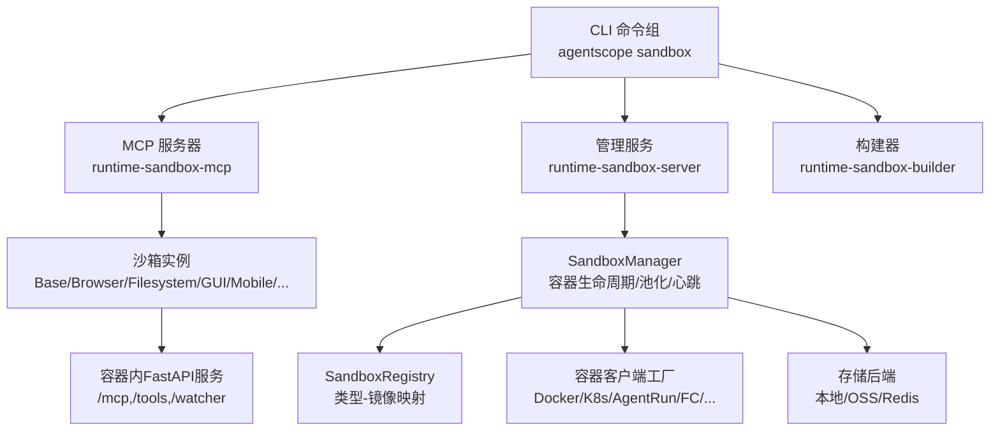
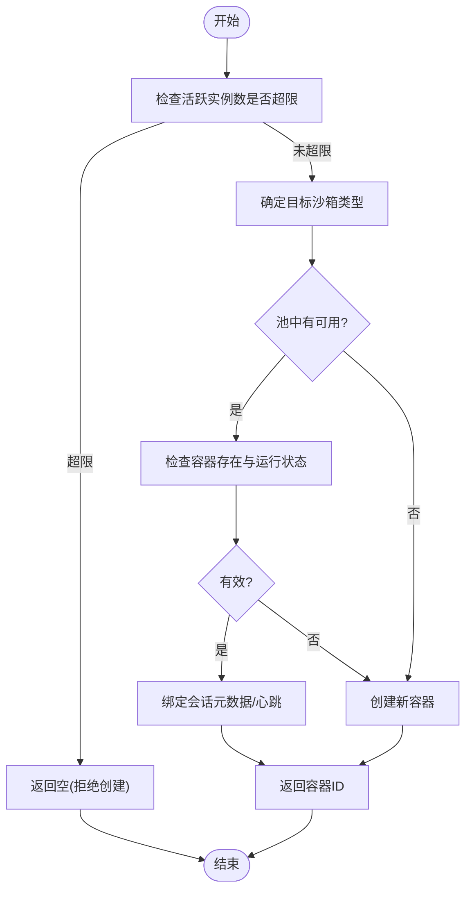
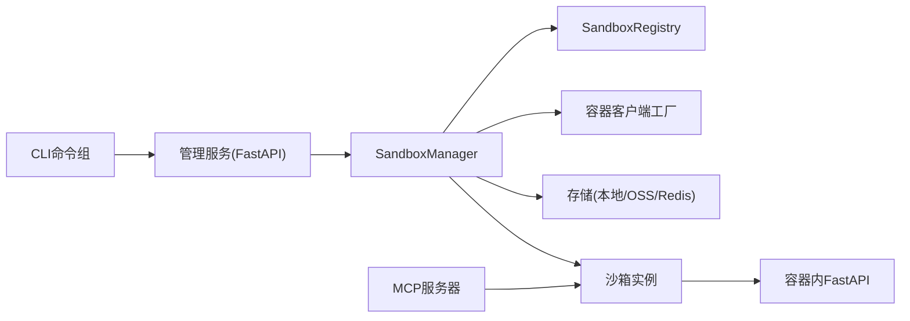

# sandbox沙箱命令

<cite>
**本文档引用的文件**
- [sandbox.py](file://src/agentscope_runtime/cli/commands/sandbox.py)
- [sandbox_manager.py](file://src/agentscope_runtime/sandbox/manager/sandbox_manager.py)
- [manager_config.py](file://src/agentscope_runtime/sandbox/model/manager_config.py)
- [enums.py](file://src/agentscope_runtime/sandbox/enums.py)
- [container.py](file://src/agentscope_runtime/sandbox/model/container.py)
- [registry.py](file://src/agentscope_runtime/sandbox/registry.py)
- [sandbox_service.py](file://src/agentscope_runtime/engine/services/sandbox/sandbox_service.py)
- [sandbox_service_factory.py](file://src/agentscope_runtime/engine/services/sandbox/sandbox_service_factory.py)
- [base.py](file://src/agentscope_runtime/sandbox/client/base.py)
- [http_client.py](file://src/agentscope_runtime/sandbox/client/http_client.py)
- [base_sandbox.py](file://src/agentscope_runtime/sandbox/box/base/base_sandbox.py)
- [app.py](file://src/agentscope_runtime/sandbox/manager/server/app.py)
- [mcp_server.py](file://src/agentscope_runtime/sandbox/mcp_server.py)
</cite>

## 目录
1. [简介](#简介)
2. [项目结构](#项目结构)
3. [核心组件](#核心组件)
4. [架构总览](#架构总览)
5. [详细组件分析](#详细组件分析)
6. [依赖分析](#依赖分析)
7. [性能考虑](#性能考虑)
8. [故障排除指南](#故障排除指南)
9. [结论](#结论)
10. [附录](#附录)

## 简介
本文件面向“sandbox沙箱命令”的使用者与维护者，系统性阐述沙箱的创建、启动、停止与删除流程；解释沙箱类型分类与选择标准；梳理命令参数配置（规格、资源限制、网络等）；说明沙箱与AgentApp的集成与通信机制；覆盖状态监控与日志查看；提供调试与故障排除方法，并给出在智能体开发与测试中的典型应用场景。

## 项目结构
围绕CLI命令“agentscope sandbox”，系统由三层构成：
- 命令层：CLI子命令组，统一入口，委派到具体运行器（MCP服务器、管理服务、构建器）
- 管理层：SandboxManager负责容器生命周期、池化复用、心跳与回收、远程/本地模式
- 客户端与沙箱实现：HTTP客户端、MCP工具桥接、各类沙箱类型（基础、浏览器、文件系统、GUI、移动端、训练环境等）



图表来源
- [sandbox.py:14-125](file://src/agentscope_runtime/cli/commands/sandbox.py#L14-L125)
- [app.py:30-213](file://src/agentscope_runtime/sandbox/manager/server/app.py#L30-L213)
- [sandbox_manager.py:140-270](file://src/agentscope_runtime/sandbox/manager/sandbox_manager.py#L140-L270)
- [registry.py:33-131](file://src/agentscope_runtime/sandbox/registry.py#L33-L131)

章节来源
- [sandbox.py:14-125](file://src/agentscope_runtime/cli/commands/sandbox.py#L14-L125)
- [app.py:30-213](file://src/agentscope_runtime/sandbox/manager/server/app.py#L30-L213)

## 核心组件
- CLI沙箱命令组：提供mcp、server、build三个子命令，分别委派至对应运行器，便于在不同场景下启动MCP服务、管理服务或构建沙箱镜像。
- SandboxManager：统一的沙箱生命周期管理器，支持本地模式与远程模式，具备容器池化、心跳扫描、回收清理、会话绑定、多后端部署（Docker/K8s/AgentRun/FC/gVisor/BoxLite）能力。
- SandboxRegistry/SandboxType：注册沙箱类型与镜像映射，支持动态扩展新类型；提供资源限制与运行时配置转换。
- SandboxService/SandboxServiceFactory：面向引擎的服务封装，负责按会话连接/创建沙箱，支持嵌入式与远程模式，提供健康检查与释放策略。
- 客户端与工具桥接：SandboxHttpClient提供HTTP接口访问容器内FastAPI服务；MCP工具通过动态签名注册到FastMCP，实现跨进程/跨容器的工具调用。
- 沙箱实现：BaseSandbox等具体类型封装通用工具（如执行IPython单元格、运行shell命令），并通过MCP工具集暴露给外部。

章节来源
- [sandbox.py:14-125](file://src/agentscope_runtime/cli/commands/sandbox.py#L14-L125)
- [sandbox_manager.py:140-270](file://src/agentscope_runtime/sandbox/manager/sandbox_manager.py#L140-L270)
- [manager_config.py:11-376](file://src/agentscope_runtime/sandbox/model/manager_config.py#L11-L376)
- [enums.py:61-80](file://src/agentscope_runtime/sandbox/enums.py#L61-L80)
- [container.py:19-158](file://src/agentscope_runtime/sandbox/model/container.py#L19-L158)
- [registry.py:33-131](file://src/agentscope_runtime/sandbox/registry.py#L33-L131)
- [sandbox_service.py:11-238](file://src/agentscope_runtime/engine/services/sandbox/sandbox_service.py#L11-L238)
- [sandbox_service_factory.py:9-50](file://src/agentscope_runtime/engine/services/sandbox/sandbox_service_factory.py#L9-L50)
- [base.py:10-74](file://src/agentscope_runtime/sandbox/client/base.py#L10-L74)
- [http_client.py:20-207](file://src/agentscope_runtime/sandbox/client/http_client.py#L20-L207)
- [base_sandbox.py:18-102](file://src/agentscope_runtime/sandbox/box/base/base_sandbox.py#L18-L102)

## 架构总览
下图展示从CLI到沙箱管理与运行的核心交互路径，以及MCP工具桥接与容器内服务的关系。

```mermaid
sequenceDiagram
participant U as "用户"
participant CLI as "agentscope sandbox"
participant Srv as "管理服务(FastAPI)"
participant Mgr as "SandboxManager"
participant Reg as "SandboxRegistry"
participant Ctl as "容器客户端"
participant Box as "沙箱实例(Base/Browser/...)"
participant RT as "容器内FastAPI"
U->>CLI : 执行子命令(mcp/server/build)
CLI->>Srv : 启动管理服务/或委派运行器
Srv->>Mgr : 初始化并注册路由
U->>Srv : 调用管理API(创建/连接/释放)
Srv->>Mgr : 远程包装方法调用
Mgr->>Reg : 查询类型配置/镜像
Mgr->>Ctl : 创建容器/启动
Ctl-->>Mgr : 返回容器信息(ContainerModel)
Mgr-->>Srv : 返回结果
Srv-->>U : 返回状态/地址/令牌
Note over Box,RT : Box通过MCP工具与RT交互
Box->>RT : 调用/tools或/mcp接口
RT-->>Box : 返回执行结果
```

图表来源
- [sandbox.py:29-125](file://src/agentscope_runtime/cli/commands/sandbox.py#L29-L125)
- [app.py:146-213](file://src/agentscope_runtime/sandbox/manager/server/app.py#L146-L213)
- [sandbox_manager.py:508-704](file://src/agentscope_runtime/sandbox/manager/sandbox_manager.py#L508-L704)
- [registry.py:93-131](file://src/agentscope_runtime/sandbox/registry.py#L93-L131)
- [http_client.py:20-207](file://src/agentscope_runtime/sandbox/client/http_client.py#L20-L207)
- [mcp_server.py:142-192](file://src/agentscope_runtime/sandbox/mcp_server.py#L142-L192)

## 详细组件分析

### CLI命令组：agentscope sandbox
- 子命令
  - mcp：启动MCP服务器，委派至runtime-sandbox-mcp，支持指定沙箱类型、服务地址与认证令牌
  - server：启动管理服务，委派至runtime-sandbox-server，提供REST与WebSocket接口
  - build：启动构建器，委派至runtime-sandbox-builder，用于构建沙箱镜像
- 参数传递：通过sys.argv重写模拟真实命令行参数，确保运行器可解析其自有参数
- 错误处理：捕获导入异常与运行异常，输出错误信息并退出

章节来源
- [sandbox.py:29-125](file://src/agentscope_runtime/cli/commands/sandbox.py#L29-L125)

### 管理服务：FastAPI应用与路由
- 认证：基于Bearer Token的HTTP安全方案，未配置时跳过校验
- 路由注册：自动扫描SandboxManager中标注为远程包装的方法，生成HTTP端点
- 心跳与回收：启动事件中启动后台扫描线程；关闭事件中可选清理
- VNC代理与WebSocket：桌面访问代理与VNC WebSocket转发
- 日志：支持命令行日志级别设置

章节来源
- [app.py:116-213](file://src/agentscope_runtime/sandbox/manager/server/app.py#L116-L213)
- [app.py:249-357](file://src/agentscope_runtime/sandbox/manager/server/app.py#L249-L357)
- [app.py:397-448](file://src/agentscope_runtime/sandbox/manager/server/app.py#L397-L448)

### SandboxManager：生命周期与池化
- 远程/本地模式：通过base_url/bearer_token判断远程模式；本地模式启动后台扫描线程
- 池化复用：支持多类型容器池，优先从池中取出可用容器，否则新建
- 实例上限：根据配置限制活跃沙箱数量
- 会话绑定：将容器与会话上下文关联，支持心跳更新与回收标记
- 清理策略：销毁非终端状态容器，回收已释放记录，支持同步/异步清理



图表来源
- [sandbox_manager.py:714-750](file://src/agentscope_runtime/sandbox/manager/sandbox_manager.py#L714-L750)
- [sandbox_manager.py:591-704](file://src/agentscope_runtime/sandbox/manager/sandbox_manager.py#L591-L704)

章节来源
- [sandbox_manager.py:140-270](file://src/agentscope_runtime/sandbox/manager/sandbox_manager.py#L140-L270)
- [sandbox_manager.py:508-704](file://src/agentscope_runtime/sandbox/manager/sandbox_manager.py#L508-L704)

### 配置模型：SandboxManagerEnvConfig
- 文件系统：本地或OSS，支持OSS访问参数
- 缓存与队列：Redis启用与键前缀
- 部署后端：docker/cloud/k8s/agentrun/fc/gvisor/boxlite
- 端口范围与池大小：端口占用跟踪、容器池容量
- Kubernetes/AgentRun/FC：各平台的资源配置与鉴权参数
- 心跳与回收：超时、锁TTL、扫描间隔、释放记录TTL、最大实例数

章节来源
- [manager_config.py:11-376](file://src/agentscope_runtime/sandbox/model/manager_config.py#L11-L376)

### 类型与注册：SandboxType 与 SandboxRegistry
- 类型枚举：内置多种沙箱类型（基础、浏览器、文件系统、GUI、移动端、训练环境、AgentBay等），支持动态添加
- 注册表：将类型映射到类与镜像，支持资源限制到运行时配置的转换（内存/CPU）

章节来源
- [enums.py:61-80](file://src/agentscope_runtime/sandbox/enums.py#L61-L80)
- [registry.py:33-131](file://src/agentscope_runtime/sandbox/registry.py#L33-L131)

### 数据模型：ContainerModel
- 字段覆盖：session_id/container_id/container_name/url/ports/mount_dir/storage_path/runtime_token/version/meta/timeout/sandbox_type/state/会话上下文与时间戳等
- 兼容性：自动在meta与session_ctx_id之间同步，确保向后兼容

章节来源
- [container.py:19-158](file://src/agentscope_runtime/sandbox/model/container.py#L19-L158)

### 引擎服务：SandboxService 与工厂
- SandboxService：封装SandboxManager，提供健康检查、连接/创建沙箱、释放策略；支持嵌入式与远程模式
- SandboxServiceFactory：支持环境变量与关键字参数，注册默认后端与自定义后端

章节来源
- [sandbox_service.py:11-238](file://src/agentscope_runtime/engine/services/sandbox/sandbox_service.py#L11-L238)
- [sandbox_service_factory.py:9-50](file://src/agentscope_runtime/engine/services/sandbox/sandbox_service_factory.py#L9-L50)

### 客户端与工具桥接
- SandboxHttpClient：封装请求头（含会话标识与Bearer令牌）、健康检查、等待服务就绪、MCP工具列表与调用、通用工具（IPython执行、Shell命令）、工作区变更提交与差异生成、Git日志查询
- SandboxHttpBase：通用头部与工具描述，支持域替换（将localhost替换为指定域名）

章节来源
- [base.py:10-74](file://src/agentscope_runtime/sandbox/client/base.py#L10-L74)
- [http_client.py:20-207](file://src/agentscope_runtime/sandbox/client/http_client.py#L20-L207)

### 沙箱实现：BaseSandbox 与异步变体
- BaseSandbox/BaseSandboxAsync：注册到SandboxRegistry，提供run_ipython_cell与run_shell_command工具的便捷调用
- 工具签名：通过MCP动态函数生成器，依据JSON Schema推断参数类型与默认值

章节来源
- [base_sandbox.py:18-102](file://src/agentscope_runtime/sandbox/box/base/base_sandbox.py#L18-L102)
- [mcp_server.py:49-106](file://src/agentscope_runtime/sandbox/mcp_server.py#L49-L106)

### MCP服务器：工具注册与动态桥接
- FastMCP：集中式MCP服务器，从沙箱实例动态拉取工具清单，按JSON Schema生成函数签名，注入装饰器后暴露为MCP工具
- 动态签名：使用inspect.Parameter与Signature构建参数列表，支持必填/可选参数与默认值过滤
- 结果提取：从MCP响应中提取实际内容字段（content/result/data）

章节来源
- [mcp_server.py:14-192](file://src/agentscope_runtime/sandbox/mcp_server.py#L14-L192)

## 依赖分析
- 组件耦合
  - CLI仅作为入口委派，不直接操作容器，降低耦合
  - 管理服务通过远程包装方法与SandboxManager交互，保持清晰边界
  - 客户端与沙箱实现通过MCP与容器内FastAPI服务解耦
- 外部依赖
  - 容器后端：Docker/K8s/AgentRun/FC/gVisor/BoxLite
  - 存储后端：本地/Redis/OSS
  - 网络：HTTP/HTTPS、WebSocket、VNC代理
- 可能的循环依赖
  - 管理服务与SandboxManager相互依赖，但通过延迟初始化与运行时注入避免



图表来源
- [sandbox.py:29-125](file://src/agentscope_runtime/cli/commands/sandbox.py#L29-L125)
- [app.py:146-213](file://src/agentscope_runtime/sandbox/manager/server/app.py#L146-L213)
- [sandbox_manager.py:140-270](file://src/agentscope_runtime/sandbox/manager/sandbox_manager.py#L140-L270)
- [registry.py:33-131](file://src/agentscope_runtime/sandbox/registry.py#L33-L131)
- [http_client.py:20-207](file://src/agentscope_runtime/sandbox/client/http_client.py#L20-L207)
- [mcp_server.py:142-192](file://src/agentscope_runtime/sandbox/mcp_server.py#L142-L192)

## 性能考虑
- 池化复用：通过池队列减少容器创建开销，提升并发响应速度
- 异步I/O：管理服务与客户端均采用异步HTTP与WebSocket，降低阻塞
- 心跳扫描：可配置扫描间隔与超时，平衡资源占用与回收及时性
- 实例上限：防止资源耗尽，保障系统稳定性
- 端口占用：集中管理端口范围，避免冲突与泄漏

## 故障排除指南
- 启动失败
  - 检查容器后端可用性（Docker/K8s/AgentRun/FC/gVisor/BoxLite）
  - 查看管理服务日志级别与BEARER_TOKEN配置
- 连接问题
  - 确认容器内FastAPI服务健康（/healthz），等待启动超时
  - 校验会话令牌与授权头
- 工具调用异常
  - 使用list_tools确认工具清单，检查参数类型与必填项
  - 对于动态工具，核对JSON Schema与参数映射
- 回收与清理
  - 观察心跳扫描与回收策略，必要时手动释放或调整超时
  - 检查Redis连接与键空间，确保池与映射正常

章节来源
- [http_client.py:71-96](file://src/agentscope_runtime/sandbox/client/http_client.py#L71-L96)
- [app.py:116-143](file://src/agentscope_runtime/sandbox/manager/server/app.py#L116-L143)
- [sandbox_manager.py:444-442](file://src/agentscope_runtime/sandbox/manager/sandbox_manager.py#L444-L442)

## 结论
“agentscope sandbox”命令以CLI为入口，结合管理服务与SandboxManager实现了对多类型沙箱的统一生命周期管理。通过SandboxRegistry与SandboxType，系统具备良好的扩展性；借助MCP工具桥接与容器内FastAPI服务，实现了灵活的工具调用与状态监控。配合配置模型与客户端工具，开发者可在智能体开发与测试中高效地创建、连接、调试与释放沙箱。

## 附录

### 沙箱类型与选择标准
- 基础（base/base_async）：通用计算与脚本执行
- 浏览器（browser/browser_async）：网页浏览与前端交互
- 文件系统（filesystem/filesystem_async）：文件读写与工作区管理
- 图形界面（gui/gui_async）：需要桌面环境的应用
- 移动端（mobile/mobile_async）：移动设备仿真与控制
- 训练环境（appworld/bfcl）：特定训练任务的专用环境
- AgentBay：外部会话接入与自动清理
- 选择建议：根据任务所需运行环境与权限需求选择类型；需要图形界面或浏览器时优先考虑对应类型；大规模并发建议开启池化与实例上限控制

章节来源
- [enums.py:61-80](file://src/agentscope_runtime/sandbox/enums.py#L61-L80)
- [registry.py:33-131](file://src/agentscope_runtime/sandbox/registry.py#L33-L131)

### 参数配置要点
- 部署后端：docker/cloud/k8s/agentrun/fc/gvisor/boxlite
- 文件系统：local/oss，OSS需配置endpoint/access_key/secret/bucket
- Redis：启用后需配置server/port/db与端口/池键前缀
- 端口范围与池大小：避免与宿主冲突，合理规划容量
- 心跳与回收：根据业务负载调整超时与扫描间隔
- 最大实例数：防止资源耗尽，默认0表示不限制

章节来源
- [manager_config.py:11-376](file://src/agentscope_runtime/sandbox/model/manager_config.py#L11-L376)

### 与AgentApp的集成与通信
- SandboxService：按会话连接/创建沙箱，支持嵌入式与远程模式
- 会话上下文：通过复合键(session_id_user_id)绑定容器，支持AgentApp侧的多用户/多会话管理
- 释放策略：服务停止时可选择释放所有相关会话，避免资源泄漏

章节来源
- [sandbox_service.py:82-238](file://src/agentscope_runtime/engine/services/sandbox/sandbox_service.py#L82-L238)

### 状态监控与日志查看
- 管理服务健康：/health端点返回版本与默认类型
- 容器内健康：/healthz端点，客户端可等待就绪
- 日志：命令行--log-level设置，管理服务启动时加载扩展模块

章节来源
- [app.py:236-247](file://src/agentscope_runtime/sandbox/manager/server/app.py#L236-L247)
- [http_client.py:71-96](file://src/agentscope_runtime/sandbox/client/http_client.py#L71-L96)
- [app.py:377-395](file://src/agentscope_runtime/sandbox/manager/server/app.py#L377-L395)

### 应用场景
- 智能体开发：在隔离环境中执行代码、调用工具、进行调试
- 自动化测试：浏览器/文件系统/移动端沙箱支撑端到端测试
- 训练与评估：专用训练环境（如AppWorld/BFCL）承载复杂任务
- 多租户与安全：通过类型与资源限制实现多用户隔离与权限控制