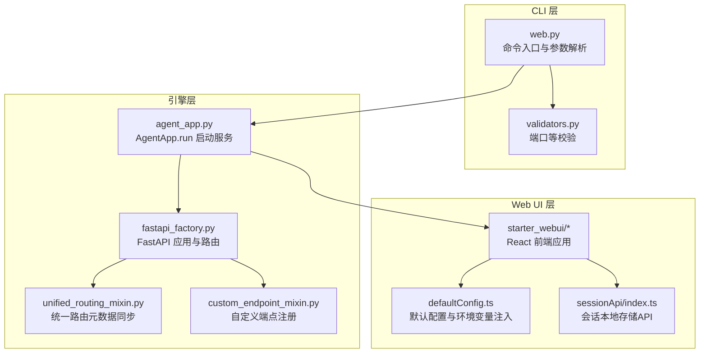
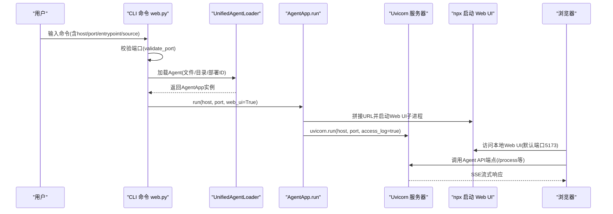
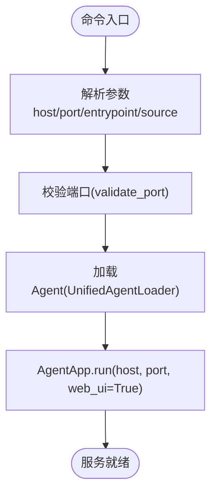
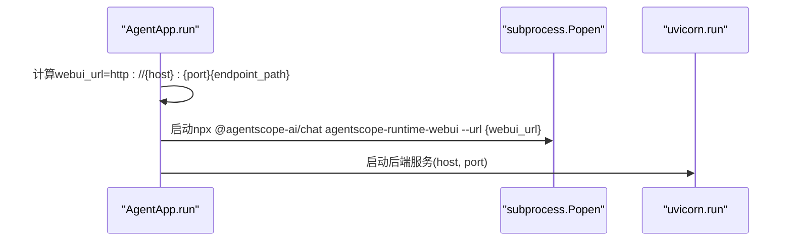
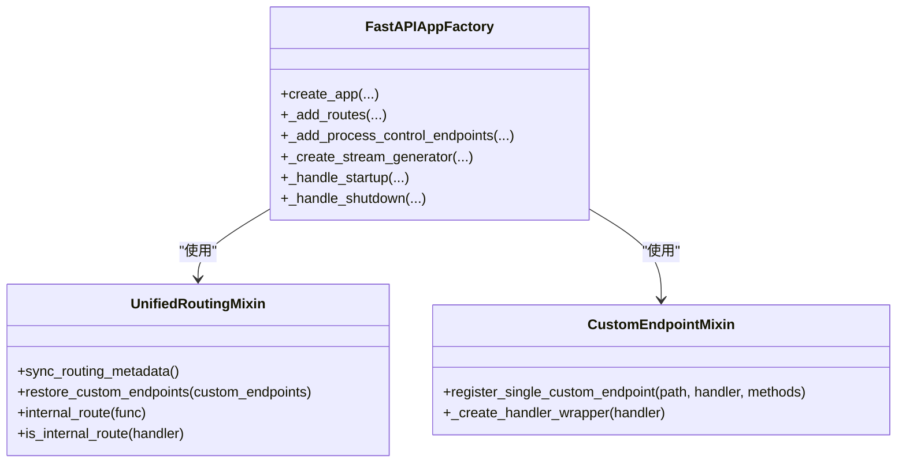
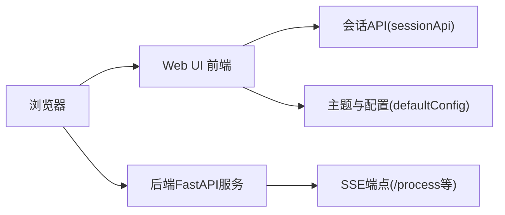
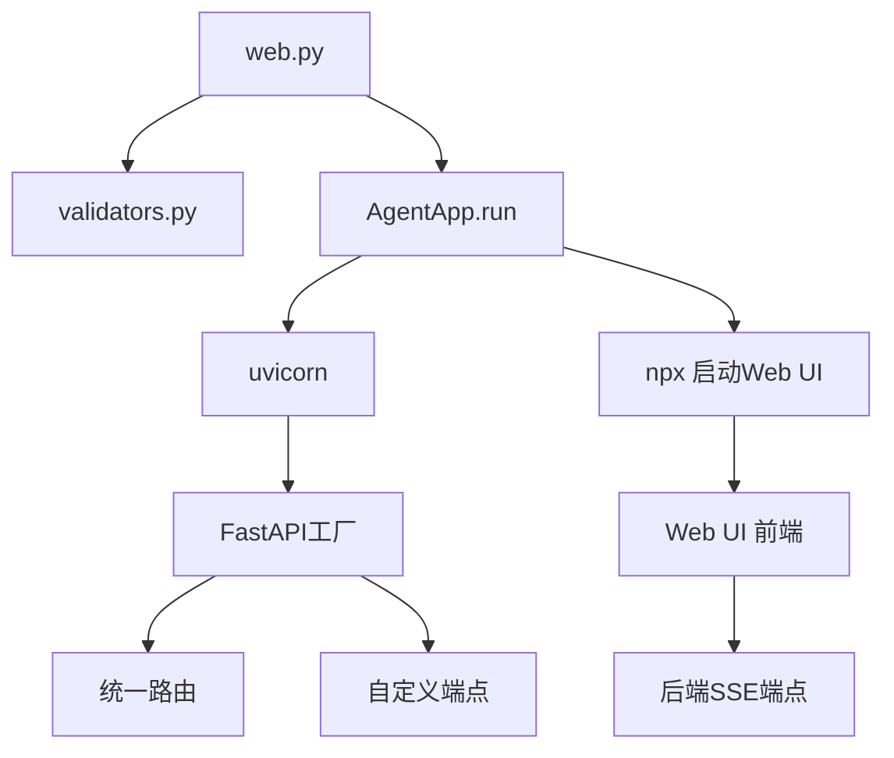

# web网页命令

<cite>
**本文引用的文件**
- [web.py](file://src/agentscope_runtime/cli/commands/web.py)
- [agent_app.py](file://src/agentscope_runtime/engine/app/agent_app.py)
- [validators.py](file://src/agentscope_runtime/cli/utils/validators.py)
- [fastapi_factory.py](file://src/agentscope_runtime/engine/deployers/utils/service_utils/fastapi_factory.py)
- [unified_routing_mixin.py](file://src/agentscope_runtime/engine/deployers/utils/service_utils/routing/unified_routing_mixin.py)
- [custom_endpoint_mixin.py](file://src/agentscope_runtime/engine/deployers/utils/service_utils/routing/custom_endpoint_mixin.py)
- [webui.md（中文）](file://cookbook/zh/webui.md)
- [advanced_deployment.md（中文）](file://cookbook/zh/advanced_deployment.md)
- [starter_webui README](file://web/starter_webui/README.md)
- [starter_webui package.json](file://web/starter_webui/package.json)
- [starter_webui vite.config.ts](file://web/starter_webui/vite.config.ts)
- [starter_webui App.tsx](file://web/starter_webui/src/App.tsx)
- [starter_webui main.tsx](file://web/starter_webui/src/main.tsx)
- [starter_webui Chat/index.tsx](file://web/starter_webui/src/components/Chat/index.tsx)
- [starter_webui OptionsPanel/OptionsEditor.tsx](file://web/starter_webui/src/components/Chat/OptionsPanel/OptionsEditor.tsx)
- [starter_webui OptionsPanel/defaultConfig.ts](file://web/starter_webui/src/components/Chat/OptionsPanel/defaultConfig.ts)
- [starter_webui sessionApi/index.ts](file://web/starter_webui/src/components/Chat/sessionApi/index.ts)
</cite>

## 目录
1. [简介](#简介)
2. [项目结构](#项目结构)
3. [核心组件](#核心组件)
4. [架构总览](#架构总览)
5. [详细组件分析](#详细组件分析)
6. [依赖分析](#依赖分析)
7. [性能考虑](#性能考虑)
8. [故障排查指南](#故障排查指南)
9. [结论](#结论)
10. [附录](#附录)

## 简介
本文件围绕“web网页命令”展开，系统性阐述如何通过命令行启动带Web界面的本地服务，包括本地Web服务器的启动流程、Web UI的访问方式与功能、命令参数选项（端口、主机绑定、入口文件等）、Web界面与后端API的交互机制、定制化与扩展方法，以及生产部署与环境配置建议。目标是帮助开发者从零到一掌握该命令的使用与扩展。

## 项目结构
“web网页命令”涉及三层：CLI层负责解析用户输入与加载Agent；引擎层负责启动后端服务与可选的Web UI子进程；Web UI层负责提供聊天与配置界面并与后端API交互。

**图表来源**
- [web.py:73-167](file://src/agentscope_runtime/cli/commands/web.py#L73-L167)
- [agent_app.py:881-943](file://src/agentscope_runtime/engine/app/agent_app.py#L881-L943)
- [fastapi_factory.py:114-353](file://src/agentscope_runtime/engine/deployers/utils/service_utils/fastapi_factory.py#L114-L353)
- [unified_routing_mixin.py:120-252](file://src/agentscope_runtime/engine/deployers/utils/service_utils/routing/unified_routing_mixin.py#L120-L252)
- [custom_endpoint_mixin.py:44-83](file://src/agentscope_runtime/engine/deployers/utils/service_utils/routing/custom_endpoint_mixin.py#L44-L83)
- [starter_webui README:1-75](file://web/starter_webui/README.md#L1-L75)
- [starter_webui package.json:1-37](file://web/starter_webui/package.json#L1-L37)
- [starter_webui vite.config.ts:1-12](file://web/starter_webui/vite.config.ts#L1-L12)
- [starter_webui defaultConfig.ts:1-41](file://web/starter_webui/src/components/Chat/OptionsPanel/defaultConfig.ts#L1-L41)
- [starter_webui sessionApi/index.ts:1-53](file://web/starter_webui/src/components/Chat/sessionApi/index.ts#L1-L53)

**章节来源**
- [web.py:73-167](file://src/agentscope_runtime/cli/commands/web.py#L73-L167)
- [agent_app.py:881-943](file://src/agentscope_runtime/engine/app/agent_app.py#L881-L943)
- [fastapi_factory.py:114-353](file://src/agentscope_runtime/engine/deployers/utils/service_utils/fastapi_factory.py#L114-L353)
- [unified_routing_mixin.py:120-252](file://src/agentscope_runtime/engine/deployers/utils/service_utils/routing/unified_routing_mixin.py#L120-L252)
- [custom_endpoint_mixin.py:44-83](file://src/agentscope_runtime/engine/deployers/utils/service_utils/routing/custom_endpoint_mixin.py#L44-L83)
- [starter_webui README:1-75](file://web/starter_webui/README.md#L1-L75)
- [starter_webui package.json:1-37](file://web/starter_webui/package.json#L1-L37)
- [starter_webui vite.config.ts:1-12](file://web/starter_webui/vite.config.ts#L1-L12)
- [starter_webui defaultConfig.ts:1-41](file://web/starter_webui/src/components/Chat/OptionsPanel/defaultConfig.ts#L1-L41)
- [starter_webui sessionApi/index.ts:1-53](file://web/starter_webui/src/components/Chat/sessionApi/index.ts#L1-L53)

## 核心组件
- CLI命令“web”
  - 解析参数：host、port、entrypoint、source
  - 校验端口范围
  - 加载Agent（文件/目录/部署ID）
  - 调用AgentApp.run(host, port, web_ui=True)启动后端服务并可选启动Web UI子进程
- AgentApp.run
  - 当web_ui=True时，拼接endpoint路径生成Web UI访问URL，调用npx启动Web UI子进程，随后uvicorn启动后端服务
- FastAPI工厂与路由
  - 提供健康检查、根路径、标准Agent API端点、进程控制端点等
  - 支持协议适配器注入端点、自定义端点注册与任务队列
- Web UI前端
  - 基于@agentscope-ai/chat组件库，提供主题、欢迎语、发送器配置、会话API等
  - 通过BASE_URL、TOKEN等环境变量注入API基础配置

**章节来源**
- [web.py:73-167](file://src/agentscope_runtime/cli/commands/web.py#L73-L167)
- [agent_app.py:881-943](file://src/agentscope_runtime/engine/app/agent_app.py#L881-L943)
- [fastapi_factory.py:420-548](file://src/agentscope_runtime/engine/deployers/utils/service_utils/fastapi_factory.py#L420-L548)
- [starter_webui defaultConfig.ts:1-41](file://web/starter_webui/src/components/Chat/OptionsPanel/defaultConfig.ts#L1-L41)

## 架构总览
下面的序列图展示了“web网页命令”的启动流程：CLI解析参数并加载Agent，随后AgentApp启动后端服务并在同一主机上启动Web UI子进程，最终浏览器访问Web UI并通过API与后端交互。

**图表来源**
- [web.py:119-150](file://src/agentscope_runtime/cli/commands/web.py#L119-L150)
- [agent_app.py:892-916](file://src/agentscope_runtime/engine/app/agent_app.py#L892-L916)
- [fastapi_factory.py:434-469](file://src/agentscope_runtime/engine/deployers/utils/service_utils/fastapi_factory.py#L434-L469)

**章节来源**
- [web.py:119-150](file://src/agentscope_runtime/cli/commands/web.py#L119-L150)
- [agent_app.py:892-916](file://src/agentscope_runtime/engine/app/agent_app.py#L892-L916)
- [fastapi_factory.py:434-469](file://src/agentscope_runtime/engine/deployers/utils/service_utils/fastapi_factory.py#L434-L469)

## 详细组件分析

### CLI命令“web”参数与行为
- 参数
  - source：必需，支持Python文件、项目目录、部署ID
  - --host/-h：主机绑定，默认0.0.0.0
  - --port/-p：端口，默认8080
  - --entrypoint/-e：目录型source的入口文件名
- 行为
  - 校验端口范围
  - 初始化状态管理器
  - 加载Agent（失败则退出）
  - 启动Agent服务并开启Web UI
  - 注册信号处理与进程清理

**图表来源**
- [web.py:73-167](file://src/agentscope_runtime/cli/commands/web.py#L73-L167)
- [validators.py:56-67](file://src/agentscope_runtime/cli/utils/validators.py#L56-L67)

**章节来源**
- [web.py:73-167](file://src/agentscope_runtime/cli/commands/web.py#L73-L167)
- [validators.py:56-67](file://src/agentscope_runtime/cli/utils/validators.py#L56-L67)

### AgentApp.run：本地Web服务器与Web UI子进程
- 当web_ui=True时：
  - 计算endpoint路径并拼接Web UI访问URL
  - Windows与非Windows平台分别采用shell或shlex拆分命令
  - 通过subprocess.Popen启动Web UI子进程
  - uvicorn.run启动后端服务
- 关键点
  - endpoint_path由引擎层提供，Web UI通过该路径与后端通信
  - 首次启动可能因依赖安装而耗时较长

**图表来源**
- [agent_app.py:892-916](file://src/agentscope_runtime/engine/app/agent_app.py#L892-L916)

**章节来源**
- [agent_app.py:892-916](file://src/agentscope_runtime/engine/app/agent_app.py#L892-L916)

### 后端API与路由：FastAPI工厂与统一路由
- 标准端点
  - GET /：返回服务信息与端点映射
  - GET /health：健康检查
  - POST {endpoint_path}：Agent API（SSE流）
  - POST /shutdown、/admin/shutdown、/admin/status：进程控制
- 协议适配与自定义端点
  - 协议适配器在runner可用后注入端点
  - 自定义端点通过统一路由元数据同步与恢复
  - 支持异步/同步处理器签名保持

**图表来源**
- [fastapi_factory.py:114-353](file://src/agentscope_runtime/engine/deployers/utils/service_utils/fastapi_factory.py#L114-L353)
- [unified_routing_mixin.py:120-252](file://src/agentscope_runtime/engine/deployers/utils/service_utils/routing/unified_routing_mixin.py#L120-L252)
- [custom_endpoint_mixin.py:44-83](file://src/agentscope_runtime/engine/deployers/utils/service_utils/routing/custom_endpoint_mixin.py#L44-L83)

**章节来源**
- [fastapi_factory.py:420-548](file://src/agentscope_runtime/engine/deployers/utils/service_utils/fastapi_factory.py#L420-L548)
- [unified_routing_mixin.py:120-252](file://src/agentscope_runtime/engine/deployers/utils/service_utils/routing/unified_routing_mixin.py#L120-L252)
- [custom_endpoint_mixin.py:44-83](file://src/agentscope_runtime/engine/deployers/utils/service_utils/routing/custom_endpoint_mixin.py#L44-L83)

### Web UI：访问方式、界面功能与交互
- 访问方式
  - 托管版WebUI：无需本地安装
  - 本地启动：npx或本地开发脚手架
  - Python内嵌：AgentApp.run(web_ui=True)
- 界面功能
  - 主题配置、欢迎语、发送器限制与免责声明
  - 会话管理（本地存储）
  - 右侧Header集成配置面板
  - 自定义工具渲染（示例：天气卡片）
- 与后端API交互
  - 通过BASE_URL与TOKEN注入API基础配置
  - 通过endpoint_path与后端SSE端点交互
  - 会话列表与历史通过localStorage持久化

**图表来源**
- [starter_webui README:1-75](file://web/starter_webui/README.md#L1-L75)
- [starter_webui defaultConfig.ts:1-41](file://web/starter_webui/src/components/Chat/OptionsPanel/defaultConfig.ts#L1-L41)
- [starter_webui sessionApi/index.ts:1-53](file://web/starter_webui/src/components/Chat/sessionApi/index.ts#L1-L53)
- [fastapi_factory.py:434-469](file://src/agentscope_runtime/engine/deployers/utils/service_utils/fastapi_factory.py#L434-L469)

**章节来源**
- [starter_webui README:1-75](file://web/starter_webui/README.md#L1-L75)
- [starter_webui package.json:1-37](file://web/starter_webui/package.json#L1-L37)
- [starter_webui vite.config.ts:1-12](file://web/starter_webui/vite.config.ts#L1-L12)
- [starter_webui App.tsx:1-21](file://web/starter_webui/src/App.tsx#L1-L21)
- [starter_webui main.tsx:1-10](file://web/starter_webui/src/main.tsx#L1-L10)
- [starter_webui Chat/index.tsx:1-49](file://web/starter_webui/src/components/Chat/index.tsx#L1-L49)
- [starter_webui OptionsPanel/OptionsEditor.tsx:1-59](file://web/starter_webui/src/components/Chat/OptionsPanel/OptionsEditor.tsx#L1-L59)
- [starter_webui OptionsPanel/defaultConfig.ts:1-41](file://web/starter_webui/src/components/Chat/OptionsPanel/defaultConfig.ts#L1-L41)
- [starter_webui sessionApi/index.ts:1-53](file://web/starter_webui/src/components/Chat/sessionApi/index.ts#L1-L53)
- [fastapi_factory.py:434-469](file://src/agentscope_runtime/engine/deployers/utils/service_utils/fastapi_factory.py#L434-L469)

### 定制化与扩展方法
- Web UI定制
  - 主题颜色、暗色模式、左侧Logo与标题
  - 发送器最大长度、免责声明
  - 欢迎语、头像、提示词列表
  - API基础URL与Token（通过环境变量注入）
- 自定义工具渲染
  - 在Web UI中注册特定工具的渲染组件
- 自定义端点
  - 通过统一路由元数据同步与恢复，注册自定义HTTP端点
  - 支持异步/同步处理器，保持FastAPI参数解析能力

**章节来源**
- [starter_webui OptionsPanel/defaultConfig.ts:1-41](file://web/starter_webui/src/components/Chat/OptionsPanel/defaultConfig.ts#L1-L41)
- [starter_webui Chat/index.tsx:1-49](file://web/starter_webui/src/components/Chat/index.tsx#L1-L49)
- [unified_routing_mixin.py:120-252](file://src/agentscope_runtime/engine/deployers/utils/service_utils/routing/unified_routing_mixin.py#L120-L252)
- [custom_endpoint_mixin.py:44-83](file://src/agentscope_runtime/engine/deployers/utils/service_utils/routing/custom_endpoint_mixin.py#L44-L83)

### 生产部署与环境配置
- 独立进程与外部服务
  - 可配置Redis作为内存与会话历史提供者
  - 通过ServicesConfig与部署模式进行生产化配置
- Kubernetes部署
  - 容器化部署、水平扩展、资源管理与健康检查
  - 需满足Docker与kubectl前置条件
- 环境变量与配置项
  - 支持通过环境变量或AgentRunConfig自定义部署参数（CPU、内存、网络模式、日志等）

**章节来源**
- [advanced_deployment.md（中文）:372-634](file://cookbook/zh/advanced_deployment.md#L372-L634)

## 依赖分析
- CLI到引擎
  - web.py依赖validators.py进行端口校验，依赖UnifiedAgentLoader加载Agent，最终调用AgentApp.run
- 引擎到Web UI
  - AgentApp.run在启动后端服务前，先通过npx启动Web UI子进程
- 引擎到API
  - FastAPI工厂创建应用、添加中间件与路由，注入协议适配器端点与自定义端点
- Web UI到后端
  - Web UI通过BASE_URL与endpoint_path访问后端SSE端点，会话通过localStorage持久化

**图表来源**
- [web.py:73-167](file://src/agentscope_runtime/cli/commands/web.py#L73-L167)
- [validators.py:56-67](file://src/agentscope_runtime/cli/utils/validators.py#L56-L67)
- [agent_app.py:892-916](file://src/agentscope_runtime/engine/app/agent_app.py#L892-L916)
- [fastapi_factory.py:114-353](file://src/agentscope_runtime/engine/deployers/utils/service_utils/fastapi_factory.py#L114-L353)
- [unified_routing_mixin.py:120-252](file://src/agentscope_runtime/engine/deployers/utils/service_utils/routing/unified_routing_mixin.py#L120-L252)
- [custom_endpoint_mixin.py:44-83](file://src/agentscope_runtime/engine/deployers/utils/service_utils/routing/custom_endpoint_mixin.py#L44-L83)

**章节来源**
- [web.py:73-167](file://src/agentscope_runtime/cli/commands/web.py#L73-L167)
- [validators.py:56-67](file://src/agentscope_runtime/cli/utils/validators.py#L56-L67)
- [agent_app.py:892-916](file://src/agentscope_runtime/engine/app/agent_app.py#L892-L916)
- [fastapi_factory.py:114-353](file://src/agentscope_runtime/engine/deployers/utils/service_utils/fastapi_factory.py#L114-L353)
- [unified_routing_mixin.py:120-252](file://src/agentscope_runtime/engine/deployers/utils/service_utils/routing/unified_routing_mixin.py#L120-L252)
- [custom_endpoint_mixin.py:44-83](file://src/agentscope_runtime/engine/deployers/utils/service_utils/routing/custom_endpoint_mixin.py#L44-L83)

## 性能考虑
- 首次启动耗时
  - Web UI首次启动可能因依赖安装而较慢，属于正常现象
- 流式响应
  - 后端通过SSE向Web UI推送流式数据，降低延迟并提升交互体验
- 进程管理
  - CLI注册信号处理与子进程清理，避免僵尸进程与资源泄露

**章节来源**
- [agent_app.py:898-902](file://src/agentscope_runtime/engine/app/agent_app.py#L898-L902)
- [fastapi_factory.py:596-627](file://src/agentscope_runtime/engine/deployers/utils/service_utils/fastapi_factory.py#L596-L627)
- [web.py:34-71](file://src/agentscope_runtime/cli/commands/web.py#L34-L71)

## 故障排查指南
- 端口占用
  - 确认--port参数在1-65535范围内且未被占用
- Web UI无法访问
  - 确认Agent服务已启动且endpoint_path正确
  - 确认浏览器访问的是Web UI默认端口（本地开发默认5173）
- 会话异常
  - 检查localStorage是否被清空或受限
  - 确认会话API实现与配置项一致
- 代理与跨域
  - 后端已启用CORS中间件，若仍遇跨域问题，请检查代理配置

**章节来源**
- [validators.py:56-67](file://src/agentscope_runtime/cli/utils/validators.py#L56-L67)
- [fastapi_factory.py:380-389](file://src/agentscope_runtime/engine/deployers/utils/service_utils/fastapi_factory.py#L380-L389)
- [starter_webui sessionApi/index.ts:1-53](file://web/starter_webui/src/components/Chat/sessionApi/index.ts#L1-L53)

## 结论
“web网页命令”将CLI、后端服务与Web UI有机整合，提供了从本地开发到生产的完整链路。通过明确的参数选项、健壮的进程管理与灵活的定制化能力，开发者可以快速搭建可交互的智能体管理界面，并在生产环境中按需扩展与部署。

## 附录
- 访问与使用参考
  - WebUI使用指南（中文）：[webui.md（中文）:1-101](file://cookbook/zh/webui.md#L1-L101)
- 开发与构建
  - Web UI脚手架：README、package.json、vite.config.ts
  - 前端入口与组件：App.tsx、main.tsx、Chat组件与OptionsPanel

**章节来源**
- [webui.md（中文）:1-101](file://cookbook/zh/webui.md#L1-L101)
- [starter_webui README:1-75](file://web/starter_webui/README.md#L1-L75)
- [starter_webui package.json:1-37](file://web/starter_webui/package.json#L1-L37)
- [starter_webui vite.config.ts:1-12](file://web/starter_webui/vite.config.ts#L1-L12)
- [starter_webui App.tsx:1-21](file://web/starter_webui/src/App.tsx#L1-L21)
- [starter_webui main.tsx:1-10](file://web/starter_webui/src/main.tsx#L1-L10)
- [starter_webui Chat/index.tsx:1-49](file://web/starter_webui/src/components/Chat/index.tsx#L1-L49)
- [starter_webui OptionsPanel/OptionsEditor.tsx:1-59](file://web/starter_webui/src/components/Chat/OptionsPanel/OptionsEditor.tsx#L1-L59)
- [starter_webui OptionsPanel/defaultConfig.ts:1-41](file://web/starter_webui/src/components/Chat/OptionsPanel/defaultConfig.ts#L1-L41)
- [starter_webui sessionApi/index.ts:1-53](file://web/starter_webui/src/components/Chat/sessionApi/index.ts#L1-L53)