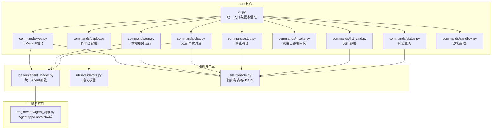
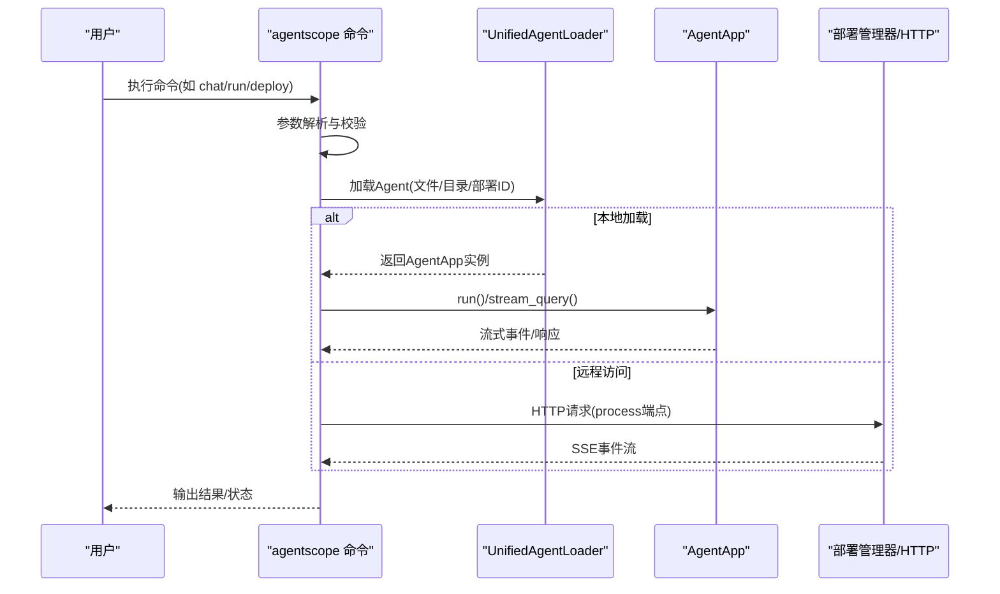
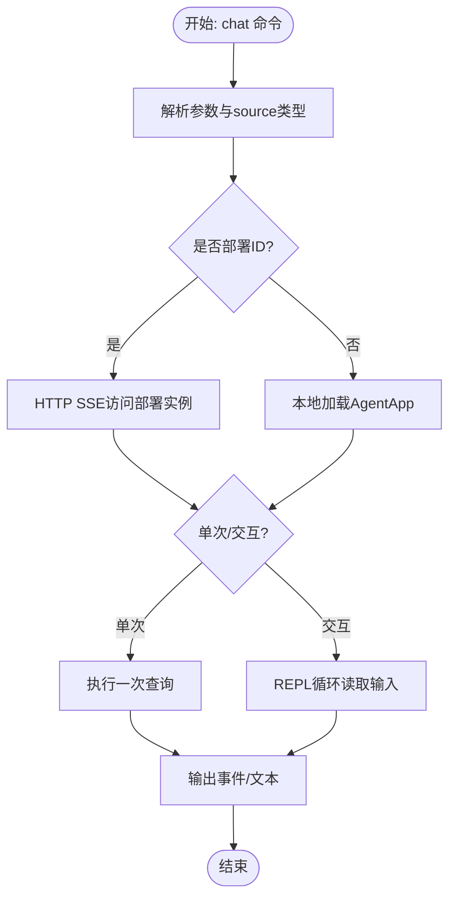
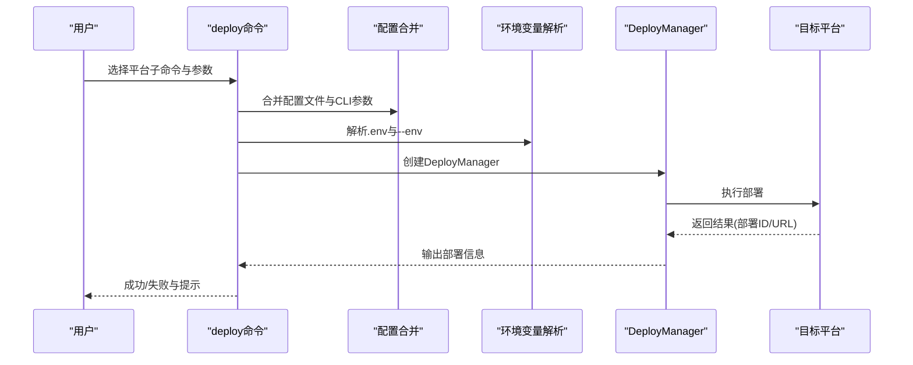
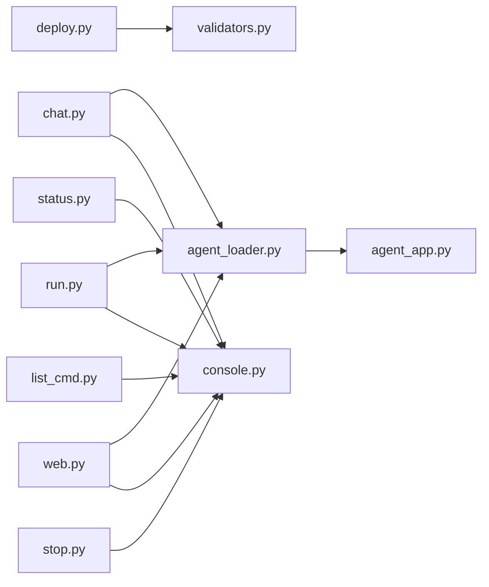

# 命令行工具

<cite>
**本文档引用的文件**
- [cli.py](file://src/agentscope_runtime/cli/cli.py)
- [chat.py](file://src/agentscope_runtime/cli/commands/chat.py)
- [run.py](file://src/agentscope_runtime/cli/commands/run.py)
- [deploy.py](file://src/agentscope_runtime/cli/commands/deploy.py)
- [status.py](file://src/agentscope_runtime/cli/commands/status.py)
- [stop.py](file://src/agentscope_runtime/cli/commands/stop.py)
- [invoke.py](file://src/agentscope_runtime/cli/commands/invoke.py)
- [sandbox.py](file://src/agentscope_runtime/cli/commands/sandbox.py)
- [list_cmd.py](file://src/agentscope_runtime/cli/commands/list_cmd.py)
- [web.py](file://src/agentscope_runtime/cli/commands/web.py)
- [agent_loader.py](file://src/agentscope_runtime/cli/loaders/agent_loader.py)
- [validators.py](file://src/agentscope_runtime/cli/utils/validators.py)
- [console.py](file://src/agentscope_runtime/cli/utils/console.py)
- [agent_app.py](file://src/agentscope_runtime/engine/app/agent_app.py)
- [README.md](file://README.md)
</cite>

## 目录
1. [简介](#简介)
2. [项目结构](#项目结构)
3. [核心组件](#核心组件)
4. [架构总览](#架构总览)
5. [详细组件分析](#详细组件分析)
6. [依赖关系分析](#依赖关系分析)
7. [性能考虑](#性能考虑)
8. [故障排除指南](#故障排除指南)
9. [结论](#结论)
10. [附录](#附录)

## 简介
本文件为 AgentScope Runtime 命令行工具（CLI）的全面技术文档，涵盖 CLI 架构设计、各命令功能与用法、与 AgentApp 和部署管理器的集成方式、批量与自动化脚本编写方法，以及故障排除与调试技巧。CLI 基于 Click 框架构建，统一入口通过 agentscope 命令提供多个子命令，支持本地开发调试、交互式对话、服务运行、部署到多平台、状态查询、停止清理、沙箱管理等能力。

## 项目结构
CLI 采用模块化组织，按命令分组存放于 commands 目录，公共加载器与工具位于 loaders 与 utils 子目录，核心应用 AgentApp 位于 engine/app 下，与 CLI 的交互主要体现在加载与运行 AgentApp 实例。

**图表来源**
- [cli.py:1-64](file://src/agentscope_runtime/cli/cli.py#L1-L64)
- [chat.py:1-816](file://src/agentscope_runtime/cli/commands/chat.py#L1-L816)
- [run.py:1-177](file://src/agentscope_runtime/cli/commands/run.py#L1-L177)
- [deploy.py:1-800](file://src/agentscope_runtime/cli/commands/deploy.py#L1-L800)
- [status.py:1-61](file://src/agentscope_runtime/cli/commands/status.py#L1-L61)
- [stop.py:1-210](file://src/agentscope_runtime/cli/commands/stop.py#L1-L210)
- [invoke.py:1-59](file://src/agentscope_runtime/cli/commands/invoke.py#L1-L59)
- [list_cmd.py:1-104](file://src/agentscope_runtime/cli/commands/list_cmd.py#L1-L104)
- [web.py:1-167](file://src/agentscope_runtime/cli/commands/web.py#L1-L167)
- [sandbox.py:1-129](file://src/agentscope_runtime/cli/commands/sandbox.py#L1-L129)
- [agent_loader.py:1-296](file://src/agentscope_runtime/cli/loaders/agent_loader.py#L1-L296)
- [validators.py:1-119](file://src/agentscope_runtime/cli/utils/validators.py#L1-L119)
- [console.py:1-379](file://src/agentscope_runtime/cli/utils/console.py#L1-L379)
- [agent_app.py:1-200](file://src/agentscope_runtime/engine/app/agent_app.py#L1-L200)

**章节来源**
- [cli.py:1-64](file://src/agentscope_runtime/cli/cli.py#L1-L64)
- [README.md:115-140](file://README.md#L115-L140)

## 核心组件
- 统一入口与版本：cli.py 定义 Click Group，注册所有子命令，并设置默认环境变量以控制追踪日志输出。
- 命令分组：commands 目录下按功能划分命令，如 chat、run、deploy、status、stop、invoke、list、web、sandbox。
- 加载器：agent_loader.py 提供统一的 AgentApp 加载逻辑，支持文件、目录与部署 ID 三种源类型。
- 工具与校验：validators.py 提供输入校验；console.py 提供富文本输出、表格与 JSON 格式化。
- 引擎应用：agent_app.py 是基于 FastAPI 的 AgentApp，提供流式响应、协议适配、生命周期管理等能力。

**章节来源**
- [cli.py:30-54](file://src/agentscope_runtime/cli/cli.py#L30-L54)
- [agent_loader.py:238-296](file://src/agentscope_runtime/cli/loaders/agent_loader.py#L238-L296)
- [console.py:78-185](file://src/agentscope_runtime/cli/utils/console.py#L78-L185)
- [agent_app.py:60-200](file://src/agentscope_runtime/engine/app/agent_app.py#L60-L200)

## 架构总览
CLI 通过 Click 注册命令，命令内部根据 source 类型选择本地加载或远程部署访问路径。本地模式通过 UnifiedAgentLoader 将文件/目录转换为 AgentApp 实例，再由 AgentApp.run 或 stream_query 提供交互或服务化能力；远程模式通过 HTTP SSE 访问已部署实例。

**图表来源**
- [chat.py:125-247](file://src/agentscope_runtime/cli/commands/chat.py#L125-L247)
- [run.py:110-172](file://src/agentscope_runtime/cli/commands/run.py#L110-L172)
- [agent_loader.py:238-296](file://src/agentscope_runtime/cli/loaders/agent_loader.py#L238-L296)
- [agent_app.py:60-200](file://src/agentscope_runtime/engine/app/agent_app.py#L60-L200)

## 详细组件分析

### chat 命令：交互式与单次对话
- 功能概述：支持交互式聊天与单次查询；source 可为文件、目录或部署 ID；支持会话 ID、用户 ID、详细日志开关。
- 关键流程：
  - 解析 source 并判断类型（部署 ID 或本地文件/目录）
  - 部署 ID：通过 HTTP SSE 调用 process 端点，支持单次与交互模式
  - 本地文件/目录：使用 UnifiedAgentLoader 加载 AgentApp，构建 Runner，执行 stream_query
  - 支持过滤“推理消息”，非详细模式下可隐藏推理内容
- 参数与示例：
  - --query/-q：单次查询
  - --session-id：会话标识
  - --user-id：用户标识
  - --verbose/-v：详细模式（显示推理与日志）
  - --entrypoint/-e：目录源的入口文件
- 输出格式：SSE 事件流或直接打印文本；支持 JSON 日志与富文本输出

**图表来源**
- [chat.py:44-247](file://src/agentscope_runtime/cli/commands/chat.py#L44-L247)

**章节来源**
- [chat.py:44-247](file://src/agentscope_runtime/cli/commands/chat.py#L44-L247)
- [agent_loader.py:238-296](file://src/agentscope_runtime/cli/loaders/agent_loader.py#L238-L296)
- [console.py:266-340](file://src/agentscope_runtime/cli/utils/console.py#L266-L340)

### run 命令：本地服务运行
- 功能概述：启动 AgentApp 服务，持续监听 HTTP 请求；不进入交互模式，适合生产或 API 调用。
- 关键流程：
  - 校验 verbose 与日志级别
  - 判断 source 是否为部署 ID（若是则提示不支持）
  - 使用 UnifiedAgentLoader 加载 AgentApp 并调用 run(host, port)
- 参数与示例：
  - --host/-h：绑定地址，默认 0.0.0.0
  - --port/-p：端口，默认 8080
  - --verbose/-v：详细日志
  - --entrypoint/-e：目录源入口文件
- 输出格式：标准输出打印服务状态与日志

**章节来源**
- [run.py:26-172](file://src/agentscope_runtime/cli/commands/run.py#L26-L172)
- [agent_loader.py:238-296](file://src/agentscope_runtime/cli/loaders/agent_loader.py#L238-L296)

### deploy 命令：多平台部署
- 功能概述：支持本地、Kubernetes、Knative、Kruise、ModelStudio、AgentRun、PAI 等平台部署。
- 关键流程：
  - 校验 source（文件/目录），解析入口文件
  - 合并配置文件与 CLI 参数（CLI 优先）
  - 解析环境变量（支持 .env 文件与 --env）
  - 创建对应 DeployManager 并执行 deploy
- 子命令与平台：
  - local：本地分离进程部署
  - modelstudio：阿里云 ModelStudio
  - agentrun：阿里云 AgentRun
  - k8s/knative/kruise：容器编排平台
  - pai：阿里云 PAI
- 参数要点：
  - --name/--entrypoint/--env/--env-file/--config
  - 平台特定参数（如 region、cpu、memory 等）

**图表来源**
- [deploy.py:320-767](file://src/agentscope_runtime/cli/commands/deploy.py#L320-L767)

**章节来源**
- [deploy.py:320-767](file://src/agentscope_runtime/cli/commands/deploy.py#L320-L767)
- [validators.py:13-54](file://src/agentscope_runtime/cli/utils/validators.py#L13-L54)

### status 命令：部署状态查询
- 功能概述：查询指定部署 ID 的详细状态，支持文本与 JSON 输出。
- 参数：
  - --output-format/-f：text 或 json
- 输出：
  - 文本：键值表格
  - JSON：结构化字典

**章节来源**
- [status.py:17-56](file://src/agentscope_runtime/cli/commands/status.py#L17-L56)
- [console.py:293-340](file://src/agentscope_runtime/cli/utils/console.py#L293-L340)

### stop 命令：停止与清理
- 功能概述：根据部署 ID 调用对应平台的停止方法进行资源清理，并更新本地状态。
- 关键流程：
  - 校验部署存在性与状态
  - 根据 platform 创建 DeployManager
  - 调用 stop(deploy_id)，处理成功/失败
- 参数：
  - --yes/-y：跳过确认
- 注意：若平台不可用或导入失败，会提示无法创建 DeployManager

**章节来源**
- [stop.py:99-205](file://src/agentscope_runtime/cli/commands/stop.py#L99-L205)

### invoke 命令：调用已部署实例
- 功能概述：对已部署的 Agent 进行一次性调用，等价于 chat <deploy_id>。
- 参数：
  - --query/-q、--session-id、--user-id
- 行为：委托给 chat 命令实现

**章节来源**
- [invoke.py:11-54](file://src/agentscope_runtime/cli/commands/invoke.py#L11-L54)
- [chat.py:76-109](file://src/agentscope_runtime/cli/commands/chat.py#L76-L109)

### list 命令：列出部署
- 功能概述：列出所有部署，支持按状态与平台过滤，输出表格或 JSON。
- 参数：
  - --status/-s、--platform/-p、--output-format/-f

**章节来源**
- [list_cmd.py:19-99](file://src/agentscope_runtime/cli/commands/list_cmd.py#L19-L99)
- [console.py:221-264](file://src/agentscope_runtime/cli/utils/console.py#L221-L264)

### web 命令：带 Web UI 启动
- 功能概述：在单进程中启动 AgentApp 并启用 Web UI，首次启动可能安装依赖。
- 参数：
  - --host/-h、--port/-p、--entrypoint/-e
- 清理：注册信号处理器与 atexit，在退出时终止子进程

**章节来源**
- [web.py:73-162](file://src/agentscope_runtime/cli/commands/web.py#L73-L162)

### sandbox 命令：沙箱管理
- 功能概述：封装 MCP 服务器、沙箱管理器服务器与沙箱构建工具的命令入口。
- 子命令：
  - mcp：启动 MCP 服务器
  - server：启动沙箱管理器服务器
  - build：构建沙箱环境
- 行为：通过 sys.argv 代理到对应 runtime-* 可执行程序

**章节来源**
- [sandbox.py:14-125](file://src/agentscope_runtime/cli/commands/sandbox.py#L14-L125)

## 依赖关系分析
- 命令到加载器：chat、run、web 命令均依赖 UnifiedAgentLoader 将 source 转换为 AgentApp。
- 加载器到应用：UnifiedAgentLoader -> FileLoader/ProjectLoader/DeploymentLoader -> AgentApp。
- 命令到工具：validators 提供输入校验；console 提供统一输出格式化。
- 部署链路：deploy 命令根据平台动态导入对应 DeployManager 并执行部署。

**图表来源**
- [chat.py:1-816](file://src/agentscope_runtime/cli/commands/chat.py#L1-L816)
- [run.py:1-177](file://src/agentscope_runtime/cli/commands/run.py#L1-L177)
- [web.py:1-167](file://src/agentscope_runtime/cli/commands/web.py#L1-L167)
- [deploy.py:1-800](file://src/agentscope_runtime/cli/commands/deploy.py#L1-L800)
- [status.py:1-61](file://src/agentscope_runtime/cli/commands/status.py#L1-L61)
- [list_cmd.py:1-104](file://src/agentscope_runtime/cli/commands/list_cmd.py#L1-L104)
- [stop.py:1-210](file://src/agentscope_runtime/cli/commands/stop.py#L1-L210)
- [agent_loader.py:1-296](file://src/agentscope_runtime/cli/loaders/agent_loader.py#L1-L296)
- [validators.py:1-119](file://src/agentscope_runtime/cli/utils/validators.py#L1-L119)
- [console.py:1-379](file://src/agentscope_runtime/cli/utils/console.py#L1-L379)
- [agent_app.py:1-200](file://src/agentscope_runtime/engine/app/agent_app.py#L1-L200)

**章节来源**
- [agent_loader.py:238-296](file://src/agentscope_runtime/cli/loaders/agent_loader.py#L238-L296)
- [validators.py:13-54](file://src/agentscope_runtime/cli/utils/validators.py#L13-L54)
- [console.py:221-340](file://src/agentscope_runtime/cli/utils/console.py#L221-L340)

## 性能考虑
- 流式输出：chat 与 AgentApp 的 stream_query 采用 SSE 事件流，减少内存占用，提升实时性。
- 日志级别控制：通过环境变量与 verbose 控制日志输出，避免在生产中产生过多日志开销。
- 本地 vs 远程：本地模式避免网络往返，延迟更低；远程模式需关注网络抖动与超时。
- 并发与异步：AgentApp 支持异步任务与并发执行，建议在高并发场景下合理配置资源与队列。

[本节为通用指导，无需具体文件分析]

## 故障排除指南
- 输入校验错误：
  - 源必须为 .py 文件、目录或存在的部署 ID；端口范围 1-65535；URL 必须以 http/https 开头
- 加载失败：
  - 文件/目录未找到、入口文件不存在、AgentApp 导出不规范
- 远程访问问题：
  - 部署未配置 URL、ModelStudio 不支持 HTTP 查询、网络连接异常
- 停止失败：
  - 平台 DeployManager 未正确导入或创建，需检查平台依赖与配置
- 输出格式：
  - 使用 --output-format=json 获取结构化数据便于脚本解析

**章节来源**
- [validators.py:56-119](file://src/agentscope_runtime/cli/utils/validators.py#L56-L119)
- [chat.py:125-161](file://src/agentscope_runtime/cli/commands/chat.py#L125-L161)
- [stop.py:23-96](file://src/agentscope_runtime/cli/commands/stop.py#L23-L96)
- [console.py:266-340](file://src/agentscope_runtime/cli/utils/console.py#L266-L340)

## 结论
该 CLI 以 Click 为基础，围绕 AgentApp 构建了从本地开发到多平台部署的一体化工具链。通过统一的加载器与丰富的命令组合，开发者可以高效地完成 Agent 的开发、测试、部署与运维。配合 SSE 流式输出与结构化 JSON 输出，CLI 既适合交互式使用，也便于自动化与批处理集成。

[本节为总结，无需具体文件分析]

## 附录

### 安装与配置
- 从 PyPI 安装：pip install agentscope-runtime；可选安装扩展包
- 从源码安装：pip install -e .
- 环境变量：
  - TRACE_ENABLE_LOG：控制追踪日志输出（默认 false）
  - CONTAINER_DEPLOYMENT：沙箱后端选择（docker/gvisor/boxlite 等）
  - 其他平台相关环境变量见各部署平台要求

**章节来源**
- [README.md:115-140](file://README.md#L115-L140)

### 使用示例与最佳实践
- 交互式对话：agentscope chat agent.py --verbose
- 单次查询：agentscope chat agent.py --query "你好"
- 本地服务：agentscope run agent.py --host 0.0.0.0 --port 8090
- 部署到本地：agentscope deploy local agent.py --entrypoint app.py
- 查询状态：agentscope status local_YYYYMMDD_HHMMSS_xxx
- 停止部署：agentscope stop local_YYYYMMDD_HHMMSS_xxx --yes
- 调用已部署：agentscope invoke local_YYYYMMDD_HHMMSS_xxx --query "你好"
- 列出部署：agentscope list --status running --output-format table
- 带 Web UI：agentscope web agent.py --host 0.0.0.0 --port 8080

**章节来源**
- [chat.py:84-109](file://src/agentscope_runtime/cli/commands/chat.py#L84-L109)
- [run.py:62-91](file://src/agentscope_runtime/cli/commands/run.py#L62-L91)
- [deploy.py:364-446](file://src/agentscope_runtime/cli/commands/deploy.py#L364-L446)
- [status.py:27-37](file://src/agentscope_runtime/cli/commands/status.py#L27-L37)
- [stop.py:108-125](file://src/agentscope_runtime/cli/commands/stop.py#L108-L125)
- [invoke.py:30-44](file://src/agentscope_runtime/cli/commands/invoke.py#L30-L44)
- [list_cmd.py:44-60](file://src/agentscope_runtime/cli/commands/list_cmd.py#L44-L60)
- [web.py:96-118](file://src/agentscope_runtime/cli/commands/web.py#L96-L118)

### 与 AgentApp 和部署管理器的集成
- AgentApp：作为 CLI 的核心运行时，提供流式 API、协议适配与生命周期管理
- 部署管理器：根据平台动态导入并调用对应 DeployManager，完成打包、上传、调度与清理
- 状态管理：通过 DeploymentStateManager 维护本地部署元数据，支持查询、列表与格式化输出

**章节来源**
- [agent_app.py:60-200](file://src/agentscope_runtime/engine/app/agent_app.py#L60-L200)
- [deploy.py:320-767](file://src/agentscope_runtime/cli/commands/deploy.py#L320-L767)
- [status.py:38-53](file://src/agentscope_runtime/cli/commands/status.py#L38-L53)
- [list_cmd.py:61-95](file://src/agentscope_runtime/cli/commands/list_cmd.py#L61-L95)

### 批量操作与自动化脚本
- 使用 --output-format=json 获取结构化输出，便于脚本解析与二次处理
- 结合 list 命令筛选状态与平台，批量执行 status/stop/invoke
- 在 CI/CD 中使用 run 命令启动服务并通过 HTTP SSE 接收事件流

**章节来源**
- [list_cmd.py:32-38](file://src/agentscope_runtime/cli/commands/list_cmd.py#L32-L38)
- [status.py:20-25](file://src/agentscope_runtime/cli/commands/status.py#L20-L25)
- [chat.py:538-641](file://src/agentscope_runtime/cli/commands/chat.py#L538-L641)