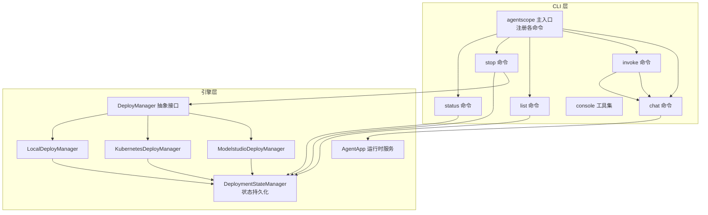
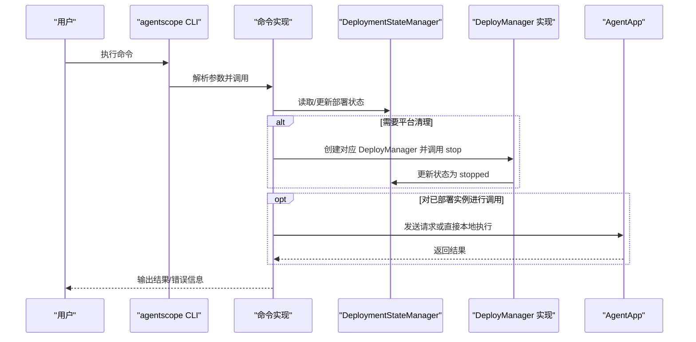
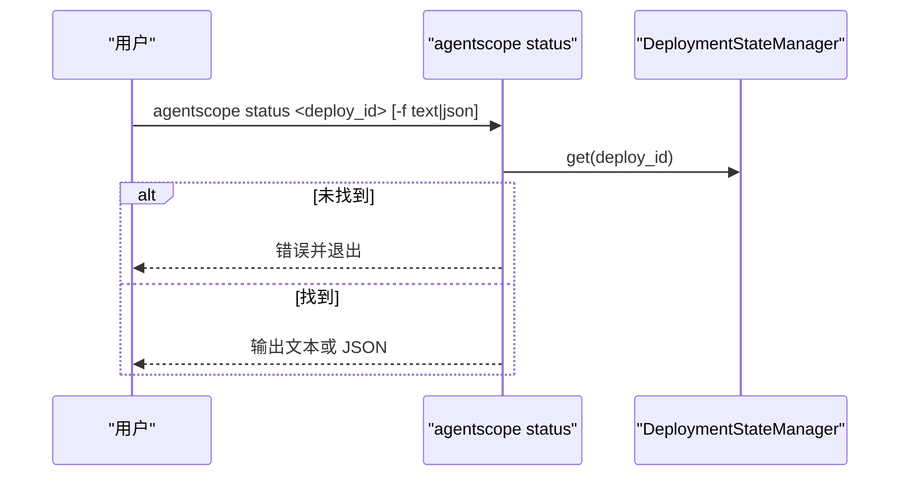
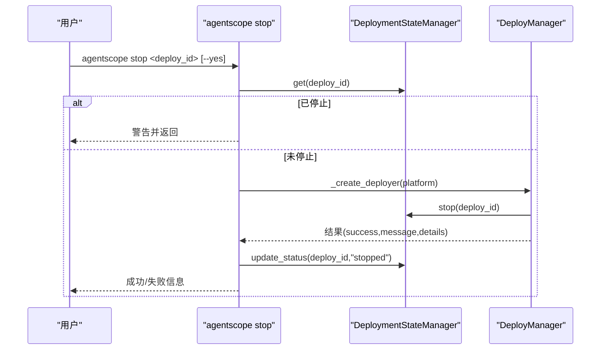
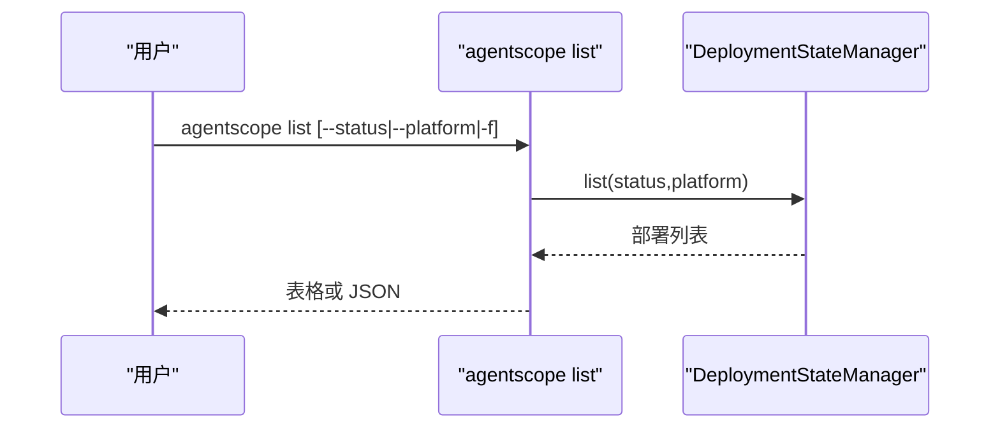
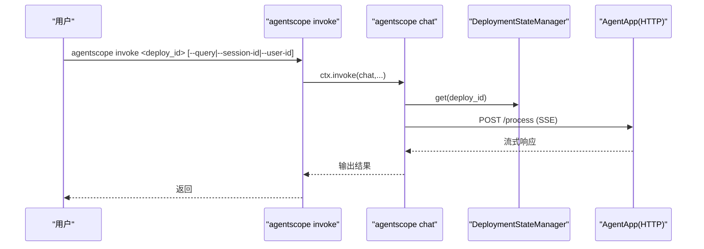
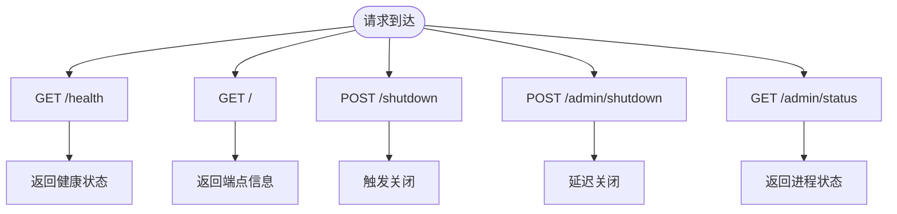
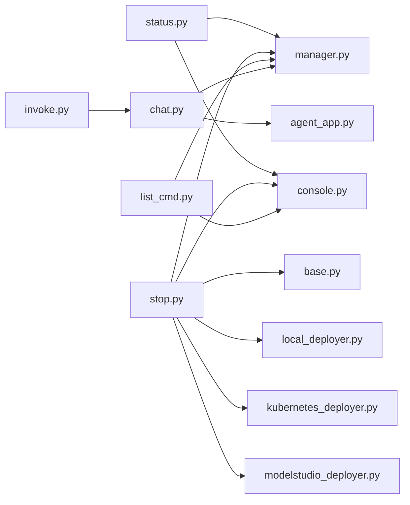

# 管理命令集合

<cite>
**本文档引用的文件**
- [cli.py](file://src/agentscope_runtime/cli/cli.py)
- [status.py](file://src/agentscope_runtime/cli/commands/status.py)
- [stop.py](file://src/agentscope_runtime/cli/commands/stop.py)
- [list_cmd.py](file://src/agentscope_runtime/cli/commands/list_cmd.py)
- [invoke.py](file://src/agentscope_runtime/cli/commands/invoke.py)
- [chat.py](file://src/agentscope_runtime/cli/commands/chat.py)
- [console.py](file://src/agentscope_runtime/cli/utils/console.py)
- [manager.py](file://src/agentscope_runtime/engine/deployers/state/manager.py)
- [base.py](file://src/agentscope_runtime/engine/deployers/base.py)
- [local_deployer.py](file://src/agentscope_runtime/engine/deployers/local_deployer.py)
- [kubernetes_deployer.py](file://src/agentscope_runtime/engine/deployers/kubernetes_deployer.py)
- [modelstudio_deployer.py](file://src/agentscope_runtime/engine/deployers/modelstudio_deployer.py)
- [agent_app.py](file://src/agentscope_runtime/engine/app/agent_app.py)
- [local_deploy_config.yaml](file://examples/deployments/local_deploy_config.yaml)
- [agentrun_deploy_config.yaml](file://examples/deployments/agentrun_deploy_config.yaml)
- [modelstudio_deploy_config.yaml](file://examples/deployments/modelstudio_deploy_config.yaml)
</cite>

## 目录
1. [简介](#简介)
2. [项目结构](#项目结构)
3. [核心组件](#核心组件)
4. [架构总览](#架构总览)
5. [详细组件分析](#详细组件分析)
6. [依赖关系分析](#依赖关系分析)
7. [性能考虑](#性能考虑)
8. [故障排除指南](#故障排除指南)
9. [结论](#结论)
10. [附录](#附录)

## 简介
本文件系统性梳理并文档化管理命令集合，涵盖以下命令的功能、参数、输出格式、使用场景与最佳实践：status 状态查询、stop 停止服务、list 列出资源、invoke 调用工具。文档还解释了命令与部署管理器、AgentApp 的交互机制，以及在批量管理和自动化运维中的使用模式，并提供故障排除与运维监控的实用技巧。

## 项目结构
管理命令位于 CLI 子系统中，通过 Click 注册为统一入口；状态管理与部署管理器位于引擎模块；AgentApp 提供运行时服务与进程控制端点。

**图表来源**
- [cli.py:45-54](file://src/agentscope_runtime/cli/cli.py#L45-L54)
- [status.py:26-56](file://src/agentscope_runtime/cli/commands/status.py#L26-L56)
- [stop.py:107-205](file://src/agentscope_runtime/cli/commands/stop.py#L107-L205)
- [list_cmd.py:39-99](file://src/agentscope_runtime/cli/commands/list_cmd.py#L39-L99)
- [invoke.py:29-54](file://src/agentscope_runtime/cli/commands/invoke.py#L29-L54)
- [chat.py:76-247](file://src/agentscope_runtime/cli/commands/chat.py#L76-L247)
- [manager.py:17-389](file://src/agentscope_runtime/engine/deployers/state/manager.py#L17-L389)
- [base.py:9-44](file://src/agentscope_runtime/engine/deployers/base.py#L9-L44)
- [local_deployer.py:27-645](file://src/agentscope_runtime/engine/deployers/local_deployer.py#L27-L645)
- [kubernetes_deployer.py:48-391](file://src/agentscope_runtime/engine/deployers/kubernetes_deployer.py#L48-L391)
- [modelstudio_deployer.py:544-947](file://src/agentscope_runtime/engine/deployers/modelstudio_deployer.py#L544-L947)
- [agent_app.py:60-642](file://src/agentscope_runtime/engine/app/agent_app.py#L60-L642)

**章节来源**
- [cli.py:45-54](file://src/agentscope_runtime/cli/cli.py#L45-L54)
- [manager.py:17-389](file://src/agentscope_runtime/engine/deployers/state/manager.py#L17-L389)

## 核心组件
- CLI 主入口：注册并分发命令，统一版本与上下文。
- 命令实现：status、stop、list、invoke、chat 等。
- 控制台工具：统一输出样式、表格渲染、JSON 输出、确认提示。
- 部署状态管理：本地 JSON 文件持久化，支持备份、迁移、校验与过滤。
- 部署管理器：抽象接口与多平台实现（本地、K8s、ModelStudio 等）。
- AgentApp：运行时服务，提供健康检查、进程控制端点与流式响应。

**章节来源**
- [cli.py:30-64](file://src/agentscope_runtime/cli/cli.py#L30-L64)
- [console.py:78-379](file://src/agentscope_runtime/cli/utils/console.py#L78-L379)
- [manager.py:17-389](file://src/agentscope_runtime/engine/deployers/state/manager.py#L17-L389)
- [base.py:9-44](file://src/agentscope_runtime/engine/deployers/base.py#L9-L44)
- [agent_app.py:60-642](file://src/agentscope_runtime/engine/app/agent_app.py#L60-L642)

## 架构总览
管理命令通过 CLI 与引擎层解耦：命令负责参数解析与用户交互，引擎层负责状态与部署逻辑。AgentApp 作为运行时服务，提供统一的进程控制与查询接口。

**图表来源**
- [cli.py:45-54](file://src/agentscope_runtime/cli/cli.py#L45-L54)
- [stop.py:157-190](file://src/agentscope_runtime/cli/commands/stop.py#L157-L190)
- [manager.py:243-324](file://src/agentscope_runtime/engine/deployers/state/manager.py#L243-L324)
- [base.py:23-43](file://src/agentscope_runtime/engine/deployers/base.py#L23-L43)
- [agent_app.py:382-642](file://src/agentscope_runtime/engine/app/agent_app.py#L382-L642)

## 详细组件分析

### status 状态查询命令
- 功能：根据部署 ID 查询部署详情，支持文本与 JSON 输出。
- 参数：
  - deploy_id：必填，部署标识符。
  - --output-format/-f：可选，text 或 json，默认 text。
- 行为：
  - 初始化 DeploymentStateManager。
  - 读取指定部署记录，不存在则报错退出。
  - 根据输出格式打印表格或 JSON。
- 使用场景：
  - 日常巡检、CI/CD 回传状态、自动化脚本解析。
- 输出格式：
  - 文本：键值对表格，包含 ID、平台、状态、创建时间、URL、代理源等。
  - JSON：完整部署字典序列化。
- 与 AgentApp 的关系：不直接访问运行时服务，仅读取本地状态文件。

**图表来源**
- [status.py:26-56](file://src/agentscope_runtime/cli/commands/status.py#L26-L56)
- [manager.py:243-259](file://src/agentscope_runtime/engine/deployers/state/manager.py#L243-L259)
- [console.py:293-340](file://src/agentscope_runtime/cli/utils/console.py#L293-L340)
- [console.py:266-291](file://src/agentscope_runtime/cli/utils/console.py#L266-L291)

**章节来源**
- [status.py:17-56](file://src/agentscope_runtime/cli/commands/status.py#L17-L56)
- [manager.py:243-259](file://src/agentscope_runtime/engine/deployers/state/manager.py#L243-L259)
- [console.py:293-340](file://src/agentscope_runtime/cli/utils/console.py#L293-L340)
- [console.py:266-291](file://src/agentscope_runtime/cli/utils/console.py#L266-L291)

### stop 停止服务命令
- 功能：按平台清理部署资源并更新本地状态为 stopped。
- 参数：
  - deploy_id：必填。
  - --yes/-y：可选，跳过确认。
- 行为：
  - 读取部署状态，若已是 stopped 则告警返回。
  - 根据 platform 字段动态创建对应 DeployManager。
  - 调用 deployer.stop(deploy_id)，成功后更新状态。
  - 若平台清理失败，阻止标记为 stopped 并提示使用 --force 模式（注：当前实现未提供 --force 选项，失败即退出）。
- 支持平台：
  - local、k8s、modelstudio、agentrun、kruise、pai。
- 与 AgentApp 的关系：
  - 本地模式（detached_process）可通过 /shutdown 端点触发优雅关闭。
  - 其他模式通过进程/资源清理器完成。

**图表来源**
- [stop.py:107-205](file://src/agentscope_runtime/cli/commands/stop.py#L107-L205)
- [manager.py:243-324](file://src/agentscope_runtime/engine/deployers/state/manager.py#L243-L324)
- [base.py:23-43](file://src/agentscope_runtime/engine/deployers/base.py#L23-L43)
- [local_deployer.py:415-511](file://src/agentscope_runtime/engine/deployers/local_deployer.py#L415-L511)
- [kubernetes_deployer.py:313-377](file://src/agentscope_runtime/engine/deployers/kubernetes_deployer.py#L313-L377)
- [modelstudio_deployer.py:727-800](file://src/agentscope_runtime/engine/deployers/modelstudio_deployer.py#L727-L800)

**章节来源**
- [stop.py:23-96](file://src/agentscope_runtime/cli/commands/stop.py#L23-L96)
- [stop.py:107-205](file://src/agentscope_runtime/cli/commands/stop.py#L107-L205)
- [local_deployer.py:415-511](file://src/agentscope_runtime/engine/deployers/local_deployer.py#L415-L511)
- [kubernetes_deployer.py:313-377](file://src/agentscope_runtime/engine/deployers/kubernetes_deployer.py#L313-L377)
- [modelstudio_deployer.py:727-800](file://src/agentscope_runtime/engine/deployers/modelstudio_deployer.py#L727-L800)

### list 列出资源命令
- 功能：列出所有部署，支持按状态与平台过滤，支持表格与 JSON 输出。
- 参数：
  - --status/-s：可选，按状态过滤（如 running、stopped）。
  - --platform/-p：可选，按平台过滤（如 local、k8s、agentrun）。
  - --output-format/-f：可选，table 或 json，默认 table。
- 行为：
  - 初始化 DeploymentStateManager。
  - 读取部署列表，应用过滤条件，按创建时间倒序。
  - 渲染表格或输出 JSON。
- 使用场景：
  - 运维仪表盘、批量巡检、自动化清理。

**图表来源**
- [list_cmd.py:39-99](file://src/agentscope_runtime/cli/commands/list_cmd.py#L39-L99)
- [manager.py:261-292](file://src/agentscope_runtime/engine/deployers/state/manager.py#L261-L292)
- [console.py:221-264](file://src/agentscope_runtime/cli/utils/console.py#L221-L264)
- [console.py:266-291](file://src/agentscope_runtime/cli/utils/console.py#L266-L291)

**章节来源**
- [list_cmd.py:19-99](file://src/agentscope_runtime/cli/commands/list_cmd.py#L19-L99)
- [manager.py:261-292](file://src/agentscope_runtime/engine/deployers/state/manager.py#L261-L292)
- [console.py:221-264](file://src/agentscope_runtime/cli/utils/console.py#L221-L264)
- [console.py:266-291](file://src/agentscope_runtime/cli/utils/console.py#L266-L291)

### invoke 调用工具命令
- 功能：对已部署实例发起一次查询或进入交互模式，是 chat 命令的便捷别名。
- 参数：
  - deploy_id：必填，部署标识符。
  - --query/-q：可选，单次查询内容（非交互模式）。
  - --session-id：可选，会话 ID。
  - --user-id：可选，默认 default_user。
- 行为：
  - 记录调用信息后委托给 chat 命令处理。
  - chat 命令根据 source 类型判断：部署 ID 则走 HTTP 请求；否则本地加载执行。
- 使用场景：
  - 快速验证部署可用性、自动化脚本调用。

**图表来源**
- [invoke.py:29-54](file://src/agentscope_runtime/cli/commands/invoke.py#L29-L54)
- [chat.py:76-247](file://src/agentscope_runtime/cli/commands/chat.py#L76-L247)
- [manager.py:243-259](file://src/agentscope_runtime/engine/deployers/state/manager.py#L243-L259)
- [agent_app.py:382-642](file://src/agentscope_runtime/engine/app/agent_app.py#L382-L642)

**章节来源**
- [invoke.py:11-54](file://src/agentscope_runtime/cli/commands/invoke.py#L11-L54)
- [chat.py:76-247](file://src/agentscope_runtime/cli/commands/chat.py#L76-L247)
- [manager.py:243-259](file://src/agentscope_runtime/engine/deployers/state/manager.py#L243-L259)
- [agent_app.py:382-642](file://src/agentscope_runtime/engine/app/agent_app.py#L382-L642)

### AgentApp 与进程控制端点
- /health：健康检查，返回服务与运行器状态。
- /：根路径，返回端点信息（process/stream/health/task）。
- /shutdown：简单优雅关闭（异步触发 SIGTERM）。
- /admin/shutdown：管理员关闭（带延迟）。
- /admin/status：进程状态信息（PID、内存、CPU、运行时长）。
- 与 CLI 的关系：
  - stop 命令在本地 detached 模式下可调用 /shutdown 触发优雅关闭。
  - status/invoke/list 命令通过状态文件与 HTTP 接口协作。

**图表来源**
- [agent_app.py:382-642](file://src/agentscope_runtime/engine/app/agent_app.py#L382-L642)

**章节来源**
- [agent_app.py:382-642](file://src/agentscope_runtime/engine/app/agent_app.py#L382-L642)

## 依赖关系分析
- 命令层依赖：
  - console 工具：统一输出与确认。
  - DeploymentStateManager：状态读写与过滤。
- 部署层依赖：
  - DeployManager 抽象与具体实现（Local/K8s/ModelStudio）。
  - AgentApp：运行时服务与进程控制端点。
- 外部集成：
  - Kubernetes 客户端、OSS/ModelStudio SDK（可选安装）。

**图表来源**
- [status.py:9-14](file://src/agentscope_runtime/cli/commands/status.py#L9-L14)
- [stop.py:12-20](file://src/agentscope_runtime/cli/commands/stop.py#L12-L20)
- [list_cmd.py:10-16](file://src/agentscope_runtime/cli/commands/list_cmd.py#L10-L16)
- [invoke.py:7-8](file://src/agentscope_runtime/cli/commands/invoke.py#L7-L8)
- [chat.py:22-41](file://src/agentscope_runtime/cli/commands/chat.py#L22-L41)
- [manager.py:11-14](file://src/agentscope_runtime/engine/deployers/state/manager.py#L11-L14)
- [base.py:16-21](file://src/agentscope_runtime/engine/deployers/base.py#L16-L21)
- [local_deployer.py:14-24](file://src/agentscope_runtime/engine/deployers/local_deployer.py#L14-L24)
- [kubernetes_deployer.py:17-19](file://src/agentscope_runtime/engine/deployers/kubernetes_deployer.py#L17-L19)
- [modelstudio_deployer.py:33-28](file://src/agentscope_runtime/engine/deployers/modelstudio_deployer.py#L33-L28)
- [agent_app.py:13-52](file://src/agentscope_runtime/engine/app/agent_app.py#L13-L52)

**章节来源**
- [status.py:9-14](file://src/agentscope_runtime/cli/commands/status.py#L9-L14)
- [stop.py:12-20](file://src/agentscope_runtime/cli/commands/stop.py#L12-L20)
- [list_cmd.py:10-16](file://src/agentscope_runtime/cli/commands/list_cmd.py#L10-L16)
- [invoke.py:7-8](file://src/agentscope_runtime/cli/commands/invoke.py#L7-L8)
- [chat.py:22-41](file://src/agentscope_runtime/cli/commands/chat.py#L22-L41)
- [manager.py:11-14](file://src/agentscope_runtime/engine/deployers/state/manager.py#L11-L14)
- [base.py:16-21](file://src/agentscope_runtime/engine/deployers/base.py#L16-L21)
- [local_deployer.py:14-24](file://src/agentscope_runtime/engine/deployers/local_deployer.py#L14-L24)
- [kubernetes_deployer.py:17-19](file://src/agentscope_runtime/engine/deployers/kubernetes_deployer.py#L17-L19)
- [modelstudio_deployer.py:33-28](file://src/agentscope_runtime/engine/deployers/modelstudio_deployer.py#L33-L28)
- [agent_app.py:13-52](file://src/agentscope_runtime/engine/app/agent_app.py#L13-L52)

## 性能考虑
- 状态文件读写采用原子写入与备份策略，避免数据丢失与竞态。
- 列表查询支持过滤与排序，建议在大规模部署场景下结合 --status/--platform 减少渲染开销。
- 本地 detached 模式通过 /shutdown 端点优雅关闭，避免强制终止导致资源泄漏。
- SSE 流式响应在 chat/invoke 中按 delta 内容增量输出，降低前端渲染压力。

[本节为通用指导，无需特定文件引用]

## 故障排除指南
- 命令执行失败：
  - 检查部署 ID 是否存在（status/invoke/stop）。
  - 查看状态文件是否损坏，必要时使用导出/导入功能恢复。
- 停止失败：
  - 确认平台清理器可用（K8s/ModelStudio 需要相应 SDK 与凭据）。
  - 本地模式下 /shutdown 不可用时，检查进程是否仍在运行。
- 输出异常：
  - 使用 --output-format=json 获取原始数据，定位字段缺失或类型问题。
  - 使用 --verbose 查看详细日志（chat/invoke）。
- 进程状态：
  - 使用 /admin/status 获取 PID、内存、CPU、启动时间等信息辅助诊断。

**章节来源**
- [manager.py:359-389](file://src/agentscope_runtime/engine/deployers/state/manager.py#L359-L389)
- [console.py:106-131](file://src/agentscope_runtime/cli/utils/console.py#L106-L131)
- [agent_app.py:628-642](file://src/agentscope_runtime/engine/app/agent_app.py#L628-L642)

## 结论
管理命令集合提供了从状态查询、资源清理到调用验证的完整运维闭环。通过统一的 CLI、可靠的本地状态管理与多平台部署器，用户可以高效地进行批量管理与自动化运维。建议在生产环境中配合 CI/CD 流水线使用 list/status/invoke 组合命令，结合 /admin/* 端点进行健康检查与进程监控。

[本节为总结性内容，无需特定文件引用]

## 附录

### 命令参数与输出格式速查
- status
  - 参数：deploy_id（必填）、--output-format/-f（text/json）
  - 输出：文本表格或 JSON
- stop
  - 参数：deploy_id（必填）、--yes/-y
  - 行为：按平台清理并更新状态为 stopped
- list
  - 参数：--status/-s、--platform/-p、--output-format/-f（table/json）
  - 输出：表格或 JSON
- invoke
  - 参数：deploy_id（必填）、--query/-q、--session-id、--user-id
  - 行为：委托 chat 命令执行

**章节来源**
- [status.py:17-56](file://src/agentscope_runtime/cli/commands/status.py#L17-L56)
- [stop.py:107-205](file://src/agentscope_runtime/cli/commands/stop.py#L107-L205)
- [list_cmd.py:19-99](file://src/agentscope_runtime/cli/commands/list_cmd.py#L19-L99)
- [invoke.py:11-54](file://src/agentscope_runtime/cli/commands/invoke.py#L11-L54)

### 部署配置示例参考
- 本地部署配置：host/port、环境变量等。
- AgentRun 配置：名称、区域、资源、环境变量（含云密钥）。
- ModelStudio 配置：名称、环境变量（含云密钥与工作区 ID）。

**章节来源**
- [local_deploy_config.yaml:1-16](file://examples/deployments/local_deploy_config.yaml#L1-L16)
- [agentrun_deploy_config.yaml:1-28](file://examples/deployments/agentrun_deploy_config.yaml#L1-L28)
- [modelstudio_deploy_config.yaml:1-22](file://examples/deployments/modelstudio_deploy_config.yaml#L1-L22)