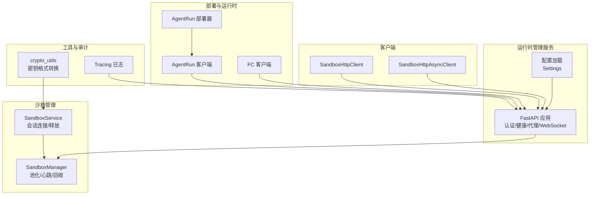
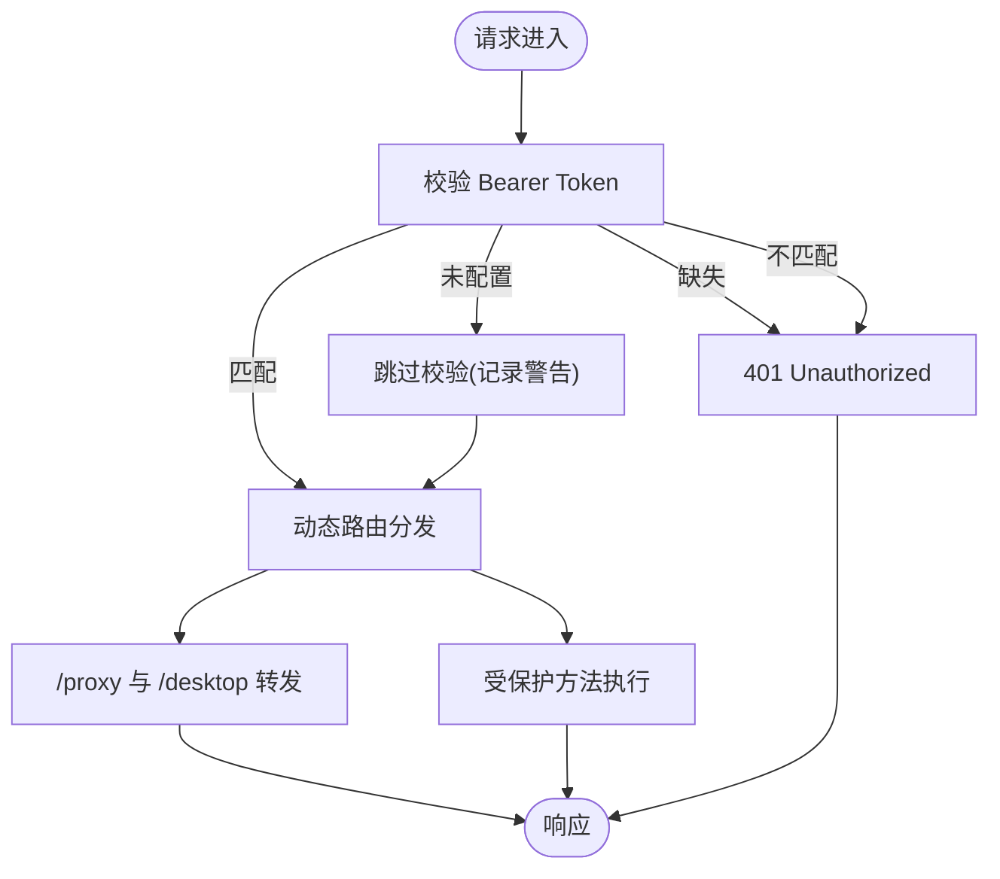
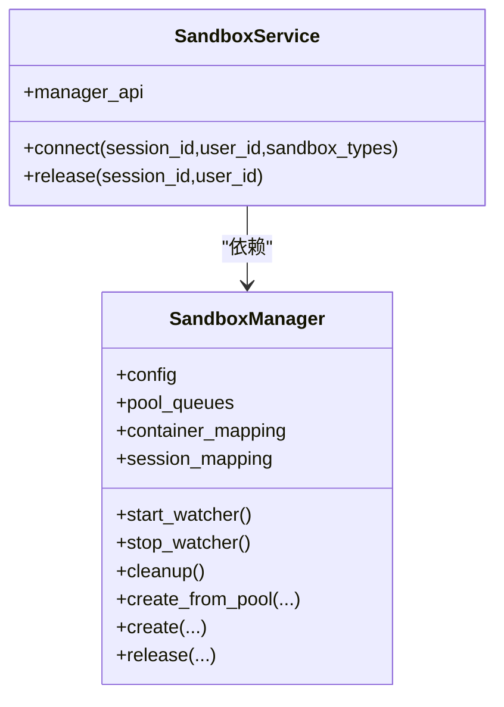
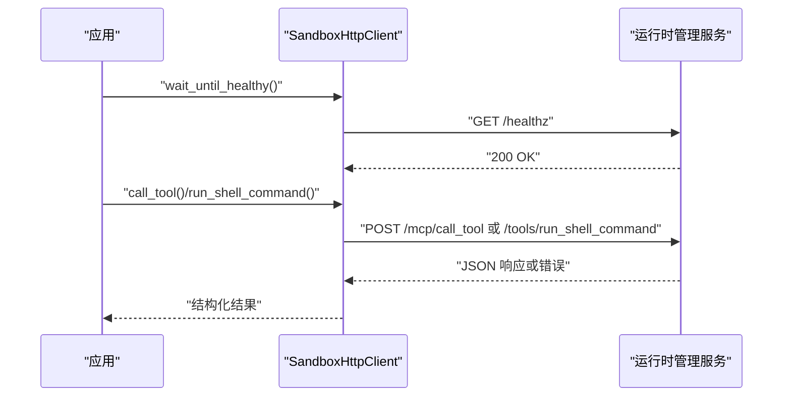
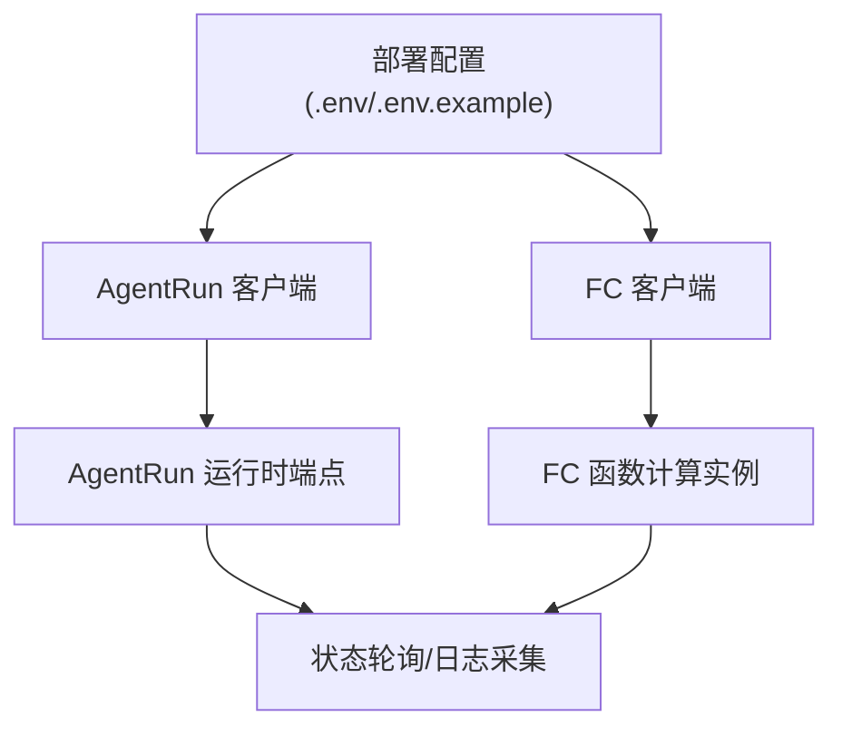
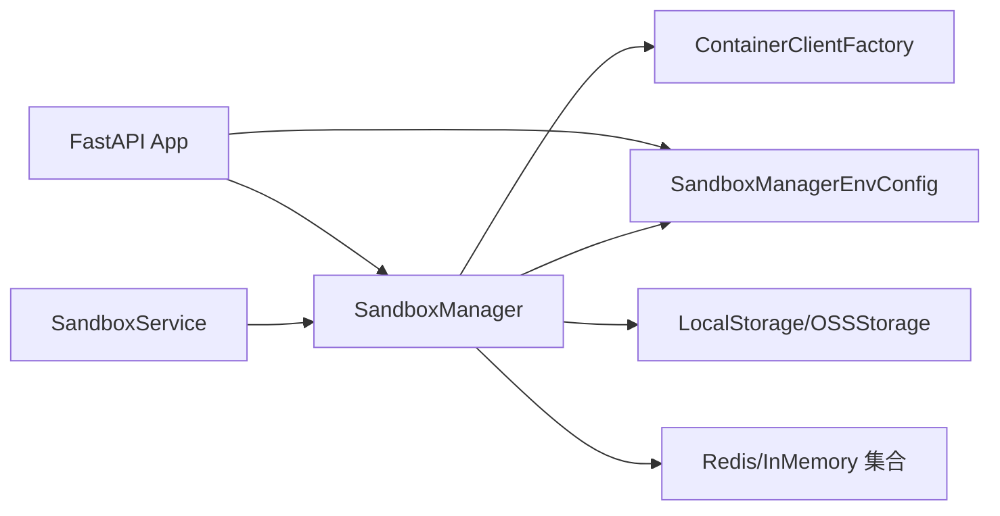

# 安全考虑

<cite>
**本文引用的文件**   
- [src/agentscope_runtime/sandbox/manager/server/app.py](file://src/agentscope_runtime/sandbox/manager/server/app.py)
- [src/agentscope_runtime/sandbox/manager/server/config.py](file://src/agentscope_runtime/sandbox/manager/server/config.py)
- [src/agentscope_runtime/engine/services/sandbox/sandbox_service.py](file://src/agentscope_runtime/engine/services/sandbox/sandbox_service.py)
- [src/agentscope_runtime/sandbox/manager/sandbox_manager.py](file://src/agentscope_runtime/sandbox/manager/sandbox_manager.py)
- [src/agentscope_runtime/sandbox/client/http_client.py](file://src/agentscope_runtime/sandbox/client/http_client.py)
- [src/agentscope_runtime/sandbox/client/async_http_client.py](file://src/agentscope_runtime/sandbox/client/async_http_client.py)
- [src/agentscope_runtime/sandbox/enums.py](file://src/agentscope_runtime/sandbox/enums.py)
- [src/agentscope_runtime/sandbox/constant.py](file://src/agentscope_runtime/sandbox/constant.py)
- [src/agentscope_runtime/engine/helpers/agent_api_client.py](file://src/agentscope_runtime/engine/helpers/agent_api_client.py)
- [src/agentscope_runtime/engine/schemas/exception.py](file://src/agentscope_runtime/engine/schemas/exception.py)
- [src/agentscope_runtime/tools/utils/crypto_utils.py](file://src/agentscope_runtime/tools/utils/crypto_utils.py)
- [src/agentscope_runtime/common/container_clients/agentrun_client.py](file://src/agentscope_runtime/common/container_clients/agentrun_client.py)
- [src/agentscope_runtime/common/container_clients/fc_client.py](file://src/agentscope_runtime/common/container_clients/fc_client.py)
- [src/agentscope_runtime/engine/deployers/agentrun_deployer.py](file://src/agentscope_runtime/engine/deployers/agentrun_deployer.py)
- [cookbook/zh/tracing.md](file://cookbook/zh/tracing.md)
- [examples/deployments/agentrun_deploy/README.md](file://examples/deployments/agentrun_deploy/README.md)
- [src/agentscope_runtime/sandbox/box/mobile/box/config/nginx.conf.template](file://src/agentscope_runtime/sandbox/box/mobile/box/config/nginx.conf.template)
</cite>

## 目录
1. [简介](#简介)
2. [项目结构](#项目结构)
3. [核心组件](#核心组件)
4. [架构总览](#架构总览)
5. [详细组件分析](#详细组件分析)
6. [依赖关系分析](#依赖关系分析)
7. [性能与安全权衡](#性能与安全权衡)
8. [故障排查指南](#故障排查指南)
9. [结论](#结论)
10. [附录](#附录)

## 简介
本文件聚焦于 AgentScope Runtime 的安全机制，围绕以下方面展开：沙箱安全（隔离、资源限制、网络与存储访问控制）、认证授权（Bearer Token、会话与会话头一致性）、访问控制策略（端点路由、代理与反向代理）、数据与隐私保护（密钥格式转换、日志与审计）、安全监控与审计（健康检查、心跳扫描、日志采集）、安全配置最佳实践与加固建议、常见安全问题与合规要点，以及安全测试与渗透测试指导。

## 项目结构
从安全视角看，代码库的关键安全相关模块包括：
- 运行时管理服务（FastAPI）：提供受控的远程 API，内置 Bearer Token 校验与健康检查。
- 沙箱管理器：负责容器生命周期、池化复用、会话映射、心跳扫描与回收。
- 客户端：同步与异步 HTTP 客户端，统一错误处理与健康等待。
- 部署与运行时客户端：对接云服务（AgentRun、FC），支持 VPC/安全组/日志等安全配置。
- 工具与实用模块：加密工具（密钥格式转换）、Tracing 日志与审计。
- 配置与常量：环境变量驱动的设置项，含超时、镜像仓库、端口范围等。



**图表来源**
- [src/agentscope_runtime/sandbox/manager/server/app.py:30-448](file://src/agentscope_runtime/sandbox/manager/server/app.py#L30-L448)
- [src/agentscope_runtime/sandbox/manager/server/config.py:11-162](file://src/agentscope_runtime/sandbox/manager/server/config.py#L11-L162)
- [src/agentscope_runtime/engine/services/sandbox/sandbox_service.py:11-238](file://src/agentscope_runtime/engine/services/sandbox/sandbox_service.py#L11-L238)
- [src/agentscope_runtime/sandbox/manager/sandbox_manager.py:140-800](file://src/agentscope_runtime/sandbox/manager/sandbox_manager.py#L140-L800)
- [src/agentscope_runtime/sandbox/client/http_client.py:20-207](file://src/agentscope_runtime/sandbox/client/http_client.py#L20-L207)
- [src/agentscope_runtime/sandbox/client/async_http_client.py:18-216](file://src/agentscope_runtime/sandbox/client/async_http_client.py#L18-L216)
- [src/agentscope_runtime/common/container_clients/agentrun_client.py:110-145](file://src/agentscope_runtime/common/container_clients/agentrun_client.py#L110-L145)
- [src/agentscope_runtime/common/container_clients/fc_client.py:161-186](file://src/agentscope_runtime/common/container_clients/fc_client.py#L161-L186)
- [src/agentscope_runtime/engine/deployers/agentrun_deployer.py:2398-2425](file://src/agentscope_runtime/engine/deployers/agentrun_deployer.py#L2398-L2425)
- [src/agentscope_runtime/tools/utils/crypto_utils.py:1-99](file://src/agentscope_runtime/tools/utils/crypto_utils.py#L1-L99)
- [cookbook/zh/tracing.md:107-161](file://cookbook/zh/tracing.md#L107-L161)

**章节来源**
- [src/agentscope_runtime/sandbox/manager/server/app.py:30-448](file://src/agentscope_runtime/sandbox/manager/server/app.py#L30-L448)
- [src/agentscope_runtime/sandbox/manager/server/config.py:11-162](file://src/agentscope_runtime/sandbox/manager/server/config.py#L11-L162)

## 核心组件
- 认证与授权
  - Bearer Token 校验：在运行时管理服务中通过 HTTP Bearer Scheme 实现，未配置或无效时拒绝请求，并返回标准 WWW-Authenticate 响应头。
  - 令牌注入：当以远程模式初始化时，SandboxManager 将 Bearer Token 注入 HTTP 请求头，确保后续调用受保护端点时具备凭据。
- 访问控制
  - 路由与端点：仅暴露受控端点（健康检查、代理、桌面 WebSocket、动态注册方法），其余路径默认不开放。
  - 会话与会话头一致性：部署侧通过会话亲和性与会话头（如 x-agentrun-session-id）保障请求粘连与隔离。
- 沙箱安全
  - 类型与镜像：通过枚举限定可用沙箱类型，结合镜像命名空间与标签控制运行时镜像来源。
  - 超时与资源：全局超时常量用于限制长时间运行任务；部署配置支持 CPU/内存/VPC/安全组等资源与网络隔离。
- 数据与隐私
  - 密钥格式转换：提供 PKCS#1 私钥格式转换工具，避免不兼容导致的泄露风险。
  - 日志与审计：Tracing 提供事件级日志；部署侧可启用 SLS/Logstore 输出，便于审计与取证。
- 安全监控
  - 健康检查：/health 与 /healthz 端点用于存活与就绪探测。
  - 心跳扫描：后台线程周期扫描容器心跳，超时回收与释放，防止僵尸实例占用资源。

**章节来源**
- [src/agentscope_runtime/sandbox/manager/server/app.py:116-143](file://src/agentscope_runtime/sandbox/manager/server/app.py#L116-L143)
- [src/agentscope_runtime/sandbox/manager/sandbox_manager.py:140-174](file://src/agentscope_runtime/sandbox/manager/sandbox_manager.py#L140-L174)
- [src/agentscope_runtime/sandbox/enums.py:61-80](file://src/agentscope_runtime/sandbox/enums.py#L61-L80)
- [src/agentscope_runtime/sandbox/constant.py:30-32](file://src/agentscope_runtime/sandbox/constant.py#L30-L32)
- [src/agentscope_runtime/tools/utils/crypto_utils.py:17-99](file://src/agentscope_runtime/tools/utils/crypto_utils.py#L17-L99)
- [cookbook/zh/tracing.md:107-161](file://cookbook/zh/tracing.md#L107-L161)

## 架构总览
下图展示认证、授权、访问控制与沙箱生命周期之间的交互关系。

```mermaid
sequenceDiagram
participant Client as "客户端"
participant API as "运行时管理服务(FastAPI)"
participant Auth as "Bearer 校验"
participant SM as "SandboxManager"
participant Box as "沙箱容器"
Client->>API : "HTTP 请求(可带 Authorization : Bearer)"
API->>Auth : "校验令牌"
Auth-->>API : "通过/失败"
alt 通过
API->>SM : "调用受保护方法(动态注册)"
SM->>Box : "创建/连接/执行"
Box-->>SM : "结果/状态"
SM-->>API : "响应"
API-->>Client : "JSON/错误码"
else 失败
API-->>Client : "401 Unauthorized + WWW-Authenticate"
end
```

**图表来源**
- [src/agentscope_runtime/sandbox/manager/server/app.py:116-187](file://src/agentscope_runtime/sandbox/manager/server/app.py#L116-L187)
- [src/agentscope_runtime/sandbox/manager/sandbox_manager.py:140-174](file://src/agentscope_runtime/sandbox/manager/sandbox_manager.py#L140-L174)

## 详细组件分析

### 组件A：运行时管理服务（认证与访问控制）
- 认证流程
  - 使用 HTTP Bearer Scheme，若未配置令牌则跳过校验并记录警告；若提供令牌但不匹配则返回 401 并设置 WWW-Authenticate。
  - 在代理与桌面 WebSocket 场景中同样应用该校验，确保端到端一致。
- 访问控制
  - 动态注册端点：仅对被标记为远程包装的方法生成路由，避免暴露内部实现细节。
  - 代理与桌面：/proxy 与 /desktop/* 仅在已认证后转发至目标服务，且 /desktop 支持 WebSocket。
- 健康检查
  - /health 返回服务版本与默认沙箱类型；/healthz 由客户端健康检查使用。



**图表来源**
- [src/agentscope_runtime/sandbox/manager/server/app.py:116-187](file://src/agentscope_runtime/sandbox/manager/server/app.py#L116-L187)

**章节来源**
- [src/agentscope_runtime/sandbox/manager/server/app.py:30-448](file://src/agentscope_runtime/sandbox/manager/server/app.py#L30-L448)

### 组件B：沙箱管理器（生命周期与资源治理）
- 生命周期
  - 远程模式：通过 base_url 与 bearer_token 初始化，所有调用均携带 Authorization 头。
  - 本地模式：启动后台心跳扫描线程，周期清理超时与释放的容器。
- 资源治理
  - 池化：按类型维护队列，优先复用运行中的容器，减少冷启动开销。
  - 限制：最大实例数限制，避免资源耗尽；环境变量不允许为 None。
- 会话映射
  - 将 session_ctx_id 映射到具体容器，支持多容器组合场景。



**图表来源**
- [src/agentscope_runtime/sandbox/manager/sandbox_manager.py:140-800](file://src/agentscope_runtime/sandbox/manager/sandbox_manager.py#L140-L800)
- [src/agentscope_runtime/engine/services/sandbox/sandbox_service.py:11-238](file://src/agentscope_runtime/engine/services/sandbox/sandbox_service.py#L11-L238)

**章节来源**
- [src/agentscope_runtime/sandbox/manager/sandbox_manager.py:140-800](file://src/agentscope_runtime/sandbox/manager/sandbox_manager.py#L140-L800)
- [src/agentscope_runtime/engine/services/sandbox/sandbox_service.py:11-238](file://src/agentscope_runtime/engine/services/sandbox/sandbox_service.py#L11-L238)

### 组件C：客户端（统一错误处理与健康检查）
- 同步客户端
  - 使用 requests.Session，封装统一的 safe_request，捕获异常并返回结构化错误。
  - wait_until_healthy 通过 /healthz 探测服务就绪。
- 异步客户端
  - 使用 httpx.AsyncClient，行为与同步客户端一致，适用于高并发场景。
- 工具方法
  - 列表工具、调用工具、Git 工具等均通过统一端点访问，便于集中治理。



**图表来源**
- [src/agentscope_runtime/sandbox/client/http_client.py:85-174](file://src/agentscope_runtime/sandbox/client/http_client.py#L85-L174)
- [src/agentscope_runtime/sandbox/client/async_http_client.py:90-177](file://src/agentscope_runtime/sandbox/client/async_http_client.py#L90-L177)

**章节来源**
- [src/agentscope_runtime/sandbox/client/http_client.py:20-207](file://src/agentscope_runtime/sandbox/client/http_client.py#L20-L207)
- [src/agentscope_runtime/sandbox/client/async_http_client.py:18-216](file://src/agentscope_runtime/sandbox/client/async_http_client.py#L18-L216)

### 组件D：部署与运行时集成（AgentRun/FC/VPC/日志）
- AgentRun 客户端
  - 自动根据配置选择网络模式（PUBLIC/PUBLIC_AND_PRIVATE），并构造 NetworkConfiguration 与 LogConfiguration。
- FC 客户端
  - 配置会话亲和性（HEADER_FIELD）、实例隔离模式（SESSION_EXCLUSIVE）与会话头（x-agentscope-runtime-session-id）。
  - 可选启用日志采集（LogConfig）。
- 部署器
  - AgentRun 部署器在创建运行时端点后，解析返回的状态、URL、请求 ID 等，便于监控与排障。



**图表来源**
- [src/agentscope_runtime/common/container_clients/agentrun_client.py:110-145](file://src/agentscope_runtime/common/container_clients/agentrun_client.py#L110-L145)
- [src/agentscope_runtime/common/container_clients/fc_client.py:161-186](file://src/agentscope_runtime/common/container_clients/fc_client.py#L161-L186)
- [src/agentscope_runtime/engine/deployers/agentrun_deployer.py:2398-2425](file://src/agentscope_runtime/engine/deployers/agentrun_deployer.py#L2398-L2425)

**章节来源**
- [examples/deployments/agentrun_deploy/README.md:97-366](file://examples/deployments/agentrun_deploy/README.md#L97-L366)
- [src/agentscope_runtime/common/container_clients/agentrun_client.py:110-145](file://src/agentscope_runtime/common/container_clients/agentrun_client.py#L110-L145)
- [src/agentscope_runtime/common/container_clients/fc_client.py:161-186](file://src/agentscope_runtime/common/container_clients/fc_client.py#L161-L186)
- [src/agentscope_runtime/engine/deployers/agentrun_deployer.py:2398-2425](file://src/agentscope_runtime/engine/deployers/agentrun_deployer.py#L2398-L2425)

### 组件E：安全配置与沙箱类型
- 沙箱类型
  - 通过枚举限定类型（base、browser、filesystem、gui、mobile、agentbay 等），避免任意类型注入。
- 镜像与超时
  - 镜像仓库、命名空间、标签可通过环境变量配置；全局超时常量用于限制请求/任务时长。
- 配置加载
  - Settings 支持从 .env/.env.example 加载，包含主机、端口、工作进程、BEARER_TOKEN、Redis/OSS/K8s/AgentRun/FC 等参数。

**章节来源**
- [src/agentscope_runtime/sandbox/enums.py:61-80](file://src/agentscope_runtime/sandbox/enums.py#L61-L80)
- [src/agentscope_runtime/sandbox/constant.py:8-32](file://src/agentscope_runtime/sandbox/constant.py#L8-L32)
- [src/agentscope_runtime/sandbox/manager/server/config.py:11-162](file://src/agentscope_runtime/sandbox/manager/server/config.py#L11-L162)

### 组件F：数据保护与隐私保护
- 密钥格式转换
  - 提供 PKCS#1 私钥格式转换工具，支持 PKCS#1 与 PKCS#8 互转，避免因格式不兼容导致的错误与潜在泄露。
- 日志与审计
  - Tracing 提供事件级日志，可扩展多种处理器（如本地日志处理器）；部署侧可启用 SLS/Logstore，满足审计与取证需求。

**章节来源**
- [src/agentscope_runtime/tools/utils/crypto_utils.py:17-99](file://src/agentscope_runtime/tools/utils/crypto_utils.py#L17-L99)
- [cookbook/zh/tracing.md:107-161](file://cookbook/zh/tracing.md#L107-L161)

### 组件G：代理与桌面访问控制（Nginx 示例）
- Nginx 模板
  - 对 /websockify/ 路径进行细粒度访问控制：静态资源放行、WebSocket 升级路径放行、其他路径需 SECRET_TOKEN 或 Cookie 校验。
  - 通过查询参数 password 与 Cookie auth_session 实现会话令牌校验，未通过则返回 403。

**章节来源**
- [src/agentscope_runtime/sandbox/box/mobile/box/config/nginx.conf.template:46-105](file://src/agentscope_runtime/sandbox/box/mobile/box/config/nginx.conf.template#L46-L105)

## 依赖关系分析
- 组件耦合
  - SandboxService 依赖 SandboxManager；SandboxManager 依赖容器客户端工厂、存储后端、Redis/内存集合。
  - 运行时管理服务依赖 SandboxManagerEnvConfig 与 Settings，提供统一的配置入口。
- 外部依赖
  - FastAPI/WebSockets/httpx/requests 等；云服务 SDK（AgentRun/FC）。
- 潜在循环
  - 当前结构清晰，无明显循环依赖；服务层与管理层职责分离。



**图表来源**
- [src/agentscope_runtime/engine/services/sandbox/sandbox_service.py:11-238](file://src/agentscope_runtime/engine/services/sandbox/sandbox_service.py#L11-L238)
- [src/agentscope_runtime/sandbox/manager/sandbox_manager.py:140-800](file://src/agentscope_runtime/sandbox/manager/sandbox_manager.py#L140-L800)
- [src/agentscope_runtime/sandbox/manager/server/app.py:54-113](file://src/agentscope_runtime/sandbox/manager/server/app.py#L54-L113)

**章节来源**
- [src/agentscope_runtime/engine/services/sandbox/sandbox_service.py:11-238](file://src/agentscope_runtime/engine/services/sandbox/sandbox_service.py#L11-L238)
- [src/agentscope_runtime/sandbox/manager/sandbox_manager.py:140-800](file://src/agentscope_runtime/sandbox/manager/sandbox_manager.py#L140-L800)
- [src/agentscope_runtime/sandbox/manager/server/app.py:54-113](file://src/agentscope_runtime/sandbox/manager/server/app.py#L54-L113)

## 性能与安全权衡
- 超时与资源
  - 全局超时常量用于限制单次请求/任务时长，避免资源被长时间占用。
  - 部署配置支持 CPU/内存/VPC/安全组，平衡性能与隔离强度。
- 心跳扫描
  - 后台线程定期扫描心跳与释放键，及时回收资源，降低资源泄漏风险。
- 会话亲和性
  - FC 侧通过会话头与亲和性配置，提升请求粘连与稳定性，同时限制并发与空闲超时，避免资源滥用。

**章节来源**
- [src/agentscope_runtime/sandbox/constant.py:30-32](file://src/agentscope_runtime/sandbox/constant.py#L30-L32)
- [src/agentscope_runtime/sandbox/manager/sandbox_manager.py:444-507](file://src/agentscope_runtime/sandbox/manager/sandbox_manager.py#L444-L507)
- [src/agentscope_runtime/common/container_clients/fc_client.py:161-186](file://src/agentscope_runtime/common/container_clients/fc_client.py#L161-L186)

## 故障排查指南
- 认证失败
  - 现象：401 Unauthorized，响应头包含 WWW-Authenticate。
  - 排查：确认 BEARER_TOKEN 是否正确配置；检查请求头是否包含 Authorization: Bearer。
- 健康检查失败
  - 现象：/healthz 不可达或返回非 200。
  - 排查：确认服务监听地址与端口；查看日志级别与配置文件加载顺序。
- 客户端错误
  - 现象：safe_request 返回 isError 与错误内容。
  - 排查：检查网络连通性、超时设置、目标端点是否存在。
- 会话粘连问题
  - 现象：请求被路由到不同实例导致状态丢失。
  - 排查：确认会话头（x-agentrun-session-id）是否透传；检查 FC 会话亲和性配置。
- 日志与审计
  - 建议：开启本地日志处理器与 SLS/Logstore；在生产环境调整日志级别与轮转策略。

**章节来源**
- [src/agentscope_runtime/sandbox/manager/server/app.py:116-143](file://src/agentscope_runtime/sandbox/manager/server/app.py#L116-L143)
- [src/agentscope_runtime/sandbox/client/http_client.py:56-70](file://src/agentscope_runtime/sandbox/client/http_client.py#L56-L70)
- [src/agentscope_runtime/sandbox/client/async_http_client.py:54-72](file://src/agentscope_runtime/sandbox/client/async_http_client.py#L54-L72)
- [src/agentscope_runtime/common/container_clients/fc_client.py:161-186](file://src/agentscope_runtime/common/container_clients/fc_client.py#L161-L186)
- [cookbook/zh/tracing.md:107-161](file://cookbook/zh/tracing.md#L107-L161)

## 结论
AgentScope Runtime 的安全机制以“最小权限、强认证、细粒度访问控制”为核心设计原则：通过 Bearer Token 与动态路由实现受控 API；通过心跳扫描与池化复用实现资源治理；通过部署侧 VPC/安全组/日志与会话亲和性实现网络与运行时隔离；通过 Tracing 与日志采集实现审计与可观测性。建议在生产环境中严格配置令牌、启用私网部署、限制实例数量、开启日志与告警，并定期进行安全测试与渗透测试。

## 附录

### 安全配置最佳实践
- 令牌管理
  - 必须配置 BEARER_TOKEN；避免明文硬编码，使用密钥管理服务或环境变量注入。
- 网络与隔离
  - 生产环境使用 PRIVATE/PUBLIC_AND_PRIVATE 网络模式，配置 VPC、安全组与交换机。
  - 限制端口范围与挂载目录，启用只读挂载。
- 资源与超时
  - 设置合理的最大实例数、CPU/内存配额与超时时间，防止资源滥用。
- 日志与审计
  - 启用 SLS/Logstore 与本地日志处理器，保留足够审计证据。
- 密钥与证书
  - 使用 PKCS#1 私钥格式，避免格式不兼容导致的错误与泄露风险。

**章节来源**
- [src/agentscope_runtime/sandbox/manager/server/config.py:19-108](file://src/agentscope_runtime/sandbox/manager/server/config.py#L19-L108)
- [examples/deployments/agentrun_deploy/README.md:97-366](file://examples/deployments/agentrun_deploy/README.md#L97-L366)
- [src/agentscope_runtime/tools/utils/crypto_utils.py:17-99](file://src/agentscope_runtime/tools/utils/crypto_utils.py#L17-L99)

### 安全加固建议
- 默认拒绝：未显式允许的端点一律拒绝访问。
- 最小权限：容器内仅授予必要权限，避免 root 与高权限命令。
- 输入验证：对所有外部输入进行白名单校验，防止注入攻击。
- 传输安全：在公网暴露时强制 HTTPS，TLS 版本与套件按合规要求配置。
- 审计与告警：建立异常登录、频繁失败、资源超限等告警规则。

### 安全测试与渗透测试指导
- 认证绕过测试
  - 尝试不带令牌、错误令牌与空令牌访问受保护端点，验证 401 行为。
- 权限边界测试
  - 使用不同用户上下文发起请求，验证会话映射与容器隔离。
- 代理与 WebSocket 测试
  - 验证 /proxy 与 /desktop 的访问控制，确保未授权访问被拒绝。
- 资源耗尽测试
  - 提交大量并发请求，观察最大实例数限制与超时行为。
- 日志与审计测试
  - 触发异常路径，验证日志输出与审计事件完整性。

### 常见安全问题与合规要求
- 常见问题
  - 令牌泄露：通过密钥管理与最小暴露原则降低风险。
  - 网络暴露：仅在受控网络中暴露管理端点，使用防火墙与 WAF。
  - 资源滥用：通过实例上限、超时与配额限制防止滥用。
- 合规要求
  - 数据最小化：仅收集必要的日志与指标。
  - 可追溯性：保留完整的审计日志与变更记录。
  - 加密与密钥管理：使用安全的密钥存储与轮换策略。