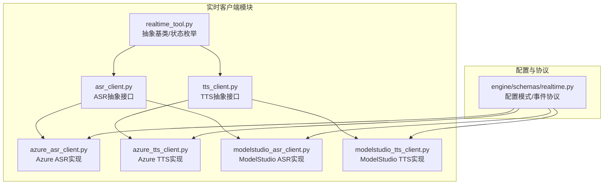
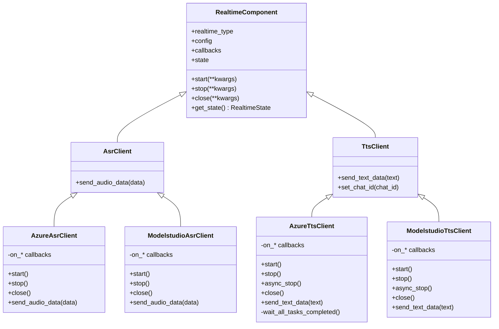
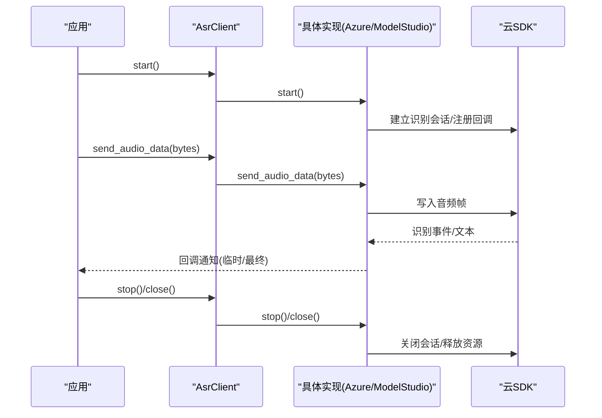
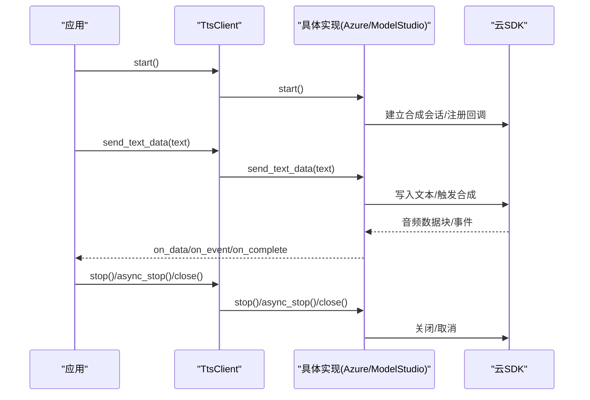
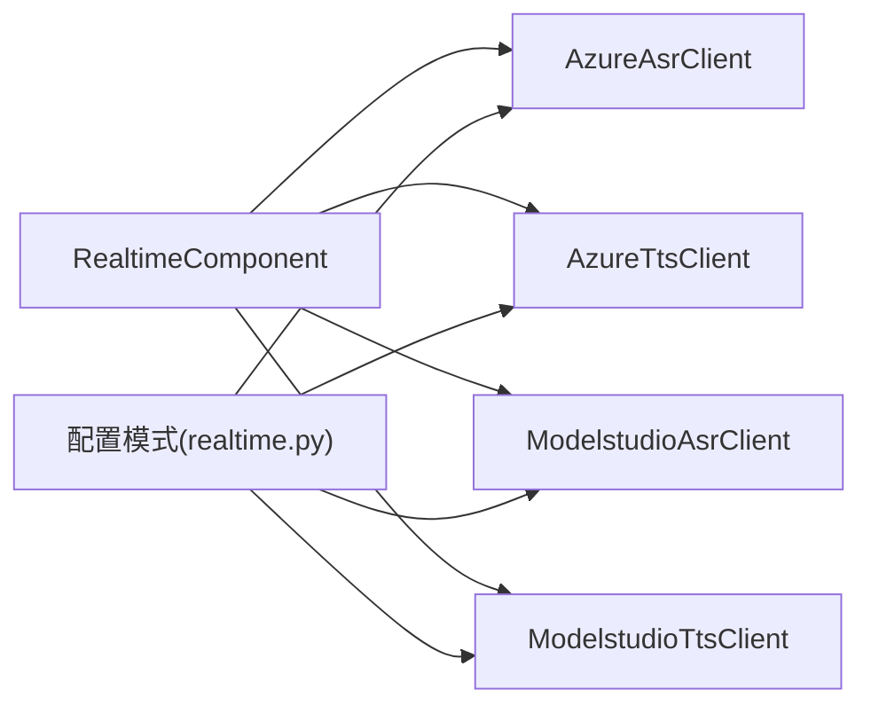

# 实时客户端

<cite>
**本文引用的文件**
- [realtime_tool.py](file://src/agentscope_runtime/tools/realtime_clients/realtime_tool.py)
- [asr_client.py](file://src/agentscope_runtime/tools/realtime_clients/asr_client.py)
- [tts_client.py](file://src/agentscope_runtime/tools/realtime_clients/tts_client.py)
- [azure_asr_client.py](file://src/agentscope_runtime/tools/realtime_clients/azure_asr_client.py)
- [azure_tts_client.py](file://src/agentscope_runtime/tools/realtime_clients/azure_tts_client.py)
- [modelstudio_asr_client.py](file://src/agentscope_runtime/tools/realtime_clients/modelstudio_asr_client.py)
- [modelstudio_tts_client.py](file://src/agentscope_runtime/tools/realtime_clients/modelstudio_tts_client.py)
- [realtime.py](file://src/agentscope_runtime/engine/schemas/realtime.py)
- [realtime_clients.md](file://cookbook/zh/tools/realtime_clients.md)
- [test_asr.py](file://tests/tools/test_asr.py)
- [test_tts.py](file://tests/tools/test_tts.py)
</cite>

## 目录
1. [简介](#简介)
2. [项目结构](#项目结构)
3. [核心组件](#核心组件)
4. [架构总览](#架构总览)
5. [详细组件分析](#详细组件分析)
6. [依赖分析](#依赖分析)
7. [性能考虑](#性能考虑)
8. [故障排查指南](#故障排查指南)
9. [结论](#结论)
10. [附录](#附录)

## 简介
本文件面向实时客户端的使用者与维护者，系统性阐述以下内容：
- ASR（自动语音识别）客户端的实现原理与API接口
- TTS（文本转语音）客户端的语音合成机制与质量控制
- Azure云服务客户端的集成方式与认证机制
- ModelStudio实时客户端的优化特性与性能优势
- 实时工具的配置参数与连接管理
- 错误处理、重连机制与超时控制
- 多客户端并发处理与资源池管理
- 实时通信的性能监控与调试方法

## 项目结构
实时客户端位于工具模块的实时客户端子目录中，采用“按供应商分层”的组织方式：
- 抽象基类与通用状态机：realtime_tool.py
- ASR/TTS抽象接口：asr_client.py、tts_client.py
- Azure实现：azure_asr_client.py、azure_tts_client.py
- ModelStudio实现：modelstudio_asr_client.py、modelstudio_tts_client.py
- 配置模式与协议：engine/schemas/realtime.py
- 使用示例与环境变量说明：cookbook/zh/tools/realtime_clients.md
- 单元测试：tests/tools/test_asr.py、tests/tools/test_tts.py

图表来源
- [realtime_tool.py:1-56](file://src/agentscope_runtime/tools/realtime_clients/realtime_tool.py#L1-L56)
- [asr_client.py:1-28](file://src/agentscope_runtime/tools/realtime_clients/asr_client.py#L1-L28)
- [tts_client.py:1-34](file://src/agentscope_runtime/tools/realtime_clients/tts_client.py#L1-L34)
- [azure_asr_client.py:1-196](file://src/agentscope_runtime/tools/realtime_clients/azure_asr_client.py#L1-L196)
- [azure_tts_client.py:1-384](file://src/agentscope_runtime/tools/realtime_clients/azure_tts_client.py#L1-L384)
- [modelstudio_asr_client.py:1-152](file://src/agentscope_runtime/tools/realtime_clients/modelstudio_asr_client.py#L1-L152)
- [modelstudio_tts_client.py:1-200](file://src/agentscope_runtime/tools/realtime_clients/modelstudio_tts_client.py#L1-L200)
- [realtime.py:1-255](file://src/agentscope_runtime/engine/schemas/realtime.py#L1-L255)

章节来源
- [realtime_tool.py:1-56](file://src/agentscope_runtime/tools/realtime_clients/realtime_tool.py#L1-L56)
- [realtime.py:1-255](file://src/agentscope_runtime/engine/schemas/realtime.py#L1-L255)
- [realtime_clients.md:1-359](file://cookbook/zh/tools/realtime_clients.md#L1-L359)

## 核心组件
- RealtimeComponent：统一的实时组件抽象，定义生命周期方法与状态机
- RealtimeState：运行状态（空闲/运行）
- RealtimeType：组件类型（TTS/ASR/语音/视频）
- AsrClient/TtsClient：ASR/TTS抽象接口，定义start/stop/close与数据发送方法
- AzureAsrClient/AzureTtsClient：基于Azure SDK的实现，负责会话建立、回调与统计
- ModelstudioAsrClient/ModelstudioTtsClient：基于DashScope SDK的实现，负责实时流式传输与事件回调
- 配置模式：AsrConfig/TtsConfig、AzureAsrConfig/AzureTtsConfig、ModelstudioAsrConfig/ModelstudioTtsConfig

章节来源
- [realtime_tool.py:21-56](file://src/agentscope_runtime/tools/realtime_clients/realtime_tool.py#L21-L56)
- [asr_client.py:13-28](file://src/agentscope_runtime/tools/realtime_clients/asr_client.py#L13-L28)
- [tts_client.py:13-34](file://src/agentscope_runtime/tools/realtime_clients/tts_client.py#L13-L34)
- [realtime.py:11-255](file://src/agentscope_runtime/engine/schemas/realtime.py#L11-L255)

## 架构总览
实时客户端通过统一的抽象基类与配置模式，屏蔽不同云厂商SDK差异，向上提供一致的API。Azure与ModelStudio分别封装其SDK的会话、流式写入、回调与事件处理。

图表来源
- [realtime_tool.py:21-56](file://src/agentscope_runtime/tools/realtime_clients/realtime_tool.py#L21-L56)
- [asr_client.py:13-28](file://src/agentscope_runtime/tools/realtime_clients/asr_client.py#L13-L28)
- [tts_client.py:13-34](file://src/agentscope_runtime/tools/realtime_clients/tts_client.py#L13-L34)
- [azure_asr_client.py:33-196](file://src/agentscope_runtime/tools/realtime_clients/azure_asr_client.py#L33-L196)
- [azure_tts_client.py:53-384](file://src/agentscope_runtime/tools/realtime_clients/azure_tts_client.py#L53-L384)
- [modelstudio_asr_client.py:34-152](file://src/agentscope_runtime/tools/realtime_clients/modelstudio_asr_client.py#L34-L152)
- [modelstudio_tts_client.py:34-200](file://src/agentscope_runtime/tools/realtime_clients/modelstudio_tts_client.py#L34-L200)

## 详细组件分析

### ASR（自动语音识别）客户端
- 抽象接口：AsrClient定义send_audio_data用于推送音频帧
- Azure实现：AzureAsrClient
  - 通过PushAudioInputStream写入音频
  - 通过回调通知会话开始/结束、识别中/完成、取消等事件
  - 支持初始静音超时与结束静音阈值配置
- ModelStudio实现：ModelstudioAsrClient
  - 基于TranslationRecognizerRealtime进行实时识别
  - 通过回调传递识别事件与文本
  - 支持快速VAD参数与结束静音阈值

图表来源
- [asr_client.py:17-28](file://src/agentscope_runtime/tools/realtime_clients/asr_client.py#L17-L28)
- [azure_asr_client.py:100-196](file://src/agentscope_runtime/tools/realtime_clients/azure_asr_client.py#L100-L196)
- [modelstudio_asr_client.py:56-152](file://src/agentscope_runtime/tools/realtime_clients/modelstudio_asr_client.py#L56-L152)

章节来源
- [asr_client.py:13-28](file://src/agentscope_runtime/tools/realtime_clients/asr_client.py#L13-L28)
- [azure_asr_client.py:33-196](file://src/agentscope_runtime/tools/realtime_clients/azure_asr_client.py#L33-L196)
- [modelstudio_asr_client.py:34-152](file://src/agentscope_runtime/tools/realtime_clients/modelstudio_asr_client.py#L34-L152)

### TTS（文本转语音）客户端
- 抽象接口：TtsClient定义send_text_data与set_chat_id
- Azure实现：AzureTtsClient
  - 使用PushAudioOutputStreamCallback流式接收音频
  - 支持start/stop/async_stop/close，内部等待任务完成或异步停止
  - 提供首字节延迟与网络/服务端延迟统计
- ModelStudio实现：ModelstudioTtsClient
  - 基于SpeechSynthesizer进行流式合成
  - 支持on_open/on_complete/on_error/on_close/on_event/on_data回调
  - 将首次音频块到达时间与索引传递给上层

图表来源
- [tts_client.py:17-34](file://src/agentscope_runtime/tools/realtime_clients/tts_client.py#L17-L34)
- [azure_tts_client.py:110-384](file://src/agentscope_runtime/tools/realtime_clients/azure_tts_client.py#L110-L384)
- [modelstudio_tts_client.py:58-200](file://src/agentscope_runtime/tools/realtime_clients/modelstudio_tts_client.py#L58-L200)

章节来源
- [tts_client.py:13-34](file://src/agentscope_runtime/tools/realtime_clients/tts_client.py#L13-L34)
- [azure_tts_client.py:53-384](file://src/agentscope_runtime/tools/realtime_clients/azure_tts_client.py#L53-L384)
- [modelstudio_tts_client.py:34-200](file://src/agentscope_runtime/tools/realtime_clients/modelstudio_tts_client.py#L34-L200)

### Azure云服务集成与认证
- 认证方式
  - AzureKey：优先使用配置中的key，否则读取环境变量AZURE_KEY
  - 区域：优先使用配置中的region，否则读取环境变量AZURE_REGION
- ASR配置要点
  - 采样率、位深、声道数、语言
  - 初始静音超时、结束静音阈值（可二选一或组合）
- TTS配置要点
  - 语音名称、输出格式（当前仅支持PCM raw模式）
  - 帧超时与RTF超阈值以降低阻塞风险
- 回调与事件
  - AzureAsrClient：会话开始/结束、识别中/完成、取消、识别事件
  - AzureTtsClient：开始/完成/取消、合成事件、Viseme/词边界、音频数据

章节来源
- [azure_asr_client.py:34-98](file://src/agentscope_runtime/tools/realtime_clients/azure_asr_client.py#L34-L98)
- [azure_tts_client.py:54-108](file://src/agentscope_runtime/tools/realtime_clients/azure_tts_client.py#L54-L108)
- [realtime.py:231-255](file://src/agentscope_runtime/engine/schemas/realtime.py#L231-L255)

### ModelStudio实时客户端优化与性能
- ASR优化
  - 基于实时识别器，支持快速VAD最小/最大持续时间
  - 事件回调区分句子结尾与中间结果，便于前端渲染
- TTS优化
  - 流式合成，on_data回调携带chat_id与数据索引，便于分片与拼接
  - 首次音频块到达时间统计，便于端到端延迟分析
- 连接与会话
  - start/stop/close生命周期清晰，异常路径均记录日志
  - ModelStudio实现通过回调驱动事件，减少轮询开销

章节来源
- [modelstudio_asr_client.py:34-152](file://src/agentscope_runtime/tools/realtime_clients/modelstudio_asr_client.py#L34-L152)
- [modelstudio_tts_client.py:34-200](file://src/agentscope_runtime/tools/realtime_clients/modelstudio_tts_client.py#L34-L200)

### 配置参数与连接管理
- 通用配置
  - AsrConfig/TtsConfig：模型、采样率、位深、声道数、语言/语音等
  - Azure/ModelStudio配置：在上述基础上增加云厂商专属字段
- 连接管理
  - RealtimeState：IDLE/RUNNING状态机贯穿所有实现
  - start/stop/close确保资源正确释放，避免SDK线程安全问题
  - AzureTtsClient提供async_stop以避免阻塞主线程

章节来源
- [realtime.py:29-92](file://src/agentscope_runtime/engine/schemas/realtime.py#L29-L92)
- [realtime_tool.py:9-18](file://src/agentscope_runtime/tools/realtime_clients/realtime_tool.py#L9-L18)
- [azure_tts_client.py:168-189](file://src/agentscope_runtime/tools/realtime_clients/azure_tts_client.py#L168-L189)

### 错误处理、重连机制与超时控制
- 错误处理
  - AzureAsrClient/AzureTtsClient在回调中记录取消详情与警告日志
  - ModelStudio实现将错误事件通过回调上抛
- 重连机制
  - 当前实现未内置自动重连逻辑；建议在上层业务中根据回调与异常进行策略化重试
- 超时控制
  - AzureAsrClient支持初始静音与结束静音超时属性
  - AzureTtsClient通过属性调整帧超时与RTF阈值，降低等待阻塞

章节来源
- [azure_asr_client.py:162-176](file://src/agentscope_runtime/tools/realtime_clients/azure_asr_client.py#L162-L176)
- [azure_tts_client.py:281-295](file://src/agentscope_runtime/tools/realtime_clients/azure_tts_client.py#L281-L295)
- [modelstudio_asr_client.py:112-122](file://src/agentscope_runtime/tools/realtime_clients/modelstudio_asr_client.py#L112-L122)
- [modelstudio_tts_client.py:125-135](file://src/agentscope_runtime/tools/realtime_clients/modelstudio_tts_client.py#L125-L135)

### 多客户端并发与资源池管理
- 并发模型
  - 基于asyncio的异步流处理，适合高并发场景
  - AzureTtsClient提供async_stop避免阻塞
- 资源池
  - 建议在应用侧按会话维度复用客户端实例，避免频繁建立/销毁连接
  - 对于高吞吐场景，可在进程内按供应商/区域划分连接池，并结合状态机进行健康检查

章节来源
- [realtime_clients.md:297-311](file://cookbook/zh/tools/realtime_clients.md#L297-L311)
- [azure_tts_client.py:168-189](file://src/agentscope_runtime/tools/realtime_clients/azure_tts_client.py#L168-L189)

### 性能监控与调试
- 统计指标
  - AzureTtsClient：首字节延迟、完成延迟、网络延迟、服务端延迟
  - ModelStudioTtsClient：首次音频块到达时间统计
- 调试建议
  - 打开详细日志级别，观察回调触发顺序与状态切换
  - 在上层记录每个会话的请求ID与时间戳，便于端到端追踪

章节来源
- [azure_tts_client.py:224-258](file://src/agentscope_runtime/tools/realtime_clients/azure_tts_client.py#L224-L258)
- [modelstudio_tts_client.py:169-178](file://src/agentscope_runtime/tools/realtime_clients/modelstudio_tts_client.py#L169-L178)

## 依赖分析
- 组件耦合
  - 所有实现均依赖RealtimeComponent与配置模式，耦合度低、扩展性强
  - Azure与ModelStudio实现分别依赖各自SDK，互不干扰
- 外部依赖
  - Azure：azure-cognitiveservices-speech
  - ModelStudio：dashscope.audio.asr/tts_v2
- 潜在循环依赖
  - 未发现循环导入；各模块职责单一

图表来源
- [realtime_tool.py:21-56](file://src/agentscope_runtime/tools/realtime_clients/realtime_tool.py#L21-L56)
- [realtime.py:11-255](file://src/agentscope_runtime/engine/schemas/realtime.py#L11-L255)

章节来源
- [realtime.py:11-255](file://src/agentscope_runtime/engine/schemas/realtime.py#L11-L255)

## 性能考虑
- 延迟优化
  - 选择合适的采样率与音频格式，减少带宽与CPU占用
  - 使用流式合成与实时识别，避免一次性传输大块数据
- 资源利用
  - 合理设置缓冲区大小与回调频率，避免频繁I/O
  - 在高并发场景下，按区域/供应商拆分连接池，避免单点瓶颈
- 稳定性
  - 为网络抖动预留超时余量，结合回调中的错误码进行降级处理

## 故障排查指南
- 常见问题定位
  - 无法识别/识别过早结束：检查初始静音与结束静音阈值配置
  - 无音频输出：确认TTS start/stop/close调用顺序与回调是否触发
  - Azure取消事件：查看取消原因与错误详情日志
- 单元测试参考
  - ASR：通过测试脚本模拟音频帧推送与停止流程
  - TTS：通过测试脚本模拟文本输入与音频块收集

章节来源
- [test_asr.py:26-52](file://tests/tools/test_asr.py#L26-L52)
- [test_tts.py:26-55](file://tests/tools/test_tts.py#L26-L55)
- [azure_asr_client.py:162-176](file://src/agentscope_runtime/tools/realtime_clients/azure_asr_client.py#L162-L176)
- [azure_tts_client.py:281-295](file://src/agentscope_runtime/tools/realtime_clients/azure_tts_client.py#L281-L295)

## 结论
该实时客户端体系以统一抽象与配置模式为核心，屏蔽Azure与ModelStudio差异，提供一致的API与回调机制。通过流式处理、状态机与统计指标，满足低延迟与高可用的实时语音需求。建议在生产环境中结合业务策略完善重连与限流机制，并通过日志与指标持续优化端到端性能。

## 附录
- 环境变量与默认值
  - DASHSCOPE_API_KEY：ModelStudio服务密钥
  - AZURE_KEY/AZURE_REGION：Azure服务密钥与区域
  - ASR_SAMPLE_RATE：ASR采样率默认值
  - REALTIME_BUFFER_SIZE：实时音频缓冲区大小默认值
- 使用示例
  - 参考文档中的百炼与Azure示例，涵盖初始化、回调定义、数据发送与会话终止

章节来源
- [realtime_clients.md:98-108](file://cookbook/zh/tools/realtime_clients.md#L98-L108)
- [realtime_clients.md:109-295](file://cookbook/zh/tools/realtime_clients.md#L109-L295)