# 工具库系统

<cite>
**本文档引用的文件**
- [tools/__init__.py](file://src/agentscope_runtime/tools/__init__.py)
- [tools/base.py](file://src/agentscope_runtime/tools/base.py)
- [tools/mcp_wrapper.py](file://src/agentscope_runtime/tools/mcp_wrapper.py)
- [adapters/agentscope/tool/tool.py](file://src/agentscope_runtime/adapters/agentscope/tool/tool.py)
- [adapters/autogen/tool/tool.py](file://src/agentscope_runtime/adapters/autogen/tool/tool.py)
- [tools/generations/image_generation.py](file://src/agentscope_runtime/tools/generations/image_generation.py)
- [tools/searches/modelstudio_search.py](file://src/agentscope_runtime/tools/searches/modelstudio_search.py)
- [tools/modelstudio_memory/core.py](file://src/agentscope_runtime/tools/modelstudio_memory/core.py)
- [tools/alipay/payment.py](file://src/agentscope_runtime/tools/alipay/payment.py)
- [tools/realtime_clients/asr_client.py](file://src/agentscope_runtime/tools/realtime_clients/asr_client.py)
- [tools/realtime_clients/tts_client.py](file://src/agentscope_runtime/tools/realtime_clients/tts_client.py)
- [tools/realtime_clients/realtime_tool.py](file://src/agentscope_runtime/tools/realtime_clients/realtime_tool.py)
- [tools/_constants.py](file://src/agentscope_runtime/tools/_constants.py)
- [tools/utils/api_key_util.py](file://src/agentscope_runtime/tools/utils/api_key_util.py)
- [engine/schemas/agent_schemas.py](file://src/agentscope_runtime/engine/schemas/agent_schemas.py)
</cite>

## 目录
1. [简介](#简介)
2. [项目结构](#项目结构)
3. [核心组件](#核心组件)
4. [架构总览](#架构总览)
5. [详细组件分析](#详细组件分析)
6. [依赖关系分析](#依赖关系分析)
7. [性能考虑](#性能考虑)
8. [故障排除指南](#故障排除指南)
9. [结论](#结论)
10. [附录](#附录)

## 简介
本文件系统性阐述工具库系统的设计与实现，覆盖工具架构、接口规范、参数与返回值格式、注册与配置流程、适配器机制以及自定义工具开发指南。文档同时提供性能优化建议与常见问题排查方法，帮助开发者快速理解并高效使用工具库。

## 项目结构
工具库位于 src/agentscope_runtime/tools 下，按功能域划分为：
- 生成类工具：图像生成、文本转语音、视频生成等
- 实时客户端：ASR、TTS 等
- 搜索工具：ModelStudio 网页搜索
- 记忆工具：ModelStudio 内存服务
- 支付工具：支付宝支付、退款、查询
- 适配器：AgentScope、AutoGen 等框架集成
- MCP 封装：将工具暴露为 MCP 工具
- 基础设施：常量、API Key 管理、通用模式

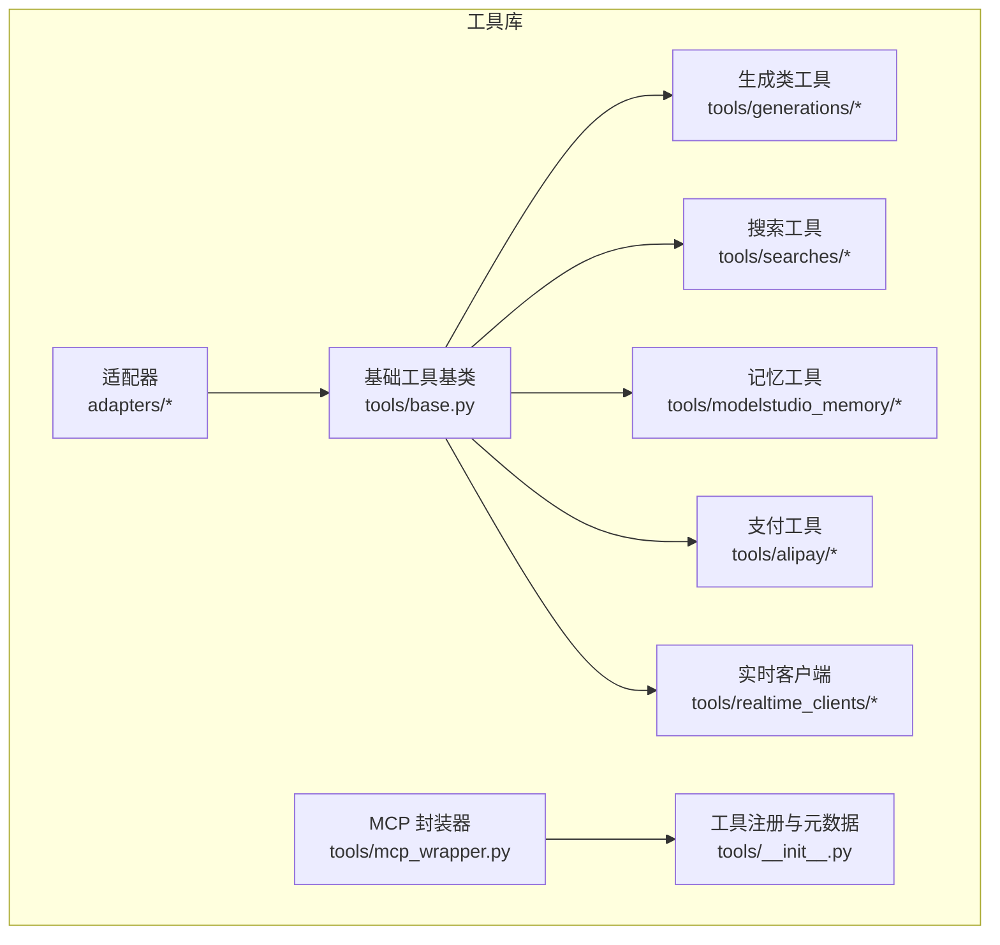

**图表来源**
- [tools/base.py:34-265](file://src/agentscope_runtime/tools/base.py#L34-L265)
- [tools/mcp_wrapper.py:14-216](file://src/agentscope_runtime/tools/mcp_wrapper.py#L14-L216)
- [tools/__init__.py:65-120](file://src/agentscope_runtime/tools/__init__.py#L65-L120)

**章节来源**
- [tools/__init__.py:1-120](file://src/agentscope_runtime/tools/__init__.py#L1-L120)
- [tools/base.py:1-265](file://src/agentscope_runtime/tools/base.py#L1-L265)

## 核心组件
- 工具基类 Tool：统一异步/同步执行、参数校验、函数模式 schema 生成、返回值序列化。
- MCP 封装器 MCPWrapper：将 Tool 自动包装为 MCP 工具，注入参数类型与默认值，桥接上下文与追踪。
- 适配器：
  - AgentScope 适配器：将 Tool 转换为 Toolkit/RegisteredToolFunction，兼容 AgentScope 工具生态。
  - AutoGen 适配器：将 Tool 包装为 AutoGen BaseTool，支持取消令牌与 JSON 序列化返回。
- 常量与密钥管理：统一的 API 基础地址与密钥获取策略。
- 通用模式：Agent/Function/Content 等消息与工具调用模式。

**章节来源**
- [tools/base.py:34-265](file://src/agentscope_runtime/tools/base.py#L34-L265)
- [tools/mcp_wrapper.py:14-216](file://src/agentscope_runtime/tools/mcp_wrapper.py#L14-L216)
- [adapters/agentscope/tool/tool.py:17-232](file://src/agentscope_runtime/adapters/agentscope/tool/tool.py#L17-L232)
- [adapters/autogen/tool/tool.py:28-212](file://src/agentscope_runtime/adapters/autogen/tool/tool.py#L28-L212)
- [tools/_constants.py:1-19](file://src/agentscope_runtime/tools/_constants.py#L1-L19)
- [tools/utils/api_key_util.py:13-46](file://src/agentscope_runtime/tools/utils/api_key_util.py#L13-L46)
- [engine/schemas/agent_schemas.py:80-121](file://src/agentscope_runtime/engine/schemas/agent_schemas.py#L80-L121)

## 架构总览
工具库采用“统一基类 + 分类工具 + 适配层 + MCP 暴露”的分层架构。所有工具均继承自 Tool，遵循一致的输入/输出模式；通过适配器对接不同上层框架；通过 MCPWrapper 将工具暴露为 MCP 工具，便于外部系统调用。

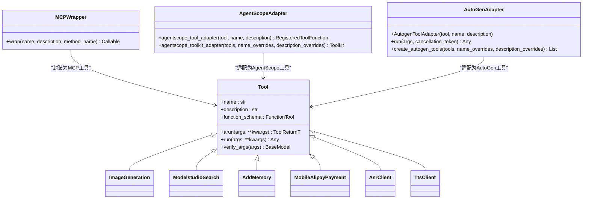

**图表来源**
- [tools/base.py:34-265](file://src/agentscope_runtime/tools/base.py#L34-L265)
- [tools/mcp_wrapper.py:14-216](file://src/agentscope_runtime/tools/mcp_wrapper.py#L14-L216)
- [adapters/agentscope/tool/tool.py:17-232](file://src/agentscope_runtime/adapters/agentscope/tool/tool.py#L17-L232)
- [adapters/autogen/tool/tool.py:28-212](file://src/agentscope_runtime/adapters/autogen/tool/tool.py#L28-L212)
- [tools/generations/image_generation.py:70-203](file://src/agentscope_runtime/tools/generations/image_generation.py#L70-L203)
- [tools/searches/modelstudio_search.py:102-221](file://src/agentscope_runtime/tools/searches/modelstudio_search.py#L102-L221)
- [tools/modelstudio_memory/core.py:55-158](file://src/agentscope_runtime/tools/modelstudio_memory/core.py#L55-L158)
- [tools/alipay/payment.py:170-308](file://src/agentscope_runtime/tools/alipay/payment.py#L170-L308)
- [tools/realtime_clients/asr_client.py:13-28](file://src/agentscope_runtime/tools/realtime_clients/asr_client.py#L13-L28)
- [tools/realtime_clients/tts_client.py:13-34](file://src/agentscope_runtime/tools/realtime_clients/tts_client.py#L13-L34)

## 详细组件分析

### 工具基类与通用模式
- 统一异步执行：arun 支持协程，run 提供同步包装，确保在无事件循环环境中也能安全执行。
- 参数与返回值校验：通过泛型提取输入/输出类型，使用 Pydantic 进行校验与 JSON Schema 生成。
- 函数模式 schema：自动从输入模型生成 FunctionParameters，兼容 OpenAI 风格函数调用。
- 返回值序列化：支持 BaseModel.model_dump() 或字符串化，便于下游适配。

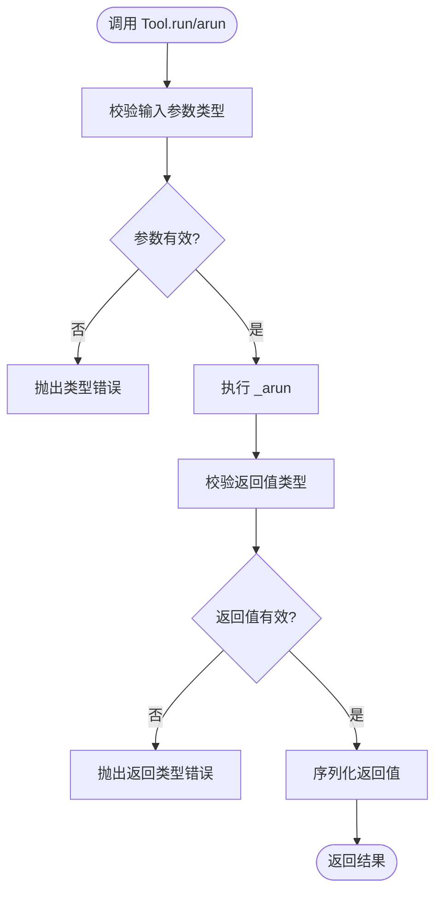

**图表来源**
- [tools/base.py:94-142](file://src/agentscope_runtime/tools/base.py#L94-L142)
- [tools/base.py:162-194](file://src/agentscope_runtime/tools/base.py#L162-L194)

**章节来源**
- [tools/base.py:34-265](file://src/agentscope_runtime/tools/base.py#L34-L265)
- [engine/schemas/agent_schemas.py:80-121](file://src/agentscope_runtime/engine/schemas/agent_schemas.py#L80-L121)

### 图像生成工具（Text-to-Image）
- 功能：接收文本提示词与尺寸等参数，调用 DashScope 图像生成服务，异步轮询任务状态，最终返回图片 URL 列表。
- 关键点：参数映射、超时控制、任务状态轮询、请求 ID 与追踪集成。
- 接口与参数：输入模型包含提示词、尺寸、负向提示词、数量、水印等；输出模型包含结果 URL 列表与请求 ID。

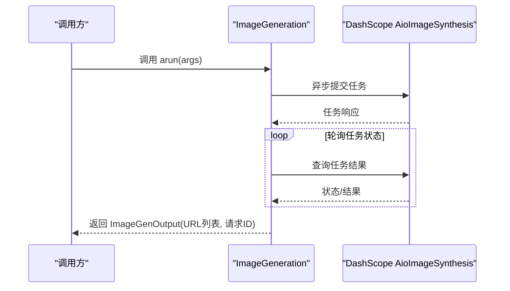

**图表来源**
- [tools/generations/image_generation.py:78-203](file://src/agentscope_runtime/tools/generations/image_generation.py#L78-L203)

**章节来源**
- [tools/generations/image_generation.py:21-203](file://src/agentscope_runtime/tools/generations/image_generation.py#L21-L203)

### 搜索工具（ModelStudio 网页搜索）
- 功能：将用户消息与搜索选项转换为 DashScope 搜索请求，处理结果并格式化输出，支持引用与来源展示。
- 关键点：搜索策略配置、超时控制、结果过滤与格式化、知识构建辅助。
- 接口与参数：输入包含消息列表、搜索选项、输出规则、超时等；输出为格式化字符串与附加信息。

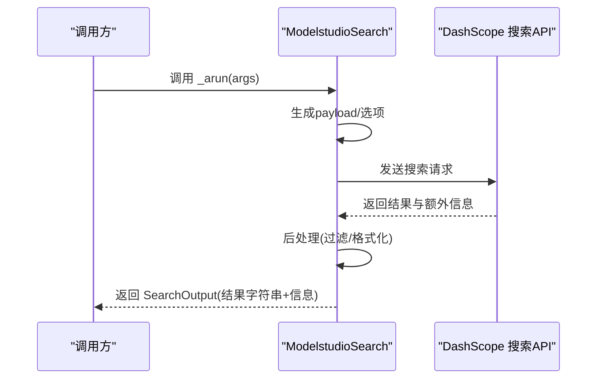

**图表来源**
- [tools/searches/modelstudio_search.py:114-221](file://src/agentscope_runtime/tools/searches/modelstudio_search.py#L114-L221)

**章节来源**
- [tools/searches/modelstudio_search.py:47-221](file://src/agentscope_runtime/tools/searches/modelstudio_search.py#L47-L221)

### 记忆工具（ModelStudio Memory）
- 功能：提供添加、搜索、列出、删除记忆节点，以及创建/获取/列出/删除用户档案模式等能力。
- 关键点：统一的 HTTP 请求封装、响应解析、分页与过滤、错误处理。
- 接口与参数：各操作对应独立输入/输出模型，支持分页参数与最小分数过滤。

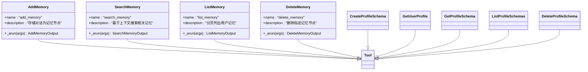

**图表来源**
- [tools/modelstudio_memory/core.py:55-158](file://src/agentscope_runtime/tools/modelstudio_memory/core.py#L55-L158)
- [tools/modelstudio_memory/core.py:160-247](file://src/agentscope_runtime/tools/modelstudio_memory/core.py#L160-L247)
- [tools/modelstudio_memory/core.py:250-339](file://src/agentscope_runtime/tools/modelstudio_memory/core.py#L250-L339)
- [tools/modelstudio_memory/core.py:342-431](file://src/agentscope_runtime/tools/modelstudio_memory/core.py#L342-L431)
- [tools/modelstudio_memory/core.py:433-514](file://src/agentscope_runtime/tools/modelstudio_memory/core.py#L433-L514)
- [tools/modelstudio_memory/core.py:517-621](file://src/agentscope_runtime/tools/modelstudio_memory/core.py#L517-L621)
- [tools/modelstudio_memory/core.py:623-711](file://src/agentscope_runtime/tools/modelstudio_memory/core.py#L623-L711)
- [tools/modelstudio_memory/core.py:714-797](file://src/agentscope_runtime/tools/modelstudio_memory/core.py#L714-L797)

**章节来源**
- [tools/modelstudio_memory/core.py:55-800](file://src/agentscope_runtime/tools/modelstudio_memory/core.py#L55-L800)

### 支付工具（支付宝）
- 功能：移动端/网页端支付下单、交易查询、退款与退款查询。
- 关键点：SDK 客户端封装、扩展参数注入、幂等退款、错误处理与日志。
- 接口与参数：分别针对移动端与网页端的输入模型，统一输出为包含链接或状态信息的文本。

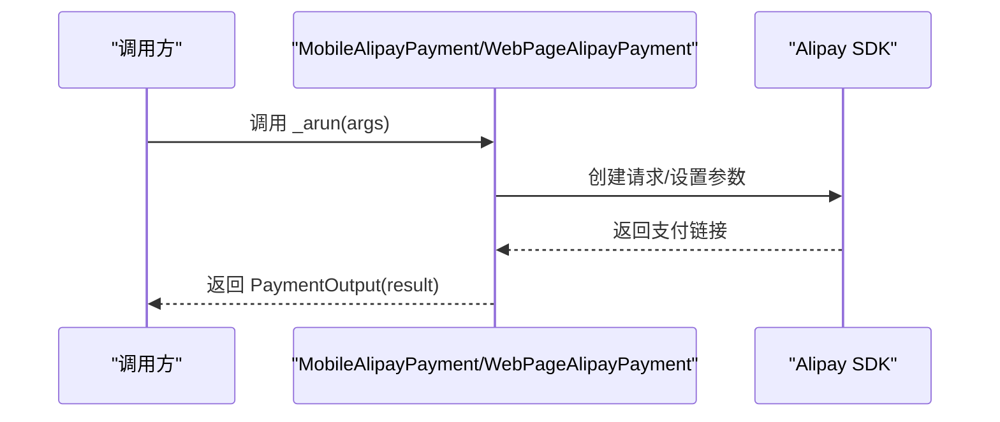

**图表来源**
- [tools/alipay/payment.py:170-308](file://src/agentscope_runtime/tools/alipay/payment.py#L170-L308)
- [tools/alipay/payment.py:310-409](file://src/agentscope_runtime/tools/alipay/payment.py#L310-L409)

**章节来源**
- [tools/alipay/payment.py:81-836](file://src/agentscope_runtime/tools/alipay/payment.py#L81-L836)

### 实时客户端（ASR/TTS）
- 功能：抽象的实时组件基类，定义 ASR/TTS/VoiceChat/VideoChat 类型与状态机；具体客户端提供启动、停止、关闭与数据发送接口。
- 关键点：统一的状态管理、回调机制、配置注入。

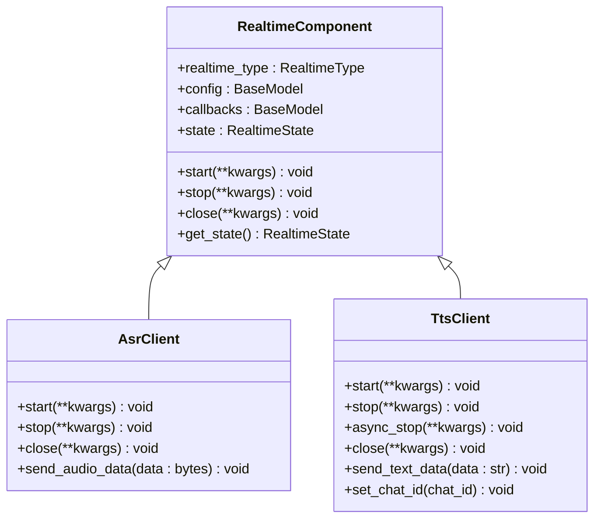

**图表来源**
- [tools/realtime_clients/realtime_tool.py:21-56](file://src/agentscope_runtime/tools/realtime_clients/realtime_tool.py#L21-L56)
- [tools/realtime_clients/asr_client.py:13-28](file://src/agentscope_runtime/tools/realtime_clients/asr_client.py#L13-L28)
- [tools/realtime_clients/tts_client.py:13-34](file://src/agentscope_runtime/tools/realtime_clients/tts_client.py#L13-L34)

**章节来源**
- [tools/realtime_clients/realtime_tool.py:1-56](file://src/agentscope_runtime/tools/realtime_clients/realtime_tool.py#L1-L56)
- [tools/realtime_clients/asr_client.py:1-28](file://src/agentscope_runtime/tools/realtime_clients/asr_client.py#L1-L28)
- [tools/realtime_clients/tts_client.py:1-34](file://src/agentscope_runtime/tools/realtime_clients/tts_client.py#L1-L34)

### MCP 工具封装
- 功能：将任意 Tool 包装为 MCP 工具，自动推导参数类型与默认值，注入 ctx 上下文，更新工具 schema 并移除 ctx 字段。
- 关键点：动态生成签名、参数过滤、JSON 序列化返回、追踪 ID 注入。

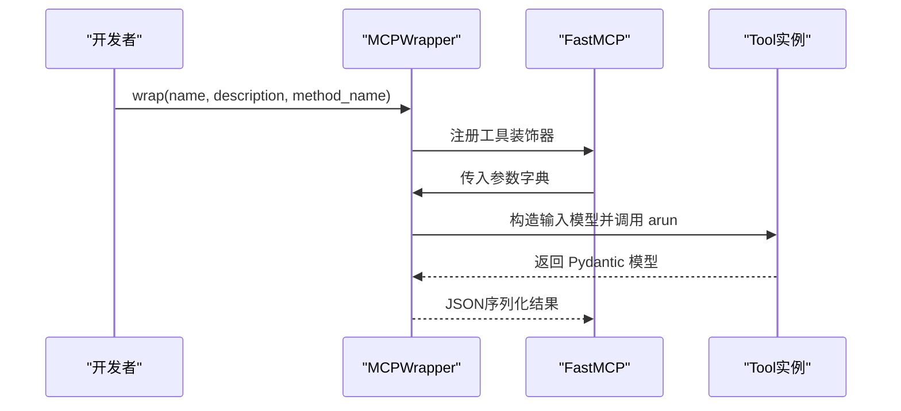

**图表来源**
- [tools/mcp_wrapper.py:37-216](file://src/agentscope_runtime/tools/mcp_wrapper.py#L37-L216)

**章节来源**
- [tools/mcp_wrapper.py:14-216](file://src/agentscope_runtime/tools/mcp_wrapper.py#L14-L216)

### 适配器：AgentScope 与 AutoGen
- AgentScope 适配器：将 Tool 转换为 RegisteredToolFunction，生成 OpenAI 风格 schema，支持同步/异步执行与错误包装。
- AutoGen 适配器：将 Tool 包装为 AutoGen BaseTool，支持取消令牌与 JSON 序列化返回。

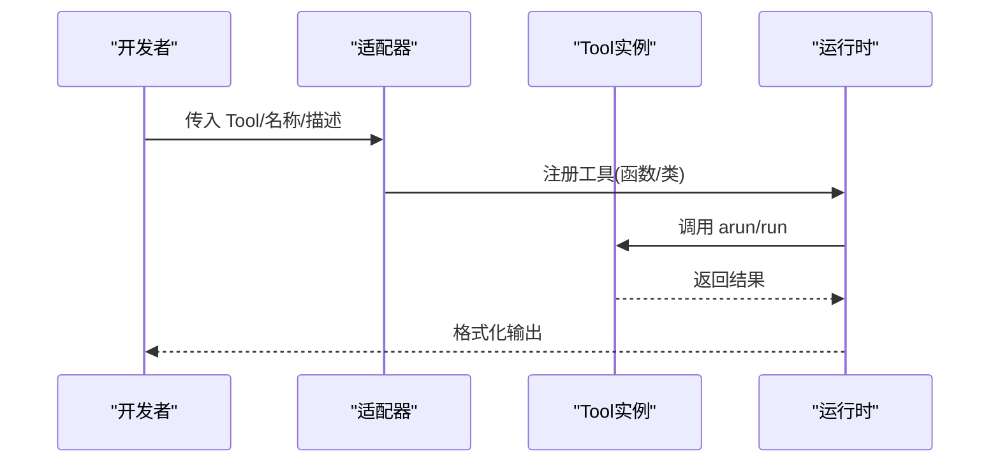

**图表来源**
- [adapters/agentscope/tool/tool.py:17-169](file://src/agentscope_runtime/adapters/agentscope/tool/tool.py#L17-L169)
- [adapters/autogen/tool/tool.py:28-138](file://src/agentscope_runtime/adapters/autogen/tool/tool.py#L28-L138)

**章节来源**
- [adapters/agentscope/tool/tool.py:17-232](file://src/agentscope_runtime/adapters/agentscope/tool/tool.py#L17-L232)
- [adapters/autogen/tool/tool.py:28-212](file://src/agentscope_runtime/adapters/autogen/tool/tool.py#L28-L212)

## 依赖关系分析
- 工具基类依赖 Pydantic 进行参数与返回值校验，依赖引擎的 FunctionTool/FunctionParameters 模式。
- MCP 封装器依赖 FastMCP 与追踪工具，动态生成函数签名并注入 ctx。
- 适配器依赖上游框架的工具接口（AgentScope Toolkit/RegisteredToolFunction、AutoGen BaseTool）。
- 生成/搜索/支付等工具依赖 DashScope/Alipay SDK 与环境变量配置。

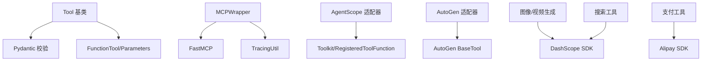

**图表来源**
- [tools/base.py:18-25](file://src/agentscope_runtime/tools/base.py#L18-L25)
- [tools/mcp_wrapper.py:6-11](file://src/agentscope_runtime/tools/mcp_wrapper.py#L6-L11)
- [adapters/agentscope/tool/tool.py:11-14](file://src/agentscope_runtime/adapters/agentscope/tool/tool.py#L11-L14)
- [adapters/autogen/tool/tool.py:23-25](file://src/agentscope_runtime/adapters/autogen/tool/tool.py#L23-L25)
- [tools/generations/image_generation.py:12-18](file://src/agentscope_runtime/tools/generations/image_generation.py#L12-L18)
- [tools/alipay/payment.py:19-59](file://src/agentscope_runtime/tools/alipay/payment.py#L19-L59)
- [tools/searches/modelstudio_search.py:17-27](file://src/agentscope_runtime/tools/searches/modelstudio_search.py#L17-L27)

**章节来源**
- [engine/schemas/agent_schemas.py:80-121](file://src/agentscope_runtime/engine/schemas/agent_schemas.py#L80-L121)
- [tools/_constants.py:1-19](file://src/agentscope_runtime/tools/_constants.py#L1-L19)

## 性能考虑
- 异步执行：优先使用 arun，避免阻塞；在同步上下文中通过 async_to_sync 包装，减少线程切换开销。
- 参数校验缓存：输入/输出模型在初始化时解析一次，后续复用，降低重复校验成本。
- 轮询与超时：生成类工具设置合理超时与轮询间隔，避免长时间占用资源。
- SDK 重用：支付与搜索工具复用客户端实例，减少连接建立成本。
- 日志与追踪：通过追踪工具注入 request_id，便于链路定位与性能分析。

[本节为通用指导，无需特定文件来源]

## 故障排除指南
- 参数校验失败：检查输入模型字段与类型，确保 JSON 字符串可被正确解析为 Pydantic 模型。
- API 密钥缺失：确认环境变量或显式传参中包含有效的 API Key，参考密钥获取逻辑。
- 任务超时：生成类工具默认超时与轮询间隔可调整，关注状态轮询与错误返回。
- 支付/退款异常：查看 SDK 返回状态与错误信息，确认订单号与金额参数正确。
- MCP 工具参数不匹配：确认输入模型字段与默认值，避免 ctx 字段冲突。

**章节来源**
- [tools/base.py:214-246](file://src/agentscope_runtime/tools/base.py#L214-L246)
- [tools/utils/api_key_util.py:13-46](file://src/agentscope_runtime/tools/utils/api_key_util.py#L13-L46)
- [tools/generations/image_generation.py:140-181](file://src/agentscope_runtime/tools/generations/image_generation.py#L140-L181)
- [tools/alipay/payment.py:299-308](file://src/agentscope_runtime/tools/alipay/payment.py#L299-L308)

## 结论
工具库系统以 Tool 基类为核心，结合 MCP 封装与多框架适配器，实现了统一、可扩展且易于集成的工具体系。通过清晰的接口规范、参数与返回值校验、以及完善的错误处理与追踪机制，开发者可以快速开发、注册与使用各类工具，满足生成、搜索、记忆、支付与实时交互等多样化需求。

[本节为总结性内容，无需特定文件来源]

## 附录

### 工具注册与配置
- 工具注册：在工具包初始化文件中集中导入并注册工具，形成 MCP 服务器元数据集合。
- 配置要点：API Key、服务端点、模型名称等通过环境变量或构造参数传入。
- 使用示例：通过适配器将工具注册到 AgentScope/AutoGen，或通过 MCPWrapper 暴露为 MCP 工具。

**章节来源**
- [tools/__init__.py:76-120](file://src/agentscope_runtime/tools/__init__.py#L76-L120)
- [tools/_constants.py:4-18](file://src/agentscope_runtime/tools/_constants.py#L4-L18)
- [adapters/agentscope/tool/tool.py:172-232](file://src/agentscope_runtime/adapters/agentscope/tool/tool.py#L172-L232)
- [adapters/autogen/tool/tool.py:140-212](file://src/agentscope_runtime/adapters/autogen/tool/tool.py#L140-L212)
- [tools/mcp_wrapper.py:37-216](file://src/agentscope_runtime/tools/mcp_wrapper.py#L37-L216)