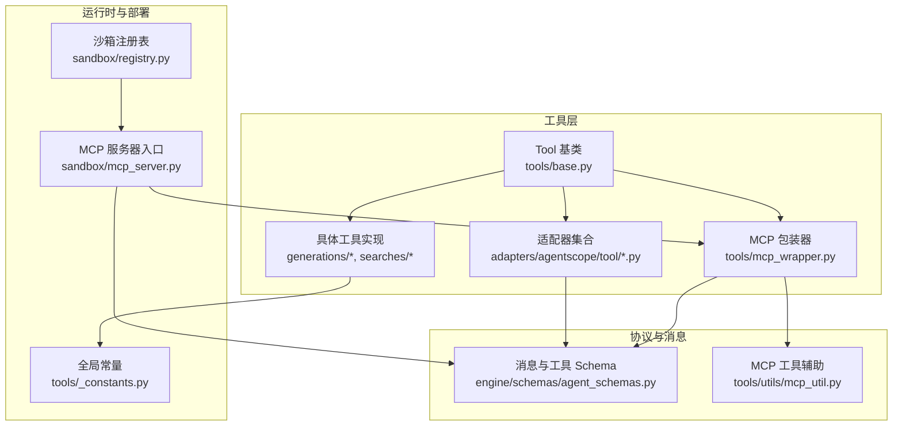
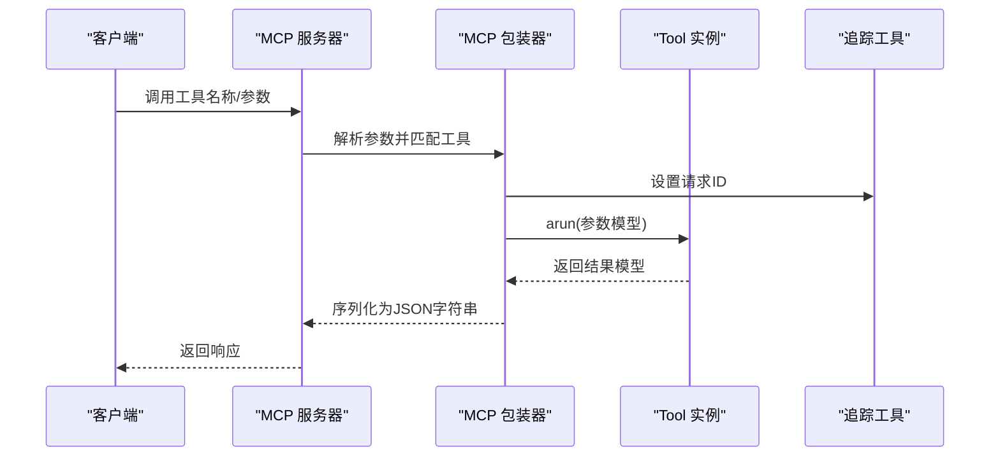
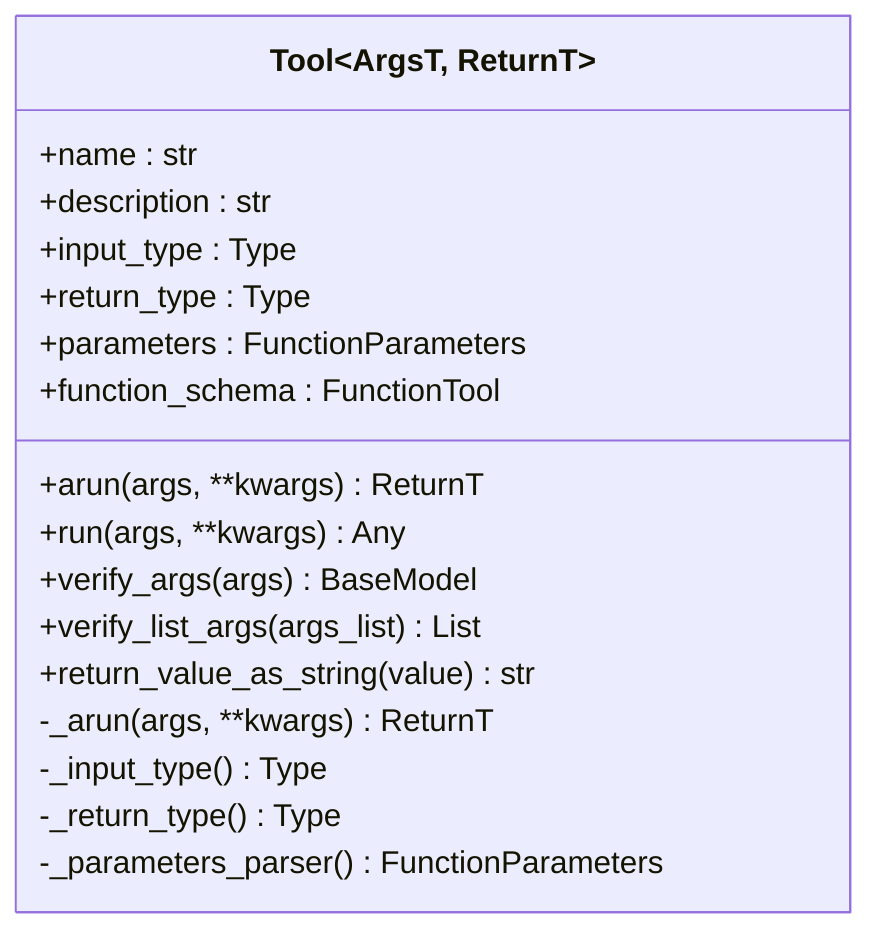
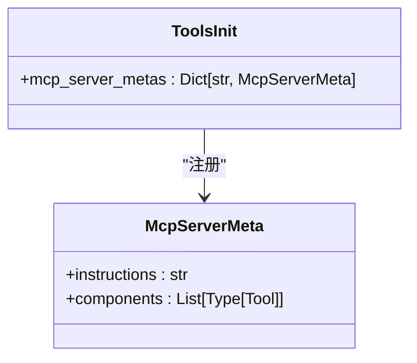
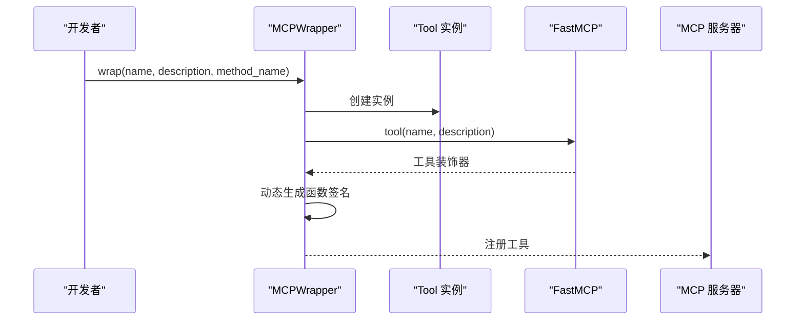
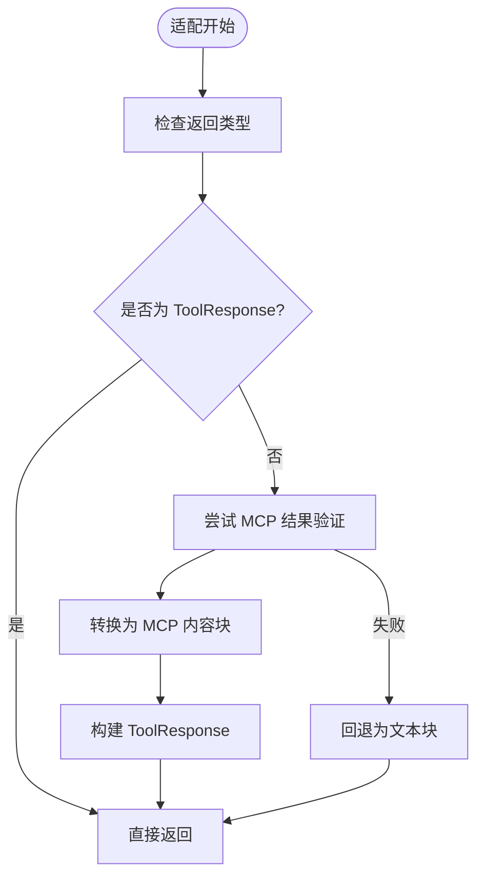
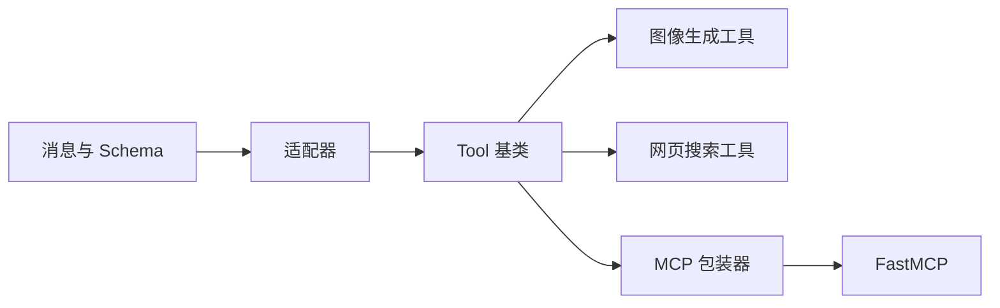

# 工具架构设计

<cite>
**本文档引用的文件**
- [tools/base.py](file://src/agentscope_runtime/tools/base.py)
- [tools/__init__.py](file://src/agentscope_runtime/tools/__init__.py)
- [tools/mcp_wrapper.py](file://src/agentscope_runtime/tools/mcp_wrapper.py)
- [adapters/agentscope/tool/tool.py](file://src/agentscope_runtime/adapters/agentscope/tool/tool.py)
- [adapters/agentscope/tool/sandbox_tool.py](file://src/agentscope_runtime/adapters/agentscope/tool/sandbox_tool.py)
- [engine/schemas/agent_schemas.py](file://src/agentscope_runtime/engine/schemas/agent_schemas.py)
- [tools/_constants.py](file://src/agentscope_runtime/tools/_constants.py)
- [tools/generations/image_generation.py](file://src/agentscope_runtime/tools/generations/image_generation.py)
- [tools/searches/modelstudio_search.py](file://src/agentscope_runtime/tools/searches/modelstudio_search.py)
- [sandbox/mcp_server.py](file://src/agentscope_runtime/sandbox/mcp_server.py)
- [tools/utils/mcp_util.py](file://src/agentscope_runtime/tools/utils/mcp_util.py)
- [sandbox/registry.py](file://src/agentscope_runtime/sandbox/registry.py)
- [README.md](file://README.md)
</cite>

## 目录
1. [简介](#简介)
2. [项目结构](#项目结构)
3. [核心组件](#核心组件)
4. [架构总览](#架构总览)
5. [详细组件分析](#详细组件分析)
6. [依赖关系分析](#依赖关系分析)
7. [性能考虑](#性能考虑)
8. [故障排查指南](#故障排查指南)
9. [结论](#结论)
10. [附录](#附录)

## 简介
本文件面向工具架构设计，系统阐述 AgentScope Runtime 的工具系统设计理念、架构模式与实现细节。重点包括：
- Tool 基类的设计原理、接口规范与抽象方法
- 工具注册机制、元数据管理与 MCP 协议适配器
- 工具生命周期管理、依赖注入与配置系统
- 工具分类体系与命名规范
- 工具扩展点与插件机制
- 异步工具与同步工具的区别与实现
- 工具开发最佳实践与设计模式

## 项目结构
工具系统位于 agentscope_runtime/tools 目录，围绕 Tool 基类构建，提供统一的类型安全封装与跨框架适配能力。核心目录与文件如下：
- tools/base.py：Tool 基类与通用工具接口
- tools/__init__.py：工具导出与 MCP 服务器元数据
- tools/mcp_wrapper.py：MCP 适配器包装器
- adapters/agentscope/tool/tool.py：AgentScope 适配器
- adapters/agentscope/tool/sandbox_tool.py：沙箱工具适配器
- engine/schemas/agent_schemas.py：消息与工具 Schema 定义
- tools/_constants.py：全局常量与环境变量
- tools/generations/* 与 tools/searches/*：具体工具实现示例
- sandbox/mcp_server.py：MCP 服务器入口
- tools/utils/mcp_util.py：MCP 工具辅助函数
- sandbox/registry.py：沙箱注册表

**图表来源**
- [tools/base.py:1-265](file://src/agentscope_runtime/tools/base.py#L1-L265)
- [tools/mcp_wrapper.py:1-216](file://src/agentscope_runtime/tools/mcp_wrapper.py#L1-L216)
- [adapters/agentscope/tool/tool.py:1-232](file://src/agentscope_runtime/adapters/agentscope/tool/tool.py#L1-L232)
- [engine/schemas/agent_schemas.py:1-800](file://src/agentscope_runtime/engine/schemas/agent_schemas.py#L1-L800)
- [tools/utils/mcp_util.py:1-36](file://src/agentscope_runtime/tools/utils/mcp_util.py#L1-L36)
- [sandbox/mcp_server.py:1-192](file://src/agentscope_runtime/sandbox/mcp_server.py#L1-L192)
- [sandbox/registry.py:1-131](file://src/agentscope_runtime/sandbox/registry.py#L1-L131)
- [tools/_constants.py:1-19](file://src/agentscope_runtime/tools/_constants.py#L1-L19)

**章节来源**
- [README.md:86-106](file://README.md#L86-L106)
- [tools/base.py:34-265](file://src/agentscope_runtime/tools/base.py#L34-L265)
- [tools/__init__.py:65-120](file://src/agentscope_runtime/tools/__init__.py#L65-L120)

## 核心组件
- Tool 基类：提供统一的异步执行接口、类型安全的输入输出校验、参数 Schema 生成与字符串化转换等能力。
- MCP 包装器：将 Tool 封装为 MCP 工具，自动处理参数签名、类型注解与 ctx 注入。
- 适配器：将 Tool 适配到不同框架（如 AgentScope、LangGraph、AutoGen 等）。
- 具体工具实现：如图像生成、网页搜索等，遵循 Tool 基类约定。
- 消息与 Schema：统一的消息类型、工具 Schema 与 MCP 协议数据结构。

**章节来源**
- [tools/base.py:34-161](file://src/agentscope_runtime/tools/base.py#L34-L161)
- [tools/mcp_wrapper.py:14-216](file://src/agentscope_runtime/tools/mcp_wrapper.py#L14-L216)
- [adapters/agentscope/tool/tool.py:17-232](file://src/agentscope_runtime/adapters/agentscope/tool/tool.py#L17-L232)
- [engine/schemas/agent_schemas.py:80-262](file://src/agentscope_runtime/engine/schemas/agent_schemas.py#L80-L262)

## 架构总览
工具系统采用“基类 + 适配器 + 协议桥接”的分层架构：
- 基类层：Tool 提供统一的异步执行与类型校验能力
- 适配器层：将 Tool 适配到不同框架与协议
- 协议层：MCP、OpenAI Function Schema、AgentScope Toolkit 等
- 运行时层：沙箱、部署与注册表

**图表来源**
- [sandbox/mcp_server.py:109-139](file://src/agentscope_runtime/sandbox/mcp_server.py#L109-L139)
- [tools/mcp_wrapper.py:37-216](file://src/agentscope_runtime/tools/mcp_wrapper.py#L37-L216)
- [tools/base.py:75-127](file://src/agentscope_runtime/tools/base.py#L75-L127)
- [tools/utils/mcp_util.py:10-36](file://src/agentscope_runtime/tools/utils/mcp_util.py#L10-L36)

## 详细组件分析

### Tool 基类设计与接口规范
- 设计原理
  - 使用泛型约束输入/输出类型，确保类型安全
  - 通过 Pydantic 模型自动生成函数 Schema，保证跨框架一致性
  - 支持同步与异步两种调用方式，异步优先以提升吞吐
- 接口规范
  - 必须实现异步执行方法 _arun，同步 run 通过异步转同步桥接
  - 内置输入/输出类型解析与参数 Schema 生成
  - 提供参数验证与字符串化转换工具方法
- 抽象方法
  - _arun(args, **kwargs) -> 返回值类型必须符合 return_type

**图表来源**
- [tools/base.py:34-265](file://src/agentscope_runtime/tools/base.py#L34-L265)

**章节来源**
- [tools/base.py:34-161](file://src/agentscope_runtime/tools/base.py#L34-L161)
- [tools/base.py:162-246](file://src/agentscope_runtime/tools/base.py#L162-L246)

### 工具注册机制与元数据管理
- 工具注册
  - 通过 tools/__init__.py 中的 McpServerMeta 与 components 列表注册工具
  - 每个 MCP 服务器标签对应一组工具集合
- 元数据
  - instructions 描述服务用途
  - components 列表包含具体工具类
- 使用场景
  - 用于 MCP 服务器按组暴露工具集
  - 便于按功能域组织与发现工具

**图表来源**
- [tools/__init__.py:65-120](file://src/agentscope_runtime/tools/__init__.py#L65-L120)

**章节来源**
- [tools/__init__.py:65-120](file://src/agentscope_runtime/tools/__init__.py#L65-L120)

### MCP 协议适配器
- MCPWrapper
  - 将 Tool 包装为 MCP 工具，动态生成签名与类型注解
  - 处理 ctx 参数注入与请求 ID 传递
  - 更新工具 Schema，移除内部上下文字段
- sandbox/mcp_server.py
  - 动态解析 MCP 工具 Schema 并注册装饰器
  - 提供工具列表与调用桥接

**图表来源**
- [tools/mcp_wrapper.py:27-216](file://src/agentscope_runtime/tools/mcp_wrapper.py#L27-L216)
- [sandbox/mcp_server.py:109-139](file://src/agentscope_runtime/sandbox/mcp_server.py#L109-L139)

**章节来源**
- [tools/mcp_wrapper.py:14-216](file://src/agentscope_runtime/tools/mcp_wrapper.py#L14-L216)
- [sandbox/mcp_server.py:142-192](file://src/agentscope_runtime/sandbox/mcp_server.py#L142-L192)

### 适配器与跨框架集成
- AgentScope 适配器
  - 将 Tool 适配为 Toolkit 工具函数，自动处理输入校验与结果格式化
  - 支持同步与异步工具的统一调用
- 沙箱工具适配器
  - 将沙箱工具输出转换为 ToolResponse，兼容 Toolkit

**图表来源**
- [adapters/agentscope/tool/sandbox_tool.py:15-70](file://src/agentscope_runtime/adapters/agentscope/tool/sandbox_tool.py#L15-L70)

**章节来源**
- [adapters/agentscope/tool/tool.py:17-232](file://src/agentscope_runtime/adapters/agentscope/tool/tool.py#L17-L232)
- [adapters/agentscope/tool/sandbox_tool.py:15-70](file://src/agentscope_runtime/adapters/agentscope/tool/sandbox_tool.py#L15-L70)

### 工具生命周期管理与依赖注入
- 生命周期
  - 初始化：构造 Tool 实例，解析输入/输出类型与 Schema
  - 执行：arun 异步执行，run 同步桥接
  - 清理：由上层框架或容器负责资源释放
- 依赖注入
  - 通过构造函数注入名称与描述
  - 通过环境变量与常量注入外部依赖（如 API Key）

**章节来源**
- [tools/base.py:42-74](file://src/agentscope_runtime/tools/base.py#L42-L74)
- [tools/_constants.py:4-19](file://src/agentscope_runtime/tools/_constants.py#L4-L19)

### 配置系统
- 环境变量
  - BASE_URL、DASHSCOPE_HTTP_BASE_URL、DASHSCOPE_WEBSOCKET_BASE_URL、DASHSCOPE_API_KEY、NLP_API_KEY
- 工具配置
  - 通过构造函数覆盖默认名称与描述
  - 通过 kwargs 传入模型名、超时等参数

**章节来源**
- [tools/_constants.py:4-19](file://src/agentscope_runtime/tools/_constants.py#L4-L19)
- [tools/generations/image_generation.py:111-114](file://src/agentscope_runtime/tools/generations/image_generation.py#L111-L114)

### 工具分类体系与命名规范
- 分类体系
  - 生成类：图像生成、视频生成、语音合成等
  - 搜索类：网页搜索、RAG 等
  - 实时客户端：ASR、TTS 等
  - 支付类：支付、订阅等
- 命名规范
  - 工具类名：动宾结构或名词短语，如 ImageGeneration、ModelstudioSearch
  - 输入/输出模型：类名后缀 *_Input/*_Output，如 ImageGenInput/ImageGenOutput
  - 方法命名：arun/_arun 为异步执行入口

**章节来源**
- [tools/generations/image_generation.py:70-80](file://src/agentscope_runtime/tools/generations/image_generation.py#L70-L80)
- [tools/searches/modelstudio_search.py:102-111](file://src/agentscope_runtime/tools/searches/modelstudio_search.py#L102-L111)

### 异步工具与同步工具
- 异步工具
  - 基类强制异步执行，提升并发与吞吐
  - 工具实现应避免阻塞操作，合理使用异步 I/O
- 同步工具
  - run 方法通过异步转同步桥接，适用于非事件循环环境
  - 适配器自动检测并处理同步/异步差异

**章节来源**
- [tools/base.py:94-142](file://src/agentscope_runtime/tools/base.py#L94-L142)
- [adapters/agentscope/tool/tool.py:83-98](file://src/agentscope_runtime/adapters/agentscope/tool/tool.py#L83-L98)

### 工具开发最佳实践与设计模式
- 单一职责：每个工具专注一类企业能力
- 类型边界：严格定义输入/输出 Pydantic 模型
- 适配器友好：遵循统一 Schema，减少框架间差异
- 观测能力就绪：利用基类钩子与追踪工具
- 异步优先：优先实现异步执行，兼顾同步桥接

**章节来源**
- [README.md:86-106](file://README.md#L86-L106)
- [tools/base.py:75-127](file://src/agentscope_runtime/tools/base.py#L75-L127)

## 依赖关系分析
- 组件耦合
  - Tool 基类与具体工具实现低耦合，通过泛型与 Schema 解耦
  - MCP 包装器与适配器对 Tool 的依赖为弱依赖，便于扩展
- 外部依赖
  - MCP 协议库、FastMCP、Pydantic、aiohttp 等
- 循环依赖
  - 当前结构未见循环导入，适配器与工具分层清晰

**图表来源**
- [tools/base.py:34-265](file://src/agentscope_runtime/tools/base.py#L34-L265)
- [tools/mcp_wrapper.py:14-216](file://src/agentscope_runtime/tools/mcp_wrapper.py#L14-L216)
- [adapters/agentscope/tool/tool.py:17-232](file://src/agentscope_runtime/adapters/agentscope/tool/tool.py#L17-L232)
- [engine/schemas/agent_schemas.py:80-262](file://src/agentscope_runtime/engine/schemas/agent_schemas.py#L80-L262)

**章节来源**
- [tools/base.py:34-161](file://src/agentscope_runtime/tools/base.py#L34-L161)
- [tools/mcp_wrapper.py:14-216](file://src/agentscope_runtime/tools/mcp_wrapper.py#L14-L216)

## 性能考虑
- 异步执行优先：工具实现应使用异步 I/O，避免阻塞事件循环
- 参数校验前置：通过 Pydantic 在进入工具逻辑前完成参数校验
- 结果序列化最小化：仅在适配器或 MCP 层进行必要的序列化
- 超时与重试：结合追踪与日志，合理设置超时与重试策略

## 故障排查指南
- 输入/输出类型错误
  - 现象：抛出类型不匹配异常
  - 排查：确认输入/输出模型与泛型类型一致
- 参数验证失败
  - 现象：抛出校验错误
  - 排查：检查 JSON 格式与字段类型
- MCP 工具注册冲突
  - 现象：同名工具被跳过
  - 排查：修改工具名称或避免重复注册
- 请求 ID 缺失
  - 现象：追踪 ID 不一致
  - 排查：确保 ctx 正确传递与提取

**章节来源**
- [tools/base.py:111-127](file://src/agentscope_runtime/tools/base.py#L111-L127)
- [tools/base.py:227-246](file://src/agentscope_runtime/tools/base.py#L227-L246)
- [sandbox/mcp_server.py:91-106](file://src/agentscope_runtime/sandbox/mcp_server.py#L91-L106)
- [tools/utils/mcp_util.py:10-36](file://src/agentscope_runtime/tools/utils/mcp_util.py#L10-L36)

## 结论
AgentScope Runtime 的工具架构以 Tool 基类为核心，通过 MCP 包装器与多框架适配器实现跨协议、跨框架的统一工具体验。其设计强调类型安全、异步优先与可观测性，配合完善的注册与元数据管理机制，为复杂应用场景下的工具扩展与治理提供了坚实基础。

## 附录
- 示例工具实现参考
  - 图像生成：[tools/generations/image_generation.py:70-203](file://src/agentscope_runtime/tools/generations/image_generation.py#L70-L203)
  - 网页搜索：[tools/searches/modelstudio_search.py:102-221](file://src/agentscope_runtime/tools/searches/modelstudio_search.py#L102-L221)
- 沙箱与注册表
  - MCP 服务器入口：[sandbox/mcp_server.py:142-192](file://src/agentscope_runtime/sandbox/mcp_server.py#L142-L192)
  - 沙箱注册表：[sandbox/registry.py:33-131](file://src/agentscope_runtime/sandbox/registry.py#L33-L131)