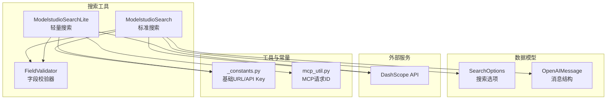
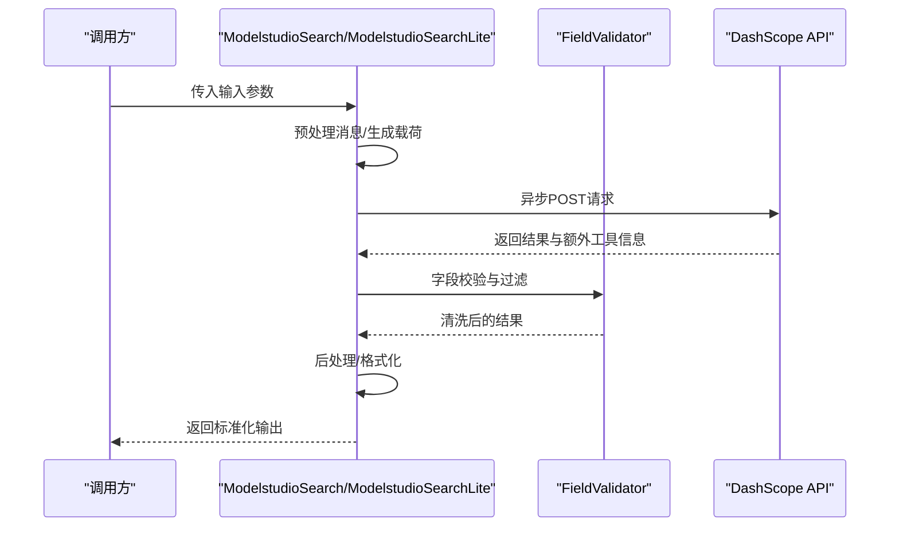
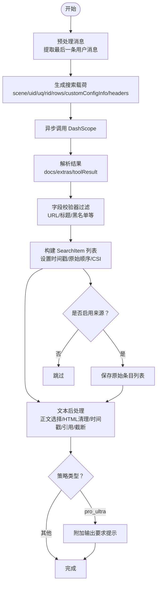
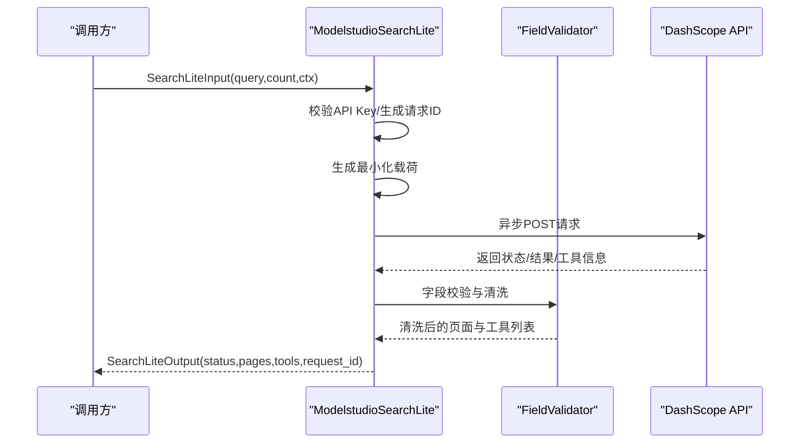
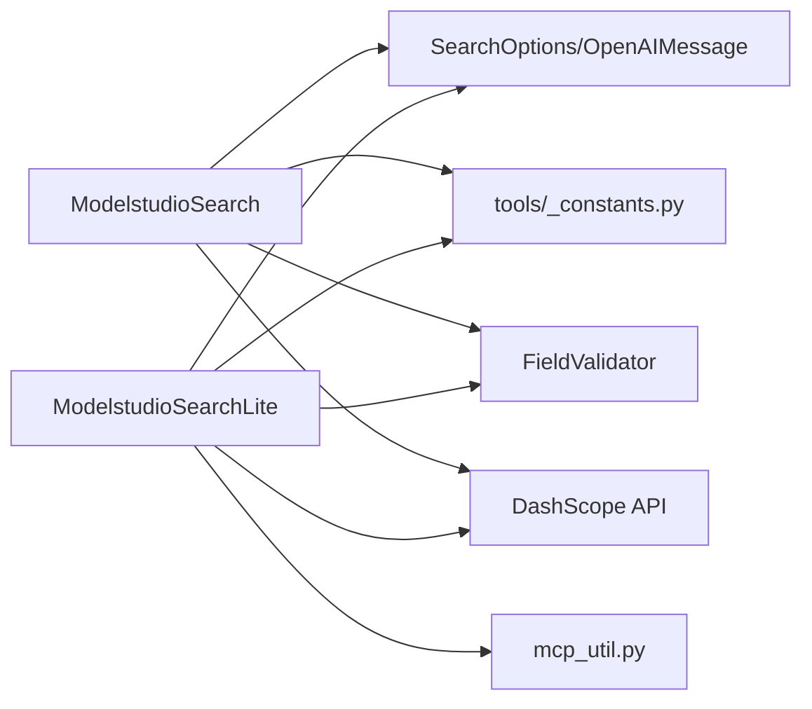

# 搜索工具

<cite>
**本文档引用的文件**
- [modelstudio_search.py](file://src/agentscope_runtime/tools/searches/modelstudio_search.py)
- [modelstudio_search_lite.py](file://src/agentscope_runtime/tools/searches/modelstudio_search_lite.py)
- [modelstudio_rag.py](file://src/agentscope_runtime/tools/RAGs/modelstudio_rag.py)
- [modelstudio_rag_lite.py](file://src/agentscope_runtime/tools/RAGs/modelstudio_rag_lite.py)
- [modelstudio_llm.py](file://src/agentscope_runtime/engine/schemas/modelstudio_llm.py)
- [_constants.py](file://src/agentscope_runtime/tools/_constants.py)
- [mcp_util.py](file://src/agentscope_runtime/tools/utils/mcp_util.py)
- [test_search.py](file://tests/tools/test_search.py)
- [modelstudio_search.md](file://cookbook/zh/tools/modelstudio_search.md)
</cite>

## 目录
1. [简介](#简介)
2. [项目结构](#项目结构)
3. [核心组件](#核心组件)
4. [架构总览](#架构总览)
5. [详细组件分析](#详细组件分析)
6. [依赖关系分析](#依赖关系分析)
7. [性能考量](#性能考量)
8. [故障排查指南](#故障排查指南)
9. [结论](#结论)
10. [附录](#附录)

## 简介
本文件面向搜索工具的使用者与维护者，系统性阐述 ModelStudio 搜索工具的搜索算法与结果排序机制、轻量级搜索工具（SearchLite）的优化特性与适用场景、搜索参数配置与过滤条件、结果数据结构与字段含义、性能优化策略与缓存机制、失败处理与降级策略、扩展与定制能力，以及结果后处理与格式化方法。文档同时给出关键流程图与时序图，帮助读者从整体到细节全面理解搜索工具的设计与实现。

## 项目结构
搜索工具位于工具层的 searches 子模块，核心文件包括：
- 标准搜索工具：modelstudio_search.py
- 轻量搜索工具：modelstudio_search_lite.py
- 搜索相关数据模型：engine/schemas/modelstudio_llm.py 中的 SearchOptions 等
- 工具常量：tools/_constants.py
- MCP 请求 ID 工具：tools/utils/mcp_util.py
- 测试用例：tests/tools/test_search.py
- 中文使用手册：cookbook/zh/tools/modelstudio_search.md

图表来源
- [modelstudio_search.py:102-221](file://src/agentscope_runtime/tools/searches/modelstudio_search.py#L102-L221)
- [modelstudio_search_lite.py:78-194](file://src/agentscope_runtime/tools/searches/modelstudio_search_lite.py#L78-L194)
- [modelstudio_llm.py:44-94](file://src/agentscope_runtime/engine/schemas/modelstudio_llm.py#L44-L94)
- [_constants.py:4-16](file://src/agentscope_runtime/tools/_constants.py#L4-L16)
- [mcp_util.py:10-35](file://src/agentscope_runtime/tools/utils/mcp_util.py#L10-L35)

章节来源
- [modelstudio_search.py:1-878](file://src/agentscope_runtime/tools/searches/modelstudio_search.py#L1-L878)
- [modelstudio_search_lite.py:1-311](file://src/agentscope_runtime/tools/searches/modelstudio_search_lite.py#L1-L311)
- [modelstudio_llm.py:1-313](file://src/agentscope_runtime/engine/schemas/modelstudio_llm.py#L1-L313)
- [_constants.py:1-19](file://src/agentscope_runtime/tools/_constants.py#L1-L19)
- [mcp_util.py:1-36](file://src/agentscope_runtime/tools/utils/mcp_util.py#L1-L36)

## 核心组件
- ModelstudioSearch（标准搜索）
  - 功能：调用 DashScope 搜索服务，生成搜索载荷、发起异步请求、后处理结果、构建知识片段。
  - 关键流程：输入消息预处理 → 生成搜索载荷 → 异步调用 DashScope → 解析结果与额外工具信息 → 字段校验与结构化 → 文本后处理与引用格式化 → 返回 SearchOutput。
  - 特性：支持多种搜索策略、可选的绿色网络过滤、工具扩展、引用与来源展示、Pro Ultra 策略下的深度输出引导。
- ModelstudioSearchLite（轻量搜索）
  - 功能：简化版搜索，面向 MCP 环境，返回页面与工具结果列表，便于前端直接渲染。
  - 关键流程：校验 API Key → 生成最小化载荷 → 异步调用 DashScope → 解析结果 → 字段校验与清洗 → 返回 SearchLiteOutput。
  - 特性：更短的载荷、更低的网络开销、更少的后处理步骤，适合移动端或边缘侧。
- FieldValidator（字段校验器）
  - 功能：基于规则对搜索结果字段进行过滤、强制存在、排除、黑名单过滤等。
  - 适用：标准搜索与轻量搜索均使用该校验器进行结果清洗。

章节来源
- [modelstudio_search.py:102-221](file://src/agentscope_runtime/tools/searches/modelstudio_search.py#L102-L221)
- [modelstudio_search_lite.py:78-194](file://src/agentscope_runtime/tools/searches/modelstudio_search_lite.py#L78-L194)
- [modelstudio_search.py:787-864](file://src/agentscope_runtime/tools/searches/modelstudio_search.py#L787-L864)
- [modelstudio_search_lite.py:260-311](file://src/agentscope_runtime/tools/searches/modelstudio_search_lite.py#L260-L311)

## 架构总览
标准搜索与轻量搜索共享 DashScope API 调用路径，但后处理与输出结构不同。两者均依赖 SearchOptions 与消息结构，轻量搜索还依赖 MCP 上下文与请求 ID 工具。

图表来源
- [modelstudio_search.py:114-221](file://src/agentscope_runtime/tools/searches/modelstudio_search.py#L114-L221)
- [modelstudio_search_lite.py:87-194](file://src/agentscope_runtime/tools/searches/modelstudio_search_lite.py#L87-L194)
- [modelstudio_search.py:372-498](file://src/agentscope_runtime/tools/searches/modelstudio_search.py#L372-L498)
- [modelstudio_search_lite.py:260-311](file://src/agentscope_runtime/tools/searches/modelstudio_search_lite.py#L260-L311)

## 详细组件分析

### ModelstudioSearch（标准搜索）
- 输入输出数据模型
  - SearchInput：包含 messages、search_options、search_output_rules、search_timeout、type 等。
  - SearchOutput：包含 search_result（字符串）、search_info（字典，含额外工具信息等）。
  - SearchItem：结构化搜索条目，包含标题、正文、链接、时间戳、来源、主机图标、主内容、是否通过 CSI 检查、原始顺序、相关性分数等。
- 搜索策略与载荷
  - 支持多种策略（如 standard、pro、pro_max、pro_ultra、image、turbo、max、lite），不同策略对应不同的 scene 与超时。
  - 载荷包含 scene、uid、uq、rid、fields、page、rows、customConfigInfo（含 qpMultiQueryHistory、readpageConfig、inspection、qpToolPlan、searchIntention 等）、headers（包含超时头）。
- 后处理与排序
  - 将原始结果转换为 SearchItem 列表，按字段校验器过滤无效项；为每个条目设置 original_order、规范化 URL、替换特定域名。
  - 若开启 enable_source，会保留原始未过滤的条目列表供上层使用。
  - 文本后处理：按策略选择正文来源（snippet 或 web_main_body），去除 HTML 标签，按时间戳模板添加收录时间，按字符上限截断，按引用格式插入编号，必要时追加“其他互联网信息”区块。
  - Pro Ultra 策略下会附加输出要求提示，引导生成更深入的回答。
- 知识构建
  - 可将搜索结果与额外工具信息拼接为知识片段，用于后续 LLM 推理。

图表来源
- [modelstudio_search.py:222-319](file://src/agentscope_runtime/tools/searches/modelstudio_search.py#L222-L319)
- [modelstudio_search.py:321-370](file://src/agentscope_runtime/tools/searches/modelstudio_search.py#L321-L370)
- [modelstudio_search.py:372-498](file://src/agentscope_runtime/tools/searches/modelstudio_search.py#L372-L498)
- [modelstudio_search.py:500-650](file://src/agentscope_runtime/tools/searches/modelstudio_search.py#L500-L650)

章节来源
- [modelstudio_search.py:47-84](file://src/agentscope_runtime/tools/searches/modelstudio_search.py#L47-L84)
- [modelstudio_search.py:102-221](file://src/agentscope_runtime/tools/searches/modelstudio_search.py#L102-L221)
- [modelstudio_search.py:222-319](file://src/agentscope_runtime/tools/searches/modelstudio_search.py#L222-L319)
- [modelstudio_search.py:321-370](file://src/agentscope_runtime/tools/searches/modelstudio_search.py#L321-L370)
- [modelstudio_search.py:372-498](file://src/agentscope_runtime/tools/searches/modelstudio_search.py#L372-L498)
- [modelstudio_search.py:500-650](file://src/agentscope_runtime/tools/searches/modelstudio_search.py#L500-L650)

### ModelstudioSearchLite（轻量搜索）
- 输入输出数据模型
  - SearchLiteInput：query、count、ctx（MCP 上下文）。
  - SearchLiteOutput：status（0 成功）、pages（页面列表，包含 snippet/title/url/host 等）、tools（工具调用结果列表）、request_id。
- 载荷与调用
  - 使用固定场景与超时，载荷包含 scene、uq、rid、page、rows、headers。
  - 异步调用 DashScope，解析 status/message/data/docs/extras。
- 后处理
  - 字段校验器过滤，清洗 URL，标准化输出字段；提取额外工具信息为 tools 列表。

图表来源
- [modelstudio_search_lite.py:87-194](file://src/agentscope_runtime/tools/searches/modelstudio_search_lite.py#L87-L194)
- [modelstudio_search_lite.py:196-258](file://src/agentscope_runtime/tools/searches/modelstudio_search_lite.py#L196-L258)
- [modelstudio_search_lite.py:260-311](file://src/agentscope_runtime/tools/searches/modelstudio_search_lite.py#L260-L311)

章节来源
- [modelstudio_search_lite.py:41-76](file://src/agentscope_runtime/tools/searches/modelstudio_search_lite.py#L41-L76)
- [modelstudio_search_lite.py:78-194](file://src/agentscope_runtime/tools/searches/modelstudio_search_lite.py#L78-L194)
- [modelstudio_search_lite.py:196-258](file://src/agentscope_runtime/tools/searches/modelstudio_search_lite.py#L196-L258)
- [modelstudio_search_lite.py:260-311](file://src/agentscope_runtime/tools/searches/modelstudio_search_lite.py#L260-L311)

### 字段校验器（FieldValidator）
- 支持模式：
  - NORMAL：保留非空字段
  - AVOID_EMPTY：仅保留非空字段
  - EXCLUDE：排除该字段
  - FORCE：强制要求字段存在，否则抛错
  - DROPOUT_ENTIRE_IF_MISSING：若缺失则整条丢弃
  - FILTER_ITEMS_FROM_LIST：对列表字段进行黑名单过滤
- 应用：标准搜索与轻量搜索均使用该校验器对 URL、标题等字段进行过滤，保证输出质量。

章节来源
- [modelstudio_search.py:787-864](file://src/agentscope_runtime/tools/searches/modelstudio_search.py#L787-L864)
- [modelstudio_search_lite.py:260-311](file://src/agentscope_runtime/tools/searches/modelstudio_search_lite.py#L260-L311)

### 搜索参数与配置
- SearchOptions（核心配置）
  - enable_source：是否包含来源信息
  - enable_citation：是否包含引用
  - enable_readpage：是否启用全文读取
  - enable_online_read：是否启用在线阅读
  - citation_format：引用格式（默认 [<number>]）
  - search_strategy：搜索策略（standard/pro_ultra/pro/pro_max/image/turbo/max/lite）
  - forced_search：是否强制搜索
  - prepend_search_result：是否前置搜索结果
  - enable_search_extension：是否启用搜索扩展
  - item_cnt：最大返回条目数
  - top_n：前 N 条结果
  - intention_options：意图识别相关选项
- 环境变量
  - DASHSCOPE_API_KEY：DashScope API 密钥
  - DASHSCOPE_HTTP_BASE_URL：DashScope HTTP 基础 URL
  - SEARCH_URL：轻量搜索使用的端点（默认 MCP 搜索）
  - SEARCH_STRATEGY：默认搜索策略（默认 turbo）
  - SEARCH_TIMEOUT：默认超时（秒）

章节来源
- [modelstudio_llm.py:44-94](file://src/agentscope_runtime/engine/schemas/modelstudio_llm.py#L44-L94)
- [_constants.py:4-16](file://src/agentscope_runtime/tools/_constants.py#L4-L16)
- [modelstudio_search_lite.py:22-27](file://src/agentscope_runtime/tools/searches/modelstudio_search_lite.py#L22-L27)

### 搜索结果数据结构与字段含义
- 标准搜索（SearchOutput）
  - search_result：格式化后的搜索文本
  - search_info：包含 extra_tool_info（工具调用结果列表）与可选的 search_results（原始条目列表，当启用来源时）
- 轻量搜索（SearchLiteOutput）
  - status：0 表示成功
  - pages：页面条目列表，包含 snippet、title、url、hostname、hostlogo 等
  - tools：工具调用结果列表，包含 tool 与 result
  - request_id：请求 ID
- 结构化条目（SearchItem）
  - title、body、href、time、source、host_logo、web_main_body、image、csi_checked、relevance、original_order

章节来源
- [modelstudio_search.py:71-84](file://src/agentscope_runtime/tools/searches/modelstudio_search.py#L71-L84)
- [modelstudio_search.py:87-100](file://src/agentscope_runtime/tools/searches/modelstudio_search.py#L87-L100)
- [modelstudio_search_lite.py:54-76](file://src/agentscope_runtime/tools/searches/modelstudio_search_lite.py#L54-L76)

### 搜索算法与排序机制
- 排序依据
  - relevance（相关性分数）由上游服务提供，标准搜索中作为排序权重之一。
  - original_order 用于稳定排序，确保相同相关性时的确定性顺序。
- 过滤与清洗
  - 字段校验器对 URL、标题等进行过滤，黑名单过滤（如 uc/qk/sm 链接）。
  - 对 URL 进行编码与域名替换，确保可用性。
- 文本后处理
  - 选择正文来源（snippet 或 web_main_body），按时间戳模板添加收录时间。
  - 引用编号按策略插入，必要时追加“其他互联网信息”区块。
  - 按字符上限截断，避免输出过长。

章节来源
- [modelstudio_search.py:372-498](file://src/agentscope_runtime/tools/searches/modelstudio_search.py#L372-L498)
- [modelstudio_search.py:500-650](file://src/agentscope_runtime/tools/searches/modelstudio_search.py#L500-L650)

### 轻量搜索（SearchLite）优化特性与适用场景
- 优化特性
  - 最小化载荷：仅包含 scene、uq、rid、page、rows、headers，减少网络传输。
  - 简化后处理：仅清洗 URL、标准化字段，不进行复杂文本格式化。
  - 明确输出：pages 与 tools 分离，便于前端直接渲染。
- 适用场景
  - 移动端或边缘侧资源受限环境
  - 需要快速返回页面与工具信息的场景
  - 与 MCP 协议集成，需要统一请求 ID 的场景

章节来源
- [modelstudio_search_lite.py:78-194](file://src/agentscope_runtime/tools/searches/modelstudio_search_lite.py#L78-L194)
- [mcp_util.py:10-35](file://src/agentscope_runtime/tools/utils/mcp_util.py#L10-L35)

### 性能优化策略与缓存机制
- 性能优化
  - 异步 HTTP 客户端：使用 aiohttp 进行异步请求，提升并发与吞吐。
  - 载荷最小化：轻量搜索移除不必要的字段，降低请求体积。
  - 字段校验：提前过滤无效条目，减少后续处理开销。
- 缓存机制
  - 文档中描述了查询缓存、结果缓存与智能更新策略（见使用手册）。当前实现中未看到显式的本地缓存逻辑，建议在业务层实现基于查询关键字与策略的缓存。

章节来源
- [modelstudio_search.py:321-370](file://src/agentscope_runtime/tools/searches/modelstudio_search.py#L321-L370)
- [modelstudio_search_lite.py:220-258](file://src/agentscope_runtime/tools/searches/modelstudio_search_lite.py#L220-L258)
- [modelstudio_search.md:201-205](file://cookbook/zh/tools/modelstudio_search.md#L201-L205)

### 搜索失败处理与降级策略
- 标准搜索
  - 异常捕获：调用 DashScope 失败时返回空的 SearchOutput。
  - 用户 ID 校验：缺少 user_id 时抛出异常。
- 轻量搜索
  - API Key 校验：缺少 DASHSCOPE_API_KEY 时抛出异常。
  - 异常捕获：调用失败时返回 status=1、空 pages 与 tools。
  - 降级建议：在网络异常时返回空结果并记录 trace 日志，上层可回退至本地缓存或兜底文案。

章节来源
- [modelstudio_search.py:140-148](file://src/agentscope_runtime/tools/searches/modelstudio_search.py#L140-L148)
- [modelstudio_search.py:196-198](file://src/agentscope_runtime/tools/searches/modelstudio_search.py#L196-L198)
- [modelstudio_search_lite.py:105-109](file://src/agentscope_runtime/tools/searches/modelstudio_search_lite.py#L105-L109)
- [modelstudio_search_lite.py:171-178](file://src/agentscope_runtime/tools/searches/modelstudio_search_lite.py#L171-L178)

### 扩展性与定制化能力
- 搜索策略扩展
  - 可通过 SEARCH_STRATEGY_SETTING 新增策略映射，定义 scene 与超时。
- 输出规则定制
  - search_output_rules：通过 FieldValidator 的多种模式定制字段过滤与强制要求。
- 引用与来源
  - 通过 SearchOptions.enable_citation 与 enable_source 控制引用与来源展示。
- MCP 集成
  - 轻量搜索通过 mcp_util 提取 DashScope 请求 ID，便于链路追踪与日志关联。

章节来源
- [modelstudio_search.py:34-43](file://src/agentscope_runtime/tools/searches/modelstudio_search.py#L34-L43)
- [modelstudio_search.py:787-864](file://src/agentscope_runtime/tools/searches/modelstudio_search.py#L787-L864)
- [modelstudio_search_lite.py:22-38](file://src/agentscope_runtime/tools/searches/modelstudio_search_lite.py#L22-L38)
- [mcp_util.py:10-35](file://src/agentscope_runtime/tools/utils/mcp_util.py#L10-L35)

### 搜索结果的后处理与格式化
- 标准搜索
  - 正文来源选择：优先 web_main_body，其次 snippet；达到阈值后切换。
  - HTML 清理：去除标签与多余空白，保留中文排版。
  - 时间戳：随机模板插入收录时间，按条目时间排序。
  - 引用：按 citation_format 插入编号；当启用来源且允许引用时，追加“其他互联网信息”区块。
  - 策略增强：pro_ultra 附加输出要求提示，引导生成更深入回答。
- 轻量搜索
  - 仅清洗 URL、标准化字段，保持 pages 与 tools 的简洁结构。

章节来源
- [modelstudio_search.py:500-650](file://src/agentscope_runtime/tools/searches/modelstudio_search.py#L500-L650)
- [modelstudio_search_lite.py:260-311](file://src/agentscope_runtime/tools/searches/modelstudio_search_lite.py#L260-L311)

## 依赖关系分析
- 外部依赖
  - aiohttp：异步 HTTP 客户端
  - dashscope：DashScope SDK（通过环境变量 API Key 认证）
  - pydantic：数据模型与字段校验
- 内部依赖
  - engine.schemas.modelstudio_llm：SearchOptions、OpenAIMessage 等
  - tools._constants：基础 URL 与 API Key
  - tools.utils.mcp_util：MCP 请求 ID 提取

图表来源
- [modelstudio_search.py:22-27](file://src/agentscope_runtime/tools/searches/modelstudio_search.py#L22-L27)
- [_constants.py:4-16](file://src/agentscope_runtime/tools/_constants.py#L4-L16)
- [modelstudio_search_lite.py:12-19](file://src/agentscope_runtime/tools/searches/modelstudio_search_lite.py#L12-L19)
- [mcp_util.py:10-35](file://src/agentscope_runtime/tools/utils/mcp_util.py#L10-L35)

章节来源
- [modelstudio_search.py:1-30](file://src/agentscope_runtime/tools/searches/modelstudio_search.py#L1-L30)
- [modelstudio_search_lite.py:1-20](file://src/agentscope_runtime/tools/searches/modelstudio_search_lite.py#L1-L20)
- [_constants.py:1-19](file://src/agentscope_runtime/tools/_constants.py#L1-L19)

## 性能考量
- 异步 I/O：使用 aiohttp 替代同步请求，显著提升并发性能。
- 载荷最小化：轻量搜索移除冗余字段，降低网络开销。
- 字段校验：在早期过滤无效条目，减少后续处理成本。
- 建议
  - 在业务层增加查询缓存与结果缓存，结合策略与时间窗口实现智能更新。
  - 对高频查询进行预取与批量处理，进一步降低延迟。

[本节为通用性能讨论，无需具体文件来源]

## 故障排查指南
- 常见问题
  - 缺少 API Key：标准搜索要求 user_id，轻量搜索要求 DASHSCOPE_API_KEY。
  - 网络异常：调用 DashScope 失败时返回空结果或 status=1。
  - 无有效结果：字段校验器过滤导致 pages 为空，检查 SEARCH_RULES 与输入字段。
- 建议处理
  - 记录 trace 日志，包含 payload、search_strategy、timeout 等上下文。
  - 在上层实现重试与降级策略，如回退至缓存或本地兜底文案。
  - 对异常进行分类处理：网络超时、认证失败、参数错误等。

章节来源
- [modelstudio_search.py:140-148](file://src/agentscope_runtime/tools/searches/modelstudio_search.py#L140-L148)
- [modelstudio_search.py:196-198](file://src/agentscope_runtime/tools/searches/modelstudio_search.py#L196-L198)
- [modelstudio_search_lite.py:105-109](file://src/agentscope_runtime/tools/searches/modelstudio_search_lite.py#L105-L109)
- [modelstudio_search_lite.py:171-178](file://src/agentscope_runtime/tools/searches/modelstudio_search_lite.py#L171-L178)

## 结论
ModelStudio 搜索工具提供了从标准到轻量的完整搜索能力，具备灵活的策略配置、严格的字段校验与完善的后处理流程。标准搜索适合需要丰富输出与引用控制的场景，轻量搜索适合移动端与边缘侧的快速查询。通过异步 I/O、最小化载荷与字段校验，工具在性能与质量之间取得平衡。建议在业务层引入缓存与智能更新策略，进一步提升用户体验与系统稳定性。

[本节为总结性内容，无需具体文件来源]

## 附录
- 使用示例与测试
  - 参考单元测试，验证标准搜索的输入输出类型与基本行为。
- 相关组件
  - RAG 组件可与搜索结果结合，提供检索增强生成能力。

章节来源
- [test_search.py:18-46](file://tests/tools/test_search.py#L18-L46)
- [modelstudio_rag.py:74-174](file://src/agentscope_runtime/tools/RAGs/modelstudio_rag.py#L74-L174)
- [modelstudio_rag_lite.py:26-80](file://src/agentscope_runtime/tools/RAGs/modelstudio_rag_lite.py#L26-L80)